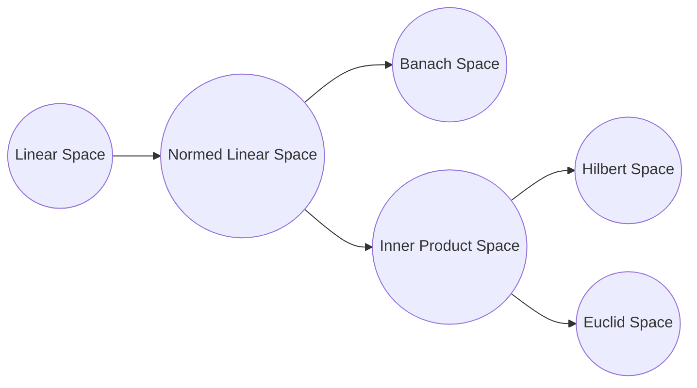

[TOC]

# 统计学习方法

[第一版](https://github.com/kingreatwill/files/tree/main/%E7%BB%9F%E8%AE%A1%E5%AD%A6%E4%B9%A0%E6%96%B9%E6%B3%95/book/Lihang-first_edition)

[第二版](https://github.com/kingreatwill/files/tree/main/%E7%BB%9F%E8%AE%A1%E5%AD%A6%E4%B9%A0%E6%96%B9%E6%B3%95/book/Lihang-second_edition)

## 第 1 章 统计学习及监督学习概论

**统计学习的主要特点是**：

1. 统计学习以计算机及网络为平台，是建立在计算机及网络之上的；
2. 统计学习以数据为研究对象，是数据驱动的学科；
3. 统计学习的目的是对数据进行预测与分析；
4. 统计学习以方法为中心，统计学习方法构建模型并应用模型进行预测与分析；
5. 统计学习是概率论、统计学、信息论、计算理论、最优化理论及计算机科学等多个领域的交叉学科，并且在发展中逐步形成独自的理论体系与方法论。

**假设空间(hypothesis space)**：
$$\mathcal H = \{ f(x;\theta) | \theta \in \mathbb{R}^D\} \\ or \quad \mathcal F = \{P|P(Y|X;\theta),\theta \in \mathbb{R}^D\}$$
其中$f(x; \theta)$是参数为$\theta$ 的函数（**决策函数**），也称为模型（Model），参数向量$\theta$取值与$D$维欧式空间$\mathbb{R}^D$,也称为参数空间(parameter space)，$D$ 为参数的数量(维度)

模型的假设空间(hypothesis space)包含所有可能的条件概率分布或决策函数

**特征空间（feature space）**：
每个具体的输入是一个实例（instance），通常由特征向量（feature vector）表示。这
时，所有特征向量存在的空间称为特征空间（feature space）。特征空间的每一维对应于
一个特征。

> 输入空间中的一个输入向量$x = (x_1,x_2)$，在多项式模型中特征向量是($x_1^2,x_1x_2,x_2^2,...$)
> 一般说的线性模型，指的是特征向量的线性组合，而不是指输入向量，所以说模型都是定义在特征空间上的

**统计学习的三要素**：

1. 模型的假设空间(hypothesis space)，简称：模型(model)
2. 模型选择的准则(evaluation criterion)，简称：策略(strategy)或者学习准则
3. 模型学习的算法(algorithm)，简称：算法(algorithm)

> 以线性回归（Linear Regression）为例：
> 模型： $f(x;w,b) = w^Tx +b$
> 策略(strategy)或者学习准则: 平方损失函数 $\mathcal L(y,\hat{y}) = (y-f(x,\theta))^2$
> 算法：解析解analytical solution(闭式解closed-form solution)和数值解numerical solution，如：closed-form的最小二乘的解以及梯度下降法

**机器学习的定义**：

使用训练数据来计算接近目标 𝑓 的假设（hypothesis ）g （来自：[Machine Learning Foundations（机器学习基石）,25 页](https://www.csie.ntu.edu.tw/~htlin/course/mlfound17fall/doc/01_handout.pdf)）

**监督学习**：
监督学习(supervised learning)是指从标注数据中学习预测模型的机器学习问题。本质是**学习输入到输出的映射的统计规律**。

输入变量与输出变量均为连续变量的预测问题称为**回归问题**；
输出变量为有限个离散变量的预测问题称为**分类问题**；
输入变量与输出变量均为变量序列的预测问题称为**标注问题**(可以理解为特殊的分类问题)。

监督学习的模型可以是概率模型或非概率模型，由**条件概率分布**$P(Y|X)$或**决策函数（decision function）**$Y=f(X)$表示，随具体学习方法而定。对具体的输入进行相应的输出预测时，写作$P(y|x)$或$Y=f(x)$。
$$y =\displaystyle\argmax_{y}  P(y|x)$$

**联合概率分布**：
监督学习假设输入与输出的随机变量 X 和 Y 遵循联合概率分布$P(X,Y)$。$P(X,Y)$表示分布函数，或分布密度函数。注意，在学习过程中，假定这一联合概率分布存在，但对学习系统来说，联合概率分布的具体定义是未知的。**训练数据与测试数据被看作是依联合概率分布$P(X,Y)$独立同分布产生的**。
统计学习假设数据存在一定的统计规律，$X$和$Y$具有联合概率分布的假设就是监督学习关于数据的基本假设。

**非监督学习**：
非监督学习(unsupervised learning)是指从无标注数据中学习预测模型的机器学习问题。本质是**学习数据中的统计规律或潜在结构**。

非监督学习的模型可以表示为函数$z = g(x)$或者条件概率分布$P(z|x)$ （输出$z$可以是**聚类**或者**降维**）
$$z =\displaystyle\argmax_{z}  P(z|x)$$
以及 条件概率分布$P(x|z)$ （用来做**概率密度估计**，比如 GMM 中$P(x|z)$属于高斯分布，如果假设知道数据来自哪个高斯分布，即知道$z$，我们可以用极大似然估计来估计相关参数）。

**概率模型（probabilistic model）与非概率模型（non-probabilistic model）或者确定性模型（deterministic model）**：

概率模型（probabilistic model）- 条件概率分布 P(y|x)和 非概率模型（non-probabilistic model） - 函数 y=f(x)可以**相互转化**，条件概率分布最大化后得到函数，函数归一化后得到条件概率分布。所以概率模型与非概率模型的区别不在于输入输出之间的映射关系，而在于模型的内部结构：概率模型一定可以表示为联合概率分布的形式，而非概率模型则不一定存在这样的联合概率分布。

概率模型的代表是**概率图模型（probabilistic graphical model）**$^{参考文献[3]}$，联合概率分布可以根据图的结构分解为因子乘积的形式，可以用最基本的加法规则和乘法规则进行概率推理：
$$P(x) = \sum_yP(x,y) \\ P(x,y) = P(x)P(y|x)$$

**参数化模型（parametric model）和非参数化模型（non-parametric model）**：

参数化模型假设模型参数的维度固定，模型可以由有限维参数完全刻画。(如：感知机、GMM)
非参数化模型假设模型参数的唯独不固定或者说无穷大，随着训练数据量的增加而不断增大。(如：决策树、支持向量机)

**在线学习（online learning）和批量学习（batch learning）**：

在线学习每次接受一个样本，预测后学习模型，并不断重复该操作。
批量学习一次接受所有数据，学习模型之后进行预测。

在线学习比批量学习更难，因为每次模型更新中可利用的数据有限。

**贝叶斯学习（Bayesian learning）/ 贝叶斯推理（Bayesian inference）**：
$$\mathrm{Bayes \; Rule:} \\ \underbrace{P(X|Y)}_{\mathrm{posterior}} = \frac{\overbrace{P(Y|X)}^{\mathrm{likelihood}}\overbrace{P(X)}^{\mathrm{prior}}}{\underbrace{P(Y)}_{\mathrm{evidence}}}   = \frac{\overbrace{P(Y|X)}^{\mathrm{likelihood}}\overbrace{P(X)}^{\mathrm{prior}}}{\underbrace{\sum_{x}P(Y|X)P(X)}_{\mathrm{evidence}}}$$

**核技巧（kernel trick）/ 核方法（kernel method）**：

**核方法**是一类把低维空间的非线性可分问题，转化为高维空间的线性可分问题的方法。
**核技巧**是一种利用核函数直接计算 $\lang \phi(x),\phi(z) \rang$ ，以避开分别计算 $\phi(x)$ 和 $\phi(z)$ ，从而加速核方法计算的技巧。

**核函数**：设 $\mathcal X$ 是输入空间（即 $x_i \in \mathcal X $ ， $\mathcal X$ 是 $\mathbb R^n$ 的子集或离散集合 ），又设 $\mathcal H$ 为特征空间（​ 希尔伯特空间$^{附加知识:各种空间介绍}$），如果存在一个从 $\mathcal X$ 到 $\mathcal H$ 的映射

$$\phi(x) : \mathcal X \to \mathcal H$$

使得对所有 $x,z \in \mathcal X$ ，函数 $K(x,z)$ 满足条件

$$K(x,z) = \phi(x).\phi(z) = \lang \phi(x),\phi(z) \rang$$

则称 $K(x,z)$ 为核函数。其中 $\phi(x) $ 为映射函数， $\lang \phi(x),\phi(z) \rang$ 为内积。

核技巧的想法是，在学习和预测中只定义核函数 $K(x,z)$ ，而不显式地定义映射函数 $\phi $。通常直接计算$K(x,z)$比较容易，而通过$\phi(x) $和$\phi(z) $计算$K(x,z)$并不容易。
> 注意：$\phi $是输入空间$\mathbb{R}^n$到特征空间$\mathcal H$的映射，特征空间$\mathcal H$一般是高维的，甚至是无穷维的。所以$\phi$不好计算，甚至会带来**维度灾难**又称**维度诅咒（Curse of Dimensionality）**$^{附加知识:维度诅咒}$。

### 附加知识
#### 正则化
正则化符合奥卡姆剃刀（Occam's razor）原理。

参考：[L1L2正则化和凸优化](../图解数学/L1L2正则化和凸优化.md)

#### 模型选择

参考：[模型选择](../Model-Selection.md)

#### 各种空间介绍

**线性空间**就是定义了**加法和数乘**的空间(空间里的一个元素就可以由其他元素线性表示)。

---

**度量空间**就是定义了**距离**的空间（曼哈顿距离，欧氏距离，闵可夫斯基距离，马氏距离，切比雪夫距离）。
定义距离时，有三条公理必须遵守：
1. 非负性、同一性：$dist(x_i,x_j) \geq 0$(非负性)，$dist(x_i,x_j) = 0$当且仅当$x_i=x_j$(同一性)
2. 对称性：$dist(x_i,x_j) = dist(x_j,x_i)$
3. 三角不等式(也叫直递性)：$dist(x_i,x_j) \leq dist(x_i,x_k) + dist(x_k,x_j)$
希尔伯特空间(Hilbert)
> 文字解释：【两点之间距离不为负；两个点只有在 空间 上重合才可能距离为零；a 到 b 的距离等于 b 到 a 的距离;a 到 c 的距离加上 c 到 b 的距离大于等于 a 直接到 b 的距离;】

---

**赋范空间**就是定义了**范数**的空间。
x的范数||x||就是x的**长度**。那么这里的长度和上一节中说的距离到底有什么区别呢。**距离的概念是针对两个元素来说的**，例如d(x,y)指的是x与y两个元素之间的距离，而**范数是针对一个元素来说的**，每一个元素都对应一个范数，可以将范数理解为一个元素到零点的距离（这只是一种理解，并不是定义），也就是它自己的长度。
定义：
称 映射$||.|| : \mathbb{R}^n \to \mathbb{R}$为  $\mathbb{R}^n$ 上的范数，当且仅当：
1. 非负性： $\forall x \in \mathbb{R}^n ,||x|| \geq 0$ ,$||x|| = 0$当且仅当$x=0$
2. 数乘：$\forall x \in \mathbb{R}^n ,a \in \mathbb{R}^n, ||ax|| = |a|.||x||$ 
3. 三角不等式: $\forall x,y \in \mathbb{R}^n ,||x+y|| \leq ||x|| + ||y||$ 

如果我们定义了范数，可以在这基础上定义距离：dist(x,y)=||x-y||。根据范数的三条性质，我们可以证明我们这样定义的距离也满足距离的定义，聪明的你可以自己证明一下（对称性的证明，提一个-1出来，一加绝对值就是1了）。

也就是说范数其实是一个更加具体的概念，**有了范数一定能利用范数定义距离，但是有距离不能定义范数**。

也许你会问，你不是说理解范数就是一个元素到零点的距离吗，那定义范数为||x||=dist(x,0) 不就行了吗。这样的话，对于范数的第二条性质就不一定会满足，||ax||=dist(ax,0)，而dist(ax,0)不一定等于|a|dist(x,0)，具体等不等于还要看你的距离是怎么定义的。

了解到这里那么你会发现：
欧式距离对应L2范数
曼哈顿距离对应L1范数

---

**线性赋范空间**就是定义了加法、数乘和范数的空间。

---

**巴拿赫空间**就是**完备的赋范线性空间**。(Banach space)
**完备的空间**的定义：如果一个空间是完备的，那么该空间中的任何一个柯西序列都收敛在该空间之内。

首先来说一下柯西序列是什么，柯西序列就是随着序数增加，值之间的距离越来越小的序列。换一种说法是，柯西序列可以在去掉有限个值之后，使任意两个值之间的$\underline{\mathrm{距离}}$都小于任意给定正常数（其实这就是定义了一个极限而已）。

那么任意一个柯西序列都收敛在该空间内是什么意思呢，举个例子你就明白了。

设定义在有理数空间Q上的序列：$x_n = \frac{[\sqrt{2}n]}{n}$，其中[x]表示x取整数部分。
对于这个数列来说，每一个元素的分子分母都是整数，所以每一个$x_n$都在有理数空间Q上，那这个序列的极限呢，稍有常识的人都能看出，这个序列的极限是$\sqrt{2}$，而这并不是一个有理数，所以这个柯西序列的极限不在该空间里面，也就是说有理数空间Q是不完备的。

所以完备的意义我们可以这样理解，那就是**在一个空间上我们定义了极限，但是不论你怎么取极限，它的极限的值都不会跑出这个空间，那么这个空间就是完备空间**。

另外，不知道你有没有发现，上面在解释什么是柯西序列的时候，有一个词我加了下划线，那就是距离，也就说说在定义完备空间之前，要先有距离的概念。所以**完备空间，其实也是完备度量空间**。

所以，巴拿赫空间满足几条特性呢：距离、范数、完备。

---

**内积空间**就是定义了内积的空间。[Inner product space](https://en.jinzhao.wiki/wiki/Inner_product_space)
有时也称准希尔伯特空间。
内积就是我们所说的点乘、标积，它的定义方式也不是唯一的，但如同距离范数的定义一样，内积的定义也要满足某些条件，不能随便定义。

定义映射$\lang .,. \rang : V \times V \to \mathbb{F}$, 其中$V$是向量，$\mathbb{F}$是标量
有$x,y,z \in V ,s \in \mathbb{F}$，那么内积满足
1. 第一个参数中的线性:
$$\lang sx,y \rang = s\lang x,y \rang \\ \lang x+y,z \rang = \lang x,z \rang + \lang y,z \rang \\ \lang 0,x \rang = 0$$

2. 共轭对称:$\lang x,y \rang = \overline{\lang y,x \rang }$

3. 正定性:$\lang x,x \rang > 0 \quad\mathrm{if}\; x \neq 0$

4. 正半定性或非负定性:$\forall{x}, \lang x,x \rang \geq 0 $

5. 确定性：$\lang x,x \rang = 0 必然有 x=0$

3，4，5可以跟上面定义范数和距离一样写成一个

例子-欧几里得向量空间:
$ x,y \in \mathbb{R}^n , \lang x,y \rang = x^Ty=\sum_{i=1}^n{x_iy_i}$

**只有定义了内积，才会有夹角的概念，才会有正交的概念，另外内积也可以定义范数，也就是说内积是比范数更具体的一个概念。**

---

**欧式空间**就是定义了内积的有限维实线性空间。

---

**希尔伯特空间**就是完备的内积空间。(Hilbert space)
希尔伯特空间中的元素一般是函数，因为一个函数可以视为一个无穷维的向量。

参考：[一片文章带你理解再生核希尔伯特空间（RKHS）以及各种空间](https://blog.csdn.net/ChangHengyi/article/details/80577318)

#### 维度诅咒
维度诅咒通常是指在涉及到向量的计算的问题中，随着维数的增加，计算量呈指数倍增长的一种现象。高维度有更大的特征空间，需要更多的数据才可以进行较准确的估计。
> 若特征是二值的，则每增加一个特征，所需数据量都在以2的指数级进行增长，更何况很多特征不只是二值的。

几何角度1：

<svg width="52" height="52" xmlns="http://www.w3.org/2000/svg">
 <!-- Created with Method Draw - http://github.com/duopixel/Method-Draw/ -->
 <g>
  <title>background</title>
  <rect fill="#fff" id="canvas_background" height="54" width="54" y="-1" x="-1"/>
  <g display="none" overflow="visible" y="0" x="0" height="100%" width="100%" id="canvasGrid">
   <rect fill="url(#gridpattern)" stroke-width="0" y="0" x="0" height="100%" width="100%"/>
  </g>
 </g>
 <g>
  <title>Layer 1</title>
  <rect stroke="#000" id="svg_1" height="50" width="50" y="1.134891" x="1.227186" stroke-width="1.5" fill="#fff"/>
  <ellipse stroke="#000" ry="25" rx="25" id="svg_2" cy="26.316708" cx="25.727185" fill-opacity="null" stroke-opacity="null" stroke-width="1.5" fill="#fff"/>
  <line stroke-linecap="null" stroke-linejoin="null" id="svg_3" y2="26.363651" x2="49.090879" y1="26.363651" x1="23.636325" fill-opacity="null" stroke-opacity="null" stroke-width="1.5" stroke="#000" fill="none"/>
  <text stroke="#000" transform="matrix(0.8454890517551235,0,0,0.38060957631270753,66.36433546231878,120.48066499237646) " xml:space="preserve" text-anchor="start" font-family="Helvetica, Arial, sans-serif" font-size="24" id="svg_4" y="-262.016546" x="-56.089448" fill-opacity="null" stroke-opacity="null" stroke-width="0" fill="#000000">0.5</text>
 </g>
</svg>

上图表示一个多维空间（以二维为例），设正方形边长为1，则其内切圆半径为$r=0.5$，则正方形面积为1，内切圆面积为$\pi(0.5)^2$ 。若将此变为三维情况下，正方体体积为1，内切球体积为$\frac{4}{3}\pi(0.5)^3$。

因此球体的体积可以表示为$V(d) = \frac{\pi^{d/2}}{\varGamma(\frac{d}{2}+1)}0.5^d = k(0.5)^d$(d为维度),则 $\lim_{d \to \infty}k(0.5)^d = 0$，其内切超球体的体积为0。由此可知，**高维情况下，数据大都分布在四角（正方形内，内切圆外）**，稀疏性太大，不好分类。
> 维度越大，超球体体积越小。说明落在超球体内的样本越少，因为超球体是超立方体的内切球。不在球内,那只能在角落！

几何角度2：

<svg width="52" height="52" xmlns="http://www.w3.org/2000/svg">
 <!-- Created with Method Draw - http://github.com/duopixel/Method-Draw/ -->
 <g>
  <title>background</title>
  <rect fill="#fff" id="canvas_background" height="54" width="54" y="-1" x="-1"/>
  <g display="none" overflow="visible" y="0" x="0" height="100%" width="100%" id="canvasGrid">
   <rect fill="url(#gridpattern)" stroke-width="0" y="0" x="0" height="100%" width="100%"/>
  </g>
 </g>
 <g>
  <title>Layer 1</title>
  <ellipse stroke="#000" ry="25" rx="25" id="svg_5" cy="25" cx="25" fill-opacity="null" stroke-opacity="null" stroke-width="1.5" fill="#fff"/>
  <ellipse id="svg_6" cy="24.593763" cx="34.636353" fill-opacity="null" stroke-opacity="null" stroke-width="1.5" stroke="#000" fill="#fff"/>
  <ellipse ry="20" rx="20" id="svg_7" cy="25" cx="25" fill-opacity="null" stroke-opacity="null" stroke-width="1.5" stroke="#000" fill="#fff"/>
 </g>
</svg>

上图也表示一个多维空间（以二维为例），则其中图形的体积有如下关系：外圆半径$r=1$，内圆半径为$r−\varepsilon$ 。同样在高维情况下，外圆体积为$V_{外圆} = k.1^d = k$，中间的圆环体积为$V_{圆环} = k - k(1-\varepsilon)^d$，则：
$$\lim_{d \to \infty}\frac{V_{圆环}}{V_{外圆}} = \lim_{d \to \infty}\frac{ k - k(1-\varepsilon)^d}{k} = \lim_{d \to \infty}(1-(1-\varepsilon)^d) = 1$$

> 高维情况下，无论$\varepsilon$多小，只要d足够大，圆环几乎占据了整个外圆，内圆体积趋向于0，导致数据**稀疏**。

参考：
[The Curse of Dimensionality in classification](https://www.visiondummy.com/2014/04/curse-dimensionality-affect-classification/)
[机器学习-白板推导系列(五)-降维（Dimensionality Reduction）](https://www.bilibili.com/video/BV1vW411S7tH)

#### 不等式(Inequality)

[所有不等式](https://en.jinzhao.wiki/wiki/Category:Inequalities) 以及[所有概率（Probabilistic）不等式](https://en.jinzhao.wiki/wiki/Category:Probabilistic_inequalities)

- **[绝对值不等式](https://chi.jinzhao.wiki/wiki/%E7%BB%9D%E5%AF%B9%E5%80%BC%E4%B8%8D%E7%AD%89%E5%BC%8F) - Absolute value inequality**

- **幂平均值不等式- [Power-Mean Inequality](https://artofproblemsolving.com/wiki/index.php/Power_Mean_Inequality)**

- **[三角形内角的嵌入不等式](https://chi.jinzhao.wiki/wiki/%E4%B8%89%E8%A7%92%E5%BD%A2%E5%86%85%E8%A7%92%E7%9A%84%E5%B5%8C%E5%85%A5%E4%B8%8D%E7%AD%89%E5%BC%8F) - 有时也被称为Wolstenholme不等式**

- **伯努利不等式 - [Bernoulli's inequality](https://en.jinzhao.wiki/wiki/Bernoulli%27s_inequality)**
- **排序不等式 - [Rearrangement inequality](https://en.jinzhao.wiki/wiki/Rearrangement_inequality)**
- **均值不等式 - [Inequality of arithmetic and geometric means](https://en.jinzhao.wiki/wiki/Inequality_of_arithmetic_and_geometric_means)**

- **舒尔不等式 - [Schur's inequality](https://en.jinzhao.wiki/wiki/Schur%27s_inequality)**

- **闵可夫斯基 (Minkowski) 不等式 - [Minkowski inequality](https://en.jinzhao.wiki/wiki/Minkowski_inequality)**

##### 概率不等式 Probabilistic inequalities

- **柯西-施瓦茨 (Cauchy–Schwarz) 不等式 - [Cauchy–Schwarz inequality](https://en.jinzhao.wiki/wiki/Cauchy%E2%80%93Schwarz_inequality)**
    $$[\sum_{i=1}^{n}{a_ib_i}]^2  \leq [\sum_{i=1}^{n}a_i^2].[\sum_{i=1}^{n}b_i^2] 等式成立：b_i=ka_i \\ 向量形式：|\braket{u,v}| \leq ||u||.||v|| \\ 概率中：|E(XY)|^2 \leq E(X^2)E(Y^2)$$
    证明：
    $$\vec{A} = (a_1,...,a_n),  \vec{B} = (b_1,...,b_n) \\ \vec{A}.\vec{B} = (a_1b_1,...,a_nb_n) = |\vec{A}|.|\vec{B}|\cos\theta \leq |\vec{A}|.|\vec{B}| = \sqrt{a_1^2+...+a_n^2}.\sqrt{b_1^2+...+b_n^2}$$
    应用:
    1. 证明covariance inequality：$Var(Y) \geq \frac{Cov(Y,X)^2}{Var(X)}$,有$\braket{X,Y} := E(XY)$
    $$|Cov(Y,X)|^2 = |E((X-\mu)(Y-v))|^2 = |\braket{X-\mu,Y-v}|^2 \\ \leq \braket{X-\mu,X-\mu}\braket{Y-v,Y-v} = E((X-\mu)^2)E((Y-v)^2) = Var(X)Var(Y)$$

- **赫尔德 (Holder) 不等式 - [Hölder's inequality](https://en.jinzhao.wiki/wiki/H%C3%B6lder%27s_inequality)**

- **琴生 (Jensen) 不等式 - [Jensen's inequality](https://en.jinzhao.wiki/wiki/Jensen%27s_inequality)**
    $$f(tx_1 +(1-t)x_2) \leq tf(x_1) + (1-t)f(x_2), \text{f is convex function} \\ 推广：f(a_1x_1 +...+ a_nx_n) \leq a_1f(x_1) +...+ a_nf(x_n), a_1+...+a_n = 1 , a_i \geq 0 \\ or: f(\sum_{i=1}^n{a_ix_i}) \leq \sum_{i=1}^n{a_if(x_i)} , \sum_{i=1}^n{a_i} = 1, a_i \geq 0$$
    
    概率中：如果$X$是随机变量，而$\varphi$是凸函数，则:$\varphi(E[X]) \leq E[\varphi(X)]$,不等式两边的差，$ E[\varphi(X)] - \varphi(E[X]) $称为Jensen gap(间隙)；
    应用：
    1. EM算法中有用到(log函数是凹函数正好与凸函数相反);
    2. 证明KL散度>=0;

- **马尔可夫不等式 - [Markov's inequality](https://en.jinzhao.wiki/wiki/Markov%27s_inequality)**
    $$P(X \geq a) \leq \frac{E(X)}{a}$$
    其中$X$为非负随机变量，$\forall a>0$
    应用：
    1. 用于估计一个概率的上界，比如假设你所在公司的人均工资是1万，那么随机选一个你司员工，其工资超过10万的概率，不会超过1/10；
    2. 用于其他概率不等式的证明，比如霍夫丁不等式；

- **切比雪夫 (Chebyshev) 不等式 - [Chebyshev's inequality](https://en.jinzhao.wiki/wiki/Chebyshev%27s_inequality)**
     $$P\{|X-\mu| \geq k\} \leq \frac{\sigma^2}{k^2}$$
    其中$X$为随机变量，$\forall k>0$, $\mu$为均值，$\sigma^2$为方差
    （证明可以利用马尔可夫不等式，见概率论基础教程313页）

- **霍夫丁不等式 - [Hoeffding's inequality](https://en.jinzhao.wiki/wiki/Hoeffding%27s_inequality)**

参考：[初等数学学习笔记](https://github.com/zhcosin/elementary-math/blob/master/elementary-math-note.pdf)

### 参考文献

[1] Hastie T,Tibshirani R,Friedman J. [The Elements of Statistical Learning: DataMining,Inference,and Prediction](http://www.web.stanford.edu/~hastie/ElemStatLearn/printings/ESLII_print12_toc.pdf). Springer. 2001（中译本：统计学习基础——数据挖掘、推理与预测。范明，柴玉梅，昝红英等译。北京：电子工业出版社，2004）

[2] Bishop M. [Pattern Recognition and Machine Learning](https://www.microsoft.com/en-us/research/uploads/prod/2006/01/Bishop-Pattern-Recognition-and-Machine-Learning-2006.pdf). Springer,2006

[3] [Probabilistic Graphical Models: Principles and Techniques](https://djsaunde.github.io/read/books/pdfs/probabilistic%20graphical%20models.pdf) by Daphne Koller, Nir Friedman from The MIT Press

[4] [Deep Learning](https://raw.fastgit.org/Zhenye-Na/machine-learning-uiuc/master/docs/Deep%20Learning.pdf) (Ian Goodfellow, Yoshua Bengio, Aaron Courville)

[5] Tom M Michelle. [Machine Learning](https://www.cs.cmu.edu/afs/cs.cmu.edu/user/mitchell/ftp/mlbook.html). McGraw-Hill Companies,Inc. 1997（中译本：机器学习。北京：机械工业出版社，2003）

[6] [Bayesian Reasoning and Machine Learning by David Barber 2007–2020](http://web4.cs.ucl.ac.uk/staff/D.Barber/textbook/200620.pdf) ,[other version](http://web4.cs.ucl.ac.uk/staff/D.Barber/textbook/)

[7] [Reinforcement Learning:An Introduction (second edition 2020) by Richard S. Sutton and Andrew G. Barto](http://incompleteideas.net/book/RLbook2020trimmed.pdf) ,[other version](http://incompleteideas.net/book/)

[8] 周志华，[机器学习](https://github.com/Mikoto10032/DeepLearning/blob/master/books/%E6%9C%BA%E5%99%A8%E5%AD%A6%E4%B9%A0%E5%91%A8%E5%BF%97%E5%8D%8E.pdf)，清华大学出版社 ([手推笔记](https://github.com/Sophia-11/Machine-Learning-Notes) 以及 [公式推导解析](https://github.com/datawhalechina/pumpkin-book))

[9] [Lecture Notes in MACHINE LEARNING](https://news.vidyaacademy.ac.in/wp-content/uploads/2018/10/NotesOnMachineLearningForBTech-1.pdf) Dr V N Krishnachandran

## 第 2 章 感知机
