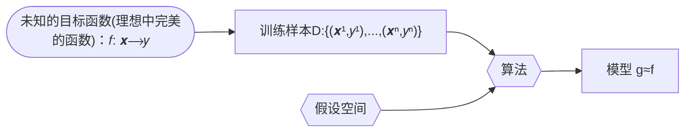
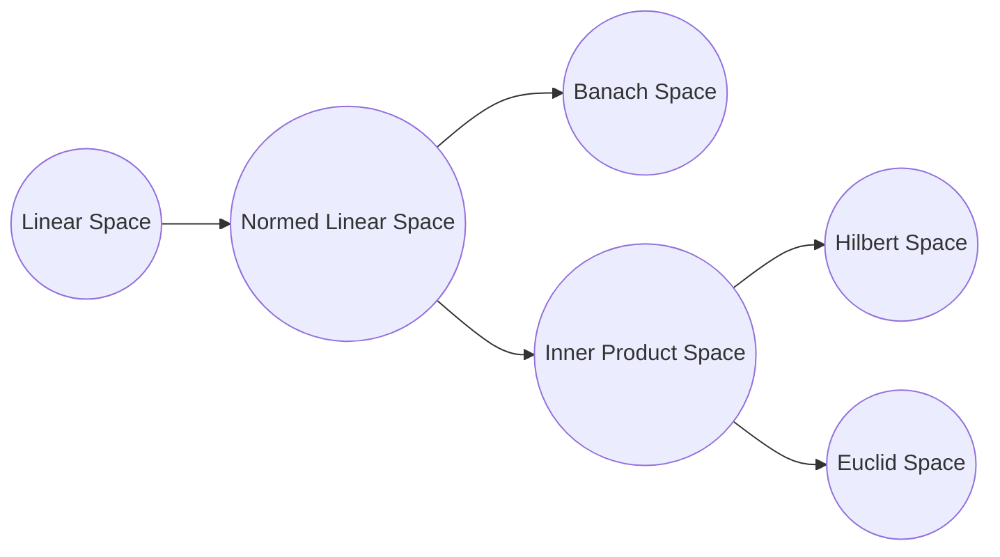
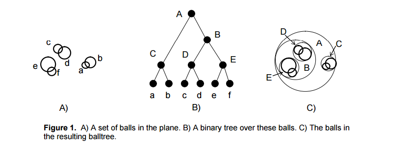

[TOC]

# 统计学习方法

[第一版](https://github.com/kingreatwill/files/tree/main/%E7%BB%9F%E8%AE%A1%E5%AD%A6%E4%B9%A0%E6%96%B9%E6%B3%95/book/Lihang-first_edition)

[第二版](https://github.com/kingreatwill/files/tree/main/%E7%BB%9F%E8%AE%A1%E5%AD%A6%E4%B9%A0%E6%96%B9%E6%B3%95/book/Lihang-second_edition)

## 第 1 章 统计学习及监督学习概论

**统计学习的主要特点是**：

1. 统计学习以计算机及网络为平台，是建立在计算机及网络之上的；
2. 统计学习以数据为研究对象，是数据驱动的学科；
3. 统计学习的目的是对数据进行预测与分析；
4. 统计学习以方法为中心，统计学习方法构建模型并应用模型进行预测与分析；
5. 统计学习是概率论、统计学、信息论、计算理论、最优化理论及计算机科学等多个领域的交叉学科，并且在发展中逐步形成独自的理论体系与方法论。

**假设空间(hypothesis space)**：
$$\mathcal H = \{ f(x;\theta) | \theta \in \mathbb{R}^D\} \\ or \quad \mathcal F = \{P|P(Y|X;\theta),\theta \in \mathbb{R}^D\}$$
其中$f(x; \theta)$是参数为$\theta$ 的函数（**决策函数**），也称为模型（Model），参数向量$\theta$取值与$D$维欧式空间$\mathbb{R}^D$,也称为参数空间(parameter space)，$D$ 为参数的数量(维度)

模型的假设空间(hypothesis space)包含所有可能的条件概率分布或决策函数

**特征空间（feature space）**：
每个具体的输入是一个实例（instance），通常由特征向量（feature vector）表示。这
时，所有特征向量存在的空间称为特征空间（feature space）。特征空间的每一维对应于
一个特征。

> 输入空间中的一个输入向量$x = (x_1,x_2)$，在多项式模型中特征向量是($x_1^2,x_1x_2,x_2^2,...$)
> 一般说的线性模型，指的是特征向量的线性组合，而不是指输入向量，所以说模型都是定义在特征空间上的

**统计学习的三要素**：

1. 模型的假设空间(hypothesis space)，简称：模型(model)
2. 模型选择的准则(evaluation criterion)，简称：策略(strategy)或者学习准则
3. 模型学习的算法(algorithm)，简称：算法(algorithm)

> 以线性回归（Linear Regression）为例：
> 模型： $f(x;w,b) = w^Tx +b$
> 策略(strategy)或者学习准则: 平方损失函数 $\mathcal L(y,\hat{y}) = (y-f(x,\theta))^2$
> 算法：解析解 analytical solution(闭式解 closed-form solution)和数值解 numerical solution，如：closed-form 的最小二乘的解以及梯度下降法

**机器学习的定义**：



使用训练数据来计算接近目标 𝑓 的假设（hypothesis ）g （来自：[Machine Learning Foundations（机器学习基石）- the learning problem,25 页](https://www.csie.ntu.edu.tw/~htlin/course/mlfound17fall/doc/01_handout.pdf)）

**监督学习**：
监督学习(supervised learning)是指从标注数据中学习预测模型的机器学习问题。本质是**学习输入到输出的映射的统计规律**。

输入变量与输出变量均为连续变量的预测问题称为**回归问题**；
输出变量为有限个离散变量的预测问题称为**分类问题**；
输入变量与输出变量均为变量序列的预测问题称为**标注问题**(分类问题的推广，如：隐马尔可夫模型 HMM，条件随机场 CRF)。

监督学习的模型可以是概率模型或非概率模型，由**条件概率分布**$P(Y|X)$或**决策函数（decision function）**$Y=f(X)$表示，随具体学习方法而定。对具体的输入进行相应的输出预测时，写作$P(y|x)$或$Y=f(x)$。
$$y =\displaystyle\argmax_{y}  P(y|x)$$

**联合概率分布**：
监督学习假设输入与输出的随机变量 X 和 Y 遵循联合概率分布$P(X,Y)$。$P(X,Y)$表示分布函数，或分布密度函数。注意，在学习过程中，假定这一联合概率分布存在，但对学习系统来说，联合概率分布的具体定义是未知的。**训练数据与测试数据被看作是依联合概率分布$P(X,Y)$独立同分布产生的**。
统计学习假设数据存在一定的统计规律，$X$和$Y$具有联合概率分布的假设就是监督学习关于数据的基本假设。

**非监督学习**：
非监督学习(unsupervised learning)是指从无标注数据中学习预测模型的机器学习问题。本质是**学习数据中的统计规律或潜在结构**。

非监督学习的模型可以表示为函数$z = g(x)$或者条件概率分布$P(z|x)$ （输出$z$可以是**聚类**或者**降维**）
$$z =\displaystyle\argmax_{z}  P(z|x)$$
以及 条件概率分布$P(x|z)$ （用来做**概率密度估计**，比如 GMM 中$P(x|z)$属于高斯分布，如果假设知道数据来自哪个高斯分布，即知道$z$，我们可以用极大似然估计来估计相关参数）。

[核密度估计 Kernel Density Estimation.](https://scikit-learn.org/stable/modules/generated/sklearn.neighbors.KernelDensity.html)

**概率模型（probabilistic model）与非概率模型（non-probabilistic model）或者确定性模型（deterministic model）**：

概率模型（probabilistic model）- 条件概率分布 P(y|x)和 非概率模型（non-probabilistic model） - 函数 y=f(x)可以**相互转化**，条件概率分布最大化后得到函数，函数归一化后得到条件概率分布。所以概率模型与非概率模型的区别不在于输入输出之间的映射关系，而在于模型的内部结构：概率模型一定可以表示为联合概率分布的形式，而非概率模型则不一定存在这样的联合概率分布。

概率模型的代表是**概率图模型（probabilistic graphical model）**$^{参考文献[1-3]}$，联合概率分布可以根据图的结构分解为因子乘积的形式，可以用最基本的加法规则和乘法规则进行概率推理：
$$P(x) = \sum_yP(x,y) \\ P(x,y) = P(x)P(y|x)$$

**参数化模型（parametric model）和非参数化模型（non-parametric model）**：

参数化模型假设模型参数的维度固定，模型可以由有限维参数完全刻画。(如：感知机、GMM)
非参数化模型假设模型参数的唯独不固定或者说无穷大，随着训练数据量的增加而不断增大。(如：决策树、支持向量机)

**在线学习（online learning）和批量学习（batch learning）**：

在线学习每次接受一个样本，预测后学习模型，并不断重复该操作。
批量学习一次接受所有数据，学习模型之后进行预测。

在线学习比批量学习更难，因为每次模型更新中可利用的数据有限。

**贝叶斯学习（Bayesian learning）/ 贝叶斯推理（Bayesian inference）**：
$$\mathrm{Bayes \; Rule:} \\ \underbrace{P(X|Y)}_{\mathrm{posterior}} = \frac{\overbrace{P(Y|X)}^{\mathrm{likelihood}}\overbrace{P(X)}^{\mathrm{prior}}}{\underbrace{P(Y)}_{\mathrm{evidence}}}   = \frac{\overbrace{P(Y|X)}^{\mathrm{likelihood}}\overbrace{P(X)}^{\mathrm{prior}}}{\underbrace{\sum_{x}P(Y|X)P(X)}_{\mathrm{evidence}}}$$

**核技巧（kernel trick）/ 核方法（kernel method）**：

**核方法**是一类把低维空间的非线性可分问题，转化为高维空间的线性可分问题的方法。
**核技巧**是一种利用核函数直接计算 $\lang \phi(x),\phi(z) \rang$ ，以避开分别计算 $\phi(x)$ 和 $\phi(z)$ ，从而加速核方法计算的技巧。

**核函数**：[Kernel function](https://en.jinzhao.wiki/wiki/Positive-definite_kernel)
设 $\mathcal X$ 是输入空间（即 $x_i \in \mathcal X $ ， $\mathcal X$ 是 $\mathbb R^n$ 的子集或离散集合 ），又设 $\mathcal H$ 为特征空间（​ 希尔伯特空间$^{附加知识:各种空间介绍}$），如果存在一个从 $\mathcal X$ 到 $\mathcal H$ 的映射

$$\phi(x) : \mathcal X \to \mathcal H$$

使得对所有 $x,z \in \mathcal X$ ，函数 $K(x,z)$ 满足条件

$$K(x,z) = \phi(x).\phi(z) = \lang \phi(x),\phi(z) \rang$$

则称 $K(x,z)$ 为核函数。其中 $\phi(x) $ 为映射函数， $\lang \phi(x),\phi(z) \rang$ 为内积。

[核技巧](https://en.jinzhao.wiki/wiki/Kernel_method)的想法是，在学习和预测中只定义核函数 $K(x,z)$ ，而不显式地定义映射函数 $\phi $。通常直接计算$K(x,z)$比较容易，而通过$\phi(x) $和$\phi(z) $计算$K(x,z)$并不容易。

> 注意：$\phi $是输入空间$\mathbb{R}^n$到特征空间$\mathcal H$的映射，特征空间$\mathcal H$一般是高维的，甚至是无穷维的。所以$\phi$不好计算，甚至会带来**维度灾难**又称**维度诅咒（Curse of Dimensionality）**$^{附加知识:维度诅咒}$。

### 附加知识

#### 正则化

正则化符合奥卡姆剃刀（Occam's razor）原理。

参考：[L1L2 正则化和凸优化](../图解数学/L1L2正则化和凸优化.md)

#### 模型选择

参考：[模型选择](../Model-Selection.md)

#### 生成模型和判别模型

参考：[生成模型和判别模型](../生成模型和判别模型.md)

#### 各种空间介绍

**线性空间**就是定义了**加法和数乘**的空间(空间里的一个元素就可以由其他元素线性表示)。

---

**度量空间**就是定义了**距离**的空间（曼哈顿距离，欧氏距离，闵可夫斯基距离，马氏距离，切比雪夫距离）。
定义距离时，有三条公理必须遵守：

1. 非负性、同一性：$dist(x_i,x_j) \geq 0$(非负性)，$dist(x_i,x_j) = 0$当且仅当$x_i=x_j$(同一性)
2. 对称性：$dist(x_i,x_j) = dist(x_j,x_i)$
3. 三角不等式(也叫直递性)：$dist(x_i,x_j) \leq dist(x_i,x_k) + dist(x_k,x_j)$
   希尔伯特空间(Hilbert)
   > 文字解释：【两点之间距离不为负；两个点只有在 空间 上重合才可能距离为零；a 到 b 的距离等于 b 到 a 的距离;a 到 c 的距离加上 c 到 b 的距离大于等于 a 直接到 b 的距离;】

---

**赋范空间**就是定义了**范数**的空间。
x 的范数||x||就是 x 的**长度**。那么这里的长度和上一节中说的距离到底有什么区别呢。**距离的概念是针对两个元素来说的**，例如 d(x,y)指的是 x 与 y 两个元素之间的距离，而**范数是针对一个元素来说的**，每一个元素都对应一个范数，可以将范数理解为一个元素到零点的距离（这只是一种理解，并不是定义），也就是它自己的长度。
定义：
称 映射$||.|| : \mathbb{R}^n \to \mathbb{R}$为 $\mathbb{R}^n$ 上的范数，当且仅当：

1. 非负性： $\forall x \in \mathbb{R}^n ,||x|| \geq 0$ ,$||x|| = 0$当且仅当$x=0$
2. 数乘：$\forall x \in \mathbb{R}^n ,a \in \mathbb{R}^n, ||ax|| = |a|.||x||$
3. 三角不等式: $\forall x,y \in \mathbb{R}^n ,||x+y|| \leq ||x|| + ||y||$

如果我们定义了范数，可以在这基础上定义距离：dist(x,y)=||x-y||。根据范数的三条性质，我们可以证明我们这样定义的距离也满足距离的定义，聪明的你可以自己证明一下（对称性的证明，提一个-1 出来，一加绝对值就是 1 了）。

也就是说范数其实是一个更加具体的概念，**有了范数一定能利用范数定义距离，但是有距离不能定义范数**。

也许你会问，你不是说理解范数就是一个元素到零点的距离吗，那定义范数为||x||=dist(x,0) 不就行了吗。这样的话，对于范数的第二条性质就不一定会满足，||ax||=dist(ax,0)，而 dist(ax,0)不一定等于|a|dist(x,0)，具体等不等于还要看你的距离是怎么定义的。

例如：L<sub>p</sub>范数
欧式距离对应 L2 范数
曼哈顿距离对应 L1 范数
切比雪夫距离对应 L∞ 范数
L<sub>p</sub>范数：当 p>=1 时，向量的 L<sub>p</sub>范数是凸的。(这也是为什么一般不用 L0 范数的原因之一)

---

**线性赋范空间**就是定义了加法、数乘和范数的空间。

---

**巴拿赫空间**就是**完备的赋范线性空间**。(Banach space)
**完备的空间**的定义：如果一个空间是完备的，那么该空间中的任何一个柯西序列都收敛在该空间之内。

首先来说一下柯西序列是什么，柯西序列就是随着序数增加，值之间的距离越来越小的序列。换一种说法是，柯西序列可以在去掉有限个值之后，使任意两个值之间的$\underline{\mathrm{距离}}$都小于任意给定正常数（其实这就是定义了一个极限而已）。

那么任意一个柯西序列都收敛在该空间内是什么意思呢，举个例子你就明白了。

设定义在有理数空间 Q 上的序列：$x_n = \frac{[\sqrt{2}n]}{n}$，其中[x]表示 x 取整数部分。
对于这个数列来说，每一个元素的分子分母都是整数，所以每一个$x_n$都在有理数空间 Q 上，那这个序列的极限呢，稍有常识的人都能看出，这个序列的极限是$\sqrt{2}$，而这并不是一个有理数，所以这个柯西序列的极限不在该空间里面，也就是说有理数空间 Q 是不完备的。

所以完备的意义我们可以这样理解，那就是**在一个空间上我们定义了极限，但是不论你怎么取极限，它的极限的值都不会跑出这个空间，那么这个空间就是完备空间**。

另外，不知道你有没有发现，上面在解释什么是柯西序列的时候，有一个词我加了下划线，那就是距离，也就说说在定义完备空间之前，要先有距离的概念。所以**完备空间，其实也是完备度量空间**。

所以，巴拿赫空间满足几条特性呢：距离、范数、完备。

---

**内积空间**就是定义了内积的空间。[Inner product space](https://en.jinzhao.wiki/wiki/Inner_product_space)
有时也称准希尔伯特空间。
内积就是我们所说的点乘、标积，它的定义方式也不是唯一的，但如同距离范数的定义一样，内积的定义也要满足某些条件，不能随便定义。

定义映射$\lang .,. \rang : V \times V \to \mathbb{F}$, 其中$V$是向量，$\mathbb{F}$是标量
有$x,y,z \in V ,s \in \mathbb{F}$，那么内积满足

1. 第一个参数中的线性:
   $$\lang sx,y \rang = s\lang x,y \rang \\ \lang x+y,z \rang = \lang x,z \rang + \lang y,z \rang \\ \lang 0,x \rang = 0$$

2. 共轭对称:$\lang x,y \rang = \overline{\lang y,x \rang }$

3. 正定性:$\lang x,x \rang > 0 \quad\mathrm{if}\; x \neq 0$

4. 正半定性或非负定性:$\forall{x}, \lang x,x \rang \geq 0 $

5. 确定性：$\lang x,x \rang = 0 必然有 x=0$

3，4，5 可以跟上面定义范数和距离一样写成一个

例子-欧几里得向量空间:
$ x,y \in \mathbb{R}^n , \lang x,y \rang = x^Ty=\sum\_{i=1}^n{x_iy_i}$

**只有定义了内积，才会有夹角的概念，才会有正交的概念，另外内积也可以定义范数，也就是说内积是比范数更具体的一个概念。**

---

**欧式空间**就是定义了内积的有限维实线性空间。

---

**希尔伯特空间**就是完备的内积空间。(Hilbert space)
希尔伯特空间中的元素一般是函数，因为一个函数可以视为一个无穷维的向量。




参考：[一片文章带你理解再生核希尔伯特空间（RKHS）以及各种空间](https://blog.csdn.net/ChangHengyi/article/details/80577318)

#### 维度诅咒

维度诅咒通常是指在涉及到向量的计算的问题中，随着维数的增加，计算量呈指数倍增长的一种现象。高维度有更大的特征空间，需要更多的数据才可以进行较准确的估计。

> 若特征是二值的，则每增加一个特征，所需数据量都在以 2 的指数级进行增长，更何况很多特征不只是二值的。

几何角度 1：

<svg width="52" height="52" xmlns="http://www.w3.org/2000/svg">
 <!-- Created with Method Draw - http://github.com/duopixel/Method-Draw/ -->
 <g>
  <title>background</title>
  <rect fill="#fff" id="canvas_background" height="54" width="54" y="-1" x="-1"/>
  <g display="none" overflow="visible" y="0" x="0" height="100%" width="100%" id="canvasGrid">
   <rect fill="url(#gridpattern)" stroke-width="0" y="0" x="0" height="100%" width="100%"/>
  </g>
 </g>
 <g>
  <title>Layer 1</title>
  <rect stroke="#000" id="svg_1" height="50" width="50" y="1.134891" x="1.227186" stroke-width="1.5" fill="#fff"/>
  <ellipse stroke="#000" ry="25" rx="25" id="svg_2" cy="26.316708" cx="25.727185" fill-opacity="null" stroke-opacity="null" stroke-width="1.5" fill="#fff"/>
  <line stroke-linecap="null" stroke-linejoin="null" id="svg_3" y2="26.363651" x2="49.090879" y1="26.363651" x1="23.636325" fill-opacity="null" stroke-opacity="null" stroke-width="1.5" stroke="#000" fill="none"/>
  <text stroke="#000" transform="matrix(0.8454890517551235,0,0,0.38060957631270753,66.36433546231878,120.48066499237646) " xml:space="preserve" text-anchor="start" font-family="Helvetica, Arial, sans-serif" font-size="24" id="svg_4" y="-262.016546" x="-56.089448" fill-opacity="null" stroke-opacity="null" stroke-width="0" fill="#000000">0.5</text>
 </g>
</svg>

上图表示一个多维空间（以二维为例），设正方形边长为 1，则其内切圆半径为$r=0.5$，则正方形面积为 1，内切圆面积为$\pi(0.5)^2$ 。若将此变为三维情况下，正方体体积为 1，内切球体积为$\frac{4}{3}\pi(0.5)^3$。

因此球体的体积可以表示为$V(d) = \frac{\pi^{d/2}}{\varGamma(\frac{d}{2}+1)}0.5^d = k(0.5)^d$(d 为维度),则 $\lim_{d \to \infty}k(0.5)^d = 0$，其内切超球体的体积为 0。由此可知，**高维情况下，数据大都分布在四角（正方形内，内切圆外）**，稀疏性太大，不好分类。

> 维度越大，超球体体积越小。说明落在超球体内的样本越少，因为超球体是超立方体的内切球。不在球内,那只能在角落！

几何角度 2：

<svg width="52" height="52" xmlns="http://www.w3.org/2000/svg">
 <!-- Created with Method Draw - http://github.com/duopixel/Method-Draw/ -->
 <g>
  <title>background</title>
  <rect fill="#fff" id="canvas_background" height="54" width="54" y="-1" x="-1"/>
  <g display="none" overflow="visible" y="0" x="0" height="100%" width="100%" id="canvasGrid">
   <rect fill="url(#gridpattern)" stroke-width="0" y="0" x="0" height="100%" width="100%"/>
  </g>
 </g>
 <g>
  <title>Layer 1</title>
  <ellipse stroke="#000" ry="25" rx="25" id="svg_5" cy="25" cx="25" fill-opacity="null" stroke-opacity="null" stroke-width="1.5" fill="#fff"/>
  <ellipse id="svg_6" cy="24.593763" cx="34.636353" fill-opacity="null" stroke-opacity="null" stroke-width="1.5" stroke="#000" fill="#fff"/>
  <ellipse ry="20" rx="20" id="svg_7" cy="25" cx="25" fill-opacity="null" stroke-opacity="null" stroke-width="1.5" stroke="#000" fill="#fff"/>
 </g>
</svg>

上图也表示一个多维空间（以二维为例），则其中图形的体积有如下关系：外圆半径$r=1$，内圆半径为$r−\varepsilon$ 。同样在高维情况下，外圆体积为$V_{外圆} = k.1^d = k$，中间的圆环体积为$V_{圆环} = k - k(1-\varepsilon)^d$，则：
$$\lim_{d \to \infty}\frac{V_{圆环}}{V_{外圆}} = \lim_{d \to \infty}\frac{ k - k(1-\varepsilon)^d}{k} = \lim_{d \to \infty}(1-(1-\varepsilon)^d) = 1$$

> 高维情况下，无论$\varepsilon$多小，只要 d 足够大，圆环几乎占据了整个外圆，内圆体积趋向于 0，导致数据**稀疏**。

参考：
[The Curse of Dimensionality in classification](https://www.visiondummy.com/2014/04/curse-dimensionality-affect-classification/)
[机器学习-白板推导系列(五)-降维（Dimensionality Reduction）](https://www.bilibili.com/video/BV1vW411S7tH)

#### 不等式(Inequality)

[所有不等式](https://en.jinzhao.wiki/wiki/Category:Inequalities) 以及[所有概率（Probabilistic）不等式](https://en.jinzhao.wiki/wiki/Category:Probabilistic_inequalities)

- **[绝对值不等式](https://chi.jinzhao.wiki/wiki/%E7%BB%9D%E5%AF%B9%E5%80%BC%E4%B8%8D%E7%AD%89%E5%BC%8F) - Absolute value inequality**

- **幂平均值不等式- [Power-Mean Inequality](https://artofproblemsolving.com/wiki/index.php/Power_Mean_Inequality)**

- **[三角形内角的嵌入不等式](https://chi.jinzhao.wiki/wiki/%E4%B8%89%E8%A7%92%E5%BD%A2%E5%86%85%E8%A7%92%E7%9A%84%E5%B5%8C%E5%85%A5%E4%B8%8D%E7%AD%89%E5%BC%8F) - 有时也被称为 Wolstenholme 不等式**

- **伯努利不等式 - [Bernoulli's inequality](https://en.jinzhao.wiki/wiki/Bernoulli%27s_inequality)**
- **排序不等式 - [Rearrangement inequality](https://en.jinzhao.wiki/wiki/Rearrangement_inequality)**
- **均值不等式 - [Inequality of arithmetic and geometric means](https://en.jinzhao.wiki/wiki/Inequality_of_arithmetic_and_geometric_means)**

- **舒尔不等式 - [Schur's inequality](https://en.jinzhao.wiki/wiki/Schur%27s_inequality)**

- **闵可夫斯基 (Minkowski) 不等式 - [Minkowski inequality](https://en.jinzhao.wiki/wiki/Minkowski_inequality)**

##### 概率不等式 Probabilistic inequalities

- **柯西-施瓦茨 (Cauchy–Schwarz) 不等式 - [Cauchy–Schwarz inequality](https://en.jinzhao.wiki/wiki/Cauchy%E2%80%93Schwarz_inequality)**
  $$[\sum_{i=1}^{n}{a_ib_i}]^2  \leq [\sum_{i=1}^{n}a_i^2].[\sum_{i=1}^{n}b_i^2] 等式成立：b_i=ka_i \\ 向量形式：|\braket{u,v}| \leq ||u||.||v|| \\ 概率中：|E(XY)|^2 \leq E(X^2)E(Y^2)$$
  证明：
  $$\vec{A} = (a_1,...,a_n),  \vec{B} = (b_1,...,b_n) \\ \vec{A}.\vec{B} = (a_1b_1,...,a_nb_n) = ||\vec{A}||.||\vec{B}||\cos\theta \leq ||\vec{A}||.||\vec{B}|| = \sqrt{a_1^2+...+a_n^2}.\sqrt{b_1^2+...+b_n^2}$$
  应用:

  1. 证明 covariance inequality：$Var(Y) \geq \frac{Cov(Y,X)^2}{Var(X)}$,有$\braket{X,Y} := E(XY)$
     $$|Cov(Y,X)|^2 = |E((X-\mu)(Y-v))|^2 = |\braket{X-\mu,Y-v}|^2 \\ \leq \braket{X-\mu,X-\mu}\braket{Y-v,Y-v} = E((X-\mu)^2)E((Y-v)^2) = Var(X)Var(Y)$$

- **赫尔德 (Holder) 不等式 - [Hölder's inequality](https://en.jinzhao.wiki/wiki/H%C3%B6lder%27s_inequality)**

- **琴生 (Jensen) 不等式 - [Jensen's inequality](https://en.jinzhao.wiki/wiki/Jensen%27s_inequality)**
  $$f(tx_1 +(1-t)x_2) \leq tf(x_1) + (1-t)f(x_2), \text{f is convex function} \\ 推广：f(a_1x_1 +...+ a_nx_n) \leq a_1f(x_1) +...+ a_nf(x_n), a_1+...+a_n = 1 , a_i \geq 0 \\ or: f(\sum_{i=1}^n{a_ix_i}) \leq \sum_{i=1}^n{a_if(x_i)} , \sum_{i=1}^n{a_i} = 1, a_i \geq 0$$

  概率中：如果$X$是随机变量，而$\varphi$是凸函数，则:$\varphi(E[X]) \leq E[\varphi(X)]$,不等式两边的差，$ E[\varphi(X)] - \varphi(E[X]) $称为 Jensen gap(间隙)；
  应用：

  1. EM 算法中有用到(log 函数是凹函数正好与凸函数相反);
  2. 证明 KL 散度>=0;

- **马尔可夫不等式 - [Markov's inequality](https://en.jinzhao.wiki/wiki/Markov%27s_inequality)**
  $$P(X \geq a) \leq \frac{E(X)}{a}$$
  其中$X$为非负随机变量，$\forall a>0$
  应用：

  1. 用于估计一个概率的上界，比如假设你所在公司的人均工资是 1 万，那么随机选一个你司员工，其工资超过 10 万的概率，不会超过 1/10；
  2. 用于其他概率不等式的证明，比如霍夫丁不等式；

- **切比雪夫 (Chebyshev) 不等式 - [Chebyshev's inequality](https://en.jinzhao.wiki/wiki/Chebyshev%27s_inequality)**
  $$P\{|X-\mu| \geq k\} \leq \frac{\sigma^2}{k^2}$$
  其中$X$为随机变量，$\forall k>0$, $\mu$为均值，$\sigma^2$为方差
  （证明可以利用马尔可夫不等式，见概率论基础教程 313 页）

- **霍夫丁不等式 - [Hoeffding's inequality](https://en.jinzhao.wiki/wiki/Hoeffding%27s_inequality)**
  应用：
  1. [Machine Learning Foundations（机器学习基石）- feasibility of learning,12,13,18 页](https://www.csie.ntu.edu.tw/~htlin/course/mlfound17fall/doc/04_handout.pdf)
  2. 统计学习方法，26 页，证明泛化误差上界（在[机器学习中常用的几个概率不等式及证明](https://zhuanlan.zhihu.com/p/392348396)中也有提到）

参考：[初等数学学习笔记](https://github.com/zhcosin/elementary-math/blob/master/elementary-math-note.pdf)

### 参考文献

[1-1] Hastie T,Tibshirani R,Friedman J. [The Elements of Statistical Learning: DataMining,Inference,and Prediction](http://www.web.stanford.edu/~hastie/ElemStatLearn/printings/ESLII_print12_toc.pdf). Springer. 2001（中译本：统计学习基础——数据挖掘、推理与预测。范明，柴玉梅，昝红英等译。北京：电子工业出版社，2004）

[1-2] Bishop M. [Pattern Recognition and Machine Learning](https://www.microsoft.com/en-us/research/uploads/prod/2006/01/Bishop-Pattern-Recognition-and-Machine-Learning-2006.pdf). Springer,2006

[1-3] [Probabilistic Graphical Models: Principles and Techniques](https://djsaunde.github.io/read/books/pdfs/probabilistic%20graphical%20models.pdf) by Daphne Koller, Nir Friedman from The MIT Press

[1-4] [Deep Learning](https://raw.fastgit.org/Zhenye-Na/machine-learning-uiuc/master/docs/Deep%20Learning.pdf) (Ian Goodfellow, Yoshua Bengio, Aaron Courville)

[1-5] Tom M Michelle. [Machine Learning](https://www.cs.cmu.edu/afs/cs.cmu.edu/user/mitchell/ftp/mlbook.html). McGraw-Hill Companies,Inc. 1997（中译本：机器学习。北京：机械工业出版社，2003）

[1-6] [Bayesian Reasoning and Machine Learning by David Barber 2007–2020](http://web4.cs.ucl.ac.uk/staff/D.Barber/textbook/200620.pdf) ,[other version](http://web4.cs.ucl.ac.uk/staff/D.Barber/textbook/)

[1-7] [Reinforcement Learning:An Introduction (second edition 2020) by Richard S. Sutton and Andrew G. Barto](http://incompleteideas.net/book/RLbook2020trimmed.pdf) ,[other version](http://incompleteideas.net/book/)

[1-8] 周志华，[机器学习](https://github.com/Mikoto10032/DeepLearning/blob/master/books/%E6%9C%BA%E5%99%A8%E5%AD%A6%E4%B9%A0%E5%91%A8%E5%BF%97%E5%8D%8E.pdf)，清华大学出版社 ([手推笔记](https://github.com/Sophia-11/Machine-Learning-Notes) 以及 [公式推导解析](https://github.com/datawhalechina/pumpkin-book))

[1-9] [Lecture Notes in MACHINE LEARNING](https://news.vidyaacademy.ac.in/wp-content/uploads/2018/10/NotesOnMachineLearningForBTech-1.pdf) Dr V N Krishnachandran

## 第 2 章 感知机

感知机[Perceptron](https://en.jinzhao.wiki/wiki/Perceptron)是**神经网络**和**支持向量机**的基础。最早在 1957 年由 Rosenblatt 提出$^{参考文献[2-1]}$。Novikoff$^{参考文献[2-2]}$，Minsky 与 Papert$^{参考文献[2-3]}$等人对感知机进行了一系列理论研究。感知机的扩展学习方法包括口袋算法(pocket algorithm)$^{参考文献[2-4]}$、表决感知机(voted perceptron)$^{参考文献[2-5]}$、带边缘感知机(perceptron with margin)$^{参考文献[2-6]}$等。
[Brief History of Machine Learning](https://erogol.com/brief-history-machine-learning/)

要求：数据集线性可分(linearly separable data set)

- **模型**：
  $$f(x) = sign(w.x + b)$$
  其中$x,w \in \mathbb{R}^n ,b \in \mathbb{R}$,$w$叫作权值（weight）或权值向量（weight vector），$b$叫作偏置（bias），sign 是符号函数
  $$
  sign(x) = \begin{cases}
     +1 & x \geq 0 \\
     -1 & x<0
  \end{cases}
  $$

感知机是一种线性分类模型，属于判别模型。感知机模型的假设空间是定义在特征空 间中的所有线性分类模型（linear classification model）或线性分类器(linear classifier)，即 函数集合$\{f|f(x)＝w·x+b\}$

超平面 S：$w.x+b = 0$,其中$w$是 S 的法向量，$b$是 S 的截距，超平面 S 称为分离超平面（separating hyperplane）

- **策略**：
  $$L(w,b) = -\sum_{x_i \in M}{y_i(w.x_i + b)}$$
  其中$M$为误分类点的集合。误分类数据$M = \{ (x_i,y_i)|-y_i(w.x_i +b) > 0\}$

函数间隔：$y(w.x + b)$
几何间隔：$\frac{1}{||w||}|w.x + b|$ (在上面的 loss function 中没有考虑$\frac{1}{||w||}$)

- **算法**：
  $$\min_{w,b} L(w,b) = -\sum_{x_i \in M}{y_i(w.x_i + b)}$$
  使用**随机梯度下降法（stochastic gradient）**:

1. 初始化参数(随机法)：$w_0,b_0$
2. 选取数据$(x_i,y_i)$
3. 如果$(x_i,y_i)$是误分类点，也就是$y_i(w.x_i + b) \leq 0$，则对$w,b$进行更新
   $$在(x_i,y_i)点处梯度为：\\ \nabla_wL(w,b) = -y_ix_i \\ \nabla_bL(w,b) = -y_i\\ 更新w：w_{k+1} \gets w_{k}+\eta y_ix_i \\ 更新b：b_{k+1} \gets b_{k}+\eta y_i \\其中学习率\eta \in (0,1]$$
4. 循环 2-3，直到训练集中没有误分类点。

- 上述**算法的收敛性**：

Novikoff 定理：
设训练集$T = \{(x_1,y_1),...,(x_N,y_N)\}$是线性可分的，

1. 设完美超平面$\hat{w}_{opt}.\hat{x} = 0 , ||\hat{w}_{opt}||=1$ 将训练集完全正确分开（简化起见 $\hat{w}_{opt}.\hat{x} = w_{opt}.x +b$），存在$\gamma >0$ ,对所有点有$y_i(\hat{w}_{opt}.\hat{x_i}) \geq \gamma$；

2. 令$R = \max_{1\leq i\leq N}||\hat{x_i}||$,则算法会在有限步 k 满足不等式$k \leq (\frac{R}{\gamma})^2$

证明(注意：带 hat 的表示扩充向量)：

1. 因为数据线性可分，对于所有点$y_i(\hat{w}_{opt}.\hat{x_i}) > 0$,所以存在
   $$\gamma = \min_i{y_i(\hat{w}_{opt}.\hat{x_i})} \leq {y_i(\hat{w}_{opt}.\hat{x_i})} \label{2-1}\tag{2-1}$$
   所以这里的$\gamma$代表了所有点离完美超平面的最小距离；

2. 为了方便计算 设 扩充向量$\hat{w} = (w^T,b)^T$， 有
   $$\hat{w}_{k} = \hat{w}_{k-1}+\eta y_i\hat{x_i} \label{2-2}\tag{2-2}$$

3. 推导不等式
   $$\hat{w}_{k}.\hat{w}_{opt} \geq k\eta\gamma \label{2-3}\tag{2-3}$$

由$\eqref{2-1}$和$\eqref{2-2}$
$$\hat{w}_{k}.\hat{w}_{opt} = \hat{w}_{k-1}.\hat{w}_{opt} + \eta{y_i}\hat{w}_{opt}.\hat{x_i} \\ \geq \hat{w}_{k-1}.\hat{w}_{opt} + \eta\gamma \\ \geq \hat{w}_{k-2}.\hat{w}_{opt} + 2\eta\gamma \\ \geq k\eta\gamma$$

4. 推导不等式
   $$||\hat{w}_{k}||^2 \leq k\eta^2R^2 \label{2-4}\tag{2-4}$$
   由$\eqref{2-2}$
   $$||\hat{w}_{k}||^2=||\hat{w}_{k-1}+\eta y_i\hat{x_i}||^2 = ||\hat{w}_{k-1}||^2 + 2\eta{y_i}\hat{w}_{k-1}.\hat{x}_{i} + \eta^2||\hat{x}_{i}||^2$$
   假设 k 次完全分对，那么 k-1 次有误分类点，则${y_i}\hat{w}_{k-1}.\hat{x}_{i} \leq 0$
   所以
   $$||\hat{w}_{k}||^2 =||\hat{w}_{k-1}||^2 + 2\eta{y_i}\hat{w}_{k-1}.\hat{x}_{i} + \eta^2||\hat{x}_{i}||^2 \\ \leq ||\hat{w}_{k-1}||^2 +  \eta^2||\hat{x}_{i}||^2 \\ \leq ||\hat{w}_{k-1}||^2 +  \eta^2R^2  \\ \leq ||\hat{w}_{k-2}||^2 +  2\eta^2R^2 \leq ... \\ \leq k\eta^2R^2$$

5. 由$\eqref{2-3}$和$\eqref{2-4}$

$$k\eta\gamma \leq \underbrace{\hat{w}_{k}.\hat{w}_{opt} \leq ||\hat{w}_{k}||.\underbrace{||\hat{w}_{opt}||}_{=1} }_{\text{柯西-施瓦茨 (Cauchy–Schwarz) 不等式}} \leq \sqrt{k} \eta R \\ \; \\ \Rightarrow k^2\gamma^2 \leq kR^2 \\ \Rightarrow k \leq (\frac{R}{\gamma})^2$$

也就是说 k 是有上界的。

### 参考文献

[2-1] Rosenblatt, F. (1958). [The perceptron: A probabilistic model for information storage and organization in the brain](http://homepages.math.uic.edu/~lreyzin/papers/rosenblatt58.pdf). Psychological Review, 65(6), 386–408.

[2-2] Novikoff, A. B. (1962). On convergence proofs on perceptrons. Symposium on the Mathematical Theory of Automata, 12, 615-622. Polytechnic Institute of Brooklyn.

[2-3] Minsky M L and Papert S A 1969 Perceptrons (Cambridge, MA: MIT Press)

[2-4] Gallant, S. I. (1990). Perceptron-based learning algorithms. IEEE Transactions on Neural Networks, vol. 1, no. 2, pp. 179-191.

[2-5] Freund, Y. and Schapire, R. E. 1998. Large margin classification using the perceptron algorithm. In Proceedings of the 11th Annual Conference on Computational Learning Theory (COLT' 98). ACM Press.

[2-6] Li YY,Zaragoza H,Herbrich R,Shawe-Taylor J,Kandola J. The Perceptron algorithmwith uneven margins. In: Proceedings of the 19th International Conference on MachineLearning. 2002,379–386

[2-7] [Widrow, B.](https://en.jinzhao.wiki/wiki/Bernard_Widrow), Lehr, M.A., "[30 years of Adaptive Neural Networks: Perceptron, Madaline, and Backpropagation,](http://www.inf.ufrgs.br/~engel/data/media/file/cmp121/widrow.pdf)" Proc. IEEE, vol 78, no 9, pp. 1415-1442, (1990)。

[2-8] Cristianini N,Shawe-Taylor J. An Introduction to Support Vector Machines and OtherKernelbased Learning Methods. Cambridge University Press,2000

## 第 3 章 k 近邻法

k 近邻法（[k-nearest neighbor，k-NN](https://en.jinzhao.wiki/wiki/K-nearest_neighbors_algorithm)）1968 年由 Cover 和 Hart 提出，是一种基本分类与回归方法。本书只讨论分类问题中的 k 近邻法。
k 值的选择、距离度量及分类决策规则是 k 近邻法的三个基本要素。
最后讲述 k 近邻法的一个实现方法——kd 树，介绍构造 kd 树和搜索 kd 树的算法

**k 近邻法的三个基本要素**：
k 值的选择：超参数，可以使用交叉验证法来选取最优 k 值
距离度量：$L_2$距离/欧氏距离，$L_p$距离/Minkowski 距离
分类决策规则：多数表决（0-1 损失也就是指示函数）

- **模型**：
  k 近邻法没有显式的学习过程（不学习也能预测），它本身并没有对数据进行理论建模的过程，而是利用训练数据对特征向量空间进行划分，并将其划分的结果作为其最终的算法模型。这就好比，在现实世界的维度中，经常游走于男厕所的我们归为男性，而经常在女厕所出没的人我们归为女性或者是变态。

- **策略**：
  $$y = \argmin_{c_j} \frac{1}{k} \sum_{x_i \in N_k(x)} I(y_i \neq c_j) = 1- \frac{1}{k}\sum_{x_i \in N_k(x)} I(y_i = c_j) $$
  最大化类别属于$c_j$类的概率$\frac{1}{k}\sum_{x_i \in N_k(x)} I(y_i = c_j)$
  最小化误分类率$\frac{1}{k} \sum_{x_i \in N_k(x)} I(y_i \neq c_j)$
  $N_k(x)$表示涵盖 k 个点的 x 的邻域
- **算法**：
  直接计算（线性扫描 linear scan）,当训练集很大时，计算很耗时（每次都要计算所有距离，然后找到 k 个最近距离的点），因为没有学习。
  为了提高 k 近邻搜索的效率，可以考虑使用特殊的结构存储训练数据，以减少计算距离的次数。
  具体方法很多，如：[kd_tree](https://en.jinzhao.wiki/wiki/K-d_tree)，[ball_tree](https://arxiv.org/pdf/1511.00628.pdf)，brute(蛮力实现,不算优化，只是把 sklearn 中的参数拿过来)
  ，以及其它[树结构](<https://en.jinzhao.wiki/wiki/Category:Trees_(data_structures)>)
  为了改进 KDtree 的二叉树树形结构，并且沿着笛卡尔坐标进行划分的低效率，ball tree 将在一系列嵌套的超球体上分割数据。也就是说：使用超球面而不是超矩形划分区域。虽然在构建数据结构的花费上大过于 KDtree，但是在高维甚至很高维的数据上都表现的很高效。

  下面介绍其中的 kd 树（kd tree 是一个二叉树）方法（kd 树是存储 k 维空间数据的树结构，这里的 k 与 k 近邻法的 k 意义不同）。
  数据集$T = \{x_1,...,x_N\}$，其中$x_i$是 k 维向量$x_i = (x_i^{(1)},...,x_i^{(k)})^T$

  - **构造 kd 树**：

  ```
  function kdtree (list of points pointList, int depth)
  {
      // Select axis based on depth so that axis cycles through all valid values
      var int axis := depth mod k;

      // Sort point list and choose median as pivot element
      select median by axis from pointList;

      // Create node and construct subtree
      node.location := median;
      node.leftChild := kdtree(points in pointList before median, depth+1);
      node.rightChild := kdtree(points in pointList after median, depth+1);
      return node;
  }
  ```

  1. 根据第(depth mod k)维查找中位数（中位数所在的点作为节点，第一次就是 root 节点），将数据划分为两个区域，小于中位数的划分在左边，大于中位数的划分在右边
  2. 重复 1，depth++

  - **搜索 kd 树**：

  1. 在 kd 树中找出包含目标点 x 的叶结点：从根结点出发，递归地向下访问 kd 树。若目标点 x 当前维的坐标小于切分点的坐标，则移动到左子结点，否则移动到右子结点。直到子结点为叶结点为止。
  2. 以此叶结点为“当前最近点”。
  3. 递归地向上回退，在每个结点进行以下操作：
     a. 如果该结点保存的实例点比当前最近点距离目标点更近，则以该实例点为“当前最近点”。
     b. 当前最近点一定存在于该结点一个子结点对应的区域。检查该子结点的父结点的另一子结点对应的区域是否有更近的点。具体地，检查另一子结点对应的区域是否与以目标点为球心、以目标点与“当前最近点”间的距离为半径的超球体相交。
     如果相交，可能在另一个子结点对应的区域内存在距目标点更近的点，移动到另一个子结点。接着，递归地进行最近邻搜索；
     如果不相交，向上回退。
  4. 当回退到根结点时，搜索结束。最后的“当前最近点”即为 x 的最近邻点。
     如果实例点是随机分布的，kd 树搜索的平均计算复杂度是 O(logN)，这里 N 是训练实例数。kd 树更适用于训练实例数远大于空间维数时的 k 近邻搜索。当空间维数接近训练实例数时，它的效率会迅速下降，几乎接近线性扫描。

  | 算法 | 平均        | 最差的情况 |
  | ---- | ----------- | ---------- |
  | 空间 | $O(n)$      | $O(n)$     |
  | 搜索 | $O(\log n)$ | $O(n)$     |
  | 插入 | $O(\log n)$ | $O(n)$     |
  | 删除 | $O(\log n)$ | $O(n)$     |

### 附加知识

#### 距离度量

[Distance](https://en.jinzhao.wiki/wiki/Category:Distance)

[sklearn.neighbors.DistanceMetric](https://scikit-learn.org/stable/modules/generated/sklearn.neighbors.DistanceMetric.html)

[Distance computations(scipy.spatial.distance)](https://docs.scipy.org/doc/scipy/reference/spatial.distance.html)

[24 种距离度量小结](https://blog.csdn.net/weixin_43840403/article/details/89075759)

> 先了解度量空间和赋范空间

实值向量空间的度量：

- Euclidean(欧几里得距离也称欧式距离) ${||u-v||}_2$ or $\sqrt{\sum_i{(u_i - v_i)^2}}$
- SEuclidean(标准化欧几里得距离)
- SqEuclidean(平方欧几里得距离)
- Mahalanobis(马氏距离) $\sqrt{ (u-v) \Sigma^{-1} (u-v)^T }$
- Manhattan/cityblock(城市街区（曼哈顿）距离) $\sum_i{|u_i-v_i|}$
- Chebyshev(切比雪夫距离) $L_\infty$度量 $\max_i{|u_i-v_i|}$
- Minkowski(闵可夫斯基距离) 欧式距离的推广，p=1 时等价于曼哈顿距离，p=2 时等价于欧氏距离，p=∞ 时等价于切比雪夫距离;$\sqrt[p]{\sum_i{(u_i - v_i)^p}}$
- WMinkowski(加权 Minkowski)

实值向量空间的度量(scipy)：

- Correlation(皮尔逊相关系数(Pearson Correlation))
- Cosine(余弦距离)
- JensenShannon(JS 散度也称 JS 距离，是 KL 散度的一种变形)

整数值向量空间的度量：

- Hamming(汉明距离)
- Canberra(堪培拉距离)
- BrayCurtis(布雷柯蒂斯距离)

布尔值向量空间的度量：

- Jaccard(Jaccard-Needham 不相似度)
- Matching(Hamming 同义词)
- Dice(Dice 系数)
- Kulsinski(Kulsinski 相异度)
- RogersTanimoto(Rogers-Tanimoto 相异度)
- RussellRao(Russell-Rao 相异性)
- SokalMichener(Sokal-Michener 相异性)
- SokalSneath(Sokal-Sneath 相异性)
- Yule（scipy 中的 Yule 相异度）

经纬度距离：

- Haversine(sklearn 中的半正矢距离)

其它：

- 相对熵又称 KL 散度（Kullback-Leibler divergence）[scipy.special.kl_div](https://docs.scipy.org/doc/scipy/reference/generated/scipy.special.kl_div.html)
- 交叉熵（Cross Entropy） [scipy.stats.entropy](https://docs.scipy.org/doc/scipy/reference/generated/scipy.stats.entropy.html)

### 参考文献

[3-1] Cover T,Hart P. Nearest neighbor pattern classification. IEEE Transactions onInformation Theory,1967

[3-2] Hastie T,Tibshirani R,Friedman J. The Elements of Statistical Learning: DataMining,Inference,and Prediction,2001（中译本：统计学习基础——数据挖掘、推理与预测。范明，柴玉梅，昝红英等译。北京：电子工业出版社，2004）

[3-3] Friedman J. Flexible metric nearest neighbor classification. Technical Report,1994

[3-4] Weinberger KQ,Blitzer J,Saul LK. Distance metric learning for large margin nearestneighbor classification. In: Proceedings of the NIPS. 2005

[3-5] Samet H. The Design and Analysis of Spatial Data Structures. Reading,MA: Addison-Wesley,1990

## 第 4 章 朴素贝叶斯法

朴素贝叶斯（[Naïve Bayes](https://en.jinzhao.wiki/wiki/Naive_Bayes_classifier)）法是基于**贝叶斯定理**与**特征条件独立假设**（Naive 天真的）的分类方法。
对于给定的训练数据集，首先基于特征条件独立假设学习输入/输出的联合概率分布；然后基于此模型，对给定的输入 x，利用贝叶斯定理求出后验概率最大的输出 y。
朴素贝叶斯法实现简单，学习与预测的效率都很高，是一种常用的方法。

朴素贝叶斯法是典型的**生成学习方法**。生成方法由训练数据学习联合概率分布 P(X,Y)，然后求得后验概率分布 P(Y|X)。具体来说，利用训练数据学习 P(X|Y)和 P(Y)的估计，得到联合概率分布：P(X,Y)＝ P(Y)P(X|Y) ；概率估计方法可以是极大似然估计或贝叶斯估计。

**[贝叶斯定理(Bayes' theorem)](https://en.jinzhao.wiki/wiki/Bayes%27_theorem)**：
$$P(A|B) = \frac{P(B|A)P(A)}{P(B)}$$

- $P(A|B)$ 是条件概率[conditional probability](https://en.jinzhao.wiki/wiki/Conditional_probability)：是已知 B 发生后，A 的概率，也被称为 已知 B 的情况下 A 的后验概率[posterior probability](https://en.jinzhao.wiki/wiki/Posterior_probability)

- $P(B|A)$ 也是一个条件概率：已知 A 时，B 的似然性/可能性([likelihood](https://en.jinzhao.wiki/wiki/Likelihood_function)), 为什么叫 likelihood？因为$P(B|A) = L(A|B) ^{参见：附加知识-参数估计-极大似然估计}$

- $P(A)$ 叫 A 的边际概率([marginal probability](https://en.jinzhao.wiki/wiki/Marginal_probability))或先验概率([prior probability](https://en.jinzhao.wiki/wiki/Prior_probability))

- $P(B)$ 叫 B 的边际概率或先验概率，也称为 evidence 证据

**[特征条件独立假设](https://en.jinzhao.wiki/wiki/Conditional_independence)**：
**条件独立**
$$(A\perp B|C) \iff P(A|B,C) = P(A|C) \\ (A\perp B|C) \iff P(A,B|C) = P(A|C)P(B|C)$$

特征条件独立假设就是已知 y 的情况下，x 中每个特征相互独立。

数据集$T = \{(x_1,y_1),...,(x_N,y_N)\}$，$K$为类别个数,其中$x_i$是 n 维向量$x_i = (x_i^{(1)},...,x_i^{(n)})^T$

- **模型**：
  $$\underbrace{P(Y=c_k|X=x) = \frac{P(X=x|Y=c_k)P(Y=c_k)}{P(X=x)}}_{\text{贝叶斯定理}} \varpropto P(Y=c_k) \underbrace{\prod_j{P(X^{(j)}=x^{(j)}|Y=c_k)}}_{\text{特征条件独立假设}}$$

  其中
  $$P(X=x) = \sum_k{P(X=x|Y=c_k)P(Y=c_k)} = \sum_k{P(Y=c_k) \prod_j{P(X^{(j)}=x^{(j)}|Y=c_k)}}$$
  P(X)是 evidence(已知的,观察变量)，可看做常数(也可以说对$c_k$来说分母 P(X)是相同的，求最大最小时可以去掉)，则：
  $$P(Y=c_k|X=x) \varpropto {P(X=x|Y=c_k)P(Y=c_k)}$$

- **策略**：
  后验最大化（等价 0-1 损失）：
  $$y = \argmax_{c_k} P(Y=c_k|X=x)= \argmax_{c_k}P(Y=c_k)\prod_j{P(X^{(j)}=x^{(j)}|Y=c_k)}$$
  原理（证明）：使用 0-1 损失
  $$\argmin_{y}\sum_{k=1}^K P(y \neq c_k|X=x) \\= \argmin_{y}(1- P(y = c_k|X=x)) \\= \argmax_y P(y = c_k|X=x)$$

- **算法**：参数估计
  我们需要知道$P(Y=c_k)$以及$\prod_j{P(X^{(j)}=x^{(j)}|Y=c_k)}$
  **极大似然估计**：

  1. 先验$P(Y=c_k)$的极大似然估计是：
     $$P(Y=c_k) = \frac{\sum_{i=1}^N I(y_i = c_k)}{N}$$
  2. 第$j$个特征$x^{(j)}$的取值集合是$\{a_{j1},...,a_{jS_j}\}$,([注意这里用的都是频率计数，也就是离散特征，如果是连续特征变量，则使用高斯朴素贝叶斯](https://scikit-learn.org/stable/modules/naive_bayes.html#gaussian-naive-bayes))
     条件概率(likelihood)$P(X^{(j)}=x^{(j)}|Y=c_k)$的极大似然估计是：
     $$P(X^{(j)} = a_{jl}|Y=c_k) = \frac{\sum_{i=1}^N I(x_i^{(j)} =a_{jl} , y_i = c_k)}{\sum_{i=1}^N I(y_i=c_k)}$$
     其中$j = 1,2,...N; \quad l=1,2...S_j ;\quad k=1,2,...K$，$x_i^{(j)}$是第$i$个样本的第$j$个特征；$a_{jl}$是第$j$个特征可能取值的第$l$个值。

  **贝叶斯估计**：
  极大似然估计有一个问题就是条件概率$P(X^{(j)}=x^{(j)}|Y=c_k)$有一个为 0，就会出现无法估计的情况(就是概率为 0)，也就是给定要预测的特征向量的一个特征出现了新的类别（如：第$j$个特征$x^{(j)} = a_{jS_j+1}$），那么就会导致概率为 0，这是要么增加样本数量，要么使用贝叶斯估计

  > 注意：朴素贝叶斯法与贝叶斯估计（Bayesian estimation）是不同的概念。

  1. 先验$P(Y=c_k)$的贝叶斯估计是：
     $$P(Y=c_k) = \frac{\sum_{i=1}^N I(y_i = c_k) + \lambda}{N + K\lambda}$$
  2. 条件概率(likelihood)的贝叶斯估计是：
     $$P(X^{(j)} = a_{jl}|Y=c_k) = \frac{\sum_{i=1}^N I(x_i^{(j)} = a_{jl} , y_i = c_k) + \lambda}{\sum_{i=1}^N I(y_i=c_k) + S_j\lambda}$$

  其中$\lambda \geq 0$,当$\lambda = 0$时就等价于极大似然估计；当$\lambda = 1$时，称为拉普拉斯平滑（[Laplacian smoothing](https://en.jinzhao.wiki/wiki/Laplacian_smoothing)）；当$\lambda < 1$时为 Lidstone 平滑

  > 高斯朴素贝叶斯:条件概率(likelihood)
  > $$P(X^{(j)} = x^{(j)}|Y=c_k) = \frac{1}{\sqrt{2\pi\sigma_k^2}} exp\bigg(-\frac{(x^{(j)}-\mu_k)^2}{2\sigma_k^2}\bigg) $$
  > 其中$\mu_k$为样本中类别为$c_k$的 所有$x^{(j)}$的均值；$\sigma_k^2$为样本中类别为$c_k$的 所有$x^{(j)}$的方差（其实就是最大似然估计均值和方差）。
  > sklearn 中 GaussianNB 类的主要参数仅有一个，即先验概率 priors ，对应 Y 的各个类别的先验概率$P(Y=c_k)$。这个值默认不给出，如果不给出此时$P(Y=c_k) = \frac{\sum_{i=1}^N I(y_i = c_k) + \lambda}{N + K\lambda}$。如果给出的话就以 priors 为准。

### 附加知识

#### 参数估计

参数估计([Parameter Estimation](https://en.jinzhao.wiki/wiki/Estimation_theory)) 有点估计（[point estimation](https://en.jinzhao.wiki/wiki/Point_estimation)）和区间估计（[interval estimation](https://en.jinzhao.wiki/wiki/Interval_estimation)）两种

**点估计法：**

- **极大似然估计([Maximum likelihood estimation, MLE](https://en.jinzhao.wiki/wiki/Maximum_likelihood_estimation))**
  极大似然估计是典型的频率学派观点，它的基本思想是：待估计参数$\theta$ 是客观存在的，只是未知而已
  $$L(\theta|x) = f(x|\theta) = P(X|\theta) \\ \hat{\theta}_{MLE} = \argmax_{\theta} L(\theta|x)$$
  这里用 | 和 ; 是等价的; 要最大化 L，对 L 求导数并令导数为 0 即可求解。
  $P(X|\theta)$就是贝叶斯公式中的likelihood，$\theta$就是$c_k$
  log-likelihood:$\ell(\theta|x) = \log L(\theta|x)$

- **最大后验估计([maximum a posteriori estimation, MAP](https://en.jinzhao.wiki/wiki/Maximum_a_posteriori_estimation))**
  贝叶斯定理：
  $$f(\theta|x) = \frac{f(x|\theta)g(\theta)}{\int_\vartheta f(x|\vartheta)g(\vartheta)d\vartheta}$$
  $g$ 是$\theta $的密度函数（density function）
  $$\hat{\theta}_{MAP} = \argmax_{\theta} f(\theta|x) \\= \argmax_{\theta} \frac{f(x|\theta)g(\theta)}{\int_\vartheta f(x|\vartheta)g(\vartheta)d\vartheta} \\= \argmax_{\theta}f(x|\theta)g(\theta)$$
  这里分母与$\theta$无关，可以省略
  我们将likelihood变成log-likelihood：
  $$\hat{\theta}_{MAP} =  \argmax_{\theta}\log{f(x|\theta)g(\theta)} =  \argmax_{\theta} (\log{f(x|\theta)} + \log{g(\theta)})$$
  这样我们可以将$\log{g(\theta)}$看作机器学习结构风险中的**正则化项**，那么带有正则化项的最大似然学习就可以被解释为MAP（如：[Ridge回归和Lasso回归](../图解数学/L1L2正则化和凸优化.md)）。
  当然，这并不是总是正确的，例如，有些正则化项可能不是一个概率分布的对数，还有些正则化项依赖于数据，当然也不会是一个先验概率分布。不过，MAP提供了一个直观的方法来设计复杂但可解释的正则化项，例如，更复杂的惩罚项可以通过混合高斯分布作为先验得到，而不是一个单独的高斯分布。
  > 最大后验估计就是**考虑后验分布极大化而求解参数**的极大似然估计；MAP = 最大似然估计 + 最大似然估计的正则化。
  > 要最大化 L，对 L 求导数并令导数为 0 即可求解。

- **贝叶斯估计([Bayes estimation](https://en.jinzhao.wiki/wiki/Bayes_estimator))**

> **共轭先验（[Conjugate prior](https://en.jinzhao.wiki/wiki/Conjugate_prior)）**：如果先验分布prior和后验分布posterior属于同一分布簇，则prior称为likehood的共轭先验
> likehood为高斯分布，prior为高斯分布，则posterior也为高斯分布。
> likehood为伯努利分布（二项式分布），prior为beta分布，则posterior也为beta分布。
> likehood为多项式分布，prior为Dirichlet分布（beta分布的一个扩展），则posterior也为Dirichlet（狄利克雷）分布。beta分布可以看作是dirichlet分布的特殊情况。


最小二乘估计([Least squares estimation, LSE](https://en.jinzhao.wiki/wiki/Least_squares))

矩估计(Method of moments estimators)

**区间估计法：**
区间估计最流行的形式是置信区间 [confidence intervals](https://en.jinzhao.wiki/wiki/Confidence_interval) （一种[频率论方法](https://en.jinzhao.wiki/wiki/Frequentism)）和 可信区间 [credible intervals](https://en.jinzhao.wiki/wiki/Credible_interval)（一种[贝叶斯方法](https://en.jinzhao.wiki/wiki/Bayesian_method)），此外还有预测区间（[Prediction interval](https://en.jinzhao.wiki/wiki/Prediction_interval)）等

**采样法：** 贝叶斯估计，近似推断
马尔可夫链蒙特卡罗法 [Markov chain Monte Carlo, MCMC](https://en.jinzhao.wiki/wiki/Markov_chain_Monte_Carlo)

### 参考文献

[4-1] Mitchell TM. Chapter 1: [Generative and discriminative classifiers: Naïve Bayes andlogistic regression. In: Machine Learning.](http://www.cs.cmu.edu/~tom/mlbook/NBayeslogReg.pdf) Draft,2005.

[4-2] Hastie T,Tibshirani R,Friedman J. [The Elements of Statistical Learning. DataMining,Inference,and Prediction. ](https://web.stanford.edu/~hastie/ElemStatLearn/printings/ESLII_print12_toc.pdf) Springer-Verlag,2001（中译本：统计学习基础——数据挖掘、推理与预测。范明，柴玉梅，昝红英等译。北京：电子工业出版社，2004）

[4-3] Bishop C. [Pattern Recognition and Machine Learning](https://www.microsoft.com/en-us/research/uploads/prod/2006/01/Bishop-Pattern-Recognition-and-Machine-Learning-2006.pdf),Springer,2006

## 第 5 章 决策树
