[TOC]

# 统计学习方法

[第一版](https://github.com/kingreatwill/files/tree/main/%E7%BB%9F%E8%AE%A1%E5%AD%A6%E4%B9%A0%E6%96%B9%E6%B3%95/book/Lihang-first_edition)

[第二版](https://github.com/kingreatwill/files/tree/main/%E7%BB%9F%E8%AE%A1%E5%AD%A6%E4%B9%A0%E6%96%B9%E6%B3%95/book/Lihang-second_edition)

## 第 1 章 统计学习及监督学习概论

**统计学习的主要特点是**：

1. 统计学习以计算机及网络为平台，是建立在计算机及网络之上的；
2. 统计学习以数据为研究对象，是数据驱动的学科；
3. 统计学习的目的是对数据进行预测与分析；
4. 统计学习以方法为中心，统计学习方法构建模型并应用模型进行预测与分析；
5. 统计学习是概率论、统计学、信息论、计算理论、最优化理论及计算机科学等多个领域的交叉学科，并且在发展中逐步形成独自的理论体系与方法论。

**假设空间(hypothesis space)**：
$$\mathcal H = \{ f(x;\theta) | \theta \in \mathbb{R}^D\}$$
其中$f(x; \theta)$是参数为$\theta$ 的函数，也称为模型（Model），$D$ 为参数的数量．

**特征空间（feature space）**：
每个具体的输入是一个实例（instance），通常由特征向量（feature vector）表示。这
时，所有特征向量存在的空间称为特征空间（feature space）。特征空间的每一维对应于
一个特征。

> 输入空间中的一个输入向量$x = (x_1,x_2)$，在多项式模型中特征向量是($x_1^2,x_1x_2,x_2^2,...$)
> 一般说的线性模型，指的是特征向量的线性组合，而不是指输入向量，所以说模型都是定义在特征空间上的

**统计学习的三要素**：

1. 模型的假设空间(hypothesis space)，简称：模型(model)
2. 模型选择的准则(evaluation criterion)，简称：策略(strategy)或者学习准则
3. 模型学习的算法(algorithm)，简称：算法(algorithm)

> 以线性回归（Linear Regression）为例：
> 模型： $f(x;w,b) = w^Tx +b$
> 策略(strategy)或者学习准则: 平方损失函数 $\mathcal L(y,\hat{y}) = (y-f(x,\theta))^2$
> 算法：也称为优化算法，如：梯度下降法

**机器学习的定义**：

```mermaid
graph LR;
    F(["未知的目标函数(理想中完美的函数)：𝑓: 𝒙⟶𝑦"])-->D["训练样本D:{(𝒙¹,𝑦¹),...,(𝒙ⁿ,𝑦ⁿ)}"];
    D-->A{{"算法"}}
    H{{"假设空间"}}-->A
    A-->G["模型 g≈f"]
```

使用训练数据来计算接近目标 𝑓 的假设（hypothesis ）g [^1]

[^1]: [Machine Learning Foundations,25 页](https://www.csie.ntu.edu.tw/~htlin/course/mlfound17fall/doc/01_handout.pdf)

**监督学习**：
监督学习(supervised learning)是指从标注数据中学习预测模型的机器学习问题。本质是**学习输入到输出的映射的统计规律**。

输入变量与输出变量均为连续变量的预测问题称为**回归问题**；
输出变量为有限个离散变量的预测问题称为**分类问题**；
输入变量与输出变量均为变量序列的预测问题称为**标注问题**(可以理解为特殊的分类问题)。

监督学习的模型可以是概率模型或非概率模型，由**条件概率分布**$P(Y|X)$或**决策函数（decision function）**$Y=f(X)$表示，随具体学习方法而定。对具体的输入进行相应的输出预测时，写作$P(y|x)$或$Y=f(x)$。
$$y =\displaystyle\argmax_{y}  P(y|x)$$

**联合概率分布**：
监督学习假设输入与输出的随机变量 X 和 Y 遵循联合概率分布$P(X,Y)$。$P(X,Y)$表示分布函数，或分布密度函数。注意，在学习过程中，假定这一联合概率分布存在，但对学习系统来说，联合概率分布的具体定义是未知的。**训练数据与测试数据被看作是依联合概率分布$P(X,Y)$独立同分布产生的**。
统计学习假设数据存在一定的统计规律，$X$和$Y$具有联合概率分布的假设就是监督学习关于数据的基本假设。

**非监督学习**：
非监督学习(unsupervised learning)是指从无标注数据中学习预测模型的机器学习问题。本质是**学习数据中的统计规律或潜在结构**。

非监督学习的模型可以表示为函数$z = g(x)$或者条件概率分布$P(z|x)$ （输出$z$可以是**聚类**或者**降维**）
$$z =\displaystyle\argmax_{z}  P(z|x)$$
以及 条件概率分布$P(x|z)$ （用来做**概率密度估计**，比如 GMM 中$P(x|z)$属于高斯分布，如果假设知道数据来自哪个高斯分布，即知道$z$，我们可以用极大似然估计来估计相关参数）。

**概率模型（probabilistic model）与非概率模型（non-probabilistic model）或者确定性模型（deterministic model）**：

概率模型（probabilistic model）- 条件概率分布 P(y|x)和 非概率模型（non-probabilistic model） - 函数 y=f(x)可以**相互转化**，条件概率分布最大化后得到函数，函数归一化后得到条件概率分布。所以概率模型与非概率模型的区别不在于输入输出之间的映射关系，而在于模型的内部结构：概率模型一定可以表示为联合概率分布的形式，而非概率模型则不一定存在这样的联合概率分布。

概率模型的代表是**概率图模型（probabilistic graphical model）**$^{参考文献[3]}$，联合概率分布可以根据图的结构分解为因子乘积的形式，可以用最基本的加法规则和乘法规则进行概率推理：
$$P(x) = \sum_yP(x,y) \\ P(x,y) = P(x)P(y|x)$$

**参数化模型（parametric model）和非参数化模型（non-parametric model）**：

参数化模型假设模型参数的维度固定，模型可以由有限维参数完全刻画。(如：感知机、GMM)
非参数化模型假设模型参数的唯独不固定或者说无穷大，随着训练数据量的增加而不断增大。(如：决策树、支持向量机)

**在线学习（online learning）和批量学习（batch learning）**：

在线学习每次接受一个样本，预测后学习模型，并不断重复该操作。
批量学习一次接受所有数据，学习模型之后进行预测。

在线学习比批量学习更难，因为每次模型更新中可利用的数据有限。

**贝叶斯学习（Bayesian learning）/ 贝叶斯推理（Bayesian inference）**：
$$\mathrm{Bayes \; Rule:} \\ \underbrace{P(X|Y)}_{\mathrm{posterior}} = \frac{\overbrace{P(Y|X)}^{\mathrm{likelihood}}\overbrace{P(X)}^{\mathrm{prior}}}{\underbrace{P(Y)}_{\mathrm{evidence}}}   = \frac{\overbrace{P(Y|X)}^{\mathrm{likelihood}}\overbrace{P(X)}^{\mathrm{prior}}}{\underbrace{\sum_{x}P(Y|X)P(X)}_{\mathrm{evidence}}}$$

**核技巧（kernel trick）/ 核方法（kernel method）**：

**核方法**是一类把低维空间的非线性可分问题，转化为高维空间的线性可分问题的方法。
**核技巧**是一种利用核函数直接计算 $\lang \phi(x),\phi(z) \rang$ ，以避开分别计算 $\phi(x)$ 和 $\phi(z)$ ，从而加速核方法计算的技巧。

**核函数**：设 $\mathcal X$ 是输入空间（即 $x_i \in \mathcal X $ ， $\mathcal X$ 是 $\mathbb R^n$ 的子集或离散集合 ），又设 $\mathcal H$ 为特征空间（​ $\mathcal H$ 是希尔伯特空间[^2]），如果存在一个从 $\mathcal X$ 到 $\mathcal H$ 的映射

$$\phi(x) : \mathcal X \to \mathcal H$$

使得对所有 $x,z \in \mathcal X$ ，函数 $K(x,z)$ 满足条件

$$K(x,z) = \phi(x).\phi(z) = \lang \phi(x),\phi(z) \rang$$

则称 $K(x,z)$ 为核函数。其中 $\phi(x) $ 为映射函数， $\lang \phi(x),\phi(z) \rang$ 为内积。

### 参考文献

[1] Hastie T,Tibshirani R,Friedman J. [The Elements of Statistical Learning: DataMining,Inference,and Prediction](http://www.web.stanford.edu/~hastie/ElemStatLearn/printings/ESLII_print12_toc.pdf). Springer. 2001（中译本：统计学习基础——数据挖掘、推理与预测。范明，柴玉梅，昝红英等译。北京：电子工业出版社，2004）

[2] Bishop M. [Pattern Recognition and Machine Learning](https://www.microsoft.com/en-us/research/uploads/prod/2006/01/Bishop-Pattern-Recognition-and-Machine-Learning-2006.pdf). Springer,2006

[3] [Probabilistic Graphical Models: Principles and Techniques](https://djsaunde.github.io/read/books/pdfs/probabilistic%20graphical%20models.pdf) by Daphne Koller, Nir Friedman from The MIT Press

[4] [Deep Learning](https://raw.fastgit.org/Zhenye-Na/machine-learning-uiuc/master/docs/Deep%20Learning.pdf) (Ian Goodfellow, Yoshua Bengio, Aaron Courville)

[5] Tom M Michelle. [Machine Learning](https://www.cs.cmu.edu/afs/cs.cmu.edu/user/mitchell/ftp/mlbook.html). McGraw-Hill Companies,Inc. 1997（中译本：机器学习。北京：机械工业出版社，2003）

[6] [Bayesian Reasoning and Machine Learning by David Barber 2007–2020](http://web4.cs.ucl.ac.uk/staff/D.Barber/textbook/200620.pdf) ,[other version](http://web4.cs.ucl.ac.uk/staff/D.Barber/textbook/)

[7] [Reinforcement Learning:An Introduction (second edition 2020) by Richard S. Sutton and Andrew G. Barto](http://incompleteideas.net/book/RLbook2020trimmed.pdf) ,[other version](http://incompleteideas.net/book/)

[8] 周志华，[机器学习](https://github.com/Mikoto10032/DeepLearning/blob/master/books/%E6%9C%BA%E5%99%A8%E5%AD%A6%E4%B9%A0%E5%91%A8%E5%BF%97%E5%8D%8E.pdf)，清华大学出版社 ([手推笔记](https://github.com/Sophia-11/Machine-Learning-Notes) 以及 [公式推导解析](https://github.com/datawhalechina/pumpkin-book))

[9] [Lecture Notes in MACHINE LEARNING](https://news.vidyaacademy.ac.in/wp-content/uploads/2018/10/NotesOnMachineLearningForBTech-1.pdf) Dr V N Krishnachandran

## 第 2 章 感知机
