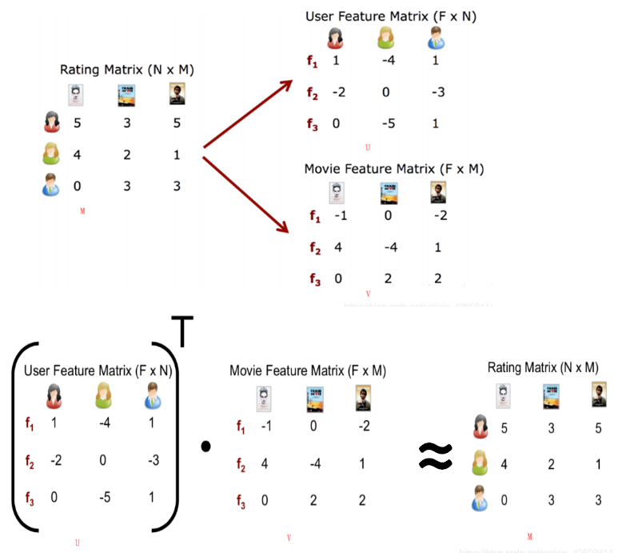

[TOC]
# 推荐系统 Recommender system

[推荐系统](../../BigData/推荐引擎.md)([recommender system](https://en.jinzhao.wiki/wiki/Recommender_system) or recommendation system) 有时也称为推荐平台或推荐引擎(platform or engine)，是[Information filtering system](https://en.jinzhao.wiki/wiki/Information_filtering_system)的一个子类。

[目前工业界常用的推荐系统模型有哪些？](https://www.zhihu.com/question/314773668)


## 方法Approaches或算法Recommended Algorithms

[Collaborative filtering](https://en.jinzhao.wiki/wiki/Collaborative_filtering)
Content-based filtering
Session-based recommender systems
Reinforcement learning for recommender systems
Multi-criteria recommender systems
Risk-aware recommender systems
[Mobile recommender systems](https://en.jinzhao.wiki/wiki/Location_based_recommendation)
Hybrid recommender systems


## 开源库介绍
推荐问题解决的问题归纳为给用户u推荐物品i，并且满足用户偏好、新奇度和多样性等
### 基于显式反馈（explicit feedback）的数据集
比如评分相关的推荐算法[Surprise](http://surpriselib.com/)

协同过滤和矩阵分解是常用的方法。

数据格式：user item rating timestamp（时间戳可以不要）

#### 矩阵分解
由原始数据组成的用户-物品的评分矩阵（User-Item Matrix）

.|I1|I2|I3|I4|I5
---|---|---|---|---|---
A|5|4|4.5|?|3
B|?|4|?|4|?
C|4|?|3.5|4|3
D|?|5|?|?|3
E|4|?|4.5|5|?
我需要找到一个矩阵$\hat{R}$近似未知的矩阵$R$
$$R \approx \hat{R} = Q^TP$$

损失函数
$$\sum_{r_{ui} \in R_{train}} \left(r_{ui} - \hat{r}_{ui} \right)^2 $$


上面只是最简单的原理介绍
详细使用方法以及公式，见[Matrix Factorization-based algorithms](https://surprise.readthedocs.io/en/stable/matrix_factorization.html)

[Matrix Factorization: A Simple Tutorial and Implementation in Python](http://www.quuxlabs.com/blog/2010/09/matrix-factorization-a-simple-tutorial-and-implementation-in-python/)
#### 协同过滤
##### k-NN
> collaborative filtering

基于邻域的协同过滤算法：knns.KNNBasic;knns.KNNWithMeans;
knns.KNNWithZScore;knns.KNNBaseline;
主要参数：
k:设置领域的个数；
user_based：是否为基于用户的协同过滤，True则为UserCF，False为ItemCF；
name：相似度计算方式，默认为MSD，也可设置为cosine，pearson，pearson_baseline

[符号解释](https://surprise.readthedocs.io/en/stable/notation_standards.html)
[sim_options参数](https://surprise.readthedocs.io/en/stable/prediction_algorithms.html#similarity-measures-configuration)

- KNNBasic
`surprise.prediction_algorithms.knns.KNNBasic(k=40, min_k=1, sim_options={}, verbose=True, **kwargs)`
**user_based=True**
$$\hat{r}_{ui} = \frac{
\sum\limits_{v \in N^k_i(u)} \text{sim}(u, v) \cdot r_{vi}}
{\sum\limits_{v \in N^k_i(u)} \text{sim}(u, v)}$$
其中$sim(u,v)$表示user相似度；
$N^k_i(u)$表示评价过item i的user中与当前user u 最相似的前k个user的集合；
**user_based=True**
$$\hat{r}_{ui} = \frac{
\sum\limits_{j \in N^k_u(i)} \text{sim}(i, j) \cdot r_{uj}}
{\sum\limits_{j \in N^k_u(i)} \text{sim}(i, j)}$$
其中$sim(i,j)$表示item相似度；
$N^k_u(i)$表示user u 评价过的item集合中与当前item i最相似的前k个item的集合。

- KNNWithMeans
`surprise.prediction_algorithms.knns.KNNWithMeans(k=40, min_k=1, sim_options={}, verbose=True, **kwargs)`
该方法认为，每个用户的打分跟用户本身的习惯有关，都是基于某一个特定值上下浮动。
$$\hat{r}_{ui} = \mu_u + \frac{ \sum\limits_{v \in N^k_i(u)}
\text{sim}(u, v) \cdot (r_{vi} - \mu_v)} {\sum\limits_{v \in
N^k_i(u)} \text{sim}(u, v)}$$
or
$$\hat{r}_{ui} = \mu_i + \frac{ \sum\limits_{j \in N^k_u(i)}
\text{sim}(i, j) \cdot (r_{uj} - \mu_j)} {\sum\limits_{j \in
N^k_u(i)} \text{sim}(i, j)}$$
其中$\mu_u$表示用户u所有评分的均值；


- KNNWithZScore
`surprise.prediction_algorithms.knns.KNNWithZScore(k=40, min_k=1, sim_options={}, verbose=True, **kwargs)`
该算法通过同时考虑均值和方差来对标准的KNN推荐算法进行改进
$$\hat{r}_{ui} = \mu_u + \sigma_u \frac{ \sum\limits_{v \in N^k_i(u)}
\text{sim}(u, v) \cdot (r_{vi} - \mu_v) / \sigma_v} {\sum\limits_{v
\in N^k_i(u)} \text{sim}(u, v)}$$
or
$$\hat{r}_{ui} = \mu_i + \sigma_i \frac{ \sum\limits_{j \in N^k_u(i)}
\text{sim}(i, j) \cdot (r_{uj} - \mu_j) / \sigma_j} {\sum\limits_{j
\in N^k_u(i)} \text{sim}(i, j)}$$
其中$\sigma_u$表示用户u所有评分的方差；


- KNNBaseline
`surprise.prediction_algorithms.knns.KNNBaseline(k=40, min_k=1, sim_options={}, bsl_options={}, verbose=True, **kwargs)`
该算法不再使用传统的统计指标，而是允许使用自定义的计算方法来为每一个用户计算一个一个基准值。
$$\hat{r}_{ui} = b_{ui} + \frac{ \sum\limits_{v \in N^k_i(u)}
\text{sim}(u, v) \cdot (r_{vi} - b_{vi})} {\sum\limits_{v \in
N^k_i(u)} \text{sim}(u, v)}$$
or
$$\hat{r}_{ui} = b_{ui} + \frac{ \sum\limits_{j \in N^k_u(i)}
\text{sim}(i, j) \cdot (r_{uj} - b_{uj})} {\sum\limits_{j \in
N^k_u(i)} \text{sim}(i, j)}$$

##### SlopeOne
> collaborative filtering

$$\hat{r}_{ui} = \mu_u + \frac{1}{
|R_i(u)|}
\sum\limits_{j \in R_i(u)} \text{dev}(i, j),  $$
$$\text{dev}(i, j) = \frac{1}{
|U_{ij}|}\sum\limits_{u \in U_{ij}} r_{ui} - r_{uj}$$

例如下面表格里有3个用户对4个物品的评分
|       | 101 | 102 | 103 | 104 |
|-------|-----|-----|-----|-----|
| UserX | 5   | 3.5 |     |     |
| UserY | 2   | 5   | 4   | 2   |
| UserZ | 4.5 | 3.5 | 1   | 4   |
求物品两两之间的差值平均分:
物品102和101：{(3.5-5)+(5-2)+(3.5-4.5)}/3=0.5/3
物品103跟101：{(4-2)+(1-4.5)}/2=-1.5/2
物品104跟101：{(2-2)+(4-4.5)}/2=-0.5/2
物品103跟102：{(4-5)+(1-3.5)}/2=-3.5/2
物品104跟102：{(2-5)+(4-3.5)}/2=-2.5/2
物品104跟103：{(2-4)+(4-1)}/2=1/2
能得到下面表格
|     | 101   | 102   | 103 | 104 |
|-----|-------|-------|-----|-----|
| 101 |       |       |     |     |
| 102 | 0.17  |       |     |     |
| 103 | -0.75 | -1.75 |     |     |
| 104 | -0.25 | -1.25 | 0.5 |     |
OK，现在准备工作已经完成了，然后进行推荐，例如对X用户进行推荐，103和104个预测评分根据101、102的评分来的。
X预测103评分={(-0.75+5)+(-1.75+3.5)}/2=(4.25+1.75)/2=3
X预测104评分={(-0.25+5)+(-1.25+3.5)}/2=(4.75+2.25)/2=3.5
那么给X用户推荐的顺序就是：先推荐104在推荐103

[SlopeOne 算法基本原理](https://blog.csdn.net/redhatforyou/article/details/86656356)

##### CoClustering
> collaborative filtering

$$\hat{r}_{ui} = \overline{C_{ui}} + (\mu_u - \overline{C_u}) + (\mu_i- \overline{C_i})$$

协同聚类${C_{ui}}$ 的均值(聚类质心)$\overline{C_{ui}}$ 
聚类${C_u}$（基于user） 的均值(聚类质心)$\overline{C_{u}}$ 
聚类${C_i}$（基于item） 的均值(聚类质心)$\overline{C_{i}}$ 

```
cc = CoClustering(n_cltr_u=3,n_cltr_i =2)
cc.avg_cltr_i.shape # (2,)
cc.avg_cltr_u.shape # (3,)
cc.avg_cocltr.shape # (3,2)
```

### 基于隐式反馈（implicit feedback）的数据集
> Collaborative Filtering

比如根据用户行为相关的推荐算法[implicit](https://implicit.readthedocs.io/en/latest/index.html)

[代码参考](https://github.com/sahanasub/Implicit-Recommendation-Engine-for-Meetup.com)

隐式反馈特征
相对于显示反馈数据，隐式反馈有以下几方面特征
1. 没有负反馈，只能得到用户喜欢那些物品，对于用户不喜欢的物品没有数据支持。
2. 隐式反馈噪声比较多，不像用户评分行为是用户强烈的主动行为，用户浏览行为、点击行为都相对比较被动。以浏览行为为例，可能某个页面是用户默认打开页面导致打分较高。
3. 显式反馈代表用户真实的喜好程度，隐式反馈代表置信度
4. 评估相对不容易

原始数据格式1：userId itemId eventType value
原始数据格式2：eventType event_weight

转换数据格式1：userId itemId total_weight
转换数据格式1-2：pd.factorize(userId) pd.factorize(itemId) total_weight (主要是减少存储)

最终数据格式：
压缩稀疏行矩阵：item_user_sparse_matrix = csr_matrix((df['weight'], (df['iid'], df['uid'])))

[稀疏矩阵相关方法](https://docs.scipy.org/doc/scipy/reference/sparse.html)

coo_matrix：坐标格式的稀疏矩阵
csr_matrix：压缩稀疏行矩阵

基类**RecommenderBase**https://implicit.readthedocs.io/en/latest/models.html

- fit(item_user=csr_matrix)方法：
- rank_items(userid=user_id, user_items=None, selected_items=selected_items_ids, recalculate_user=False)
方法：指定用户(user_id)对指定物品集合(selected_items_ids)进行排名，返回物品排序列表(List of (itemid, score) tuples，仅仅返回指定的物品集合selected_items)

- recommend(userid=user_id, user_items=None, N=5, filter_already_liked_items=False, filter_items=list(排除列表), recalculate_user=False)
方法：指定用户(user_id)并设置相关过滤条件, 返回TOP-N物品推荐列表(List of (itemid, score) tuples);

- recommend_all()为多个用户推荐TOP-N
https://implicit.readthedocs.io/en/latest/lmf.html

- similar_items(itemid=item_id, N=5, react_users=None, recalculate_item=False)
方法：指定物品(item_id), 返回TOP-N类似物品列表(List of (itemid, score) tuples);

- similar_users(userid=user_id, N=5)
方法：指定用户(user_id), 返回TOP-N类似用户列表(List of (userid, score) tuples);


- item_factors
属性：
- user_factors
属性：


**AlternatingLeastSquares**交替最小二乘法
在矩阵分解（matrix factorization）中使用的一种算法。有一个稀疏矩阵，假设这个矩阵是低阶的，可以分解成两个小矩阵相乘。然后交替对两个小矩阵使用最小二乘法，算出这两个小矩阵，就可以估算出稀疏矩阵缺失的值：


AlternatingLeastSquares(factors=潜在特征因子数量, regularization=0.1, iterations=迭代次数)
潜在特征因子数量就类似与前面交替最小二乘法示意图中介绍的User Feature Matrix和Movie Feature Matrix.（f1,f2,f3; factors=3）

**BayesianPersonalizedRanking**贝叶斯个性化排序
[BPR: Bayesian Personalized Ranking from Implicit Feedback](https://arxiv.org/ftp/arxiv/papers/1205/1205.2618.pdf)

BayesianPersonalizedRanking(factors=潜在特征因子数量, learning_rate =SGD学习速率, regularization=0.1, iterations=迭代次数)


**LogisticMatrixFactorization**
[Logistic Matrix Factorization for Implicit Feedback Data](https://web.stanford.edu/~rezab/nips2014workshop/submits/logmat.pdf)

BayesianPersonalizedRanking(factors=潜在特征因子数量, learning_rate =SGD学习速率, regularization=0.1, iterations=迭代次数, neg_prop=30)

- fit(item_users=coo_matrix)


**Approximate Alternating Least Squares**近似交替最小二乘
实现一：**NMSLibAlternatingLeastSquares**,[基于NMSLib](https://github.com/searchivarius/nmslib)
利用NMSLib建立潜在因子的近似最近邻指数，加速交替最小二乘模型的速度。

实现二：**AnnoyAlternatingLeastSquares**,[基于 Annoy index](https://github.com/spotify/annoy)
使用一个Annoy index来计算相似的items和推荐的items。

实现三：**FaissAlternatingLeastSquares**,[基于 Faiss](https://github.com/facebookresearch/faiss)
利用Faiss建立潜在因子的近似最近邻指数，加速交替最小二乘模型的速度。


> 以上所有模型都是基于**MatrixFactorizationBase** -> 基于**RecommenderBase**


最近邻模型使用Cosine，TFIDF或BM25作为距离度量
from implicit.nearest_neighbours import ItemItemRecommender,CosineRecommender,TFIDFRecommender,BM25Recommender

**ItemItemRecommender** ->基于**RecommenderBase**

**CosineRecommender**,**TFIDFRecommender**,**BM25Recommender**-> 基于**ItemItemRecommender**

#### 论文
[Collaborative Filtering for Implicit Feedback Datasets](http://yifanhu.net/PUB/cf.pdf)
[Applications of the Conjugate Gradient Method for Implicit Feedback Collaborative Filtering.](http://www.sze.hu/~gtakacs/download/recsys_2011_draft.pdf)

### both implicit and explicit feedback
针对隐式和显式反馈的混合模型——[LightFM](https://making.lyst.com/lightfm/docs/home.html)
https://github.com/lyst/lightfm

`lightfm.LightFM(no_components=10, k=5, n=10, learning_schedule=’adagrad’, loss=’logistic’, learning_rate=0.05, rho=0.95, epsilon=1e-06, item_alpha=0.0, user_alpha=0.0, max_sampled=10, random_state=None)`

**四个可选的损失函数**:
- **logistic**: useful when both positive (1) and negative (-1) interactions are present.
- **BPR**: [Bayesian Personalised Ranking](https://making.lyst.com/lightfm/docs/lightfm.html#id6) pairwise loss. Maximises the prediction difference between a positive example and a randomly chosen negative example. Useful when only positive interactions are present and optimising ROC AUC is desired.
- **WARP**: [Weighted Approximate-Rank Pairwise](https://making.lyst.com/lightfm/docs/lightfm.html#id7) loss. Maximises the rank of positive examples by repeatedly sampling negative examples until rank violating one is found. Useful when only positive interactions are present and optimising the top of the recommendation list (precision@k) is desired.
- **k-OS WARP**: [k-th order statistic loss](https://making.lyst.com/lightfm/docs/lightfm.html#id8). A modification of WARP that uses the k-th positive example for any given user as a basis for pairwise updates.

**参数**：
- **no_components** (int,optional) – the dimensionality of the feature latent embeddings. 隐因子的个数
- **k** (int,optional) – for k-OS training, the k-th positive example will be selected from the n positive examples sampled for every user. （针对于k-OS）
- **n** (int,optional) – for k-OS training, maximum number of positives sampled for each update.（针对于k-OS）
- **learning_schedule** (string,optional) – one of (‘adagrad’, ‘adadelta’).
- **loss** (string,optional) – one of (‘logistic’, ‘bpr’, ‘warp’, ‘warp-kos’): the loss function. 损失函数
- **learning_rate** (float,optional) – initial learning rate for the adagrad learning schedule.
- **rho** (float,optional) – moving average coefficient for the adadelta learning schedule.
- **epsilon** (float,optional) – conditioning parameter for the adadelta learning schedule.
- **item_alpha** (float,optional) – L2 penalty on item features. Tip: setting this number too high can slow down training. One good way to check is if the final weights in the embeddings turned out to be mostly zero. The same idea applies to the user_alpha parameter.
- **user_alpha** (float,optional) – L2 penalty on user features.
- **max_sampled** (int,optional) – maximum number of negative samples used during WARP fitting. It requires a lot of sampling to find negative triplets for users that are already well represented by the model; this can lead to very long training times and overfitting. Setting this to a higher number will generally lead to longer training times, but may in some cases improve accuracy. （针对于WARP，设置过高容易导致运行时间变长，但有时候可能提高准确性）
- **random_state** (int seed,RandomState instance, orNone) – The seed of the pseudo random number generator to use when shuffling the data and initializing the parameters. 随机数种子

**变量：**

- **item_embeddings** (np.float32 array of shape[n_item_features,n_components])
- **user_embeddings** (np.float32 array of shape[n_user_features,n_components])
- **item_biases** (np.float32 array of shape[n_item_features,]) – Contains the biases for item_features. 偏差
- **user_biases** (np.float32 array of shape[n_user_features,]) – Contains the biases for user_features. 偏差

**方法：**
- **fit**(interactions,user_features=None,item_features=None,sample_weight=None,epochs=1,num_threads=1,verbose=False) 拟合模型
- **fit_partial**(interactions, user_features=None, item_features=None, sample_weight=None, epochs=1, num_threads=1, verbose=False)
- **get_item_representations**(features=None)
- **get_params**(deep=True)
- **get_user_representations**(features=None)
- **set_params**(**params)
- **predict**(user_ids,item_ids,item_features=None,user_features=None,num_threads=1) 计算用户对项目的推荐分数
- **predict_rank**(test_interactions,train_interactions=None,item_features=None,user_features=None,num_threads=1,check_intersections=True) 预测排名

**LightFM模型评估**
- **lightfm.evaluation.precision_at_k**（model，test_interactions，train_interactions = None，k = 10，user_features = None，item_features = None，reserve_rows= False，num_threads = 1，check_intersections = True）排名结果列表的前k个位置中已知正向的分数。满分为1.0。
- **lightfm.evaluation.recall_at_k**（model，test_interactions，train_interactions = None，k = 10，user_features = None，item_features = None，reserve_rows= False，num_threads = 1，check_intersections = True）用模型的k度量来衡量召回率
- **lightfm.evaluation.auc_score**(model,test_interactions,train_interactions=None,user_features=None,item_features=None,preserve_rows=False,num_threads=1,check_intersections=True) 测量模型的ROC AUC度量：随机选择的阳性样本比随机选择的阴性样本得分更高的概率。满分为1.0。
- **lightfm.evaluation.reciprocal_rank**(model,test_interactions,train_interactions=None,user_features=None,item_features=None,preserve_rows=False,num_threads=1,check_intersections=True)

**自带数据集**
- **lightfm.datasets.movielens.fetch_movielens**（data_home = None，indicator_features = True，genre_features = False，min_rating = 0.0，download_if_missing = True）：电影评分
- **lightfm.datasets.stackexchange.fetch_stackexchange**(dataset,test_set_fraction=0.2,min_training_interactions=1,data_home=None,indicator_features=True,tag_features=False,download_if_missing=True)

**数据集建设(自定义数据集)**
`lightfm.data.Dataset(user_identity_features=True, item_identity_features=True)`
用于构建交互和特征矩阵的工具，负责处理用户/项目ID与特征名称和内部特征索引之间的映射。
[参考](https://making.lyst.com/lightfm/docs/examples/dataset.html#getting-the-data)

- 创建数据集类的实例。-调用fit（或fit_partial）
- 使用(user id, item id) 或 (user id, item id, weight) 的可迭代项调用build_interactions来构建交互和权重矩阵。
build_interactions(data=(iterable of (user_id, item_id) or (user_id, item_id, weight)) )weight如果未提供，默认1

- 使用（user / item id，[features]）或（user / item id，{feature：feature weight}）的可迭代项调用build_user / item_features来构建特征矩阵。
- 要添加新的用户/商品ID或功能，请再次调用fit_partial。您将需要调整LightFM模型的大小，才能使用新功能。

