<!--  -->
[TOC]

# 统计学习方法

[第一版](https://github.com/kingreatwill/files/tree/main/%E7%BB%9F%E8%AE%A1%E5%AD%A6%E4%B9%A0%E6%96%B9%E6%B3%95/book/Lihang-first_edition)

[第二版](https://github.com/kingreatwill/files/tree/main/%E7%BB%9F%E8%AE%A1%E5%AD%A6%E4%B9%A0%E6%96%B9%E6%B3%95/book/Lihang-second_edition)

## 第 1 章 统计学习及监督学习概论

**统计学习的主要特点是**：

1. 统计学习以计算机及网络为平台，是建立在计算机及网络之上的；
2. 统计学习以数据为研究对象，是数据驱动的学科；
3. 统计学习的目的是对数据进行预测与分析；
4. 统计学习以方法为中心，统计学习方法构建模型并应用模型进行预测与分析；
5. 统计学习是概率论、统计学、信息论、计算理论、最优化理论及计算机科学等多个领域的交叉学科，并且在发展中逐步形成独自的理论体系与方法论。

**假设空间(hypothesis space)**：
$$\mathcal H = \{ f(x;\theta) | \theta \in \mathbb{R}^D\} \\ or \quad \mathcal F = \{P|P(Y|X;\theta),\theta \in \mathbb{R}^D\}$$
其中$f(x; \theta)$是参数为$\theta$ 的函数（**决策函数**），也称为模型（Model），参数向量$\theta$取值与$D$维欧式空间$\mathbb{R}^D$,也称为参数空间(parameter space)，$D$ 为参数的数量(维度)

模型的假设空间(hypothesis space)包含所有可能的条件概率分布或决策函数

**特征空间（feature space）**：
每个具体的输入是一个实例（instance），通常由特征向量（feature vector）表示。这
时，所有特征向量存在的空间称为特征空间（feature space）。特征空间的每一维对应于
一个特征。

> 输入空间中的一个输入向量$x = (x_1,x_2)$，在多项式模型中特征向量是($x_1^2,x_1x_2,x_2^2,...$)
> 一般说的线性模型，指的是特征向量的线性组合，而不是指输入向量，所以说模型都是定义在特征空间上的

**统计学习的三要素**：

1. 模型的假设空间(hypothesis space)，简称：模型(model)。假设空间即我们对模型形式的先验假设，最终我们求得的模型必定符合我们对模型形式的先验假设。
2. 模型选择的准则(evaluation criterion)，简称：策略(strategy)或者学习准则。即我们用什么标准来评价一个模型的好坏。策略决定了我们从假设空间中选择模型的偏好。
3. 模型学习的算法(algorithm)，简称：算法(algorithm)。优化算法指的是通过什么样的方式调整我们的模型结构或模型超参数取值，使得模型的目标函数取值不断降低。优化算法决定了我们用什么样的步骤在假设空间中寻找合适的模型。

> 以线性回归（Linear Regression）为例：
> 模型： $f(x;w,b) = w^Tx +b$
> 策略(strategy)或者学习准则: 平方损失函数 $\mathcal L(y,\hat{y}) = (y-f(x,\theta))^2$
> 算法：解析解 analytical solution(闭式解 closed-form solution)和数值解 numerical solution，如：closed-form 的最小二乘的解以及梯度下降法

**机器学习的定义**：

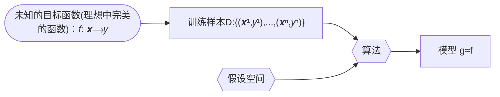

使用训练数据来计算接近目标 𝑓 的假设（hypothesis ）g （来自：[Machine Learning Foundations（机器学习基石）- the learning problem,25 页](https://www.csie.ntu.edu.tw/~htlin/course/mlfound17fall/doc/01_handout.pdf)）

**监督学习**：
监督学习(supervised learning)是指从标注数据中学习预测模型的机器学习问题。本质是**学习输入到输出的映射的统计规律**。

输入变量与输出变量均为连续变量的预测问题称为**回归问题**；
输出变量为有限个离散变量的预测问题称为**分类问题**；
输入变量与输出变量均为变量序列的预测问题称为**标注问题**(分类问题的推广，如：隐马尔可夫模型 HMM，条件随机场 CRF)。

监督学习的模型可以是概率模型或非概率模型，由**条件概率分布**$P(Y|X)$或**决策函数（decision function）**$Y=f(X)$表示，随具体学习方法而定。对具体的输入进行相应的输出预测时，写作$P(y|x)$或$Y=f(x)$。
$$y =\displaystyle\argmax_{y}  P(y|x)$$

**联合概率分布**：
监督学习假设输入与输出的随机变量 X 和 Y 遵循联合概率分布$P(X,Y)$。$P(X,Y)$表示分布函数，或分布密度函数。注意，在学习过程中，假定这一联合概率分布存在，但对学习系统来说，联合概率分布的具体定义是未知的。**训练数据与测试数据被看作是依联合概率分布$P(X,Y)$独立同分布产生的**。
统计学习假设数据存在一定的统计规律，$X$和$Y$具有联合概率分布的假设就是监督学习关于数据的基本假设。

**非监督学习**：
非监督学习(unsupervised learning)是指从无标注数据中学习预测模型的机器学习问题。本质是**学习数据中的统计规律或潜在结构**。

非监督学习的模型可以表示为函数$z = g(x)$或者条件概率分布$P(z|x)$ （输出$z$可以是**聚类**或者**降维**）
$$z =\displaystyle\argmax_{z}  P(z|x)$$
以及 条件概率分布$P(x|z)$ （用来做**概率密度估计**，比如 GMM 中$P(x|z)$属于高斯分布，如果假设知道数据来自哪个高斯分布，即知道$z$，我们可以用极大似然估计来估计相关参数）。

[核密度估计 Kernel Density Estimation.](https://scikit-learn.org/stable/modules/generated/sklearn.neighbors.KernelDensity.html) - 应用密度估计检测离群值（outlier）的[LocalOutlierFactor](https://scikit-learn.org/stable/modules/generated/sklearn.neighbors.LocalOutlierFactor.html)

**概率模型（probabilistic model）与非概率模型（non-probabilistic model）或者确定性模型（deterministic model）**：

概率模型（probabilistic model）- 条件概率分布 P(y|x)和 非概率模型（non-probabilistic model） - 函数 y=f(x)可以**相互转化**，条件概率分布最大化后得到函数，函数归一化后得到条件概率分布。所以概率模型与非概率模型的区别不在于输入输出之间的映射关系，而在于模型的内部结构：概率模型一定可以表示为联合概率分布的形式，而非概率模型则不一定存在这样的联合概率分布。

概率模型的代表是**概率图模型（probabilistic graphical model）**$^{参考文献[1-3]}$，联合概率分布可以根据图的结构分解为因子乘积的形式，可以用最基本的加法规则和乘法规则进行概率推理：
$$P(x) = \sum_yP(x,y) \\ P(x,y) = P(x)P(y|x)$$

**参数化模型（parametric model）和非参数化模型（non-parametric model）**：

参数化模型假设模型参数的维度固定，模型可以由有限维参数完全刻画，不随数据点的变化而变化。(如：感知机、GMM、logistic regression、朴素贝叶斯、k 均值聚类、潜在语义分析、概率潜在语义分析、潜在狄利克雷分配)
非参数化模型假设模型参数的唯独不固定或者说无穷大，随着训练数据量的增加而不断增大。(如：决策树、支持向量机、AdaBoost、k 近邻)

> 非参数化模型意味着决策树没有假设空间分布和分类器结构?

**在线学习（online learning）和批量学习（batch learning）**：

在线学习每次接受一个样本，预测后学习模型，并不断重复该操作。
批量学习一次接受所有数据，学习模型之后进行预测。

在线学习比批量学习更难，因为每次模型更新中可利用的数据有限。

**贝叶斯学习（Bayesian learning）/ 贝叶斯推理（Bayesian inference）**：
$$\mathrm{Bayes \; Rule:} \\ \underbrace{P(X|Y)}_{\mathrm{posterior}} = \frac{\overbrace{P(Y|X)}^{\mathrm{likelihood}}\overbrace{P(X)}^{\mathrm{prior}}}{\underbrace{P(Y)}_{\mathrm{evidence}}}   = \frac{\overbrace{P(Y|X)}^{\mathrm{likelihood}}\overbrace{P(X)}^{\mathrm{prior}}}{\underbrace{\sum_{x}P(Y|X)P(X)}_{\mathrm{evidence}}}$$

**核技巧（kernel trick）/ 核方法（kernel method）**：

**核方法**是一类把低维空间的非线性可分问题，转化为高维空间的线性可分问题的方法。
**核技巧**是一种利用核函数直接计算 $\lang \phi(x),\phi(z) \rang$ ，以避开分别计算 $\phi(x)$ 和 $\phi(z)$ ，从而加速核方法计算的技巧。

**核函数**：[Kernel function](https://en.jinzhao.wiki/wiki/Positive-definite_kernel)
设 $\mathcal X$ 是输入空间（即 $x_i \in \mathcal X $ ， $\mathcal X$ 是 $\mathbb R^n$ 的子集或离散集合 ），又设 $\mathcal H$ 为特征空间（​ 希尔伯特空间$^{附加知识:各种空间介绍}$），如果存在一个从 $\mathcal X$ 到 $\mathcal H$ 的映射

$$\phi(x) : \mathcal X \to \mathcal H$$

使得对所有 $x,z \in \mathcal X$ ，函数 $K(x,z)$ 满足条件

$$K(x,z) = \phi(x).\phi(z) = \lang \phi(x),\phi(z) \rang$$

则称 $K(x,z)$ 为核函数。其中 $\phi(x) $ 为映射函数， $\lang \phi(x),\phi(z) \rang$ 为内积。

[核技巧](https://en.jinzhao.wiki/wiki/Kernel_method)的想法是，在学习和预测中只定义核函数 $K(x,z)$ ，而不显式地定义映射函数 $\phi $。通常直接计算$K(x,z)$比较容易，而通过$\phi(x) $和$\phi(z) $计算$K(x,z)$并不容易。

> 注意：$\phi $是输入空间$\mathbb{R}^n$到特征空间$\mathcal H$的映射，特征空间$\mathcal H$一般是高维的，甚至是无穷维的。所以$\phi$不好计算，甚至会带来**维度灾难**又称**维度诅咒（Curse of Dimensionality）**$^{附加知识:维度诅咒}$。

### 附加知识

#### 正则化

正则化符合奥卡姆剃刀（Occam's razor）原理。

参考：[L1L2 正则化和凸优化](../图解数学/L1L2正则化和凸优化.md)

#### 模型选择

参考：[模型选择](../Model-Selection.md)

#### 生成模型和判别模型

参考：[生成模型和判别模型](../生成模型和判别模型.md)

#### 各种空间介绍

**线性空间**就是定义了**加法和数乘**的空间(空间里的一个元素就可以由其他元素线性表示)。

---

**度量空间**就是定义了**距离**的空间（曼哈顿距离，欧氏距离，闵可夫斯基距离，马氏距离，切比雪夫距离）。
定义距离时，有三条公理必须遵守：

1. 非负性、同一性：$dist(x_i,x_j) \geq 0$(非负性)，$dist(x_i,x_j) = 0$当且仅当$x_i=x_j$(同一性)
2. 对称性：$dist(x_i,x_j) = dist(x_j,x_i)$
3. 三角不等式(也叫直递性)：$dist(x_i,x_j) \leq dist(x_i,x_k) + dist(x_k,x_j)$
   希尔伯特空间(Hilbert)
   > 文字解释：【两点之间距离不为负；两个点只有在 空间 上重合才可能距离为零；a 到 b 的距离等于 b 到 a 的距离;a 到 c 的距离加上 c 到 b 的距离大于等于 a 直接到 b 的距离;】

---

**赋范空间**就是定义了**范数**的空间。
x 的范数||x||就是 x 的**长度**。那么这里的长度和上一节中说的距离到底有什么区别呢。**距离的概念是针对两个元素来说的**，例如 d(x,y)指的是 x 与 y 两个元素之间的距离，而**范数是针对一个元素来说的**，每一个元素都对应一个范数，可以将范数理解为一个元素到零点的距离（这只是一种理解，并不是定义），也就是它自己的长度。
定义：
称 映射$||.|| : \mathbb{R}^n \to \mathbb{R}$为 $\mathbb{R}^n$ 上的范数，当且仅当：

1. 非负性： $\forall x \in \mathbb{R}^n ,||x|| \geq 0$ ,$||x|| = 0$当且仅当$x=0$
2. 数乘：$\forall x \in \mathbb{R}^n ,a \in \mathbb{R}^n, ||ax|| = |a|.||x||$
3. 三角不等式: $\forall x,y \in \mathbb{R}^n ,||x+y|| \leq ||x|| + ||y||$

如果我们定义了范数，可以在这基础上定义距离：dist(x,y)=||x-y||。根据范数的三条性质，我们可以证明我们这样定义的距离也满足距离的定义，聪明的你可以自己证明一下（对称性的证明，提一个-1 出来，一加绝对值就是 1 了）。

也就是说范数其实是一个更加具体的概念，**有了范数一定能利用范数定义距离，但是有距离不能定义范数**。

也许你会问，你不是说理解范数就是一个元素到零点的距离吗，那定义范数为||x||=dist(x,0) 不就行了吗。这样的话，对于范数的第二条性质就不一定会满足，||ax||=dist(ax,0)，而 dist(ax,0)不一定等于|a|dist(x,0)，具体等不等于还要看你的距离是怎么定义的。

例如：L<sub>p</sub>范数
欧式距离对应 L2 范数
曼哈顿距离对应 L1 范数
切比雪夫距离对应 L∞ 范数
L<sub>p</sub>范数：当 p>=1 时，向量的 L<sub>p</sub>范数是凸的。(这也是为什么一般不用 L0 范数的原因之一)

---

**线性赋范空间**就是定义了加法、数乘和范数的空间。

---

**巴拿赫空间**就是**完备的赋范线性空间**。(Banach space)
**完备的空间**的定义：如果一个空间是完备的，那么该空间中的任何一个柯西序列都收敛在该空间之内。

首先来说一下柯西序列是什么，柯西序列就是随着序数增加，值之间的距离越来越小的序列。换一种说法是，柯西序列可以在去掉有限个值之后，使任意两个值之间的$\underline{\mathrm{距离}}$都小于任意给定正常数（其实这就是定义了一个极限而已）。

那么任意一个柯西序列都收敛在该空间内是什么意思呢，举个例子你就明白了。

设定义在有理数空间 Q 上的序列：$x_n = \frac{[\sqrt{2}n]}{n}$，其中[x]表示 x 取整数部分。
对于这个数列来说，每一个元素的分子分母都是整数，所以每一个$x_n$都在有理数空间 Q 上，那这个序列的极限呢，稍有常识的人都能看出，这个序列的极限是$\sqrt{2}$，而这并不是一个有理数，所以这个柯西序列的极限不在该空间里面，也就是说有理数空间 Q 是不完备的。

所以完备的意义我们可以这样理解，那就是**在一个空间上我们定义了极限，但是不论你怎么取极限，它的极限的值都不会跑出这个空间，那么这个空间就是完备空间**。

另外，不知道你有没有发现，上面在解释什么是柯西序列的时候，有一个词我加了下划线，那就是距离，也就说说在定义完备空间之前，要先有距离的概念。所以**完备空间，其实也是完备度量空间**。

所以，巴拿赫空间满足几条特性呢：距离、范数、完备。

---

**内积空间**就是定义了内积的空间。[Inner product space](https://en.jinzhao.wiki/wiki/Inner_product_space)
有时也称准希尔伯特空间。
内积就是我们所说的点乘、标积，它的定义方式也不是唯一的，但如同距离范数的定义一样，内积的定义也要满足某些条件，不能随便定义。

定义映射$\lang .,. \rang : V \times V \to \mathbb{F}$, 其中$V$是向量，$\mathbb{F}$是标量
有$x,y,z \in V ,s \in \mathbb{F}$，那么内积满足

1. 第一个参数中的线性:
   $$\lang sx,y \rang = s\lang x,y \rang \\ \lang x+y,z \rang = \lang x,z \rang + \lang y,z \rang \\ \lang 0,x \rang = 0$$

2. 共轭对称:$\lang x,y \rang = \overline{\lang y,x \rang }$

3. 正定性:$\lang x,x \rang > 0 \quad\mathrm{if}\; x \neq 0$

4. 正半定性或非负定性:$\forall{x}, \lang x,x \rang \geq 0 $

5. 确定性：$\lang x,x \rang = 0 必然有 x=0$

3，4，5 可以跟上面定义范数和距离一样写成一个

例子-欧几里得向量空间:
$ x,y \in \mathbb{R}^n , \lang x,y \rang = x^Ty=\sum\_{i=1}^n{x_iy_i}$

**只有定义了内积，才会有夹角的概念，才会有正交的概念，另外内积也可以定义范数，也就是说内积是比范数更具体的一个概念。**

---

**欧式空间**就是定义了内积的有限维实线性空间。

---

**希尔伯特空间**就是完备的内积空间。(Hilbert space)
希尔伯特空间中的元素一般是函数，因为一个函数可以视为一个无穷维的向量。

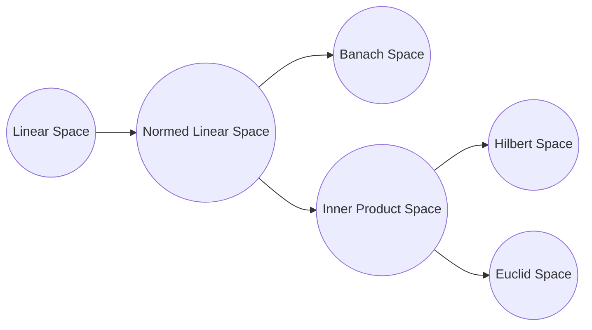


参考：[一片文章带你理解再生核希尔伯特空间（RKHS）以及各种空间](https://blog.csdn.net/ChangHengyi/article/details/80577318)

#### 维度诅咒

维度诅咒通常是指在涉及到向量的计算的问题中，随着维数的增加，计算量呈指数倍增长的一种现象。高维度有更大的特征空间，需要更多的数据才可以进行较准确的估计。

> 若特征是二值的，则每增加一个特征，所需数据量都在以 2 的指数级进行增长，更何况很多特征不只是二值的。

几何角度 1：

<svg width="52" height="52" xmlns="http://www.w3.org/2000/svg">
 <!-- Created with Method Draw - http://github.com/duopixel/Method-Draw/ -->
 <g>
  <title>background</title>
  <rect fill="#fff" id="canvas_background" height="54" width="54" y="-1" x="-1"/>
  <g display="none" overflow="visible" y="0" x="0" height="100%" width="100%" id="canvasGrid">
   <rect fill="url(#gridpattern)" stroke-width="0" y="0" x="0" height="100%" width="100%"/>
  </g>
 </g>
 <g>
  <title>Layer 1</title>
  <rect stroke="#000" id="svg_1" height="50" width="50" y="1.134891" x="1.227186" stroke-width="1.5" fill="#fff"/>
  <ellipse stroke="#000" ry="25" rx="25" id="svg_2" cy="26.316708" cx="25.727185" fill-opacity="null" stroke-opacity="null" stroke-width="1.5" fill="#fff"/>
  <line stroke-linecap="null" stroke-linejoin="null" id="svg_3" y2="26.363651" x2="49.090879" y1="26.363651" x1="23.636325" fill-opacity="null" stroke-opacity="null" stroke-width="1.5" stroke="#000" fill="none"/>
  <text stroke="#000" transform="matrix(0.8454890517551235,0,0,0.38060957631270753,66.36433546231878,120.48066499237646) " xml:space="preserve" text-anchor="start" font-family="Helvetica, Arial, sans-serif" font-size="24" id="svg_4" y="-262.016546" x="-56.089448" fill-opacity="null" stroke-opacity="null" stroke-width="0" fill="#000000">0.5</text>
 </g>
</svg>

上图表示一个多维空间（以二维为例），设正方形边长为 1，则其内切圆半径为$r=0.5$，则正方形面积为 1，内切圆面积为$\pi(0.5)^2$ 。若将此变为三维情况下，正方体体积为 1，内切球体积为$\frac{4}{3}\pi(0.5)^3$。

因此球体的体积可以表示为$V(d) = \frac{\pi^{d/2}}{\varGamma(\frac{d}{2}+1)}0.5^d = k(0.5)^d$(d 为维度),则 $\lim_{d \to \infty}k(0.5)^d = 0$，其内切超球体的体积为 0。由此可知，**高维情况下，数据大都分布在四角（正方形内，内切圆外）**，稀疏性太大，不好分类。

> 维度越大，超球体体积越小。说明落在超球体内的样本越少，因为超球体是超立方体的内切球。不在球内,那只能在角落！

几何角度 2：

<svg width="52" height="52" xmlns="http://www.w3.org/2000/svg">
 <!-- Created with Method Draw - http://github.com/duopixel/Method-Draw/ -->
 <g>
  <title>background</title>
  <rect fill="#fff" id="canvas_background" height="54" width="54" y="-1" x="-1"/>
  <g display="none" overflow="visible" y="0" x="0" height="100%" width="100%" id="canvasGrid">
   <rect fill="url(#gridpattern)" stroke-width="0" y="0" x="0" height="100%" width="100%"/>
  </g>
 </g>
 <g>
  <title>Layer 1</title>
  <ellipse stroke="#000" ry="25" rx="25" id="svg_5" cy="25" cx="25" fill-opacity="null" stroke-opacity="null" stroke-width="1.5" fill="#fff"/>
  <ellipse id="svg_6" cy="24.593763" cx="34.636353" fill-opacity="null" stroke-opacity="null" stroke-width="1.5" stroke="#000" fill="#fff"/>
  <ellipse ry="20" rx="20" id="svg_7" cy="25" cx="25" fill-opacity="null" stroke-opacity="null" stroke-width="1.5" stroke="#000" fill="#fff"/>
 </g>
</svg>

上图也表示一个多维空间（以二维为例），则其中图形的体积有如下关系：外圆半径$r=1$，内圆半径为$r−\varepsilon$ 。同样在高维情况下，外圆体积为$V_{外圆} = k.1^d = k$，中间的圆环体积为$V_{圆环} = k - k(1-\varepsilon)^d$，则：
$$\lim_{d \to \infty}\frac{V_{圆环}}{V_{外圆}} = \lim_{d \to \infty}\frac{ k - k(1-\varepsilon)^d}{k} = \lim_{d \to \infty}(1-(1-\varepsilon)^d) = 1$$

> 高维情况下，无论$\varepsilon$多小，只要 d 足够大，圆环几乎占据了整个外圆，内圆体积趋向于 0，导致数据**稀疏**。

参考：
[The Curse of Dimensionality in classification](https://www.visiondummy.com/2014/04/curse-dimensionality-affect-classification/)
[机器学习-白板推导系列(五)-降维（Dimensionality Reduction）](https://www.bilibili.com/video/BV1vW411S7tH)

#### 不等式(Inequality)

[所有不等式](https://en.jinzhao.wiki/wiki/Category:Inequalities) 以及[所有概率（Probabilistic）不等式](https://en.jinzhao.wiki/wiki/Category:Probabilistic_inequalities)

- **[绝对值不等式](https://chi.jinzhao.wiki/wiki/%E7%BB%9D%E5%AF%B9%E5%80%BC%E4%B8%8D%E7%AD%89%E5%BC%8F) - Absolute value inequality**

- **幂平均值不等式- [Power-Mean Inequality](https://artofproblemsolving.com/wiki/index.php/Power_Mean_Inequality)**

- **[三角形内角的嵌入不等式](https://chi.jinzhao.wiki/wiki/%E4%B8%89%E8%A7%92%E5%BD%A2%E5%86%85%E8%A7%92%E7%9A%84%E5%B5%8C%E5%85%A5%E4%B8%8D%E7%AD%89%E5%BC%8F) - 有时也被称为 Wolstenholme 不等式**

- **伯努利不等式 - [Bernoulli's inequality](https://en.jinzhao.wiki/wiki/Bernoulli%27s_inequality)**
- **排序不等式 - [Rearrangement inequality](https://en.jinzhao.wiki/wiki/Rearrangement_inequality)**
- **均值不等式 - [Inequality of arithmetic and geometric means](https://en.jinzhao.wiki/wiki/Inequality_of_arithmetic_and_geometric_means)**

- **舒尔不等式 - [Schur's inequality](https://en.jinzhao.wiki/wiki/Schur%27s_inequality)**

- **闵可夫斯基 (Minkowski) 不等式 - [Minkowski inequality](https://en.jinzhao.wiki/wiki/Minkowski_inequality)**

- **吉布斯 (Gibbs) 不等式 - [Gibbs' inequality](https://en.jinzhao.wiki/wiki/Gibbs%27_inequality)**
  $${\displaystyle -\sum _{i=1}^{n}p_{i}\log p_{i}\leq -\sum _{i=1}^{n}p_{i}\log q_{i}}$$

由 KL divergence 就能证明
$${\displaystyle D_{\mathrm {KL} }(P\|Q)\equiv \sum _{i=1}^{n}p_{i}\log {\frac {p_{i}}{q_{i}}}\geq 0.}$$

##### 概率不等式 Probabilistic inequalities

- **柯西-施瓦茨 (Cauchy–Schwarz) 不等式 - [Cauchy–Schwarz inequality](https://en.jinzhao.wiki/wiki/Cauchy%E2%80%93Schwarz_inequality)**
  $$[\sum_{i=1}^{n}{a_ib_i}]^2  \leq [\sum_{i=1}^{n}a_i^2].[\sum_{i=1}^{n}b_i^2] 等式成立：b_i=ka_i \\ 向量形式：|\braket{u,v}| \leq ||u||.||v|| \\ 概率中：|E(XY)|^2 \leq E(X^2)E(Y^2)$$
  证明：
  $$\vec{A} = (a_1,...,a_n),  \vec{B} = (b_1,...,b_n) \\ \vec{A}.\vec{B} = (a_1b_1,...,a_nb_n) = ||\vec{A}||.||\vec{B}||\cos\theta \leq ||\vec{A}||.||\vec{B}|| = \sqrt{a_1^2+...+a_n^2}.\sqrt{b_1^2+...+b_n^2}$$
  应用:

  1. 证明 covariance inequality：$Var(Y) \geq \frac{Cov(Y,X)^2}{Var(X)}$,有$\braket{X,Y} := E(XY)$
     $$|Cov(Y,X)|^2 = |E((X-\mu)(Y-v))|^2 = |\braket{X-\mu,Y-v}|^2 \\ \leq \braket{X-\mu,X-\mu}\braket{Y-v,Y-v} = E((X-\mu)^2)E((Y-v)^2) = Var(X)Var(Y)$$

- **赫尔德 (Holder) 不等式 - [Hölder's inequality](https://en.jinzhao.wiki/wiki/H%C3%B6lder%27s_inequality)**

- **琴生 (Jensen) 不等式 - [Jensen's inequality](https://en.jinzhao.wiki/wiki/Jensen%27s_inequality)**
  $$f(tx_1 +(1-t)x_2) \leq tf(x_1) + (1-t)f(x_2), \text{f is convex function} \\ 推广：f(a_1x_1 +...+ a_nx_n) \leq a_1f(x_1) +...+ a_nf(x_n), a_1+...+a_n = 1 , a_i \geq 0 \\ or: f(\sum_{i=1}^n{a_ix_i}) \leq \sum_{i=1}^n{a_if(x_i)} , \sum_{i=1}^n{a_i} = 1, a_i \geq 0$$

  概率中：如果$X$是随机变量，而$\varphi$是凸函数，则:$\varphi(E[X]) \leq E[\varphi(X)]$,不等式两边的差，$ E[\varphi(X)] - \varphi(E[X]) $称为 Jensen gap(间隙)；
  应用：

  1. EM 算法中有用到(log 函数是凹函数正好与凸函数相反);
  2. 证明 KL 散度>=0;

- **马尔可夫不等式 - [Markov's inequality](https://en.jinzhao.wiki/wiki/Markov%27s_inequality)**
  $$P(X \geq a) \leq \frac{E(X)}{a}$$
  其中$X$为非负随机变量，$\forall a>0$
  应用：

  1. 用于估计一个概率的上界，比如假设你所在公司的人均工资是 1 万，那么随机选一个你司员工，其工资超过 10 万的概率，不会超过 1/10；
  2. 用于其他概率不等式的证明，比如霍夫丁不等式；

- **切比雪夫 (Chebyshev) 不等式 - [Chebyshev's inequality](https://en.jinzhao.wiki/wiki/Chebyshev%27s_inequality)**
  $$P\{|X-\mu| \geq k\} \leq \frac{\sigma^2}{k^2}$$
  其中$X$为随机变量，$\forall k>0$, $\mu$为均值，$\sigma^2$为方差
  （证明可以利用马尔可夫不等式，见概率论基础教程 313 页）

- **霍夫丁不等式 - [Hoeffding's inequality](https://en.jinzhao.wiki/wiki/Hoeffding%27s_inequality)**
  应用：
  1. [Machine Learning Foundations（机器学习基石）- feasibility of learning,12,13,18 页](https://www.csie.ntu.edu.tw/~htlin/course/mlfound17fall/doc/04_handout.pdf)
  2. 统计学习方法，26 页，证明泛化误差上界（在[机器学习中常用的几个概率不等式及证明](https://zhuanlan.zhihu.com/p/392348396)中也有提到）

参考：[初等数学学习笔记](https://github.com/zhcosin/elementary-math/blob/master/elementary-math-note.pdf)

### 参考文献

[1-1] Hastie T,Tibshirani R,Friedman J. [The Elements of Statistical Learning: DataMining,Inference,and Prediction](http://www.web.stanford.edu/~hastie/ElemStatLearn/printings/ESLII_print12_toc.pdf). Springer. 2001（中译本：统计学习基础——数据挖掘、推理与预测。范明，柴玉梅，昝红英等译。北京：电子工业出版社，2004）

[1-2] Bishop M. [Pattern Recognition and Machine Learning](https://www.microsoft.com/en-us/research/uploads/prod/2006/01/Bishop-Pattern-Recognition-and-Machine-Learning-2006.pdf). Springer,2006

[1-3] [Probabilistic Graphical Models: Principles and Techniques](https://djsaunde.github.io/read/books/pdfs/probabilistic%20graphical%20models.pdf) by Daphne Koller, Nir Friedman from The MIT Press

[1-4] [Deep Learning](https://raw.fastgit.org/Zhenye-Na/machine-learning-uiuc/master/docs/Deep%20Learning.pdf) (Ian Goodfellow, Yoshua Bengio, Aaron Courville)

[1-5] Tom M Michelle. [Machine Learning](https://www.cs.cmu.edu/afs/cs.cmu.edu/user/mitchell/ftp/mlbook.html). McGraw-Hill Companies,Inc. 1997（中译本：机器学习。北京：机械工业出版社，2003）

[1-6] [Bayesian Reasoning and Machine Learning by David Barber 2007–2020](http://web4.cs.ucl.ac.uk/staff/D.Barber/textbook/200620.pdf) ,[other version](http://web4.cs.ucl.ac.uk/staff/D.Barber/textbook/)

[1-7] [Reinforcement Learning:An Introduction (second edition 2020) by Richard S. Sutton and Andrew G. Barto](http://incompleteideas.net/book/RLbook2020trimmed.pdf) ,[other version](http://incompleteideas.net/book/)

[1-8] 周志华，[机器学习](https://github.com/Mikoto10032/DeepLearning/blob/master/books/%E6%9C%BA%E5%99%A8%E5%AD%A6%E4%B9%A0%E5%91%A8%E5%BF%97%E5%8D%8E.pdf)，清华大学出版社 ([手推笔记](https://github.com/Sophia-11/Machine-Learning-Notes) 以及 [公式推导解析](https://github.com/datawhalechina/pumpkin-book))

[1-9] [Lecture Notes in MACHINE LEARNING](https://news.vidyaacademy.ac.in/wp-content/uploads/2018/10/NotesOnMachineLearningForBTech-1.pdf) Dr V N Krishnachandran

## 第 2 章 感知机

判别模型

感知机[Perceptron](https://en.jinzhao.wiki/wiki/Perceptron)是**神经网络**和**支持向量机**的基础。最早在 1957 年由 Rosenblatt 提出$^{参考文献[2-1]}$。Novikoff$^{参考文献[2-2]}$，Minsky 与 Papert$^{参考文献[2-3]}$等人对感知机进行了一系列理论研究。感知机的扩展学习方法包括口袋算法(pocket algorithm)$^{参考文献[2-4]}$、表决感知机(voted perceptron)$^{参考文献[2-5]}$、带边缘感知机(perceptron with margin)$^{参考文献[2-6]}$等。
[Brief History of Machine Learning](https://erogol.com/brief-history-machine-learning/)

要求：数据集线性可分(linearly separable data set)

- **模型**：
  $$f(x) = sign(w.x + b)$$
  其中$x,w \in \mathbb{R}^n ,b \in \mathbb{R}$,$w$叫作权值（weight）或权值向量（weight vector），$b$叫作偏置（bias），sign 是符号函数
  $$
  sign(x) = \begin{cases}
     +1 & x \geq 0 \\
     -1 & x<0
  \end{cases}
  $$

感知机是一种线性分类模型，属于判别模型。感知机模型的假设空间是定义在特征空 间中的所有线性分类模型（linear classification model）或线性分类器(linear classifier)，即 函数集合$\{f|f(x)＝w·x+b\}$

超平面 S：$w.x+b = 0$,其中$w$是 S 的法向量，$b$是 S 的截距，超平面 S 称为分离超平面（separating hyperplane）

- **策略**：
  $$L(w,b) = -\sum_{x_i \in M}{y_i(w.x_i + b)}$$
  其中$M$为误分类点的集合。误分类数据$M = \{ (x_i,y_i)|-y_i(w.x_i +b) > 0\}$

函数间隔：$y(w.x + b)$
几何间隔：$\frac{1}{||w||}|w.x + b|$ (在上面的 loss function 中没有考虑$\frac{1}{||w||}$)

- **算法**：
  $$\min_{w,b} L(w,b) = -\sum_{x_i \in M}{y_i(w.x_i + b)}$$
  使用**随机梯度下降法（stochastic gradient）**:

1. 初始化参数(随机法)：$w_0,b_0$
2. 选取数据$(x_i,y_i)$
3. 如果$(x_i,y_i)$是误分类点，也就是$y_i(w.x_i + b) \leq 0$，则对$w,b$进行更新
   $$在(x_i,y_i)点处梯度为：\\ \nabla_wL(w,b) = -y_ix_i \\ \nabla_bL(w,b) = -y_i\\ 更新w：w_{k+1} \gets w_{k}+\eta y_ix_i \\ 更新b：b_{k+1} \gets b_{k}+\eta y_i \\其中学习率\eta \in (0,1]$$
4. 循环 2-3，直到训练集中没有误分类点。

- 上述**算法的收敛性**：

Novikoff 定理：
设训练集$T = \{(x_1,y_1),...,(x_N,y_N)\}$是线性可分的，

1. 设完美超平面$\hat{w}_{opt}.\hat{x} = 0 , ||\hat{w}_{opt}||=1$ 将训练集完全正确分开（简化起见 $\hat{w}_{opt}.\hat{x} = w_{opt}.x +b$），存在$\gamma >0$ ,对所有点有$y_i(\hat{w}_{opt}.\hat{x_i}) \geq \gamma$；

2. 令$R = \max_{1\leq i\leq N}||\hat{x_i}||$,则算法会在有限步 k 满足不等式$k \leq (\frac{R}{\gamma})^2$

证明(注意：带 hat 的表示扩充向量)：

1. 因为数据线性可分，对于所有点$y_i(\hat{w}_{opt}.\hat{x_i}) > 0$,所以存在
   $$\gamma = \min_i{y_i(\hat{w}_{opt}.\hat{x_i})} \leq {y_i(\hat{w}_{opt}.\hat{x_i})} \label{2-1}\tag{2-1}$$
   所以这里的$\gamma$代表了所有点离完美超平面的最小距离；

2. 为了方便计算 设 扩充向量$\hat{w} = (w^T,b)^T$， 有
   $$\hat{w}_{k} = \hat{w}_{k-1}+\eta y_i\hat{x_i} \label{2-2}\tag{2-2}$$

3. 推导不等式
   $$\hat{w}_{k}.\hat{w}_{opt} \geq k\eta\gamma \label{2-3}\tag{2-3}$$

由$\eqref{2-1}$和$\eqref{2-2}$
$$\hat{w}_{k}.\hat{w}_{opt} = \hat{w}_{k-1}.\hat{w}_{opt} + \eta{y_i}\hat{w}_{opt}.\hat{x_i} \\ \geq \hat{w}_{k-1}.\hat{w}_{opt} + \eta\gamma \\ \geq \hat{w}_{k-2}.\hat{w}_{opt} + 2\eta\gamma \\ \geq k\eta\gamma$$

4. 推导不等式
   $$||\hat{w}_{k}||^2 \leq k\eta^2R^2 \label{2-4}\tag{2-4}$$
   由$\eqref{2-2}$
   $$||\hat{w}_{k}||^2=||\hat{w}_{k-1}+\eta y_i\hat{x_i}||^2 = ||\hat{w}_{k-1}||^2 + 2\eta{y_i}\hat{w}_{k-1}.\hat{x}_{i} + \eta^2||\hat{x}_{i}||^2$$
   假设 k 次完全分对，那么 k-1 次有误分类点，则${y_i}\hat{w}_{k-1}.\hat{x}_{i} \leq 0$
   所以
   $$||\hat{w}_{k}||^2 =||\hat{w}_{k-1}||^2 + 2\eta{y_i}\hat{w}_{k-1}.\hat{x}_{i} + \eta^2||\hat{x}_{i}||^2 \\ \leq ||\hat{w}_{k-1}||^2 +  \eta^2||\hat{x}_{i}||^2 \\ \leq ||\hat{w}_{k-1}||^2 +  \eta^2R^2  \\ \leq ||\hat{w}_{k-2}||^2 +  2\eta^2R^2 \leq ... \\ \leq k\eta^2R^2$$

5. 由$\eqref{2-3}$和$\eqref{2-4}$

$$k\eta\gamma \leq \underbrace{\hat{w}_{k}.\hat{w}_{opt} \leq ||\hat{w}_{k}||.\underbrace{||\hat{w}_{opt}||}_{=1} }_{\text{柯西-施瓦茨 (Cauchy–Schwarz) 不等式}} \leq \sqrt{k} \eta R \\ \; \\ \Rightarrow k^2\gamma^2 \leq kR^2 \\ \Rightarrow k \leq (\frac{R}{\gamma})^2$$

也就是说 k 是有上界的。

> 书中还介绍了原形式的**对偶形式**,也就是等价形式（SVM 中 7.2.2 节 127 页也是等价的意思，区别于拉格朗日对偶），这两个地方的等价都是经过基本推导，求出 w 参数，然后对原问题进行了替换。

### 参考文献

[2-1] Rosenblatt, F. (1958). [The perceptron: A probabilistic model for information storage and organization in the brain](http://homepages.math.uic.edu/~lreyzin/papers/rosenblatt58.pdf). Psychological Review, 65(6), 386–408.

[2-2] Novikoff, A. B. (1962). On convergence proofs on perceptrons. Symposium on the Mathematical Theory of Automata, 12, 615-622. Polytechnic Institute of Brooklyn.

[2-3] Minsky M L and Papert S A 1969 Perceptrons (Cambridge, MA: MIT Press)

[2-4] Gallant, S. I. (1990). Perceptron-based learning algorithms. IEEE Transactions on Neural Networks, vol. 1, no. 2, pp. 179-191.

[2-5] Freund, Y. and Schapire, R. E. 1998. Large margin classification using the perceptron algorithm. In Proceedings of the 11th Annual Conference on Computational Learning Theory (COLT' 98). ACM Press.

[2-6] Li YY,Zaragoza H,Herbrich R,Shawe-Taylor J,Kandola J. The Perceptron algorithmwith uneven margins. In: Proceedings of the 19th International Conference on MachineLearning. 2002,379–386

[2-7] [Widrow, B.](https://en.jinzhao.wiki/wiki/Bernard_Widrow), Lehr, M.A., "[30 years of Adaptive Neural Networks: Perceptron, Madaline, and Backpropagation,](http://www.inf.ufrgs.br/~engel/data/media/file/cmp121/widrow.pdf)" Proc. IEEE, vol 78, no 9, pp. 1415-1442, (1990)。

[2-8] Cristianini N,Shawe-Taylor J. An Introduction to Support Vector Machines and OtherKernelbased Learning Methods. Cambridge University Press,2000

## 第 3 章 k 近邻法

判别模型

k 近邻法（[k-nearest neighbor，k-NN](https://en.jinzhao.wiki/wiki/K-nearest_neighbors_algorithm)）1968 年由 Cover 和 Hart 提出，是一种基本分类与回归方法。本书只讨论分类问题中的 k 近邻法。
k 值的选择、距离度量及分类决策规则是 k 近邻法的三个基本要素。
最后讲述 k 近邻法的一个实现方法——kd 树，介绍构造 kd 树和搜索 kd 树的算法

**k 近邻法的三个基本要素**：
k 值的选择：超参数，可以使用交叉验证法来选取最优 k 值
距离度量：$L_2$距离/欧氏距离，$L_p$距离/Minkowski 距离
分类决策规则：多数表决（0-1 损失也就是指示函数）

- **模型**：
  k 近邻法没有显式的学习过程（不学习也能预测），它本身并没有对数据进行理论建模的过程，而是利用训练数据对特征向量空间进行划分，并将其划分的结果作为其最终的算法模型。这就好比，在现实世界的维度中，经常游走于男厕所的我们归为男性，而经常在女厕所出没的人我们归为女性或者是变态。

- **策略**：
  $$y = \argmin_{c_j} \frac{1}{k} \sum_{x_i \in N_k(x)} I(y_i \neq c_j) = 1- \frac{1}{k}\sum_{x_i \in N_k(x)} I(y_i = c_j) $$
  最大化类别属于$c_j$类的概率$\frac{1}{k}\sum_{x_i \in N_k(x)} I(y_i = c_j)$
  最小化误分类率$\frac{1}{k} \sum_{x_i \in N_k(x)} I(y_i \neq c_j)$
  $N_k(x)$表示涵盖 k 个点的 x 的邻域
- **算法**：
  直接计算（线性扫描 linear scan）,当训练集很大时，计算很耗时（每次都要计算所有距离，然后找到 k 个最近距离的点），因为没有学习。
  为了提高 k 近邻搜索的效率，可以考虑使用特殊的结构存储训练数据，以减少计算距离的次数。
  具体方法很多，如：[kd_tree](https://en.jinzhao.wiki/wiki/K-d_tree)，[ball_tree](https://arxiv.org/pdf/1511.00628.pdf)，brute(蛮力实现,不算优化，只是把 sklearn 中的参数拿过来)，以及其它[树结构](<https://en.jinzhao.wiki/wiki/Category:Trees_(data_structures)>)
  为了改进 KDtree 的二叉树树形结构，并且沿着笛卡尔坐标进行划分的低效率，ball tree 将在一系列嵌套的超球体上分割数据。也就是说：使用超球面而不是超矩形划分区域。虽然在构建数据结构的花费上大过于 KDtree，但是在高维甚至很高维的数据上都表现的很高效。

  下面介绍其中的 kd 树（kd tree 是一个二叉树）方法（kd 树是存储 k 维空间数据的树结构，这里的 k 与 k 近邻法的 k 意义不同）。
  数据集$T = \{x_1,...,x_N\}$，其中$x_i$是 k 维向量$x_i = (x_i^{(1)},...,x_i^{(k)})^T$

  - **构造 kd 树**：

  ```
  function kdtree (list of points pointList, int depth)
  {
      // Select axis based on depth so that axis cycles through all valid values
      var int axis := depth mod k;

      // Sort point list and choose median as pivot element
      select median by axis from pointList;

      // Create node and construct subtree
      node.location := median;
      node.leftChild := kdtree(points in pointList before median, depth+1);
      node.rightChild := kdtree(points in pointList after median, depth+1);
      return node;
  }
  ```

  1. 根据第(depth mod k)维查找中位数（中位数所在的点作为节点，第一次就是 root 节点），将数据划分为两个区域，小于中位数的划分在左边，大于中位数的划分在右边
  2. 重复 1，depth++

  - **搜索 kd 树**：

  1. 在 kd 树中找出包含目标点 x 的叶结点：从根结点出发，递归地向下访问 kd 树。若目标点 x 当前维的坐标小于切分点的坐标，则移动到左子结点，否则移动到右子结点。直到子结点为叶结点为止。
  2. 以此叶结点为“当前最近点”。
  3. 递归地向上回退，在每个结点进行以下操作：
     a. 如果该结点保存的实例点比当前最近点距离目标点更近，则以该实例点为“当前最近点”。
     b. 当前最近点一定存在于该结点一个子结点对应的区域。检查该子结点的父结点的另一子结点对应的区域是否有更近的点。具体地，检查另一子结点对应的区域是否与以目标点为球心、以目标点与“当前最近点”间的距离为半径的超球体相交。
     如果相交，可能在另一个子结点对应的区域内存在距目标点更近的点，移动到另一个子结点。接着，递归地进行最近邻搜索；
     如果不相交，向上回退。
  4. 当回退到根结点时，搜索结束。最后的“当前最近点”即为 x 的最近邻点。
     如果实例点是随机分布的，kd 树搜索的平均计算复杂度是 O(logN)，这里 N 是训练实例数。kd 树更适用于训练实例数远大于空间维数时的 k 近邻搜索。当空间维数接近训练实例数时，它的效率会迅速下降，几乎接近线性扫描。

  | 算法 | 平均        | 最差的情况 |
  | ---- | ----------- | ---------- |
  | 空间 | $O(n)$      | $O(n)$     |
  | 搜索 | $O(\log n)$ | $O(n)$     |
  | 插入 | $O(\log n)$ | $O(n)$     |
  | 删除 | $O(\log n)$ | $O(n)$     |

### 附加知识

#### 距离度量

[Distance](https://en.jinzhao.wiki/wiki/Category:Distance)

[sklearn.neighbors.DistanceMetric](https://scikit-learn.org/stable/modules/generated/sklearn.neighbors.DistanceMetric.html)

[Distance computations(scipy.spatial.distance)](https://docs.scipy.org/doc/scipy/reference/spatial.distance.html)

[24 种距离度量小结](https://blog.csdn.net/weixin_43840403/article/details/89075759)

> 先了解度量空间和赋范空间

实值向量空间的度量：

- Euclidean(欧几里得距离也称欧式距离) ${||u-v||}_2$ or $\sqrt{\sum_i{(u_i - v_i)^2}}$
- SEuclidean(标准化欧几里得距离)
- SqEuclidean(平方欧几里得距离)
- Mahalanobis(马氏距离) $\sqrt{ (u-v) \Sigma^{-1} (u-v)^T }$
- Manhattan/cityblock(城市街区（曼哈顿）距离) $\sum_i{|u_i-v_i|}$
- Chebyshev(切比雪夫距离) $L_\infty$度量 $\max_i{|u_i-v_i|}$
- Minkowski(闵可夫斯基距离) 欧式距离的推广，p=1 时等价于曼哈顿距离，p=2 时等价于欧氏距离，p=∞ 时等价于切比雪夫距离;$\sqrt[p]{\sum_i{(u_i - v_i)^p}}$
- WMinkowski(加权 Minkowski)

实值向量空间的度量(scipy)：

- Correlation(皮尔逊相关系数(Pearson Correlation))
- Cosine(余弦距离)
- JensenShannon(JS 散度也称 JS 距离，是 KL 散度的一种变形)

整数值向量空间的度量：

- Hamming(汉明距离)
- Canberra(堪培拉距离)
- BrayCurtis(布雷柯蒂斯距离)

布尔值向量空间的度量：

- Jaccard(Jaccard-Needham 不相似度)
- Matching(Hamming 同义词)
- Dice(Dice 系数)
- Kulsinski(Kulsinski 相异度)
- RogersTanimoto(Rogers-Tanimoto 相异度)
- RussellRao(Russell-Rao 相异性)
- SokalMichener(Sokal-Michener 相异性)
- SokalSneath(Sokal-Sneath 相异性)
- Yule（scipy 中的 Yule 相异度）

经纬度距离：

- Haversine(sklearn 中的半正矢距离)

其它：

- 相对熵又称 KL 散度（Kullback-Leibler divergence）[scipy.special.kl_div](https://docs.scipy.org/doc/scipy/reference/generated/scipy.special.kl_div.html)
- 交叉熵（Cross Entropy） [scipy.stats.entropy](https://docs.scipy.org/doc/scipy/reference/generated/scipy.stats.entropy.html)

### 参考文献

[3-1] Cover T,Hart P. Nearest neighbor pattern classification. IEEE Transactions onInformation Theory,1967

[3-2] Hastie T,Tibshirani R,Friedman J. The Elements of Statistical Learning: DataMining,Inference,and Prediction,2001（中译本：统计学习基础——数据挖掘、推理与预测。范明，柴玉梅，昝红英等译。北京：电子工业出版社，2004）

[3-3] Friedman J. Flexible metric nearest neighbor classification. Technical Report,1994

[3-4] Weinberger KQ,Blitzer J,Saul LK. Distance metric learning for large margin nearestneighbor classification. In: Proceedings of the NIPS. 2005

[3-5] Samet H. The Design and Analysis of Spatial Data Structures. Reading,MA: Addison-Wesley,1990

## 第 4 章 朴素贝叶斯法

朴素贝叶斯（[Naïve Bayes](https://en.jinzhao.wiki/wiki/Naive_Bayes_classifier)）法是基于**贝叶斯定理**与**特征条件独立假设**（Naive 天真的）的分类方法。
对于给定的训练数据集，首先基于特征条件独立假设学习输入/输出的联合概率分布；然后基于此模型，对给定的输入 x，利用贝叶斯定理求出后验概率最大的输出 y。
朴素贝叶斯法实现简单，学习与预测的效率都很高，是一种常用的方法。并且支持 online learning（有 partial_fit 方法）。

朴素贝叶斯法是典型的**生成学习方法**。生成方法由训练数据学习联合概率分布 P(X,Y)，然后求得后验概率分布 P(Y|X)。具体来说，利用训练数据学习 P(X|Y)和 P(Y)的估计，得到联合概率分布：P(X,Y)＝ P(Y)P(X|Y) ；概率估计方法可以是极大似然估计或贝叶斯估计。

**[贝叶斯定理(Bayes' theorem)](https://en.jinzhao.wiki/wiki/Bayes%27_theorem)**：
$$P(A|B) = \frac{P(B|A)P(A)}{P(B)}$$

- $P(A|B)$ 是条件概率[conditional probability](https://en.jinzhao.wiki/wiki/Conditional_probability)：是已知 B 发生后，A 的概率，也被称为 已知 B 的情况下 A 的后验概率[posterior probability](https://en.jinzhao.wiki/wiki/Posterior_probability)

- $P(B|A)$ 也是一个条件概率：已知 A 时，B 的似然性/可能性([likelihood](https://en.jinzhao.wiki/wiki/Likelihood_function)), 为什么叫 likelihood？因为$P(B|A) = L(A|B) ^{参见：附加知识-参数估计-极大似然估计}$

- $P(A)$ 叫 A 的边际概率([marginal probability](https://en.jinzhao.wiki/wiki/Marginal_probability))或先验概率([prior probability](https://en.jinzhao.wiki/wiki/Prior_probability))

- $P(B)$ 叫 B 的边际概率或先验概率，也称为 evidence 证据

**[特征条件独立假设](https://en.jinzhao.wiki/wiki/Conditional_independence)**：
**条件独立**
$$(A\perp B|C) \iff P(A|B,C) = P(A|C) \\ (A\perp B|C) \iff P(A,B|C) = P(A|C)P(B|C)$$

特征条件独立假设就是已知 y 的情况下，x 中每个特征相互独立。

数据集$T = \{(x_1,y_1),...,(x_N,y_N)\}$，$K$为类别个数,其中$x_i$是 n 维向量$x_i = (x_i^{(1)},...,x_i^{(n)})^T$

- **模型**：
  $$\underbrace{P(Y=c_k|X=x) = \frac{P(X=x|Y=c_k)P(Y=c_k)}{P(X=x)}}_{\text{贝叶斯定理}} \varpropto P(Y=c_k) \underbrace{\prod_j{P(X^{(j)}=x^{(j)}|Y=c_k)}}_{\text{特征条件独立假设}}$$

  其中
  $$P(X=x) = \sum_k{P(X=x|Y=c_k)P(Y=c_k)} = \sum_k{P(Y=c_k) \prod_j{P(X^{(j)}=x^{(j)}|Y=c_k)}}$$
  P(X)是 evidence(已知的,观察变量)，可看做常数(也可以说对$c_k$来说分母 P(X)是相同的，求最大最小时可以去掉)，则：
  $$P(Y=c_k|X=x) \varpropto {P(X=x|Y=c_k)P(Y=c_k)}$$

- **策略**：
  后验最大化（等价 0-1 损失）：
  $$y = \argmax_{c_k} P(Y=c_k|X=x)= \argmax_{c_k}P(Y=c_k)\prod_j{P(X^{(j)}=x^{(j)}|Y=c_k)}$$
  原理（证明）：使用 0-1 损失
  $$\argmin_{y}\sum_{k=1}^K P(y \neq c_k|X=x) \\= \argmin_{y}(1- P(y = c_k|X=x)) \\= \argmax_y P(y = c_k|X=x)$$

- **算法**：参数估计
  我们需要知道$P(Y=c_k)$以及$\prod_j{P(X^{(j)}=x^{(j)}|Y=c_k)}$
  **极大似然估计**：

  1. 先验$P(Y=c_k)$的极大似然估计是：
     $$P(Y=c_k) = \frac{\sum_{i=1}^N I(y_i = c_k)}{N}$$
  2. 第$j$个特征$x^{(j)}$的取值集合是$\{a_{j1},...,a_{jS_j}\}$,([注意这里用的都是频率计数，也就是离散特征，如果是连续特征变量，则使用高斯朴素贝叶斯](https://scikit-learn.org/stable/modules/naive_bayes.html#gaussian-naive-bayes))
     条件概率(likelihood)$P(X^{(j)}=x^{(j)}|Y=c_k)$的极大似然估计是：
     $$P(X^{(j)} = a_{jl}|Y=c_k) = \frac{\sum_{i=1}^N I(x_i^{(j)} =a_{jl} , y_i = c_k)}{\sum_{i=1}^N I(y_i=c_k)}$$
     其中$j = 1,2,...N; \quad l=1,2...S_j ;\quad k=1,2,...K$，$x_i^{(j)}$是第$i$个样本的第$j$个特征；$a_{jl}$是第$j$个特征可能取值的第$l$个值。

  **贝叶斯估计**（smoothed version of maximum likelihood）：
  极大似然估计有一个问题就是条件概率$P(X^{(j)}=x^{(j)}|Y=c_k)$有一个为 0，就会出现无法估计的情况(就是概率为 0)，也就是给定要预测的特征向量的一个特征出现了新的类别（如：第$j$个特征$x^{(j)} = a_{jS_j+1}$），那么就会导致概率为 0，这是要么增加样本数量，要么使用贝叶斯估计

  > 注意：朴素贝叶斯法与贝叶斯估计（Bayesian estimation）是不同的概念。

  1. 先验$P(Y=c_k)$的贝叶斯估计是：
     $$P(Y=c_k) = \frac{\sum_{i=1}^N I(y_i = c_k) + \lambda}{N + K\lambda}$$
  2. 条件概率(likelihood)的贝叶斯估计是：
     $$P(X^{(j)} = a_{jl}|Y=c_k) = \frac{\sum_{i=1}^N I(x_i^{(j)} = a_{jl} , y_i = c_k) + \lambda}{\sum_{i=1}^N I(y_i=c_k) + S_j\lambda}$$

  其中$\lambda \geq 0$,当$\lambda = 0$时就等价于极大似然估计；当$\lambda = 1$时，称为拉普拉斯平滑（[Laplacian smoothing](https://en.jinzhao.wiki/wiki/Laplacian_smoothing)）；当$\lambda < 1$时为 Lidstone 平滑

  > 高斯朴素贝叶斯:条件概率(likelihood)
  > $$P(X^{(j)} = x^{(j)}|Y=c_k) = \frac{1}{\sqrt{2\pi\sigma_{j,k}^2}} exp\bigg(-\frac{(x^{(j)}-\mu_{j,k})^2}{2\sigma_{j,k}^2}\bigg) $$
  > 其中$\mu_{j,k}$为样本中类别为$c_k$的 所有$x^{(j)}$的均值；$\sigma_{j,k}^2$为样本中类别为$c_k$的 所有$x^{(j)}$的方差（其实就是最大似然估计均值和方差）。
  > sklearn 中 GaussianNB 类的主要参数仅有一个，即先验概率 priors ，对应 Y 的各个类别的先验概率$P(Y=c_k)$。这个值默认不给出，如果不给出此时$P(Y=c_k) = \frac{\sum_{i=1}^N I(y_i = c_k) + \lambda}{N + K\lambda}$。如果给出的话就以 priors 为准。

### 附加知识

#### 参数估计

参数估计([Parameter Estimation](https://en.jinzhao.wiki/wiki/Estimation_theory)) 有点估计（[point estimation](https://en.jinzhao.wiki/wiki/Point_estimation)）和区间估计（[interval estimation](https://en.jinzhao.wiki/wiki/Interval_estimation)）两种

**点估计法：**

- **极大似然估计([Maximum likelihood estimation, MLE](https://en.jinzhao.wiki/wiki/Maximum_likelihood_estimation))**
  极大似然估计是典型的**频率学派**观点，它的基本思想是：待估计参数$\theta$ 是客观存在的，只是未知而已
  $$L(\theta|x) = f(x|\theta) = P(X|\theta) \\ \hat{\theta}_{MLE} = \argmax_{\theta} L(\theta|x)$$
  这里用 | 和 ; 是等价的; 要最大化 L，对 L 求导数并令导数为 0 即可求解。
  $P(X|\theta)$就是贝叶斯公式中的 likelihood，$\theta$就是$c_k$
  log-likelihood:$\ell(\theta|x) = \log L(\theta|x)$（log 函数并不影响函数的凹凸性）

- **最大后验估计([maximum a posteriori estimation, MAP](https://en.jinzhao.wiki/wiki/Maximum_a_posteriori_estimation))**
  贝叶斯定理：
  $$f(\theta|x) = \frac{f(x|\theta)g(\theta)}{\int_\vartheta f(x|\vartheta)g(\vartheta)d\vartheta}$$
  $g$ 是$\theta $的密度函数（density function）
  $$\hat{\theta}_{MAP} = \argmax_{\theta} f(\theta|x) \\= \argmax_{\theta} \frac{f(x|\theta)g(\theta)}{\int_\vartheta f(x|\vartheta)g(\vartheta)d\vartheta} \\= \argmax_{\theta}f(x|\theta)g(\theta)$$
  这里分母与$\theta$无关，可以省略
  我们将likelihood变成log-likelihood：
  $$\hat{\theta}_{MAP} =  \argmax_{\theta}\log{f(x|\theta)g(\theta)} =  \argmax_{\theta} (\log{f(x|\theta)} + \log{g(\theta)})$$
  这样我们可以将$\log{g(\theta)}$看作机器学习结构风险中的**正则化项**，那么带有正则化项的最大似然学习就可以被解释为 MAP（如：[Ridge 回归和 Lasso 回归](../图解数学/L1L2正则化和凸优化.md)）。
  当然，这并不是总是正确的，例如，有些正则化项可能不是一个概率分布的对数，还有些正则化项依赖于数据，当然也不会是一个先验概率分布。不过，MAP 提供了一个直观的方法来设计复杂但可解释的正则化项，例如，更复杂的惩罚项可以通过混合高斯分布作为先验得到，而不是一个单独的高斯分布。

  > 最大后验估计就是**考虑后验分布极大化而求解参数**的极大似然估计；MAP = 最大似然估计 + 最大似然估计的正则化。
  > 要最大化 L，对 L 求导数并令导数为 0 即可求解。

- **贝叶斯估计([Bayes estimation](https://en.jinzhao.wiki/wiki/Bayes_estimator))**
  贝叶斯估计是典型的**贝叶斯学派**观点，它的基本思想是：待估计参数 $\theta$ 也是随机变量，因此需要根据观测样本估计参数 $\theta$ 的分布。**贝叶斯估计需要要计算整个后验概率的概率分布（而 MAP 值需要求解后验分布极大化时的参数$\theta$）**。

  贝叶斯估计和 MAP 挺像的，都是以最大化后验概率为目的。区别在于：

  1.  MLE 和 MAP 都是只返回了的预估值
  2.  MAP 在计算后验概率的时候，把分母 p(X)给忽略了，在进行贝叶斯估计的时候则不能忽略
  3.  贝叶斯估计要计算整个后验概率的概率分布

> **共轭先验（[Conjugate prior](https://en.jinzhao.wiki/wiki/Conjugate_prior)）**：如果先验分布 prior 和后验分布 posterior 属于同一分布簇，则 prior 称为 likehood 的共轭先验
> likehood 为高斯分布，prior 为高斯分布，则 posterior 也为高斯分布。
> likehood 为伯努利分布（二项式分布），prior 为 beta 分布，则 posterior 也为 beta 分布。
> likehood 为多项式分布，prior 为 Dirichlet 分布（beta 分布的一个扩展），则 posterior 也为 Dirichlet（狄利克雷）分布。beta 分布可以看作是 dirichlet 分布的特殊情况。

最小二乘估计([Least squares estimation, LSE](https://en.jinzhao.wiki/wiki/Least_squares))

矩估计(Method of moments estimators)

**区间估计法：**
区间估计最流行的形式是置信区间 [confidence intervals](https://en.jinzhao.wiki/wiki/Confidence_interval) （一种[频率论方法](https://en.jinzhao.wiki/wiki/Frequentism)）和 可信区间 [credible intervals](https://en.jinzhao.wiki/wiki/Credible_interval)（一种[贝叶斯方法](https://en.jinzhao.wiki/wiki/Bayesian_method)），此外还有预测区间（[Prediction interval](https://en.jinzhao.wiki/wiki/Prediction_interval)）等

**采样法：** 贝叶斯估计，近似推断
马尔可夫链蒙特卡罗法 [Markov chain Monte Carlo, MCMC](https://en.jinzhao.wiki/wiki/Markov_chain_Monte_Carlo)

### 参考文献

[4-1] Mitchell TM. Chapter 1: [Generative and discriminative classifiers: Naïve Bayes andlogistic regression. In: Machine Learning.](http://www.cs.cmu.edu/~tom/mlbook/NBayeslogReg.pdf) Draft,2005.

[4-2] Hastie T,Tibshirani R,Friedman J. [The Elements of Statistical Learning. DataMining,Inference,and Prediction. ](https://web.stanford.edu/~hastie/ElemStatLearn/printings/ESLII_print12_toc.pdf) Springer-Verlag,2001（中译本：统计学习基础——数据挖掘、推理与预测。范明，柴玉梅，昝红英等译。北京：电子工业出版社，2004）

[4-3] Bishop C. [Pattern Recognition and Machine Learning](https://www.microsoft.com/en-us/research/uploads/prod/2006/01/Bishop-Pattern-Recognition-and-Machine-Learning-2006.pdf),Springer,2006

## 第 5 章 决策树

判别模型

决策树（[decision tree](https://en.jinzhao.wiki/wiki/Decision_tree_learning)）是一种基本的分类与回归方法，具有良好的可解释性(可视化)，通常包括 3 个步骤：特征选择、决策树的生成和决策树的修剪

**特征选择**：
特征选择在于选取对训练数据具有分类能力的特征。（sklearn 中可以返回 `feature_importances_`特征重要性，属性越重要，特征空间划分的面积越大）

也就是计算每个特征的（信息增益，基尼指数）来选择特征（作为根节点）进行特征空间划分，注意：划分后再次计算每个特征的（信息增益，基尼指数），除非该特征所在的空间就只有一类了（也就是该特征不可分了，那么就直接生成叶子节点）；

特征选择的准则：

- 信息增益([information gain](https://en.jinzhao.wiki/wiki/Mutual_information))（ID3），越大越好
- 信息增益比([information gain ratio](https://en.jinzhao.wiki/wiki/Information_gain_ratio)) （C4.5），越大越好
- 基尼指数([Gini coefficient](https://en.jinzhao.wiki/wiki/Gini_coefficient) or Gini index or Gini ratio)（CART），越小越好

**决策树的生成**：
常见算法（参见：[Decision tree learning](https://en.jinzhao.wiki/wiki/Decision_tree_learning)以及[Tree algorithms](https://scikit-learn.org/stable/modules/tree.html#tree-algorithms-id3-c4-5-c5-0-and-cart)）：

- [ID3](https://en.jinzhao.wiki/wiki/ID3_algorithm) (Iterative Dichotomiser 3)
- [C4.5](https://en.jinzhao.wiki/wiki/C4.5_algorithm) (successor of ID3)
- [CART](https://en.jinzhao.wiki/wiki/Predictive_analytics#Classification_and_regression_trees_.28CART.29) (Classification And Regression Tree)

**[决策树的修剪 Decision tree pruning](https://en.jinzhao.wiki/wiki/Decision_tree_pruning)**：
修剪是机器学习和搜索算法中的一种数据压缩技术，它通过删除树中对分类实例不重要和冗余的部分来减小决策树的大小。剪枝降低了最终分类器的复杂度，从而通过减少过拟合来提高预测精度。

- 预剪枝（Pre-pruning，Top-down pruning）：

  - max_depth
    限制树的最大深度，超过设定深度的树枝全部剪掉

  - min_samples_leaf
    min_samples_leaf 限定，一个节点在分枝后的每个子节点都必须包含至少 min_samples_leaf 个训练样本，否则分枝就不会发生，或者，分枝会朝着满足每个子节点都包含 min_samples_leaf 个样本的方向去发生

  - min_samples_split
    min_samples_split 限定，一个节点必须要包含至少 min_samples_split 个训练样本，这个节点才允许被分枝，否则分枝就不会发生。

  - max_features
    一般 max_depth 使用，用作树的”精修“
    max_features 限制分枝时考虑的特征个数，超过限制个数的特征都会被舍弃。和 max_depth 异曲同工，max_features 是用来限制高维度数据的过拟合的剪枝参数，但其方法比较暴力，是直接限制可以使用的特征数量而强行使决策树停下的参数，在不知道决策树中的各个特征的重要性的情况下，强行设定这个参数可能会导致模型学习不足。如果希望通过降维的方式防止过拟合，建议使用 PCA，ICA 或者特征选择模块中的降维算法。

  - min_impurity_decrease
    min_impurity_decrease 限制信息增益的大小，信息增益小于设定数值的分枝不会发生。这是在 0.19 版本种更新的功能，在 0.19 版本之前时使用 min_impurity_split。
  - min_weight_fraction_leaf
    基于权重的剪枝参数

- 后剪枝（Post-pruning，Bottom-up pruning）：

  - ccp_alpha：CCP(Cost Complexity Pruning)-[ccp_alpha 参数如何调优](https://scikit-learn.org/stable/auto_examples/tree/plot_cost_complexity_pruning.html#sphx-glr-auto-examples-tree-plot-cost-complexity-pruning-py)
    [7 大后剪枝算法](https://blog.csdn.net/appleyuchi/article/details/83692381)
    [7 大后剪枝算法 - 源码](https://github.com/appleyuchi/Decision_Tree_Prune)

统计学习方法三要素：

- **模型**：
  决策树模型的关键是通过一系列 if then 决策规则的集合，将特征空间划分成不相交的子区域，落在相同子区域的样本具有相同的预测值。
  
- **策略**：
  策略一般包括两个方面：第一个是反应决策树对样本数据点拟合准确度的损失项，第二个是反应决策树模型复杂程度的正则化项。
  对于损失项，如果是回归问题，损失项可以取平方损失，如果是分类问题，我们可以用不纯度来作为衡量标准（信息熵，基尼不纯度，以及分类误差率）。
  正则化项可以取模型的叶子节点的数量。即决策树模型划分得到的不相交子区域越多，我们认为模型越复杂。

- **算法**：
  优化算法（启发式算法）包括树的生成策略和树的剪枝策略。
  树的生成策略一般采用贪心的思想不断选择特征对特征空间进行切分。
  树的剪枝策略一般分为预剪枝和后剪枝策略。一般来说后剪枝策略生成的决策树效果较好，但其计算成本也更高。

[Overview of Decision Trees](http://www2.cs.uregina.ca/~dbd/cs831/notes/ml/dtrees/4_dtrees1.html)

[Decision Tree](https://webdocs.cs.ualberta.ca/~rgreiner/C-466/SLIDES/14.4-DecisionTree.pdf)

[Decision Trees](https://courses.cs.washington.edu/courses/csep546/16sp/slides/dtrees.pdf)

### 附加知识

#### 信息论（[Information Theory](https://en.jinzhao.wiki/wiki/Information_theory)）

[Entropy, Relative Entropy, Cross Entropy](https://iitg.ac.in/cseweb/osint/slides/Anasua_Entropy.pdf)

##### 熵（[Entropy](<https://en.jinzhao.wiki/wiki/Entropy_(information_theory)>)）

在信息论中，熵用来衡量一个随机事件的**不确定性**。也叫香农熵 Shannon's（人名） entropy。
$$H(X) = E_{p(x)}[I(X)] = E_{p(x)}[-\log {p(x)}] \\= -\sum_{i=1}^n {p(x_i)} \log {p(x_i)} \\= -\int_{X} {p(x)} \log {p(x)} dx$$
其中$I(X) = -\log {p(x)}$ 称为**自信息**（[Self Information](https://en.jinzhao.wiki/wiki/Information_content)），是一个随机事件所包含的信息量。一个随机事件发生的概率越高，其自信息越低。如果一个事件必然发生，其自信息为 0。
在自信息的定义中，对数的底可以使用 2、自然常数 𝑒 或是 10。当底为 2 时，自信息的单位为 bit；当底为 𝑒 时，自信息的单位为 nat。

熵越高，则随机变量的信息越多（不确定性越大，系统越复杂）；熵越低，则随机变量的信息越少。

---
求最大熵：假设概率分布

| X    | 1   | 2   | ... | n   |
| ---- | --- | --- | --- | --- |
| p(x) | p₁  | p₂  | ... | pⁿ  |

$$\max H(p) = \max -\sum_{i=1}^n p_i \log p_i \\ s.t. \sum_{i=1}^n p_i = 1$$

由拉格朗日乘数法(Lagrange Multiplier)，最大变最小时去掉负号
$$\mathcal L(p,\lambda) = \sum_{i=1}^n p_i \log p_i + \lambda(1-\sum_{i=1}^n p_i) \\偏导：\frac{\partial\mathcal L}{\partial p_i} = \log p_i + p_i.\frac{1}{p_i} - \lambda \\ 令偏导为0得：p_i^*=exp(\lambda-1)$$

因为$\lambda$是一个超参数（常数），所以$p_i^*$是一个常数，所以 $p_1^*=p_2^*=...=p_n^*=\frac{1}{n}$

所以**概率分布为一个均匀分布，则熵最大**，由此性质我们来证明熵的取值范围：设 p 是一个均匀分布$p = \frac{1}{n}$
$$H(p) = -\sum_{i=1}^n \frac{1}{n} \log \frac{1}{n} \\= -\sum_{i=1}^n \frac{1}{n} \log n^{-1} \\= \sum_{i=1}^n \frac{1}{n} \log n \\= \log n$$
所以：$$0 \leq H(p) \leq \log n$$

---
已知连续随机变量的均值为$\mu$，方差为$\sigma^2$，求熵最大对应的概率分布：
$$\argmax_{p(x)} -\int p(x)\log p(x)dx \\ s.t. \int p(x)dx =1 \\ \int xp(x)dx = \mu \\ \int (x-\mu)^2p(x)dx=\sigma^2$$
拉格朗日函数
$$L(p(x),\lambda_1,\lambda_2,\lambda_3) = -\int p(x)\log p(x)dx +\lambda_1(\int p(x)dx - 1)+\lambda_2(\int xp(x)dx - \mu) +\lambda_3(\int (x-\mu)^2p(x)dx - \sigma^2)$$
令$F(p)=(-\log p(x) + \lambda_{1} +\lambda_{2}x+ \lambda_{3}(x-\mu)^{2})p(x)$
求偏导并令其为0（可以把求积分当做求和，这样求偏导就容易想象了）
$$\frac{\partial L}{\partial p(x)} = -[\log p(x)+1]+\lambda_1+\lambda_2x+\lambda_3(x-\mu)^2$$
得
$$p(x) = \exp\{\lambda_1-1+\lambda_2x+\lambda_3(x-\mu)^2\}$$
把跟x有关的保留，其它的设为常数，有
$$p(x) = \exp\{\lambda_1-1+\lambda_2x+\lambda_3(x-\mu)^2\}\\ =e^{-1+\lambda_{1}}\cdot e^{\lambda_{2}x+ \lambda_{3}(x-\mu)^{2}}=C e^{\lambda_{2}x+ \lambda_{3}(x-\mu)^{2}} \\ = Ce^{\lambda_{3}(x^{2} -2(\mu-\frac{\lambda_{2}}{2\lambda_{3}})x+ u^{2})} = C e^{\lambda_{3}(x -\mu+ \frac{\lambda_{2}}{2\lambda_{3}})^{2}} \\= C.\exp\{\lambda_3(x-\mu+\frac{\lambda_2}{2\lambda_3})^2\}$$

根据$(x-\mu+\frac{\lambda_2}{2\lambda_3})^2$得到$p(x)$关于$\mu - \frac{\lambda_{2}}{2\lambda_{3}}$对称(偶函数关于x=0对称$p(x) = p(-x)$)，所以$E[p(x)] = \mu - \frac{\lambda_{2}}{2\lambda_{3}} = \mu$，得$\lambda_{2} = 0$

那么
$$p(x)= C e^{\lambda_{3}(x -\mu)^{2}} $$
因为 $p(x)>0$ ，所以 $C>0,\lambda_{3}<0$
令$\lambda = -\lambda_3$
根据积分为1的约束 以及$\int e^{-\frac{x^2}{2}}dx = \sqrt{2\pi}$，得：
$$\int p(x)dx = 1 = C\int e^{-\lambda(x -\mu)^{2}} dx = C\sqrt{\frac{\pi}{\lambda}}$$
得到$C = \sqrt{\frac{\lambda}{\pi}}$
根据方差的约束，得：
$$\int (x-\mu)^2p(x)dx=\sigma^2 = \int (x-\mu)^2e^{-\lambda(x -\mu)^{2}}dx = C\sqrt{\frac{\pi}{\lambda}}.\frac{1}{2\lambda} = \frac{1}{2\lambda}$$
得到$\lambda_3 = -\frac{1}{2\sigma^2}$以及$C = \sqrt{\frac{\lambda}{\pi}} = \sqrt{\frac{1}{2\pi\sigma^2}}$
所以
$$p(x) = \sqrt{\frac{1}{2\pi\sigma^2}} e^{-\frac{(x-\mu)^2}{2\sigma^2}}$$


---

$X$和$Y$的**联合熵**（[Joint Entropy](https://en.jinzhao.wiki/wiki/Joint_entropy)）为：
$${\displaystyle \mathrm {H} (X,Y)=-\sum _{x\in {\mathcal {X}}}\sum _{y\in {\mathcal {Y}}}P(x,y)\log _{2}[P(x,y)]} \\=\mathbb {E} _{X,Y}[-\log p(x,y)]=-\sum _{x,y}p(x,y)\log p(x ,y)\,$$

积分形式（连续）：
$${\displaystyle h(X,Y)=-\int _{{\mathcal {X}},{\mathcal {Y}}}f(x,y)\log f(x,y)\,dxdy}$$

多个随机变量：
$${\displaystyle \mathrm {H} (X_{1},...,X_{n})=-\sum _{x_{1}\in {\mathcal {X}}_{1}}...\sum _{x_{n}\in {\mathcal {X}}_{n}}P(x_{1},...,x_{n})\log _{2}[P(x_{1},...,x_{n})]}$$
多个随机变量的积分形式（连续）：
$${\displaystyle h(X_{1},\ldots ,X_{n})=-\int f(x_{1},\ldots ,x_{n})\log f(x_{1},\ldots ,x_{n})\,dx_{1}\ldots dx_{n}}$$

$X$和$Y$的**条件熵**（[Conditional Entropy](https://en.jinzhao.wiki/wiki/Conditional_entropy)）为：

$${\displaystyle \mathrm {H} (Y|X)\ =-\sum _{x\in {\mathcal {X}},y\in {\mathcal {Y}}}p(x,y)\log {\frac {p(x,y)}{p(x)}}}$$

证明：
$${\displaystyle {\begin{aligned}\mathrm {H} (Y|X)\ &\equiv \sum _{x\in {\mathcal {X}}}\,p(x)\,\mathrm {H} (Y|X=x)\\&=-\sum _{x\in {\mathcal {X}}}p(x)\sum _{y\in {\mathcal {Y}}}\,p(y|x)\,\log \,p(y|x)\\&=-\sum _{x\in {\mathcal {X}}}\sum _{y\in {\mathcal {Y}}}\,p(x,y)\,\log \,p(y|x)\\&=-\sum _{x\in {\mathcal {X}},y\in {\mathcal {Y}}}p(x,y)\log \,p(y|x)\\&=-\sum _{x\in {\mathcal {X}},y\in {\mathcal {Y}}}p(x,y)\log {\frac {p(x,y)}{p(x)}}.\\&=\sum _{x\in {\mathcal {X}},y\in {\mathcal {Y}}}p(x,y)\log {\frac {p(x)}{p(x,y)}}.\\\end{aligned}}}$$

积分形式（连续）：
$${\displaystyle h(X|Y)=-\int _{{\mathcal {X}},{\mathcal {Y}}}f(x,y)\log f(x|y)\,dxdy}$$

根据定义写作：
$${\displaystyle \mathrm {H} (Y|X)\,=\,\mathrm {H} (X,Y)-\mathrm {H} (X)}$$
一般形式：
$${\displaystyle \mathrm {H} (X_{1},X_{2},\ldots ,X_{n})=\sum _{i=1}^{n}\mathrm {H} (X_{i}|X_{1},\ldots ,X_{i-1})}$$

证明：
$${\displaystyle {\begin{aligned}\mathrm {H} (Y|X)&=\sum _{x\in {\mathcal {X}},y\in {\mathcal {Y}}}p(x,y)\log \left({\frac {p(x)}{p(x,y)}}\right)\\[4pt]&=\sum _{x\in {\mathcal {X}},y\in {\mathcal {Y}}}p(x,y)(\log(p(x))-\log(p(x,y)))\\[4pt]&=-\sum _{x\in {\mathcal {X}},y\in {\mathcal {Y}}}p(x,y)\log(p(x,y))+\sum _{x\in {\mathcal {X}},y\in {\mathcal {Y}}}{p(x,y)\log(p(x))}\\[4pt]&=\mathrm {H} (X,Y)+\sum _{x\in {\mathcal {X}}}p(x)\log(p(x))\\[4pt]&=\mathrm {H} (X,Y)-\mathrm {H} (X).\end{aligned}}}$$

##### 互信息（[Mutual information](https://en.jinzhao.wiki/wiki/Mutual_information)）

如果变量 𝑋 和 𝑌 互相独立，它们的互信息为零．

$$I(X;Y)=\mathbb {E} _{X,Y}[SI(x,y)]=\sum _{x,y}p(x,y)\log {\frac {p(x,y)}{p(x)\,p(y)}}$$
其中 SI（Specific mutual Information）是[pointwise mutual information](https://en.jinzhao.wiki/wiki/Pointwise_mutual_information)

基本性质：
$$I(X;Y)=H(X)-H(X|Y) =H(Y)- H(Y|X).\,$$
对称性：
$$I(X;Y)=I(Y;X)=H(X)+H(Y)-H(X,Y).\,$$

互信息可以表示为给定 Y 值的 X 的后验概率分布 与 X 的先验分布之间的平均 Kullback-Leibler 散度:
$$I(X;Y)=\mathbb {E} _{p(y)}[D_{\mathrm {KL} }(p(X|Y=y)\|p(X))].$$
or
$$I(X;Y)=D_{\mathrm {KL} }(p(X,Y)\|p(X)p(Y)).$$

> 统计学习方法中讲到 信息增益等价互信息（74 页），而维基百科中信息增益是[Kullback-Leibler 散度](https://en.jinzhao.wiki/wiki/Information_gain)

##### 交叉熵（[Cross Entropy](https://en.jinzhao.wiki/wiki/Cross_entropy)）

在给定 分布 𝑝 的情况下，如果 分布 𝑞 和 分布 𝑝 越接近，交叉熵越小；如果 分布 𝑞 和 分布 𝑝 越远，交叉
熵就越大．
$${\displaystyle H(p,q)=-\operatorname {E} _{p}[\log q]} =-\sum _{x\in {\mathcal {X}}}p(x)\,\log q(x) = H(p)+D_{\mathrm {KL} }(p\|q)$$

> 注意与联合熵${H} (X,Y)$的区别，联合熵描述一对随机变量平均所需的信息量，交叉熵描述两个分布之间的差异。
> 也有说交叉熵$H(p,q)$是不标准的写法，应该是$H_q(p)$ (交叉熵不是对称的，而联合熵是对称的)，参见 [Difference of notation between cross entropy and joint entropy](https://stats.stackexchange.com/questions/373098/difference-of-notation-between-cross-entropy-and-joint-entropy) 以及[Relation between cross entropy and joint entropy](https://math.stackexchange.com/questions/2505015/relation-between-cross-entropy-and-joint-entropy)
> 应用：一般在多分类问题中使用交叉熵作为损失函数，如：神经网络，逻辑回归

##### KL 散度（[Kullback–Leibler divergence](https://en.jinzhao.wiki/wiki/Kullback%E2%80%93Leibler_divergence)）

KL 散度（Kullback-Leibler Divergence），也叫 KL 距离或相对熵(Relative Entropy)，是用概率分布 𝑞 来近似 𝑝 时所造成的信息损失量，KL 散度总是大于等于 0 的。**可以衡量两个概率分布之间的距离**．KL 散度只有当 𝑝 = 𝑞 时，KL(𝑝, 𝑞) = 0．如果两个分布越接近，KL 散度越小；如果两个分布越远，KL 散度就越大．但 KL 散度并不是一个真正的度量或距离，一是 KL 散度不满足距离的对称性，二是 KL 散度不满足距离的三角不等式性质．

$$D_{\mathrm {KL} }(p(X)\|q(X))=\sum _{x\in X}-p(x)\log {q(x)}\,-\,\sum _{x\in X}-p(x)\log {p(x)} \\=\sum _{x\in X}p(x)\log {\frac {p(x)}{q(x)}} = -\sum _{x\in X}p(x)\log {\frac {q(x)}{p(x)}}.$$
也有写作：
$$KL(p,q)  , KL(p|q) , KL(p\|q) , D_{KL}(p,q)$$

> 应用：如：变分推断

##### JS 散度（[Jensen-Shannon divergence](https://en.jinzhao.wiki/wiki/Jensen%E2%80%93Shannon_divergence)）

JS 散度（Jensen-Shannon Divergence）是一种对称的衡量两个分布相似度的度量方式，是 KL 散度一种改进．但两种散度都存在一个问题，即如果两个分布 𝑝, 𝑞 没有重叠或者重叠非常少时，KL 散度和 JS 散度都很难衡量两个分布的距离．

$${\rm {D}_{JS}}(P\parallel Q)={\frac  {1}{2}}D_{KL}(P\parallel M)+{\frac  {1}{2}}D_{KL}(Q\parallel M)$$
其中$M={\frac  {1}{2}}(P+Q)$, JS 散度也有写作$JSD(P\|Q), JS(P\|Q) ,JS(P,Q)$等。

属于一种统计距离（[Statistical distance](https://en.jinzhao.wiki/wiki/Category:Statistical_distance)）

统计距离还有**Wasserstein 距离**[Wasserstein distance](https://en.jinzhao.wiki/wiki/Wasserstein_metric)，也用于衡量两个分布之间的距
离．对于两个分布$\mu ,\nu，p^{th}-Wasserstein$距离定义为

$${\displaystyle W_{p}(\mu ,\nu ):=\left(\inf _{\gamma \in \Gamma (\mu ,\nu )}\int _{M\times M}d(x,y)^{p}\,\mathrm {d} \gamma (x,y)\right)^{1/p},}$$

Wasserstein 距离相比 KL 散度和 JS 散度的优势在于：即使两个分布没有重叠或者重叠非常少，Wasserstein 距离仍然能反映两个分布的远近．参见[pdf443 页附录](https://github.com/nndl/nndl.github.io/blob/master/nndl-book.pdf)

### 参考文献

[5-1] Olshen R A, Quinlan J R. [Induction of decision trees](https://link.springer.com/content/pdf/10.1007%2FBF00116251.pdf). Machine Learning,1986,1(1): 81–106

[5-2] Olshen R A, Quinlan J R. [C4. 5: Programs for Machine Learning](https://link.springer.com/content/pdf/10.1007/BF00993309.pdf). Morgan Kaufmann,1992

[5-3] Olshen R A, Breiman L,Friedman J,Stone C. Classification and Regression Trees. Wadsworth,1984

[5-4] Ripley B. Pattern Recognition and Neural Networks. Cambridge UniversityPress,1996

[5-5] Liu B. Web Data Mining: Exploring Hyperlinks,Contents and Usage Data. Springer-Verlag,2006

[5-6] Hyafil L,Rivest R L. Constructing Optimal Binary Decision Trees is NP-complete.Information Processing Letters,1976,5(1): 15–17

[5-7] Hastie T,Tibshirani R,Friedman JH. [The Elements of Statistical Learning: DataMining,Inference,and Prediction](http://www.web.stanford.edu/~hastie/ElemStatLearn/printings/ESLII_print12_toc.pdf). New York: Springer-Verlag,2001

[5-8] Yamanishi K. A learning criterion for stochastic rules. Machine Learning,1992

[5-9] Li H,Yamanishi K. Text classification using ESC-based stochastic decision lists.Information Processing & Management,2002,38(3): 343–361

## 第 6 章 逻辑斯谛回归与最大熵模型

**逻辑斯谛回归**（[logistic regression](https://en.jinzhao.wiki/wiki/Logistic_regression)）（也有称 对数几率回归）是统计学习中的经典分类方法。最大熵是概率模型学习的一个准则，将其推广到分类问题得到**最大熵模型**（[maximum entropy model](https://en.jinzhao.wiki/wiki/Principle_of_maximum_entropy)）。逻辑斯谛回归模型与最大熵模型都属于**对数线性模型**（也有称最大熵分类或对数线性分类，所以这里的模型都是分类模型）。

### 逻辑斯谛回归

一个事件的几率（odds）是指该事件发生的概率与该事件不发生的概率的比值。如果事件发生的概率是 p，那么该事件的几率是$\frac{p}{1-p}$，该事件的**对数几率**（log odds）或 logit 函数是：
$$logit(p) = \log\frac{p}{1-p} \label{6-1}\tag{6-1}$$

- **模型**：
  二项逻辑斯谛回归的模型如下(w 和 x 是增广向量，w.x 作为 Sigmoid 的输入,y∈{0,1})：
  $$P(Y=1|x) = \frac{\exp{(w.x)}}{1+\exp{(w.x)}} = \sigma{(w.x)} \\ P(Y=0|x) = \frac{1}{1+\exp{(w.x)}} = 1 - \sigma{(w.x)} \label{6-2}\tag{6-2}$$

  该事件的对数几率：
  $$\log\frac{P(Y=1|x)}{1-P(Y=1|x)} = w.x$$
  所以又叫对数几率回归。

- **策略**：
  损失函数:负对数似然,negative log likelihood(NLL), 负的 log 似然
  数据集$T=\{(x_1,y_1),...,(x_N,y_N)\}  , x_i \in \mathbb{R}^n , y_i \in \{0,1\}$
  likelihood(6-2 的两个式子合起来就是$[\sigma{(w.x_i)}]^{y_i}[1-\sigma{(w.x_i)}]^{1-y_i}$)：
  $$L(w|y;x) = P(Y|X;w) = \prod_{i=1}^N P(y_i|x_i;w)= \prod_{i=1}^N [\sigma{(w.x_i)}]^{y_i}[1-\sigma{(w.x_i)}]^{1-y_i}$$

  log likelihood（maximized）：
  $$\log {L(w|y;x)} = \sum_{i=1}^N[y_i\log\sigma{(w.x_i)} + (1-y_i)\log(1-\sigma{(w.x_i)})]$$

  negative log likelihood（minimize）：
  $$-\log {L(w|y;x)}$$
  这不就是交叉熵的定义的吗。

- **算法**：
  1. 极大似然估计 MLE(Maximum Likelihood Estimation)
     $$w^* = \argmin_w -\log {L(w|y;x)}$$
  2. 然后使用随机梯度下降法（Stochastic Gradient Descent）求最优值处的参数
     -log 是一个连续的凸函数

**[sklearn 中代价函数](https://scikit-learn.org/stable/modules/linear_model.html#logistic-regression)**：$y \in \{-1,+1\}$
$$P(Y=+1|x) = \frac{\exp{(w.x)}}{1+\exp{(w.x)}} = \sigma{(w.x)} \\ P(Y=-1|x) = \frac{1}{1+\exp{(w.x)}} = 1 - \sigma{(w.x)} = \sigma{(-w.x)}$$
两个式子合起来就是：$\sigma{(y_i.w.x_i)}$
negative log likelihood：

$$
-\log\prod_{i=1}^N \sigma{(y_i.w.x_i)} = \sum_{i=1}^N-\log\sigma{(y_i.w.x_i)}= \sum_{i=1}^N \log\frac{1}{\sigma{(y_i.w.x_i)}} \\=
\sum_{i=1}^N \log\frac{1}{\frac{\exp{(y_i.w.x_i)}}{1+\exp{(y_i.w.x_i)}}}\\= \sum_{i=1}^N \log(1+\frac{1}{\exp{(y_i.w.x_i)}})\\= \sum_{i=1}^N \log(1+\exp{(-y_i.w.x_i)})
$$

当然 sklearn 中加入的正则项。

> Softmax 回归是 Logistic 回归的多分类情况。
> LogisticRegression 就是一个被 logistic 方程归一化后的线性回归。将预测的输出映射到 0,1 之间。

> 逻辑斯蒂回归模型的思想跟线性回归模型思想不一样，线性回归模型思想是最小化真实值与模型预测值的误差，而逻辑斯蒂回归模型思想就比较狠了，预测值预测对了损失函数就是 0，错了损失就是无穷大，我个人的理解(一般采用的是-log(h(x)) 这是一个凸函数,刚好满足要求)

### 最大熵模型

熵的概念在统计学习与机器学习中真是很重要，最大熵模型（[maximum entropy model](https://en.jinzhao.wiki/wiki/Principle_of_maximum_entropy)）是概率模型学习中一个准则，其思想为：在学习概率模型时，所有可能的模型中熵最大的模型是最好的模型；若概率模型需要满足一些约束，则最大熵原理（Principle of maximum entropy）就是在满足已知约束的条件集合中选择熵最大模型。
最大熵原理指出，对一个随机事件的概率分布进行预测时，预测应当满足全部已知的约束，而对未知的情况不要做任何主观假设。在这种情况下，概率分布最均匀，预测的风险最小，因此得到的概率分布的熵是最大。

> 均值和方差也被称为一阶矩和二阶矩（二至四阶中心矩被定义为方差（variance）、偏度（skewness）和峰度（kurtosis））
> 对于连续分布：给定均值和方差，高斯分布的熵最大（也可以说已知均值和方差时，高斯分布随机性最大 [证明](#熵entropyhttpsenjinzhaowikiwikientropy_information_theory)）
> 对于连续分布：已知区间，连续均匀分布的熵最大
> 对于连续分布：已知均值（一阶矩），指数分布的熵最大
> 对于离散分布：离散均匀分布的熵最大（这里在将熵时有[证明](#熵entropyhttpsenjinzhaowikiwikientropy_information_theory)过）


- **模型**：
设 X∼p(x) 是一个连续型随机变量，其微分熵定义为
$$h(X) = - \int p(x)\log p(x) dx$$
其中，log 一般取自然对数 ln, 单位为 奈特（nats）

- **策略**：
考虑如下优化问题：
$$\begin{array}{ll}
&\underset{p}{\text{Maximize}} & \displaystyle h(p) = - \int_S p(x)\log p(x) dx \\
&\text{Subject to} &\displaystyle \int_S p(x) dx = 1 \\[2pt]
&~ & p(x) \ge 0 \\[2pt]
&~ & \displaystyle \int_S p(x) f_i(x) dx = \alpha_i, ~i=1,2,3,\dots,n
\end{array}$$
其中，集合 S 是随机变量的support，即其所有可能的取值。我们意图找到这样的概率分布 p, 他满足所有的约束（前两条是概率公理的约束，最后一条叫做**矩约束**（均值和方差也被称为一阶矩和二阶矩），在模型中有时会假设随机变量的矩为常数），并且能够使得熵最大。将上述优化问题写成标准形式：
$$\begin{array}{ll}
&\underset{p}{\text{Minimize}} & \displaystyle  \int_S p(x)\log p(x) dx \\
&\text{Subject to} &-p(x) \le 0 \\[2pt]
&~ &\displaystyle \int_S p(x) dx = 1 \\ 
&~ & \displaystyle \int_S p(x) f_i(x) dx = \alpha_i, ~i=1,2,3,\dots,n
\end{array}$$

- **算法**：
使用Lagrange乘数法得到其Lagrangian函数
$$L(p,\boldsymbol{\lambda}) = \int_S p\log p ~dx - \mu_{-1}p + \mu_0 \left(\int_S p ~dx - 1\right) + \sum_{j=1}^n \lambda_j \left(\int_S pf_j~dx - \alpha_j\right)$$
根据KKT条件对Lagrangian求导令为0，可得最优解。
$$\begin{gathered}
\frac{\partial L}{\partial p} = \ln p + 1 - \mu_{-1} + \mu_0 + \sum_{j=1}^n \lambda_jf_j := 0 \\
\implies p = \exp\left(-1 + \mu_{-1} - \mu_0 - \sum_{j=1}^n \lambda_j f_j \right) =\displaystyle c^* e^{-\sum_{j=1}^n\lambda_j^* f_j(x)} := p^*
\end{gathered}$$
其中，我们要选择 c∗,λ∗ 使得 p(x) 满足约束。到这里我们知道，在所有满足约束的概率分布当中，p∗ 是使得熵达到最大的那一个！

### 参考资料

[逻辑回归（非常详细）](https://zhuanlan.zhihu.com/p/74874291)
[机器学习实现与分析之四（广义线性模型）](http://blog.sina.com.cn/s/blog_13ec1876a0102xb47.html)

[逻辑回归——Logistic 的起源](https://www.bilibili.com/video/BV1W3411z71D)
[Logistic 回归的起源（上）](https://zhuanlan.zhihu.com/p/146206709)
[Logistic 回归的起源（中）](https://zhuanlan.zhihu.com/p/147708076)
[Logistic 回归的起源（下）](https://zhuanlan.zhihu.com/p/155027693)

[6.2 Logistic Regression and the Cross Entropy Cost - Logistic regression - y 属于 0 或 1](https://jermwatt.github.io/machine_learning_refined/notes/6_Linear_twoclass_classification/6_2_Cross_entropy.html)

[6.3 Logistic Regression and the Softmax Cost-Logistic regression ](https://jermwatt.github.io/machine_learning_refined/notes/6_Linear_twoclass_classification/6_3_Softmax.html) sklearn 中的代价函数，这里的 [y 属于-1 或 1](https://github.com/jermwatt/machine_learning_refined/blob/gh-pages/notes/6_Linear_twoclass_classification/6_3_Softmax.ipynb)

### 附加知识

#### Generalized Linear Models 广义线性模型

[Generalized Linear Models (GLM)](https://en.jinzhao.wiki/wiki/Generalized_linear_model)

[Generalized Linear Models](https://www.statsmodels.org/devel/glm.html)

[Generalized Linear Models Explained with Examples](https://vitalflux.com/generalized-linear-models-explained-with-examples/)

[Generalized Linear Model Theory - 推荐](https://data.princeton.edu/wws509/notes/a2.pdf)

[Generalized Linear Models](https://www.stat.cmu.edu/~ryantibs/advmethods/notes/glm.pdf)

在线性回归模型中的假设中，有两点需要提出：

1. 假设因变量服从高斯分布：$Y={\theta }^{T}x+\xi$，其中误差项 $\xi \sim N(0,{ {\sigma }^{2}})$，那么因变量 $Y\sim N({\theta }^{T}x,{{\sigma }^{2}})$
2. 模型预测的输出为$E[Y]$，根据 $Y={\theta }^{T}x+\xi$，$E[Y]=E[{\theta }^{T}x+\xi ]={\theta }^{T}x$,记 $\eta ={\theta }^{T}x$，则$\eta =E[Y]$

广义线性模型可以认为在以上两点假设做了扩展：

1. 因变量分布不一定是高斯分布，服从一个指数分布族（[Exponential family](https://en.jinzhao.wiki/wiki/Exponential_family)）即可。
2. 模型预测输出仍然可以认为是$E[Y]$（实际上是$E[T(Y)]$，许多情况下$T(Y)=Y$），但是$Y$的分布不一定是高斯分布，$E[Y]$和$\eta ={{\theta }^{T}}x$也不一定是简单的相等关系，它们的关系用$\eta =g(E[Y])$描述，称为连接函数(link function)，其中$\eta$称为自然参数。

由于以上两点的扩展，广义线性模型的应用比基本线性模型广泛许多。对于广义线性这个术语，可以理解为广义体现在因变量的分布形式比较广，只要是一指数分布族即可，而线性则体现在自然参数$\eta ={{\theta }^{T}}x$是$\theta$的线性函数。

> 这一家族中的模型形式基本上都差不多，不同的就是因变量(Y)不同，如果是连续的，就是多重线性回归，如果是伯努利分布，就是 logistic 回归，如果是 poisson 分布，就是 poisson 回归，如果是负二项分布，就是负二项回归，等等。只要注意区分它们的因变量就可以了。logistic 回归的因变量可以是二分类的(二项逻辑回归)，也可以是多分类的（多项逻辑回归或者 softmax 回归），但是二分类的更为常用，也更加容易解释。所以实际中最为常用的就是二分类的 logistic 回归。

根据[sklearn 中的广义线性回归 Generalized Linear Regression](https://scikit-learn.org/stable/modules/linear_model.html#generalized-linear-regression)的第二种方式[exponential dispersion model (EDM)](https://en.jinzhao.wiki/wiki/Exponential_dispersion_model)：

其实就是要让真实 y 与预测 y 之间的差异越小越好：
$$\min_{w} \frac{1}{2 n_{\text{samples}}} \sum_i d(y_i, \hat{y}_i) + \frac{\alpha}{2} \|w\|_2$$

假设 y 分别符合下列分布，求真实 y 与预测 y 之间的差异（Deviance）（log 相减不就是两个概率之间的比吗？不就是对数几率（log odds）吗？对数几率为 0 时不就是概率比为 1 吗？不就是差异最小么！）：

- **Normal（Gaussian）**：
  就相当于普通的线性回归（加上正则就是 Ridge, ElasticNet 等）
  $$f(y;\mu,\sigma) = \frac{1}{\sqrt{2\pi\sigma^2}}\exp(-\frac{(y-\mu)^2}{2\sigma^2})$$
  $$\log f(y;\mu,\sigma) = -\log\sqrt{2\pi\sigma^2} - \frac{y^2-2y\mu+\mu^2}{2\sigma^2}= -\log\sqrt{2\pi\sigma^2} - \frac{y^2}{2\sigma^2} - \frac{-2y\mu+\mu^2}{2\sigma^2}$$
  Deviance(log-likelihood ratio)(预测$\hat{y}$就是预测的均值(即期望$\mu$))：
  $$\log f(y;y,\sigma) - \log f(y;\hat{y},\sigma) = - \frac{-2y.y+y^2}{2\sigma^2} - (- \frac{-2y.\hat{y}+\hat{y}^2}{2\sigma^2}) \\= \frac{y^2 -2y.\hat{y}+\hat{y}^2}{2\sigma^2} \\= \frac{(y-\hat{y})^2}{2\sigma^2} \\= \frac{D(y,\hat{y})}{2\sigma^2}$$

- **Poisson**：
  就相当于 PoissonRegressor
  $$f(y;\mu) = \frac{\mu^y e^{-\mu}}{y!}$$
  $$\log f(y;\mu) = y\log\mu -\mu -\log(y!)$$
  Deviance(log-likelihood ratio)(预测$\hat{y}$就是预测的均值(即期望$\mu$))：
  $$\log f(y;y) -\log f(y;\hat{y}) = y\log\frac{y}{\hat{y}} - y + \hat{y}$$

- **Binomial(sklearn 中没有)**：
  就相当于 Logistic Regression
  $$f(y;n,p) = \binom{n}{y} p^y (1-p)^{n-y}$$
  $$\log f(y;n,p) =y\log p+(n-y)\log(1-p) + \log(\binom{n}{y})$$
  Deviance(log-likelihood ratio)(预测$\hat{y}$就是预测的均值(即期望$\hat{y} = \mu = np$))：
  $$\log f(y;n,\frac{y}{n}) - \log f(y;n,\frac{\hat{y}}{n})= y\log\frac{y}{\hat{y}} + (n-y)\log\frac{1-\frac{y}{n}}{1-\frac{\hat{y}}{n}} = y\log\frac{y}{\hat{y}} + (n-y)\log\frac{n-y}{n-\hat{y}}$$
  Binomial distribution(B(n,p))，而 Bernoulli distribution 中 n=1

> 上述计算都有一个 2 倍，不知道什么意思所以没有写出来。
> 还有用 link function 解释的，目前不是很明白-参考[广义线性模型（GLM）](https://www.cnblogs.com/dreamvibe/p/4259460.html)。

#### S 型函数（Logistic & Sigmoid 函数）

**Logistic 函数**（[Logistic function](https://en.jinzhao.wiki/wiki/Logistic_function)）的公式定义：

$${\displaystyle f(x)={\frac {L}{1+e^{-k(x-x_{0})}}}}$$
其中$L$是最大值，$x_0$是中心点(位置参数)，$K$是曲线的倾斜度（形状参数，|K|>0 越大，曲线在中心点附近增长越快）。

**逻辑斯谛分布**[Logistic distribution](https://en.jinzhao.wiki/wiki/Logistic_distribution)：

- 分布函数 CDF(Cumulative distribution function)：
  $${\displaystyle F(x;\mu ,s)={\frac {1}{1+e^{-(x-\mu )/s}}}={\frac {1}{2}}+{\frac {1}{2}}\operatorname {tanh} \left({\frac {x-\mu }{2s}}\right).}$$
- 密度函数 PDF(Probability density function)：
  $${\displaystyle {\begin{aligned}f(x;\mu ,s)&={\frac {e^{-(x-\mu )/s}}{s\left(1+e^{-(x-\mu )/s}\right)^{2}}}\\[4pt]&={\frac {1}{s\left(e^{(x-\mu )/(2s)}+e^{-(x-\mu )/(2s)}\right)^{2}}}\\[4pt]&={\frac {1}{4s}}\operatorname {sech} ^{2}\left({\frac {x-\mu }{2s}}\right).\end{aligned}}}$$

> $\mu$为均值，s 是一个与标准差（[standard deviation](https://en.jinzhao.wiki/wiki/Standard_deviation)）成比例的参数

**Sigmoid 函数**（[Sigmoid function](https://en.jinzhao.wiki/wiki/Sigmoid_function)）的公式定义：
$${\displaystyle S(x)={\frac {1}{1+e^{-x}}}={\frac {e^{x}}{e^{x}+1}}=1-S(-x).}$$

Sigmoid 函数是一个有界、可微的实函数，可以将输入压缩到(0,1)区间，经常用作激活函数和概率输出。
Sigmoid 函数对于小于 0 的值是凸的，对于大于 0 的值是凹的。
Sigmoid 函数是一个标准 Logistic 函数（standard logistic function(一般用$\sigma(x)$)：$K=1,x_0=0,L=1$）

导数：
$$ S'(x)= S(x)(1-S(x))$$
推导：
$$ S(x) = {\frac {1}{1+e^{-x}}} = (1+e^{-x})^{-1} \\ S'(x)=(-1)*(1+e^{-x})^{-2}*e^{-x}*(-1) \\= (1+e^{-x})^{-2}*e^{-x} \\= \frac{e^{-x}}{(1+e^{-x})^{2}} \\= \frac{1+e^{-x}-1}{(1+e^{-x})^{2}} \\= \frac{1+e^{-x}}{(1+e^{-x})^{2}} - \frac{1}{(1+e^{-x})^{2}} \\=\frac{1}{1+e^{-x}} - \frac{1}{(1+e^{-x})^{2}} \\= \frac{1}{1+e^{-x}}(1-\frac{1}{1+e^{-x}})$$

与**双曲正切函数**（ [hyperbolic tangent function](https://en.jinzhao.wiki/wiki/Hyperbolic_tangent)）：
$${\displaystyle f(x)={\frac {1}{2}}+{\frac {1}{2}}\tanh \left({\frac {x}{2}}\right),} \\ {\displaystyle \tanh(x)=2f(2x)-1.}$$

$${\displaystyle {\begin{aligned}\tanh(x)&={\frac {e^{x}-e^{-x}}{e^{x}+e^{-x}}}={\frac {e^{x}\cdot \left(1-e^{-2x}\right)}{e^{x}\cdot \left(1+e^{-2x}\right)}}\\&=f(2x)-{\frac {e^{-2x}}{1+e^{-2x}}}=f(2x)-{\frac {e^{-2x}+1-1}{1+e^{-2x}}}=2f(2x)-1.\end{aligned}}}$$

#### 归一化指数函数（Softmax 函数）

**Softmax 函数**（[Softmax function](https://en.jinzhao.wiki/wiki/Softmax_function)，也称为归一化指数函数 normalized exponential function）的公式定义：
standard (unit) softmax function${\displaystyle \sigma :\mathbb {R} ^{K}\to [0,1]^{K}}$

$${\displaystyle \sigma (\mathbf {z} )_{i}={\frac {e^{z_{i}}}{\sum _{j=1}^{K}e^{z_{j}}}}\ \ \ \ {\text{ for }}i=1,\dotsc ,K{\text{ and }}\mathbf {z} =(z_{1},\dotsc ,z_{K})\in \mathbb {R} ^{K}.}$$

一般形式：
$${\displaystyle \sigma (\mathbf {z} )_{i}={\frac {e^{\beta z_{i}}}{\sum _{j=1}^{K}e^{\beta z_{j}}}}{\text{ or }}\sigma (\mathbf {z} )_{i}={\frac {e^{-\beta z_{i}}}{\sum _{j=1}^{K}e^{-\beta z_{j}}}}{\text{ for }}i=1,\dotsc ,K.}$$

性质：
$${\displaystyle \sigma (\mathbf {z} +\mathbf {c} )_{j}={\frac {e^{z_{j}+c}}{\sum _{k=1}^{K}e^{z_{k}+c}}}={\frac {e^{z_{j}}\cdot e^{c}}{\sum _{k=1}^{K}e^{z_{k}}\cdot e^{c}}}=\sigma (\mathbf {z} )_{j}.}$$

等式左边的${\displaystyle \mathbf {c} =(c,\dots ,c)}$

> 如果$z_i$都等于一个参数 C 时会发生什么？从理论上输出为$(\frac{1}{K},...,\frac{1}{K}) \in \mathbb{R}^K$，但是从数值计算上说，当 C 很大时$e^C$会发生上溢，当 C 很小时$\sum _{k=1}^{K}e^C$会发生下溢，这时我们就可以利用上述性质，将$\mathbf {z}$减去$\max_i {z_i}$,那么最大值就是 0，排除了上溢的可能，同样的分母至少有一个为 1 的项，排除了因为分母下溢而导致被 0 除的可能性。
> $$\sigma (\mathbf {z} )_{i}={\frac {e^{z_{i}}}{\sum _{j=1}^{K}e^{z_{j}}}} = {\frac {e^{(z_{i}-z_{max})}}{\sum _{j=1}^{K}e^{(z_{j}-z_{max})}}}  = {\frac {e^{(z_{i}-z_{max})}}{1+\sum _{j=1,j\neq max}^{K}e^{(z_{j}-z_{max})}}}$$

**log softmax**函数在深度学习中也经常遇见，其实就是求完 softmax，再对其求 log，如果直接计算可能会出现问题（当 softmax 很小时，log 会得到$-\infty$）,这时我就要推导出 log softmax 的表达式：
$$\log(\sigma (\mathbf {z} ))_{i}=\log{\frac {e^{(z_{i}-z_{max})}}{\sum _{j=1}^{K}e^{(z_{j}-z_{max})}}} \\= \log e^{(z_{i}-z_{max})} - \log {\sum _{j=1}^{K}e^{(z_{j}-z_{max})}} \\= (z_{i}-z_{max})- \log {\sum _{j=1}^{K}e^{(z_{j}-z_{max})}}$$

而${\sum _{j=1}^{K}e^{(z_{j}-z_{max})}}$是大于等于 1 的，并且不会大的离谱，所以不会出问题。

**negative log-likelihood**（NLL），likelihood 是一个概率（softmax 也是概率），所以 log-likelihood 小于 0，negative log-likelihood 则大于 0，这样就可以最小化 negative log-likelihood 了

### 参考文献

[6-1] Berger A,Della Pietra SD,Pietra VD. A maximum entropy approach to naturallanguage processing. Computational Linguistics,1996,22(1),39–71

[6-2] Berger A. The Improved Iterative Scaling Algorithm: A Gentle Introduction.http://www.cs.cmu.edu/ afs/cs/user/aberger/www/ps/scaling.ps

[6-3] Hastie T,Tibshirani R，Friedman J. The Elements of Statistical Learning: DataMining,Inference,and Prediction. Springer-Verlag. 2001（中译本：统计学习基础——数据挖掘、推理与预测。范明，柴玉梅，昝红英等译。北京:电子工业出版社，2004）

[6-4] Mitchell TM. Machine Learning. McGraw-Hill Companies,Inc. 1997（中译本：机器学习。北京:机械工业出版社，2003）

[6-5] Collins M,Schapire RE,Singer Y. Logistic Regression,AdaBoost and BregmanDistances. Machine Learning Journal,2004

[6-6] Canu S,Smola AJ. Kernel method and exponential family. Neurocomputing,2005,69:714–720

## 第 7 章 支持向量机

**支持向量机**（[support vector machine，SVM](https://en.jinzhao.wiki/wiki/Support-vector_machine)）是一种二类分类模型。它的基本模型是定义在特征空间上的间隔最大的线性分类器，间隔最大使它有别于感知机；支持向量机还包括**核技巧**，这使它成为实质上的非线性分类器。支持向量机的学习策略就是间隔最大化，可形式化为一个求解**凸二次规划**（convex quadratic programming）的问题，也等价于正则化的**合页损失函数**的最小化问题。支持向量机的学习算法是求解凸二次规划的最优化算法。

支持向量机学习方法包含构建由简至繁的模型：**线性可分支持向量机**（linear supportvector machine in linearly separable case）、**线性支持向量机**（linear support vectormachine）及**非线性支持向量机**（non-linear support vector machine）。简单模型是复杂模型的基础，也是复杂模型的特殊情况。当训练数据线性可分时，通过**硬间隔最大化**（hardmargin maximization），学习一个线性的分类器，即线性可分支持向量机，又称为**硬间隔支持向量机**；当训练数据近似线性可分时，通过**软间隔最大化**（soft marginmaximization），也学习一个线性的分类器，即线性支持向量机，又称为**软间隔支持向量机**；当训练数据线性不可分时，通过使用**核技巧（kernel trick）及软间隔最大化，学习非线性支持向量机**。

当输入空间为欧氏空间或离散集合、特征空间为希尔伯特空间时，核函数（kernelfunction）表示将输入从输入空间映射到特征空间得到的特征向量之间的内积。通过使用核函数可以学习非线性支持向量机，等价于隐式地在高维的特征空间中学习线性支持向量机。这样的方法称为核技巧。核方法（kernel method）是比支持向量机更为一般的机器学习方法。

> SVM 有三宝：间隔、对偶、核技巧

函数间隔：$\hat\gamma = y(w.x + b), y\in \{-1,+1\}$
几何间隔：$\gamma = \frac{1}{\|w\|}|w.x + b| = \frac{\hat\gamma}{\|w\|}$

- **模型**：

$$w.x + b=0$$

- **策略**：

1. 最大间隔(硬间隔原始问题-凸二次规划)
   $$\begin{aligned} &\max_{w,b} &\frac{\hat\gamma}{\|w\|} \\ &\text{s.t.} &y_i(w.x_i+b) \geq \hat\gamma\end{aligned}$$
   函数间隔$\hat\gamma$的大小是可以变的，我们让其等于 1，那么将上述问题改写下：
   $$\begin{aligned} &\min_{w,b} &\frac{1}{2}\|w\|^2 \\ &\text{s.t.} &y_i(w.x_i+b) \geq 1\end{aligned}$$
   这不就是一个标准的凸二次规划问题么！（$\frac{1}{\|w\|}$在$\|w\| = 0$处不可微，$\argmax \frac{1}{\|w\|} 与 \argmin \frac{1}{2}\|w\|^2$等价）
   如果数据集线性可分，那么最大间隔分离超平面**存在且唯一**，具体证明就不证了（见统计学习方法 117 页）。
   在线性可分的情况下，训练集中的样本点与分离超平面距离最近的点称为**支持向量**，也就是满足$y_i(w.x_i +b ) =1$的点。
   而超平面$w.x_i +b = +1,w.x_i +b = -1$称为**间隔边界**，两个间隔边界之间的距离称为**间隔**（margin），间隔大小为$\frac{2}{\|w\|}$。
   在决定分离超平面时**只有支持向量起作用**，而其它样本点并不起作用，所以该模型叫做支持向量机。

   - 拉格朗日函数(求最小)
     $$L(w,b,\alpha) = \frac{1}{2}\|w\|^2 + \sum_{i=1}^N \alpha_i(1-y_i(w.x_i+b))$$
     $$\min_{w,b} \max_{\alpha} L(w,b,\alpha)$$

   - 拉格朗日对偶函数（求最大）
     $$\max_{\alpha} g(\alpha) = \max_{\alpha} \inf_{w,b} L(w,b,\alpha)$$

2. 带正则项的合页损失函数(软间隔原始问题-凸二次规划)
   $$\min_{w,b} \underbrace{\sum_{i=1}^N\max(0,1-y_i(w.x_i+b))}_{\text{hinge loss function}} + \underbrace{\lambda\|w\|^2}_{\text{正则化项}}$$
   等价**软间隔**最大化的优化问题：
   $$\begin{aligned} &\min_{w,b,\xi} & \sum _{i=1}^{n}\xi _{i}+\lambda \|\mathbf {w} \|^{2} \\ &\displaystyle {\text{subject to }} & y_{i}(\mathbf {w} ^{T}\mathbf {x} _{i}+b)\geq 1-\xi _{i}\\ &&\xi _{i}\geq 0,\,{\text{for all }}i.\end{aligned}$$
   其中${\displaystyle \xi _{i}=\max \left(0,1-y_{i}(\mathbf {w} ^{T}\mathbf {x} _{i}+b)\right)}$是松弛变量（松弛方法[Relaxation](<https://en.jinzhao.wiki/wiki/Category:Relaxation_(approximation)>)有很多，下面只是一种而已）（跟下面松弛变量定义不同，只有统计学习方法中有说到，其它地方没有找到）。
   $y_{i}(\mathbf {w} ^{T}\mathbf {x} _{i}+b)\geq 1-\xi _{i}$相当于分类点可以处于间隔中(不太准确，处于间隔边界的一侧)，对于软间隔支持向量机中的支持向量包含了间隔中的向量。

   - 拉格朗日函数(求最小)
     $$L(w,b,\xi,\alpha,\mu) = \lambda\|w\|^2 + \sum_{i=1}^N \xi_{i} + \sum_{i=1}^N \alpha_i(1-\xi_{i}-y_i(w.x_i+b)) + \sum_{i=1}^N(\mu_i*(-\xi_{i}))$$
     $$\min_{w,b,\xi} \max_{\alpha,\mu} L(w,b,\xi,\alpha,\mu)$$

   - 拉格朗日对偶函数（求最大）
     $$\max_{\alpha,\mu} g(\alpha,\mu) = \max_{\alpha,\mu} \inf_{w,b,\xi} L(w,b,\xi,\alpha,\mu)$$

- **算法**：
  直接求导，令其等于 0（其实就是最大似然估计）

**核技巧**：
首先写出了原形式的对偶形式，然后把$x用\phi (x)$代替，最终发现根本不需要知道$\phi (x)$，只需要核函数就行了，具体证明就不证了，很简单，上面也有介绍了核技巧知识。

> 书中还介绍了原形式的**对偶形式**（区别于拉格朗日对偶）,也就是等价形式（感知机中 2.3.3 节 44 页 也是等价的意思），这两个地方的等价都是经过基本推导，求出 w 参数，然后对原问题进行了替换。

### 附加知识

#### 拉格朗日乘数法

[最优化：建模、算法与理论/最优化计算方法](http://bicmr.pku.edu.cn/~wenzw/optbook.html)
[Stephen Boyd 的 Convex Optimization - 凸优化](https://web.stanford.edu/~boyd/cvxbook/bv_cvxbook.pdf)
[Nonlinear Programming by Dimitri P. Bertsekas - 非线性规划](http://www.athenasc.com/nonlinbook.html)

**凸优化**（[Convex optimization](https://en.jinzhao.wiki/wiki/Convex_optimization)）：
凸优化问题是目标函数为凸函数，可行集为凸集的优化问题。
标准形式：
$${\displaystyle {\begin{aligned}&{\underset {\mathbf {x} }{\operatorname {minimize} }}&&f(\mathbf {x} )\\&\operatorname {subject\ to} &&g_{i}(\mathbf {x} )\leq 0,\quad i=1,\dots ,m\\&&&h_{i}(\mathbf {x} )=0,\quad i=1,\dots ,p,\end{aligned}}}$$
其中$\mathbf {x} \in \mathbb {R} ^{n}$为优化变量，**目标函数**（objective function）${\displaystyle f:{\mathcal {D}}\subseteq \mathbb {R} ^{n}\to \mathbb {R} }$是凸的，**不等式约束**${\displaystyle g_{i}:\mathbb {R} ^{n}\to \mathbb {R} }$也是凸的，**等式约束**${\displaystyle h_{i}:\mathbb {R} ^{n}\to \mathbb {R} }$是**仿射**（[affine](https://en.jinzhao.wiki/wiki/Affine_transformation)）的

**二次约束二次规划**（[Quadratically constrained quadratic program](https://en.jinzhao.wiki/wiki/Quadratically_constrained_quadratic_program)）：

$${\begin{aligned}&{\text{minimize}}&&{\tfrac  12}x^{{\mathrm  {T}}}P_{0}x+q_{0}^{{\mathrm  {T}}}x\\&{\text{subject to}}&&{\tfrac  12}x^{{\mathrm  {T}}}P_{i}x+q_{i}^{{\mathrm  {T}}}x+r_{i}\leq 0\quad {\text{for }}i=1,\dots ,m,\\&&&Ax=b,\end{aligned}}$$

其中$P_0以及P_1,..,P_m \in \mathbb{R}^{n \times n}$,$\mathbf {x} \in \mathbb {R} ^{n}$为优化变量
如果$P_0以及P_1,..,P_m \in \mathbb{R}^{n \times n}$是半正定矩阵，那么问题是凸的，如果$P_1,..,P_m$为 0，那么约束是线性的，就是**二次规划**（[Quadratic programming](https://en.jinzhao.wiki/wiki/Quadratic_programming)）,即目标函数是二次的，不等式以及等式约束也是线性的；二次规划的前提下，如果$P_0$是半正定矩阵那么就是**凸二次规划**；如果$P_0$为 0，就是**不标准的线性规划**（[Linear programming](https://en.jinzhao.wiki/wiki/Linear_programming)），即目标函数是线性的，不等式以及等式约束也是线性的。
**标准的线性规划**：即目标函数是线性的，非负约束（优化变量是非负的），等式约束也是线性的。

线性规划解法有[单纯形法](https://en.jinzhao.wiki/wiki/Simplex_algorithm)等。其它规划的[优化算法看这里](https://en.jinzhao.wiki/wiki/Category:Optimization_algorithms_and_methods):内点法，单纯形法等；有线性规划自然也有**动态规划**（[Dynamic programming](https://en.jinzhao.wiki/wiki/Dynamic_programming)）

**最小二乘不就是凸二次规划么**（$\|y-f(x)\|^2,f(x) = Ax+c$）：
$$\text{minimize} f(x) =\frac{1}{2} \|Ax-b\|^2 = \frac{1}{2}(Ax-b)^T(Ax-b) \\= \frac{1}{2}(x^TA^TAx - x^TA^Tb -b^TAx + b^tb) \\= \frac{1}{2}(x^TA^TAx - 2x^TA^Tb + b^tb)$$
其中$A \in \mathbb{R}^{m \times n}，x \in \mathbb{R}^{n \times 1}，b \in \mathbb{R}^{m \times 1} $，所以$x^TA^Tb 和 b^TAx$都是相等的实数，$b^tb$也是实数$A^TA$是半正定矩阵

**L1 和 L2 回归也能转化称相应的优化问题**，参考：[L1L2 正则化和凸优化](../图解数学/L1L2正则化和凸优化.md)

**共轭函数**（[conjugate function](https://en.jinzhao.wiki/wiki/Convex_conjugate)）：
设函数$f:\mathbb{R}^n \to \mathbb{R}$，定义 f 的共轭函数$f^*:\mathbb{R}^n \to \mathbb{R}$为：
$$f^*(y) = \sup_{x \in \mathrm{dom} f} (y^Tx - f(x))$$
共轭函数一定是凸的，supremum 为上界， infimum 为下界。

**拉格朗日乘数法**（[Lagrange multiplier](https://en.jinzhao.wiki/wiki/Lagrange_multiplier)）：
根据上面标准形式的优化问题，我们来构造一个拉格朗日函数：
$$L(x,\lambda,\nu) = f(x) +\sum _{i=1}^{m}\lambda _{i}g_{i}(x)+\sum _{ i=1}^{p}\nu _{i}h_{i}(x)$$
其中$\lambda _{i},\nu _{i}$分别是不等式和等式对应的 Lagrange 乘子，当然如果用向量$\lambda,\nu$表示，称为原问题的 **Lagrange 乘子向量**或**对偶变量**。

**对偶函数**（[Dual function](<https://en.jinzhao.wiki/wiki/Duality_(optimization)>)）：
$$g(\lambda,\nu) = \inf_{x} L(x,\lambda,\nu)$$
对偶函数一定是凹的，又称**Lagrange 对偶函数**。对偶函数$g(\lambda,\nu) \leq p^{\star}$, $p^{\star}$是原问题的最优值。Lagrange 对偶问题的最优值用$d^{\star}$表示，则$d^{\star}\leq p^{\star}$，这个性质称为**弱对偶性**（[Weak Duality](https://en.jinzhao.wiki/wiki/Weak_duality)），$p^{\star}- d^{\star}$称为原问题的**最优对偶间隙**（[Duality gap](https://en.jinzhao.wiki/wiki/Duality_gap)），当$d^{\star}= p^{\star}$时称为**强对偶性**（[Strong Duality](https://en.jinzhao.wiki/wiki/Strong_duality)）。

所以当强对偶性成立时，拉格朗日函数的最小等价于对偶函数的最大值$\min_{x} \max_{\lambda,\nu}L(x,\lambda,\nu) \iff \max_{\lambda,\nu} g(\lambda,\nu)$，**我们一般使用拉格朗日函数求最小化时的参数$x$，然后带入其中，利用对偶函数求其最大时的 Lagrange 乘子，即$\lambda,\nu$。**
这里的$\max_{\lambda,\nu}L(x,\lambda,\nu)$是为了让约束起作用(描述不是很准确，其实就是目标函数和约束的交点，参见[附录 C.3.2](https://github.com/nndl/nndl.github.io/blob/master/nndl-book.pdf))。

当强对偶性成立时，那么$x^{\star},\lambda^{\star},\nu^{\star}$分别是原问题和对偶问题的最优解的充分必要条件是满足下面的**KKT 条件**（[Karush–Kuhn–Tucker conditions](https://en.jinzhao.wiki/wiki/Karush%E2%80%93Kuhn%E2%80%93Tucker_conditions)）：

$$\nabla_x L(x^{\star},\lambda^{\star},\nu^{\star}) = 0 \\ \lambda_i^{\star}g_i(x^{\star}) = 0,i=1,2,...,m \quad (\text{Complementary slackness})\\ \lambda_i^{\star} \geq 0,i=1,2,...,m \quad (\text{Dual feasibility})\\ g_i(x^{\star}) \leq 0,i=1,2,...,m \quad (\text{Primal feasibility})\\ h_i(x^{\star}) = 0,i=1,2,...,p \quad (\text{Primal feasibility})$$

> 可以看到我们只对 x 参数求导，没有对 Lagrange 乘子求导；

其中**互补松弛**（Complementary slackness）条件用$\sum_{i=0}^m\lambda_i^{\star}g_i(x^{\star})=0$可能很合理，如果最优解$x^{\star}$出现在不等式约束的边界上$g_i(x) = 0$，则$\lambda_i^{\star} > 0$；如果最优解$x^{\star}$出现在不等式约束的内部$g_i(x) < 0$，则$\lambda_i^{\star} = 0$；**互补松弛条件说明当最优解出现在不等式约束的内部，则约束失效**，所以$\lambda_i^{\star} \geq 0,i=1,2,...,m$表示对偶可行性（Dual feasibility）。

如何将不标准的优化问题转换称标准的优化问题（线性规划）：参考[线性规划问题](https://www.bilibili.com/video/BV1TK4y1t74p)
A. 如何将不等式约束变成等式约束：

1. $a^Tx \leq b$
   只需要加上松弛变量（[Slack variable](https://en.jinzhao.wiki/wiki/Slack_variable)），松弛变量是添加到不等式约束以将其转换为等式的变量，松弛变量特别用于线性规划。松弛变量不能取负值，因为单纯形算法要求它们为正值或零。
   $$a^Tx +s = b \\  s \geq 0$$

2. $a^Tx \geq b$
   只需要减去剩余变量（surplus variable），剩余变量不能取负值。
   $$a^Tx - e = b \\  e \geq 0$$

B. 无约束变量变成有非负约束变量：
$${\begin{aligned}&z_{1}=z_{1}^{+}-z_{1}^{-} \\& |z_{1}| = z_{1}^{+}+\,z_{1}^{-} \\&\braket{z_{1}^{+},z_{1}^{-}} = 0 \\&z_{1}^{+},\,z_{1}^{-} \geq 0\end{aligned}}$$

如：
a. 利用上述第一条性质
$$5 = 5-0 \\ -5 = 0-5$$
or

$$
\begin{pmatrix}
   1 \\
   2 \\
   -3 \\
   -4
\end{pmatrix} =
\begin{pmatrix}
   1 \\
   2 \\
   0 \\
   0
\end{pmatrix} -
\begin{pmatrix}
   0 \\
   0 \\
   3 \\
   4
\end{pmatrix}
$$

b. 目标函数有带绝对值的(第二条性质)
$$\begin{aligned} \max |x| \\ 等价：\max x^+ + x^- \\ s.t. \quad x^+ \geq 0 \\ x^- \geq 0\end{aligned}$$

### 参考文献

[7-1] Cortes C,Vapnik V. Support-vector networks. Machine Learning,1995,20

[7-2] Boser BE,Guyon IM,Vapnik VN. A training algorithm for optimal margin classifiers.In: Haussler D,ed. Proc of the 5th Annual ACM Workshop on COLT. Pittsburgh,PA,1992,144–152

[7-3] Drucker H,Burges CJC,Kaufman L,Smola A,Vapnik V. Support vector regressionmachines. In: Advances in Neural Information Processing Systems 9,NIPS 1996. MITPress,155–161

[7-4] Vapnik Vladimir N. The Nature of Statistical Learning Theory. Berlin: Springer-Verlag,1995（中译本：张学工，译。统计学习理论的本质。北京：清华大学出版社，2000）

[7-5] Platt JC. Fast training of support vector machines using sequential minimaloptimization. [Microsoft Research](https://www.microsoft.com/en-us/research/project/support-vector-machines/)

[7-6] Weston JAE,Watkins C. Support vector machines for multi-class pattern recognition. In: Proceedings of the 7th European Symposium on Articial Neural Networks. 1999

[7-7] Crammer K,Singer Y. On the algorithmic implementation of multiclass kernel-basedmachines. Journal of Machine Learning Research,2001,2(Dec): 265–292

[7-8] Tsochantaridis I,Joachims T,Hofmann T,Altun Y. Large margin methods forstructured and interdependent output variables. JMLR,2005,6: 1453–1484

[7-9] Burges JC. A tutorial on support vector machines for pattern recognition. BellLaboratories,Lucent Technologies. 1997

[7-10] Cristianini N,Shawe-Taylor J. An Introduction to Support Vector Machines andOthre KernerBased Learning Methods. Cambridge University Press，2000（中译本：李国正，等译。支持向量机导论。北京：电子工业出版社，2004）

[7-11] 邓乃扬，田英杰。数据挖掘中的新方法——支持向量机。北京：科学出版社，2004

[7-12] 邓乃扬，田英杰。支持向量机——理论，算法与拓展。北京：科学出版社，2009

[7-13] Scholkpf B,Smola AJ. Learning with Kernels: Support VectorMachines,Regularization,Optimization,and Beyond. MIT Press,2002

[7-14] Herbrich R. Learning Kernel Classifiers,Theory and Algorithms. The MITPress,2002

[7-15] Hofmann T,Scholkopf B,Smola AJ. Kernel methods in machine learning. The Annalsof Statistics,2008,36(3): 1171–1220

## 第 8 章 提升方法

**集成学习**（[Ensemble Learning](https://en.jinzhao.wiki/wiki/Ensemble_learning)）也叫集成方法（Ensemble methods）是一种将多种学习算法组合在一起以取得更好表现的一种方法。

利用成员模型的多样性来纠正某些成员模型错误的能力，常用的**多样性技术**有：

- 最流行的方法是使用不同的数据集来训练每一个分类器，这些数据集通过从总体数据集中有放回的随机采样获得，例如 bootstrapping 或 bagging 技术
- 在分类的场景中，可使用**弱分类器**或者不稳定模型（unstable model）作为成员模型来提高多样性，因为即使对训练参数进行微调，也会得到完全不同的决策边界；
- 也可以使用不同类型的分类器，如决策树，最近邻，支持向量机等混合到一起来增加多样性；

> 弱分类器:比随机猜测略好，如二分类中，准确率大于 0.5 就可以了（如 0.51）。

参见的集成学习类型：

- Bayes optimal classifier
- [Bootstrap aggregating](https://en.jinzhao.wiki/wiki/Bootstrap_aggregating) (也称为 bagging 来自 **b**ootstrap **agg**regat**ing**)
  Bagging 就是采用有放回的方式进行抽样，用抽样的样本建立子模型,对子模型（并行训练）进行训练，这个过程重复多次，最后进行融合。
- [Boosting](<https://en.jinzhao.wiki/wiki/Boosting_(meta-algorithm)>)
  Boosting 的思想是一种迭代的方法(串行)，每一次训练的时候都更加关心分类错误的样例，给这些分类错误的样例增加更大的权重，下一次迭代的目标就是能够更容易辨别出上一轮分类错误的样例。最终将这些弱分类器进行加权相加。
- Bayesian model averaging
- Bayesian model combination
- Bucket of models
- Stacking

模型的组合(blending)方法：

- 线性组合(平均法-加权平均法) - 用于回归和分类问题
  其中 x 输入向量，估计类别 y 的概率，那么模型集合整体对类别 y 的概率估计为：
  $$\overline{f}(y|x) = \sum_{t=1}^T w_t f_t(y|x)$$
  权重确定比较困难，还存在过拟合的风险，因此平均权重是最常用的（$w_t = \frac{1}{T}$即简单平均法）。

- 投票组合 - 用于分类问题
  $$H(\textbf{x}) = sign( \sum_{t=1}^{T}w_t h_t(y|\textbf{x} ) )$$
  如二分类问题：$h_t(y|\textbf{x} ) \in \{-1,+1\}$,同样，权重可以是均匀的(相对多数投票法)，也可以不均匀(加权投票法)。

- 乘积组合
  $$\overline f(y|\textbf{x}) = \frac{1}{Z}\prod_{t=1}^{T} f_t(y | \textbf{x})^{w_t}$$
  在各模型的类别条件概率估计相互独立的假设下，乘积组合在理论上是最好的组合策略，但是在实际中，这种假设很难成立，同时权重与线性组合一样不好确定。

- 学习组合
  当训练数据很多时，一种更为强大的组合策略叫“学习法”，即通过一个学习器来进行组合，这种方法叫 Stacking。
  这里把基学习器称为初级学习器，把用来组合的学习器称为次级学习器。
  Stacking 先从初始数据集训练出**初级学习器**，再把**初级学习器的输出**组合成新的数据集，用于训练**次级学习器**。对于测试集，我们首先用初级学习器预测一次，得到次级学习器的输入样本，再用次级学习器预测一次，得到最终的预测结果。

| aggregation type | blending         | learning      |
| ---------------- | ---------------- | ------------- |
| uniform          | voting/averaging | Bagging       |
| non-uniform      | linear           | AdaBoost      |
| conditional      | stacking         | Decision Tree |

> [参考](https://github.com/openjw/penter/blob/master/scikit-learn/api/ensemble.ipynb)

[AdaBoost](https://scikit-learn.org/stable/modules/ensemble.html#adaboost) ：[AdaBoost](https://en.jinzhao.wiki/wiki/AdaBoost)是 Adaptive Boosting 的缩写

训练集$T = \{(x_1,y_1),(x_2,y_2),...,(x_N,y_N)\}, x_i \in \mathbb{R}^n,y_i\in \{-1,+1\}$

- **模型**：

  1. 首先初始化数据集的权值分布：$D_1 = (w_{11},...w_{1i},...,w_{iN}), w_{1i} = \frac{1}{N}$
  2. 对$m=1,2...M$使用具有权值分布$D_m$的训练数据进行学习，得到基本分类器$G_m(x):\mathbb{R}^n \to \{-1,+1\}$  
     a. 计算$\alpha_m = \frac{1}{2}\log\frac{1-e_m}{e_m}$是$G_m(x)$的系数（基本\个体分类器的权值，区别于 w 是训练数据的权重）,$e$越大错的越多,那么$\alpha$就越小（小于 0，接近负无穷）；
     b. 计算$e_m = \sum_{i=1}^N P(G_m(x_i) \neq y_i)= \sum_{i=1}^N w_{mi}I(G_m(x_i) \neq y_i)$是$G_m(x)$在训练集上的分类误差率（越大错的越多）；
     c. 更新权值分布$D_{m+1} = (w_{m+1,1},...w_{m+1,i},...,w_{m+1,N})$,其中
     $$w_{m+1,i} = \frac{w_{mi}}{Z_m} \exp(-\alpha_m y_i G_m(x_i))$$
     $\alpha$越小（小于 0，接近负无穷）$w$就越大，也就是被分错的样本权重大。
     $Z_m = \sum_{i=1}^N w_{mi}\exp(-\alpha_m y_i G_m(x_i))$是归一化因子（因为 D 是一个概率分布）
  3. 构建基本分类器的线性组合，得到最终分类器
     $$G(x) =\mathrm{sign} ( \sum_{m=1}^M \alpha_m G_m(x))$$

- **策略**：
  使每次迭代的$e$（分类误差率）越小越好
  $$e_m = \sum_{i=1}^N P(G_m(x_i) \neq y_i)= \sum_{i=1}^N w_{mi}I(G_m(x_i) \neq y_i) \\ 推导出 e_m = \sum_{G_m(x_i) \neq y_i} w_{mi}$$
- **算法**：

[Gradient Tree Boosting](https://scikit-learn.org/stable/modules/ensemble.html#gradient-tree-boosting)：梯度提升（[Gradient boosting](https://en.jinzhao.wiki/wiki/Gradient_boosting)）是一种用于回归、分类和其他任务的机器学习技术，它以弱预测模型（通常是决策树）的集合形式生成预测模型。当决策树是弱学习器时，产生的算法称为**梯度提升树**(Gradient Tree Boosting or Gradient boosted trees or Gradient Boosted Decision Trees(GBDT))，通常优于随机森林（[Random forest](https://en.jinzhao.wiki/wiki/Random_forest)它是 Bagging 算法的进化版，也就是说，它的思想仍然是 bagging,但是进行了独有的改进。）

- **模型**：
- **策略**：
- **算法**：

随机森林与一般的 bagging 相比：（参考：[Bagging 与随机森林算法原理小结](https://www.cnblogs.com/pinard/p/6156009.html)和[机器学习算法系列（五）：bagging 与随机森林对比及随机森林模型参数介绍](https://blog.csdn.net/qq_20106375/article/details/94383076)）

- bagging 方法的的随机性仅仅来自样本扰动，随机林模型中引入了属性扰动，这样使得最终模型的泛化性能可以通过个体学习器之间的差异度的增加而进一步提升。

- 和 bagging 相比，随机森林的起始性能往往比较差，然而随着个体学习器数目的增加，随机森林会收敛到更小的误差。

- 随机森林的训练效率优于 bagging，因为 bagging 中的每棵树是对所有特征进行考察，而随机森林仅仅考虑一个特征子集（max_features：随机森林允许单个决策树使用特征的最大数量。）。

因为 Bagging 使用的有放回采样，所以 BaggingClassifier or RandomForestClassifier 都具有 oob*score*属性：约有 37%（$\lim_{n \to -\infty}(1-1/n)^n=1/e$）的样本没有用来训练,这一部分称为 out-of-bag(oob),因为模型没有见过这部分样本，所以可以拿来当验证集合，而不需要再划分验证集或者交叉验证了。 比如我们计算 accuracy*score 时，也可以看下 oob_score*的情况

### 参考文献

[8-1] Freund Y，Schapire RE. [A short introduction to boosting](http://www.cs.columbia.edu/~jebara/6772/papers/IntroToBoosting.pdf). Journal of Japanese Societyfor Artificial Intelligence,1999,14(5): 771–780

[8-2] Hastie T,Tibshirani R,Friedman J. [The Elements of Statistical Learning: DataMining,Inference,and Prediction](https://web.stanford.edu/~hastie/ElemStatLearn/printings/ESLII_print12_toc.pdf). Springer-Verlag,2001（中译本：统计学习基础——数据挖掘、推理与预测。范明，柴玉梅，昝红英，等译。北京：电子工业出版社，2004）

[8-3] Valiant LG. [A theory of the learnable](http://web.mit.edu/6.435/www/Valiant84.pdf). Communications of the ACM,1984,27(11):1134–1142

[8-4] Schapire R. [The strength of weak learnability](https://www.cs.princeton.edu/~schapire/papers/strengthofweak.pdf). Machine Learning,1990,5(2): 197–227

[8-5] Freund Y,Schapire RE. [A decision-theoretic generalization of on-line learning and anapplication to boosting](https://www.ee.columbia.edu/~sfchang/course/spr/papers/freund95decisiontheoretic-adaboost.pdf). Computational Learning Theory. Lecture Notes in ComputerScience,Vol. 904,1995,23–37 （[55, 119-139 (1997)](http://www.cim.mcgill.ca/~dmeger/mrlRead/papers/Boosting/AdaOrig.pdf)）

[8-6] Friedman J,Hastie T,Tibshirani R. [Additive logistic regression: a statistical view ofboosting(with discussions)](https://web.stanford.edu/~hastie/Papers/AdditiveLogisticRegression/alr.pdf). Annals of Statistics,2000,28: 337–407

[8-7] Friedman J. [Greedy function approximation: a gradient boosting machine](http://biostat.jhsph.edu/~mmccall/articles/friedman_1999.pdf). Annals ofStatistics,2001,29(5)

[8-8] Schapire RE,Singer Y. [Improved boosting algorithms using confidence-ratedpredictions](<https://sci2s.ugr.es/keel/pdf/algorithm/articulo/1999-ML-Improved%20boosting%20algorithms%20using%20confidence-rated%20predictions%20(Schapire%20y%20Singer).pdf>). Machine Learning,1999,37(3): 297–336

[8-9] Collins M,Schapire R E,Singer Y. [Logistic regression,AdaBoost and Bregmandistances](https://link.springer.com/content/pdf/10.1023%2FA%3A1013912006537.pdf). Machine Learning Journal,2004

## 第 9 章 EM 算法及其推广

EM 算法（[Expectation–maximization algorithm](https://en.jinzhao.wiki/wiki/Expectation%E2%80%93maximization_algorithm)）是一种迭代算法，用于含有**隐变量**（hidden（unseen or unmeasurable） variable or Latent variable）的概率模型参数的极大似然估计，或极大后验概率估计。EM 算法的每次迭代由两步组成：E 步，求期望（expectation）；M 步，求极大（maximization）。所以这一算法称为期望极大算法（expectation maximization algorithm），简称 EM 算法。

概率模型有时既含有观测变量（observable variable），又含有隐变量或潜在变量（latent variable）。如果概率模型的变量都是观测变量，那么给定数据，可以直接用极大似然估计法，或贝叶斯估计法估计模型参数。但是，当模型含有隐变量时，就不能简单地使用这些估计方法。EM 算法就是含有隐变量的概率模型参数的极大似然估计法，或极大后验概率估计法。

本章首先叙述 EM 算法，然后讨论 EM 算法的收敛性；作为 EM 算法的应用，介绍高斯混合模型的学习；最后叙述 EM 算法的推广——GEM 算法（generalized expectation maximization (GEM) algorithm，广义 EM 算法）。

> EM 算法是一个优化算法，不是一个统计学习模型。
> EM 算法优点:不需要调参数，没有超参数；编程简单，只需要迭代；理论优美，收敛性。
> EM 算法的推广:F 函数（F function） 的极大-极大算法 F-MM or MM（maximization maximization algorithm），MCEM，VBEM or VEM，GEM

观测数据$X=\{x_i\}_{i=1}^N$ ，对应的隐含(隐藏)数据$Z=\{z_i\}_{i=1}^N$，模型参数$\theta$，完全数据$T=\{(x_1,z_1),...,(x_N,z_N)\}$

> 注意下列公式中$|$也有用$;$表示的，是一个意思，因为$\theta$是一个未知的参数，最开始时会初始化$\theta^{(0)}$
> 公式中的大 P 和小 p 以及大 X 和小 x 没有统一，不是很严谨

如果不考虑隐藏数据，我们就可以直接使用极大似然估计的方法估计出参数 $\theta$ :
$$\theta_{MLE} = \arg\max\limits_\theta\log p(x|\theta) = \arg\max\limits_\theta\sum_i^N\log p(x_i|\theta) $$

但由于隐藏数据的存在， 我们有 x 的边际似然函数（[Marginal Likelihood](https://en.jinzhao.wiki/wiki/Marginal_likelihood)）,在贝叶斯统计的上下文中，边际似然也称为证据（Evidence）
$$p(x|\theta) = \sum_{z} p(x, z|\theta) = \int_Z p(x, z|\theta)dz$$
将 x 的边际似然函数带入极大似然估计中，在 log 里面会出现积分(求和)符号，导致对似然函数的求导变得困难，无法求解。对于这种无法直接求解的问题，我们通常会采用迭代求解的策略，一步一步逼近最终的结果，在 EM 算法中就是 E 步和 M 步的交替进行，直至收敛。

下面来介绍**EM 算法**：

1. 随机化参数$\theta^{(0)}$的初始值；
2. 假设在第 $t$ 次迭代后，参数的估计值为 $\theta^{(t)}$ ，对于第 $t+1$ 次迭代，具体分为两步：
   a. E-step：求期望
   Q 函数的定义：
   $$Q(\theta,\theta^{(t)}) = \int_Z P(Z|X,\theta^{(t)}) \log P(X,Z|\theta) dZ \\ =\mathbb{E}_{Z|X,\theta^{(t)}}[\log P(X,Z|\theta)]$$
   **全数据的对数似然函数$\log p(x, z|\theta)$关于在给定观测数据$X$和当前参数$\theta^{(t)}$下对未观测数据$Z$的条件概率分布$p(z|x,\theta^{(t)})$的期望称为 Q 函数**

   > 注意 Q 函数的第一个参数是自变量，第二个参数是已知的（上一步求得的）

   b. M-step: 最大化$Q(\theta,\theta^{(t)})$ 并求解$\theta^{(t+1)}$
   $$\theta^{(t+1)} = \arg\max\limits_\theta Q(\theta, \theta^{(t)}) $$

3. 重复 2，直到收敛。
   一般判断收敛有两种方法：1. 判断参数是否收敛$\theta^{(t+1)}-\theta^{(t)} \leq \varepsilon$；2. 判断函数值是否收敛$Q(\theta^{(t+1)},\theta^{(t)})-Q(\theta^{(t)},\theta^{(t)}) \leq \varepsilon$。

**EM 算法的导出**：
为什么 EM 算法能近似实现对观测数据的极大似然估计？
书中的推导我这里就不重复了(书中用的 Jensen 不等式推导)，这里介绍变分法/ELBO+KL
$$P(X|\theta) = \frac{P(X,Z|\theta)}{P(Z|X, \theta)} \implies \log P(X|\theta) = \log P(X,Z|\theta) - \log P(Z|X,\theta) $$
根据变分推断的思想：寻找一个简单分布$q(z)$来近似条件概率密度$p(z|x)$
$$\log P(X|\theta) = \log \frac{P(X,Z|\theta)}{q(Z)} - \log \frac{P(Z|X,\theta)}{q(Z)} $$
然后两边同时求关于变量 $Z$ 的期望
$$\mathbb{E}_Z[\log P(X|\theta)] = \mathbb{E}\_Z[\log \frac{P(X,Z|\theta)}{q(Z)}] - \mathbb{E}\_Z[\log \frac{P(Z|X,\theta)}{q(Z)}]$$
将期望写成积分的形式
$$\int_Z q(Z)\log P(X|\theta)dZ = \int_Zq(Z)\log \frac{P(X,Z|\theta)}{q(Z)}dZ - \int_Zq(Z)\log \frac{P(Z|X,\theta)}{q(Z)}dZ$$
等式左边和$Z$无关（$\int_Zq(Z)dZ = 1$），所以
$$\log P(X|\theta) = \int_Zq(Z)\log \frac{P(X,Z|\theta)}{q(Z)}dZ - \int_Zq(Z)\log \frac{P(Z|X,\theta)}{q(Z)}dZ \\ = \int_Zq(Z)\log \frac{P(X,Z|\theta)}{q(Z)}dZ + D_{KL}(q(Z)||P(Z|X,\theta)) \\= ELBO + D*{KL}(q(Z)||P(Z|X,\theta))$$
我们直接令$D*{KL} = 0, 即 q(Z)=P(Z|X,\theta^{(t)})$，然后最大化ELBO
$$\hat{\theta} = \argmax_{\theta}\int_Zq(Z)\log \frac{P(X,Z|\theta)}{q(Z)}dZ \\ = \argmax_{\theta}\int_Z P(Z|X,\theta^{(t)})\log \frac{P(X,Z|\theta)}{P(Z|X,\theta^{(t)})}dZ$$
$\theta^{(t)}$是上一步求出的，可以看作已知的参数
$$\hat{\theta} = \argmax_{\theta} \int_Z P(Z|X,\theta^{(t)})\log P(X,Z|\theta)dZ - \int_Z P(Z|X,\theta^{(t)})\log {P(Z|X,\theta^{(t)})}dZ \\  = \argmax_{\theta} \int_Z P(Z|X,\theta^{(t)})\log P(X,Z|\theta)dZ - C \\  = \argmax_{\theta} \int_Z P(Z|X,\theta^{(t)})\log P(X,Z|\theta)dZ \\= \argmax_{\theta} Q(\theta,\theta^{(t)})$$

> 参考[EM 算法 11.2.2.1 节](https://github.com/nndl/nndl.github.io/blob/master/nndl-book.pdf)
> 参考[深入理解 EM 算法（ELBO+KL 形式）](https://zhuanlan.zhihu.com/p/365641813)
> 参考[深入理解 EM 算法-Jensen 不等式](https://zhuanlan.zhihu.com/p/366365408)

**EM 算法的收敛性**：
证明$p(\mathbf {X} \mid {\boldsymbol {\theta }})$是单调递增的（概率大于等于 0，小于等于 1，单调增一定能收敛），就是证明$\log p(\mathbf {X} \mid {\boldsymbol {\theta }})$是单调递增的，即：
$$\log p(\mathbf {X} \mid {\boldsymbol {\theta^{(t+1)} }}) \geq \log p(\mathbf {X} \mid {\boldsymbol {\theta^{(t)} }})$$

- 方法一：根据维基百科
  $${\displaystyle \log p(\mathbf {X} \mid {\boldsymbol {\theta }})=\log p(\mathbf {X} ,\mathbf {Z} \mid {\boldsymbol {\theta }})-\log p(\mathbf {Z} \mid \mathbf {X} ,{\boldsymbol {\theta }}).}$$
  $${\displaystyle {\begin{aligned}\log p(\mathbf {X} \mid {\boldsymbol {\theta }})&=\sum _{\mathbf {Z} }p(\mathbf {Z} \mid \mathbf {X} ,{\boldsymbol {\theta }}^{(t)})\log p(\mathbf {X} ,\mathbf {Z} \mid {\boldsymbol {\theta }})-\sum _{\mathbf {Z} }p(\mathbf {Z} \mid \mathbf {X} ,{\boldsymbol {\theta }}^{(t)})\log p(\mathbf {Z} \mid \mathbf {X} ,{\boldsymbol {\theta }})\\&=Q({\boldsymbol {\theta }}\mid {\boldsymbol {\theta }}^{(t)})+H({\boldsymbol {\theta }}\mid {\boldsymbol {\theta }}^{(t)}),\end{aligned}}}$$
  $${\displaystyle \log p(\mathbf {X} \mid {\boldsymbol {\theta }})-\log p(\mathbf {X} \mid {\boldsymbol {\theta }}^{(t)}) =Q({\boldsymbol {\theta }}\mid {\boldsymbol {\theta }}^{(t)})-Q({\boldsymbol {\theta }}^{(t)}\mid {\boldsymbol {\theta }}^{(t)})+H({\boldsymbol {\theta }}\mid {\boldsymbol {\theta }}^{(t)})-H({\boldsymbol {\theta } }^{(t)}\mid {\boldsymbol {\theta }}^{(t)}),}$$
  由**吉布斯不等式(Gibbs' inequality)**${\displaystyle H({\boldsymbol {\theta }}\mid {\boldsymbol {\theta }}^{(t)})\geq H({\boldsymbol {\theta }}^{(t)}\mid {\boldsymbol {\theta }}^{(t)})}$得：
  $${\displaystyle \log p(\mathbf {X} \mid {\boldsymbol {\theta }})-\log p(\mathbf {X} \mid {\boldsymbol {\theta }}^{(t)})\geq Q({\boldsymbol {\theta }}\mid {\boldsymbol {\theta }}^{(t)})-Q({\boldsymbol {\theta }}^{(t)}\mid {\boldsymbol {\theta }}^{(t)}).}$$
  因为 M-step: 最大化$Q(\theta,\theta^{(t)})$，所以$Q({\boldsymbol {\theta }}\mid {\boldsymbol {\theta }}^{(t)}) \geq Q({\boldsymbol {\theta }}^{(t)}\mid {\boldsymbol {\theta }}^{(t)})$
  所以$\log p(\mathbf {X} \mid {\boldsymbol {\theta }})$是单调增函数

- 方法二：根据统计学习方法
  不同的是用的**Jensen 不等式**
  $$H({\boldsymbol {\theta }}\mid {\boldsymbol {\theta }}^{(t)}) -H({\boldsymbol {\theta } }^{(t)}\mid {\boldsymbol {\theta }}^{(t)}) = -\sum _{\mathbf {Z} }p(\mathbf {Z} \mid \mathbf {X} ,{\boldsymbol {\theta }}^{(t)})\log p(\mathbf {Z} \mid \mathbf {X} ,{\boldsymbol {\theta }}) + \sum _{\mathbf {Z} }p(\mathbf {Z} \mid \mathbf {X} ,{\boldsymbol {\theta }}^{(t)})\log p(\mathbf {Z} \mid \mathbf {X} ,{\boldsymbol {\theta }^{(t)}}) \\ = -\sum _{\mathbf {Z} }p(\mathbf {Z} \mid \mathbf {X} ,{\boldsymbol {\theta }}^{(t)})\log \frac{p(\mathbf {Z} \mid \mathbf {X} ,{\boldsymbol {\theta }})}{p(\mathbf {Z} \mid \mathbf {X} ,{\boldsymbol {\theta }^{(t)}})} \\ \geq -\log \bigg( \sum _{\mathbf {Z} } \frac{p(\mathbf {Z} \mid \mathbf {X} ,{\boldsymbol {\theta }})}{p(\mathbf {Z} \mid \mathbf {X} ,{\boldsymbol {\theta }^{(t)}})} p(\mathbf {Z} \mid \mathbf {X} ,{\boldsymbol {\theta }}^{(t)}) \bigg) \\= -\log \bigg( \sum _{\mathbf {Z} } p(\mathbf {Z} \mid \mathbf {X} ,{\boldsymbol {\theta }}) \bigg) = -\log(1) = 0$$
  因为$\sum _{\mathbf {Z} } p(\mathbf {Z} \mid \mathbf {X} ,{\boldsymbol {\theta }^{(t)}}) = 1$,log 是单调增函数，所以 Jensen 不等式成立。

- 方法三：根据 **KL divergence 的定义**，并且大于等于 0
  $$H({\boldsymbol {\theta }}\mid {\boldsymbol {\theta }}^{(t)}) -H({\boldsymbol {\theta } }^{(t)}\mid {\boldsymbol {\theta }}^{(t)}) = -\sum _{\mathbf {Z} }p(\mathbf {Z} \mid \mathbf {X} ,{\boldsymbol {\theta }}^{(t)})\log \frac{p(\mathbf {Z} \mid \mathbf {X} ,{\boldsymbol {\theta }})}{p(\mathbf {Z} \mid \mathbf {X} ,{\boldsymbol {\theta }^{(t)}})} \\ = D_{KL}(p(\mathbf {Z} \mid \mathbf {X} ,{\boldsymbol {\theta }}^{(t)}) || p(\mathbf {Z} \mid \mathbf {X} ,{\boldsymbol {\theta }})) \geq 0$$

> 参考[深入理解 EM 算法-收敛性证明](https://zhuanlan.zhihu.com/p/367072875)

**广义 EM**（generalized expectation maximization (GEM) algorithm）
我们以 EM 算法的 ELBO+KL 形式为例(书中的形式自己了解，这里不做介绍)
$$\log P(X|\theta) = \int_Zq(Z)\log \frac{P(X,Z|\theta)}{q(Z)}dZ + D_{KL}(q(Z)||P(Z|X,\theta))$$
为了简单起见，我们令
$$\mathcal{L}(q, \theta) = \int_Zq(Z)\log \frac{P(X,Z|\theta)}{q(Z)}dZ$$
其实就是变分函数（泛函的极值问题，输入是函数 q）
在前面，我们一直是让$D_{KL} = 0$，然后最大化 $\mathcal{L}(q,\theta)$ 以增大 $\log P(X|\theta)$ 。但是我们现在无法直接让$q(Z) = P(Z|X,\theta)$ ，因为后验本身也比较难求，所以我们希望能够求出某个 $q(Z)$ ，能够使得在固定 $\theta$ 时 $D_{KL}$ 尽可能小，尽可能等于 0：
$$q = \arg\min\limits_q D_{KL}(q(Z)||P(Z|X,\theta))= \arg\max\limits_q \mathcal{L}(q, \theta)$$

- E-step：固定$\theta = \theta^{(t)}$
  $$q^{(t)} = \arg\max\limits_q \mathcal{L}(q, \theta^{(t)})$$
- M-step：固定$q = q^{(t)}$
  $$\theta^{(t+1)} = \arg\max\limits_\theta \mathcal{L}(q^{(t)}, \theta)$$

> 参考[深入理解 EM 算法-广义 EM](https://zhuanlan.zhihu.com/p/367076459)

**高斯混合模型**（[Gaussian mixture model](https://en.jinzhao.wiki/wiki/Mixture_model#Gaussian_mixture_model)）：

有样本(观测数据)$Data = \{x_1,...,x_N\}$，生成模型，对完全数据$T = \{(x_1,z_1),...,(x_N,z_N)\}$建模，给定输入$x_i$预测：$\text{arg max}_{k \in \{1, \dots, K \}} P(Z_i = k \mid \boldsymbol{x}_i ; \hat{\Theta})$，想要预测模型，就需要求出模型的参数$\hat{\Theta}$，其中
$$\begin{align*} P(Z_i = k \mid \boldsymbol{x}_i ; \hat{\Theta}) &= \frac{p(\boldsymbol{x}_i \mid Z_i = k ; \hat{\Theta})P(Z_i = k; \hat{\Theta})}{\sum_{h=1}^K p(\boldsymbol{x}_i \mid Z_i = h ; \hat{\Theta})P(Z_i = h; \hat{\Theta})} \\ &= \frac{\phi(\boldsymbol{x}_i \mid \hat{\boldsymbol{\mu}}_k, \hat{\boldsymbol{\Sigma}}_k) \hat{\alpha}_k}{\sum_{h=1}^K \phi(\boldsymbol{x}_i \mid \hat{\boldsymbol{\mu}_h}, \hat{\boldsymbol{\Sigma}}_h) \hat{\alpha}_h} \end{align*}$$

- **模型**：
  $$P(x;\theta) = \sum_{k=1}^K P(x,z=k;\theta) = \sum_{k=1}^K \underbrace{P(x|z=k;\theta)}_{\text{服从高斯分布}} \underbrace{P(z=k;\theta)}_{\text{属于k类的概率}} \\ = \sum_{k=1}^K \alpha_k \phi(x;\theta_k)$$
  其中$\alpha_k \geq 0, \sum_{k=1}^K \alpha_k = 1$是系数,$\theta_k = (\mu_k,\sigma_k^2)$,
  $$\phi(x;\theta_k) = \frac{1}{\sqrt{2\pi\sigma_k^2}}\exp(-\frac{(x-\mu_k)^2}{2\sigma_k^2})$$

- **策略**：
  求取参数$\hat{\Theta} $，使用极大似然估计
  $$\hat{\Theta} := \argmax_{\Theta} \prod_{i=1}^N p(\boldsymbol{x}_i ; \Theta) \\ = \argmax_{\Theta} \prod_{i=1}^N \sum_{k=1}^K \alpha_k \phi(x_i;\theta_k)$$
  log 求解，会发现 log 中有求和，求导很难解出来

- **算法**：
  根据 EM 算法确定 Q 函数
  $$Q(\theta,\theta^{(t)}) = \sum_{Z \in \{1,2...K\}} P(Z|X,\theta^{(t)}) \log P(X,Z|\theta) \\ = \sum_{Z_1,Z_2,...,Z_N} \bigg(\prod_{i=1}^N P(z_i|x_i,\theta^{(t)})\log \prod_{i=1}^N P(x_i,z_i|\theta) \bigg) \\ = \sum_{Z_1,Z_2,...,Z_N} \bigg(\prod_{i=1}^N P(z_i|x_i,\theta^{(t)}) \sum_{i=1}^N \log P(x_i,z_i|\theta) \bigg)$$
  取第一项分析：
  $$\begin{equation*} \begin{split} &\sum_{z_1,z_2,\cdots,z_N}\log P(x_1,z_1|\theta)\cdot \prod_{i=1}^N P(z_i|x_i,\theta^{(t)})\\ =&\sum_{z_1,z_2,\cdots,z_N} \log P(x_1,z_1|\theta)\cdot P(z_1|x_1,\theta^{(t)}) \cdot \prod_{i=2}^N P(z_i|x_i,\theta^{(t)})\\ =& \sum_{z_1} \log P(x_1,z_1|\theta)\cdot P(z_1|x_1,\theta^{(t)}) \sum_{z_2,\cdots,z_N}\prod_{i=2}^N P(z_i|x_i,\theta^{(t)})\\ =& \sum_{z_1} \log P(x_1,z_1|\theta)\cdot P(z_1|x_1,\theta^{(t)}) \sum_{z_2} P(z_2|x_2,\theta^{(t)})\sum_{z_3} P(z_3|x_3,\theta^{(t)}) \cdots \sum_{z_N} P(z_N|x_N,\theta^{(t)}) \end{split}\end{equation*}$$
  上式中 $\sum_{z_i} P(z_i|x_i,\theta^{(t)}) =1$，因此可简化为：
  $$\sum_{z_1} \log P(x_1,z_1|\theta)\cdot P(z_1|x_1,\theta^{(t)})$$
  将其带入原式：
  $$\begin{equation*}\begin{split} Q(\theta, \theta^{(t)})&= \sum_{z_1} \log P(x_1,z_1|\theta)\cdot P(z_1|x_1,\theta^{(t)}) +\cdots + \sum_{z_N} \log P(x_N,z_N|\theta)\cdot P(z_N|x_N,\theta^{(t)}) \\ &=\sum_{i=1}^N \sum_{z_i} \log P(x_i,z_i|\theta)\cdot P(z_i|x_i,\theta^{(t)})  \end{split}\end{equation*}$$

具体算法求解参考：[Gaussian mixture models](https://mbernste.github.io/posts/gmm_em/) 以及[机器学习-白板推导系列(十一)-高斯混合模型 GMM（Gaussian Mixture Model）](https://www.bilibili.com/video/BV13b411w7Xj?p=3)
[极大似然估计、EM 算法及高斯混合模型](https://blog.csdn.net/chris_xy/article/details/88970322)
[EM 算法与 GMM（高斯混合聚类）Jensen 不等式和变分法两种推导](https://zhuanlan.zhihu.com/p/50686800)
[Expectation-maximization algorithm EM 算法](https://encyclopedia.thefreedictionary.com/Expectation-maximization+algorithm)
[Mixture model](https://encyclopedia.thefreedictionary.com/Mixture+model)
[Gaussian Mixture Model](https://brilliant.org/wiki/gaussian-mixture-model/)

### 附加知识

#### 变分推断

**变分推断**（[Variational Inference](https://en.jinzhao.wiki/wiki/Variational_Bayesian_methods)）也称为变分贝叶斯（Variational Bayesian），而变分法主要是研究变分问题，即泛函的极值问题（函数的输入也是函数），根据贝叶斯公式，后验概率
$${\displaystyle P(\mathbf {Z} \mid \mathbf {X} )={\frac {P(\mathbf {X} \mid \mathbf {Z} )P(\mathbf {Z} )}{P(\mathbf {X} )}}={\frac {P(\mathbf {X} \mid \mathbf {Z} )P(\mathbf {Z} )}{\int _{\mathbf {Z} }P(\mathbf {X} ,\mathbf {Z} ')\,d\mathbf {Z} '}}}$$

上面公式中的积分对于很多情况下是不可行的（所以有些模型忽略了 P(x)），要么积分没有闭式解，要么是指数级别的计算复杂度，所以很难求出后验概率，这时我们需要寻找一个简单分布${\displaystyle q(\mathbf {Z} )\approx P(\mathbf {Z} \mid \mathbf {X} )}$，这样推断问题转化成一个泛函优化问题：
$$\hat{q(Z)} = \argmin_{q(Z) \in 候选的概率分布族Q} KL(q(Z)|P(Z|X))$$

我们有上面**EM 算法的导出**得到
$${\displaystyle \log P(\mathbf {X} )=D_{\mathrm {KL} }(q\parallel P)+{\mathcal {L}}(q)}$$
KL-divergence 大于等于 0，所以$\log P(\mathbf {X} ) \geq {\mathcal {L}}(q)$，所以${\mathcal {L}}(q)$称为证据下界（[Evidence Lower BOund,ELBO](https://en.jinzhao.wiki/wiki/Evidence_lower_bound)），也就是所谓的变分函数。

KL-divergence 中有后验概率 P(Z|X)，本身就是难以计算，才想找个简单分布 q(z)来近似，因此我们不能直接优化 KL-divergence，进而转化成优化 ELBO
$$\hat{q(Z)} = \argmax_{q(z) \in Q} ELBO(q,x)$$

分布族 Q 一般选择是**平均场**（Mean field）分布族，即可以将 Z 拆分为多组相互独立的变量，那么
$$q({\mathbf  {Z}})=\prod _{{m=1}}^{M}q_{m}({\mathbf  {Z}}_{m})$$

那么
$$ELBO(q,x) = \int_Zq(Z)\log \frac{P(X,Z|\theta)}{q(Z)}dZ \\ = \int_Z (\prod _{{m=1}}^{M}q_{m}({\mathbf  {Z}}_{m}) ) \log P(X,Z|\theta)dZ - \int_Z (\prod _{{m=1}}^{M}q_{m}({\mathbf  {Z}}_{m}) ) \log \prod _{{m=1}}^{M}q_{m}({\mathbf  {Z}}_{m})dZ$$

假设我们只关心其中一个子集(分量)$Z_j$的近似分布$q_j(Z_j)$（先求一个子集，其它子集也就求出来了）
先看减号后面的项(进行展开)：
$$\int_Z (\prod _{{m=1}}^{M}q_{m}({\mathbf  {Z}}_{m}) ) \sum_{m=1}^M \log q_{m}({\mathbf  {Z}}_{m})dZ \\ = \int_Z q_1(Z_1).q_2(Z_2)...q_M(Z_M).[\log q_1(Z_1)+...+\log q_M(Z_M)]dZ$$

只看其中一项
$$\int_{Z_1Z_2...Z_M} q_1(Z_1).q_2(Z_2)...q_M(Z_M).\log q_1(Z_1){dZ_1dZ_2...dZ_M} = \int_{Z_1} q_1(Z_1).\log q_1(Z_1)dZ_1.\int_{Z_2}q_2(Z_2)dZ_2....\int_{Z_M}q_M(Z_M)dZ_M$$

那么最终我们得到减号后面的项
$$\sum_{m=1}^M \int_{Z_m} q_m(Z_m).\log q_m(Z_m)dZ_m$$

前面说了，我们只关注其中一个子集$Z_j$，其它$m \neq j$的对其来说可以看作常数项，得到
$$\int_{Z_j} q_j(Z_j).\log q_j(Z_j)dZ_j + C$$

再看减号前面的项
$$\int_{Z_1Z_2...Z_M} (\prod _{{m=1}}^{M}q_{m}({\mathbf  {Z}}_{m}) ) \log P(X,Z|\theta){dZ_1dZ_2...dZ_M} \\= \int_{Z_j}q_j(Z_j) \bigg(\int_{Z_i} \prod_{i \neq j}^M q_i(Z_i) \log P(X,Z|\theta) dZ_i \bigg)dZ_j \\= \int_{Z_j}q_j(Z_j) \bigg(E_{\prod_{i \neq j}^M q_i(Z_i)}[\log P(X,Z|\theta)] \bigg)dZ_j \\= \int_{Z_j}q_j(Z_j) \bigg(\log \tilde{p}(X,Z_j) \bigg)dZ_j$$

最终：
$$ELBO(q,x) =\int_{Z_j}q_j(Z_j) \bigg(\log \tilde{p}(X,Z_j) \bigg)dZ_j - \int_{Z_j} q_j(Z_j).\log q_j(Z_j)dZ_j - C \\= -KL(q_j(Z_j) \| \tilde{p}(X,Z_j)) -C$$
所以：
$$\argmax ELBO(q,x) = \argmin KL(q_j(Z_j) \| \tilde{p}(X,Z_j))$$
当$q_j(Z_j) = \tilde{p}(X,Z_j)$取 KL 最小值

具体求最优算法这里不做介绍，可以参考[变分推断（二）—— 进阶](https://www.cnblogs.com/kai-nutshell/p/13156319.html) 以及 [【一文学会】变分推断及其求解方法](https://blog.csdn.net/weixin_40255337/article/details/83088786)

> 参考[11.4 节变分推断](https://github.com/nndl/nndl.github.io/blob/master/nndl-book.pdf)

### 参考文献

[9-1] Dempster AP,Laird NM,Rubin DB. Maximum-likelihood from incomplete data via theEM algorithm. J. Royal Statist. Soc. Ser. B.,1977，39

[9-2] Hastie T,Tibshirani R,Friedman J. The Elements of Statistical Learning: DataMining,Inference,and Prediction. Springer-Verlag,2001（中译本：统计学习基础——数据挖掘、推理与预测。范明，柴玉梅，昝红英等译。北京：电子工业出版社，2004）

[9-3] McLachlan G,Krishnan T. The EM Algorithm and Extensions. New York: John Wiley& Sons,1996

[9-4] 茆诗松，王静龙，濮晓龙。高等数理统计。北京：高等教育出版社；海登堡：斯普林格出版社，1998

[9-5] Wu CFJ. On the convergence properties of the EM algorithm. The Annals ofStatistics,1983,11: 95–103

[9-6] Radford N,Geoffrey H,Jordan MI. A view of the EM algorithm that justifiesincremental,sparse,and other variants. In: Learning in Graphical Models. Cambridge,MA: MITPress,1999,355–368

## 第 10 章 隐马尔可夫模型

**隐马尔可夫模型**（[Hidden Markov Model,HMM](https://en.jinzhao.wiki/wiki/Hidden_Markov_model)）是可用于**标注问题**的统计学习模型，描述由隐藏的马尔可夫链随机生成观测序列的过程，属于生成模型。

马尔可夫模型是关于时序的概率模型，描述由一个隐藏的马尔可夫链随机生成**不可观测的状态随机序列**，再由各个状态生成一个观测而产生观测随机序列的过程。
隐藏的马尔可夫链随机生成的状态的序列，称为**状态序列**（state sequence）；每个状态生成一个观测，而由此产生的观测的随机序列，称为**观测序列**（observation sequence）。序列的每一个位置又可以看作是一个时刻。

隐马尔可夫模型由初始概率分布、状态转移概率分布以及观测概率分布确定。
隐马尔可夫模型的形式定义如下：
设 Q 是所有可能的状态的集合，N 是可能的状态数；V 是所有可能的观测的集合，M 是可能的观测数。
$$Q = \{q_1,q_2,...,q_N\} , V= \{v_1,v_2,...,v_M\}$$
长度为 T 的状态序列$I = (i_1,i_2,...,i_T)$以及与状态序列对应的长度为 T 的观测序列$O = (o_1,o_2,...,o_T)$

**状态转移矩阵(状态转移概率分布)**：（就是初始化参数[transmat_prior](https://hmmlearn.readthedocs.io/en/latest/api.html#hmmlearn-hmm)，也可以用 params 和求出的属性 transmat_）
$$A=[a_{ij}]_{N\times N}$$
其中$a_{ij} = P(i\_{t+1} = q_j | i_t = q_i) ,下标 i,j = 1,...,N$表示在时刻$t$处于状态$q_i$的条件下 在时刻$t+1$转移到状态$q_j$的概率

**观测矩阵(观测概率分布)**：（对于 MultinomialHMM 用 params 和求出的属性 emissionprob_，叫发生概率矩阵；对于 GMMHMM 有 n_mix 、means_prior、covars_prior ；对于 GaussianHMM 有 means_prior、covars_prior ）
$$B = [b_j(k)]_{N \times M}$$
其中$b_j(k) = P(o_t = v_k | i_t = q_j) ,k = 1,...,M,j = 1,...,N$表示在时刻$t$处于状态$q_j$的条件下生成观测$v_k$的概率

**初始状态概率向量（初始概率分布）**：（就是初始化参数[startprob_prior](https://hmmlearn.readthedocs.io/en/latest/api.html#hmmlearn-hmm)和求出的属性 startprob\_ ）
$$\pi = (\pi_i)$$
其中$\pi_i = P(i_1 =q_i) ,下标i = 1,...,N$表示时刻$t=1$时 处于状态$q_i$的概率

隐马尔可夫模型由初始状态概率向量$\pi$、状态转移概率矩阵$A$和观测概率矩阵$B$决定。
$\pi$和$A$决定状态序列，$B$决定观测序列。
因此，**一个隐马尔可夫模型**可以用三元符号表示，即
$$\lambda = (A,B,\pi)$$
称为隐马尔可夫模型的三要素。

状态转移概率矩阵$A$与初始状态概率向量$\pi$确定了隐藏的马尔可夫链，生成不可观测的状态序列。观测概率矩阵$B$确定了如何从状态生成观测，与状态序列综合确定了如何产生观测序列。

从定义可知，隐马尔可夫模型作了**两个基本假设**：

1. **齐次马尔可夫性假设**，即假设隐藏的马尔可夫链在任意时刻 t 的状态只依赖于其前一时刻的状态，与其他时刻的状态及观测无关，也与时刻 t 无关。
   $$P(i_{t}|i_{t-1},o_{t-1},...,i_{1},o_{1}) = P(i_{t}|i_{t-1}), t=1,2,...,T$$
1. **观测独立性假设**，即假设任意时刻的观测只依赖于该时刻的马尔可夫链的状态，与其他观测及状态无关。
   $$P(o_{t}|i_{T},o_{T},i_{T-1},o_{T-1},...,i_{t+1},o_{t+1},i_{t},o_{t},i_{t-1},o_{t-1},...,i_{1},o_{1}) = P(o_{t}|i_{t})$$

隐马尔可夫模型的**三个基本问题**：

1. 概率计算问题。给定模型$\lambda = (A,B,\pi)$和观测序列$O = (o_1,o_2,...,o_T)$，计算在模型$\lambda$下观测序列$O$出现的概率$P(O|\lambda)$。

1. 学习问题。已知观测序列$O = (o_1,o_2,...,o_T)$，估计模型$\lambda = (A,B,\pi)$参数，使得在该模型下观测序列概率$P(O|\lambda)$最大。即用极大似然估计的方法估计参数。（$\lambda_{MLE}=\argmax_{\lambda}P(O|\lambda)$，使用 EM 算法求解。）

1. 预测问题，也称为解码（decoding）问题。已知模型$\lambda = (A,B,\pi)$和观测序列$O = (o_1,o_2,...,o_T)$，求对给定观测序列条件概率$P(I|O)$最大的状态序列$I = (i_1,i_2,...,i_T)$。即给定观测序列，求最有可能的对应的状态序列。（Viterbi 算法求$\hat{I}=\argmax_{I}P(I|O,\lambda)$）

**概率计算问题**：
引入隐变量，对完全数据建模(这里还是一样$P(O|\lambda),P(O;\lambda)$是一样的，$\lambda$是参数)
$$P(O|\lambda) = \sum_{I}P(O,I|\lambda)= \sum_{I}P(O|I,\lambda)P(I|\lambda)$$
根据乘法规则（概率论基础教程 51 页，注意$P(i_1|\lambda) = P(i_1)$）以及马尔可夫假设有：
$$P(I|\lambda) = P(i_1,i_2,...,i_T|\lambda)=P(i_1).P(i_2|i_1,\lambda).P(i_3|i_1,i_2,\lambda)...P(i_T|i_1,i_2,...,i_{T-1},\lambda) \\= P(i_1)\prod_{t=2}^T P(i_t|i_1,i_2,...,i_{t-1},\lambda) \\= P(i_1)\prod_{t=2}^T P(i_t|i_{t-1},\lambda) \\= \pi_{i_1}\prod_{t=2}^T a_{i_{t-1}i_{t}}$$
根据乘法规则以及观测独立性假设有：
$$P(O|I,\lambda) = P(o_1,o_2,...,o_T|i_1,i_2,...,i_{T},\lambda) \\= P(o_1|i_1,i_2,...,i_{T},\lambda).P(o_2|o_1,i_1,i_2,...,i_{T},\lambda).P(o_3|o_1,o_2,i_1,i_2,...,i_{T},\lambda)...P(o_T|o_1,o_2,...,o_{T-1},i_1,i_2,...,i_{T},\lambda) \\ = P(o_1|i_1,\lambda).P(o_2|i_2,\lambda)...P(o_T|i_T,\lambda) \\= \prod_{t=1}^Tb_{i_t}(o_t)$$
那么

$$
P(O,I|\lambda) = P(O|I,\lambda)P(I|\lambda) = \pi_{i_1}\prod_{t=2}^T a_{i_{t-1}i_{t}}\prod_{t=1}^Tb_{i_t}(o_t)
\\= \pi_{i_1}b_{i_1}(o_1) .a_{i_1i_2}b_{i_2}(o_2)...a_{i_{T-1}i_T}b_{i_T}(o_T) = \pi_{i_1}b_{i_1}(o_1)\prod_{t=2}^T a_{i_{t-1}i_{t}}b_{i_t}(o_t)
$$

**概率计算问题- 直接由上面计算概率**可得
$$P(O|\lambda) = \sum_{I}P(O,I|\lambda)= \sum_{I}P(O|I,\lambda)P(I|\lambda) \\= \sum_{i_1,i_2,...,i_T} \pi_{i_1}b_{i_1}(o_1)\prod_{t=2}^T a_{i_{t-1}i_{t}}b_{i_t}(o_t) \\= \sum_{i_1 \in N}...\sum_{i_T\in N} \pi_{i_1}b_{i_1}(o_1)\prod_{t=2}^T a_{i_{t-1}i_{t}}b_{i_t}(o_t) $$
时间复杂度$O(TN^{T})$，所以不可行。

上面说过直接求不好求，有以下方法可求得：
**概率计算问题- 前向计算**：
首先我们定义**前向概率**$\alpha_t(i) = P(o_1,o_2,...,o_t,i_t=q_i | \lambda)$，表示时刻$t$部分观测序列为$o_1,o_2,...,o_t$且状态为$q_i$的概率，那么
$$P(O|\lambda) = \sum_{i=1}^N P(O,i_T=q_i|\lambda) = \sum_{i=1}^N P(o_1,...,o_T,i_T=q_i|\lambda) = \sum_{i=1}^N \alpha_T(i)$$

> 其实$P(O|\lambda) = \sum_{j=1}^N P(O,i_1=q_j|\lambda) =...= \sum_{j=1}^N P(O,i_t=q_j|\lambda) = \sum_{i=1}^N\sum_{j=1}^N P(O,i_1=q_i,i_2=q_j|\lambda)$，注意这里是小 t，只不过我们定义了前向概率，并且$O=(o_1,...,o_T)$

所以我们只要求出$\alpha_T(i)$，如何求？依次$\alpha_1(i) ... \alpha_{t+1}(i) ... \alpha_T(i)$

$$\alpha_1(i) = P(o_1,i_1=q_i | \lambda) =P(i_1=q_i | \lambda)P(o_1|i_1=q_i , \lambda) = \pi_ib_i(o_1) \\  \vdots\\ \alpha_{t+1}(i) = P(o_1,o_2,...,o_t,o_{t+1},i_{t+1}=q_i | \lambda)  \\=\sum_{j=1}^N P(o_1,o_2,...,o_t,o_{t+1},i_{t+1}=q_i,i_{t}=q_j | \lambda) \\ =\sum_{j=1}^NP(o_{t+1}|o_1,..,o_t,i_{t+1}=q_i,i_{t}=q_j,\lambda)P(o_1,o_2,...,o_t,i_{t+1}=q_i,i_{t}=q_j | \lambda) \\=\sum_{j=1}^NP(o_{t+1}|i_{t+1}=q_i)P(o_1,o_2,...,o_t,i_{t+1}=q_i,i_{t}=q_j | \lambda)  \\= \sum_{j=1}^NP(o_{t+1}|i_{t+1}=q_i)P(i_{t+1}=q_i | o_1,o_2,...,o_t,i_{t}=q_j,\lambda)P(o_1,o_2,...,o_t,i_{t}=q_j | \lambda)  \\=\sum_{j=1}^NP(o_{t+1}|i_{t+1}=q_i)P(i_{t+1}=q_i | i_{t}=q_j,\lambda)P(o_1,o_2,...,o_t,i_{t}=q_j | \lambda) \\=\sum_{j=1}^NP(o_{t+1}|i_{t+1}=q_i)P(i_{t+1}=q_i | i_{t}=q_j,\lambda)\alpha_t(j) \\= P(o_{t+1}|i_{t+1}=q_i)\sum_{j=1}^NP(i_{t+1}=q_i | i_{t}=q_j,\lambda)\alpha_t(j) \\= \bigg[\sum_{j=1}^N\alpha_t(j)a_{ji} \bigg]  b_i(o_{t+1})$$

**概率计算问题- 后向计算**：
首先我们定义**后向概率**$\beta_t(i) = P(o_{t+1},o_{t+2},...,o_T|i_t=q_i , \lambda)$，表示时刻状态为$q_i$的条件下，从$t+1$到$T$的部分观测序列为$o_{t+1},o_{t+2},...,o_T$概率，那么
$$P(O|\lambda) = \sum_{i=1}^N P(O,i_1=q_i|\lambda) = \sum_{i=1}^N P(o_1,...,o_T,i_1=q_i|\lambda) \\= \sum_{i=1}^N P(o_1,...,o_T|i_1=q_i,\lambda)P(i_1=q_i|\lambda) \\= \sum_{i=1}^N P(o_1|o_2,...,o_T,i_1=q_i,\lambda)P(o_2,...,o_T|i_1=q_i,\lambda)P(i_1=q_i|\lambda) \\ = \sum_{i=1}^N P(o_1|i_1=q_i,\lambda)P(o_2,...,o_T|i_1=q_i,\lambda)P(i_1=q_i|\lambda) \\= \sum_{i=1}^N b_i(o_1)\beta_1(i)\pi_i$$
所以我们只要求出$\beta_1(i)$，如何求？依次$\beta_T(i) ... \beta_1{t-1}(i) ... \beta_1(i)$

$$\beta_T(i) = P(i_T = q_i,\lambda) = 1 \\ \vdots \\ \beta_t(i) = P(o_{t+1},o_{t+2},...,o_T|i_t=q_i , \lambda) \\= \sum_{j=1}^N P(o_{t+1},o_{t+2},...,o_T,i_{t+1}=q_j|i_t=q_i , \lambda) \\= \sum_{j=1}^N P(o_{t+1},o_{t+2},...,o_T|i_{t+1}=q_j,i_t=q_i , \lambda) P(i_{t+1}=q_j|i_t=q_i , \lambda) \\ 条件前面没有o_t(根据概率图也能得出给定i_{t+1}时，i_t与o_{t+1},...,o_T无关) \\= \sum_{j=1}^N P(o_{t+1},o_{t+2},...,o_T|i_{t+1}=q_j, \lambda) P(i_{t+1}=q_j|i_t=q_i , \lambda) \\= \sum_{j=1}^N P(o_{t+1}|o_{t+2},...,o_T,i_{t+1}=q_j, \lambda)P(o_{t+2},...,o_T|i_{t+1}=q_j, \lambda) P(i_{t+1}=q_j|i_t=q_i , \lambda)\\= \sum_{j=1}^N P(o_{t+1}|i_{t+1}=q_j, \lambda)P(o_{t+2},...,o_T|i_{t+1}=q_j, \lambda) P(i_{t+1}=q_j|i_t=q_i , \lambda) \\ =\sum_{j=1}^N b_j(o_{t+1}) \beta_{t+1}(j) a_{ij}$$

- **模型**：
  $$P(O|\lambda) = \sum_{I}P(O,I|\lambda) = \sum_{I}P(O|I,\lambda)P(I|\lambda)$$

- **策略**：
  $$\argmax_{\lambda} P(O|\lambda)$$

- **算法**：
  Baum-Welch 算法，其实就是 EM 算法的一个实现
  根据 EM 算法得 Q 函数
  $$Q(\lambda,\={\lambda}) = \sum_{I} \log P(O,I|\lambda) P(I|O,\={\lambda}) = \sum_{I} \log P(O,I|\lambda) P(I,O|\={\lambda}).\frac{1}{P(O|\={\lambda})}$$
  因为我们要求$\lambda$,而$1/{P(O|\={\lambda})}$对于$\lambda$而言，可以看作常数，所以
  $$Q(\lambda,\={\lambda}) =\sum_{I} \log P(O,I|\lambda) P(I,O|\={\lambda})$$
  因为
  $$P(O,I|\lambda) = \sum_{I} \pi_{i_1}b_{i_1}(o_1)\prod_{t=2}^T a_{i_{t-1}i_{t}}b_{i_t}(o_t)  = \sum_{I} \pi_{i_1}\prod_{t=2}^T a_{i_{t-1}i_{t}}\prod_{t=1}^T b_{i_t}(o_t) $$
  所以
  $$Q(\lambda,\={\lambda}) = \sum_{I}\bigg[ \log\pi_{i_1}+ \sum_{t=2}^T\log a_{i_{t-1}i_{t}} + \sum_{t=1}^T \log b_{i_t}(o_t) \bigg]P(I,O|\={\lambda})$$
  这里我们以求$\pi$（概率向量）为例子（A,B就不推导了,参见[一站式解决：隐马尔可夫模型（HMM）全过程推导及实现](https://zhuanlan.zhihu.com/p/85454896)），发现只有一项与$\pi$有关系
  $$\pi^{(t+1)} = \argmax_{\pi} Q(\lambda,\lambda^{(t)}) \\= \argmax_{\pi} \sum\_{I}\bigg[ \log\pi_{i_1}P(I,O|\lambda^{(t)})\bigg] \\= \argmax_{\pi} \sum_{i_1}\sum_{i_2}...\sum_{i_T}\bigg[ \log\pi_{i_1}P(i_1,i_2,...,i_T,O|\lambda^{(t)})\bigg] \\ 我们观察一下，发现边缘分布 可以只保留一项来计算\\ =\argmax_{\pi} \sum_{i_1}\bigg[ \log\pi_{i_1}P(i_1,O|\lambda^{(t)})\bigg] \\ 我们把 i_1 替换掉 \\ =\argmax_{\pi} \sum_{j=1}^N \bigg[ \log\pi_{j}P(i_1 = q_j,O|\lambda^{(t)})\bigg]$$
  我们知道$\pi = (\pi_1,..,\pi_N)$是概率向量，$ \sum_{j=1}^N \pi_{j} =1$，利用拉格朗日乘子法，写出拉格朗日函数：
  $$L(\pi,\gamma) = \sum_{j=1}^N \bigg[ \log\pi_{j}P(i_1 = q_j,O|\lambda^{(t)})\bigg] + \gamma\bigg(\sum_{j=1}^N \pi_{j} -1\bigg)$$
  求其中一个分量$\pi_j$，则对其求偏导，令偏导数为0得：
  $$\frac{\partial L}{\partial \pi_j} = \frac{1}{\pi_j}P(i_1 = q_j,O|\lambda^{(t)})+\gamma = 0$$
  得
  $$P(i_1 = q_j,O|\lambda^{(t)}) + \gamma\pi_j=0$$
  那么
   $$\sum_{j=1}^N\bigg[P(i_1 = q_j,O|\lambda^{(t)}) + \gamma\pi_j \bigg]=0 \\ \Darr \\ P(O|\lambda^{(t)}) + \gamma = 0$$
   带入上面得到的式子中，有：
   $$\pi_j^{(t+1)} = \frac{P(i_1 = q_j,O|\lambda^{(t)})}{P(O|\lambda^{(t)})}$$
  式子中分母$P\left(X|\lambda^{\left(t\right)}\right)$可以根据前向算法和后向算法求解出来，就是当前参数下观测数据的概率。
  另外，利用定义的前向概率和后向概率，有：
  $$\begin{align} &\alpha_t\left(i\right)\beta_t\left(i\right)\\ &=P\left(x_i,x_2,\ldots,x_t,z_t=q_i|\lambda\right)P\left(x_T,x_{T-1},\ldots,x_{t+1}|z_t=q_i,\lambda\right)\\ &=P\left(x_i,x_2,\ldots,x_t|z_t=q_i,\lambda\right)P\left(x_T,x_{T-1},\ldots,x_{t+1}|z_t=q_i,\lambda\right)P\left(z_t=q_i|\lambda\right)\\ &=P\left(x_i,x_2,\ldots,x_T|z_t=q_i,\lambda\right)P\left(z_t=q_i|\lambda\right)\\ &=P\left(X,z_t=q_i|\lambda\right) \end{align}$$
  那么
  $$\pi_i^{\left(t+1\right)}=\frac{\alpha_1\left(i\right)\beta_1\left(i\right)}{P\left(X|\lambda^{\left(t\right)}\right)}$$


**预测问题，也称为解码（decoding）问题**：
维特比算法（[Viterbi algorithm](https://en.jinzhao.wiki/wiki/Viterbi_algorithm)）实际是用动态规划解隐马尔可夫模型预测问题，即用动态规划（[dynamic programming](https://en.jinzhao.wiki/wiki/Dynamic_programming)）求概率最大路径（最优路径），这里的最优路径就是最优状态序列$I$。

> 请参考书籍和[机器学习-白板推导系列(十四)-隐马尔可夫模型 HMM（Hidden Markov Model）](https://www.bilibili.com/video/BV1MW41167Rf?p=6)

这一类模型需要求解的问题的大体框架为：
其中$X$代表观测序列，$Z$代表隐变量序列，$\lambda$代表参数。

$$
\begin{cases}
   Representation &  \text{Probabilistic graphical model} \\
   Learning & \lambda_{MLE}=arg \underset{\lambda}{\max} P(X|\lambda)  \boxed{\text{Baum Welch Algorithm(EM)}}\\
   Inference & \begin{cases} Decoding & Z=arg\underset{Z}{\max}P(Z|X,\lambda) or P(z_1,z_2,\cdots,z_t|x_1,x_2,\cdots,x_t,\lambda) \boxed{\text{Viterbi Algorithm}}\\ \text{Prob of evidence} & P(X|\lambda)  \boxed{\text{Forward Algorithm,Backward Algorithm}} \\ Filtering & P(z_t|x_1,x_2,\cdots,x_t,\lambda) \boxed{\text{(online)Forward Algorithm}}\\ Smothing & P(z_t|x_1,x_2,\cdots,x_T,\lambda) \boxed{\text{(offline)Forward-Backward Algorithm}}\\Prediction & \begin{Bmatrix} P(z_{t+1},z_{t+2},...|x_1,x_2,\cdots,x_t,\lambda) \\ P(x_{t+1},x_{t+2},...|x_1,x_2,\cdots,x_t,\lambda) \end{Bmatrix} \boxed{\text{Forward Algorithm}} \end{cases}\\
\end{cases}
$$

[Filtering problem (stochastic processes)](<https://en.jinzhao.wiki/wiki/Filtering_problem_(stochastic_processes)>)：
[Smoothing problem (stochastic processes)](<https://en.jinzhao.wiki/wiki/Smoothing_problem_(stochastic_processes)>)

### 附加知识

#### 随机过程

**随机过程**（[Stochastic process](https://en.jinzhao.wiki/wiki/Stochastic_process)）：

设$(\Omega ,{\mathcal {F}},P)$为一个**概率空间**（[Probability space](https://en.jinzhao.wiki/wiki/Probability_space)）,$\Omega$ 为**样本空间**（[sample space](https://en.jinzhao.wiki/wiki/Sample_space)）， $\mathcal {F}$ 是（[Sigma-algebra](https://en.jinzhao.wiki/wiki/%CE%A3-algebra)），$P$ 是（[Probability measure](https://en.jinzhao.wiki/wiki/Probability_measure)）；
设$(S,\Sigma )$为可测量的空间（measurable space），$S$为随机变量的集合
$${\displaystyle \{X(t):t\in T\}} or {\displaystyle \{X(t,\omega ):t\in T\}}$$

其中$X(t)$是一个随机变量，（在自然科学的许多问题中$t$表示时间，那么$X(t)$表示在时刻$t$观察到的值）；$\omega \in \Omega$；$T$是指标集 or 参数集（index set or parameter set），一般表示时间或空间，如：离散$T=\{0,1,2,...\}$一般称为随机序列或时间序列，连续$T=[a,b] ,a可以取0或者 -\infty,b可以取+\infty$

映射$X(t,\omega):T \times \Omega \to R$，即$X(.,.)$是定义在$T \times \Omega$上的二元值函数;
$\forall t \in T$（固定$t \in T$）,$ X(t,.)$是定义在样本空间$\Omega $上的函数，称为**随机变量**; 
$\forall \omega \in \Omega$,映射$X(.,\omega):T \to S$（其实就是固定$\omega \in \Omega $，变成关于T的函数）,被称为**样本函数**（sample function）,特别是当$T$表示时间时，称为随机过程${\displaystyle \{X(t,\omega ):t\in T\}}$的**样本路径**（sample path）。

#### 傻傻分不清楚的马尔可夫

> 参见书中第19章

**马尔可夫性质**（[Markov property](https://en.jinzhao.wiki/wiki/Markov_property)）：
如果**随机过程**（[Stochastic process](https://en.jinzhao.wiki/wiki/Stochastic_process)）的未来状态的条件概率分布（以过去和现在值为条件）仅取决于当前状态，则随机过程具有马尔可夫性质；与此属性的过程被认为是**马氏**或**马尔可夫过程**（[Markov process](https://en.jinzhao.wiki/wiki/Markov_chain)）。最著名的马尔可夫过程是**马尔可夫链**（[Markov chain](https://en.jinzhao.wiki/wiki/Markov_chain)）。**布朗运动**（[Brownian motion](https://en.jinzhao.wiki/wiki/Brownian_motion)）是另一个著名的马尔可夫过程。马尔可夫过程是不具备记忆特质的（[Memorylessness](https://en.jinzhao.wiki/wiki/Memorylessness)）

**一阶 离散**
$${\displaystyle P(X_{n}=x_{n}\mid X_{n-1}=x_{n-1},\dots ,X_{0}=x_{0})=P(X_{n}=x_{n}\mid X_{n-1}=x_{n-1}).}$$

**m 阶 离散**
$${\displaystyle {\begin{aligned}&\Pr(X_{n}=x_{n}\mid X_{n-1}=x_{n-1},X_{n-2}=x_{n-2},\dots ,X_{1}=x_{1})\\={}&\Pr(X_{n}=x_{n}\mid X_{n-1}=x_{n-1},X_{n-2}=x_{n-2},\dots ,X_{n-m}=x_{n-m}){\text{ for }}n>m\end{aligned}}}$$

**时间齐次**（Time-homogeneous）
$${\displaystyle \Pr(X_{t+s}=x\mid X_{t+s-1}=y)=\Pr(X_{t}=x\mid X_{t-1}=y)}$$

**马尔可夫模型**（[Markov model](https://en.jinzhao.wiki/wiki/Markov_model)）：
.|System state is fully observable |System state is partially observable
---|---|---
System is autonomous |[Markov chain](https://en.jinzhao.wiki/wiki/Markov_chain) | [Hidden Markov model](https://en.jinzhao.wiki/wiki/Hidden_Markov_model)
System is controlled |[Markov decision process](https://en.jinzhao.wiki/wiki/Markov_decision_process) |[Partially observable Markov decision process](https://en.jinzhao.wiki/wiki/Partially_observable_Markov_decision_process)

马尔可夫模型是具有马尔可夫性假设的随机过程，最简单的马尔可夫模型是**马尔可夫链**（[Markov chain](https://en.jinzhao.wiki/wiki/Markov_chain)）

| .                                        | Countable state space（对应随机过程的离散$\Omega$）               | Continuous or general state space（对应随机过程的连续$\Omega$）                              |
| ---------------------------------------- | ----------------------------------------------------------------- | -------------------------------------------------------------------------------------------- |
| Discrete-time（对应随机过程的离散$T$）   | (discrete-time) Markov chain on a countable or finite state space | Markov chain on a measurable state space (for example, Harris chain)                         |
| Continuous-time（对应随机过程的连续$T$） | Continuous-time Markov process or Markov jump process             | Any continuous stochastic process with the Markov property (for example, the Wiener process) |

令$\{X_n|n=1,2,\cdots\}$是有限个或可数个可能值的随机过程。除非特别提醒，这个随机过程的可能值的集合都将记为非负整数集$\{0,1,2,\cdots\}$ 。
如果 $X_n=i$，那么称该过程在时刻 $t$ 在状态 $i$ ，并假设$P_{i,j}$ 称为(单步(one-step))**转移概率**(transition probability)，表示处在$i$状态的随机变量下一时刻处在$j$ 状态的概率，如果对所有的状态 $i_0,i_1,\cdots,i_{n-1},i,j$及任意$n\ge 0$ ，$P\{X_{n+1}=j|X_n=i,X_{n-1}=i_{n-1},\cdots,X_1=i_1,X_0=i_0\}=P_{i,j}$，这样的过程称为**马尔可夫链**(Markov chain)。

> 一个随机过程$\{X(t):t \geq 0\}$如果$t \in \mathbb{R}_+$则称为连续时间的马尔科夫链，如果$t \in \mathbb{N}_0$则称为离散时间的马尔科夫链

根据 $P_{i,j}$的定义显然有$P_{i,j}\ge0,\;i,j\ge0;\;\;\sum_{j=0}^\infty P_{i,j}=1,\;i=0,1,\cdots$,
用 $P_{i,j}$ 记录从 $i$ 到 $j$ 的(单步)**转移（概率）矩阵**（[transition matrix](https://en.jinzhao.wiki/wiki/Stochastic_matrix)）也称为**随机矩阵、概率矩阵、转移矩阵、替代矩阵或马尔可夫矩阵**：
$$\mathbf{P}_{i,j}=(P_{i_{n},i_{n+1}}) =\begin{bmatrix}P_{0,0}&P_{0,1}&P_{0,2}&\cdots\\P_{1,0}&P_{1,1}&P_{1,2}&\cdots\\\vdots&\vdots&\vdots\\P_{i,0}&P_{i,1}&P_{i,2}&\cdots\\\vdots&\vdots&\vdots\end{bmatrix}$$
现在定义 n 步(n-step)**转移概率**$P_{i,j}^n$ ：$P_{i,j}^n=P\{X_{n+k=j}|X_k=i\},\;n\ge 0,i,j\ge 0$

**右随机矩阵**是一个非负实数的方阵，每个行总和为 1。
**左随机矩阵**是一个非负实数的方阵，每个列的总和为 1。
**双随机矩阵**是一个非负实数的方阵，每个行和每个列的总和为 1。

假设$A$是马尔可夫矩阵，其性质有：

1. 矩阵$A$的 k 次幂$A^k$也是马尔可夫矩阵。
1. 至少有一个特征值为 1，其特征值在[-1,1]区间，特征值为 1 对应的特征向量$\pi$称为**平稳概率向量**（stationary probability vector）。
1. 对于任意**概率向量**（[Probability vector](https://en.jinzhao.wiki/wiki/Probability_vector)）或者**随机向量**$\pi_0$有$\lim_{k \to \infty} A^k \pi_0 = \pi$ （这里是在没有-1 特征值的情况下）。
1. 对于任意**概率向量**$\mu_0$有$\mu_1 = A \mu_0$也是概率向量。

特征值的求解：$\det(A-\lambda I)=0$

由于 $A$ 的每一列相加等于 1，所以 $A−I$ 的每一列相加等于 0，这也就是说 $A−I$ 的行是相关的，其行列式$\det(A-I)=0$为零，所以 $A−I$奇异矩阵，所以 1 是 $A$ 的一个特征值。

[对角化](https://en.jinzhao.wiki/wiki/Diagonalizable_matrix#Diagonalization) $A = P \Lambda P^{-1} $ （参见线性代数及其应用279页，特征值相同特征向量不一定相同）,其中$\Lambda$是由$A$的特征值组成的对角矩阵
$$\mu_k = A^k \mu_0 = (P \Lambda P^{-1})^k \mu_0 = P \Lambda^k P^{-1} \mu_0$$
不妨设 $A$的特征向量和相应的特征值分别为 ${x_1},...,{x_n}$和 $\lambda_1,...,\lambda_n$，可以用特征向量来做一组基，可以把空间中任何向量写成它的线性组合：$\mu_0 = c_1{x_1} + \cdots + c_n{x_n}$
那么：
$$A^k\mathbf{\mu_0} = A^kc_1\mathbf{x_1} + \cdots + A^kc_n\mathbf{x_n}\\ = c_1A^k\mathbf{x_1} + \cdots + c_nA^k\mathbf{x_n} \\= c_1A^{k-1}A\mathbf{x_1} + \cdots + c_nA^{k-1}A\mathbf{x_n} \\= c_1A^{k-1}\lambda_1\mathbf{x_1} + \cdots + c_nA^{k-1}\lambda_n\mathbf{x_n}\\=c_1\lambda_1^k\mathbf{x_1} + \cdots + c_n\lambda_n^k\mathbf{x_n}\\=\sum_{i=1}^n{c_i\lambda_i^k\bm{x_i}}$$

不妨令$\lambda_1=1$, 有$|\lambda_i|\leq 1$,那么：
$$\bm{u_\infty}=\lim_{k\to\infty}{A^k\bm{u_0}}=\lim_{k\to\infty}{\sum_{i=1}^k{c_i\lambda_i^k\bm{x_i}}}=c_1\bm{x_1}$$

因为$u_\infty$是概率向量，而特征值为 1 对应的特征向量也是概率向量，所以$c_1=1$，得到$\bm{u_\infty}=\bm{x_1}$

值得注意的是，除包含 $\lambda=1$ 的情形还包含 $\lambda=-1$ 的情形。
上式如果除$\lambda_1=1$还有$\lambda_2=-1$，那么就有：
$$\bm{u_\infty}=\lim_{k\to\infty}{\sum_{i=1}^k{c_i\lambda_i^k\bm{x_i}}}=c_1\bm{x_1}+(-1)^k c_2\bm{x_2}$$

得$\bm{u_\infty}=\bm{x_1}+(-1)^k\bm{x_2}$,此时$k$为奇数和偶数结果是不同的，造成的结果就是在两种结果之间反复横跳，永远达不到稳态。

如：
$$A=\begin{bmatrix}0&1\\1&0\\\end{bmatrix}$$
其特征值为$\lambda_1=1，\lambda_2=-1$

> 也可以参考第 21 章 PageRank 算法

#### 规划论

规划论又称数学规划,运筹学（[Operations research](https://en.jinzhao.wiki/wiki/Category:Operations_research)）的一个分支。 规划论是指在既定条件（约束条件）下，按照某一衡量指标（目标函数）在多种 方案中寻求最优方案（取最大或最小值）。规划论包括线性规划、非线性规划和动态规划等，是一种优化算法或方法（[Optimization algorithms and methods](https://en.jinzhao.wiki/wiki/Category:Optimization_algorithms_and_methods)）

数学优化（[Mathematical optimization](https://en.jinzhao.wiki/wiki/Category:Mathematical_optimization)）

[优化技术](https://en.jinzhao.wiki/wiki/Mathematical_optimization#Computational_optimization_techniques)：

- 优化算法 Optimization algorithms
  [优化算法列表](https://en.jinzhao.wiki/wiki/List_of_algorithms#Optimization_algorithms)

- 迭代方法 Iterative methods
  [Iterative method](https://en.jinzhao.wiki/wiki/Iterative_method)

- 全局收敛 Global convergence
- 启发式 Heuristics
  [Heuristic algorithm](<https://en.jinzhao.wiki/wiki/Heuristic_(computer_science)>)

**线性规划**：

当目标函数与约束条件都是线形的，则称为线性规划（[Linear programming](https://en.jinzhao.wiki/wiki/Linear_programming)‎）。

求解方法：图解法(graphical method)、单纯形法（[simplex algorithm](https://en.jinzhao.wiki/wiki/Simplex_algorithm)）、对偶单纯形法等

**非线性规划**：

除去线性规划，则为非线性规划（[Nonlinear programming](https://en.jinzhao.wiki/wiki/Nonlinear_programming)）。其中，凸规划（前面的章节有讲到凸优化）、二次规划（[Quadratic programming](https://en.jinzhao.wiki/wiki/Quadratic_programming)）、几何规划都是一种特殊的非线性规划。

求解方法：拉格朗日乘子法、可行方向法、制约函数法(constrained function method )等。

内点法([Interior point methods](https://en.jinzhao.wiki/wiki/Interior-point_method))是一种求解线性规划或非线性凸优化问题的算法。

**无约束优化问题**：

去除带约束的规划问题，则为无约束优化问题（Unconstrained convex optimization，对应的有约束优化（[Constrained optimization](https://en.jinzhao.wiki/wiki/Constrained_optimization)））。

求解方法： 1、 最速下降法(也叫梯度下降) 2、 共轭梯度下降 3、 牛顿法 4、 拟牛顿法

**动态规划**：

若规划问题与时间有关，则称为动态规划（[Dynamic programming‎](https://en.jinzhao.wiki/wiki/Dynamic_programming)）；

> 把多阶段过程转化为一系列单阶段问题，逐个求解，解决这类问题的方法称为动态规划，它是一种方法、考察问题的一种途径，但不是一种特殊的算法。 没有统一的标准模型，也没有构造模型的通用方法，甚至还没有判断一个问题能否构造动态规划模型的准则。这样就只能对每类问题进行具体分析，构造具体的模型。对于较复杂的问题在选择状态、决策、确定状态转移规律等方面需要丰富的想象力和灵活的技巧性，这就带来了应用上的局限性。

动态规划一般可分为线性动规，区域动规，树形动规，背包动规（[Knapsack problem](https://en.jinzhao.wiki/wiki/Knapsack_problem)）四类。
线性动规：拦截导弹，合唱队形，挖地雷，建学校，剑客决斗等；
区域动规：石子合并， 加分二叉树，统计单词个数，炮兵布阵等；
树形动规：贪吃的九头龙，二分查找树，聚会的欢乐，数字三角形等；
背包问题：背包问题，完全背包问题，分组背包问题，二维背包，装箱问题，挤牛奶

**随机规划**：

若规划问题与随机变量有关，则称为随机规划（[Stochastic programming](https://en.jinzhao.wiki/wiki/Stochastic_programming)）。

**随机动态规划**：

[Stochastic dynamic programming](https://en.jinzhao.wiki/wiki/Stochastic_dynamic_programming)

**组合规划**：

若规划问题与有限个事物的排列组合有关，则称为组合规划([combinatorial optimization](https://en.jinzhao.wiki/wiki/Combinatorial_optimization))

### 参考文献

[10-1] Rabiner L,Juang B. [An introduction to hidden markov Models](http://ai.stanford.edu/~pabbeel/depth_qual/Rabiner_Juang_hmms.pdf). IEEE ASSPMagazine,January 1986

[10-2] Rabiner L. [A tutorial on hidden Markov models and selected applications in speechrecognition](https://courses.physics.illinois.edu/ece417/fa2017/rabiner89.pdf). Proceedings of IEEE,1989

[10-3] Baum L,et al. [A maximization technique occuring in the statistical analysis of probabilistic functions of Markov chains](https://projecteuclid.org/download/pdf_1/euclid.aoms/1177697196). Annals of Mathematical Statistics,1970,41: 164–171

[10-4] Bilmes JA. [A gentle tutorial of the EM algorithm and its application to parameter estimation for Gaussian mixture and hidden Markov models](https://people.ece.uw.edu/bilmes/p/mypubs/bilmes1997-em.pdf).

[10-5] Lari K,Young SJ. Applications of stochastic context-free grammars using the Inside-Outside algorithm,Computer Speech & Language,1991,5(3): 237–257

[10-6] Ghahramani Z. [Learning Dynamic Bayesian Networks](https://courses.cs.duke.edu//compsci662/current/pdf/ghahramani.1998.pdf). Lecture Notes in ComputerScience,Vol. 1387,1997,168–197

以下来自[隐马尔可夫模型](http://infolab.stanford.edu/~jiali/hmm.html)

[10-7] J. Li, A. Najmi, R. M. Gray, `Image classification by a two dimensional hidden Markov model`,IEEE Transactions on Signal Processing , 48(2):517-33, February 2000. [2-D HMM] ([download](http://www.stat.psu.edu/~jiali/pub/sp00.pdf))

[10-8] J. Li, R. M. Gray, R. A. Olshen, `Multiresolution image classification by hierarchical modeling with two dimensional hidden Markov models`, IEEE Transactions on Information Theory , 46(5):1826-41, August 2000. [2-D MHMM] ([download](http://www.stat.psu.edu/~jiali/pub/it00.pdf))

[10-9] J. Li, W. Miller, `Significance of inter-species matches when evolutionary rate varies`, Journal of Computational Biology , 10(3-4):537-554, 2003. [HMMMO] ([download](http://www.stat.psu.edu/~jiali/pub/jcb03.pdf))

[10-10] J. Li, J. Z. Wang, `Studying digital imagery of ancient paintings by mixtures of stochastic models`, IEEE Transactions on Image Processing, 12(3):340-353, 2004. [Mixture of 2-D MHMMs] ([download](http://www-db.stanford.edu/~wangz/project/imsearch/ART/TIP03/li_ip.pdf))

## 第 11 章 条件随机场
**条件随机场**（[Conditional random field, CRF](https://en.jinzhao.wiki/wiki/Conditional_random_field)）条件随机场(CRFs)是一类常用的统计建模方法（[statistical modeling methods](https://en.jinzhao.wiki/wiki/Statistical_model)），常用于模式识别（[pattern recognition](https://en.jinzhao.wiki/wiki/Pattern_recognition)）和机器学习，并用于结构预测（[structured prediction](https://en.jinzhao.wiki/wiki/Structured_prediction)）。

相关的机器学习库有[PyStruct](https://github.com/pystruct/pystruct)和[python-crfsuite](https://github.com/scrapinghub/python-crfsuite)

这里推荐学习：[机器学习-白板推导系列(十七)-条件随机场CRF（Conditional Random Field）](https://www.bilibili.com/video/BV19t411R7QU) 以及论文[Conditional Random Fields: Probabilistic Models for Segmenting and Labeling Sequence Data](https://repository.upenn.edu/cgi/viewcontent.cgi?article=1162&context=cis_papers)

条件随机场是在无向图上的判别模型。

条件随机场是给定一组输入随机变量条件下另一组输出随机变量的条件概率分布模型，其特点是假设输出随机变量构成马尔可夫随机场。
条件随机场可以用于不同的预测问题，本书仅论及它在标注问题的应用。因此主要讲述线性链（linear   chain）条件随机场，这时，问题变成了由输入序列对输出序列预测的判别模型，形式为对数线性模型，其学习方法通常是极大似然估计或正则化的极大似然估计。


**条件随机场**（conditional  random  field）是给定随机变量X条件下，随机变量Y的马尔可夫随机场。
设$X$与$Y$是随机变量，$P(Y|X)$是在给定X的条件下$Y$的条件概率分布。若随机变量$Y$构成一个由无向图$G＝(V,E)$表示的马尔可夫随机场，即
$$p(\boldsymbol{Y}_v |\boldsymbol{X}, \boldsymbol{Y}_w, w \neq v) = p(\boldsymbol{Y}_v |\boldsymbol{X}, \boldsymbol{Y}_w, w \sim v)$$
对任意结点$v$成立，则称条件概率分布$P(Y|X)$为条件随机场。式中$w \sim v$表示在图$G＝(V,E)$中与结点$v$有边连接的所有结点$w$，$w \neq v$表示结点$v$以外的所有结点，$Y_v$，$Y_u$与$Y_w$为结点$v$，$u$与$w$对应的随机变量。


**线性链条件随机场**（linear chain conditional random field）假设X和Y有相同的图结构。
> 条件随机场在定义中并没有要求X和Y具有相同的结构。现实中，一般假设X和Y有相同的图结构。

设$X＝(X_1,X_2,...,X_n)，Y＝(Y_1，Y_2,...,Y_n)$均为线性链表示的随机变量序列，若在给定随机变量序列$X$的条件下，随机变量序列$Y$的条件概率分布$P(Y|X)$构成条件随机场，即满足马尔可夫性
$$P(Y_i|X,Y_1,...,Y_{i-1},Y_{i+1},...,Y_n) = P(Y_i|X,Y_{i-1},Y_{i+1})\\ i=1,2,...,n(当i=1和n时只考虑单边)$$
则称$P(Y|X)$为线性链条件随机场。

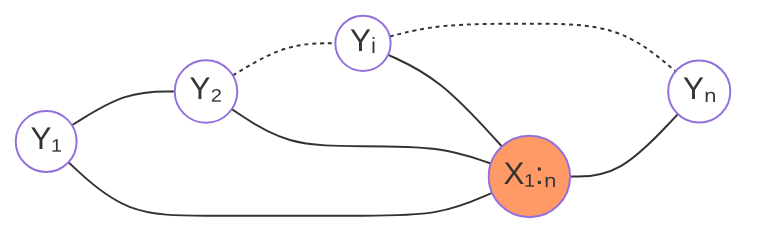

线性链条件随机场可以用于标注等问题。
在标注问题中，$X$表示输入观测序列，$Y$表示对应的输出标记序列或状态序列。

这时，在条件概率模型P(Y|X)中，Y是输出变量，表示标记序列，X是输入变量，表示需要标注的观测序列。也把标记序列称为状态序列。
学习时，利用训练数据集通过极大似然估计或正则化的极大似然估计得到条件概率模型$\hat{P}(Y|X)$；
预测时，对于给定的输入序列x，求出条件概率$\hat{P}(Y|X)$最大的输出序列$\hat{y}$。


根据**无向图的因子分解**，得：
$$P(Y|X) = \frac{1}{Z} exp\sum_{i=1}^K F_i(x_{ci})$$
根据CRF的概率无向图表示，我们可以将其实际的节点带入进去（最大团$y_{t-1},y_t,x_{1:T}$），（为了表达的方便，凑一个y0）有：
$$P(Y|X) = \frac{1}{Z} exp\sum_{t=1}^T F(y_{t-1},y_t,x_{1:T})$$
将$F(y_{t-1},y_t,x_{1:T})$分解为2个部分，即：$x_{1:T}$（已知的）对$y_t$的影响以及$y_{t-1},y_t$间的影响。数学化表示为：
$$F(y_{t-1},y_t,x_{1:T})=\triangle y_{t},x_{1:T} + \triangle y_{t-1},y_{t},x_{1:T}$$
其实还有个$\triangle y_{t-1},x_{1:T}$，因为这是上一个的状态，对于t时刻是已知的，这里忽略了。
其中，$\triangle y_t,x_{1:T}$为**状态函数**，即表示为在$t$位置上的节点$y_t$状态；
$\triangle y_{t-1},y_t,x_{1:T}$为**转移函数**，即表示当前节点$y_t$与上一个节点$y_{t-1}$的相关性。
定义在𝑌上下文的**局部特征函数**$t_k$，这类特征函数只和当前节点和上一个节点有关，即为上面的
$$\triangle y_{t-1},y_t,x_{1:T} =\sum_{k=1}^K \lambda_k t_k(y_{i-1},y_i,X,i),k=1,2,..,K$$
其中$K$是定义在该节点的局部特征函数的总个数，$i$是当前节点在序列的位置。$\lambda_k$为特征函数的信任度。
定义在𝑌节点上的**节点特征函数**，这类特征函数只和当前节点有关，即为上面的
$$\triangle y_t,x_{1:T} =\sum_{l=1}^L \mu_l s_l(y_i,X,i),l=1,2,…,L$$
其中$L$是定义在该节点的节点特征函数的总个数，$i$是当前节点在序列的位置。$\mu_l$为特征函数的信任度。
为了使特征函数make sense（有道理，合乎情理; 可以理解;讲得通），一般是指示函数，即取值非0即1。无论是节点特征函数还是局部特征函数，它们的取值只能是0或者1。即满足特征条件或者不满足特征条件。
如：
$$t_k\{y_{t-1}=名词, y_t=动词, x_{1:T}\} = 1 \\ t_k\{y_{t-1}=名词, y_t=助词, x_{1:T}\} = 0$$
所以linear-chain-CRF的参数化形式为：
$$P(Y|X)=\frac{1}{Z(X)}exp \sum_{i=1}^ T   \bigg (\sum_{k=1}^K \lambda_k t_k (y_{i-1},y_i,X,i)  +\sum_{l=1}^L \mu_l s_l (y_i,X,i)\bigg )$$
$Y$表示的是标注序列，是一个列向量，长度为$T$；$X = x_{1:T}$表示的词语序列，也是一个列向量，长度也为$T$。
其中，$Z(X)$为规范化因子：
$$Z(X)=\sum_Y exp \sum_{i=1}^T \bigg(\sum_{k=1}^K\lambda_k t_k (y_{i-1},y_i,X,i) +\sum_{l}^L\mu_l s_l (y_i,X,i)\bigg)$$
**模型的简化表示-数值表示**
假设，共有$K=K_1+K_2$个特征函数，其中，$K_1$个局部特征函数$t_k$，$K_2$个节点特征函数$s_l$。我们用1个特征函数$f_k(y_{i-1},y_i,X,i)$来统一表示：
$$\begin{aligned}f_k(y_{i-1},y_i,X,i)=\left\{\begin{aligned} & t_k (y_{i-1},y_i,X,i)  \qquad k = 1,2,..,K_1 \\ &  s_l (y_i,X,i)  \qquad k = K_1+l,l=1,2,…,K_2    \end{aligned}\right.\end{aligned}$$
对$f_k(y_{i-1},y_i,X,i)$在各个序列位置求和得到：
$$\begin{aligned}f_k(Y,X)=\sum_{i=1}^T f_k(y_{i-1},y_i,X,i)\end{aligned}$$
同时也统一$f_k(y_{i-1},y_i,x,i)$对应的权重系数$w_k$：
$$\begin{aligned}w_k=\left\{   \begin{aligned} & \lambda_k \qquad k = 1,2,..,K_1 \\ & \mu_l   \qquad k = K_1+l,l=1,2,…,K_2    \end{aligned}\right.\end{aligned}$$
这样，Linear-chain-CRF的简化工作就到这里结束啦：
$$\begin{aligned}P(Y|X)=\frac{1}{Z(X)}exp\sum_{k=1}^K w_kf_k(Y,X)\end{aligned}$$
其中，规范化因子：
$$\begin{aligned}Z(X)=\sum_Y exp\sum_{k=1}^Kw_kf_k(Y,X)\end{aligned}$$
**模型的简化表示-向量表示**
如果对$f_k(Y,X)$和$w_k$进行向量化表示，$F(Y,X)$和$W$都是$K \times 1$的列向量：
$$\begin{aligned}W  =\left [ \begin{aligned}    w_1\\    w_2\\    …\\    w_K \end{aligned}\right]\end{aligned}$$
$$\begin{aligned}F(Y,X) =\left[    \begin{aligned}   f_1(Y,X)\\   f_2(Y,X)\\   ………\\   f_K(Y,X)    \end{aligned}\right]\end{aligned}$$
那么Linear-chain-CRF的向量内积形式可以表示为：
$$\begin{aligned}P_W(Y|X) = \frac{exp(W \bullet F(Y,X))}{Z(X,W)}\\   = \frac{exp(W \bullet F(Y,X))}{\sum_Y exp(W \bullet F(Y,X))}\end{aligned}$$
向量化的意义：
就是为了干掉连加的形式，为后面的训练提供更加合理的计算支持。
**要解决的三个问题**
1. Inference（概率计算问题）：计算条件概率分布，即给定X序列，算出序列中每个位置所对应标注的概率，即：$P(y_t|X)$
1. Learning：把参数学习出来（parameter estimation），也就是给定$N$个训练数据，求上面向量表示的$W$的参数值，即：$\hat{W}=argmax\prod_{i=1}^N P(Y^{(i)}|X^{(i)})$
1. Decoding：给定X序列，找到一个最有可能的标注序列，即：$\hat{Y}=argmax P(Y|X)$，其中，$Y=y_1y_2..y_T$

**Inference：条件概率(前向-后向)**
**Learning(参数估计)**
**Decoding(Vitebi)**

- **模型**：
向量内积形式可以表示为：
$$\begin{aligned}P_W(Y|X) = \frac{exp(W \bullet F(Y,X))}{Z(X,W)}\\ = \frac{exp(W \bullet F(Y,X))}{\sum_Y exp(W \bullet F(Y,X))}\end{aligned}$$
- **策略**：
$$\hat{W}=\mathop{\arg\max}\limits_{W} \prod_{i=1}^N P(Y^{(i)}|X^{(i)})$$
- **算法**：
改进的迭代尺度算法、梯度下降法、拟牛顿法

> 参考[【NLP】从隐马尔科夫到条件随机场](https://anxiang1836.github.io/2019/11/05/NLP_From_HMM_to_CRF/) 以及视频[机器学习-白板推导系列(十七)-条件随机场CRF（Conditional Random Field）](https://www.bilibili.com/video/BV19t411R7QU)

### 附加知识

#### 随机场

**随机场**（[Random field, RF](https://en.jinzhao.wiki/wiki/Random_field)）是由若干个位置组成的整体，当给每一个位置中按照某种分布（或者是某种概率）随机赋予一个值之后，其全体就叫做随机场。

以词性标注为例：

假如我们有10个词形成的句子需要做词性标注。这10个词每个词的词性可以在我们已知的词性集合（名词，动词…）中去选择。当我们为每个词选择完词性后，这就形成了一个随机场。

**马尔科夫随机场**（[Markov random field, MRF](https://en.jinzhao.wiki/wiki/Markov_random_field)）是随机场的特例，它假设随机场中某一个位置的赋值仅仅与和它相邻的位置的赋值有关，和与其不相邻的位置的赋值无关。
换一种表示方式，把马尔科夫随机场映射到无向图中。此无向图中的节点都与某个随机变量相关，连接着节点的边代表与这两个节点有关的随机变量之间的关系。
继续词性标注为例：（还是10个词的句子）
如果我们假设所有词的词性仅与和它相邻的词的词性有关时，这个随机场就特化成一个马尔科夫随机场。
比如第3个词的词性除了与自己本身的位置有关外，只与第2个词和第4个词的词性有关。

**条件随机场**(CRF)是马尔科夫随机场的特例，它假设马尔科夫随机场中只有𝑋和𝑌两种变量，𝑋一般是给定的，而𝑌一般是在给定𝑋的条件下我们的输出。这样马尔科夫随机场就特化成了条件随机场。

在我们10个词的句子词性标注的例子中，𝑋是词，𝑌是词性。因此，如果我们假设它是一个马尔科夫随机场，那么它也就是一个CRF。
对于CRF，我们给出准确的数学语言描述：
设𝑋与𝑌是随机变量，P(𝑌|𝑋)是给定𝑋时𝑌的条件概率分布，若随机变量𝑌构成的是一个马尔科夫随机场，则称条件概率分布P(𝑌|𝑋)是条件随机场。

**线性链条件随机场**(Linear-CRF)
注意在CRF的定义中，我们并没有要求𝑋和𝑌有相同的结构。当𝑋和𝑌有相同结构，即：
$$X=(x_1,x_2,…,x_T),Y=(y_1,y_2,…,y_T)$$
这个时候，𝑋和𝑌有相同的结构的CRF就构成了线性链条件随机场。

#### MEMM(Maximum Entropy Markov Model)
判别模型
[Maximum Entropy Markov Models for Information Extraction and Segmentation](http://www.ai.mit.edu/courses/6.891-nlp/READINGS/maxent.pdf)
[Maximum Entropy Markov Models](http://www.cs.cornell.edu/courses/cs778/2006fa/lectures/05-memm.pdf)
[Hidden Markov Model and Naive Bayes relationship](https://aman.ai/primers/ai/hmm-and-naive-bayes/)
[Maximum Entropy Markov Models and Logistic Regression](https://aman.ai/primers/ai/maximum-entropy-markov-models-and-logistic-reg/)

[Maximum-Entropy Markov Model](https://devopedia.org/maximum-entropy-markov-model)


MEMM与HMM


#### 概率图模型
介绍概率图模型（Probabilistic Graphical Model）之前，先简单了解下**结构学习**（[Structured Learning](https://en.jinzhao.wiki/wiki/Structured_prediction)），相比于回归，输出一个标量或者预测，输出一个向量，结构化学习的输出更加复杂，可以是图像，可以是语句，可以是树结构，等。
那么与概率图模型有什么关系呢？
概率图形模型形成了大量的结构化预测模型。特别是，贝叶斯网络和随机场很受欢迎。[参见](https://en.jinzhao.wiki/wiki/Structured_prediction#Techniques)


[什么是结构化学习？What is structured learning?](https://pystruct.github.io/intro.html#intro)
结构化预测是监督学习、分类和回归标准范式的概括。所有这些都可以被认为是找到一个函数来最小化训练集上的一些损失。区别在于使用的函数类型和损失。
在分类中，目标域是离散的类标签，损失通常是0-1的损失，即对误分类进行计数。在回归中，目标域是实数，损失通常是均方误差。在结构化预测中，目标域和损失或多或少都是任意的。这意味着目标不是预测标签或数字，而是可能更复杂的对象，如序列或图形。


**概率图模型**（[Probabilistic Graphical Model，PGM](https://en.jinzhao.wiki/wiki/Graphical_model)），简称图模型（Graphical Model，GM），是指一种用图结构来描述多元随机变量之间条件独立关系的概率模型，从而给研究高维空间中的概率模型带来了很大的便捷性。
很多机器学习模型都可以归结为概率模型，即建模输入和输出之间的条件概率分布．因此，图模型提供了一种新的角度来解释机器学习模型，并且这种角度有很多优点，比如了解不同机器学习模型之间的联系，方便设计新模型（Developing Bayesian networks）等．在机器学习中，图模型越来越多地用来设计和分析各种学习算法．


**图模型有三个基本问题**：
1. 表示（Representation）问题：对于一个概率模型，如何通过图结构来描述变量之间的依
赖关系．
1. 学习（Learning）问题：图模型的学习包括图结构的学习和参数的学习．在本章中，
我们只关注在给定图结构时的参数学习，即参数估计问题．
1. 推断（Inference）问题：在已知部分变量时，计算其他变量的条件概率分布

$$
\begin{cases}
   Representation(表示) &  \begin{cases} \text{有向图 Bayesian Network} \\ \text{无向图 Markov Network} \end{cases} \\
   Learning(学习) & \begin{cases} \text{参数学习} & \begin{cases} \text{完备数据} \\ \text{隐变量} \to EM \end{cases} \\ \text{结构学习} \end{cases}\\
   Inference(推断) & \begin{cases} \text{精确推断} \\ \text{近似推断} & \begin{cases} \text{确定性近似} \to 变分推断 \\ \text{随机近似} \to MCMC \end{cases} \end{cases} \\
\end{cases}
$$


**图的表示**：
图可以用$G=(V,E)$表示，$V$是顶点vertices(nodes or points)集合，
${\displaystyle E\subseteq \{(x,y)\mid (x,y)\in V^{2}\;{\textrm {and}}\;x\neq y\}}$是边的集合edges;对于有向图而言，边是有向的（directed edges, directed links, directed lines, arrows or arcs）它们是有序的顶点对，代表着方向;对于无向图而言，边是无向的。

也有些地方有向边一般用尖括号表示<>；而无向边一般用弧形括号表示（）；如：
有向图：
$$G1=(V,E) \\ V(G1)=\{v1,v2,v3\}\\  E(G1)=\{\braket{v1,v2},\braket{v1,v3},\braket{v2,v3}\}$$

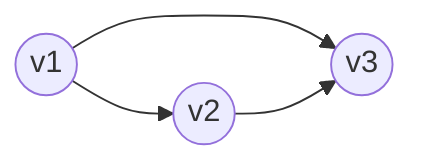

无向图：
$$G2=(V,E) \\ V(G2)=\{v1,v2,v3,v4\} \\ E(G2)=\{(vl,v2),(v1,v3),(v1,v4),(v2,v3),(v2,v4),(v3,v4)\}$$
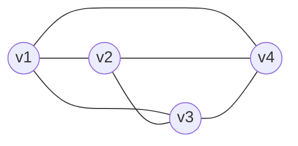
##### （概率）有向图模型
有向图模型（Directed Graphical Model）又称贝叶斯网络（[Bayesian Network](https://en.jinzhao.wiki/wiki/Bayesian_network)）或信念网络（Belief Network，BN）或（causal networks）是一类用有向图（[Directed Graphical](https://en.jinzhao.wiki/wiki/Graph_(discrete_mathematics)#Directed_graph)）来描述随机向量概率分布的模型．

> 这里是 有向无环图(DAG)

定义和概率 Definitions and concepts：
> parent 父节点
> descendants 后代
> non-descendants 非后代（不包括父代，也就是all-parent-descendants）

- **概率分布的分解（Factorization definition）**：
$X$是一个关于$G$的贝叶斯网络，如果$X$的联合概率分布(联合概率密度函数)可以写成【单个密度函数的乘积，条件是它们的父变量】也就是局部条件概率分布（Local Conditional Probability Distribution）的连乘形式（广义的一阶马可夫性质）:
$$p(X)=\prod _{v\in V}p\left(x_{v}\,{\big |}\,x_{\operatorname {pa} (v)}\right)$$
其中$x_{\operatorname {pa} (v)}$表示$x_{v}$的父亲节点集合。
如：
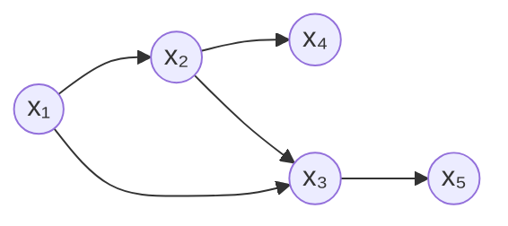
$X=x_1,x_2,x_3,x_4,x_5$
$V=\{x_1,x_2,x_3,x_4,x_5\}$
$E=\{\braket{x_1,x_2},\braket{x_1,x_3},\braket{x_2,x_3},\braket{x_2,x_4}\},\braket{x_3,x_5}$
$G=(V,E)$
有向图对应的概率分布可以分解为
$$p(X) = p(x_1,x_2,x_3,x_4,x_5) = p(x_1)p(x_2|x_1)p(x_3|x_1,x_2)p(x_4|x_2)p(x_5|x_3)$$

- **因果网络(Causal networks)**：
在贝叶斯网络中，如果两个节点是直接连接的，它们肯定是非条件独立的，是直接因果关系．父节点是“因”(tail)，子节点是“果”（也就是箭头指向的，也称head）$tail \rightarrow head (因\rightarrow 果)$。如果两个节点不是直接连接的，但可以由一条经过其他节点的路径来连接，那么这两个节点之间的**条件独立性**就比较复杂。
以三个节点的贝叶斯网络为例

Pattern|Model | 条件独立性
---|---|---
Chain（间接因果关系/tail to head）	|$X\rightarrow Y\rightarrow Z$ | 已知Y时,X和Z为条件独立，即 $X \perp \!\!\!\perp Z\mid Y$
Fork（共因关系/tail to tail）|$X\leftarrow Y\rightarrow Z$ | 已知Y时,X和Z为条件独立，即 $X \perp \!\!\!\perp Z \mid Y$ （Y未知时，X和Z为不独立）
Collider（共果关系/head to head）	|$X\rightarrow Y\leftarrow Z$ | 已知Y时,X和Z为不独立，即 $X \perp \!\!\!\perp \!\!\!\!\!\!/ \;\; Z \mid Y$（Y未知时，X和Z为独立）


- **局部马尔可夫性质（Local Markov property）**：
对一个更一般的贝叶斯网络，其局部马尔可夫性质为：每个随机变量在给定父节点的情况下，条件独立于它的非后代节点． 
$${\displaystyle X_{v}\perp \!\!\!\perp X_{V\,\smallsetminus \,\operatorname {de} (v)}\mid X_{\operatorname {pa} (v)}\quad {\text{for all }}v\in V}$$
其中$X_{V\,\smallsetminus \,\operatorname {de} (v)}$表示非后代集合

- **马尔可夫毯**（[Markov blanket](https://en.jinzhao.wiki/wiki/Markov_blanket)）：
在随机变量的全集U UU中，对于给定的变量$X\in U$和变量集$MB\subset U(X\notin MB)$，若有
$$X\perp \!\!\!\perp\{U-MB-\{X\}\}|MB$$
则称能满足上述条件的最小变量集$MB$为$X$的马尔可夫毯(Markov Blanket)。


- **D划分（d-separation）**：
d表示方向（directional）。p是u to v的去除方向的路径。p被一组节点Z分隔。
  - 如果p是这样的路径 ${\displaystyle u\cdots \leftarrow m\leftarrow \cdots v}$ or ${\displaystyle u\cdots \rightarrow m\rightarrow \cdots v}$ 并且$m \in Z$
  - 如果p是这样的路径 ${\displaystyle u\cdots \leftarrow m\rightarrow \cdots v}$ 并且$m \in Z$
  - 如果p是这样的路径 ${\displaystyle u\cdots \rightarrow m\leftarrow \cdots v}$ 并且$m \notin Z$
$$X_{u}\perp \!\!\!\perp X_{v}\mid X_{Z}$$


- **常见的有向图模型**：
如朴素贝叶斯分类器、隐马尔可夫模型、深度信念网络等
朴素贝叶斯：假设输入X有三个特征
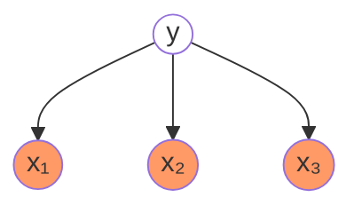
由图可得
$$P(y,x_1,x_2,x_3) = P(y)P(x_1|y)P(x_2|y)P(x_3|y) = P(x_1,x_2,x_3|y)P(y) \\ \Darr\\  P(x_1,x_2,x_3|y)=P(x_1|y)P(x_2|y)P(x_3|y)$$
这不就是朴素贝叶斯的条件相互独立的假设么?$P(X|y) = \prod_{i=1}^n P(x_i|y)$
而这个独立假设太强了，每个特征之间没有任何关系（独立同分布i.i.d.）；
那么我们假设当前只与前一时刻有关，与其它无关，那么我们就有了Markov假设，如隐马尔可夫模型：
其中y为隐变量，x为观测变量
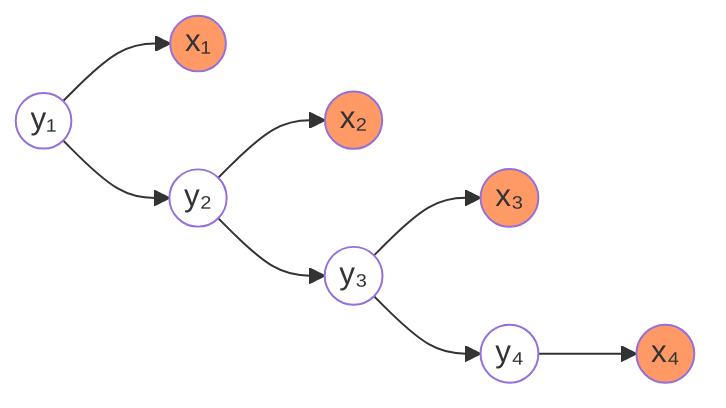
我们能从图中直接得到
$P(y_t|y_{t-1},...,y_1,x_{t-1},...,x_1) = P(y_t|y_{t-1})$，即Markov假设；
$P(x_t|x_{T},...,x_{t+1},x_{t-1},...,x_1,Y) = P(x_t|y_{t})$，即观测独立性假设；

##### （概率）无向图模型
无向图模型（Undirected Graphical Model）又称马尔可夫随机场（[Markov random field, MRF](https://en.jinzhao.wiki/wiki/Markov_random_field)）或马尔可夫网络（Markov network）是一类用无向图（[Undirected Graphical](https://en.jinzhao.wiki/wiki/Graph_(discrete_mathematics)#Undirected_graph)）来描述一组具有局部马尔可夫性质的随机向量𝑿的联合概率分布的模型．
以下定义是等价的
$$\text{Global Markov} \iff \text{Local Markov}\iff\text{Pair Markov}\xLeftrightarrow{Hammesley−Clifford } 因子分解$$


- **团分解，因子分解**（Clique factorization）：
无向图G中任何两个结点均有边连接的结点子集称为**团**（clique）。若C是无向图G的一个团，并且不能再加进任何一个G的结点使其成为一个更大的团，则称此C为**最大团**（maximal clique）。
将概率无向图模型的联合概率分布表示为其最大团上的随机变量的函数的乘积形式的操作，称为概率无向图模型的因子分解（factorization）。
给定概率无向图模型，设其无向图为G，随机变量${\displaystyle X=(X_{v})_{v\in V}}$，C为G上的最大团，$X_C$表示C对应的随机变量。那么概率无向图模型的联合概率分布$P(X)$可写作图中所有最大团C上的函数$\phi_C (x_C)$的乘积形式，即
$$P(X) =\frac{1}{Z} \prod_{C \in \operatorname{cl}(G)} \phi_C (X_C) $$
$$Z=\sum_{X}\prod_{C \in \operatorname{cl}(G)} \phi_C (X_C)$$
Z是规范化因子（normalization factor）或归一化因子也被称为配分函数（partition function）;
$\phi_C (X_C)$称为势函数（potential function or factor potentials or clique potentials），势函数要求是严格正的，通常定义为指数函数：
$$\phi_C (X_C) = \exp\{-E(X_C)\}$$
其中E为能量函数（energy function）。
实际上用这种形式表达的p(x)，为Gibbs Distribution，或者又被称之为Boltzman Distribution。可以写成：
$$P(x) = \frac{1}{Z} \prod_{i=1}^K \phi (x_{C_{i}}) = \frac{1}{Z} \prod_{i=1}^K \exp\{-E(x_{C_{i}})\} =  \frac{1}{Z}\exp\{-\sum_{i=1}^K E(x_{C_{i}})\} = \frac{1}{Z}\exp\sum_{i=1}^K F_i(x_{ci})，x \in \mathbb{R}^{p}$$
$x \in \mathbb{R}^p$是个联合概率分布，它的维度是$p$维；$\phi$表示势函数；$E$表示能量函数；$K$表示最大团的个数；$C_i$表示第$i$个最大团。
我们将指数族分布和势函数联系起来：
$${\displaystyle p(x\mid {\boldsymbol {\eta }})=h(x)\,\exp {\Big (}{\boldsymbol {\eta^T }}\cdot \mathbf {T} (x)-A({\boldsymbol {\eta }}){\Big )}} = h(x) \frac{1}{Z(\eta)}\exp\{\eta^T \cdot \mathbf {T} (x)\}$$
发现势函数(Gibbs Distribution)是一个指数族分布。Gibbs是来自统计物理学，形式上和指数族分布时一样的。而指数族分布实际上是由最大熵分布得到的，那么我们可以理解Gibbs分布也是有最大熵原理得到的。而马尔可夫随机场(Markov Random Field)实际上等价于Gibbs分布。即：
最大熵原理 ⇒ 指数族分布(Gibbs分布).
Markov Random Field ⇔ Gibbs Distribution.

- **成对马尔可夫性**（Pairwise Markov property）：
任意两个不相邻的变量在给定其他变量的条件下是独立的:${\displaystyle X_{u}\perp \!\!\!\perp X_{v}\mid X_{V\setminus \{u,v\}}}$
- **局部马尔可夫性**（Local Markov property）：
一个变量在给定其相邻变量的条件下是独立于所有其他变量:${\displaystyle X_{v}\perp \!\!\!\perp X_{V\setminus \operatorname {N} [v]}\mid X_{\operatorname {N} (v)}}$
其中$\operatorname {N} (v)$是v的邻居（neighbor）节点；${\displaystyle \operatorname {N} [v]=v\cup \operatorname {N} (v)}$
- **全局马尔可夫性**（Global Markov property）：
给定一个分离子集（separating subset），任意两个变量子集都是条件独立的:$X_A \perp\!\!\!\perp X_B \mid X_S$
A中的节点到B中的节点都要经过S；

- **道德图**（Moral graph）：
有向图和无向图可以相互转换，但将无向图转为有向图通常比较困难．在实际应用中，将有向图转为无向图更加重要，这样可以利用无向图上的精确推断算法，比如联合树算法（Junction Tree Algorithm）．
有向图转化成无向图的过程称为道德化（Moralization），转化后的无向图称为道德图（[Moral graph](https://en.jinzhao.wiki/wiki/Moral_graph)）。
每个有向图分解的因子要处于一个最大团中，如：
$$P(X) = p(x_1)p(x_2)p(x_3)p(x_4|x_1,x_2,x_3)$$
其中$p(x_4|x_1,x_2,x_3)$有四个变量，那么：
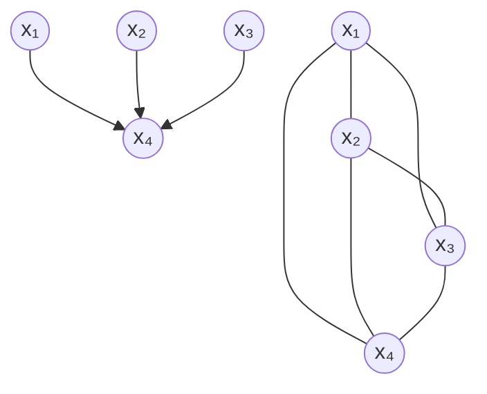
> 道德化的过程中，原有的一些条件独立性会丢失。

- **因子图**（Factor graph）：
这里不作介绍，目前不太明白用处。


- **常见的有向图模型**：
对数线性模型（最大熵模型）、条件随机场、玻尔兹曼机、受限玻尔兹曼机等．

> 以上内容只是讲到了概率图的表示。

### 参考文献

[11-1] Bishop M. Pattern Recognition and Machine Learning. Springer-Verlag,2006

[11-2] Koller D,Friedman N. Probabilistic Graphical Models: Principles and Techniques.MIT Press,2009

[11-3] Lafferty J,McCallum A,Pereira F. Conditional random fields: probabilistic models for segmenting and labeling sequence data. In: International Conference on Machine Learning,2001

[11-4] Sha F,Pereira F. Shallow parsing with conditional random fields. In: Proceedings ofthe 2003 Conference of the North American Chapter of Association for ComputationalLinguistics on Human Language Technology,Vol.1,2003

[11-5] McCallum A,Freitag D,Pereira F. Maximum entropy Markov models for informationextraction and segmentation. In: Proc of the International Conference on Machine Learning,2000

[11-6] Taskar B,Guestrin C,Koller D. Max-margin Markov networks. In: Proc of the NIPS2003,2003

[11-7] Tsochantaridis I,Hofmann T,Joachims T. Support vector machine learning forinterdependent and structured output spaces. In: ICML,2004

## 第 12 章 监督学习方法总结
参考：[生成模型和判别模型](../生成模型和判别模型.md)
| 分类                                                       | 方法                                       | 适用问题           | 模型特点                                           | 模型类别           | 学习策略                           | 损失函数             | 学习算法                               |
| ---------------------------------------------------------- | ------------------------------------------ | ------------------ | -------------------------------------------------- | ------------------ | ---------------------------------- | -------------------- | -------------------------------------- |
| 监督                                                       | 感知机                                     | 二分类             | 分离超平面                                         | 判别模型           | 极小化误分点到超平面距离           | 误分点到超平面距离   | 随机梯度下降                           |
| 监督                                                       | k 近邻法                                   | 多分类、回归       | 特征空间、样本点                                   | 判别模型           | —                                  | —                    | —                                      |
| 监督                                                       | 朴素贝叶斯                                 | 多分类             | 特征与类别的联合概率分布，条件独立假设             | 生成模型           | 极大似然估计、最大后验概率估计     | 对数似然损失         | 概率计算公式、EM 算法                  |
| 监督                                                       | 决策树                                     | 多分类、回归       | 分类树、回归树                                     | 判别模型           | 正则化的极大似然估计               | 对数似然损失         | 特征选择、生成、剪枝                   |
| 监督                                                       | 逻辑斯蒂回归                               | 多分类             | 特征条件下类别的条件概率分布，对数线性模型         | 判别模型           | 极大似然估计，正则化的极大似然估计 | 逻辑斯蒂损失         | 改进的迭代尺度算法，梯度下降，拟牛顿法 |
| 监督                                                       | 支持向量机                                 | 二分类             | 分离超平面，核技巧                                 | 判别模型           | 极小化正则化合页损失，软间隔最大化 | 合页损失             | 序列最小最优化算法（SMO)               |
| 监督                                                       | 提升方法 (Boosting)                        | 二分类             | 弱分类器的线性组合                                 | 判别模型           | 极小化加法模型的指数损失           | 指数损失             | 前向分布加法算法                       |
| 监督                                                       | EM 算法                                    | 概率模型参数估计   | 含隐变量概率模型                                   | —                  | 极大似然估计，最大后验概率估计     | 对数似然损失         | 迭代算法                               |
| 监督                                                       | 隐马尔科夫模型(HMM)                        | 标注               | 观测序列与状态序列的联合概率分布模型               | 生成模型           | 极大似然估计，最大后验概率估计     | 对数似然损失         | 概率计算公式，EM 算法                  |
| 监督                                                       | 最大熵马尔科夫模型(MEMM)                                       | 标注               | -                                                  | 判别模型           |
| 监督                                                       | 条件随机场(CRF)                            | 标注               | 状态序列条件下观测序列的条件概率分布，对数线性模型 | 判别模型           | 极大似然估计，正则化极大似然估计   | 对数似然损失         | 改进的迭代尺度算法，梯度下降，拟牛顿法 |
| 监督                                                       | 马尔可夫随机场 Markov Random Fields        | -                  | -                                                  | 生成模型           |


**模型**
分类问题与标注问题的预测模型都可以认为是表示从输入空间到输出空间的映射。它们可以写成条件概率分布P(Y|X)或决策函数Y＝f(X)的形式。前者表示给定输入条件下输出的概率模型，后者表示输入到输出的非概率模型。有时，模型更直接地表示为概率模型，或者非概率模型；但有时模型兼有两种解释。

朴素贝叶斯法、隐马尔可夫模型是概率模型。感知机、k近邻法、支持向量机、提升方法是非概率模型。而决策树、逻辑斯谛回归与最大熵模型、条件随机场既可以看作是概率模型，又可以看作是非概率模型。

直接学习条件概率分布P(Y|X)或决策函数Y＝f(X)的方法为判别方法，对应的模型是判别模型。感知机、k近邻法、决策树、逻辑斯谛回归与最大熵模型、支持向量机、提升方法、条件随机场是判别方法。首先学习联合概率分布P(X,Y)，从而求得条件概率分布P(Y|X)的方法是生成方法，对应的模型是生成模型。朴素贝叶斯法、隐马尔可夫模型是生成方法。


可以用非监督学习的方法学习生成模型。具体地，应用EM算法可以学习朴素贝叶斯模型以及隐马尔可夫模型。

决策树是定义在一般的特征空间上的，可以含有连续变量或离散变量。感知机、支持向量机、k近邻法的特征空间是欧氏空间（更一般地，是希尔伯特空间）。提升方法的模型是弱分类器的线性组合，弱分类器的特征空间就是提升方法模型的特征空间。

感知机模型是线性模型，而逻辑斯谛回归与最大熵模型、条件随机场是对数线性模型。k近邻法、决策树、支持向量机（包含核函数）、提升方法使用的是非线性模型。

**学习策略**
在二类分类的监督学习中，支持向量机、逻辑斯谛回归与最大熵模型、提升方法各自使用合页损失函数、逻辑斯谛损失函数、指数损失函数。3种损失函数分别写为
$$[1-yf(x)]_+ \\ \log[1-\exp(-yf(x))] \\ \exp(-yf(x))$$
这3种损失函数都是0-1损失函数的上界，具有相似的形状。所以，可以认为支持向量机、逻辑斯谛回归与最大熵模型、提升方法使用不同的代理损失函数（surrogate  loss  function）表示分类的损失，定义经验风险或结构风险函数，实现二类分类学习任务。学习的策略是优化以下结构风险函数：
$$\min_{f \in H} \frac{1}{N}\sum_{i=1}^N L(y_i,f(x_i)) +\lambda J(f)$$
这里，第1项为经验风险（经验损失），第2项为正则化项，L(Y,f(X))为损失函数，J(f)为模型的复杂度，≥0为系数。

支持向量机用L2范数表示模型的复杂度。原始的逻辑斯谛回归与最大熵模型没有正则化项，可以给它们加上L2范数正则化项。提升方法没有显式的正则化项，通常通过早停止（early stopping）的方法达到正则化的效果。


以上二类分类的学习方法可以扩展到多类分类学习以及标注问题，比如标注问题的条件随机场可以看作是分类问题的最大熵模型的推广。

概率模型的学习可以形式化为极大似然估计或贝叶斯估计的极大后验概率估计。这时，学习的策略是极小化对数似然损失或极小化正则化的对数似然损失。对数似然损失可以写成
$$-\log P(y|x)$$
极大后验概率估计时，正则化项是先验概率的负对数。

决策树学习的策略是正则化的极大似然估计，损失函数是对数似然损失，正则化项是决策树的复杂度。

逻辑斯谛回归与最大熵模型、条件随机场的学习策略既可以看成是极大似然估计（或正则化的极大似然估计），又可以看成是极小化逻辑斯谛损失（或正则化的逻辑斯谛损失）。

朴素贝叶斯模型、隐马尔可夫模型的非监督学习也是极大似然估计或极大后验概率估计，但这时模型含有隐变量。

**学习算法**

统计学习的问题有了具体的形式以后，就变成了最优化问题。有时，最优化问题比较简单，解析解存在，最优解可以由公式简单计算。但在多数情况下，最优化问题没有解析解，需要用数值计算的方法或启发式的方法求解。

朴素贝叶斯法与隐马尔可夫模型的监督学习，最优解即极大似然估计值，可以由概率计算公式直接计算。

感知机、逻辑斯谛回归与最大熵模型、条件随机场的学习利用梯度下降法、拟牛顿法等。这些都是一般的无约束最优化问题的解法。

支持向量机学习，可以解凸二次规划的对偶问题。有序列最小最优化算法等方法。

决策树学习是基于启发式算法的典型例子。可以认为特征选择、生成、剪枝是启发式地进行正则化的极大似然估计。

提升方法利用学习的模型是加法模型、损失函数是指数损失函数的特点，启发式地从前向后逐步学习模型，以达到逼近优化目标函数的目的。

EM算法是一种迭代的求解含隐变量概率模型参数的方法，它的收敛性可以保证，但是不能保证收敛到全局最优。

支持向量机学习、逻辑斯谛回归与最大熵模型学习、条件随机场学习是凸优化问题，全局最优解保证存在。而其他学习问题则不是凸优化问题。

## 第 13 章 无监督学习概论
**基本问题**：
**聚类**（clustering）是将样本集合中相似的样本归到相同的类，相似的定义一般用距离度量。
如果一个样本只能属于一个类，则称为硬聚类（hard clustering），如k-means；如果一个样本可以属于多个类，每一个样本以概率属于每一个类$\sum_{i=1}^N p(z_i|x_i) =1$，则称为软聚类（soft clustering），如GMM。
聚类主要用于数据分析，也可用于监督学习的前处理。聚类可以帮助发现数据中的统计规律。


**降维**（dimensionality reduction）是将样本集合中的样本（实例）从高维空间转换到低维空间。
高维空间通常是高维的欧氏空间，而低维空间是低维的欧氏空间或流形（manifold）。低维空间是从数据中自动发现的。降维有线性降维和非线性降维，降维方法有主成分分析。
降维的好处有：节省存储空间、加速计算、解决**维度灾难**（前面章节有讲到）等
降维主要用于数据分析，也可用于监督学习的前处理。降维可以帮助发现高维数据中的统计规律。

**概率模型估计**（probability model estimation），简称概率估计，假设训练数据由一个概率模型生成，由训练数据学习概率模型的结构和参数。
概率模型的结构类型或者概率模型的集合事先给定，而模型的具体结构与参数从数据中自动学习。假设数据由GMM生成（已知结构），学习的目标是估计这个模型的参数。
概率模型包括混合模型、概率图模型等。概率图模型又包括有向图模型和无向图模型（前面章节有讲到）。

**无监督学习方法**
- 聚类
    - 硬聚类：
        - k-means
    - 软聚类：
        - GMM
- 降维
    - 线性：
        - 主成分分析
    - 非线性：
        - 流形学习

- 话题分析
话题分析是文本分析的一种技术。给定一个文本集合，话题分析旨在发现文本集合中每个文本的话题，而话题由单词的集合表示。话题分析方法有：
    - 潜在语义分析
    - 概率潜在语义分析
    - 潜在狄利克雷分配

- 图分析
图分析 的目的是 发掘隐藏在图中的统计规律或潜在结构；
    - 链接分析 是图分析的一种，主要是发现 有向图中的重要结点，包括 PageRank 算法
    - PageRank 算法最初是为互联网搜索而提出。将互联网看作是一个巨大的有向图，网页是结点，网页的超链接是有向边。PageRank 算法可以算出网页的 PageRank 值，表示其重要度，在搜索引擎的排序中网页的重要度起着重要作用

同监督学习一样，无监督学习也有**三要素**：模型、策略、算法
**模型** 就是函数$z=g_\theta(x)$，条件概率分布$P_\theta(z |x)$，或$P_\theta(x|z)$，在聚类、降维、概率模型估计中拥有不同的形式
- 聚类 中模型的输出是 类别
- 降维 中模型的输出是 低维向量
- 概率模型估计 中的模型可以是混合概率模型，也可以是有向概率图模型和无向概率图模型

**策略** 在不同的问题中有不同的形式，但都可以表示为目标函数的优化
- 聚类 中样本与所属类别中心距离的最小化
- 降维 中样本从高维空间转换到低维空间过程中信息损失的最小化
- 概率模型估计 中模型生成数据概率的最大化

**算法** 通常是迭代算法，通过迭代达到目标函数的最优化，比如，梯度下降法。
- 层次聚类法、k均值聚类 是硬聚类方法
- 高斯混合模型 EM算法是软聚类方法
- 主成分分析、潜在语义分析 是降维方法
- 概率潜在语义分析、潜在狄利克雷分配 是概率模型估计方法


### 参考文献
[13-1] Hastie T, Tibshirani R, Friedman J. The elements of statistical learning:data mining, inference, and prediction. Springer. 2001. 

[13-2] Bishop M. Pattern Recognition and Machine Learning. Springer, 2006.

[13-3] Koller D, Friedman N. Probabilistic graphical models: principles and techniques. Cambridge, MA: MIT Press, 2009.

[13-4] Goodfellow I,Bengio Y,Courville A. Deep learning. Cambridge, MA: MIT Press, 2016.

[13-5] Michelle T M. Machine Learning. McGraw-Hill Companies, Inc. 1997.（中译本：机器学习。北京：机械工业出版社，2003.）

[13-6] Barber D. Bayesian reasoning and machine learning, Cambridge, UK:Cambridge University Press, 2012.

[13-7] 周志华. 机器学习. 北京：清华大学出版社，2017.

## 第 14 章 聚类方法

聚类分析（[Cluster analysis or clustering](https://en.jinzhao.wiki/wiki/Cluster_analysis)）是针对给定的样本，根据它们特征点的相似度（距离），将其归并到若干个类（簇）中的分析问题。聚类分析本身不是一种特定的算法，而是要解决的一般任务。

### 算法分类

Hard clustering
Soft clustering (also: [fuzzy clustering](https://en.jinzhao.wiki/wiki/Fuzzy_clustering))

---

Connectivity models：如 hierarchical clustering 基于距离连通性（based on distance connectivity）
Centroid models：如 k-means
Distribution models：如GMM
Density models：如 DBSCAN and OPTICS
Subspace models：如 biclustering
Group models：如
Graph-based models：如
Signed graph models：如
Neural models：如


聚类分析算法（[Cluster analysis algorithms](https://en.jinzhao.wiki/wiki/Category:Cluster_analysis_algorithms)）：[sklearn中的聚类算法和介绍](https://scikit-learn.org/stable/modules/clustering.html#clustering)
**基于连接的聚类（层次聚类）** Connectivity-based clustering（[Hierarchical clustering](https://en.jinzhao.wiki/wiki/Hierarchical_clustering)）：
层次聚类有聚合Agglomerative（自下而上"bottom-up"）和分裂 Divisive（自上而下"top-down"）两种方法。
- [sklearn.cluster.AgglomerativeClustering](https://scikit-learn.org/stable/modules/generated/sklearn.cluster.AgglomerativeClustering.html)
从下而上地把小的cluster合并聚集,开始时将每个样本各自分到一个cluster，之后将距离最短的两个cluster合并成一个新的cluster，重复此步骤直到满足停止条件；
书中提到三个要素：
1. 距离度量或相似度
1. 合并规则（cluster间的距离规则，cluster间的距离可以是最短、最长、中心距离、平均距离等）
1. 停止条件（达到k值，也就是cluster的个数达到阈值；cluster的直径达到阈值；）

- DIANA (DIvisive ANAlysis Clustering) algorithm
开始将所有样本归为一个cluster，之后将距离最远的两个样本分到两个新的cluster，重复此步骤直到满足停止条件；

**基于质心的聚类** Centroid-based clustering：
- K均值聚类（[k-means clustering](https://en.jinzhao.wiki/wiki/K-means_clustering)），[sklearn.cluster.KMeans](https://scikit-learn.org/stable/modules/generated/sklearn.cluster.KMeans.html)
KMeans 可以看作是高斯混合模型的一个特例，每个分量的协方差相等。

- 均值移位聚类（[Mean shift clustering](https://en.jinzhao.wiki/wiki/Mean-shift)） ，[sklearn.cluster.MeanShift](https://scikit-learn.org/stable/modules/generated/sklearn.cluster.MeanShift.html)
Mean shift clustering using a flat kernel.  based on [kernel density estimation](https://en.jinzhao.wiki/wiki/Kernel_density_estimation).
sklearn中有说是centroid-based。维基百科把它放在基于密度的聚类中（核密度估计）。

-  亲和力传播（[Affinity Propagation (AP)](https://en.jinzhao.wiki/wiki/Affinity_propagation)），[sklearn.cluster.AffinityPropagation](https://scikit-learn.org/stable/modules/generated/sklearn.cluster.AffinityPropagation.html)
基于数据点之间“消息传递”的概念。based on the concept of "message passing" between data points.

**基于分布的聚类** Distribution-based clustering：
- 高斯混合模型聚类（[Gaussian mixture model](https://en.jinzhao.wiki/wiki/Mixture_model#Gaussian_mixture_model)），[sklearn.mixture](https://scikit-learn.org/stable/modules/mixture.html)

**基于密度的聚类** Density-based clustering：
- 基于密度的带噪声应用空间聚类（[Density-Based Spatial Clustering of Applications with Noise (DBSCAN)](https://en.jinzhao.wiki/wiki/DBSCAN)），[sklearn.cluster.DBSCAN](https://scikit-learn.org/stable/modules/generated/sklearn.cluster.DBSCAN.html)
- 对象排序识别聚类结构（[Ordering Points To Identify the Clustering Structure (OPTICS)](https://en.jinzhao.wiki/wiki/OPTICS_algorithm)） ，[sklearn.cluster.OPTICS](https://scikit-learn.org/stable/modules/generated/sklearn.cluster.OPTICS.html)


**基于网格的聚类** Grid-based clustering：
**其它聚类**：
- 谱聚类（[Spectral clustering](https://en.jinzhao.wiki/wiki/Spectral_clustering)），[sklearn.cluster.SpectralClustering](https://scikit-learn.org/stable/modules/generated/sklearn.cluster.SpectralClustering.html)
- 双聚类（[biclustering](https://en.jinzhao.wiki/wiki/Biclustering)），[谱双聚类sklearn.cluster.SpectralBiclustering](https://scikit-learn.org/stable/modules/generated/sklearn.cluster.SpectralBiclustering.html)，[谱协同聚类sklearn.cluster.SpectralCoclustering](https://scikit-learn.org/stable/modules/generated/sklearn.cluster.SpectralCoclustering.html)

**高效聚类**：

- 使用层次结构平衡迭代减少和聚类 （[Balanced Iterative Reducing and Clustering using Hierarchies (BIRCH)](https://en.jinzhao.wiki/wiki/BIRCH)） ，[sklearn.cluster.Birch](https://scikit-learn.org/stable/modules/generated/sklearn.cluster.Birch.html)
它是一种高效内存的在线学习算法，可作为MiniBatchKMeans的替代方案。它构造了一个树状数据结构，其中集群中心被从叶子中读取。这些可以是最终的聚类中心，也可以作为输入提供给其他聚类算法，如 AgglomerativeClustering。

**高维数据的聚类**（[Clustering high-dimensional data](https://en.jinzhao.wiki/wiki/Clustering_high-dimensional_data)）：
子空间聚类Subspace clustering
- [SUBCLU](https://en.jinzhao.wiki/wiki/SUBCLU)

投影聚类Projected clustering
基于投影的聚类Projection-based clustering
混合方法Hybrid approaches


### 算法评估Evaluation
聚类结果的评估与聚类本身一样困难（并不像计算错误数量或监督分类算法的精度和召回率那么简单）。一般分为Internal evaluation和External evaluation，当两种评估效果都不好时就需要human evaluation。

---
先作一些定义：

数据集$D=\{x_1,x_2,...,x_i,...,x_j,...,x_n\}$

设$T$为给定的正数，若集合$C_p$中任意两个样本间的距离$dist(x_i,x_j) \leq T$，则称$C_p$为一个类或簇（cluster）

$C = \{C_1,C_2,...,C_k\}$表示（预测的）类或簇（cluster）
$C^* = \{C_1^*,C_2^*,...,C_s^*\}$表示参考模型的类或簇（cluster）
$\lambda$表示簇$C$的标记(预测)向量，如：$\lambda = [0,1,...,k],\lambda^* = [0,1,...,s]$，长度为样本数量$n$
$\lambda_i$为样本$x_i$的预测或标记值
$a = TP, TP=\{(x_i,x_j)\mid\lambda_i = \lambda_j, \lambda_i^* = \lambda_j^* ,i \lt j\}$ ，表示“样本对”在$C$中属于相同的簇且在$C^*$中也属于相同的簇的数量(true positive)
$b = TN, TN=\{(x_i,x_j)\mid\lambda_i = \lambda_j, \lambda_i^* \neq \lambda_j^* ,i \lt j\}$ ，表示“样本对”在$C$中属于相同的簇且在$C^*$中也属于不同的簇的数量(true negative)
$c = FP, FP=\{(x_i,x_j)\mid\lambda_i \neq \lambda_j, \lambda_i^* = \lambda_j^* ,i\lt j\}$ ，表示“样本对”在$C$中属于不同的簇且在$C^*$中也属于相同的簇的数量(false positive)
$d = FN, FN=\{(x_i,x_j) \mid \lambda_i \neq \lambda_j, \lambda_i^* \neq \lambda_j^* ,i\lt j\}$ ，表示“样本对”在$C$中属于不同的簇且在$C^*$中也属于不同的簇的数量(false negative)

> 注意：labels_pred = [0, 0, 1, 1] 与 labels_true = [0, 0, 1, 1] 以及 labels_pred = [0, 0, 1, 1] 与 labels_true = [1, 1, 0, 0] 是没有区别的，他们都正确的聚类了。

样本对的数量为$C_n^2 = \binom{n}{2} =n(n-1)/2 = a+b+c+d$，这里的$C$是排列组合的意思

$d_{ij} = dist(x_i,x_j)$表示样本$x_i,x_j$之间的距离


$n_p = |C_p|$表示簇$C_p$中的样本数量，
$\bar{x}_p = \frac{1}{n_p}\sum_{x_i \in C_p}x_i$分别表示簇$C_p$的质心（中心、均值、中心点、centroid）
$diam(C_p) = \max \{dist(x_i,x_j) \mid x_i,x_j \in C_p\}$表示簇的直径diam或者簇类样本间的最远距离
$avg(C_p) = \frac{2}{n_p(n_p-1)} \sum_{1\leq i \lt j\leq n_p }dist(x_i,x_j)$表示簇类样本间的平均距离
$A_{C_p} = \sum_{x_i \in C_p} (x_i-\bar{x}_p)(x_i-\bar{x}_p)^T$表示簇类样本散布矩阵（[scatter matrix](https://en.jinzhao.wiki/wiki/Scatter_matrix)）
$S_{C_p} = \frac{1}{n_p-1}A_{C_p}$表示簇类样本协方差矩阵（[covariance matrix](https://en.jinzhao.wiki/wiki/Covariance_matrix)）

两个簇之间的距离主要有以下表示方法：
$d_{min}(C_p,C_q) = \min\{dist(x_i,x_j) \mid x_i \in C_p,x_j \in C_q\}$表示两个簇间的最短距离
$d_{max}(C_p,C_q) = \max\{dist(x_i,x_j) \mid x_i \in C_p,x_j \in C_q\}$表示两个簇间的最长距离
$d_{cen}(C_p,C_q) = dist(\bar{x}_p,\bar{x}_q)$表示两个簇中心间的距离
$d_{mean}(C_p,C_q) = \frac{1}{n_p n_q}\sum_{x_i \in G_p}\sum_{x_j \in G_q} dist(x_i,x_j)$表示两个簇 任意两个样本之间距离的平均值 为两个簇的距离

---

聚类标准（[Clustering criteria](https://en.jinzhao.wiki/wiki/Category:Clustering_criteria)）：簇内相似度（intra-cluster similarity）高，簇间相似度（inter-cluster similarity）低

**确定数据集中的簇数**（[Determining the number of clusters in a data set](https://en.jinzhao.wiki/wiki/Determining_the_number_of_clusters_in_a_data_set)），也就是K值的选取。
对于某类聚类算法（特别是k-means, k-medoids），有一个通常称为k的参数指定要检测的聚类数。其他算法如DBSCAN和OPTICS 算法不需要指定该参数；层次聚类完全避免了这个问题。
簇数是数据集中重要的概括统计量。经验值：$k \thickapprox \sqrt{n/2}$
- 肘方法（[Elbow method](https://en.jinzhao.wiki/wiki/Elbow_method_(clustering))）
给定k>0,使用像K-均值这样的算法对数据集聚类，并计算簇内方差和var(k)。然后，绘制var关于k的曲线。曲线的第一个（或最显著的）拐点暗示“正确的”簇数。

- X-means clustering
- Information criterion approach
- Information–theoretic approach
- 轮廓系数（[Silhouette method](https://en.jinzhao.wiki/wiki/Silhouette_(clustering))）
- Cross-validation
- Finding number of clusters in text databases
- Analyzing the kernel matrix

**Internal evaluation**: 
无监督的方法，无需基准数据。类内聚集程度和类间离散程度。簇内相似度（intra-cluster similarity）高，簇间相似度（inter-cluster similarity）低。

- **DB指数**（[Davies-Bouldin Index, DBI](https://en.jinzhao.wiki/wiki/Davies%E2%80%93Bouldin_index)）
$$DBI={\frac {1}{k}}\sum _{i=1}^{k}\max _{j\neq i}\left({\frac {avg(C_i)+avg(C_j)}{d_{cen}(C_{i},C_{j})}}\right)$$
DBI值越小越好，也就是$avg(C_i)$越小，簇内相似度越高；$d_{cen}(C_{i},C_{j})$越大，簇间相似度越低。
> metrics.davies_bouldin_score

- **轮廓系数**（[Silhouette coefficient](https://en.jinzhao.wiki/wiki/Silhouette_(clustering)))
$${\displaystyle a(x_i)={\frac {1}{|C_{p}|-1}}\sum _{x_i,x_j\in C_{p},i\neq j}dist(x_i,x_j)}$$
$a(x_i)$表示每个样本点与簇$C_{p}$内其它样本点的平均距离(值越小表示分配的越好)
$${\displaystyle b(x_i)=\min _{q\neq p}{\frac {1}{|C_{q}|}}\sum _{x_i\in C_{p},x_j\in C_{q}}dist(x_i,x_j) }$$
平均相异度：簇$C_{p}$中样本点$x_i$到其它簇$C_{q}$中所有的样本点的平均距离（越大说明簇间相似度越低）
$b(x_i)$表示最小平均相异度。最小平均差异的集群被称为相邻簇（neighboring cluster），也就是下一个最近的簇
下面我们定义样本点$x_i$的轮廓值silhouette 
$${\displaystyle s(x_i)={\frac {b(x_i)-a(x_i)}{\max\{a(x_i),b(x_i)\}}}} ,x_i \in C_p , \text{if } |C_p| > 1$$
也可以写作(这里简写了样本点)
$$s(i) = \begin{cases}
  1-a(i)/b(i), & \text{if } a(i) < b(i) \\
  0,  & \text{if } a(i) = b(i) \\
  b(i)/a(i)-1, & \text{if } a(i) > b(i) \\
\end{cases}$$
轮廓系数（silhouette coefficient ）的定义
$${\displaystyle SC=\max _{k}{\tilde {s}}\left(k\right)}$$
${\displaystyle {\tilde {s}}\left(k\right)}$表示一个簇的平均轮廓值。
轮廓系数的值在-1和1之间，越大越好
> metrics.silhouette_score

- **Dunn指数**（[Dunn index, DI](https://en.jinzhao.wiki/wiki/Dunn_index)）
$$DI=\min_{1\leq i\leq k}\bigg\{ \min_{j\neq i}\bigg(\frac{d_{min}(C_i,C_j)}{\max_{1\leq l \leq k}diam(C_l)}\bigg) \bigg\}$$
DI值越大越好，解释同DBI


- **CH指数**（[Calinski-Harabasz Index](https://scikit-learn.org/stable/modules/clustering.html#calinski-harabasz-index)）
该指数是所有簇的簇间离散度（between-clusters dispersion）和簇内离散度（within-cluster dispersion）之和的比值（其中离散度定义为距离平方和）
$$s = \frac{\mathrm{tr}(B_k)/{k - 1}}{\mathrm{tr}(W_k) / {n_E - k}}  = \frac{\mathrm{tr}(B_k)}{\mathrm{tr}(W_k)} \times \frac{n_E - k}{k - 1} $$
其中两个矩阵（类间离散度矩阵$B_k$和类内离散度矩阵$W_k$）的定义
$$W_k = \sum_{q=1}^k \sum_{x \in C_q} (x - c_q) (x - c_q)^T$$
$$B_k = \sum_{q=1}^k n_q (c_q - c_E) (c_q - c_E)^T$$
$\mathrm{tr}(B_k)$表示矩阵的迹；
大$C_q$表示簇$q$的集合;小$c_q$表示簇$q$的中心；小$c_E$表示数据集$E$的中心；
$n_q$表示簇$q$的数量；$E$表示数据集；$n_E$表示数据集$E$的数量；$k$表示簇的个数；
该指数越大越好
> metrics.calinski_harabasz_score

**External evaluation**（就是需要人为标记每个样本所属的类）
有监督的方法，需要基准数据或者参考模型。用一定的度量评判聚类结果与基准数据的符合程度。（基准是一种理想的聚类，通常由专家构建）

- 纯度（Purity）
我们假定数据集有N个数据。分类classes使用$C = \{c_i|i=1,…,n \}$；聚类clusters结果$K= \{k_i|1,…,m\}$；
purity方法是极为简单的一种聚类评价方法，只需计算正确聚类的文档数占总文档数的比例：
$${\displaystyle {\frac {1}{N}}\sum _{k_i\in K}\max _{c_j\in C}{|k_i\cap c_j|}}$$
值在[0,1]之间，完全错误的聚类方法值为0，完全正确的方法值为1
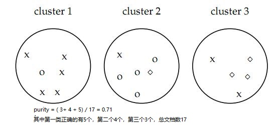

- [F-score](https://en.jinzhao.wiki/wiki/F-score)
F1 score, also known as balanced F-score or F-measure
$$P(\text{precision rate})={\frac {TP}{TP+FP}}, R(\text{recall rate})={\frac {TP}{TP+FN}}$$
$$F_{\beta }={\frac {(\beta ^{2}+1)\cdot P\cdot R}{\beta ^{2}\cdot P+R}}$$
F1 score就是$\beta = 1$时的F-measure；当$\beta = 0, F_0=P$；
> [Precision and recall](https://en.jinzhao.wiki/wiki/Precision_and_recall)
> metrics.f1_score

- [Jaccard index](https://en.jinzhao.wiki/wiki/Jaccard_coefficient)
$${\displaystyle {\text{Jaccard index}}=J(A,B)={\frac {|A\cap B|}{|A\cup B|}}={\frac {TP}{TP+FP+FN}}}$$
> metrics.jaccard_score

- [Dice index](https://en.jinzhao.wiki/wiki/S%C3%B8rensen%E2%80%93Dice_coefficient)
$${\displaystyle DSC={\frac {2TP}{2TP+FP+FN}}}$$

- [Homogeneity, completeness and V-measure](https://scikit-learn.org/stable/modules/clustering.html#homogeneity-completeness-and-v-measure)
同质性（Homogeneity）：每一个cluster(聚类结果簇)中所包含的数据应归属于一个class(类)。
完整性（completeness）：所有属于同一个class的数据应该被归到相同的cluster中。
我们假定数据集有N个数据。分类classes使用$C = \{c_i|i=1,…,n \}$；聚类clusters结果$K= \{k_i|1,…,m\}$；
$A = [a_{ij}]_{n \times m}$，其中 $a_{ij}$ 表示$c_i$属于$k_j$的数量（就是contingency table，下面有讲）
$$h = 1 - \frac{H(C|K)}{H(C)} , c = 1 - \frac{H(K|C)}{H(K)}$$
$$H(C|K) = - \sum_{k=1}^{|K|} \sum_{c=1}^{|C|} \frac{a_{ck}}{N}
\cdot \log\left(\frac{a_{ck}}{\sum_{c=1}^{|C|}a_{ck}}\right) \quad,\quad H(C) = - \sum_{c=1}^{|C|} \frac{\sum_{k=1}^{|K|}a_{ck}}{N} \cdot \log\left(\frac{\sum_{k=1}^{|K|}a_{ck}}{N}\right)$$
$$H(K|C) = - \sum_{c=1}^{|C|} \sum_{k=1}^{|K|} \frac{a_{ck}}{N}
\cdot \log\left(\frac{a_{ck}}{\sum_{k=1}^{|K|}a_{ck}}\right) \quad,\quad H(K) = - \sum_{k=1}^{|K|} \frac{\sum_{c=1}^{|C|}a_{ck}}{N} \cdot \log\left(\frac{\sum_{c=1}^{|C|}a_{ck}}{N}\right)$$
$当H(C)=0时，h=1；当H(K)=0时，c=1;$
两者的调和平均v_measure_score：
$$v = \frac{(1 + \beta) \times \text{homogeneity} \times \text{completeness}}{(\beta \times \text{homogeneity} + \text{completeness})}$$
$\beta$默认为1；当$\beta>1$时completeness影响更大，更多[参考](https://aclanthology.org/D07-1043.pdf)
三个指标都在[0,1]区间，越大越好
> metrics.homogeneity_score, metrics.completeness_score, metrics.v_measure_score
> 三个指数一起返回metrics.homogeneity_completeness_v_measure

- **Rand指数**（[Rand index](https://en.jinzhao.wiki/wiki/Rand_index)）
$$RI={\frac {TP+TN}{TP+FP+FN+TN}}=\frac{a+d}{n(n-1)/2}$$
[0,1]区间，值越大越好
> 衡量两个数据聚类之间相似性的度量（也可以是标记数据和预测数据之间的相似性）
> 1.0 是完美匹配分数。未调整 Rand 指数的得分范围为 [0, 1]，调整后(adjusted)的 Rand 指数为 [-1, 1]
> metrics.rand_score 、metrics.adjusted_rand_score

- FM指数（[Fowlkes–Mallows index](https://en.jinzhao.wiki/wiki/Fowlkes%E2%80%93Mallows_Index)）
$$\text{FMI} = \frac{\text{TP}}{\sqrt{(\text{TP} + \text{FP}) (\text{TP} + \text{FN})}}$$
> metrics.fowlkes_mallows_score

- **情形分析表**（[Contingency Matrix](https://en.jinzhao.wiki/wiki/Contingency_table)）

```
from sklearn.metrics.cluster import contingency_matrix
x = ["a", "a", "a", "b", "b", "b"]
y = [0, 0, 1, 1, 2, 2]
contingency_matrix(x, y)
array([[2, 1, 0],
       [0, 1, 2]])
```
列数代表y中不重复的个数；行代表x中不重复的个数；
第一行分别表示：2个a属于0，1个a属于1，0个a属于2
第二行分别表示：0个b属于0，1个b属于1，2个b属于2
> metrics.cluster.contingency_matrix
- **混淆矩阵**（[Confusion matrix](https://en.jinzhao.wiki/wiki/Confusion_matrix)）

行Predicted (expectation)
列Actual (observation)
TN表示预测negative正确
TP表示预测positive正确
FN表示预测negative错误
FP表示预测positive错误

Actual\Predicted |P|N
---|---|---
P(positive)|TP	|FN
N(negative)|FP	|TN

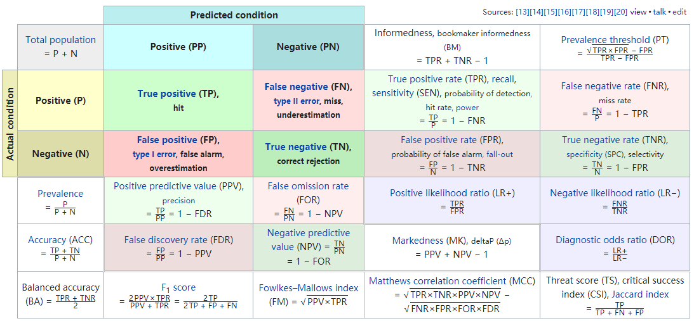

> 注意正常的confusion matrix中的四个元素相加为$C_n^2=n(n-1)/2$，而pair_confusion_matrix是$(n-1)$，并且混淆矩阵
$$\begin{split}C = \left[\begin{matrix}
C_{00}(FN) & C_{01}(FP) \\
C_{10}(TN) & C_{11}(TP)
\end{matrix}\right]\end{split}$$
> metrics.cluster.pair_confusion_matrix
> metrics.plot_confusion_matrix可以绘制混淆矩阵

- **互信息**（[mutual information](https://en.jinzhao.wiki/wiki/Mutual_information)）
数据集$S=\{s_{1},s_{2},\ldots s_{N}\}$, 簇$U=\{U_{1},U_{2},\ldots ,U_{R}\}$以及簇$V=\{V_{1},V_{2},\ldots ,V_{C}\}$,满足${\displaystyle U_{i}\cap U_{j}=\varnothing =V_{i}\cap V_{j}}$以及$\cup _{{i=1}}^{R}U_{i}=\cup _{{j=1}}^{C}V_{j}=S$
有这样一个表(R*C)$M=[n_{{ij}}]_{{j=1\ldots C}}^{{i=1\ldots R}}$,称为[contingency table](https://en.jinzhao.wiki/wiki/Contingency_table),其中$n_{{ij}}=\left|U_{i}\cap V_{j}\right|$
${\displaystyle P_{U}(i)={\frac {|U_{i}|}{N}}}$表示随机选取一个数据，属于$U_i$簇的概率。
${\displaystyle P_{UV}(i,j)={\frac {|U_{i}\cap V_{j}|}{N}}}$表示随机选取一个数据，同时属于$U_i, V_j$簇的概率。
${\displaystyle H(U)=-\sum _{i=1}^{R}P_{U}(i)\log P_{U}(i)}$表示$U$的熵。
$${\displaystyle MI(U,V)=\sum _{i=1}^{R}\sum _{j=1}^{C}P_{UV}(i,j)\log {\frac {P_{UV}(i,j)}{P_{U}(i)P_{V}(j)}}}$$
$$\text{NMI}(U, V) = \frac{\text{MI}(U, V)}{\text{mean}(H(U), H(V))}$$
$$AMI(U,V)={\frac {MI(U,V)-E\{MI(U,V)\}}{\max {\{H(U),H(V)\}}-E \{MI(U,V)\}}}$$
其中
$${\begin{aligned}E\{MI(U,V)\}=&\sum _{{i=1}}^{R}\sum _{{j=1}}^{C}\sum _{{n_{{ij}}=(a_{i}+b_{j}-N)^{+}}}^{{\min(a_{i},b_{j})}}{\frac  {n_{{ij}}}{N}}\log \left({\frac  {N\cdot n_{{ij}}}{a_{i}b_{j}}}\right)\times \\&{\frac  {a_{i}!b_{j}!(N-a_{i})!(N-b_{j})!}{N!n_{{ij}}!(a_{i}-n_{{ij}})!(b_{j}-n_{{ij}})!(N-a_{i}-b_{j}+n_{{ij}})!}}\\\end{aligned}}$$
$E\{MI(U,V)\} 为MI(U,V)$的期望；$(a_{i}+b_{j}-N)^{+} = \max(1,a_{i}+b_{j}-N)$;
$a_{i}=\sum _{{j=1}}^{C}n_{{ij}}$;$b_{j}=\sum _{{i=1}}^{R}n_{{ij}}$
越大越好，最好为1
> 参考[Adjusted mutual information](https://en.jinzhao.wiki/wiki/Adjusted_mutual_information)
> metrics.adjusted_mutual_info_score，metrics.normalized_mutual_info_score，metrics.mutual_info_score

**Cluster tendency**（聚类趋势）
- **霍普金斯统计量**（[Hopkins statistic](https://en.jinzhao.wiki/wiki/Hopkins_statistic)）
聚类趋势（聚类可行性）：应用聚类算法之前，应该考虑聚类可行性；如：即使数据不包含任何cluster，聚类方法也会返回cluster；因此，评估数据集是否包含有意义的cluster（即：非随机结构）有时会变得有必要。此过程被定义为 聚类趋势的评估 或 聚类可行性的分析。
与非随机结构相对的是均匀分布（随机结构），霍普金斯统计量的计算原理，便是检查数据是否符合均匀分布（或者说随机性）。
有数据集$X=\{x_1,x_2,...,x_n\},x_i \in \mathbb{R}^d$
生成随机数据集$Y=\{y_1,y_2,...,y_m\}, m \ll n $,即从样本的可能取值范围内随机生成m个点
$u_{i} = \min dist(y_i,x_j\in X)$就是一个随机点与数据集X中的点的最小距离；
从所有样本中随机找m个点，$w_{i} = \min dist(x_i,x_j\in X_{i\neq j})$就是每个点在样本空间(X)中找到一个离他最近的点之间的距离；
$${\displaystyle H={\frac {\sum _{i=1}^{m}{u_{i}^{d}}}{\sum _{i=1}^{m}{u_{i}^{d}}+\sum _{i=1}^{m}{w_{i}^{d}}}}\,,}$$
随机生成的点（样本可能的取值范围内）与从样本中找出点的空间比值
根据这个定义，均匀随机数据的值应该趋向于接近0.5（不可行），而聚集数据的值应该趋向于接近1（可行）【$\sum u \gg \sum w$，也就是说，如果聚类趋势明显，则随机生成的样本点距离应该远大于实际样本点的距离】。

> 参考[Clustering performance evaluation](https://scikit-learn.org/stable/modules/clustering.html#clustering-performance-evaluation)以及[Evaluation and assessment](https://en.jinzhao.wiki/wiki/Cluster_analysis#Evaluation_and_assessment)


k-means: 样本集合$X=\{x_1,x_2,...,x_n\},x_i \in \mathbb{R}^m$，算法的目标是将n个样本分到不同的cluster中$C = \{ C_1,...,C_k\},k \lt n,C_i \cap C_j =\empty , \cup_{i=1}^kC_i =X$;
用$F: x_i \to l,l\in \{1,...,k\}$表示划分函数，输入样本，输出所在的cluster
- **模型**：
$$l = F(x_i) = F(i) ,i \in \{1,...,n\} $$

- **策略**：
$$F^* = \argmin_{F} W(F) = \argmin_{F} \sum_{l=1}^k \sum_{F(i)=l}^{n_l} \|x_i - \bar{x}_l\|^2$$
其中损失函数$W(F)$为样本与其所属cluster的中心之间的距离的总和；
$n_l = \sum_{i=1}^n I(F(i)=l)$；

n个样本分到k个cluster的所有分法的种类有$S(n,k)$种，这个数字是指数级的，所以最优问题是个NP困难问题
$$S(n,k) = \frac{1}{k!}\sum_{l=1}^k(-1)^{k-l}\dbinom{k}{l}k^n$$

- **算法**：
迭代算法,不能保证全局最优
1. 随机选择k个中心$(m_1,m_2,...,m_k)$,
1. 将样本分别划分到与其最近的中心的cluster中
1. 更新每个cluster的均值$(m_1,m_2,...,m_k)$作为cluster的新的中心
1. 重复2，3直到收敛（中心变化很小）

---

K-means算法有以下不足：
1. 算法对初始值的选取依赖性极大。初始值不同，往往得到不同的局部极小值。
1. 由于将均值点作为聚类中心进行新一轮计算，远离数据密集区的孤立点和噪声点会导致聚类中心偏离真正的数据密集区，所以K-均值算法对噪声点和孤立点很敏感。


K-mediods算法优缺点
K-中心点轮换算法是一种使目标函数下降最快的方法，它属于启发式搜索算法，能从n个对象中找出以k个中心点为代表的一个局部优化划分聚类。与K-均值算法比较，K-中心点轮换算法解决了K-均值算法本身的缺陷：
1. 解决了K-均值算法对初始值选择依赖度大的问题。K-均值算法对于不同的初始值，结果往往得到不同的局部极小值。而K-中心点轮换算法采用轮换替换的方法替换中心点，从而与初始值的选择没有关系。
1. 解决了K-均值算法对噪声和离群点的敏感性问题。由于该算法不使用平均值来更改中心点而是选用位置最靠近中心的对象作为中心代表点，因此并不容易受极端数据的影响，具有很好的鲁棒性。

K-中心点轮换算法也存有以下缺点：
1. 由于K-中心点轮换算法是基于划分的一种聚类算法，仍然要求输入要得到的簇的数目k，所以当k的取值不正确时，对聚类的结果影响甚大。
1. 从以上的时间复杂度也可以看出，当n和k较大时，计算代价很高，所以将该算法应用于大数据集时不是很理想。

### 参考文献
[14-1] Jain A, Dubes R. Algorithms for clustering data. Prentice-Hall, 1988.

[14-2] Aggarwal C C, Reddy C K. Data clustering: algorithms and applications. CRC Press, 2013.

[14-3] MacQueen J B. Some methods for classification and analysis of multivariate observations. Proceedings of the 5th Berkeley Symposium on Mathematical Statistics and Probability. Volume 1,pp.396-410. 1967.

[14-4] Hastie T,Tibshirani R,Friedman J. [The Elements of Statistical Learning: DataMining,Inference,and Prediction](http://www.web.stanford.edu/~hastie/ElemStatLearn/printings/ESLII_print12_toc.pdf). Springer. 2001（中译本：统计学习基础——数据挖掘、推理与预测。范明，柴玉梅，昝红英等译。北京：电子工业出版社，2004）

[14-5] Pelleg D, Moore A W. X-means:  Extending K-means with Efficient Estimation of the Number of Clusters. Proceedings of ICML, pp. 727-734, 2000.

[14-6] Ester M, Kriegel H, Sander J, et al. [A Density-Based Algorithm for Discovering Clusters in Large Spatial Databases with Noise](https://www.aaai.org/Papers/KDD/1996/KDD96-037.pdf). Proceedings of ACM SIGKDD, pp. 226-231, 1996.

[14-7] Shi J, Malik J. Normalized cuts and image segmentation. IEEE Transactions on Pattern Analysis and Machine Intelligence, 2000,22(8):888-905.

[14-8] Dhillon I S. Co-clustering documents and words using bipartite spectral graph partitioning. Proceedings of ACM SIGKDD, pp. 269-274. 2001.


## 第 15 章 奇异值分解
奇异值分解([Singular Value Decomposition, SVD](https://en.jinzhao.wiki/wiki/Singular_value_decomposition))是在机器学习领域广泛应用的算法，它不光可以用于降维算法中的特征分解，还可以用于推荐系统，以及自然语言处理等领域。是很多机器学习算法的基石。也是矩阵分解（[Matrix decomposition](https://en.jinzhao.wiki/wiki/Category:Matrix_decompositions)）的一种。

先了解下特征值分解（[Eigenvalues and eigenvectors](https://en.jinzhao.wiki/wiki/Eigenvalues_and_eigenvectors)以及[Eigendecomposition of a matrix](https://en.jinzhao.wiki/wiki/Eigendecomposition_of_a_matrix)）以及对角化（[Diagonalizable matrix](https://en.jinzhao.wiki/wiki/Diagonalizable_matrix)）
特征值（有些方阵是没有特征值的）：
$${\displaystyle A\mathbf {u} =\lambda \mathbf {u} \implies (A-I\lambda)\mathbf {u} = 0}$$
特征值分解：
设$A_{n\times n}$，是具有n个线性无关的特征向量$q_i$（不一定是不同特征值,可以有相同的特征值），那么A可以分解为：
$${\displaystyle A=Q\Lambda Q^{-1}}$$
其中A是方阵，$\Lambda$是由特征值组成的对角矩阵（[diagonal matrix](https://en.jinzhao.wiki/wiki/Diagonal_matrix)）；
$q_i$通常是标准化的，但不是必须的;
因为Q的列是线性无关的，所以 Q 是可逆的;
如果A的特征值都不为0那么A是可逆的（[invertible](https://en.jinzhao.wiki/wiki/Invertible_matrix)）${\displaystyle \mathbf {A} ^{-1}=\mathbf {Q} \mathbf {\Lambda } ^{-1}\mathbf {Q} ^{-1}}$

注意只有[可对角化](https://en.jinzhao.wiki/wiki/Diagonalizable_matrix)的矩阵分解才能用这种方式：如以下矩阵不可被对角化
$${\displaystyle A = \left[{\begin{matrix}1&1\\0&1\end{matrix}}\right]}$$
其特征值为$[1,1]$,特征向量为$[1,0]^T , [-1,0]^T$

如果 $\mathbf {A}$  是对称矩阵（[symmetric matrix](https://en.jinzhao.wiki/wiki/Symmetric_matrix)），因为$\mathbf {Q}$  由特征向量构成 $\mathbf {A}$ 它保证是一个正交矩阵（[orthogonal matrix](https://en.jinzhao.wiki/wiki/Orthogonal_matrix)）,有${\displaystyle \mathbf {Q} ^{-1}=\mathbf {Q} ^{\mathrm {T} }}$

> Q其实也是酉矩阵（[Unitary Matrix](https://en.jinzhao.wiki/wiki/Unitary_matrix)），它是 正交矩阵 在复数上的推广。

> 不可对角化的矩阵称为有缺陷的（[defective](https://en.jinzhao.wiki/wiki/Defective_matrix)）。对于有缺陷的矩阵，特征向量的概念推广到广义特征向量（[generalized eigenvectors](https://en.jinzhao.wiki/wiki/Generalized_eigenvector)），特征值的对角矩阵推广到Jordan 范式（[Jordan normal form](https://en.jinzhao.wiki/wiki/Jordan_normal_form)）。在代数闭域上，任何矩阵A都具有Jordan 范式，因此允许广义特征向量的基和分解为广义特征空间（[generalized eigenspaces](https://en.jinzhao.wiki/wiki/Generalized_eigenspace)）。


- **模型**：
对于复矩阵 $M_{m \times n} = {\displaystyle \mathbf {U\Sigma V^{H}} }$
对于实矩阵 $M_{m \times n} = {\displaystyle \mathbf {U\Sigma V^{T}} }$
其中$U$是${\displaystyle m\times m}$复酉矩阵(正交矩阵)
$\Sigma = diag(\sigma_1,\sigma_2,...,\sigma_p)$是矩形对角矩阵（rectangular diagonal matrix），对角元素是非负的实数并且降序排列,$p=\min(m,n), \sigma_1 \ge \sigma_2 \ge ... \ge \sigma_p \ge 0$
$V$是一个${\displaystyle n\times n}$复酉矩阵(正交矩阵)
$\sigma_i$称为矩阵M的**奇异值**
$U$的列向量称为左奇异向量left-singular vector
$V$的列向量称为右奇异向量right-singular vector
如果矩阵$M$的秩为$r = rank(M),r \le \min(m,n)$
$M$的紧SVD（compact SVD）为$M_{m \times n} = U_{m \times r} \Sigma_{r \times r} V_{n \times r}^T$，$rank(\Sigma_{r \times r}) = rank(M) = r$（可以无损压缩）
$M$的截断SVD（truncated SVD）为$M_{m \times n} \approx U_{m \times k} \Sigma_{k \times k} V_{n \times k}^T , 0 \lt k \lt r$（有损压缩）
矩阵$M$的伪逆（[pseudoinverse](https://en.jinzhao.wiki/wiki/Moore%E2%80%93Penrose_inverse)）$M^{+} = V\Sigma^{+}U^{H}$
$M$的奇异值$\sigma_i$是$M^TM$的特征值的平方根$\sqrt{\lambda_i}$,$V$的列向量是$M^TM$的特征向量，$U$的列向量是$MM^T$的特征向量
$M^TM$很明显还是一个对称矩阵，其特征值为非负，证明：假设$\lambda$是$M^TM$的一个特征值
$\|Mx\|^2 = x^TA^TAx = x^T \lambda x= \lambda x^Tx = \lambda\|x\|^2 \Rightarrow \lambda = \frac{\|Mx\|^2}{\|x\|^2} \ge 0$
$${\begin{aligned}\mathbf {M} ^{T}\mathbf {M} &=\mathbf {V} {\boldsymbol {\Sigma }}^{T}\mathbf {U} ^{T}\,\mathbf {U} {\boldsymbol {\Sigma }}\mathbf {V} ^{T}=\mathbf {V} ({\boldsymbol {\Sigma }}^{T}{\boldsymbol {\Sigma }})\mathbf {V} ^{T}\\\mathbf {M} \mathbf {M} ^{T}&=\mathbf {U} {\boldsymbol {\Sigma }}\mathbf {V} ^{T}\,\mathbf {V} {\boldsymbol {\Sigma }}^{T}\mathbf {U} ^{T}=\mathbf {U} ({\boldsymbol {\Sigma }}{\boldsymbol {\Sigma }}^{T})\mathbf {U} ^{T}\end{aligned}}$$
这不就是矩阵的特征值分解吗【上面有将特征值分解有讲到对称矩阵的对角化（特征值分解）】

- **策略**：
- **算法**：
### 附加知识


#### 矩阵性质
这里介绍一些参见的[矩阵](https://en.jinzhao.wiki/wiki/Category:Matrices)，以及其性质。

##### 共轭转置（[Conjugate transpose](https://en.jinzhao.wiki/wiki/Conjugate_transpose)）

共轭（[Complex conjugate](https://en.jinzhao.wiki/wiki/Complex_conjugate)）是复数上的概念
对于一个复数$z =a + bi$，其共轭为$\bar{z} = a-bi$，所以有$z\bar{z} = a^2 + b^2$
共轭转置也有其它叫法，如：Hermitian conjugate, bedaggered matrix, adjoint matrix or transjugate。值得注意的是adjoint matrix而不是 这个[Adjugate matrix](https://en.jinzhao.wiki/wiki/Adjugate_matrix)，虽然有时候他们都用$A^*$表示。这里为了统一我用$A^H$表示A的共轭转置矩阵。可以参考[共轭转置矩阵与伴随矩阵都用A*表示合理吗？](https://zhuanlan.zhihu.com/p/87330558)
> 有个神奇的公式：欧拉公式 $e^{\pi i}+1=0$，准确的说欧拉公式为：$e^{ix}=\cos x + i\sin x$，前面只是当$x=\pi$时的结果。
> 这个公式里既有自然底数e，自然数1和0，虚数i还有圆周率pi，它是这么简洁，这么美丽啊！

$${\displaystyle \left({\boldsymbol {A}}^{\mathrm {H} }\right)_{ij}={\overline {{\boldsymbol {A}}_{ji}}}}$$

$${\displaystyle {\boldsymbol {A}}^{\mathrm {H} }=\left({\overline {\boldsymbol {A}}}\right)^{\mathsf {T}}={\overline {{\boldsymbol {A}}^{\mathsf {T}}}}}$$

例如：
$${\displaystyle {\boldsymbol {A}}={\begin{bmatrix}1&-2-i&5\\1+i&i&4-2i\end{bmatrix}}} , {\displaystyle {\boldsymbol {A}}^{\mathsf {T}}={\begin{bmatrix}1&1+i\\-2-i&i\\5&4-2i\end{bmatrix}}} , {\displaystyle {\boldsymbol {A}}^{\mathrm {H} }={\begin{bmatrix}1&1-i\\-2+i&-i\\5&4+2i\end{bmatrix}}}$$

性质：
- ${\displaystyle ({\boldsymbol {A}}+{\boldsymbol {B}})^{\mathrm {H} }={\boldsymbol {A}}^{\mathrm {H} }+{\boldsymbol {B }}^{\mathrm {H} }}$ 
- ${\displaystyle (z{\boldsymbol {A}})^{\mathrm {H} }={\overline {z}}{\boldsymbol {A}}^{\mathrm {H} }}$
- ${\displaystyle ({\boldsymbol {A}}{\boldsymbol {B}})^{\mathrm {H} }={\boldsymbol {B}}^{\mathrm {H} }{\boldsymbol {A}} ^{\mathrm {H} }}$
- ${\displaystyle \left({\boldsymbol {A}}^{\mathrm {H} }\right)^{\mathrm {H} }={\boldsymbol {A}}}$
- 如果$A$可逆，当且仅当$A^H$可逆，有${\displaystyle \left({\boldsymbol {A}}^{\mathrm {H} }\right)^{-1}=\left({\boldsymbol {A}}^{-1}\right)^{ \mathrm {H} }}$
- $A^H$的特征值是$A$特征值的复共轭
- 内积性质${\displaystyle \left\langle {\boldsymbol {A}}x,y\right\rangle _{m}=\left\langle x,{\boldsymbol {A}}^{\mathrm {H} }y\right\rangle _{n}}$，`A是m*n,x是n*1,y是m*1`，下标m表示是m维向量作内积。
- （A是方阵）行列式性质${\displaystyle \det \left({\boldsymbol {A}}^{\mathrm {H} }\right)={\overline {\det \left({\boldsymbol {A}}\right)}}}$
- （A是方阵）迹的性质${\displaystyle \operatorname {tr} \left({\boldsymbol {A}}^{\mathrm {H} }\right)={\overline {\operatorname {tr} ({\boldsymbol {A}})}}}$

##### 埃尔米特矩阵（[Hermitian matrix](https://en.jinzhao.wiki/wiki/Hermitian_matrix)）
Hermitian matrix (or self-adjoint matrix)
A是复**方阵**
$${\displaystyle A{\text{ Hermitian}}\quad \iff \quad A=A^{\mathsf {H}}}$$
例子：
$$A = {\displaystyle {\begin{bmatrix}0&a-ib&c-id\\a+ib&1&m-in\\c+id&m+in&2\end{bmatrix}}}$$
**埃尔米特矩阵是对称矩阵在复数上的推广**。

其矩阵有很多性质，具体见维基百科。

Skew-Hermitian matrix：${\displaystyle A{\text{ skew-Hermitian}}\quad \iff \quad A^{\mathsf {H}}=-A}$

##### [Normal matrix](https://en.jinzhao.wiki/wiki/Normal_matrix)
A是复**方阵**
$${\displaystyle A{\text{ normal}}\quad \iff \quad A^{H}A=AA^{H}}$$

例子：
$${\displaystyle A={\begin{bmatrix}1&1&0\\0&1&1\\1&0&1\end{bmatrix}}} , {\displaystyle AA^{H}={\begin{bmatrix}2&1&1\\1&2&1\\1&1&2\end{bmatrix}}=A^{H}A.}$$

Normal matrix一定是可对角化的$A = U\Lambda U^H$，$U$是酉矩阵，$\Lambda = diag(\lambda_1,...)$是$A$的特征值组成的对角矩阵

> 对于复矩阵，所有的unitary, Hermitian, and skew-Hermitian 矩阵都是normal矩阵
> 对应的对于实矩阵，所有的 orthogonal, symmetric, and skew-symmetric 矩阵也都是normal矩阵

##### 酉矩阵（[Unitary matrix](https://en.jinzhao.wiki/wiki/Unitary_matrix)）
U是复**方阵**
$$U^{H} = U^{-1}$$
性质：
- ${\displaystyle U^{H}U=UU^{H}=I,}$
- $\left\langle Ux,Uy\right\rangle = \left\langle x,y\right\rangle$
- U是可对角化的${\displaystyle U=VDV^{H},}$where V is unitary, and D is diagonal and unitary.
- ${\displaystyle \left|\det(U)\right|=1}$
- 其特征向量是相互正交的（废话，正交矩阵的推广）

**酉矩阵它是正交矩阵在复数上的推广**。

#### 矩阵分解(因子分解)

> sympy.Matrix除了分解还有diagonalize对角化（也是一种矩阵分解），eig特征值（其实也可以特征值分解），rref行简化阶梯型，det行列式，inv逆矩阵，广义逆矩阵pinv；更多[参考](https://docs.sympy.org/latest/modules/matrices/matrices.html#linear-algebra)
> scipy.linalg中也有很多关于线性代数的方法：scipy.linalg.svd，以及各种矩阵分解的方法；更多[参考](http://scipy.github.io/devdocs/reference/linalg.html)
> numpy.linalg中也有很多关于线性代数的方法：np.linalg.svd；更多[参考](https://docs.scipy.org/doc/numpy-1.15.0/reference/routines.linalg.html)


除了SVD和PCA，还有很多矩阵分解（[Matrix decomposition](https://en.jinzhao.wiki/wiki/Matrix_decomposition)）的方法。不过有很多分解是有要求的，比如必须是方阵（特征值分解就要求必须是方阵）等。
- **LU分解**（[LU decomposition](https://en.jinzhao.wiki/wiki/LU_decomposition)）
$${\displaystyle A=LU.}$$
L是下三角矩阵（[lower triangular matrix](https://en.jinzhao.wiki/wiki/Triangular_matrix)）
U是上三角矩阵（[upper triangular matrix](https://en.jinzhao.wiki/wiki/Triangular_matrix)）
有时还会包含一个置换矩阵（[permutation matrix](https://en.jinzhao.wiki/wiki/Permutation_matrix)），它在每行和每列中只有一个1，而在其他地方则为0。
$${\displaystyle A=PLU}$$

- **QR分解**（[QR decomposition](https://en.jinzhao.wiki/wiki/QR_decomposition)）
$$A = QR$$
Q是正交矩阵（[Orthogonal Matrix](https://en.jinzhao.wiki/wiki/Orthogonal_matrix)）；
R是上三角矩阵（[right(upper) triangular matrix](https://en.jinzhao.wiki/wiki/Triangular_matrix)）
> 类似的可以定义QL、RQ 和 LQ，L是下三角矩阵（[left(lower) triangular matrix](https://en.jinzhao.wiki/wiki/Triangular_matrix)）


- **非负矩阵分解**（[Non-negative matrix factorization (NMF or NNMF)](https://en.jinzhao.wiki/wiki/Non-negative_matrix_factorization)）
$$\mathbf {A} =\mathbf {W} \mathbf {H} \,.$$
将矩阵$A$分解为两个非负矩阵的乘积(近似相等)
$$minimize  {\displaystyle \left\|V-WH\right\|_{F},} \\ s.t. W\geq 0,H\geq 0.$$
这里有讲到[不同的表示方法对应这不同说法](https://en.jinzhao.wiki/wiki/Non-negative_matrix_factorization#Clustering_property)，这里有[不同的表示方法](https://scikit-learn.org/stable/modules/decomposition.html#nmf-with-a-beta-divergence)

### 参考文献

[15-1] Leon S J. Linear algebra with applications. Pearson, 2009(中译本：线性代数。张文博，张丽静 译. 北京：机械工业出版社)

[15-2] Strang G. Introduction to linear algebra. Fourth Edition. Wellesley-Cambridge Press, 2009.

[15-3] Cline A K. Dhillon I S. Computation of the singular value decomposition, Handbook of linear algebra. CRC Press, 2006.

[15-4] 徐树方. 矩阵计算的理论与方法。北京：北京大学出版社, 1995.

[15-5] Kolda T G,Bader B W. [Tensor decompositions and applications](https://old-www.sandia.gov/~tgkolda/pubs/pubfiles/SAND2007-6702.pdf). SIAM Review, 2009, 51(3):455-500.

## 第 16 章 主成分分析

主成分分析（[Principal component analysis, PCA](https://en.jinzhao.wiki/wiki/Principal_component_analysis)）是一种常用的无监督学习方法，PCA利用正交变换把由线性相关变量表示的观测数据转换为少数几个由线性无关变量表示的数据，线性无关的变量称为主成分。

主成分分析步骤如下：
1. 对给定数据进行规范化，使得数据每一变量的平均值为0,方差为1（StandardScaler）。

1. 对数据进行正交变换，原来由线性相关变量表示的数据,通过正交变换变成由若干个线性无关的新变量表示的数据。

新变量是可能的正交变换中变量的方差的和(信息保存)最大的，方差表示在新变量上信息的大小。将新变量依次称为第一主成分、第二主成分等。

> 我们通常表示一个样本是在实数空间中用正交坐标系表示，规范化的数据分布在原点附近

主成分分析就是对数据进行正交变换，对原坐标系进行旋转变换，并将数据在新坐标系中表示；我们将选择方差最大的方向作为新坐标系的第一坐标轴。方差最大代表着在该方向上的投影（不就是在这个坐标系的坐标轴上的表示么）分散的最开。

根据方差的定义，每个方向上方差就是在该坐标系（变换后的新坐标系）上表示所对应的维度的方差$var(a) = \frac{1}{N-1}\sum_{i=1}^N (a_i - \mu)^2$（用第一个方向来说明, N个样本的第一个维度组成向量$a$）；由于我们已经对数据进行的规范化，所以均值为0；$var(a) = \frac{1}{N-1}\sum_{i=1}^N (a_i)^2$ ;$a_i$就是第$i$个样本$x^{(i)}$与第一个方向的内积。

我们的目的就是为了$var(a)$最大，我们要求的就是找到变换后的新坐标系，假设方差最大的方向的单位向量为$v_1$，数据集$T = \{x^{(1)},x^{(2)},...,x^{(N)}\} , x=\{x_1,...,x_m\}^T$，m维

$$\max \frac{1}{N-1}\sum_{i=1}^N \braket{x^{(i)},v_1}^2 = \frac{1}{N-1}\sum_{i=1}^N \|{x^{(i)}}^{T}.v_1\|^2 \\= \frac{1}{N-1}\sum_{i=1}^N ({x^{(i)}}^{T}.v_1)^T({x^{(i)}}^{T}.v_1) \\= \frac{1}{N-1}\sum_{i=1}^N v_1^T{x^{(i)}}{x^{(i)}}^{T}v_1 \\= \frac{1}{N-1} v_1^T \sum_{i=1}^N[{x^{(i)}}{x^{(i)}}^{T}]v_1$$
设矩阵$X = [x^{(1)},x^{(2)},...,x^{(N)}]$那么$XX^T =\sum_{i=1}^N[{x^{(i)}}{x^{(i)}}^{T}]$，得到
$$\max \frac{1}{N-1} v_1^T XX^T v_1 \\ s.t. \quad v_1^Tv_1 =1$$
拉格朗日函数（参见[矩阵求导](https://en.jinzhao.wiki/wiki/Matrix_calculus#Scalar-by-vector_identities)）
$$L = - \frac{1}{N-1} v_1^T XX^T v_1 + \lambda_1(v_1^Tv_1 - 1)$$
$$\frac{\partial L}{\partial v_1} = -2\frac{1}{N-1}v_1^T XX^T + 2\lambda_1 v_1^T =0 $$
$$\frac{1}{N-1}v_1^T XX^T = \lambda_1 v_1^T \implies  \frac{1}{N-1}XX^Tv_1 = \lambda_1 v_1$$
其实$\frac{1}{N-1}XX^T$就是$X_{m \times N}$样本的协方差矩阵$\Sigma_{m \times m}$

$\lambda_1$是$\Sigma_{m \times m}$的特征值，$v_1$(列向量)是其对应的特征值向量；

接着求第二个主成分$v_2$,主成分是相互正交的
$$\max \frac{1}{N-1} v_2^T XX^T v_2 \\ s.t. \quad v_2^Tv_2 =1 ,v_2^Tv_1 =0$$
注意到
$$v_1^T XX^T v_2 = \lambda_1 v_1^T v_2 = 0 = v_2^T XX^T v_1 =  \lambda_1 v_2^T v_1$$
依次求得其它成分。

最终有主成分组成的矩阵
$V_{m \times m } = [v_1,v_2,...,v_m]$
降维到k维就是一次取前k个向量组成的矩阵与X作乘积，那么降维后的数据：

$$Y_{k \times N} = V_{m \times k }^T X_{m \times N}$$

> 前面学习了SVD需要求$A^TA$的特征值分解;而PCA需要求$\frac{1}{N-1}XX^T$的特征值分解;
> 只需要取$A = \frac{X^T}{\sqrt{N-1}}$就可以将PCA问题可以转化为SVD问题求解
> 其实，PCA只与SVD的右奇异向量的压缩效果相同。
> 一般 $X$ 的维度很高，$XX^T$ 的计算量很大，并且方阵的特征值分解计算效率不高，SVD除了特征值分解这种求解方式外，还有更高效且更准确的迭代求解法，避免了$XX^T$的计算

- **模型**：
- **策略**：
- **算法**：

**稀疏主成分分析**（[Sparse PCA](https://en.jinzhao.wiki/wiki/Sparse_PCA)）
稀疏 PCA 问题有许多不同的公式，以下是使用[Structured Sparse Principal Component Analysis](https://www.di.ens.fr/~fbach/sspca_AISTATS2010.pdf)以及[Online Dictionary Learning for Sparse Coding](https://www.di.ens.fr/sierra/pdfs/icml09.pdf)

$$\begin{split}(U^*, V^*) = \underset{U, V}{\operatorname{arg\,min\,}} & \frac{1}{2}
             ||X-UV||_2^2+\alpha||V||_1 \\
             \text{subject to } & ||U_k||_2 = 1 \text{ for all }
             0 \leq k < n_{components}\end{split}$$

> 意思就是求UV让其近似等于X，然后得到一个稀疏矩阵V
> sklearn.decomposition.SparsePCA.components_ 就是其稀疏的矩阵$V$
> SPCA的含义参考 [Matrix decomposition](https://github.com/kingreatwill/files/tree/main/ebook/Matrix%20decomposition%20.pdf)

### 附加知识

#### 基变换
我们常说的向量(3,2)其实隐式引入了一个定义：以 x 轴和 y 轴上正方向长度为 1 的向量为标准。向量 (3,2) 实际是说在 x 轴投影为 3 而 y 轴的投影为 2。注意投影是一个标量，所以可以为负。
而x 轴和 y 轴的方向的单位向量就是(1,0)和(0,1)，所以(1,0)和(0,1)就是坐标系的基

如：另一组基(单位向量)$(\frac{1}{\sqrt{2}},\frac{1}{\sqrt{2}})$和$(-\frac{1}{\sqrt{2}},\frac{1}{\sqrt{2}})$
那么(3,2)在该坐标系中如何表示呢？我们知道一个向量$a$在一个方向（$单位向量x$）上的投影可以用内积表示$\braket{a,x} = \|a\|.\|x\|\cos \theta = \|a\|\cos \theta$，其中$\theta$表示两个向量的夹角。

$a=(3,2)$在$x=(\frac{1}{\sqrt{2}},\frac{1}{\sqrt{2}})$这个方向的投影为$\braket{a,x} = \frac{5}{\sqrt{2}}$
$a=(3,2)$在$y=(-\frac{1}{\sqrt{2}},\frac{1}{\sqrt{2}})$这个方向的投影为$\braket{a,y} = -\frac{1}{\sqrt{2}}$

所以新坐标为$(\frac{5}{\sqrt{2}},-\frac{1}{\sqrt{2}})$

我们也可以用矩阵来表示(x,y是行向量;a用列向量)
$$\begin{bmatrix} x \\  y\end{bmatrix}\begin{bmatrix} 3 \\ 2\end{bmatrix} = \begin{bmatrix} \frac{1}{\sqrt{2}},\frac{1}{\sqrt{2}} \\  -\frac{1}{\sqrt{2}},\frac{1}{\sqrt{2}}\end{bmatrix}\begin{bmatrix} 3 \\ 2\end{bmatrix} = \begin{bmatrix} \frac{5}{\sqrt{2}} \\  -\frac{1}{\sqrt{2}}\end{bmatrix}$$

#### 协方差
协方差（[Covariance](https://en.jinzhao.wiki/wiki/Covariance)）的定义：

$${\displaystyle \operatorname {cov} (X,Y)=\operatorname {E} {{\big [}(X-\operatorname {E} [X])(Y-\operatorname {E} [Y]){\big ]}}} \\ {\displaystyle \operatorname {cov} (X,Y)={\frac {1}{n}}\sum _{i=1}^{n}(x_{i}-E(X))(y_{i}-E(Y)).}$$

性质：
$${\displaystyle {\begin{aligned}\operatorname {cov} (X,Y)&=\operatorname {E} \left[\left(X-\operatorname {E} \left[X\right]\right)\left(Y-\operatorname {E} \left[Y\right]\right)\right]\\&=\operatorname {E} \left[XY-X\operatorname {E} \left[Y\right]-\operatorname {E} \left[X\right]Y+\operatorname {E} \left[X\right]\operatorname {E} \left[Y\right]\right]\\&=\operatorname {E} \left[XY\right]-\operatorname {E} \left[X\right]\operatorname {E} \left[Y\right]-\operatorname {E} \left[X\right]\operatorname {E} \left[Y\right]+\operatorname {E} \left[X\right]\operatorname {E} \left[Y\right]\\&=\operatorname {E} \left[XY\right]-\operatorname {E} \left[X\right]\operatorname {E} \left[Y\right],\end{aligned}}}$$


$${\displaystyle {\begin{aligned}\operatorname {cov} (X,a)&=0\\\operatorname {cov} (X,X)&=\operatorname {var} (X)\\\operatorname {cov} (X,Y)&=\operatorname {cov} (Y,X)\\\operatorname {cov} (aX,bY)&=ab\,\operatorname {cov} (X,Y)\\\operatorname {cov} (X+a,Y+b)&=\operatorname {cov} (X,Y)\\\operatorname {cov} (aX+bY,cW+dV)&=ac\,\operatorname {cov} (X,W)+ad\,\operatorname {cov} (X,V)+bc\,\operatorname {cov} (Y,W)+bd\,\operatorname {cov} (Y,V)\end{aligned}}}$$

##### 协方差矩阵
协方差矩阵（[Covariance matrix](https://en.jinzhao.wiki/wiki/Covariance_matrix)）的定义：**对称的方阵**
$X$是个随机向量（random vector），每个实体（随机变量）就是一个列向量，就是矩阵用列向量表示；
$${\displaystyle \mathbf {X} =(X_{1},X_{2},...,X_{n})^{\mathrm {T} }}$$
$X$的协方差矩阵用${\displaystyle \operatorname {K} _{\mathbf {X} \mathbf {X} }}$表示，矩阵中的每个元素${\displaystyle \operatorname {K} _{X_{i}X_{j}}=\operatorname {cov} [X_{i},X_{j}]=\operatorname {E} [(X_{i}-\operatorname {E} [X_{i}])(X_{j}-\operatorname {E} [X_{j}])]}$

$${\displaystyle \operatorname {K} _{\mathbf {X} \mathbf {X} }={\begin{bmatrix}\mathrm {E} [(X_{1}-\operatorname {E} [X_{1}])(X_{1}-\operatorname {E} [X_{1}])]&\mathrm {E} [(X_{1}-\operatorname {E} [X_{1}])(X_{2}-\operatorname {E} [X_{2}])]&\cdots &\mathrm {E} [(X_{1}-\operatorname {E} [X_{1}])(X_{n}-\operatorname {E} [X_{n}])]\\\\\mathrm {E} [(X_{2}-\operatorname {E} [X_{2}])(X_{1}-\operatorname {E} [X_{1}])]&\mathrm {E} [(X_{2}-\operatorname {E} [X_{2}])(X_{2}-\operatorname {E} [X_{2}])]&\cdots &\mathrm {E} [(X_{2}-\operatorname {E} [X_{2}])(X_{n}-\operatorname {E} [X_{n}])]\\\\\vdots &\vdots &\ddots &\vdots \\\\\mathrm {E} [(X_{n}-\operatorname {E} [X_{n}])(X_{1}-\operatorname {E} [X_{1}])]&\mathrm {E} [(X_{n}-\operatorname {E} [X_{n}])(X_{2}-\operatorname {E} [X_{2}])]&\cdots &\mathrm {E} [(X_{n}-\operatorname {E} [X_{n}])(X_{n}-\operatorname {E} [X_{n}])]\end{bmatrix}}}$$

**样本的协方差**（无偏）
$$cov(X,Y) = \frac{1}{n - 1}\sum_{i=1}^{n}\left ( X_{i} - \bar{X} \right )\left ( Y_{i} - \bar{Y} \right )$$

**样本的协方差矩阵**：
$$cov[X_{n \times p}]_{n \times n} = cov[X_1,...,X_n] = \frac{1}{n-1}{K} _{\mathbf {X} \mathbf {X} }$$
这里很多协方差函数都有参数，可以设置到底是按行向量还是列向量计算协方差。
也有些地方是用$\frac{1}{n}$，就是无偏与有偏的区别。

> $\text{np.cov}(X_{3 \times 2},rowvar = False)$输出$2 \times 2$（rowvar = False表示一列是一个特征）;默认是输出$3 \times 3$（默认是行表示一个特征）
> $\text{np.cov}(x,y,z)$输出$3 \times 3$

##### 期望
期望（[Expectation](https://en.jinzhao.wiki/wiki/Expected_value)）的定义：
$${\displaystyle \operatorname {E} [X]=\sum _{i=1}^{k}x_{i}\,p_{i}=x_{1}p_{1}+x_{2}p_{2}+\cdots +x_{k}p_{k}.} \\ {\displaystyle p_{1}+p_{2}+\cdots +p_{k}=1,}$$

性质：
$${\displaystyle {\begin{aligned}\operatorname {E} [X+Y]&=\operatorname {E} [X]+\operatorname {E} [Y],\\\operatorname {E} [aX]&=a\operatorname {E} [X],\end{aligned}}}$$

如果$X,Y$是相互独立的，那么${\displaystyle \operatorname {E} [XY]=\operatorname {E} [X]\operatorname {E} [Y]}$

常数的期望等于常数本身$E(a) = a$

$x_i$是随机变量$X$的一个实例，$X$服从什么分布，$x_i$也是服从什么分布的，所以$E(x_i) = E(X),D(x_i) = D(X)$

$E(X)$为一阶矩
$E(X^2)$为二阶矩

原点矩（[raw moment](https://en.jinzhao.wiki/wiki/Moment_(mathematics))）和中心矩（[central moment](https://en.jinzhao.wiki/wiki/Central_moment)）
$E(X^k)$为k阶远点矩，一阶原点矩是数学期望
$E(X-E(X))^k$为k阶中心矩，二阶原点矩是方差（以$E(X)$为中心）

##### 方差
方差（[Variance](https://en.jinzhao.wiki/wiki/Variance)）的定义：
$$\operatorname {Var} (X)=\operatorname {E} \left[(X-\mu )^{2}\right] \\ {\displaystyle \mu =\operatorname {E} [X]}$$

性质：
$D(X)$ 和 $Var(X)$ 都是表示方差；方差大于等于0；参数的方差为0；

$\operatorname {Var} (X)=\operatorname {Cov} (X,X).$
$${\displaystyle {\begin{aligned}\operatorname {Var} (X)&=\operatorname {E} \left[(X-\operatorname {E} [X])^{2}\right]\\[4pt]&=\operatorname {E} \left[X^{2}-2X\operatorname {E} [X]+\operatorname {E} [X]^{2}\right]\\[4pt]&=\operatorname {E} \left[X^{2}\right]-2\operatorname {E} [X]\operatorname {E} [X]+\operatorname {E} [X]^{2}\\[4pt]&=\operatorname {E} \left[X^{2}\right]-\operatorname {E} [X]^{2}\end{aligned}}}$$

$${\displaystyle {\begin{aligned}\operatorname {Var} (X+Y)&=\operatorname {E} \left[(X+Y)^{2}\right]-(\operatorname {E} [X+Y])^{2}\\[5pt]&=\operatorname {E} \left[X^{2}+2XY+Y^{2}\right]-(\operatorname {E} [X]+\operatorname {E} [Y])^{2} \\&=\operatorname {E} \left[X^{2}\right]+2\operatorname {E} [XY]+\operatorname {E} \left[Y^{2}\right]-\left(\operatorname {E} [X]^{2}+2\operatorname {E} [X]\operatorname {E} [Y]+\operatorname {E} [Y]^{2}\right)\\[5pt]&=\operatorname {E} \left[X^{2}\right]+\operatorname {E} \left[Y^{2}\right]-\operatorname {E} [X]^{2}-\operatorname {E} [Y]^{2}\\[5pt]&=\operatorname {Var} (X)+\operatorname {Var} (Y)\end{aligned}}}$$

$\operatorname {Var} (X+a)=\operatorname {Var} (X).$
$\operatorname {Var} (aX)=a^{2}\operatorname {Var} (X).$
$\operatorname {Var} (aX+bY)=a^{2}\operatorname {Var} (X)+b^{2}\operatorname {Var} (Y)+2ab\,\operatorname {Cov} (X,Y),$
$\operatorname {Var} (aX-bY)=a^{2}\operatorname {Var} (X)+b^{2}\operatorname {Var} (Y)-2ab\,\operatorname {Cov} (X,Y),$

${\displaystyle \operatorname {Var} (XY)=\operatorname {E} \left(X^{2}\right)\operatorname {E} \left(Y^{2}\right)-[\operatorname {E} (X)]^{2}[\operatorname {E} (Y)]^{2}.}$

#### 有偏估计和无偏估计

**参数估计**需要未知参数的估计量和一定置信度
估计方法：用点估计估计一个值；用区间估计估计值的可能区间和是该值的可能性。
估计的**偏差**的定义：
$$bias(\hat{\theta}_m) = E(\hat{\theta}_m)-\theta$$
$\theta$是数据分布真实参数（完美）
$\theta$的估计量或统计量$\hat{\theta}_m$

对估计值的评价标准：
- 无偏性（Unbiasedness）：是估计量（不一定是样本均值）抽样分布的数学期望等与总体参数的真值。
$m$为样本数量（抽样数量）
如果$bias(\hat{\theta}_m) = 0$那么估计量$\hat{\theta}_m$被称为**无偏**(unbiased)的,意味着$E(\hat{\theta}_m) = \theta$
如果$\lim_{m \to \infty}bias(\hat{\theta}_m) = 0$那么估计量$\hat{\theta}_m$被称为 **渐近无偏** (asymptotically unbiased) 的,意味着 $\lim_{m \to \infty}E(\hat{\theta}_m) = \theta$

- 有效性（Efficiency）：是有时几组数据都是无偏的，但是此时有效数是方差最小的。
如：样本$(x_1,...,x_m)$，其均值为$\mu$，方差为$\sigma^2$
第一种情况：随机取一个样本$x_i$，那么$E(x_i)=E(x_1)=...=\mu$，方差为$D(x_i)=D(x_1)=...=\sigma^2$（因为每个值都有可能取到，所以随机取一个样本得期望就是均值，方差就是$\sigma^2$）
第二种情况：取平均值$\bar{x}$,那么$E(\bar{x}) = E[\frac{1}{m}\sum_m x_i] =\frac{1}{m}E[\sum_mx_i] = \frac{1}{m}[\sum_mE(x_i)] = \frac{1}{m}[\sum_m \mu] = \mu$;
$D(\bar{x}) = D(\frac{1}{m}\sum_m x_i) = \frac{1}{m^2}D(\sum_m x_i) = \frac{1}{m^2}\sum_m D(x_i) = \frac{1}{m^2} m\sigma^2 = \frac{\sigma^2}{m}$
很明显第二种的方差小

- 一致性（Consistency）：是指样本变大，估计越准。
$\lim_{m \to \infty}P(|\hat{\theta}_m - \theta | \lt \epsilon) = 1$


**无偏估计**
例如样本均值的估计为$\hat{\mu} = \sum_{i=1}^m x_i$，真实的均值为$\mu$，如何知道这个估计是有偏还是无偏？根据定义判断偏差是否为0；$bias(\hat{\mu}) = E(\hat{\mu}) - \mu$
这里的证明再有效性已经证明过了。

**有偏估计**
如果样本方差的估计为$\hat{\sigma}^2 = \frac{1}{m}\sum_{i=1}^m(x_i-\hat{\mu})^2$,$\hat{\mu} = \sum_{i=1}^m x_i$，那么偏差$bias(\hat{\sigma}^2) = E[\hat{\sigma}^2] - \sigma^2$不为0，就证明这个估计是有偏的。
我们来求$E[\hat{\sigma}^2]$
$$ E[\hat{\sigma}^2] = E[\frac{1}{m}\sum_{i=1}^m(x_i-\hat{\mu})^2] \\= E[\frac{1}{m}\sum_{i=1}^m(x_i^2- 2\hat{\mu}x_i +\hat{\mu}^2)] \\= E[\frac{1}{m}\sum_{i=1}^mx_i^2-\frac{1}{m}\sum_{i=1}^m 2\hat{\mu}x_i +\frac{1}{m}\sum_{i=1}^m\hat{\mu}^2]\\= E[\frac{1}{m}\sum_{i=1}^mx_i^2-2\hat{\mu}\frac{1}{m}\sum_{i=1}^m x_i +\frac{1}{m}\sum_{i=1}^m\hat{\mu}^2]\\= E[\frac{1}{m}\sum_{i=1}^mx_i^2-2\hat{\mu}\hat{\mu} +\hat{\mu}^2]= E[\frac{1}{m}\sum_{i=1}^mx_i^2-\hat{\mu}^2] \\= E[\frac{1}{m}\sum_{i=1}^mx_i^2]-E[\hat{\mu}^2] = \frac{1}{m}E[\sum_{i=1}^mx_i^2]-E[\hat{\mu}^2]$$

$E[\hat{\mu}^2] = D(\hat{\mu}) + E(\hat{\mu})^2$
而$D(\hat{\mu}) = \frac{1}{m} \sigma^2 和 E(\hat{\mu}) = \mu$在上面的有效性中已经证明了
所以$E[\hat{\mu}^2] = \frac{1}{m} \sigma^2 + \mu^2$

$E[{x_i}^2] = D(x_i) + E(x_i)^2$
而$D(x_i) = \sigma^2 和 E(x_i) = \mu$在上面的有效性中已经证明了
所以$ \frac{1}{m}E[\sum_{i=1}^mx_i^2] = \frac{1}{m}\sum_{i=1}^m E[x_i^2]= \sigma^2 + \mu^2$

所以$E[\hat{\sigma}^2] = \sigma^2 + \mu^2 - (\frac{1}{m} \sigma^2 + \mu^2) =\frac{m-1}{m}\sigma^2$
所以估计是有偏估计。

所以方差的无偏估计为$\tilde{\sigma}^2 = \frac{1}{m-1}\sum_{i=1}^m(x_i-\hat{\mu})^2$

当$\lim_{m \to \infty}\frac{1}{m}\sum_{i=1}^m(x_i-\hat{\mu})^2 = \frac{1}{m-1}\sum_{i=1}^m(x_i-\hat{\mu})^2$，也就是说有偏估计是一个渐近无偏估计。

无偏估计不一定是最好的估计！

#### 因子分析FA

因子分析（[Factor analysis, FA](https://en.jinzhao.wiki/wiki/Factor_analysis)）

每个变量都可以表示成公共因子的线性函数与特殊因子之和
$$X_i = a_{i1}F_1 + a_{i2}F_2 +...++ a_{im}F_m  + \epsilon_i  ,(i=1,2,...,p) $$
式中的F1，F2，…，Fm称为公共因子，εi称为Xi的特殊因子。该模型可用矩阵表示为：`X = AF+ε`
X 表示原始数据，矩阵A称为因子载荷矩阵,F表示公共因子， ε是特殊因子
aij称为因子“载荷”，是第i个变量在第j个因子上的负荷，如果把变量Xi看成m维空间中的一个点，则aij表示它在坐标轴Fj上的投影。
$X = [X_1,X_2...X_p]^T$
$A= \begin{bmatrix}
a_{11} & a_{12} & ... & a_{1m} \\\\
a_{21} & a_{22} & ... & a_{2m} \\\\
... & ... & ... & ... \\\\
a_{p1} & a_{p2} & ... & a_{pm} \\\\
\end{bmatrix}$
$F = [F_1,F_2...F_m]^T$
$\epsilon = [\epsilon_1,\epsilon_2...\epsilon_p]^T$

> 主成分分析，是分析维度属性的主要成分表示。
> 因子分析，是分析属性们的公共部分的表示。
> 二者均应用于高斯分布的数据，非高斯分布的数据采用独立成分分析ICA算法

#### 独立成分分析ICA
独立成分分析（[Independent component analysis, ICA](https://en.jinzhao.wiki/wiki/Independent_component_analysis)）

`X=AS`
`Y=WX=WAS  ， A = inv(W)`
ICA(Independent Component Correlation Algorithm)是一种函数，X为n维观测信号矢量，S为独立的m（m<=n)维未知源信号矢量，矩阵A被称为混合矩阵。
ICA的目的就是寻找解混矩阵W（A的逆矩阵），然后对X进行线性变换，得到输出向量Y。

ICA是找出构成信号的相互独立部分(不需要正交)，对应高阶统计量分析。ICA理论认为用来观测的混合数据阵X是由独立元S经过A线性加权获得。
ICA理论的目标就是通过X求得一个分离矩阵W，使得W作用在X上所获得的信号Y是独立源S的最优逼近，


[独立成分分析 (ICA) 应用参考(Origin来做ICA分析)](https://www.bilibili.com/video/BV1w54y1G7bw)

[独立成分分析 - 讲解的原理](https://www.bilibili.com/video/BV1mQ4y1M7wB)

[Independent Component Analysis (ICA)](http://www.sci.utah.edu/~shireen/pdfs/tutorials/Elhabian_ICA09.pdf)

### 参考文献
[16-1] 方开泰. 实用多元统计分析. 上海：华东师范大学出版社, 1989.
[16-2] 夏绍玮，杨家本，杨振斌. 系统工程概论. 北京：清华大学出版社，1995.
[16-3] Jolliffe I. Principal component analysis, Sencond Edition. John Wiley & Sons, 2002.
[16-4] Shlens J. A tutorial on principal component analysis. arXiv preprint arXiv: 14016.1100, 2014.
[16-5] Schölkopf B, Smola A, Müller K-R. Kernel principal component analysis. Artificial Neural Networks-ICANN'97. Springer, 1997:583-588.
[16-6] Hardoon D R, Szedmak S, Shawe-Taylor J. Canonical correlation analysis: an overview with application to learning methods. Neural Computation, 2004, 16(12):2639-2664.
[16-7] Candes E J, Li X D, Ma Y, et al. Robust Principal component analysis? Journal of the ACM(JACM), 2011, 58(3):11.


## 第 17 章 潜在语义分析
我们先介绍下文本信息处理中的一些问题：
1. 一词多义（多义现象）[polysemy](https://en.jinzhao.wiki/wiki/Polysemy)
分类时：比如bank 这个单词如果和mortgage, loans, rates 这些单词同时出现时，bank 很可能表示金融机构的意思。可是如果bank 这个单词和lures, casting, fish一起出现，那么很可能表示河岸的意思。

1. 一义多词（同义现象）[synonymy](https://en.jinzhao.wiki/wiki/Synonym)
检索时：比如用户搜索“automobile”，即汽车，传统向量空间模型仅仅会返回包含“automobile”单词的页面，而实际上包含“car”单词的页面也可能是用户所需要的。

> LSA能解决同义（语义相似度）问题：发现单词与主题之间的关系，这里主题是汽车；也能解决一定程度的多义问题，同一个单词在不同文档中表示不同话题

潜在语义分析（[Latent semantic analysis, LSA](https://en.jinzhao.wiki/wiki/Latent_semantic_analysis)）旨在 解决这种方法不能准确表示语义的问题，试图从大量的文本数据中发现潜在的话题，以话题向量表示文本的语义内容，以话题向量空间的度量更准确地表示文本之间的语义相似度。

文本doc集合$D = \{d_1,d_2,...,d_n\}$
文本集合中出现的单词word集合$W = \{w_1,w_2,...,w_m\}$
单词-文本矩阵(word-document matrix)
$$X = \begin{bmatrix}
   x_{11} & x_{12} & \cdots & x_{1n} \\
   x_{21} & x_{22} & \cdots & x_{2n} \\
   \vdots & \vdots &  & \vdots \\
   x_{m1} & x_{m2} & \cdots & x_{mn} \\
\end{bmatrix}$$
每一列表示一个文本;$x_{ij}$表示单词$w_i$在文本$d_j$中出现的频数或权值。
每个文本中不可能出现所有单词，所以该矩阵是稀疏矩阵。

权值通常用**单词频率-逆文档频率**（[term frequency–inverse document frequency，TFIDF](https://en.jinzhao.wiki/wiki/Tf%E2%80%93idf)）表示，定义为：
$${\displaystyle \text {tf-idf} (t,d,D)=\mathrm {tf} (t,d)\cdot \mathrm {idf} (t,D)}$$
t为某一个单词（term，word）；d为某一个文档（document）；$x_{ij} = \text {tf-idf} (w_i,d_j,D)$;D表示文档集合，$N = |D|$表示文档总数；
$${\displaystyle \mathrm {tf} (t,d)={\frac {f_{t,d}}{\sum _{t'\in d}{f_{t',d}}}} = \frac{t在d中出现的频数}{d中出现的所有单词的频数和}}$$
$$ \mathrm{idf}(t, D) =  \log \frac{N}{|\{d \in D: t \in d\}| } = \log \frac{文档总数}{含有单词t的文本总数}$$

直观上理解：
一个单词在一个文本中出现的频数越高，这个单词在这个文本中的重要度（TF）就越高;
一个单词在整个文档集合中出现的文档数越少，这个单词就越能表示其所在文档的特点，重要度（TDF）就越高；
两种重要度的积，表示综合重要度。
意思就是重要的单词在一个文本中出现的越多越重要，在越少的文本中出现越重要；如：的，可能在每个文档中出现都很多（TF大），并且每个文档都有出现过（TDF小），所以反而不重要了。

**相似度(余弦相似度)** （[Cosine similarity](https://en.jinzhao.wiki/wiki/Cosine_similarity)）可以表示两个文本之间的语义相似度，越大越相似。
我们知道训练点积${\displaystyle \mathbf {A} \cdot \mathbf {B} =\left\|\mathbf {A} \right\|\left\|\mathbf {B} \right\|\cos \theta }$,而相似度就是向量之间的夹角${\displaystyle {\text{similarity}}=\cos(\theta )={\mathbf {A} \cdot \mathbf {B}  \over \|\mathbf {A} \|\|\mathbf {B} \|}={\frac {\sum \limits _{i=1}^{n}{A_{i}B_{i}}}{{\sqrt {\sum \limits _{i=1}^{n}{A_{i}^{2}}}}{\sqrt {\sum \limits _{i=1}^{n}{B_{i}^{2}}}}}},}$

文档用向量表示：$d_i = x_{.i} = \begin{bmatrix}  x_{1i} \\  x_{2i} \\ \vdots \\  x_{mi} \end{bmatrix}$
那么$d_i,d_j$之间的相似度为
$$\text{similarity} = \frac{x_{.i}\cdot x_{.j}}{\|x_{.i}\|\|x_{.j}\|}$$
这里比较相似度用在了**单词向量空间**(word vector space model)中，有一个问题就是多义和同义现象，这时我们就可以考虑**话题向量空间**(topic vector space model):
假设用一个向量表示文档，该向量的每一个分量表示一个话题，其数值为该话题在该文本中的权值，然后比较两个文档相似度（一般话题数远小于单词数）。 
潜在语义分析就是构建这样一个话题向量空间的方法。

单词-文本矩阵
$$X = \begin{bmatrix}
   x_{11} & x_{12} & \cdots & x_{1n} \\
   x_{21} & x_{22} & \cdots & x_{2n} \\
   \vdots & \vdots &  & \vdots \\
   x_{m1} & x_{m2} & \cdots & x_{mn} \\
\end{bmatrix}$$
假设所有文档共含有k个话题，话题向量空间$T$(单词-话题矩阵)
$$T = \begin{bmatrix}
   t_{11} & t_{12} & \cdots & t_{1k} \\
   t_{21} & t_{22} & \cdots & t_{2k} \\
   \vdots & \vdots &  & \vdots \\
   t_{m1} & t_{m2} & \cdots & t_{mk} \\
\end{bmatrix}$$


那么文档在话题向量空间的表示（话题-文本矩阵）
$$Y = \begin{bmatrix}
   y_{11} & y_{12} & \cdots & y_{1n} \\
   y_{21} & y_{22} & \cdots & y_{2n} \\
   \vdots & \vdots &  & \vdots \\
   y_{k1} & y_{k2} & \cdots & y_{kn} \\
\end{bmatrix}$$

- **模型**：
$$X_{m \times n} \approx T_{m \times k}Y_{k \times n}$$
其中$X_{m \times n}$是单词-文本矩阵（就是单词向量空间）；$T_{m \times k}$是单词-话题矩阵（就是话题向量空间）；$Y_{k \times n}$是话题-文本矩阵，**就是我们想要的输出**；
m单词总数，n是文档总数，k是话题总数；
- **策略**：
$$minimize \|X - TY\|^2$$
可以看到跟NMF非常像，也可以用TruncatedSVD
- **算法**：
TruncatedSVD:
$$X_{m \times n} \approx X_{rank(k)} = U_{m \times k}\Sigma_{k \times k} V^T_{n \times k}$$
那么话题空间$T=U_k$以及本文在话题空间的表示$Y = \Sigma_kV_k^T$
NMF:
$$X \approx WH$$
那么话题空间$T=W$以及本文在话题空间的表示$Y = H$

### 参考文献
[17-1] Deerwester S C, Dumais S T, Landauer T K, et al. Indexing by latent semantic analysis. Journal of the Association for Information Science and Technology ,1990, 41: 391-407.
[17-2] Landauer T K. Latent semantic analysis. In: Encyclopedia of Cognitive Science, Wiley, 2006.
[17-3] Lee D D, Seung H S. [Learning the parts of objects by non-negative matrix factorization](http://www.cs.columbia.edu/~blei/fogm/2020F/readings/LeeSeung1999.pdf). Nature, 1999, 401(6755):788-791.
[17-4] Lee D D, Seung H S. Algorithms for non-negative matrix factorization. Advances in Neural Information Processing Systems, 2001: 556-562.
[17-5] Xu W, Liu X, Gong Y. Document clustering based on non-negative matrix factorization. Proceedings of the 26th Annual International ACM [SIGIR](https://en.jinzhao.wiki/wiki/Special_Interest_Group_on_Information_Retrieval) Conference in Research and Development in [Information Retrieval](https://en.jinzhao.wiki/wiki/Information_retrieval), 2003.
[17-6] Wang Q, Xu J, Li H, et al. Regularized latent semantic indexing. Proceedings of the 34th International ACM [SIGIR](https://en.jinzhao.wiki/wiki/Special_Interest_Group_on_Information_Retrieval) Conference in Research and Development in [Information Retrieval](https://en.jinzhao.wiki/wiki/Information_retrieval), 2011.


## 第 18 章 概率潜在语义分析
> 生成模型，用隐变量表示话题

概率潜在语义分析（[Probabilistic latent semantic analysis, PLSA](https://en.jinzhao.wiki/wiki/Probabilistic_latent_semantic_analysis)）

概率有向图模型：
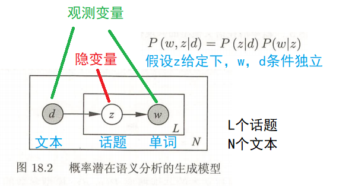
阴影圆表示观测变量，空心圆表示隐变量；箭头表示概率关系；方框表示多次重复，方框内的字母表示重复次数；
文档d是一个观测变量；话题变量z是隐变量(话题的个数是超参数)；单词变量w是一个观测变量；

- **模型**：
单词集合$W = \{w_1,...,w_M\}$；
文本集合$D=\{d_1,...,d_N\}$；
话题集合$Z=\{z_1,...,z_K\}$，K是超参数；
$$P(w,d) =P(d)P(w|d) = P(d)\sum_{z} P(w,z|d)=P(d)\sum _{z}P(z|d)P(w|z)$$
$P(w,z|d) = P(z|d)P(w|z,d) = P(z|d)P(w|z)$即给定z的情况下w和d相互独立$w \perp d |z$
$P(w,d)$是“每个单词-文本对(w,d)”的生成概率
P(d)表示生成文本d的概率,
条件概率分布P(z|d)表示文本d生成话题z的概率,
条件概率分布P(w|z)表示话题z生成单词w 的概率。
生成（成文本-单词共现数据）步骤：
1. 依据概率分布P(d)，从文本集合中随机选取一个文本d，共生成N个文本；针对每个文本，执行下一步操作
1. 在文本d给定条件下，依据条件概率分布P(z|d)，从话题集合中随机选取一个话题z，共生成L个话题，这里L是文本长度（每个话题生成一个单词，所以生成的文本d的长度是L）
1. 在话题z给定条件下，依据概率分布P(w|z)，从单词集合中随机选取一个单词w


文本-单词共现数据(矩阵T)的生成概率为所有单词-文本对（w，d）的生成概率乘积，
$$P(T) = \prod_{(w,d)} P(w,d)^{n(w,d)} \\ T = [n(w_i,d_j)] i=1,2,...,M; j=1,2,...,N$$
$n(w,d)$表示（w，d）出现的次数;
矩阵T的行表示单词，列表示文本，元素表示（w，d）出现的次数，用$n(w,d)$表示；
单词-文本对 出现的总次数为N×L 

> 这里假设文本的长度都是等长的，正常情况是第一个文本的长度是L1,...，第N个文本的长度是LN;
> 正常情况下单词-文本对 出现的总次数为$\sum_{i=1}^N L_i$


书中还讲到了等价的**共现模型（对称模型）**
$$P(w,d)=\sum _{z}P(z)P(d|z)P(w|z)$$
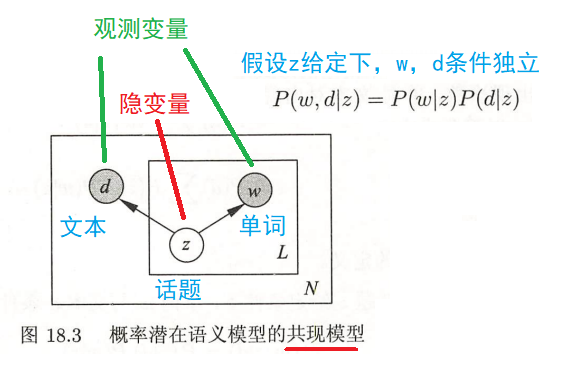

- **策略**：
$$ L =\log P(T) = \log \prod_{i=1}^{M} \prod_{j=1}^{N} {P\left(w_{i}, d_{j}\right)}^{n\left(w_{i}, d_{j}\right) } \\=\sum_{i=1}^{M} \sum_{j=1}^{N} n\left(w_{i}, d_{j}\right) \log P\left(w_{i}, d_{j}\right) \\ =\sum_{i=1}^{M} \sum_{j=1}^{N} n\left(w_{i}, d_{j}\right) \left[\log P(d)+\log \sum_{k=1}^{K} P\left(w_{i} \mid z_{k}\right) P\left(z_{k} \mid d_{j}\right)\right]$$
因为logP(d)对需要求的模型参数无关，我们可以将其省去，于是得到：
$$L =\sum_{i=1}^{M} \sum_{j=1}^{N} n\left(w_{i}, d_{j}\right) \log \left[ \sum_{k=1}^{K} P\left(w_{i} \mid z_{k}\right) P\left(z_{k} \mid d_{j}\right)\right]$$
极大化，得到最优参数
$$\arg \max _{\theta} L(\theta)=\arg \max _{\theta} \sum_{i=1}^{M} \sum_{j=1}^{N} n\left(w_{i}, d_{j}\right) \log \left[ \sum_{k=1}^{K} P\left(w_{i} \mid z_{k}\right) P\left(z_{k} \mid d_{j}\right) \right]$$

- **算法**：
EM：
1. 现在进行E步，计算Q函数
$$\arg \max _{\theta} L(\theta)=\arg \max _{\theta} \sum_{i=1}^{M} \sum_{j=1}^{N} n\left(w_{i}, d_{j}\right) \log \sum_{k=1}^{K} P\left(z_{k} \mid w_{i}, d_{j}\right) \frac{P\left(w_{i} \mid z_{k}\right) P\left(z_{k} \mid d_{j}\right)}{P\left(z_{k} \mid w_{i}, d_{j}\right)}$$
其中log右边为关于z的期望：
$$E_z \left[\frac{P\left(w_{i} \mid z_{k}\right) P\left(z_{k} \mid d_{j}\right)}{P\left(z_{k} \mid w_{i}, d_{j}\right)}\right] = \sum_{k=1}^{K} P\left(z_{k} \mid w_{i}, d_{j}\right) \frac{P\left(w_{i} \mid z_{k}\right) P\left(z_{k} \mid d_{j}\right)}{P\left(z_{k} \mid w_{i}, d_{j}\right)}$$
所以：
$$\arg \max _{\theta} L(\theta)=\arg \max _{\theta} \sum_{i=1}^{M} \sum_{j=1}^{N} n\left(w_{i}, d_{j}\right) \log E_z \left[\frac{P\left(w_{i} \mid z_{k}\right) P\left(z_{k} \mid d_{j}\right)}{P\left(z_{k} \mid w_{i}, d_{j}\right)}\right]$$
根据jensen不等式，我们可以得到：
$$\log E_{z}\left[\frac{P\left(w_{i} \mid z_{k}\right) P\left(z_{k} \mid d_{j}\right)}{P\left(z_{k} \mid w_{i}, d_{j}\right)}\right] \geq E_{z}\left[\log \frac{P\left(w_{i} \mid z_{k}\right) P\left(z_{k} \mid d_{j}\right)}{P\left(z_{k} \mid w_{i}, d_{j}\right)}\right]$$
得到L(θ)的下界：
$$\sum_{i=1}^{M} \sum_{j=1}^{N} n\left(w_{i}, d_{j}\right)  E_z \left[\log \frac{P\left(w_{i} \mid z_{k}\right) P\left(z_{k} \mid d_{j}\right)}{P\left(z_{k} \mid w_{i}, d_{j}\right)}\right] \\ =\sum_{i=1}^{M} \sum_{j=1}^{N} n\left(w_{i}, d_{j}\right) \sum_{k=1}^{K} P\left(z_{k} \mid w_{i}, d_{j}\right)\left[\log P\left(w_{i} \mid z_{k}\right) P\left(z_{k} \mid d_{j}\right)-\log P\left(z_{k} \mid w_{i}, d_{j}\right)\right]$$
最后，我们将K的累加项拆开，可以得到一项 $\sum_{k=1}^{K} P\left(z_{k} \mid w_{i}, d_{j}\right) \log P\left(z_{k} \mid w_{i}, d_{j}\right)$ ，这一项在M步中没有作用，可以省去，于是我们可以得到Q函数为：
$$Q=\sum_{i=1}^{M} \sum_{j=1}^{N} n\left(w_{i}, d_{j}\right) \sum_{k=1}^{K} P\left(z_{k} \mid w_{i}, d_{j}\right) \log \left[P\left(w_{i} \mid z_{k}\right) P\left(z_{k} \mid d_{j}\right)\right]$$
需要优化的参数为 $P\left(z_{k} \mid w_{i}, d_{j}\right)，P\left(w_{i} \mid z_{k}\right)，  P\left(z_{k} \mid d_{j}\right)$ 这三项，在Q步中，第一项是变量，后两项是常量，于是可以由贝叶斯公式获得：
$$P\left(z_{k} \mid w_{i}, d_{j}\right)=\frac{P\left(w_{i} \mid z_{k}\right) P\left(z_{k} \mid d_{j}\right)}{\sum_{k=1}^{K} P\left(w_{i} \mid z_{k}\right) P\left(z_{k} \mid d_{j}\right)}$$

1. M步
在M步中，我们需要优化的是$P\left(w_{i} \mid z_{k}\right)，  P\left(z_{k} \mid d_{j}\right)$ 这两项（两项的乘积代表的完全数据，是未知变量），此时 $P\left(z_{k} \mid w_{i}, d_{j}\right)$为常量（代表不完全数据，是已知变量），极大化Q函数的M步可以使用拉格朗日乘子法来优化两个参数，即：
$$\max Q \\s.t. \quad \begin{array}{l}\sum_{i=1}^{M} P\left(w_{i} \mid z_{k}\right)=1, \quad k=1,2, \cdots, K \\ \sum_{k=1}^{K} P\left(z_{k} \mid d_{j}\right)=1, \quad j=1,2, \cdots, N\end{array}$$
根据上述约束条件构造拉格朗日函数：
$$\Lambda=Q^{\prime}+\sum_{k=1}^{K} \tau_{k}\left(1-\sum_{i=1}^{M} P\left(w_{i} \mid z_{k}\right)\right)+\sum_{j=1}^{N} \rho_{j}\left(1-\sum_{k=1}^{K} P\left(z_{k} \mid d_{j}\right)\right)$$
分别对两个参数$P\left(w_{i} \mid z_{k}\right)，  P\left(z_{k} \mid d_{j}\right)$求偏导，并令偏导数为0：
$$\begin{array}{l}\sum_{j=1}^{N} n\left(w_{i}, d_{j}\right) P\left(z_{k} \mid w_{i}, d_{j}\right)-\tau_{k} P\left(w_{i} \mid z_{k}\right)=0, \quad i=1,2, \cdots, M ; \quad k=1,2, \cdots, K \\ \sum_{i=1}^{M} n\left(w_{i}, d_{j}\right) P\left(z_{k} \mid w_{i}, d_{j}\right)-\rho_{j} P\left(z_{k} \mid d_{j}\right)=0, \quad j=1,2, \cdots, N ; \quad k=1,2, \cdots, K\end{array}$$
求解上面的方程组，就可以得到M步的参数估计：
$$P\left(w_{i} \mid z_{k}\right)=\frac{\sum_{j=1}^{N} n\left(w_{i}, d_{j}\right) P\left(z_{k} \mid w_{i}, d_{j}\right)}{\sum_{m=1}^{M} \sum_{j=1}^{N} n\left(w_{m}, d_{j}\right) P\left(z_{k} \mid w_{m}, d_{j}\right)}$$
$$P\left(z_{k} \mid d_{j}\right)=\frac{\sum_{i=1}^{M} n\left(w_{i}, d_{j}\right) P\left(z_{k} \mid w_{i}, d_{j}\right)}{n\left(d_{j}\right)}$$
最后，在E步和M步间不停迭代，直到得到优化后的两个参数
$n(d_j) = \sum_{i=1}^M n(w_i,d_j)$表示文本$d_j$中的单词个数，$n(w_i,d_j)$表示单词$w_i$在文本$d_j$中出现的次数。

### 参考文献
[18-1] Hofmann T. Probabilistic Latent Semantic analysis. Proceedings of the Fifteenth Conference on Uncertainty in Artificial Intelligence, 1999: 289-296.
[18-2] Hofmann T. [Probabilistic Latent Semantic Indexing](https://arxiv.org/abs/1301.6705). Proceedings of the 22nd Annual International ACM [SIGIR](https://en.jinzhao.wiki/wiki/Special_Interest_Group_on_Information_Retrieval) Conference in Research and Development in [Information Retrieval](https://en.jinzhao.wiki/wiki/Information_retrieval), 1999.
[18-3] Hofmann T. [Unsupervised learning by probabilistic latent semantic analysis](https://link.springer.com/content/pdf/10.1023%2FA%3A1007617005950.pdf). Machine Learning, 2001, 42: 177-196.
[18-4] Ding C, Li T, Peng W. On the equivalence between non-negative matrix factorization and probabilistic latent semantic indexing. Computational Statistics & Data Analysis, 2008, 52(8): 3913-3927.

## 第 19 章 马尔可夫链蒙特卡罗法

**马尔可夫链蒙特卡罗**（[Markov Chain Monte Carlo, MCMC](https://en.jinzhao.wiki/wiki/Markov_chain_Monte_Carlo)）由两个MC组成，即**蒙特卡罗方法**（[Monte Carlo Simulation, MC](https://en.jinzhao.wiki/wiki/Monte_Carlo_method)）和**马尔可夫链**（[Markov Chain, MC](https://en.jinzhao.wiki/wiki/Markov_chain)）。

要弄懂MCMC的原理我们首先得搞清楚蒙特卡罗方法和马尔可夫链的原理。

马尔可夫链在前面的章节有讲到，再结合书中的内容。这里补充下几个知识：
**马尔可夫链的遍历定理**：
书中啰嗦了很多，我的理解是遍历足够多能达到平稳分布的马尔可夫链。并且达到任何一个状态的概率不能为0；（不可约，非周期且正常返）

**可逆马尔可夫链**（reversible Markov chain）：
设有马尔可夫链$X=\{X_0,X_1,...,X_t,...\}$，状态空间S，转移矩阵P，如果有状态分布$\pi = (\pi_1,\pi_2,...)^T$，对任意状态$i,j \in S$，对任意时刻t满足
$$P(X_t=i|X_{t-1}=j)\pi_j = P(X_{t-1}=j|X_t=i)\pi_i  ,\quad i,j =1,2,...$$
或者简写
$$p_{ij}\pi_j = p_{ji}\pi_i ,\quad i,j =1,2,...$$
则称此马尔可夫链为可逆马尔可夫链；简写的等式称为**细致平衡方程**（detailed balance equation），并且满足细致平衡方程的状态分布$\pi$就是该马尔可夫链的平稳分布（并不是所有的马尔可夫链都是可逆的）。
可逆马尔可夫链满足遍历定理。


**采样法**（[Sampling Method](https://en.jinzhao.wiki/wiki/Sampling_(statistics))）也称为蒙特卡罗方法（[Monte Carlo Method, MC](https://en.jinzhao.wiki/wiki/Monte_Carlo_method)）或统计模拟方法（Statistical Simulation  Method）

蒙特卡罗方法诞生于20 世纪 40 年代美国的“曼哈顿计划”，其名字来源于摩纳哥的一个以赌博业闻名的城市蒙特卡罗，象征概率．
蒙特卡罗方法是一种通过随机采样来近似估计一些计算问题**数值解**（Numerical solution与其对应的是闭式解Closed-form solution或解析解Analytical solution）的方法．

最早的蒙特卡罗方法都是为了求解一些不太好求解的求和或者积分问题。比如积分：$\theta = \int_a^b f(x)dx$ 或者估计$\pi$值或圆的面积（积分）。

我们可以通过蒙特卡罗方法来模拟求解近似值。如何模拟呢？

**随机采样**指从给定概率密度函数 𝑝(𝑥) 中抽取出符合其概率分布的样本．

随机采样 采样法的难点是如何进行随机采样，即如何让计算机生成满足概率密度函数 𝑝(𝑥) 的样本．我们知道，计算机可以比较容易地随机生成一个在 [0, 1]区间上均布分布的样本 𝜉．如果要随机生成服从某个非均匀分布的样本，就需要一些间接的采样方法．
如果一个分布的概率密度函数为 𝑝(𝑥)，其累积分布函数 cdf(𝑥) 为连续的严格增函数，且存在逆函数$cdf^{−1}(𝑦), 𝑦 ∈ [0, 1]$，那么我们可以利用**累积分布函数的逆函数**（inverse CDF）来生成服从该随机分布的样本．假设 𝜉 是 [0, 1] 区间上均匀分布的随机变量，则 $cdf^{−1}(\xi)$ 服从概率密度函数为𝑝(𝑥)的分布．但当 𝑝(𝑥) 非常复杂，其累积分布函数的逆函数难以计算，或者不知道 𝑝(𝑥)的精确值，只知道未归一化的分布 ̂𝑝(𝑥)时，就难以直接对𝑝(𝑥)进行采样，往往需要使用一些间接的采样策略，比如**拒绝采样、重要性采样、马尔可夫链蒙特卡罗采样**等．这些方法一般是先根据一个比较容易采样的分布进行采样，然后通过一些策略来间接得到符合𝑝(𝑥)分布的样本．

> rejection sampling, inverse CDF, Box-Muller,  Ziggurat algorithm

**拒绝采样**（Rejection Sampling）是一种间接采样方法，也称为接受-拒绝采样（Acceptance-Rejection Sampling）．
假设原始分布𝑝(𝑥)难以直接采样，我们可以引入一个容易采样的分布𝑞(𝑥)，一般称为提议分布（Proposal Distribution），然后以某个标准来拒绝一部分的样本使得最终采集的样本服从分布 𝑝(𝑥)。我们需要构建一个提议分布 𝑞(𝑥) 和一个常数 𝑘，使得 𝑘𝑞(𝑥) 可以覆盖函数𝑝(𝑥)，即𝑘𝑞(𝑥) ≥ 𝑝(𝑥),
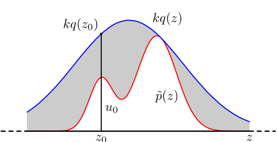
对于每次抽取的样本 $\^{x}$ 计算接受概率（Acceptance Probability）：$\alpha(\^{x}) = \frac{p(\^{x})}{kq(\^{x})}$，并以概率$\alpha(\^{x})$)来接受样本 $\^{x}$

拒绝采样的采样过程
```
输入: 提议分布𝑞(𝑥)，常数𝑘，样本集合𝒱 = ∅;
1 repeat
2   根据𝑞(𝑥)随机生成一个样本 ;̂𝑥
3   计算接受概率𝛼( ̂𝑥);
4   从(0, 1)的均匀分布中随机生成一个值𝑧;
5   if 𝑧 ≤ 𝛼( ̂𝑥) then // 以𝛼(𝑥)̂ 的概率接受𝒙̂
6       𝒱 = 𝒱 ∪ { ̂𝑥};
7   end
8 until 获得 𝑁 个样本(|𝒱| = 𝑁);
输出: 样本集合𝒱
```

判断一个拒绝采样方法的好坏就是看其采样效率，即总体的接受率．如果函数𝑘𝑞(𝑥)远大于原始分布函数 ̂𝑝(𝑥)，拒绝率会比较高，采样效率会非常不理想．但要找到一个和 ̂𝑝(𝑥)比较接近的提议分布往往比较困难．特别是在高维空间中，其采样率会非常低，导致很难应用到实际问题中．

**重要性采样**（Importance sampling）
如果采样的目的是计算分布𝑝(𝑥)下函数𝑓(𝑥)的期望，那么实际上抽取的样本不需要严格服从分布 𝑝(𝑥)．也可以通过另一个分布，即提议分布 𝑞(𝑥)，直接采样并估计𝔼𝑝[𝑓(𝑥)]．
函数𝑓(𝑥)在分布𝑝(𝑥)下的期望可以写为
$$E_p[f(x)] = \int_x f(x)p(x)dx = \int_x f(x)\frac{p(x)}{q(x)}q(x)dx = \int_x f(x)w(x)q(x)dx = E_q[f(x)w(x)]$$
其中𝑤(𝑥)称为重要性权重．

重要性采样（Importance Sampling）是通过引入重要性权重，将分布 𝑝(𝑥)下𝑓(𝑥)的期望变为在分布𝑞(𝑥)下𝑓(𝑥)𝑤(𝑥)的期望，从而可以近似为
$$E_p[f(x)] = E_q[f(x)w(x)] =\frac{1}{N} \sum_{i=1}^N f(x_i)w(x_i) =\frac{1}{N} \sum_{i=1}^N f(x_i)\frac{p(x_i)}{q(x_i)}$$
其中$\{x_1,...,x_N\}$是独立从$q(x)$中随机采样来的（p(x)是已知的，只是不好采样，但是能计算）。

**马尔可夫链蒙特卡罗方法**
在高维空间中，拒绝采样和重要性采样的效率随空间维数的增加而指数降低．马尔可夫链蒙特卡罗（Markov Chain Monte Carlo，MCMC）方法是一种更好的采样方法，可以很容易地对高维变量进行采样．

假设多元随机变量$x$,满足$x \in \mathcal{X}$,其概率密度函数为$p(x)$；$f(x)$为定义在$x \in \mathcal{X}$上的函数，目标是获得概率分布$p(x)$的样本集合以及求函数$f(x)$的数学期望$E_{p(x)}[f(x)]$。

应用马尔可夫链蒙特卡罗法解决这个问题的**基本想法**是：
在随机变量$x$的状态空间$\mathcal{S}$上定义一个满足遍历定理的马尔可夫链$X=\{X_0,X_1,...,X_t,...\}$,使其平稳分布就是抽样的的目标分布$p(x)$（设计一个随机矩阵（连续随机变量就是转移核函数），使其平稳分布等于目标分布）。然后在这个马尔可夫链上进行随机游走，每个时刻得到一个样本。根据遍历定理，当时间趋于无穷时，样本的分布趋近平稳分布，样本的函数均值趋近函数的数学期望。所以，当时间足够长时（时刻大于某个正整数m），在之后的时间（时刻小于等于某个正整数n,n>m）里随机游走得到的样本集合$\left\{x_{m+1}, x_{m+2}, \cdots, x_{n}\right\}$就是目标概率分布的抽样结果，得到的函数均值就是要计算的数学期望值：
$$\hat{E} f=\frac{1}{n-m} \sum_{i=m+1}^{n} f\left(x_{i}\right)$$
从时刻0到时刻m为止的这段时间称为燃烧期（Burn-in Period）。燃烧期的样本也是要被丢弃的。

**基本步骤**
1. 首先，在随机变量$x$的状态空间$\mathcal{S}$上构造一个满足遍历定理的马尔可夫链，使其平稳分布为目标分布$p(x)$;
1. 从状态空间的某一点$x_0$出发，用构造的马尔可夫链进行随机游走，产生样本序列$x_0,x_1,...,x_t,...$。
1. 应用马尔可夫链的遍历原理，确定正整数m和n（m < n），得到样本集合$\{x_{m+1},x_{m+2},...,x_{n}\}$，求得函数$f(x)$的均值（遍历均值）
$$\hat{E} f=\frac{1}{n-m} \sum_{i=m+1}^{n} f\left(x_{i}\right)$$

这里有几个**重要问题**
1. 如何第一马尔可夫链，保证马尔可夫链蒙特卡罗法的条件成立。
1. 如何确定收敛步数$m$，保证样本抽样的无偏性。
1. 如何确定迭代步数$n$，保证遍历均值计算的精度。

**MCMC采样**
由于一般情况下，目标平稳分布 $\pi(x)$ 和某一个马尔科夫链状态转移矩阵 $Q$ 不满足细致平稳条件，即：

$$\pi(i)Q(i,j)\neq\pi(j)Q(j,i)$$

**这些记号表达同一个意思**： $Q(i,j)\Leftrightarrow Q(j|i)\Leftrightarrow Q(i\rightarrow j)$ （状态转移分布或提议分布）

我们引入一个 $\alpha(i,j)$ ,使上式可以取等号。

$$\pi(i)Q(i,j)\alpha(i,j)=\pi(j)Q(j,i)\alpha(j,i)$$

怎样才能成立呢，其实很简单，按照对称性：

$$\alpha(i,j)=\pi(j)Q(j,i); \pi(i)Q(i,j)=\alpha(j,i)$$

然后我们就可以得到了分布 $\pi(x)$ 对让马尔科夫链状态转移矩阵 $P(i,j)=Q(i,j)\alpha(i,j)$

其中 $\alpha(i,j)$ 一般称之为接受率，取值在 $[0,1]$ 之间，可以理解为一个概率值。这很像接受-拒绝采样，那里是以一个常用分布通过一定的接受-拒绝概率得到一个非常见分布， 这里是以一个常见的马尔科夫链状态转移矩阵 $Q$ 通过一定的接受-拒绝概率得到目标转移矩阵 $P$ ,两者的解决问题思路是类似的。

MCMC采样算法如下：
1. 输入任意给定的马尔科夫链状态转移矩阵 $Q$ ，目标平稳分布 $\pi(x)$ ，设定状态转移次数阈值 $n_1$ ，需要的样本数 $n_2$;
1. 从任意简单概率分布得到初始状态值 $x_0$ ；
1. for $t=0 ~in ~n_{1}+n_{2}-1$
    1. 从条件概率分布 $Q(x|x_{t})$ 得到样本值 $x_{*}$
    1. 从均匀分布中采样 $u\sim uniform[0,1]$
    1. 如果 $u<\alpha(x_{t},x_{*})=\pi(x_{*})Q(x_{*},x_{t})$ ，则接受 $x_{t}\rightarrow x_{*}$ ，即 $x_{t+1}= x_{*}$
    1. 否则不接受转移， 即$x_{t+1}= x_{t}$

上述过程中 $p(x),q(x|y)$ 说的都是离散的情形，事实上即便这两个分布是连续的，以上算法仍然是有效，于是就得到更一般的连续概率分布 $p(x)$ 的采样算法，而 $q(x|y)$ 就是任意一个连续二元概率分布对应的条件分布。

但是这个采样算法还是比较难在实际中应用，因为在第三步中，由于 $\alpha(x_{t},x_{*})$ 可能非常的小，比如0.1，导致我们大部分的采样值都被拒绝转移，采样效率很低。有可能我们采样了上百万次马尔可夫链还没有收敛，也就是上面这个 $n_1$ 要非常非常的大，这让人难以接受，怎么办呢？这时就轮到我们的M-H采样出场了。

**Metropolis-Hastings算法**：
M-H采样是Metropolis-Hastings采样的简称，这个算法首先由Metropolis提出，被Hastings改进，因此被称之为Metropolis-Hastings采样或M-H采样。

> 书中的介绍更详细，这里简单介绍原理

我们回到MCMC采样的细致平稳条件：$\pi(i)Q(i,j)\alpha(i,j) = \pi(j)Q(j,i)\alpha(j,i)$
我们采样效率低的原因是$\alpha(i,j)$太小了，比如为0.1，而$\alpha(j,i)$为0.2。即：$\pi(i)Q(i,j)\times 0.1 = \pi(j)Q(j,i)\times 0.2$
这时我们可以看到，如果两边同时扩大五倍，接受率提高到了0.5，但是细致平稳条件却仍然是满足的，即：$\pi(i)Q(i,j)\times 0.5 = \pi(j)Q(j,i)\times 1$
这样我们的接受率可以做如下改进，即：$\alpha(i,j) = min\{ \frac{\pi(j)Q(j,i)}{\pi(i)Q(i,j)},1\}$

所以修正转移概率的$\hat{Q}(i,j) = Q(i,j)\alpha(i,j)$，并且平稳分布就是$\pi(x)$

**Metropolis算法**中的提议分布是对称的(很多时候，我们选择对称的马尔科夫链状态转移矩阵$Q$)，即$Q(i,j)=Q(j,i)$，所以接受概率$\alpha(i,j) = min\{ \frac{\pi(j)}{\pi(i)},1\}$

M-H采样算法过程如下：
1. 输入我们任意选定的马尔科夫链状态转移矩阵$Q$，平稳分布$\pi(x)$，设定状态转移次数阈值$n_1$，需要的样本个数$n_2$
1. 从任意简单概率分布采样得到初始状态值$x_0$
1. for $t=0 ~to ~n_1+n_2−1$: 
    1. 从条件概率分布$Q(x|x_t)$中采样得到样本$x_∗$
    1. 从均匀分布采样$u∼uniform[0,1]$
    1. 如果$u < \alpha(x_t,x_{*}) = min\{ \frac{\pi(j)Q(j,i)}{\pi(i)Q(i,j)},1\}$, 则接受转移$x_t \to x_{*}$，即$x_{t+1}=x_∗$
    1. 否则不接受转移，即$x_{t+1}=x_t$


样本集$(x_{n_1}, x_{n_1+1},..., x_{n_1+n_2-1})$即为我们需要的平稳分布对应的样本集。


M-H采样完整解决了使用蒙特卡罗方法需要的任意概率分布样本集的问题，因此在实际生产环境得到了广泛的应用。
但是在大数据时代，**M-H采样面临着两大难题**：
1. 我们的数据特征非常的多，M-H采样由于接受率计算式$\frac{\pi(j)Q(j,i)}{\pi(i)Q(i,j)}$的存在，在高维时需要的计算时间非常的可观，算法效率很低。同时$\alpha(i,j)$一般小于1，有时候辛苦计算出来却被拒绝了。能不能做到不拒绝转移呢？
1. 由于特征维度大，很多时候我们甚至很难求出目标的各特征维度联合分布，但是可以方便求出各个特征之间的条件概率分布。这时候我们能不能只有各维度之间条件概率分布的情况下方便的采样呢？

**吉布斯采样**（Gibbs Sampling）是一种有效地对高维空间中的分布进行采样的 MCMC 方法，可以看作 Metropolis-Hastings 算法的特例．吉布斯采样使用全条件概率（Full Conditional Probability）作为提议分布来依次对每个维度进行采样，并设置接受率为$\alpha = 1$．

前面讲到了细致平稳条件：如果非周期马尔科夫链的状态转移矩阵$P$和概率分布$\pi(x)$对于所有的$i,j$满足：$\pi(i)P(i,j) = \pi(j)P(j,i)$，则称概率分布$\pi(x)$是状态转移矩阵$P$的平稳分布。

在M-H采样中我们通过引入接受率使细致平稳条件满足。现在我们换一个思路。
从二维的数据分布开始，假设$\pi(x_1,x_2)$是一个二维联合数据分布，观察第一个特征维度相同的两个点$A(x_1^{(1)},x_2^{(1)})$和$B(x_1^{(1)},x_2^{(2)})$，容易发现下面两式成立(就是联合概率公式，仔细看，很简单)：
$$\pi(x_1^{(1)},x_2^{(1)}) \pi(x_2^{(2)} | x_1^{(1)}) = \pi(x_1^{(1)})\pi(x_2^{(1)}|x_1^{(1)}) \pi(x_2^{(2)} | x_1^{(1)})$$
$$\pi(x_1^{(1)},x_2^{(2)}) \pi(x_2^{(1)} | x_1^{(1)}) = \pi(x_1^{(1)}) \pi(x_2^{(2)} | x_1^{(1)})\pi(x_2^{(1)}|x_1^{(1)})$$
由于两式的右边相等，因此我们有：
$$\pi(x_1^{(1)},x_2^{(1)}) \pi(x_2^{(2)} | x_1^{(1)})  = \pi(x_1^{(1)},x_2^{(2)}) \pi(x_2^{(1)} | x_1^{(1)})$$
也就是：
$$\pi(A) \pi(x_2^{(2)} | x_1^{(1)})  = \pi(B) \pi(x_2^{(1)} | x_1^{(1)})$$
观察上式再观察细致平稳条件的公式，我们发现在$x_1 = x_1^{(1)}$这条直线上，如果用条件概率分布$\pi(x_2| x_1^{(1)})$作为马尔科夫链的状态转移概率，则任意两个点之间的转移满足细致平稳条件！这真是一个开心的发现，同样的道理，在在$x_2 = x_2^{(1)}$这条直线上，如果用条件概率分布$\pi(x_1| x_2^{(1)})$作为马尔科夫链的状态转移概率，则任意两个点之间的转移也满足细致平稳条件。那是因为假如有一点$C(x_1^{(2)},x_2^{(1)})$,我们可以得到：
$$\pi(A) \pi(x_1^{(2)} | x_2^{(1)})  = \pi(C) \pi(x_1^{(1)} | x_2^{(1)})$$
基于上面的发现，我们可以这样构造分布$\pi(x_1,x_2)$的马尔可夫链对应的状态转移矩阵$P$：
$$P(A \to B) = \pi(x_2^{(B)}|x_1^{(1)})\;\; if\; x_1^{(A)} = x_1^{(B)} =x_1^{(1)} \\ P(A \to C) = \pi(x_1^{(C)}|x_2^{(1)})\;\; if\; x_2^{(A)} = x_2^{(C)} =x_2^{(1)} \\ P(A \to D) = 0\;\; else$$
于是这个二维空间上的马氏链将收敛到平稳分布$\pi(x,y)$

二维Gibbs采样，这个采样需要两个维度之间的条件概率。具体过程如下：
1. 输入平稳分布$\pi(x_1,x_2)$，设定状态转移次数阈值$n_1$，需要的样本个数$n_2$
1. 随机初始化初始状态值$x_1^{(0)}$和$x_2^{(0)}$
1. for $t=0 ~to ~n_1 +n_2-1$: 
    1. 从条件概率分布$P(x_2|x_1^{(t)})$中采样得到样本$x_2^{t+1}$
    1. 从条件概率分布$P(x_1|x_2^{(t+1)})$中采样得到样本$x_1^{t+1}$

样本集$\{(x_1^{(n_1)}, x_2^{(n_1)}), (x_1^{(n_1+1)}, x_2^{(n_1+1)}), ...,  (x_1^{(n_1+n_2-1)}, x_2^{(n_1+n_2-1)})\}$即为我们需要的平稳分布对应的样本集。


整个采样过程中，我们通过轮换坐标轴，采样的过程为：
$$(x_1^{(1)}, x_2^{(1)}) \to  (x_1^{(1)}, x_2^{(2)}) \to (x_1^{(2)}, x_2^{(2)}) \to ... \to (x_1^{(n_1+n_2-1)}, x_2^{(n_1+n_2-1)})$$

马氏链收敛后，最终得到的样本就是 $p(x_1,x_2)$的样本，而收敛之前的阶段称为 burn-in period。额外说明一下，我们看到教科书上的 Gibbs Sampling 算法大都是坐标轴轮换采样的，但是这其实是不强制要求的。最一般的情形可以是，在 $t$ 时刻，可以在 $x_1$ 轴和 $x_2$ 轴之间随机的选一个坐标轴，然后按条件概率做转移，马氏链也是一样收敛的。轮换两个坐标轴只是一种方便的形式。

上面的这个算法推广到多维的时候也是成立的。比如一个$n$维的概率分布$\pi(x_1,x_2,...x_n)$，我们可以通过在$n$个坐标轴上轮换采样，来得到新的样本。对于轮换到的任意一个坐标轴$x_i$上的转移，马尔科夫链的状态转移概率为$P(x_i|x_1,x_2,...,x_{i-1},x_{i+1},...,x_n)$，即固定$n−1$个坐标轴，在某一个坐标轴上移动。

多维Gibbs采样过程如下：
1. 输入平稳分布$\pi(x_1,x_2，...,x_n)$或者对应的所有特征的条件概率分布，设定状态转移次数阈值$n_1$，需要的样本个数$n_2$
1. 随机初始化初始状态值$(x_1^{(0)},x_2^{(0)},...,x_n^{(0)})$
1. for $t=0 ~to ~n_1 +n_2-1$: 
    1. 从条件概率分布$P(x_1|x_2^{(t)}, x_3^{(t)},...,x_n^{(t)})$中采样得到样本$x_1^{t+1}$
    1. 从条件概率分布$P(x_2|x_1^{(t+1)}, x_3^{(t)}, x_4^{(t)},...,x_n^{(t)})$中采样得到样本$x_2^{t+1}$
    1. ...
    1. 从条件概率分布$P(x_j|x_1^{(t+1)}, x_2^{(t+1)},..., x_{j-1}^{(t+1)},x_{j+1}^{(t)}...,x_n^{(t)})$中采样得到样本$x_j^{t+1}$
    1. ...
    1. 从条件概率分布$P(x_n|x_1^{(t+1)}, x_2^{(t+1)},...,x_{n-1}^{(t+1)})$中采样得到样本$x_n^{t+1}$

样本集$\{(x_1^{(n_1)}, x_2^{(n_1)},...,  x_n^{(n_1)}), ...,  (x_1^{(n_1+n_2-1)}, x_2^{(n_1+n_2-1)},...,x_n^{(n_1+n_2-1)})\}$即为我们需要的平稳分布对应的样本集。

整个采样过程和Lasso回归的[坐标轴下降法算法](https://www.cnblogs.com/pinard/p/6018889.html)非常类似，只不过Lasso回归是固定$n−1$个特征，对某一个特征求极值。而Gibbs采样是固定$n−1$个特征在某一个特征采样。

- **模型**：
- **策略**：
- **算法**：
### 参考文章
[马尔可夫链蒙特卡罗算法（MCMC）](https://zhuanlan.zhihu.com/p/37121528)
[MCMC(三)MCMC采样和M-H采样](https://www.cnblogs.com/pinard/p/6638955.html)
[神经网络与深度学习 - 马尔可夫链蒙特卡罗方法 296 页](https://github.com/nndl/nndl.github.io/blob/master/nndl-book.pdf)

### 参考文献
[19-1] Serfozo R. [Basics of applied stochastic processes](http://www.stat.yale.edu/~jtc5/251/readings/Basics%20of%20Applied%20Stochastic%20Processes_Serfozo.pdf). Springer, 2009.
[19-2] Metropolis N, Rosenbluth A W, Rosenbluth M N, et al. Equation of state calculations by fast computing machines. The Journal of Chemical Physics, 1953,21(6):1087-1092. 
[19-3] Geman S, Geman D. Stochastic relaxation, Gibbs distribution and the Bayesian restoration of images. IEEE Transactions on Pattern Analysis and Machine Intelligence, 1984,6:721-741
[19-4] Bishop C M. Pattern recognition and machine learning. Springer, 2006.
[19-5] Gilks W R, Richardson S, Spiegelhalter, DJ. Introducing Markov chain Monte Carlo. Markov Chain Monte Carlo in Practice, 1996.
[19-6] Andrieu C, De Freitas N, Doucet A, et al. An introduction to MCMC for machine learning. Machine Learning, 2003,50(1-2): 5-43.
[19-7] Hoff P. [A first course in Bayesian statistical methods](https://esl.hohoweiya.xyz/references/A_First_Course_in_Bayesian_Statistical_Methods.pdf). Springer, 2009.
[19-8] 茆诗松，王静龙，濮晓龙. 高等数理统计. 北京：高等教育出版社， 1998.


## 第 20 章 潜在狄利克雷分配
> 生成概率模型

潜在狄利克雷分配（[latent Dirichlet allocation，LDA](https://en.jinzhao.wiki/wiki/Latent_Dirichlet_allocation)），作为基于 贝叶斯学习的话题模型，是潜在语义分析、概率潜在语义分析的扩展，于2002年由Blei等提出。LDA在文本数据挖掘、图像处理、生物信息处理等领域被广泛使用。
书中的模型以及参数（推导参考[Latent Dirichlet allocation](https://www.jmlr.org/papers/volume3/blei03a/blei03a.pdf)以及书中的推导）


sklearn中的模型以及参数（下面的介绍以此图为准）


> 上图来源以及解释：“[Stochastic Variational Inference](http://www.columbia.edu/~jwp2128/Papers/HoffmanBleiWangPaisley2013.pdf)” M. Hoffman, D. Blei, C. Wang, J. Paisley, 2013

> 在介绍概率图时有讲过各种图形代表的含义，这里的图更全面也很标准：实心圆点代表超参数；箭头代表因果关系；方框代表重复；方框右下角的字母代表重复次数；无阴影圆圈代表隐变量；阴影圆圈代表观测变量；

假设每个文本由话题的一个多项分布表示，每个话题由单词的一个多项分布表示；
特别假设文本的话题分布的先验分布是狄利克雷分布，话题的单词分布的先验分布也是狄利克雷分布。


$D$个文档组成的语料库（corpus），每个文档有$N_d$个单词；
假设整个语料库有$K$个话题（sklearn参数n_components）；方框代表重复抽样；
$w_{d,n}$表示第$d$个文档中的第$n$个单词（注意整个集合（圆圈）是一个概率分布）；
$N_d$表示第$d$个文档中的单词个数；
$Z_{d,n}$表示第$d$个文档中的第$n$个话题；
$\theta_d$表示第$d$个文档的话题分布（document topic distribution）参数；
$\beta_k$表示第$k$个话题的单词分布（topic word distribution）参数；
$\eta$（sklearn参数topic_word_prior）
$\alpha$（sklearn参数doc_topic_prior）

$${\displaystyle {\begin{aligned}{\boldsymbol {\beta }}_{k=1\dots K}&\sim \operatorname {Dirichlet} _{V}({\boldsymbol {\eta }})\\{\boldsymbol {\theta }}_{d=1\dots D}&\sim \operatorname {Dirichlet} _{K}({\boldsymbol {\alpha }})\\z_{d=1\dots D,n=1\dots N_{d}}&\sim \operatorname {Categorical} _{K}({\boldsymbol {\theta }}_{d})\\w_{d=1\dots D,n=1\dots N_{d}}&\sim \operatorname {Categorical} _{V}({\boldsymbol {\beta }}_{z_{dn}})\end{aligned}}}$$

其中$V$单词总数

每个doc的每个word，都是通过一定概率选择了某个topic并从这个topic中以一定概率选择了某个word。
具体生成（doc）过程：
1. 根据超参数$\eta, K$生成$K$个topic的word分布的参数$\beta_k$
$\beta_k ∼ Dir(\eta) \text{ for } k \in \{1,...,K\}$
1. For each doc $d \in \{1,...,D\}$
    ---$\theta_d ∼ Dir(\alpha)$ 每个doc的topic分布
    ---For each word $n \in \{1,...,N_d\}$
    ------$Z_{d,n} ∼ Mult(\theta_d)$ 确定一个topic
    ------$w_{d,n} ∼ Mult(\beta_{Z_{d,n}})$ 根据topic生成word($Z_{d,n} \in \{1,...,K\}$)


Var| Type |Conditional|Param|Relevant Expectations
---|---|---|---|---
$Z_{d,n}$|Multinomial|$\log \theta_{dk} + \log \beta_{k,w_{d,n}}$|$\phi_{dn}$|$E[Z^k_{dn}]=\phi_{dn}^k$
$\theta_d$|Dirichlet|$\alpha + \sum_{n=1}^{N_d} Z_{dn}$|$\gamma_d$|$E[\log \theta_{dk}]=\Psi(\gamma_{dk}) -\sum_{j=1}^K \Psi(\gamma_{dj})$
$\beta_k$|Dirichlet|$\eta + \sum_{d=1}^D\sum_{n=1}^{N_d} Z_{dn}^k w_{dn}$|$\lambda_k$|$$E[\log \beta_{kv}]=\Psi(\lambda_{kv}) -\sum_{y=1}^V \Psi(\lambda_{ky})$


- **模型**：
后验分布posterior distribution：
$$p(z, \theta, \beta |w, \alpha, \eta) =  \frac{p(z, \theta, \beta, w|\alpha, \eta)}{p(w|\alpha, \eta)}$$
已知$w, \alpha, \eta$，求$z, \theta, \beta$
- **策略**：
假设三个隐变量$(z, \theta, \beta)$分别由独立分布$(\phi,\gamma,\lambda)$形成，则联合的变分分布为$q(z, \theta, \beta |\phi,\gamma,\lambda)$，变分推断的目的就是用$q(z, \theta, \beta |\phi,\gamma,\lambda)$来近似$p(z, \theta, \beta |w, \alpha, \eta)$
$$(\phi^*,\gamma^*,\lambda^*) = \argmin_{\phi,\gamma,\lambda} KL(q\|p)$$
直接求解不好求，我们来看下证据（数据）
$$\log p(w|\alpha, \eta) = \log p(z, \theta, \beta, w|\alpha, \eta) - \log p(z, \theta, \beta |w, \alpha, \eta) \\= \log \frac{p(z, \theta, \beta, w|\alpha, \eta)}{q(z, \theta, \beta |\phi,\gamma,\lambda)}  - \log \frac{ p(z, \theta, \beta |w, \alpha, \eta)}{q(z, \theta, \beta |\phi,\gamma,\lambda)}$$
等式两边同时对$q(z, \theta, \beta |\phi,\gamma,\lambda)$求期望
$$LHS = E_q[\log p(w|\alpha, \eta)] = \int_{z, \theta, \beta} q(z, \theta, \beta |\phi,\gamma,\lambda) \log p(w|\alpha, \eta) dz d\theta d\beta = \log p(w|\alpha, \eta)$$
$$RHS = E_q[\log \frac{p(z, \theta, \beta, w|\alpha, \eta)}{q(z, \theta, \beta |\phi,\gamma,\lambda)}  - \log \frac{ p(z, \theta, \beta |w, \alpha, \eta)}{q(z, \theta, \beta |\phi,\gamma,\lambda)}] \\= \int_{z, \theta, \beta} q(z, \theta, \beta |\phi,\gamma,\lambda) \log \frac{p(z, \theta, \beta, w|\alpha, \eta)}{q(z, \theta, \beta |\phi,\gamma,\lambda)}dz d\theta d\beta - \int_{z, \theta, \beta} q(z, \theta, \beta |\phi,\gamma,\lambda) \log \frac{ p(z, \theta, \beta |w, \alpha, \eta)}{q(z, \theta, \beta |\phi,\gamma,\lambda)} dz d\theta d\beta \\= \int_{z, \theta, \beta} q(z, \theta, \beta |\phi,\gamma,\lambda) \log \frac{p(z, \theta, \beta, w|\alpha, \eta)}{q(z, \theta, \beta |\phi,\gamma,\lambda)}dz d\theta d\beta + KL(q\|p)$$
令
$$ELBO = \int_{z, \theta, \beta} q(z, \theta, \beta |\phi,\gamma,\lambda) \log \frac{p(z, \theta, \beta, w|\alpha, \eta)}{q(z, \theta, \beta |\phi,\gamma,\lambda)}dz d\theta d\beta \\=   E_{q}[\log\:p(w,z,\theta,\beta|\alpha,\eta)] - E_{q}[\log\:q(z, \theta, \beta)]$$

$$\log\: P(w | \alpha, \eta) \geq L(w,\phi,\gamma,\lambda) \overset{\triangle}{=}
  E_{q}[\log\:p(w,z,\theta,\beta|\alpha,\eta)] - E_{q}[\log\:q(z, \theta, \beta)]$$
我们希望最大证据，而KL最小，所以最终是：
$$\max ELBO$$
接着就用EM算法
- **算法**：
Gibbs采样和变分EM算法

### 参考文章
[spark-ml LDA](/BigData/spark-ml-source-analysis/聚类/LDA/lda.md)

[徐亦达机器学习：Variational Inference for LDA 用变分推断做LDA【2015年版-全集】](https://www.bilibili.com/video/BV1pp411d7US)

[主题模型-潜在狄利克雷分配-Latent Dirichlet Allocation(LDA)](https://www.bilibili.com/video/BV1t54y127U8)


### 附加知识
#### Dirichlet Process 狄利克雷过程
[徐亦达机器学习：Dirichlet Process 狄利克雷过程【2015年版-全集】](https://www.bilibili.com/video/BV1Tp411R7Sf)

#### 指数族分布
参考：[概率分布](../图解数学/概率分布.md)

**狄利克雷分布**（[Dirichlet distribution](https://en.jinzhao.wiki/wiki/Dirichlet_distribution)）

**单纯形**（[Simplex](https://en.jinzhao.wiki/wiki/Simplex)）

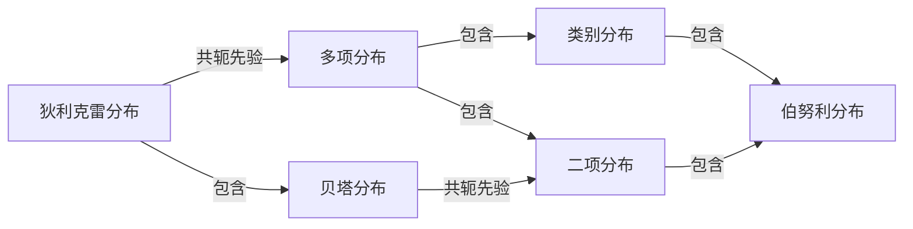

前面讲贝叶斯估计时有提到**共轭先验**（[Conjugate prior](https://en.jinzhao.wiki/wiki/Conjugate_prior)）
如果先验分布 prior 和后验分布 posterior 属于同一分布簇，则 prior 称为 likehood 的共轭先验。

$$\underbrace{p(\theta|data)}_{\text{后验分布posterior distribution}} = \frac{\overbrace{p(data|\theta)}^{\text{似然(数据)likelihood }}\overbrace{p(\theta)}^{\text{ 先验分布prior distribution}}}{\underbrace{p(data)}_{\text{证据evidence}}}$$

常见的共轭先验：
- likehood 为高斯分布，prior 为高斯分布，则 posterior 也为高斯分布。
- likehood 为伯努利分布（二项式分布），prior 为 beta 分布，则 posterior 也为 beta 分布。
- likehood 为多项式分布，prior 为 Dirichlet 分布（beta 分布的一个扩展），则 posterior 也为 Dirichlet（狄利克雷）分布。beta 分布可以看作是 dirichlet 分布的特殊情况。

### 参考文献
[20-1] Blei D M, Ng A Y, Jordan M I. Latent Dirichlet allocation. In: Advances in Neural Information Processing Systems 14. MIT Press, 2002.
[20-2] Blei D M, Ng A Y, Jordan M I. [Latent Dirichlet allocation](https://www.jmlr.org/papers/volume3/blei03a/blei03a.pdf). Journal of Machine Learning Research, 2003, 3:933-1022.
[20-3] Griffiths T L, Steyvers M. Finding scientific topics. Proceedings of the National Academy of Science, 2004, 101:5288-5235.
[20-4] Steyvers M, Griffiths T. Probabilistic topic models. In: Landauer T, McNamara D, Dennis S, et al. (eds.) Handbook of Latent Semantic Analysis, Psychology Press, 2014.
[20-5] Gregor Heinrich. Parameter estimation for text analysis. Techniacl note, 2004.
[20-6] Blei D M, Kucukelbir A, McAuliffe J D. Variational inference: a review for statisticians. Journal of the American Statistical Association, 2017, 112(518).
[20-7] Newman D, Smyth P, Welling M, Asuncion A U. Distributed inference for latent Dirichlet allocation. In: Advances in Neural Information Processing Systems, 2008: 1081-1088
[20-8] Porteous I, Newman D, Ihler A, et al. Fast collapsed Gibbs sampling for latent Dirichlet allocation. Proceedings of the 14th ACM SIGKDD International Conference on Knowledge Discovery and Data Mining, 2008: 569-577.
[20-9] Hoffiman M, Bach F R, Blei D M. [Online learning for latent Dirichlet allocation](https://papers.nips.cc/paper/2010/file/71f6278d140af599e06ad9bf1ba03cb0-Paper.pdf). In: Advances in Neural Information Processing Systems, 2010:856-864.

## 第 21 章 PageRank算法
[PageRank](https://en.jinzhao.wiki/wiki/PageRank)是衡量网站页面重要性的一种方式。PageRank 的工作原理是计算页面链接的数量和质量，以确定对网站重要性的粗略估计。
目前，PageRank 并不是 Google 用于对搜索结果进行排序的唯一算法，但它是该公司使用的第一个算法，并且是最著名的算法。

PageRank 是一种链接分析算法，它为超链接文档集（例如万维网）的每个元素分配数字权重，目的是“衡量”其在集合中的相对重要性。该算法可以应用于具有相互引用和引用的任何实体集合。它分配给任何给定元素$E$的数字权重称为$E$的PageRank，表示为 ${\displaystyle PR(E).}$。

一个状态转移矩阵的平稳分布就对应各个元素的PageRank

- **模型**：
$$MR = R$$
含有n个节点的有向图是强连通且非周期的，在其基础上定义随机游走模型（即一阶马尔可夫链具有平稳分布）；
$M=[m_{ij}]_{n \times n}$ 是马尔可夫链的状态转移矩阵，其中的元素 $m_{ij}$表示节点$j$跳到节点$i$的概率；$R$是平稳分布向量，称为这个有向图的PageRank
- **策略**：
$$\lim_{t \to \infty} M^tR_0 = R$$
- **算法**：
迭代，幂法，代数算法

### 参考文献
[21-1] Page L, Brin S, Motwani R, et al. The PageRank citation ranking: bringing order to the Web. Stanford University, 1999.
[21-2] Rajaraman A, Ullman J D. Mining of massive datasets. Cambridge University Press, 2014.
[21-3] Liu B. Web data mining: exploring Hyperlinks, contents, and usage data. Springer Science & Business Media, 2007.
[21-4] Serdozo R. Basics of applied stochastic processes. Springer, 2009.
[21-5] Kleinberg J M. Authoritative sources in a hyperlinked environment. Journal of the ACM(JACM), 1999,46(5):604-632.
[21-6] Liu Y, Gao B, Liu T Y, et al. BrowseRank: letting Web users vote for page importance. Proceedings of the 31st SIGIR Conference, 2008:451-458 
[21-7] Jeh G, Widom J. Scaling Personalized Web search. Proceedings of the 12th WWW Conference, 2003: 271-279.
[21-8] Haveliwala T H. Topic-sensitive PageRank. Proceedings of the 11th WWW Conference, 2002: 517-526.
[21-9] Gyöngyi Z, Garcia-Molina H, Pedersen J. Combating Web spam with TrustRank. Proceedings of VLDB Conference, 2004:576-587.

## 第 22 章 无监督学习方法总结

无监督学习方法之间的关系


无监督学习方法的特点
.|方法|模型|策略|算法
---|---|---|---|---
聚类| 层次聚类|聚类树|类内样本距离最小|启发式算法
聚类|k均值聚类|k中心聚类|样本与类中心距离最小|迭代算法
聚类|高斯混合模型|高斯混合模型|似然函数最大|EM算法
降维|PCA|低维正交空间|方差最大|SVD
话题分析|LSA|矩阵分解模型|平方损失最小|SVD
话题分析|NMF|矩阵分解模型|平方损失最小|非负矩阵分解
话题分析|PLSA|PLSA模型|似然函数最大|EM算法
话题分析|LDA|LDA模型|后验概率估计|吉布斯抽样，变分推理
图分析|PageRank|有向图上的马尔可夫链|平稳分布求解|幂法

含有隐变量概率模型的学习方法的特点
算法|基本原理|收敛性|收敛速度|实现难易度|适合问题
---|---|---|---|---|---
EM算法| 迭代计算、后验概率估计|收敛于局部最优|较快|容易|简单模型
变分推理|迭代计算、后验概率近似估计|收敛于局部最优|较慢|较复杂|复杂模型
吉布斯抽样|随机抽样、后验概率估计|以概率收敛于全局最优|较慢|容易|复杂模型


矩阵分解的角度看话题模型(B表示[Bregman散度](https://en.jinzhao.wiki/wiki/Bregman_divergence))
方法|一般损失函数$B(D\|UV)$|矩阵$U$的约束条件|矩阵$V$的约束条件
---|---|---|---
LSA| $\|D-UV\|^2_F$|$U^TU = I$|$VV^T=\Lambda^2$
NMF| $\|D-UV\|^2_F$|$u_{mk} \geq 0$|$u_{kn} \geq 0$
PLSA|$\sum_{mn}d_{mn} \log\frac{d_{mn}}{(UV)_{mn}}$| $U^T1=1 \\ u_{mk} \geq 0$ |$V^T1=1 \\ u_{kn} \geq 0$

### 附加知识
#### 线性代数
[【完整版-麻省理工-线性代数】全34讲+配套教材](https://www.bilibili.com/video/BV1ix411f7Yp)

[中科大-凸优化](https://www.bilibili.com/video/BV1Jt411p7jE)

#### 徐亦达机器学习
EM， MCMC，HMM， LDA, 变分推断， 指数族分布等讲的都非常好，[B站](https://space.bilibili.com/97068901/)
#### 【机器学习】白板推导系列
强烈建议看完，[B站](https://space.bilibili.com/327617676)

### 参考文献
[22-1] Singh A P, Gordon G J. A unified view of matrix factorization models. In: Daelemans W, Goethals B, Morik K,(eds) Machine Learning and Knowledge Discovery in Databases. ECML PKDD 2008. Lecture Notes in Computer Science, vol 5212. Berlin: Springer, 2008.
[22-2] Wang Q, Xu J, Li H, et al. Regularized latent semantic indexing:a new approach to large-scale topic modeling. ACM Transactions on Information Systems (TOIS), 2013, 31(1), 5.

<!--  -->