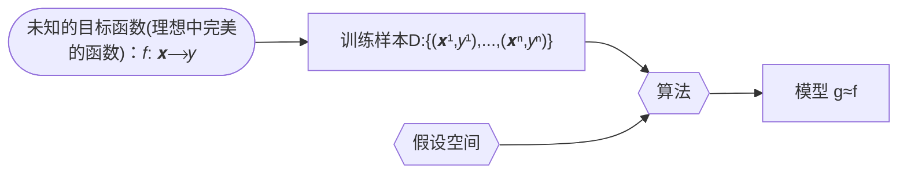
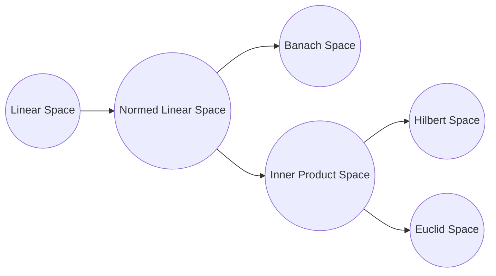

[TOC]

# 统计学习方法

[第一版](https://github.com/kingreatwill/files/tree/main/%E7%BB%9F%E8%AE%A1%E5%AD%A6%E4%B9%A0%E6%96%B9%E6%B3%95/book/Lihang-first_edition)

[第二版](https://github.com/kingreatwill/files/tree/main/%E7%BB%9F%E8%AE%A1%E5%AD%A6%E4%B9%A0%E6%96%B9%E6%B3%95/book/Lihang-second_edition)

## 第 1 章 统计学习及监督学习概论

**统计学习的主要特点是**：

1. 统计学习以计算机及网络为平台，是建立在计算机及网络之上的；
2. 统计学习以数据为研究对象，是数据驱动的学科；
3. 统计学习的目的是对数据进行预测与分析；
4. 统计学习以方法为中心，统计学习方法构建模型并应用模型进行预测与分析；
5. 统计学习是概率论、统计学、信息论、计算理论、最优化理论及计算机科学等多个领域的交叉学科，并且在发展中逐步形成独自的理论体系与方法论。

**假设空间(hypothesis space)**：
$$\mathcal H = \{ f(x;\theta) | \theta \in \mathbb{R}^D\} \\ or \quad \mathcal F = \{P|P(Y|X;\theta),\theta \in \mathbb{R}^D\}$$
其中$f(x; \theta)$是参数为$\theta$ 的函数（**决策函数**），也称为模型（Model），参数向量$\theta$取值与$D$维欧式空间$\mathbb{R}^D$,也称为参数空间(parameter space)，$D$ 为参数的数量(维度)

模型的假设空间(hypothesis space)包含所有可能的条件概率分布或决策函数

**特征空间（feature space）**：
每个具体的输入是一个实例（instance），通常由特征向量（feature vector）表示。这
时，所有特征向量存在的空间称为特征空间（feature space）。特征空间的每一维对应于
一个特征。

> 输入空间中的一个输入向量$x = (x_1,x_2)$，在多项式模型中特征向量是($x_1^2,x_1x_2,x_2^2,...$)
> 一般说的线性模型，指的是特征向量的线性组合，而不是指输入向量，所以说模型都是定义在特征空间上的

**统计学习的三要素**：

1. 模型的假设空间(hypothesis space)，简称：模型(model)。假设空间即我们对模型形式的先验假设，最终我们求得的模型必定符合我们对模型形式的先验假设。
2. 模型选择的准则(evaluation criterion)，简称：策略(strategy)或者学习准则。即我们用什么标准来评价一个模型的好坏。策略决定了我们从假设空间中选择模型的偏好。
3. 模型学习的算法(algorithm)，简称：算法(algorithm)。优化算法指的是通过什么样的方式调整我们的模型结构或模型超参数取值，使得模型的目标函数取值不断降低。优化算法决定了我们用什么样的步骤在假设空间中寻找合适的模型。

> 以线性回归（Linear Regression）为例：
> 模型： $f(x;w,b) = w^Tx +b$
> 策略(strategy)或者学习准则: 平方损失函数 $\mathcal L(y,\hat{y}) = (y-f(x,\theta))^2$
> 算法：解析解 analytical solution(闭式解 closed-form solution)和数值解 numerical solution，如：closed-form 的最小二乘的解以及梯度下降法

**机器学习的定义**：



使用训练数据来计算接近目标 𝑓 的假设（hypothesis ）g （来自：[Machine Learning Foundations（机器学习基石）- the learning problem,25 页](https://www.csie.ntu.edu.tw/~htlin/course/mlfound17fall/doc/01_handout.pdf)）

**监督学习**：
监督学习(supervised learning)是指从标注数据中学习预测模型的机器学习问题。本质是**学习输入到输出的映射的统计规律**。

输入变量与输出变量均为连续变量的预测问题称为**回归问题**；
输出变量为有限个离散变量的预测问题称为**分类问题**；
输入变量与输出变量均为变量序列的预测问题称为**标注问题**(分类问题的推广，如：隐马尔可夫模型 HMM，条件随机场 CRF)。

监督学习的模型可以是概率模型或非概率模型，由**条件概率分布**$P(Y|X)$或**决策函数（decision function）**$Y=f(X)$表示，随具体学习方法而定。对具体的输入进行相应的输出预测时，写作$P(y|x)$或$Y=f(x)$。
$$y =\displaystyle\argmax_{y}  P(y|x)$$

**联合概率分布**：
监督学习假设输入与输出的随机变量 X 和 Y 遵循联合概率分布$P(X,Y)$。$P(X,Y)$表示分布函数，或分布密度函数。注意，在学习过程中，假定这一联合概率分布存在，但对学习系统来说，联合概率分布的具体定义是未知的。**训练数据与测试数据被看作是依联合概率分布$P(X,Y)$独立同分布产生的**。
统计学习假设数据存在一定的统计规律，$X$和$Y$具有联合概率分布的假设就是监督学习关于数据的基本假设。

**非监督学习**：
非监督学习(unsupervised learning)是指从无标注数据中学习预测模型的机器学习问题。本质是**学习数据中的统计规律或潜在结构**。

非监督学习的模型可以表示为函数$z = g(x)$或者条件概率分布$P(z|x)$ （输出$z$可以是**聚类**或者**降维**）
$$z =\displaystyle\argmax_{z}  P(z|x)$$
以及 条件概率分布$P(x|z)$ （用来做**概率密度估计**，比如 GMM 中$P(x|z)$属于高斯分布，如果假设知道数据来自哪个高斯分布，即知道$z$，我们可以用极大似然估计来估计相关参数）。

[核密度估计 Kernel Density Estimation.](https://scikit-learn.org/stable/modules/generated/sklearn.neighbors.KernelDensity.html) - 应用密度估计检测离群值（outlier）的[LocalOutlierFactor](https://scikit-learn.org/stable/modules/generated/sklearn.neighbors.LocalOutlierFactor.html)

**概率模型（probabilistic model）与非概率模型（non-probabilistic model）或者确定性模型（deterministic model）**：

概率模型（probabilistic model）- 条件概率分布 P(y|x)和 非概率模型（non-probabilistic model） - 函数 y=f(x)可以**相互转化**，条件概率分布最大化后得到函数，函数归一化后得到条件概率分布。所以概率模型与非概率模型的区别不在于输入输出之间的映射关系，而在于模型的内部结构：概率模型一定可以表示为联合概率分布的形式，而非概率模型则不一定存在这样的联合概率分布。

概率模型的代表是**概率图模型（probabilistic graphical model）**$^{参考文献[1-3]}$，联合概率分布可以根据图的结构分解为因子乘积的形式，可以用最基本的加法规则和乘法规则进行概率推理：
$$P(x) = \sum_yP(x,y) \\ P(x,y) = P(x)P(y|x)$$

**参数化模型（parametric model）和非参数化模型（non-parametric model）**：

参数化模型假设模型参数的维度固定，模型可以由有限维参数完全刻画，不随数据点的变化而变化。(如：感知机、GMM、logistic regression、朴素贝叶斯、k 均值聚类、潜在语义分析、概率潜在语义分析、潜在狄利克雷分配)
非参数化模型假设模型参数的唯独不固定或者说无穷大，随着训练数据量的增加而不断增大。(如：决策树、支持向量机、AdaBoost、k 近邻)

> 非参数化模型意味着决策树没有假设空间分布和分类器结构?

**在线学习（online learning）和批量学习（batch learning）**：

在线学习每次接受一个样本，预测后学习模型，并不断重复该操作。
批量学习一次接受所有数据，学习模型之后进行预测。

在线学习比批量学习更难，因为每次模型更新中可利用的数据有限。

**贝叶斯学习（Bayesian learning）/ 贝叶斯推理（Bayesian inference）**：
$$\mathrm{Bayes \; Rule:} \\ \underbrace{P(X|Y)}_{\mathrm{posterior}} = \frac{\overbrace{P(Y|X)}^{\mathrm{likelihood}}\overbrace{P(X)}^{\mathrm{prior}}}{\underbrace{P(Y)}_{\mathrm{evidence}}}   = \frac{\overbrace{P(Y|X)}^{\mathrm{likelihood}}\overbrace{P(X)}^{\mathrm{prior}}}{\underbrace{\sum_{x}P(Y|X)P(X)}_{\mathrm{evidence}}}$$

**核技巧（kernel trick）/ 核方法（kernel method）**：

**核方法**是一类把低维空间的非线性可分问题，转化为高维空间的线性可分问题的方法。
**核技巧**是一种利用核函数直接计算 $\lang \phi(x),\phi(z) \rang$ ，以避开分别计算 $\phi(x)$ 和 $\phi(z)$ ，从而加速核方法计算的技巧。

**核函数**：[Kernel function](https://en.jinzhao.wiki/wiki/Positive-definite_kernel)
设 $\mathcal X$ 是输入空间（即 $x_i \in \mathcal X $ ， $\mathcal X$ 是 $\mathbb R^n$ 的子集或离散集合 ），又设 $\mathcal H$ 为特征空间（​ 希尔伯特空间$^{附加知识:各种空间介绍}$），如果存在一个从 $\mathcal X$ 到 $\mathcal H$ 的映射

$$\phi(x) : \mathcal X \to \mathcal H$$

使得对所有 $x,z \in \mathcal X$ ，函数 $K(x,z)$ 满足条件

$$K(x,z) = \phi(x).\phi(z) = \lang \phi(x),\phi(z) \rang$$

则称 $K(x,z)$ 为核函数。其中 $\phi(x) $ 为映射函数， $\lang \phi(x),\phi(z) \rang$ 为内积。

[核技巧](https://en.jinzhao.wiki/wiki/Kernel_method)的想法是，在学习和预测中只定义核函数 $K(x,z)$ ，而不显式地定义映射函数 $\phi $。通常直接计算$K(x,z)$比较容易，而通过$\phi(x) $和$\phi(z) $计算$K(x,z)$并不容易。

> 注意：$\phi $是输入空间$\mathbb{R}^n$到特征空间$\mathcal H$的映射，特征空间$\mathcal H$一般是高维的，甚至是无穷维的。所以$\phi$不好计算，甚至会带来**维度灾难**又称**维度诅咒（Curse of Dimensionality）**$^{附加知识:维度诅咒}$。

### 附加知识

#### 正则化

正则化符合奥卡姆剃刀（Occam's razor）原理。

参考：[L1L2 正则化和凸优化](../图解数学/L1L2正则化和凸优化.md)

#### 模型选择

参考：[模型选择](../Model-Selection.md)

#### 生成模型和判别模型

参考：[生成模型和判别模型](../生成模型和判别模型.md)

#### 各种空间介绍

**线性空间**就是定义了**加法和数乘**的空间(空间里的一个元素就可以由其他元素线性表示)。

---

**度量空间**就是定义了**距离**的空间（曼哈顿距离，欧氏距离，闵可夫斯基距离，马氏距离，切比雪夫距离）。
定义距离时，有三条公理必须遵守：

1. 非负性、同一性：$dist(x_i,x_j) \geq 0$(非负性)，$dist(x_i,x_j) = 0$当且仅当$x_i=x_j$(同一性)
2. 对称性：$dist(x_i,x_j) = dist(x_j,x_i)$
3. 三角不等式(也叫直递性)：$dist(x_i,x_j) \leq dist(x_i,x_k) + dist(x_k,x_j)$
   希尔伯特空间(Hilbert)
   > 文字解释：【两点之间距离不为负；两个点只有在 空间 上重合才可能距离为零；a 到 b 的距离等于 b 到 a 的距离;a 到 c 的距离加上 c 到 b 的距离大于等于 a 直接到 b 的距离;】

---

**赋范空间**就是定义了**范数**的空间。
x 的范数||x||就是 x 的**长度**。那么这里的长度和上一节中说的距离到底有什么区别呢。**距离的概念是针对两个元素来说的**，例如 d(x,y)指的是 x 与 y 两个元素之间的距离，而**范数是针对一个元素来说的**，每一个元素都对应一个范数，可以将范数理解为一个元素到零点的距离（这只是一种理解，并不是定义），也就是它自己的长度。
定义：
称 映射$||.|| : \mathbb{R}^n \to \mathbb{R}$为 $\mathbb{R}^n$ 上的范数，当且仅当：

1. 非负性： $\forall x \in \mathbb{R}^n ,||x|| \geq 0$ ,$||x|| = 0$当且仅当$x=0$
2. 数乘：$\forall x \in \mathbb{R}^n ,a \in \mathbb{R}^n, ||ax|| = |a|.||x||$
3. 三角不等式: $\forall x,y \in \mathbb{R}^n ,||x+y|| \leq ||x|| + ||y||$

如果我们定义了范数，可以在这基础上定义距离：dist(x,y)=||x-y||。根据范数的三条性质，我们可以证明我们这样定义的距离也满足距离的定义，聪明的你可以自己证明一下（对称性的证明，提一个-1 出来，一加绝对值就是 1 了）。

也就是说范数其实是一个更加具体的概念，**有了范数一定能利用范数定义距离，但是有距离不能定义范数**。

也许你会问，你不是说理解范数就是一个元素到零点的距离吗，那定义范数为||x||=dist(x,0) 不就行了吗。这样的话，对于范数的第二条性质就不一定会满足，||ax||=dist(ax,0)，而 dist(ax,0)不一定等于|a|dist(x,0)，具体等不等于还要看你的距离是怎么定义的。

例如：L<sub>p</sub>范数
欧式距离对应 L2 范数
曼哈顿距离对应 L1 范数
切比雪夫距离对应 L∞ 范数
L<sub>p</sub>范数：当 p>=1 时，向量的 L<sub>p</sub>范数是凸的。(这也是为什么一般不用 L0 范数的原因之一)

---

**线性赋范空间**就是定义了加法、数乘和范数的空间。

---

**巴拿赫空间**就是**完备的赋范线性空间**。(Banach space)
**完备的空间**的定义：如果一个空间是完备的，那么该空间中的任何一个柯西序列都收敛在该空间之内。

首先来说一下柯西序列是什么，柯西序列就是随着序数增加，值之间的距离越来越小的序列。换一种说法是，柯西序列可以在去掉有限个值之后，使任意两个值之间的$\underline{\mathrm{距离}}$都小于任意给定正常数（其实这就是定义了一个极限而已）。

那么任意一个柯西序列都收敛在该空间内是什么意思呢，举个例子你就明白了。

设定义在有理数空间 Q 上的序列：$x_n = \frac{[\sqrt{2}n]}{n}$，其中[x]表示 x 取整数部分。
对于这个数列来说，每一个元素的分子分母都是整数，所以每一个$x_n$都在有理数空间 Q 上，那这个序列的极限呢，稍有常识的人都能看出，这个序列的极限是$\sqrt{2}$，而这并不是一个有理数，所以这个柯西序列的极限不在该空间里面，也就是说有理数空间 Q 是不完备的。

所以完备的意义我们可以这样理解，那就是**在一个空间上我们定义了极限，但是不论你怎么取极限，它的极限的值都不会跑出这个空间，那么这个空间就是完备空间**。

另外，不知道你有没有发现，上面在解释什么是柯西序列的时候，有一个词我加了下划线，那就是距离，也就说说在定义完备空间之前，要先有距离的概念。所以**完备空间，其实也是完备度量空间**。

所以，巴拿赫空间满足几条特性呢：距离、范数、完备。

---

**内积空间**就是定义了内积的空间。[Inner product space](https://en.jinzhao.wiki/wiki/Inner_product_space)
有时也称准希尔伯特空间。
内积就是我们所说的点乘、标积，它的定义方式也不是唯一的，但如同距离范数的定义一样，内积的定义也要满足某些条件，不能随便定义。

定义映射$\lang .,. \rang : V \times V \to \mathbb{F}$, 其中$V$是向量，$\mathbb{F}$是标量
有$x,y,z \in V ,s \in \mathbb{F}$，那么内积满足

1. 第一个参数中的线性:
   $$\lang sx,y \rang = s\lang x,y \rang \\ \lang x+y,z \rang = \lang x,z \rang + \lang y,z \rang \\ \lang 0,x \rang = 0$$

2. 共轭对称:$\lang x,y \rang = \overline{\lang y,x \rang }$

3. 正定性:$\lang x,x \rang > 0 \quad\mathrm{if}\; x \neq 0$

4. 正半定性或非负定性:$\forall{x}, \lang x,x \rang \geq 0 $

5. 确定性：$\lang x,x \rang = 0 必然有 x=0$

3，4，5 可以跟上面定义范数和距离一样写成一个

例子-欧几里得向量空间:
$ x,y \in \mathbb{R}^n , \lang x,y \rang = x^Ty=\sum\_{i=1}^n{x_iy_i}$

**只有定义了内积，才会有夹角的概念，才会有正交的概念，另外内积也可以定义范数，也就是说内积是比范数更具体的一个概念。**

---

**欧式空间**就是定义了内积的有限维实线性空间。

---

**希尔伯特空间**就是完备的内积空间。(Hilbert space)
希尔伯特空间中的元素一般是函数，因为一个函数可以视为一个无穷维的向量。




参考：[一片文章带你理解再生核希尔伯特空间（RKHS）以及各种空间](https://blog.csdn.net/ChangHengyi/article/details/80577318)

#### 维度诅咒

维度诅咒通常是指在涉及到向量的计算的问题中，随着维数的增加，计算量呈指数倍增长的一种现象。高维度有更大的特征空间，需要更多的数据才可以进行较准确的估计。

> 若特征是二值的，则每增加一个特征，所需数据量都在以 2 的指数级进行增长，更何况很多特征不只是二值的。

几何角度 1：

<svg width="52" height="52" xmlns="http://www.w3.org/2000/svg">
 <!-- Created with Method Draw - http://github.com/duopixel/Method-Draw/ -->
 <g>
  <title>background</title>
  <rect fill="#fff" id="canvas_background" height="54" width="54" y="-1" x="-1"/>
  <g display="none" overflow="visible" y="0" x="0" height="100%" width="100%" id="canvasGrid">
   <rect fill="url(#gridpattern)" stroke-width="0" y="0" x="0" height="100%" width="100%"/>
  </g>
 </g>
 <g>
  <title>Layer 1</title>
  <rect stroke="#000" id="svg_1" height="50" width="50" y="1.134891" x="1.227186" stroke-width="1.5" fill="#fff"/>
  <ellipse stroke="#000" ry="25" rx="25" id="svg_2" cy="26.316708" cx="25.727185" fill-opacity="null" stroke-opacity="null" stroke-width="1.5" fill="#fff"/>
  <line stroke-linecap="null" stroke-linejoin="null" id="svg_3" y2="26.363651" x2="49.090879" y1="26.363651" x1="23.636325" fill-opacity="null" stroke-opacity="null" stroke-width="1.5" stroke="#000" fill="none"/>
  <text stroke="#000" transform="matrix(0.8454890517551235,0,0,0.38060957631270753,66.36433546231878,120.48066499237646) " xml:space="preserve" text-anchor="start" font-family="Helvetica, Arial, sans-serif" font-size="24" id="svg_4" y="-262.016546" x="-56.089448" fill-opacity="null" stroke-opacity="null" stroke-width="0" fill="#000000">0.5</text>
 </g>
</svg>

上图表示一个多维空间（以二维为例），设正方形边长为 1，则其内切圆半径为$r=0.5$，则正方形面积为 1，内切圆面积为$\pi(0.5)^2$ 。若将此变为三维情况下，正方体体积为 1，内切球体积为$\frac{4}{3}\pi(0.5)^3$。

因此球体的体积可以表示为$V(d) = \frac{\pi^{d/2}}{\varGamma(\frac{d}{2}+1)}0.5^d = k(0.5)^d$(d 为维度),则 $\lim_{d \to \infty}k(0.5)^d = 0$，其内切超球体的体积为 0。由此可知，**高维情况下，数据大都分布在四角（正方形内，内切圆外）**，稀疏性太大，不好分类。

> 维度越大，超球体体积越小。说明落在超球体内的样本越少，因为超球体是超立方体的内切球。不在球内,那只能在角落！

几何角度 2：

<svg width="52" height="52" xmlns="http://www.w3.org/2000/svg">
 <!-- Created with Method Draw - http://github.com/duopixel/Method-Draw/ -->
 <g>
  <title>background</title>
  <rect fill="#fff" id="canvas_background" height="54" width="54" y="-1" x="-1"/>
  <g display="none" overflow="visible" y="0" x="0" height="100%" width="100%" id="canvasGrid">
   <rect fill="url(#gridpattern)" stroke-width="0" y="0" x="0" height="100%" width="100%"/>
  </g>
 </g>
 <g>
  <title>Layer 1</title>
  <ellipse stroke="#000" ry="25" rx="25" id="svg_5" cy="25" cx="25" fill-opacity="null" stroke-opacity="null" stroke-width="1.5" fill="#fff"/>
  <ellipse id="svg_6" cy="24.593763" cx="34.636353" fill-opacity="null" stroke-opacity="null" stroke-width="1.5" stroke="#000" fill="#fff"/>
  <ellipse ry="20" rx="20" id="svg_7" cy="25" cx="25" fill-opacity="null" stroke-opacity="null" stroke-width="1.5" stroke="#000" fill="#fff"/>
 </g>
</svg>

上图也表示一个多维空间（以二维为例），则其中图形的体积有如下关系：外圆半径$r=1$，内圆半径为$r−\varepsilon$ 。同样在高维情况下，外圆体积为$V_{外圆} = k.1^d = k$，中间的圆环体积为$V_{圆环} = k - k(1-\varepsilon)^d$，则：
$$\lim_{d \to \infty}\frac{V_{圆环}}{V_{外圆}} = \lim_{d \to \infty}\frac{ k - k(1-\varepsilon)^d}{k} = \lim_{d \to \infty}(1-(1-\varepsilon)^d) = 1$$

> 高维情况下，无论$\varepsilon$多小，只要 d 足够大，圆环几乎占据了整个外圆，内圆体积趋向于 0，导致数据**稀疏**。

参考：
[The Curse of Dimensionality in classification](https://www.visiondummy.com/2014/04/curse-dimensionality-affect-classification/)
[机器学习-白板推导系列(五)-降维（Dimensionality Reduction）](https://www.bilibili.com/video/BV1vW411S7tH)

#### 不等式(Inequality)

[所有不等式](https://en.jinzhao.wiki/wiki/Category:Inequalities) 以及[所有概率（Probabilistic）不等式](https://en.jinzhao.wiki/wiki/Category:Probabilistic_inequalities)

- **[绝对值不等式](https://chi.jinzhao.wiki/wiki/%E7%BB%9D%E5%AF%B9%E5%80%BC%E4%B8%8D%E7%AD%89%E5%BC%8F) - Absolute value inequality**

- **幂平均值不等式- [Power-Mean Inequality](https://artofproblemsolving.com/wiki/index.php/Power_Mean_Inequality)**

- **[三角形内角的嵌入不等式](https://chi.jinzhao.wiki/wiki/%E4%B8%89%E8%A7%92%E5%BD%A2%E5%86%85%E8%A7%92%E7%9A%84%E5%B5%8C%E5%85%A5%E4%B8%8D%E7%AD%89%E5%BC%8F) - 有时也被称为 Wolstenholme 不等式**

- **伯努利不等式 - [Bernoulli's inequality](https://en.jinzhao.wiki/wiki/Bernoulli%27s_inequality)**
- **排序不等式 - [Rearrangement inequality](https://en.jinzhao.wiki/wiki/Rearrangement_inequality)**
- **均值不等式 - [Inequality of arithmetic and geometric means](https://en.jinzhao.wiki/wiki/Inequality_of_arithmetic_and_geometric_means)**

- **舒尔不等式 - [Schur's inequality](https://en.jinzhao.wiki/wiki/Schur%27s_inequality)**

- **闵可夫斯基 (Minkowski) 不等式 - [Minkowski inequality](https://en.jinzhao.wiki/wiki/Minkowski_inequality)**

- **吉布斯 (Gibbs) 不等式 - [Gibbs' inequality](https://en.jinzhao.wiki/wiki/Gibbs%27_inequality)**
  $${\displaystyle -\sum _{i=1}^{n}p_{i}\log p_{i}\leq -\sum _{i=1}^{n}p_{i}\log q_{i}}$$

由 KL divergence 就能证明
$${\displaystyle D_{\mathrm {KL} }(P\|Q)\equiv \sum _{i=1}^{n}p_{i}\log {\frac {p_{i}}{q_{i}}}\geq 0.}$$

##### 概率不等式 Probabilistic inequalities

- **柯西-施瓦茨 (Cauchy–Schwarz) 不等式 - [Cauchy–Schwarz inequality](https://en.jinzhao.wiki/wiki/Cauchy%E2%80%93Schwarz_inequality)**
  $$[\sum_{i=1}^{n}{a_ib_i}]^2  \leq [\sum_{i=1}^{n}a_i^2].[\sum_{i=1}^{n}b_i^2] 等式成立：b_i=ka_i \\ 向量形式：|\braket{u,v}| \leq ||u||.||v|| \\ 概率中：|E(XY)|^2 \leq E(X^2)E(Y^2)$$
  证明：
  $$\vec{A} = (a_1,...,a_n),  \vec{B} = (b_1,...,b_n) \\ \vec{A}.\vec{B} = (a_1b_1,...,a_nb_n) = ||\vec{A}||.||\vec{B}||\cos\theta \leq ||\vec{A}||.||\vec{B}|| = \sqrt{a_1^2+...+a_n^2}.\sqrt{b_1^2+...+b_n^2}$$
  应用:

  1. 证明 covariance inequality：$Var(Y) \geq \frac{Cov(Y,X)^2}{Var(X)}$,有$\braket{X,Y} := E(XY)$
     $$|Cov(Y,X)|^2 = |E((X-\mu)(Y-v))|^2 = |\braket{X-\mu,Y-v}|^2 \\ \leq \braket{X-\mu,X-\mu}\braket{Y-v,Y-v} = E((X-\mu)^2)E((Y-v)^2) = Var(X)Var(Y)$$

- **赫尔德 (Holder) 不等式 - [Hölder's inequality](https://en.jinzhao.wiki/wiki/H%C3%B6lder%27s_inequality)**

- **琴生 (Jensen) 不等式 - [Jensen's inequality](https://en.jinzhao.wiki/wiki/Jensen%27s_inequality)**
  $$f(tx_1 +(1-t)x_2) \leq tf(x_1) + (1-t)f(x_2), \text{f is convex function} \\ 推广：f(a_1x_1 +...+ a_nx_n) \leq a_1f(x_1) +...+ a_nf(x_n), a_1+...+a_n = 1 , a_i \geq 0 \\ or: f(\sum_{i=1}^n{a_ix_i}) \leq \sum_{i=1}^n{a_if(x_i)} , \sum_{i=1}^n{a_i} = 1, a_i \geq 0$$

  概率中：如果$X$是随机变量，而$\varphi$是凸函数，则:$\varphi(E[X]) \leq E[\varphi(X)]$,不等式两边的差，$ E[\varphi(X)] - \varphi(E[X]) $称为 Jensen gap(间隙)；
  应用：

  1. EM 算法中有用到(log 函数是凹函数正好与凸函数相反);
  2. 证明 KL 散度>=0;

- **马尔可夫不等式 - [Markov's inequality](https://en.jinzhao.wiki/wiki/Markov%27s_inequality)**
  $$P(X \geq a) \leq \frac{E(X)}{a}$$
  其中$X$为非负随机变量，$\forall a>0$
  应用：

  1. 用于估计一个概率的上界，比如假设你所在公司的人均工资是 1 万，那么随机选一个你司员工，其工资超过 10 万的概率，不会超过 1/10；
  2. 用于其他概率不等式的证明，比如霍夫丁不等式；

- **切比雪夫 (Chebyshev) 不等式 - [Chebyshev's inequality](https://en.jinzhao.wiki/wiki/Chebyshev%27s_inequality)**
  $$P\{|X-\mu| \geq k\} \leq \frac{\sigma^2}{k^2}$$
  其中$X$为随机变量，$\forall k>0$, $\mu$为均值，$\sigma^2$为方差
  （证明可以利用马尔可夫不等式，见概率论基础教程 313 页）

- **霍夫丁不等式 - [Hoeffding's inequality](https://en.jinzhao.wiki/wiki/Hoeffding%27s_inequality)**
  应用：
  1. [Machine Learning Foundations（机器学习基石）- feasibility of learning,12,13,18 页](https://www.csie.ntu.edu.tw/~htlin/course/mlfound17fall/doc/04_handout.pdf)
  2. 统计学习方法，26 页，证明泛化误差上界（在[机器学习中常用的几个概率不等式及证明](https://zhuanlan.zhihu.com/p/392348396)中也有提到）

参考：[初等数学学习笔记](https://github.com/zhcosin/elementary-math/blob/master/elementary-math-note.pdf)

### 参考文献

[1-1] Hastie T,Tibshirani R,Friedman J. [The Elements of Statistical Learning: DataMining,Inference,and Prediction](http://www.web.stanford.edu/~hastie/ElemStatLearn/printings/ESLII_print12_toc.pdf). Springer. 2001（中译本：统计学习基础——数据挖掘、推理与预测。范明，柴玉梅，昝红英等译。北京：电子工业出版社，2004）

[1-2] Bishop M. [Pattern Recognition and Machine Learning](https://www.microsoft.com/en-us/research/uploads/prod/2006/01/Bishop-Pattern-Recognition-and-Machine-Learning-2006.pdf). Springer,2006

[1-3] [Probabilistic Graphical Models: Principles and Techniques](https://djsaunde.github.io/read/books/pdfs/probabilistic%20graphical%20models.pdf) by Daphne Koller, Nir Friedman from The MIT Press

[1-4] [Deep Learning](https://raw.fastgit.org/Zhenye-Na/machine-learning-uiuc/master/docs/Deep%20Learning.pdf) (Ian Goodfellow, Yoshua Bengio, Aaron Courville)

[1-5] Tom M Michelle. [Machine Learning](https://www.cs.cmu.edu/afs/cs.cmu.edu/user/mitchell/ftp/mlbook.html). McGraw-Hill Companies,Inc. 1997（中译本：机器学习。北京：机械工业出版社，2003）

[1-6] [Bayesian Reasoning and Machine Learning by David Barber 2007–2020](http://web4.cs.ucl.ac.uk/staff/D.Barber/textbook/200620.pdf) ,[other version](http://web4.cs.ucl.ac.uk/staff/D.Barber/textbook/)

[1-7] [Reinforcement Learning:An Introduction (second edition 2020) by Richard S. Sutton and Andrew G. Barto](http://incompleteideas.net/book/RLbook2020trimmed.pdf) ,[other version](http://incompleteideas.net/book/)

[1-8] 周志华，[机器学习](https://github.com/Mikoto10032/DeepLearning/blob/master/books/%E6%9C%BA%E5%99%A8%E5%AD%A6%E4%B9%A0%E5%91%A8%E5%BF%97%E5%8D%8E.pdf)，清华大学出版社 ([手推笔记](https://github.com/Sophia-11/Machine-Learning-Notes) 以及 [公式推导解析](https://github.com/datawhalechina/pumpkin-book))

[1-9] [Lecture Notes in MACHINE LEARNING](https://news.vidyaacademy.ac.in/wp-content/uploads/2018/10/NotesOnMachineLearningForBTech-1.pdf) Dr V N Krishnachandran

## 第 2 章 感知机

判别模型

感知机[Perceptron](https://en.jinzhao.wiki/wiki/Perceptron)是**神经网络**和**支持向量机**的基础。最早在 1957 年由 Rosenblatt 提出$^{参考文献[2-1]}$。Novikoff$^{参考文献[2-2]}$，Minsky 与 Papert$^{参考文献[2-3]}$等人对感知机进行了一系列理论研究。感知机的扩展学习方法包括口袋算法(pocket algorithm)$^{参考文献[2-4]}$、表决感知机(voted perceptron)$^{参考文献[2-5]}$、带边缘感知机(perceptron with margin)$^{参考文献[2-6]}$等。
[Brief History of Machine Learning](https://erogol.com/brief-history-machine-learning/)

要求：数据集线性可分(linearly separable data set)

- **模型**：
  $$f(x) = sign(w.x + b)$$
  其中$x,w \in \mathbb{R}^n ,b \in \mathbb{R}$,$w$叫作权值（weight）或权值向量（weight vector），$b$叫作偏置（bias），sign 是符号函数
  $$
  sign(x) = \begin{cases}
     +1 & x \geq 0 \\
     -1 & x<0
  \end{cases}
  $$

感知机是一种线性分类模型，属于判别模型。感知机模型的假设空间是定义在特征空 间中的所有线性分类模型（linear classification model）或线性分类器(linear classifier)，即 函数集合$\{f|f(x)＝w·x+b\}$

超平面 S：$w.x+b = 0$,其中$w$是 S 的法向量，$b$是 S 的截距，超平面 S 称为分离超平面（separating hyperplane）

- **策略**：
  $$L(w,b) = -\sum_{x_i \in M}{y_i(w.x_i + b)}$$
  其中$M$为误分类点的集合。误分类数据$M = \{ (x_i,y_i)|-y_i(w.x_i +b) > 0\}$

函数间隔：$y(w.x + b)$
几何间隔：$\frac{1}{||w||}|w.x + b|$ (在上面的 loss function 中没有考虑$\frac{1}{||w||}$)

- **算法**：
  $$\min_{w,b} L(w,b) = -\sum_{x_i \in M}{y_i(w.x_i + b)}$$
  使用**随机梯度下降法（stochastic gradient）**:

1. 初始化参数(随机法)：$w_0,b_0$
2. 选取数据$(x_i,y_i)$
3. 如果$(x_i,y_i)$是误分类点，也就是$y_i(w.x_i + b) \leq 0$，则对$w,b$进行更新
   $$在(x_i,y_i)点处梯度为：\\ \nabla_wL(w,b) = -y_ix_i \\ \nabla_bL(w,b) = -y_i\\ 更新w：w_{k+1} \gets w_{k}+\eta y_ix_i \\ 更新b：b_{k+1} \gets b_{k}+\eta y_i \\其中学习率\eta \in (0,1]$$
4. 循环 2-3，直到训练集中没有误分类点。

- 上述**算法的收敛性**：

Novikoff 定理：
设训练集$T = \{(x_1,y_1),...,(x_N,y_N)\}$是线性可分的，

1. 设完美超平面$\hat{w}_{opt}.\hat{x} = 0 , ||\hat{w}_{opt}||=1$ 将训练集完全正确分开（简化起见 $\hat{w}_{opt}.\hat{x} = w_{opt}.x +b$），存在$\gamma >0$ ,对所有点有$y_i(\hat{w}_{opt}.\hat{x_i}) \geq \gamma$；

2. 令$R = \max_{1\leq i\leq N}||\hat{x_i}||$,则算法会在有限步 k 满足不等式$k \leq (\frac{R}{\gamma})^2$

证明(注意：带 hat 的表示扩充向量)：

1. 因为数据线性可分，对于所有点$y_i(\hat{w}_{opt}.\hat{x_i}) > 0$,所以存在
   $$\gamma = \min_i{y_i(\hat{w}_{opt}.\hat{x_i})} \leq {y_i(\hat{w}_{opt}.\hat{x_i})} \label{2-1}\tag{2-1}$$
   所以这里的$\gamma$代表了所有点离完美超平面的最小距离；

2. 为了方便计算 设 扩充向量$\hat{w} = (w^T,b)^T$， 有
   $$\hat{w}_{k} = \hat{w}_{k-1}+\eta y_i\hat{x_i} \label{2-2}\tag{2-2}$$

3. 推导不等式
   $$\hat{w}_{k}.\hat{w}_{opt} \geq k\eta\gamma \label{2-3}\tag{2-3}$$

由$\eqref{2-1}$和$\eqref{2-2}$
$$\hat{w}_{k}.\hat{w}_{opt} = \hat{w}_{k-1}.\hat{w}_{opt} + \eta{y_i}\hat{w}_{opt}.\hat{x_i} \\ \geq \hat{w}_{k-1}.\hat{w}_{opt} + \eta\gamma \\ \geq \hat{w}_{k-2}.\hat{w}_{opt} + 2\eta\gamma \\ \geq k\eta\gamma$$

4. 推导不等式
   $$||\hat{w}_{k}||^2 \leq k\eta^2R^2 \label{2-4}\tag{2-4}$$
   由$\eqref{2-2}$
   $$||\hat{w}_{k}||^2=||\hat{w}_{k-1}+\eta y_i\hat{x_i}||^2 = ||\hat{w}_{k-1}||^2 + 2\eta{y_i}\hat{w}_{k-1}.\hat{x}_{i} + \eta^2||\hat{x}_{i}||^2$$
   假设 k 次完全分对，那么 k-1 次有误分类点，则${y_i}\hat{w}_{k-1}.\hat{x}_{i} \leq 0$
   所以
   $$||\hat{w}_{k}||^2 =||\hat{w}_{k-1}||^2 + 2\eta{y_i}\hat{w}_{k-1}.\hat{x}_{i} + \eta^2||\hat{x}_{i}||^2 \\ \leq ||\hat{w}_{k-1}||^2 +  \eta^2||\hat{x}_{i}||^2 \\ \leq ||\hat{w}_{k-1}||^2 +  \eta^2R^2  \\ \leq ||\hat{w}_{k-2}||^2 +  2\eta^2R^2 \leq ... \\ \leq k\eta^2R^2$$

5. 由$\eqref{2-3}$和$\eqref{2-4}$

$$k\eta\gamma \leq \underbrace{\hat{w}_{k}.\hat{w}_{opt} \leq ||\hat{w}_{k}||.\underbrace{||\hat{w}_{opt}||}_{=1} }_{\text{柯西-施瓦茨 (Cauchy–Schwarz) 不等式}} \leq \sqrt{k} \eta R \\ \; \\ \Rightarrow k^2\gamma^2 \leq kR^2 \\ \Rightarrow k \leq (\frac{R}{\gamma})^2$$

也就是说 k 是有上界的。

> 书中还介绍了原形式的**对偶形式**,也就是等价形式（SVM 中 7.2.2 节 127 页也是等价的意思，区别于拉格朗日对偶），这两个地方的等价都是经过基本推导，求出 w 参数，然后对原问题进行了替换。

### 参考文献

[2-1] Rosenblatt, F. (1958). [The perceptron: A probabilistic model for information storage and organization in the brain](http://homepages.math.uic.edu/~lreyzin/papers/rosenblatt58.pdf). Psychological Review, 65(6), 386–408.

[2-2] Novikoff, A. B. (1962). On convergence proofs on perceptrons. Symposium on the Mathematical Theory of Automata, 12, 615-622. Polytechnic Institute of Brooklyn.

[2-3] Minsky M L and Papert S A 1969 Perceptrons (Cambridge, MA: MIT Press)

[2-4] Gallant, S. I. (1990). Perceptron-based learning algorithms. IEEE Transactions on Neural Networks, vol. 1, no. 2, pp. 179-191.

[2-5] Freund, Y. and Schapire, R. E. 1998. Large margin classification using the perceptron algorithm. In Proceedings of the 11th Annual Conference on Computational Learning Theory (COLT' 98). ACM Press.

[2-6] Li YY,Zaragoza H,Herbrich R,Shawe-Taylor J,Kandola J. The Perceptron algorithmwith uneven margins. In: Proceedings of the 19th International Conference on MachineLearning. 2002,379–386

[2-7] [Widrow, B.](https://en.jinzhao.wiki/wiki/Bernard_Widrow), Lehr, M.A., "[30 years of Adaptive Neural Networks: Perceptron, Madaline, and Backpropagation,](http://www.inf.ufrgs.br/~engel/data/media/file/cmp121/widrow.pdf)" Proc. IEEE, vol 78, no 9, pp. 1415-1442, (1990)。

[2-8] Cristianini N,Shawe-Taylor J. An Introduction to Support Vector Machines and OtherKernelbased Learning Methods. Cambridge University Press,2000

## 第 3 章 k 近邻法

判别模型

k 近邻法（[k-nearest neighbor，k-NN](https://en.jinzhao.wiki/wiki/K-nearest_neighbors_algorithm)）1968 年由 Cover 和 Hart 提出，是一种基本分类与回归方法。本书只讨论分类问题中的 k 近邻法。
k 值的选择、距离度量及分类决策规则是 k 近邻法的三个基本要素。
最后讲述 k 近邻法的一个实现方法——kd 树，介绍构造 kd 树和搜索 kd 树的算法

**k 近邻法的三个基本要素**：
k 值的选择：超参数，可以使用交叉验证法来选取最优 k 值
距离度量：$L_2$距离/欧氏距离，$L_p$距离/Minkowski 距离
分类决策规则：多数表决（0-1 损失也就是指示函数）

- **模型**：
  k 近邻法没有显式的学习过程（不学习也能预测），它本身并没有对数据进行理论建模的过程，而是利用训练数据对特征向量空间进行划分，并将其划分的结果作为其最终的算法模型。这就好比，在现实世界的维度中，经常游走于男厕所的我们归为男性，而经常在女厕所出没的人我们归为女性或者是变态。

- **策略**：
  $$y = \argmin_{c_j} \frac{1}{k} \sum_{x_i \in N_k(x)} I(y_i \neq c_j) = 1- \frac{1}{k}\sum_{x_i \in N_k(x)} I(y_i = c_j) $$
  最大化类别属于$c_j$类的概率$\frac{1}{k}\sum_{x_i \in N_k(x)} I(y_i = c_j)$
  最小化误分类率$\frac{1}{k} \sum_{x_i \in N_k(x)} I(y_i \neq c_j)$
  $N_k(x)$表示涵盖 k 个点的 x 的邻域
- **算法**：
  直接计算（线性扫描 linear scan）,当训练集很大时，计算很耗时（每次都要计算所有距离，然后找到 k 个最近距离的点），因为没有学习。
  为了提高 k 近邻搜索的效率，可以考虑使用特殊的结构存储训练数据，以减少计算距离的次数。
  具体方法很多，如：[kd_tree](https://en.jinzhao.wiki/wiki/K-d_tree)，[ball_tree](https://arxiv.org/pdf/1511.00628.pdf)，brute(蛮力实现,不算优化，只是把 sklearn 中的参数拿过来)，以及其它[树结构](<https://en.jinzhao.wiki/wiki/Category:Trees_(data_structures)>)
  为了改进 KDtree 的二叉树树形结构，并且沿着笛卡尔坐标进行划分的低效率，ball tree 将在一系列嵌套的超球体上分割数据。也就是说：使用超球面而不是超矩形划分区域。虽然在构建数据结构的花费上大过于 KDtree，但是在高维甚至很高维的数据上都表现的很高效。

  下面介绍其中的 kd 树（kd tree 是一个二叉树）方法（kd 树是存储 k 维空间数据的树结构，这里的 k 与 k 近邻法的 k 意义不同）。
  数据集$T = \{x_1,...,x_N\}$，其中$x_i$是 k 维向量$x_i = (x_i^{(1)},...,x_i^{(k)})^T$

  - **构造 kd 树**：

  ```
  function kdtree (list of points pointList, int depth)
  {
      // Select axis based on depth so that axis cycles through all valid values
      var int axis := depth mod k;

      // Sort point list and choose median as pivot element
      select median by axis from pointList;

      // Create node and construct subtree
      node.location := median;
      node.leftChild := kdtree(points in pointList before median, depth+1);
      node.rightChild := kdtree(points in pointList after median, depth+1);
      return node;
  }
  ```

  1. 根据第(depth mod k)维查找中位数（中位数所在的点作为节点，第一次就是 root 节点），将数据划分为两个区域，小于中位数的划分在左边，大于中位数的划分在右边
  2. 重复 1，depth++

  - **搜索 kd 树**：

  1. 在 kd 树中找出包含目标点 x 的叶结点：从根结点出发，递归地向下访问 kd 树。若目标点 x 当前维的坐标小于切分点的坐标，则移动到左子结点，否则移动到右子结点。直到子结点为叶结点为止。
  2. 以此叶结点为“当前最近点”。
  3. 递归地向上回退，在每个结点进行以下操作：
     a. 如果该结点保存的实例点比当前最近点距离目标点更近，则以该实例点为“当前最近点”。
     b. 当前最近点一定存在于该结点一个子结点对应的区域。检查该子结点的父结点的另一子结点对应的区域是否有更近的点。具体地，检查另一子结点对应的区域是否与以目标点为球心、以目标点与“当前最近点”间的距离为半径的超球体相交。
     如果相交，可能在另一个子结点对应的区域内存在距目标点更近的点，移动到另一个子结点。接着，递归地进行最近邻搜索；
     如果不相交，向上回退。
  4. 当回退到根结点时，搜索结束。最后的“当前最近点”即为 x 的最近邻点。
     如果实例点是随机分布的，kd 树搜索的平均计算复杂度是 O(logN)，这里 N 是训练实例数。kd 树更适用于训练实例数远大于空间维数时的 k 近邻搜索。当空间维数接近训练实例数时，它的效率会迅速下降，几乎接近线性扫描。

  | 算法 | 平均        | 最差的情况 |
  | ---- | ----------- | ---------- |
  | 空间 | $O(n)$      | $O(n)$     |
  | 搜索 | $O(\log n)$ | $O(n)$     |
  | 插入 | $O(\log n)$ | $O(n)$     |
  | 删除 | $O(\log n)$ | $O(n)$     |

### 附加知识

#### 距离度量

[Distance](https://en.jinzhao.wiki/wiki/Category:Distance)

[sklearn.neighbors.DistanceMetric](https://scikit-learn.org/stable/modules/generated/sklearn.neighbors.DistanceMetric.html)

[Distance computations(scipy.spatial.distance)](https://docs.scipy.org/doc/scipy/reference/spatial.distance.html)

[24 种距离度量小结](https://blog.csdn.net/weixin_43840403/article/details/89075759)

> 先了解度量空间和赋范空间

实值向量空间的度量：

- Euclidean(欧几里得距离也称欧式距离) ${||u-v||}_2$ or $\sqrt{\sum_i{(u_i - v_i)^2}}$
- SEuclidean(标准化欧几里得距离)
- SqEuclidean(平方欧几里得距离)
- Mahalanobis(马氏距离) $\sqrt{ (u-v) \Sigma^{-1} (u-v)^T }$
- Manhattan/cityblock(城市街区（曼哈顿）距离) $\sum_i{|u_i-v_i|}$
- Chebyshev(切比雪夫距离) $L_\infty$度量 $\max_i{|u_i-v_i|}$
- Minkowski(闵可夫斯基距离) 欧式距离的推广，p=1 时等价于曼哈顿距离，p=2 时等价于欧氏距离，p=∞ 时等价于切比雪夫距离;$\sqrt[p]{\sum_i{(u_i - v_i)^p}}$
- WMinkowski(加权 Minkowski)

实值向量空间的度量(scipy)：

- Correlation(皮尔逊相关系数(Pearson Correlation))
- Cosine(余弦距离)
- JensenShannon(JS 散度也称 JS 距离，是 KL 散度的一种变形)

整数值向量空间的度量：

- Hamming(汉明距离)
- Canberra(堪培拉距离)
- BrayCurtis(布雷柯蒂斯距离)

布尔值向量空间的度量：

- Jaccard(Jaccard-Needham 不相似度)
- Matching(Hamming 同义词)
- Dice(Dice 系数)
- Kulsinski(Kulsinski 相异度)
- RogersTanimoto(Rogers-Tanimoto 相异度)
- RussellRao(Russell-Rao 相异性)
- SokalMichener(Sokal-Michener 相异性)
- SokalSneath(Sokal-Sneath 相异性)
- Yule（scipy 中的 Yule 相异度）

经纬度距离：

- Haversine(sklearn 中的半正矢距离)

其它：

- 相对熵又称 KL 散度（Kullback-Leibler divergence）[scipy.special.kl_div](https://docs.scipy.org/doc/scipy/reference/generated/scipy.special.kl_div.html)
- 交叉熵（Cross Entropy） [scipy.stats.entropy](https://docs.scipy.org/doc/scipy/reference/generated/scipy.stats.entropy.html)

### 参考文献

[3-1] Cover T,Hart P. Nearest neighbor pattern classification. IEEE Transactions onInformation Theory,1967

[3-2] Hastie T,Tibshirani R,Friedman J. The Elements of Statistical Learning: DataMining,Inference,and Prediction,2001（中译本：统计学习基础——数据挖掘、推理与预测。范明，柴玉梅，昝红英等译。北京：电子工业出版社，2004）

[3-3] Friedman J. Flexible metric nearest neighbor classification. Technical Report,1994

[3-4] Weinberger KQ,Blitzer J,Saul LK. Distance metric learning for large margin nearestneighbor classification. In: Proceedings of the NIPS. 2005

[3-5] Samet H. The Design and Analysis of Spatial Data Structures. Reading,MA: Addison-Wesley,1990

## 第 4 章 朴素贝叶斯法

朴素贝叶斯（[Naïve Bayes](https://en.jinzhao.wiki/wiki/Naive_Bayes_classifier)）法是基于**贝叶斯定理**与**特征条件独立假设**（Naive 天真的）的分类方法。
对于给定的训练数据集，首先基于特征条件独立假设学习输入/输出的联合概率分布；然后基于此模型，对给定的输入 x，利用贝叶斯定理求出后验概率最大的输出 y。
朴素贝叶斯法实现简单，学习与预测的效率都很高，是一种常用的方法。并且支持 online learning（有 partial_fit 方法）。

朴素贝叶斯法是典型的**生成学习方法**。生成方法由训练数据学习联合概率分布 P(X,Y)，然后求得后验概率分布 P(Y|X)。具体来说，利用训练数据学习 P(X|Y)和 P(Y)的估计，得到联合概率分布：P(X,Y)＝ P(Y)P(X|Y) ；概率估计方法可以是极大似然估计或贝叶斯估计。

**[贝叶斯定理(Bayes' theorem)](https://en.jinzhao.wiki/wiki/Bayes%27_theorem)**：
$$P(A|B) = \frac{P(B|A)P(A)}{P(B)}$$

- $P(A|B)$ 是条件概率[conditional probability](https://en.jinzhao.wiki/wiki/Conditional_probability)：是已知 B 发生后，A 的概率，也被称为 已知 B 的情况下 A 的后验概率[posterior probability](https://en.jinzhao.wiki/wiki/Posterior_probability)

- $P(B|A)$ 也是一个条件概率：已知 A 时，B 的似然性/可能性([likelihood](https://en.jinzhao.wiki/wiki/Likelihood_function)), 为什么叫 likelihood？因为$P(B|A) = L(A|B) ^{参见：附加知识-参数估计-极大似然估计}$

- $P(A)$ 叫 A 的边际概率([marginal probability](https://en.jinzhao.wiki/wiki/Marginal_probability))或先验概率([prior probability](https://en.jinzhao.wiki/wiki/Prior_probability))

- $P(B)$ 叫 B 的边际概率或先验概率，也称为 evidence 证据

**[特征条件独立假设](https://en.jinzhao.wiki/wiki/Conditional_independence)**：
**条件独立**
$$(A\perp B|C) \iff P(A|B,C) = P(A|C) \\ (A\perp B|C) \iff P(A,B|C) = P(A|C)P(B|C)$$

特征条件独立假设就是已知 y 的情况下，x 中每个特征相互独立。

数据集$T = \{(x_1,y_1),...,(x_N,y_N)\}$，$K$为类别个数,其中$x_i$是 n 维向量$x_i = (x_i^{(1)},...,x_i^{(n)})^T$

- **模型**：
  $$\underbrace{P(Y=c_k|X=x) = \frac{P(X=x|Y=c_k)P(Y=c_k)}{P(X=x)}}_{\text{贝叶斯定理}} \varpropto P(Y=c_k) \underbrace{\prod_j{P(X^{(j)}=x^{(j)}|Y=c_k)}}_{\text{特征条件独立假设}}$$

  其中
  $$P(X=x) = \sum_k{P(X=x|Y=c_k)P(Y=c_k)} = \sum_k{P(Y=c_k) \prod_j{P(X^{(j)}=x^{(j)}|Y=c_k)}}$$
  P(X)是 evidence(已知的,观察变量)，可看做常数(也可以说对$c_k$来说分母 P(X)是相同的，求最大最小时可以去掉)，则：
  $$P(Y=c_k|X=x) \varpropto {P(X=x|Y=c_k)P(Y=c_k)}$$

- **策略**：
  后验最大化（等价 0-1 损失）：
  $$y = \argmax_{c_k} P(Y=c_k|X=x)= \argmax_{c_k}P(Y=c_k)\prod_j{P(X^{(j)}=x^{(j)}|Y=c_k)}$$
  原理（证明）：使用 0-1 损失
  $$\argmin_{y}\sum_{k=1}^K P(y \neq c_k|X=x) \\= \argmin_{y}(1- P(y = c_k|X=x)) \\= \argmax_y P(y = c_k|X=x)$$

- **算法**：参数估计
  我们需要知道$P(Y=c_k)$以及$\prod_j{P(X^{(j)}=x^{(j)}|Y=c_k)}$
  **极大似然估计**：

  1. 先验$P(Y=c_k)$的极大似然估计是：
     $$P(Y=c_k) = \frac{\sum_{i=1}^N I(y_i = c_k)}{N}$$
  2. 第$j$个特征$x^{(j)}$的取值集合是$\{a_{j1},...,a_{jS_j}\}$,([注意这里用的都是频率计数，也就是离散特征，如果是连续特征变量，则使用高斯朴素贝叶斯](https://scikit-learn.org/stable/modules/naive_bayes.html#gaussian-naive-bayes))
     条件概率(likelihood)$P(X^{(j)}=x^{(j)}|Y=c_k)$的极大似然估计是：
     $$P(X^{(j)} = a_{jl}|Y=c_k) = \frac{\sum_{i=1}^N I(x_i^{(j)} =a_{jl} , y_i = c_k)}{\sum_{i=1}^N I(y_i=c_k)}$$
     其中$j = 1,2,...N; \quad l=1,2...S_j ;\quad k=1,2,...K$，$x_i^{(j)}$是第$i$个样本的第$j$个特征；$a_{jl}$是第$j$个特征可能取值的第$l$个值。

  **贝叶斯估计**（smoothed version of maximum likelihood）：
  极大似然估计有一个问题就是条件概率$P(X^{(j)}=x^{(j)}|Y=c_k)$有一个为 0，就会出现无法估计的情况(就是概率为 0)，也就是给定要预测的特征向量的一个特征出现了新的类别（如：第$j$个特征$x^{(j)} = a_{jS_j+1}$），那么就会导致概率为 0，这是要么增加样本数量，要么使用贝叶斯估计

  > 注意：朴素贝叶斯法与贝叶斯估计（Bayesian estimation）是不同的概念。

  1. 先验$P(Y=c_k)$的贝叶斯估计是：
     $$P(Y=c_k) = \frac{\sum_{i=1}^N I(y_i = c_k) + \lambda}{N + K\lambda}$$
  2. 条件概率(likelihood)的贝叶斯估计是：
     $$P(X^{(j)} = a_{jl}|Y=c_k) = \frac{\sum_{i=1}^N I(x_i^{(j)} = a_{jl} , y_i = c_k) + \lambda}{\sum_{i=1}^N I(y_i=c_k) + S_j\lambda}$$

  其中$\lambda \geq 0$,当$\lambda = 0$时就等价于极大似然估计；当$\lambda = 1$时，称为拉普拉斯平滑（[Laplacian smoothing](https://en.jinzhao.wiki/wiki/Laplacian_smoothing)）；当$\lambda < 1$时为 Lidstone 平滑

  > 高斯朴素贝叶斯:条件概率(likelihood)
  > $$P(X^{(j)} = x^{(j)}|Y=c_k) = \frac{1}{\sqrt{2\pi\sigma_{j,k}^2}} exp\bigg(-\frac{(x^{(j)}-\mu_{j,k})^2}{2\sigma_{j,k}^2}\bigg) $$
  > 其中$\mu_{j,k}$为样本中类别为$c_k$的 所有$x^{(j)}$的均值；$\sigma_{j,k}^2$为样本中类别为$c_k$的 所有$x^{(j)}$的方差（其实就是最大似然估计均值和方差）。
  > sklearn 中 GaussianNB 类的主要参数仅有一个，即先验概率 priors ，对应 Y 的各个类别的先验概率$P(Y=c_k)$。这个值默认不给出，如果不给出此时$P(Y=c_k) = \frac{\sum_{i=1}^N I(y_i = c_k) + \lambda}{N + K\lambda}$。如果给出的话就以 priors 为准。

### 附加知识

#### 参数估计

参数估计([Parameter Estimation](https://en.jinzhao.wiki/wiki/Estimation_theory)) 有点估计（[point estimation](https://en.jinzhao.wiki/wiki/Point_estimation)）和区间估计（[interval estimation](https://en.jinzhao.wiki/wiki/Interval_estimation)）两种

**点估计法：**

- **极大似然估计([Maximum likelihood estimation, MLE](https://en.jinzhao.wiki/wiki/Maximum_likelihood_estimation))**
  极大似然估计是典型的**频率学派**观点，它的基本思想是：待估计参数$\theta$ 是客观存在的，只是未知而已
  $$L(\theta|x) = f(x|\theta) = P(X|\theta) \\ \hat{\theta}_{MLE} = \argmax_{\theta} L(\theta|x)$$
  这里用 | 和 ; 是等价的; 要最大化 L，对 L 求导数并令导数为 0 即可求解。
  $P(X|\theta)$就是贝叶斯公式中的 likelihood，$\theta$就是$c_k$
  log-likelihood:$\ell(\theta|x) = \log L(\theta|x)$（log 函数并不影响函数的凹凸性）

- **最大后验估计([maximum a posteriori estimation, MAP](https://en.jinzhao.wiki/wiki/Maximum_a_posteriori_estimation))**
  贝叶斯定理：
  $$f(\theta|x) = \frac{f(x|\theta)g(\theta)}{\int_\vartheta f(x|\vartheta)g(\vartheta)d\vartheta}$$
  $g$ 是$\theta $的密度函数（density function）
  $$\hat{\theta}_{MAP} = \argmax_{\theta} f(\theta|x) \\= \argmax_{\theta} \frac{f(x|\theta)g(\theta)}{\int_\vartheta f(x|\vartheta)g(\vartheta)d\vartheta} \\= \argmax_{\theta}f(x|\theta)g(\theta)$$
  这里分母与$\theta$无关，可以省略
  我们将likelihood变成log-likelihood：
  $$\hat{\theta}_{MAP} =  \argmax_{\theta}\log{f(x|\theta)g(\theta)} =  \argmax_{\theta} (\log{f(x|\theta)} + \log{g(\theta)})$$
  这样我们可以将$\log{g(\theta)}$看作机器学习结构风险中的**正则化项**，那么带有正则化项的最大似然学习就可以被解释为 MAP（如：[Ridge 回归和 Lasso 回归](../图解数学/L1L2正则化和凸优化.md)）。
  当然，这并不是总是正确的，例如，有些正则化项可能不是一个概率分布的对数，还有些正则化项依赖于数据，当然也不会是一个先验概率分布。不过，MAP 提供了一个直观的方法来设计复杂但可解释的正则化项，例如，更复杂的惩罚项可以通过混合高斯分布作为先验得到，而不是一个单独的高斯分布。

  > 最大后验估计就是**考虑后验分布极大化而求解参数**的极大似然估计；MAP = 最大似然估计 + 最大似然估计的正则化。
  > 要最大化 L，对 L 求导数并令导数为 0 即可求解。

- **贝叶斯估计([Bayes estimation](https://en.jinzhao.wiki/wiki/Bayes_estimator))**
  贝叶斯估计是典型的**贝叶斯学派**观点，它的基本思想是：待估计参数 $\theta$ 也是随机变量，因此需要根据观测样本估计参数 $\theta$ 的分布。**贝叶斯估计需要要计算整个后验概率的概率分布（而 MAP 值需要求解后验分布极大化时的参数$\theta$）**。

  贝叶斯估计和 MAP 挺像的，都是以最大化后验概率为目的。区别在于：

  1.  MLE 和 MAP 都是只返回了的预估值
  2.  MAP 在计算后验概率的时候，把分母 p(X)给忽略了，在进行贝叶斯估计的时候则不能忽略
  3.  贝叶斯估计要计算整个后验概率的概率分布

> **共轭先验（[Conjugate prior](https://en.jinzhao.wiki/wiki/Conjugate_prior)）**：如果先验分布 prior 和后验分布 posterior 属于同一分布簇，则 prior 称为 likehood 的共轭先验
> likehood 为高斯分布，prior 为高斯分布，则 posterior 也为高斯分布。
> likehood 为伯努利分布（二项式分布），prior 为 beta 分布，则 posterior 也为 beta 分布。
> likehood 为多项式分布，prior 为 Dirichlet 分布（beta 分布的一个扩展），则 posterior 也为 Dirichlet（狄利克雷）分布。beta 分布可以看作是 dirichlet 分布的特殊情况。

最小二乘估计([Least squares estimation, LSE](https://en.jinzhao.wiki/wiki/Least_squares))

矩估计(Method of moments estimators)

**区间估计法：**
区间估计最流行的形式是置信区间 [confidence intervals](https://en.jinzhao.wiki/wiki/Confidence_interval) （一种[频率论方法](https://en.jinzhao.wiki/wiki/Frequentism)）和 可信区间 [credible intervals](https://en.jinzhao.wiki/wiki/Credible_interval)（一种[贝叶斯方法](https://en.jinzhao.wiki/wiki/Bayesian_method)），此外还有预测区间（[Prediction interval](https://en.jinzhao.wiki/wiki/Prediction_interval)）等

**采样法：** 贝叶斯估计，近似推断
马尔可夫链蒙特卡罗法 [Markov chain Monte Carlo, MCMC](https://en.jinzhao.wiki/wiki/Markov_chain_Monte_Carlo)

### 参考文献

[4-1] Mitchell TM. Chapter 1: [Generative and discriminative classifiers: Naïve Bayes andlogistic regression. In: Machine Learning.](http://www.cs.cmu.edu/~tom/mlbook/NBayeslogReg.pdf) Draft,2005.

[4-2] Hastie T,Tibshirani R,Friedman J. [The Elements of Statistical Learning. DataMining,Inference,and Prediction. ](https://web.stanford.edu/~hastie/ElemStatLearn/printings/ESLII_print12_toc.pdf) Springer-Verlag,2001（中译本：统计学习基础——数据挖掘、推理与预测。范明，柴玉梅，昝红英等译。北京：电子工业出版社，2004）

[4-3] Bishop C. [Pattern Recognition and Machine Learning](https://www.microsoft.com/en-us/research/uploads/prod/2006/01/Bishop-Pattern-Recognition-and-Machine-Learning-2006.pdf),Springer,2006

## 第 5 章 决策树

判别模型

决策树（[decision tree](https://en.jinzhao.wiki/wiki/Decision_tree_learning)）是一种基本的分类与回归方法，具有良好的可解释性(可视化)，通常包括 3 个步骤：特征选择、决策树的生成和决策树的修剪

**特征选择**：
特征选择在于选取对训练数据具有分类能力的特征。（sklearn 中可以返回 `feature_importances_`特征重要性，属性越重要，特征空间划分的面积越大）

也就是计算每个特征的（信息增益，基尼指数）来选择特征（作为根节点）进行特征空间划分，注意：划分后再次计算每个特征的（信息增益，基尼指数），除非该特征所在的空间就只有一类了（也就是该特征不可分了，那么就直接生成叶子节点）；

特征选择的准则：

- 信息增益([information gain](https://en.jinzhao.wiki/wiki/Mutual_information))（ID3），越大越好
- 信息增益比([information gain ratio](https://en.jinzhao.wiki/wiki/Information_gain_ratio)) （C4.5），越大越好
- 基尼指数([Gini coefficient](https://en.jinzhao.wiki/wiki/Gini_coefficient) or Gini index or Gini ratio)（CART），越小越好

**决策树的生成**：
常见算法（参见：[Decision tree learning](https://en.jinzhao.wiki/wiki/Decision_tree_learning)以及[Tree algorithms](https://scikit-learn.org/stable/modules/tree.html#tree-algorithms-id3-c4-5-c5-0-and-cart)）：

- [ID3](https://en.jinzhao.wiki/wiki/ID3_algorithm) (Iterative Dichotomiser 3)
- [C4.5](https://en.jinzhao.wiki/wiki/C4.5_algorithm) (successor of ID3)
- [CART](https://en.jinzhao.wiki/wiki/Predictive_analytics#Classification_and_regression_trees_.28CART.29) (Classification And Regression Tree)

**[决策树的修剪 Decision tree pruning](https://en.jinzhao.wiki/wiki/Decision_tree_pruning)**：
修剪是机器学习和搜索算法中的一种数据压缩技术，它通过删除树中对分类实例不重要和冗余的部分来减小决策树的大小。剪枝降低了最终分类器的复杂度，从而通过减少过拟合来提高预测精度。

- 预剪枝（Pre-pruning，Top-down pruning）：

  - max_depth
    限制树的最大深度，超过设定深度的树枝全部剪掉

  - min_samples_leaf
    min_samples_leaf 限定，一个节点在分枝后的每个子节点都必须包含至少 min_samples_leaf 个训练样本，否则分枝就不会发生，或者，分枝会朝着满足每个子节点都包含 min_samples_leaf 个样本的方向去发生

  - min_samples_split
    min_samples_split 限定，一个节点必须要包含至少 min_samples_split 个训练样本，这个节点才允许被分枝，否则分枝就不会发生。

  - max_features
    一般 max_depth 使用，用作树的”精修“
    max_features 限制分枝时考虑的特征个数，超过限制个数的特征都会被舍弃。和 max_depth 异曲同工，max_features 是用来限制高维度数据的过拟合的剪枝参数，但其方法比较暴力，是直接限制可以使用的特征数量而强行使决策树停下的参数，在不知道决策树中的各个特征的重要性的情况下，强行设定这个参数可能会导致模型学习不足。如果希望通过降维的方式防止过拟合，建议使用 PCA，ICA 或者特征选择模块中的降维算法。

  - min_impurity_decrease
    min_impurity_decrease 限制信息增益的大小，信息增益小于设定数值的分枝不会发生。这是在 0.19 版本种更新的功能，在 0.19 版本之前时使用 min_impurity_split。
  - min_weight_fraction_leaf
    基于权重的剪枝参数

- 后剪枝（Post-pruning，Bottom-up pruning）：

  - ccp_alpha：CCP(Cost Complexity Pruning)-[ccp_alpha 参数如何调优](https://scikit-learn.org/stable/auto_examples/tree/plot_cost_complexity_pruning.html#sphx-glr-auto-examples-tree-plot-cost-complexity-pruning-py)
    [7 大后剪枝算法](https://blog.csdn.net/appleyuchi/article/details/83692381)
    [7 大后剪枝算法 - 源码](https://github.com/appleyuchi/Decision_Tree_Prune)

统计学习方法三要素：

- **模型**：
  决策树模型的关键是通过一系列 if then 决策规则的集合，将特征空间划分成不相交的子区域，落在相同子区域的样本具有相同的预测值。
  
- **策略**：
  策略一般包括两个方面：第一个是反应决策树对样本数据点拟合准确度的损失项，第二个是反应决策树模型复杂程度的正则化项。
  对于损失项，如果是回归问题，损失项可以取平方损失，如果是分类问题，我们可以用不纯度来作为衡量标准（信息熵，基尼不纯度，以及分类误差率）。
  正则化项可以取模型的叶子节点的数量。即决策树模型划分得到的不相交子区域越多，我们认为模型越复杂。

- **算法**：
  优化算法（启发式算法）包括树的生成策略和树的剪枝策略。
  树的生成策略一般采用贪心的思想不断选择特征对特征空间进行切分。
  树的剪枝策略一般分为预剪枝和后剪枝策略。一般来说后剪枝策略生成的决策树效果较好，但其计算成本也更高。

[Overview of Decision Trees](http://www2.cs.uregina.ca/~dbd/cs831/notes/ml/dtrees/4_dtrees1.html)

[Decision Tree](https://webdocs.cs.ualberta.ca/~rgreiner/C-466/SLIDES/14.4-DecisionTree.pdf)

[Decision Trees](https://courses.cs.washington.edu/courses/csep546/16sp/slides/dtrees.pdf)

### 附加知识

#### 信息论（[Information Theory](https://en.jinzhao.wiki/wiki/Information_theory)）

[Entropy, Relative Entropy, Cross Entropy](https://iitg.ac.in/cseweb/osint/slides/Anasua_Entropy.pdf)

##### 熵（[Entropy](<https://en.jinzhao.wiki/wiki/Entropy_(information_theory)>)）

在信息论中，熵用来衡量一个随机事件的**不确定性**。也叫香农熵 Shannon's（人名） entropy。
$$H(X) = E_{p(x)}[I(X)] = E_{p(x)}[-\log {p(x)}] \\= -\sum_{i=1}^n {p(x_i)} \log {p(x_i)} \\= -\int_{X} {p(x)} \log {p(x)} dx$$
其中$I(X) = -\log {p(x)}$ 称为**自信息**（[Self Information](https://en.jinzhao.wiki/wiki/Information_content)），是一个随机事件所包含的信息量。一个随机事件发生的概率越高，其自信息越低。如果一个事件必然发生，其自信息为 0。
在自信息的定义中，对数的底可以使用 2、自然常数 𝑒 或是 10。当底为 2 时，自信息的单位为 bit；当底为 𝑒 时，自信息的单位为 nat。

熵越高，则随机变量的信息越多（不确定性越大，系统越复杂）；熵越低，则随机变量的信息越少。

---
求最大熵：假设概率分布

| X    | 1   | 2   | ... | n   |
| ---- | --- | --- | --- | --- |
| p(x) | p₁  | p₂  | ... | pⁿ  |

$$\max H(p) = \max -\sum_{i=1}^n p_i \log p_i \\ s.t. \sum_{i=1}^n p_i = 1$$

由拉格朗日乘数法(Lagrange Multiplier)，最大变最小时去掉负号
$$\mathcal L(p,\lambda) = \sum_{i=1}^n p_i \log p_i + \lambda(1-\sum_{i=1}^n p_i) \\偏导：\frac{\partial\mathcal L}{\partial p_i} = \log p_i + p_i.\frac{1}{p_i} - \lambda \\ 令偏导为0得：p_i^*=exp(\lambda-1)$$

因为$\lambda$是一个超参数（常数），所以$p_i^*$是一个常数，所以 $p_1^*=p_2^*=...=p_n^*=\frac{1}{n}$

所以**概率分布为一个均匀分布，则熵最大**，由此性质我们来证明熵的取值范围：设 p 是一个均匀分布$p = \frac{1}{n}$
$$H(p) = -\sum_{i=1}^n \frac{1}{n} \log \frac{1}{n} \\= -\sum_{i=1}^n \frac{1}{n} \log n^{-1} \\= \sum_{i=1}^n \frac{1}{n} \log n \\= \log n$$
所以：$$0 \leq H(p) \leq \log n$$

---
已知连续随机变量的均值为$\mu$，方差为$\sigma^2$，求熵最大对应的概率分布：
$$\argmax_{p(x)} -\int p(x)\log p(x)dx \\ s.t. \int p(x)dx =1 \\ \int xp(x)dx = \mu \\ \int (x-\mu)^2p(x)dx=\sigma^2$$
拉格朗日函数
$$L(p(x),\lambda_1,\lambda_2,\lambda_3) = -\int p(x)\log p(x)dx +\lambda_1(\int p(x)dx - 1)+\lambda_2(\int xp(x)dx - \mu) +\lambda_3(\int (x-\mu)^2p(x)dx - \sigma^2)$$
令$F(p)=(-\log p(x) + \lambda_{1} +\lambda_{2}x+ \lambda_{3}(x-\mu)^{2})p(x)$
求偏导并令其为0（可以把求积分当做求和，这样求偏导就容易想象了）
$$\frac{\partial L}{\partial p(x)} = -[\log p(x)+1]+\lambda_1+\lambda_2x+\lambda_3(x-\mu)^2$$
得
$$p(x) = \exp\{\lambda_1-1+\lambda_2x+\lambda_3(x-\mu)^2\}$$
把跟x有关的保留，其它的设为常数，有
$$p(x) = \exp\{\lambda_1-1+\lambda_2x+\lambda_3(x-\mu)^2\}\\ =e^{-1+\lambda_{1}}\cdot e^{\lambda_{2}x+ \lambda_{3}(x-\mu)^{2}}=C e^{\lambda_{2}x+ \lambda_{3}(x-\mu)^{2}} \\ = Ce^{\lambda_{3}(x^{2} -2(\mu-\frac{\lambda_{2}}{2\lambda_{3}})x+ u^{2})} = C e^{\lambda_{3}(x -\mu+ \frac{\lambda_{2}}{2\lambda_{3}})^{2}} \\= C.\exp\{\lambda_3(x-\mu+\frac{\lambda_2}{2\lambda_3})^2\}$$

根据$(x-\mu+\frac{\lambda_2}{2\lambda_3})^2$得到$p(x)$关于$\mu - \frac{\lambda_{2}}{2\lambda_{3}}$对称(偶函数关于x=0对称$p(x) = p(-x)$)，所以$E[p(x)] = \mu - \frac{\lambda_{2}}{2\lambda_{3}} = \mu$，得$\lambda_{2} = 0$

那么
$$p(x)= C e^{\lambda_{3}(x -\mu)^{2}} $$
因为 $p(x)>0$ ，所以 $C>0,\lambda_{3}<0$
令$\lambda = -\lambda_3$
根据积分为1的约束 以及$\int e^{-\frac{x^2}{2}}dx = \sqrt{2\pi}$，得：
$$\int p(x)dx = 1 = C\int e^{-\lambda(x -\mu)^{2}} dx = C\sqrt{\frac{\pi}{\lambda}}$$
得到$C = \sqrt{\frac{\lambda}{\pi}}$
根据方差的约束，得：
$$\int (x-\mu)^2p(x)dx=\sigma^2 = \int (x-\mu)^2e^{-\lambda(x -\mu)^{2}}dx = C\sqrt{\frac{\pi}{\lambda}}.\frac{1}{2\lambda} = \frac{1}{2\lambda}$$
得到$\lambda_3 = -\frac{1}{2\sigma^2}$以及$C = \sqrt{\frac{\lambda}{\pi}} = \sqrt{\frac{1}{2\pi\sigma^2}}$
所以
$$p(x) = \sqrt{\frac{1}{2\pi\sigma^2}} e^{-\frac{(x-\mu)^2}{2\sigma^2}}$$


---

$X$和$Y$的**联合熵**（[Joint Entropy](https://en.jinzhao.wiki/wiki/Joint_entropy)）为：
$${\displaystyle \mathrm {H} (X,Y)=-\sum _{x\in {\mathcal {X}}}\sum _{y\in {\mathcal {Y}}}P(x,y)\log _{2}[P(x,y)]} \\=\mathbb {E} _{X,Y}[-\log p(x,y)]=-\sum _{x,y}p(x,y)\log p(x ,y)\,$$

积分形式（连续）：
$${\displaystyle h(X,Y)=-\int _{{\mathcal {X}},{\mathcal {Y}}}f(x,y)\log f(x,y)\,dxdy}$$

多个随机变量：
$${\displaystyle \mathrm {H} (X_{1},...,X_{n})=-\sum _{x_{1}\in {\mathcal {X}}_{1}}...\sum _{x_{n}\in {\mathcal {X}}_{n}}P(x_{1},...,x_{n})\log _{2}[P(x_{1},...,x_{n})]}$$
多个随机变量的积分形式（连续）：
$${\displaystyle h(X_{1},\ldots ,X_{n})=-\int f(x_{1},\ldots ,x_{n})\log f(x_{1},\ldots ,x_{n})\,dx_{1}\ldots dx_{n}}$$

$X$和$Y$的**条件熵**（[Conditional Entropy](https://en.jinzhao.wiki/wiki/Conditional_entropy)）为：

$${\displaystyle \mathrm {H} (Y|X)\ =-\sum _{x\in {\mathcal {X}},y\in {\mathcal {Y}}}p(x,y)\log {\frac {p(x,y)}{p(x)}}}$$

证明：
$${\displaystyle {\begin{aligned}\mathrm {H} (Y|X)\ &\equiv \sum _{x\in {\mathcal {X}}}\,p(x)\,\mathrm {H} (Y|X=x)\\&=-\sum _{x\in {\mathcal {X}}}p(x)\sum _{y\in {\mathcal {Y}}}\,p(y|x)\,\log \,p(y|x)\\&=-\sum _{x\in {\mathcal {X}}}\sum _{y\in {\mathcal {Y}}}\,p(x,y)\,\log \,p(y|x)\\&=-\sum _{x\in {\mathcal {X}},y\in {\mathcal {Y}}}p(x,y)\log \,p(y|x)\\&=-\sum _{x\in {\mathcal {X}},y\in {\mathcal {Y}}}p(x,y)\log {\frac {p(x,y)}{p(x)}}.\\&=\sum _{x\in {\mathcal {X}},y\in {\mathcal {Y}}}p(x,y)\log {\frac {p(x)}{p(x,y)}}.\\\end{aligned}}}$$

积分形式（连续）：
$${\displaystyle h(X|Y)=-\int _{{\mathcal {X}},{\mathcal {Y}}}f(x,y)\log f(x|y)\,dxdy}$$

根据定义写作：
$${\displaystyle \mathrm {H} (Y|X)\,=\,\mathrm {H} (X,Y)-\mathrm {H} (X)}$$
一般形式：
$${\displaystyle \mathrm {H} (X_{1},X_{2},\ldots ,X_{n})=\sum _{i=1}^{n}\mathrm {H} (X_{i}|X_{1},\ldots ,X_{i-1})}$$

证明：
$${\displaystyle {\begin{aligned}\mathrm {H} (Y|X)&=\sum _{x\in {\mathcal {X}},y\in {\mathcal {Y}}}p(x,y)\log \left({\frac {p(x)}{p(x,y)}}\right)\\[4pt]&=\sum _{x\in {\mathcal {X}},y\in {\mathcal {Y}}}p(x,y)(\log(p(x))-\log(p(x,y)))\\[4pt]&=-\sum _{x\in {\mathcal {X}},y\in {\mathcal {Y}}}p(x,y)\log(p(x,y))+\sum _{x\in {\mathcal {X}},y\in {\mathcal {Y}}}{p(x,y)\log(p(x))}\\[4pt]&=\mathrm {H} (X,Y)+\sum _{x\in {\mathcal {X}}}p(x)\log(p(x))\\[4pt]&=\mathrm {H} (X,Y)-\mathrm {H} (X).\end{aligned}}}$$

##### 互信息（[Mutual information](https://en.jinzhao.wiki/wiki/Mutual_information)）

如果变量 𝑋 和 𝑌 互相独立，它们的互信息为零．

$$I(X;Y)=\mathbb {E} _{X,Y}[SI(x,y)]=\sum _{x,y}p(x,y)\log {\frac {p(x,y)}{p(x)\,p(y)}}$$
其中 SI（Specific mutual Information）是[pointwise mutual information](https://en.jinzhao.wiki/wiki/Pointwise_mutual_information)

基本性质：
$$I(X;Y)=H(X)-H(X|Y) =H(Y)- H(Y|X).\,$$
对称性：
$$I(X;Y)=I(Y;X)=H(X)+H(Y)-H(X,Y).\,$$

互信息可以表示为给定 Y 值的 X 的后验概率分布 与 X 的先验分布之间的平均 Kullback-Leibler 散度:
$$I(X;Y)=\mathbb {E} _{p(y)}[D_{\mathrm {KL} }(p(X|Y=y)\|p(X))].$$
or
$$I(X;Y)=D_{\mathrm {KL} }(p(X,Y)\|p(X)p(Y)).$$

> 统计学习方法中讲到 信息增益等价互信息（74 页），而维基百科中信息增益是[Kullback-Leibler 散度](https://en.jinzhao.wiki/wiki/Information_gain)

##### 交叉熵（[Cross Entropy](https://en.jinzhao.wiki/wiki/Cross_entropy)）

在给定 分布 𝑝 的情况下，如果 分布 𝑞 和 分布 𝑝 越接近，交叉熵越小；如果 分布 𝑞 和 分布 𝑝 越远，交叉
熵就越大．
$${\displaystyle H(p,q)=-\operatorname {E} _{p}[\log q]} =-\sum _{x\in {\mathcal {X}}}p(x)\,\log q(x) = H(p)+D_{\mathrm {KL} }(p\|q)$$

> 注意与联合熵${H} (X,Y)$的区别，联合熵描述一对随机变量平均所需的信息量，交叉熵描述两个分布之间的差异。
> 也有说交叉熵$H(p,q)$是不标准的写法，应该是$H_q(p)$ (交叉熵不是对称的，而联合熵是对称的)，参见 [Difference of notation between cross entropy and joint entropy](https://stats.stackexchange.com/questions/373098/difference-of-notation-between-cross-entropy-and-joint-entropy) 以及[Relation between cross entropy and joint entropy](https://math.stackexchange.com/questions/2505015/relation-between-cross-entropy-and-joint-entropy)
> 应用：一般在多分类问题中使用交叉熵作为损失函数，如：神经网络，逻辑回归

##### KL 散度（[Kullback–Leibler divergence](https://en.jinzhao.wiki/wiki/Kullback%E2%80%93Leibler_divergence)）

KL 散度（Kullback-Leibler Divergence），也叫 KL 距离或相对熵(Relative Entropy)，是用概率分布 𝑞 来近似 𝑝 时所造成的信息损失量，KL 散度总是大于等于 0 的。**可以衡量两个概率分布之间的距离**．KL 散度只有当 𝑝 = 𝑞 时，KL(𝑝, 𝑞) = 0．如果两个分布越接近，KL 散度越小；如果两个分布越远，KL 散度就越大．但 KL 散度并不是一个真正的度量或距离，一是 KL 散度不满足距离的对称性，二是 KL 散度不满足距离的三角不等式性质．

$$D_{\mathrm {KL} }(p(X)\|q(X))=\sum _{x\in X}-p(x)\log {q(x)}\,-\,\sum _{x\in X}-p(x)\log {p(x)} \\=\sum _{x\in X}p(x)\log {\frac {p(x)}{q(x)}} = -\sum _{x\in X}p(x)\log {\frac {q(x)}{p(x)}}.$$
也有写作：
$$KL(p,q)  , KL(p|q) , KL(p\|q) , D_{KL}(p,q)$$

> 应用：如：变分推断

##### JS 散度（[Jensen-Shannon divergence](https://en.jinzhao.wiki/wiki/Jensen%E2%80%93Shannon_divergence)）

JS 散度（Jensen-Shannon Divergence）是一种对称的衡量两个分布相似度的度量方式，是 KL 散度一种改进．但两种散度都存在一个问题，即如果两个分布 𝑝, 𝑞 没有重叠或者重叠非常少时，KL 散度和 JS 散度都很难衡量两个分布的距离．

$${\rm {D}_{JS}}(P\parallel Q)={\frac  {1}{2}}D_{KL}(P\parallel M)+{\frac  {1}{2}}D_{KL}(Q\parallel M)$$
其中$M={\frac  {1}{2}}(P+Q)$, JS 散度也有写作$JSD(P\|Q), JS(P\|Q) ,JS(P,Q)$等。

属于一种统计距离（[Statistical distance](https://en.jinzhao.wiki/wiki/Category:Statistical_distance)）

统计距离还有**Wasserstein 距离**[Wasserstein distance](https://en.jinzhao.wiki/wiki/Wasserstein_metric)，也用于衡量两个分布之间的距
离．对于两个分布$\mu ,\nu，p^{th}-Wasserstein$距离定义为

$${\displaystyle W_{p}(\mu ,\nu ):=\left(\inf _{\gamma \in \Gamma (\mu ,\nu )}\int _{M\times M}d(x,y)^{p}\,\mathrm {d} \gamma (x,y)\right)^{1/p},}$$

Wasserstein 距离相比 KL 散度和 JS 散度的优势在于：即使两个分布没有重叠或者重叠非常少，Wasserstein 距离仍然能反映两个分布的远近．参见[pdf443 页附录](https://github.com/nndl/nndl.github.io/blob/master/nndl-book.pdf)

### 参考文献

[5-1] Olshen R A, Quinlan J R. [Induction of decision trees](https://link.springer.com/content/pdf/10.1007%2FBF00116251.pdf). Machine Learning,1986,1(1): 81–106

[5-2] Olshen R A, Quinlan J R. [C4. 5: Programs for Machine Learning](https://link.springer.com/content/pdf/10.1007/BF00993309.pdf). Morgan Kaufmann,1992

[5-3] Olshen R A, Breiman L,Friedman J,Stone C. Classification and Regression Trees. Wadsworth,1984

[5-4] Ripley B. Pattern Recognition and Neural Networks. Cambridge UniversityPress,1996

[5-5] Liu B. Web Data Mining: Exploring Hyperlinks,Contents and Usage Data. Springer-Verlag,2006

[5-6] Hyafil L,Rivest R L. Constructing Optimal Binary Decision Trees is NP-complete.Information Processing Letters,1976,5(1): 15–17

[5-7] Hastie T,Tibshirani R,Friedman JH. [The Elements of Statistical Learning: DataMining,Inference,and Prediction](http://www.web.stanford.edu/~hastie/ElemStatLearn/printings/ESLII_print12_toc.pdf). New York: Springer-Verlag,2001

[5-8] Yamanishi K. A learning criterion for stochastic rules. Machine Learning,1992

[5-9] Li H,Yamanishi K. Text classification using ESC-based stochastic decision lists.Information Processing & Management,2002,38(3): 343–361

## 第 6 章 逻辑斯谛回归与最大熵模型

**逻辑斯谛回归**（[logistic regression](https://en.jinzhao.wiki/wiki/Logistic_regression)）（也有称 对数几率回归）是统计学习中的经典分类方法。最大熵是概率模型学习的一个准则，将其推广到分类问题得到**最大熵模型**（[maximum entropy model](https://en.jinzhao.wiki/wiki/Principle_of_maximum_entropy)）。逻辑斯谛回归模型与最大熵模型都属于**对数线性模型**（也有称最大熵分类或对数线性分类，所以这里的模型都是分类模型）。

### 逻辑斯谛回归

一个事件的几率（odds）是指该事件发生的概率与该事件不发生的概率的比值。如果事件发生的概率是 p，那么该事件的几率是$\frac{p}{1-p}$，该事件的**对数几率**（log odds）或 logit 函数是：
$$logit(p) = \log\frac{p}{1-p} \label{6-1}\tag{6-1}$$

- **模型**：
  二项逻辑斯谛回归的模型如下(w 和 x 是增广向量，w.x 作为 Sigmoid 的输入,y∈{0,1})：
  $$P(Y=1|x) = \frac{\exp{(w.x)}}{1+\exp{(w.x)}} = \sigma{(w.x)} \\ P(Y=0|x) = \frac{1}{1+\exp{(w.x)}} = 1 - \sigma{(w.x)} \label{6-2}\tag{6-2}$$

  该事件的对数几率：
  $$\log\frac{P(Y=1|x)}{1-P(Y=1|x)} = w.x$$
  所以又叫对数几率回归。

- **策略**：
  损失函数:负对数似然,negative log likelihood(NLL), 负的 log 似然
  数据集$T=\{(x_1,y_1),...,(x_N,y_N)\}  , x_i \in \mathbb{R}^n , y_i \in \{0,1\}$
  likelihood(6-2 的两个式子合起来就是$[\sigma{(w.x_i)}]^{y_i}[1-\sigma{(w.x_i)}]^{1-y_i}$)：
  $$L(w|y;x) = P(Y|X;w) = \prod_{i=1}^N P(y_i|x_i;w)= \prod_{i=1}^N [\sigma{(w.x_i)}]^{y_i}[1-\sigma{(w.x_i)}]^{1-y_i}$$

  log likelihood（maximized）：
  $$\log {L(w|y;x)} = \sum_{i=1}^N[y_i\log\sigma{(w.x_i)} + (1-y_i)\log(1-\sigma{(w.x_i)})]$$

  negative log likelihood（minimize）：
  $$-\log {L(w|y;x)}$$
  这不就是交叉熵的定义的吗。

- **算法**：
  1. 极大似然估计 MLE(Maximum Likelihood Estimation)
     $$w^* = \argmin_w -\log {L(w|y;x)}$$
  2. 然后使用随机梯度下降法（Stochastic Gradient Descent）求最优值处的参数
     -log 是一个连续的凸函数

**[sklearn 中代价函数](https://scikit-learn.org/stable/modules/linear_model.html#logistic-regression)**：$y \in \{-1,+1\}$
$$P(Y=+1|x) = \frac{\exp{(w.x)}}{1+\exp{(w.x)}} = \sigma{(w.x)} \\ P(Y=-1|x) = \frac{1}{1+\exp{(w.x)}} = 1 - \sigma{(w.x)} = \sigma{(-w.x)}$$
两个式子合起来就是：$\sigma{(y_i.w.x_i)}$
negative log likelihood：

$$
-\log\prod_{i=1}^N \sigma{(y_i.w.x_i)} = \sum_{i=1}^N-\log\sigma{(y_i.w.x_i)}= \sum_{i=1}^N \log\frac{1}{\sigma{(y_i.w.x_i)}} \\=
\sum_{i=1}^N \log\frac{1}{\frac{\exp{(y_i.w.x_i)}}{1+\exp{(y_i.w.x_i)}}}\\= \sum_{i=1}^N \log(1+\frac{1}{\exp{(y_i.w.x_i)}})\\= \sum_{i=1}^N \log(1+\exp{(-y_i.w.x_i)})
$$

当然 sklearn 中加入的正则项。

> Softmax 回归是 Logistic 回归的多分类情况。
> LogisticRegression 就是一个被 logistic 方程归一化后的线性回归。将预测的输出映射到 0,1 之间。

> 逻辑斯蒂回归模型的思想跟线性回归模型思想不一样，线性回归模型思想是最小化真实值与模型预测值的误差，而逻辑斯蒂回归模型思想就比较狠了，预测值预测对了损失函数就是 0，错了损失就是无穷大，我个人的理解(一般采用的是-log(h(x)) 这是一个凸函数,刚好满足要求)

### 最大熵模型

熵的概念在统计学习与机器学习中真是很重要，最大熵模型（[maximum entropy model](https://en.jinzhao.wiki/wiki/Principle_of_maximum_entropy)）是概率模型学习中一个准则，其思想为：在学习概率模型时，所有可能的模型中熵最大的模型是最好的模型；若概率模型需要满足一些约束，则最大熵原理（Principle of maximum entropy）就是在满足已知约束的条件集合中选择熵最大模型。
最大熵原理指出，对一个随机事件的概率分布进行预测时，预测应当满足全部已知的约束，而对未知的情况不要做任何主观假设。在这种情况下，概率分布最均匀，预测的风险最小，因此得到的概率分布的熵是最大。

> 均值和方差也被称为一阶矩和二阶矩（二至四阶中心矩被定义为方差（variance）、偏度（skewness）和峰度（kurtosis））
> 对于连续分布：给定均值和方差，高斯分布的熵最大（也可以说已知均值和方差时，高斯分布随机性最大 [证明](#熵entropyhttpsenjinzhaowikiwikientropy_information_theory)）
> 对于连续分布：已知区间，连续均匀分布的熵最大
> 对于连续分布：已知均值（一阶矩），指数分布的熵最大
> 对于离散分布：离散均匀分布的熵最大（这里在将熵时有[证明](#熵entropyhttpsenjinzhaowikiwikientropy_information_theory)过）


- **模型**：
设 X∼p(x) 是一个连续型随机变量，其微分熵定义为
$$h(X) = - \int p(x)\log p(x) dx$$
其中，log 一般取自然对数 ln, 单位为 奈特（nats）

- **策略**：
考虑如下优化问题：
$$\begin{array}{ll}
&\underset{p}{\text{Maximize}} & \displaystyle h(p) = - \int_S p(x)\log p(x) dx \\
&\text{Subject to} &\displaystyle \int_S p(x) dx = 1 \\[2pt]
&~ & p(x) \ge 0 \\[2pt]
&~ & \displaystyle \int_S p(x) f_i(x) dx = \alpha_i, ~i=1,2,3,\dots,n
\end{array}$$
其中，集合 S 是随机变量的support，即其所有可能的取值。我们意图找到这样的概率分布 p, 他满足所有的约束（前两条是概率公理的约束，最后一条叫做**矩约束**（均值和方差也被称为一阶矩和二阶矩），在模型中有时会假设随机变量的矩为常数），并且能够使得熵最大。将上述优化问题写成标准形式：
$$\begin{array}{ll}
&\underset{p}{\text{Minimize}} & \displaystyle  \int_S p(x)\log p(x) dx \\
&\text{Subject to} &-p(x) \le 0 \\[2pt]
&~ &\displaystyle \int_S p(x) dx = 1 \\ 
&~ & \displaystyle \int_S p(x) f_i(x) dx = \alpha_i, ~i=1,2,3,\dots,n
\end{array}$$

- **算法**：
使用Lagrange乘数法得到其Lagrangian函数
$$L(p,\boldsymbol{\lambda}) = \int_S p\log p ~dx - \mu_{-1}p + \mu_0 \left(\int_S p ~dx - 1\right) + \sum_{j=1}^n \lambda_j \left(\int_S pf_j~dx - \alpha_j\right)$$
根据KKT条件对Lagrangian求导令为0，可得最优解。
$$\begin{gathered}
\frac{\partial L}{\partial p} = \ln p + 1 - \mu_{-1} + \mu_0 + \sum_{j=1}^n \lambda_jf_j := 0 \\
\implies p = \exp\left(-1 + \mu_{-1} - \mu_0 - \sum_{j=1}^n \lambda_j f_j \right) =\displaystyle c^* e^{-\sum_{j=1}^n\lambda_j^* f_j(x)} := p^*
\end{gathered}$$
其中，我们要选择 c∗,λ∗ 使得 p(x) 满足约束。到这里我们知道，在所有满足约束的概率分布当中，p∗ 是使得熵达到最大的那一个！

### 参考资料

[逻辑回归（非常详细）](https://zhuanlan.zhihu.com/p/74874291)
[机器学习实现与分析之四（广义线性模型）](http://blog.sina.com.cn/s/blog_13ec1876a0102xb47.html)

[逻辑回归——Logistic 的起源](https://www.bilibili.com/video/BV1W3411z71D)
[Logistic 回归的起源（上）](https://zhuanlan.zhihu.com/p/146206709)
[Logistic 回归的起源（中）](https://zhuanlan.zhihu.com/p/147708076)
[Logistic 回归的起源（下）](https://zhuanlan.zhihu.com/p/155027693)

[6.2 Logistic Regression and the Cross Entropy Cost - Logistic regression - y 属于 0 或 1](https://jermwatt.github.io/machine_learning_refined/notes/6_Linear_twoclass_classification/6_2_Cross_entropy.html)

[6.3 Logistic Regression and the Softmax Cost-Logistic regression ](https://jermwatt.github.io/machine_learning_refined/notes/6_Linear_twoclass_classification/6_3_Softmax.html) sklearn 中的代价函数，这里的 [y 属于-1 或 1](https://github.com/jermwatt/machine_learning_refined/blob/gh-pages/notes/6_Linear_twoclass_classification/6_3_Softmax.ipynb)

### 附加知识

#### Generalized Linear Models 广义线性模型

[Generalized Linear Models (GLM)](https://en.jinzhao.wiki/wiki/Generalized_linear_model)

[Generalized Linear Models](https://www.statsmodels.org/devel/glm.html)

[Generalized Linear Models Explained with Examples](https://vitalflux.com/generalized-linear-models-explained-with-examples/)

[Generalized Linear Model Theory - 推荐](https://data.princeton.edu/wws509/notes/a2.pdf)

[Generalized Linear Models](https://www.stat.cmu.edu/~ryantibs/advmethods/notes/glm.pdf)

在线性回归模型中的假设中，有两点需要提出：

1. 假设因变量服从高斯分布：$Y={{\theta }^{T}}x+\xi$，其中误差项$\xi \sim N(0,{{\sigma }^{2}})$，那么因变量$Y\sim N({{\theta }^{T}}x,{{\sigma }^{2}})$
2. 模型预测的输出为$E[Y]$，根据$Y={{\theta }^{T}}x+\xi$，$E[Y]=E[{{\theta }^{T}}x+\xi ]={{\theta }^{T}}x$,记$\eta ={{\theta }^{T}}x$，则$\eta =E[Y]$

广义线性模型可以认为在以上两点假设做了扩展：

1. 因变量分布不一定是高斯分布，服从一个指数分布族（[Exponential family](https://en.jinzhao.wiki/wiki/Exponential_family)）即可。
2. 模型预测输出仍然可以认为是$E[Y]$（实际上是$E[T(Y)]$，许多情况下$T(Y)=Y$），但是$Y$的分布不一定是高斯分布，$E[Y]$和$\eta ={{\theta }^{T}}x$也不一定是简单的相等关系，它们的关系用$\eta =g(E[Y])$描述，称为连接函数(link function)，其中$\eta$称为自然参数。

由于以上两点的扩展，广义线性模型的应用比基本线性模型广泛许多。对于广义线性这个术语，可以理解为广义体现在因变量的分布形式比较广，只要是一指数分布族即可，而线性则体现在自然参数$\eta ={{\theta }^{T}}x$是$\theta$的线性函数。

> 这一家族中的模型形式基本上都差不多，不同的就是因变量(Y)不同，如果是连续的，就是多重线性回归，如果是伯努利分布，就是 logistic 回归，如果是 poisson 分布，就是 poisson 回归，如果是负二项分布，就是负二项回归，等等。只要注意区分它们的因变量就可以了。logistic 回归的因变量可以是二分类的(二项逻辑回归)，也可以是多分类的（多项逻辑回归或者 softmax 回归），但是二分类的更为常用，也更加容易解释。所以实际中最为常用的就是二分类的 logistic 回归。

根据[sklearn 中的广义线性回归 Generalized Linear Regression](https://scikit-learn.org/stable/modules/linear_model.html#generalized-linear-regression)的第二种方式[exponential dispersion model (EDM)](https://en.jinzhao.wiki/wiki/Exponential_dispersion_model)：

其实就是要让真实 y 与预测 y 之间的差异越小越好：
$$\min_{w} \frac{1}{2 n_{\text{samples}}} \sum_i d(y_i, \hat{y}_i) + \frac{\alpha}{2} \|w\|_2$$

假设 y 分别符合下列分布，求真实 y 与预测 y 之间的差异（Deviance）（log 相减不就是两个概率之间的比吗？不就是对数几率（log odds）吗？对数几率为 0 时不就是概率比为 1 吗？不就是差异最小么！）：

- **Normal（Gaussian）**：
  就相当于普通的线性回归（加上正则就是 Ridge, ElasticNet 等）
  $$f(y;\mu,\sigma) = \frac{1}{\sqrt{2\pi\sigma^2}}\exp(-\frac{(y-\mu)^2}{2\sigma^2})$$
  $$\log f(y;\mu,\sigma) = -\log\sqrt{2\pi\sigma^2} - \frac{y^2-2y\mu+\mu^2}{2\sigma^2}= -\log\sqrt{2\pi\sigma^2} - \frac{y^2}{2\sigma^2} - \frac{-2y\mu+\mu^2}{2\sigma^2}$$
  Deviance(log-likelihood ratio)(预测$\hat{y}$就是预测的均值(即期望$\mu$))：
  $$\log f(y;y,\sigma) - \log f(y;\hat{y},\sigma) = - \frac{-2y.y+y^2}{2\sigma^2} - (- \frac{-2y.\hat{y}+\hat{y}^2}{2\sigma^2}) \\= \frac{y^2 -2y.\hat{y}+\hat{y}^2}{2\sigma^2} \\= \frac{(y-\hat{y})^2}{2\sigma^2} \\= \frac{D(y,\hat{y})}{2\sigma^2}$$

- **Poisson**：
  就相当于 PoissonRegressor
  $$f(y;\mu) = \frac{\mu^y e^{-\mu}}{y!}$$
  $$\log f(y;\mu) = y\log\mu -\mu -\log(y!)$$
  Deviance(log-likelihood ratio)(预测$\hat{y}$就是预测的均值(即期望$\mu$))：
  $$\log f(y;y) -\log f(y;\hat{y}) = y\log\frac{y}{\hat{y}} - y + \hat{y}$$

- **Binomial(sklearn 中没有)**：
  就相当于 Logistic Regression
  $$f(y;n,p) = \binom{n}{y} p^y (1-p)^{n-y}$$
  $$\log f(y;n,p) =y\log p+(n-y)\log(1-p) + \log(\binom{n}{y})$$
  Deviance(log-likelihood ratio)(预测$\hat{y}$就是预测的均值(即期望$\hat{y} = \mu = np$))：
  $$\log f(y;n,\frac{y}{n}) - \log f(y;n,\frac{\hat{y}}{n})= y\log\frac{y}{\hat{y}} + (n-y)\log\frac{1-\frac{y}{n}}{1-\frac{\hat{y}}{n}} = y\log\frac{y}{\hat{y}} + (n-y)\log\frac{n-y}{n-\hat{y}}$$
  Binomial distribution(B(n,p))，而 Bernoulli distribution 中 n=1

> 上述计算都有一个 2 倍，不知道什么意思所以没有写出来。
> 还有用 link function 解释的，目前不是很明白-参考[广义线性模型（GLM）](https://www.cnblogs.com/dreamvibe/p/4259460.html)。

#### S 型函数（Logistic & Sigmoid 函数）

**Logistic 函数**（[Logistic function](https://en.jinzhao.wiki/wiki/Logistic_function)）的公式定义：

$${\displaystyle f(x)={\frac {L}{1+e^{-k(x-x_{0})}}}}$$
其中$L$是最大值，$x_0$是中心点(位置参数)，$K$是曲线的倾斜度（形状参数，|K|>0 越大，曲线在中心点附近增长越快）。

**逻辑斯谛分布**[Logistic distribution](https://en.jinzhao.wiki/wiki/Logistic_distribution)：

- 分布函数 CDF(Cumulative distribution function)：
  $${\displaystyle F(x;\mu ,s)={\frac {1}{1+e^{-(x-\mu )/s}}}={\frac {1}{2}}+{\frac {1}{2}}\operatorname {tanh} \left({\frac {x-\mu }{2s}}\right).}$$
- 密度函数 PDF(Probability density function)：
  $${\displaystyle {\begin{aligned}f(x;\mu ,s)&={\frac {e^{-(x-\mu )/s}}{s\left(1+e^{-(x-\mu )/s}\right)^{2}}}\\[4pt]&={\frac {1}{s\left(e^{(x-\mu )/(2s)}+e^{-(x-\mu )/(2s)}\right)^{2}}}\\[4pt]&={\frac {1}{4s}}\operatorname {sech} ^{2}\left({\frac {x-\mu }{2s}}\right).\end{aligned}}}$$

> $\mu$为均值，s 是一个与标准差（[standard deviation](https://en.jinzhao.wiki/wiki/Standard_deviation)）成比例的参数

**Sigmoid 函数**（[Sigmoid function](https://en.jinzhao.wiki/wiki/Sigmoid_function)）的公式定义：
$${\displaystyle S(x)={\frac {1}{1+e^{-x}}}={\frac {e^{x}}{e^{x}+1}}=1-S(-x).}$$

Sigmoid 函数是一个有界、可微的实函数，可以将输入压缩到(0,1)区间，经常用作激活函数和概率输出。
Sigmoid 函数对于小于 0 的值是凸的，对于大于 0 的值是凹的。
Sigmoid 函数是一个标准 Logistic 函数（standard logistic function(一般用$\sigma(x)$)：$K=1,x_0=0,L=1$）

导数：
$$ S'(x)= S(x)(1-S(x))$$
推导：
$$ S(x) = {\frac {1}{1+e^{-x}}} = (1+e^{-x})^{-1} \\ S'(x)=(-1)*(1+e^{-x})^{-2}*e^{-x}*(-1) \\= (1+e^{-x})^{-2}*e^{-x} \\= \frac{e^{-x}}{(1+e^{-x})^{2}} \\= \frac{1+e^{-x}-1}{(1+e^{-x})^{2}} \\= \frac{1+e^{-x}}{(1+e^{-x})^{2}} - \frac{1}{(1+e^{-x})^{2}} \\=\frac{1}{1+e^{-x}} - \frac{1}{(1+e^{-x})^{2}} \\= \frac{1}{1+e^{-x}}(1-\frac{1}{1+e^{-x}})$$

与**双曲正切函数**（ [hyperbolic tangent function](https://en.jinzhao.wiki/wiki/Hyperbolic_tangent)）：
$${\displaystyle f(x)={\frac {1}{2}}+{\frac {1}{2}}\tanh \left({\frac {x}{2}}\right),} \\ {\displaystyle \tanh(x)=2f(2x)-1.}$$

$${\displaystyle {\begin{aligned}\tanh(x)&={\frac {e^{x}-e^{-x}}{e^{x}+e^{-x}}}={\frac {e^{x}\cdot \left(1-e^{-2x}\right)}{e^{x}\cdot \left(1+e^{-2x}\right)}}\\&=f(2x)-{\frac {e^{-2x}}{1+e^{-2x}}}=f(2x)-{\frac {e^{-2x}+1-1}{1+e^{-2x}}}=2f(2x)-1.\end{aligned}}}$$

#### 归一化指数函数（Softmax 函数）

**Softmax 函数**（[Softmax function](https://en.jinzhao.wiki/wiki/Softmax_function)，也称为归一化指数函数 normalized exponential function）的公式定义：
standard (unit) softmax function${\displaystyle \sigma :\mathbb {R} ^{K}\to [0,1]^{K}}$

$${\displaystyle \sigma (\mathbf {z} )_{i}={\frac {e^{z_{i}}}{\sum _{j=1}^{K}e^{z_{j}}}}\ \ \ \ {\text{ for }}i=1,\dotsc ,K{\text{ and }}\mathbf {z} =(z_{1},\dotsc ,z_{K})\in \mathbb {R} ^{K}.}$$

一般形式：
$${\displaystyle \sigma (\mathbf {z} )_{i}={\frac {e^{\beta z_{i}}}{\sum _{j=1}^{K}e^{\beta z_{j}}}}{\text{ or }}\sigma (\mathbf {z} )_{i}={\frac {e^{-\beta z_{i}}}{\sum _{j=1}^{K}e^{-\beta z_{j}}}}{\text{ for }}i=1,\dotsc ,K.}$$

性质：
$${\displaystyle \sigma (\mathbf {z} +\mathbf {c} )_{j}={\frac {e^{z_{j}+c}}{\sum _{k=1}^{K}e^{z_{k}+c}}}={\frac {e^{z_{j}}\cdot e^{c}}{\sum _{k=1}^{K}e^{z_{k}}\cdot e^{c}}}=\sigma (\mathbf {z} )_{j}.}$$

等式左边的${\displaystyle \mathbf {c} =(c,\dots ,c)}$

> 如果$z_i$都等于一个参数 C 时会发生什么？从理论上输出为$(\frac{1}{K},...,\frac{1}{K}) \in \mathbb{R}^K$，但是从数值计算上说，当 C 很大时$e^C$会发生上溢，当 C 很小时$\sum _{k=1}^{K}e^C$会发生下溢，这时我们就可以利用上述性质，将$\mathbf {z}$减去$\max_i {z_i}$,那么最大值就是 0，排除了上溢的可能，同样的分母至少有一个为 1 的项，排除了因为分母下溢而导致被 0 除的可能性。
> $$\sigma (\mathbf {z} )_{i}={\frac {e^{z_{i}}}{\sum _{j=1}^{K}e^{z_{j}}}} = {\frac {e^{(z_{i}-z_{max})}}{\sum _{j=1}^{K}e^{(z_{j}-z_{max})}}}  = {\frac {e^{(z_{i}-z_{max})}}{1+\sum _{j=1,j\neq max}^{K}e^{(z_{j}-z_{max})}}}$$

**log softmax**函数在深度学习中也经常遇见，其实就是求完 softmax，再对其求 log，如果直接计算可能会出现问题（当 softmax 很小时，log 会得到$-\infty$）,这时我就要推导出 log softmax 的表达式：
$$\log(\sigma (\mathbf {z} ))_{i}=\log{\frac {e^{(z_{i}-z_{max})}}{\sum _{j=1}^{K}e^{(z_{j}-z_{max})}}} \\= \log e^{(z_{i}-z_{max})} - \log {\sum _{j=1}^{K}e^{(z_{j}-z_{max})}} \\= (z_{i}-z_{max})- \log {\sum _{j=1}^{K}e^{(z_{j}-z_{max})}}$$

而${\sum _{j=1}^{K}e^{(z_{j}-z_{max})}}$是大于等于 1 的，并且不会大的离谱，所以不会出问题。

**negative log-likelihood**（NLL），likelihood 是一个概率（softmax 也是概率），所以 log-likelihood 小于 0，negative log-likelihood 则大于 0，这样就可以最小化 negative log-likelihood 了

### 参考文献

[6-1] Berger A,Della Pietra SD,Pietra VD. A maximum entropy approach to naturallanguage processing. Computational Linguistics,1996,22(1),39–71

[6-2] Berger A. The Improved Iterative Scaling Algorithm: A Gentle Introduction.http://www.cs.cmu.edu/ afs/cs/user/aberger/www/ps/scaling.ps

[6-3] Hastie T,Tibshirani R，Friedman J. The Elements of Statistical Learning: DataMining,Inference,and Prediction. Springer-Verlag. 2001（中译本：统计学习基础——数据挖掘、推理与预测。范明，柴玉梅，昝红英等译。北京:电子工业出版社，2004）

[6-4] Mitchell TM. Machine Learning. McGraw-Hill Companies,Inc. 1997（中译本：机器学习。北京:机械工业出版社，2003）

[6-5] Collins M,Schapire RE,Singer Y. Logistic Regression,AdaBoost and BregmanDistances. Machine Learning Journal,2004

[6-6] Canu S,Smola AJ. Kernel method and exponential family. Neurocomputing,2005,69:714–720

## 第 7 章 支持向量机

**支持向量机**（[support vector machine，SVM](https://en.jinzhao.wiki/wiki/Support-vector_machine)）是一种二类分类模型。它的基本模型是定义在特征空间上的间隔最大的线性分类器，间隔最大使它有别于感知机；支持向量机还包括**核技巧**，这使它成为实质上的非线性分类器。支持向量机的学习策略就是间隔最大化，可形式化为一个求解**凸二次规划**（convex quadratic programming）的问题，也等价于正则化的**合页损失函数**的最小化问题。支持向量机的学习算法是求解凸二次规划的最优化算法。

支持向量机学习方法包含构建由简至繁的模型：**线性可分支持向量机**（linear supportvector machine in linearly separable case）、**线性支持向量机**（linear support vectormachine）及**非线性支持向量机**（non-linear support vector machine）。简单模型是复杂模型的基础，也是复杂模型的特殊情况。当训练数据线性可分时，通过**硬间隔最大化**（hardmargin maximization），学习一个线性的分类器，即线性可分支持向量机，又称为**硬间隔支持向量机**；当训练数据近似线性可分时，通过**软间隔最大化**（soft marginmaximization），也学习一个线性的分类器，即线性支持向量机，又称为**软间隔支持向量机**；当训练数据线性不可分时，通过使用**核技巧（kernel trick）及软间隔最大化，学习非线性支持向量机**。

当输入空间为欧氏空间或离散集合、特征空间为希尔伯特空间时，核函数（kernelfunction）表示将输入从输入空间映射到特征空间得到的特征向量之间的内积。通过使用核函数可以学习非线性支持向量机，等价于隐式地在高维的特征空间中学习线性支持向量机。这样的方法称为核技巧。核方法（kernel method）是比支持向量机更为一般的机器学习方法。

> SVM 有三宝：间隔、对偶、核技巧

函数间隔：$\hat\gamma = y(w.x + b), y\in \{-1,+1\}$
几何间隔：$\gamma = \frac{1}{\|w\|}|w.x + b| = \frac{\hat\gamma}{\|w\|}$

- **模型**：

$$w.x + b=0$$

- **策略**：

1. 最大间隔(硬间隔原始问题-凸二次规划)
   $$\begin{aligned} &\max_{w,b} &\frac{\hat\gamma}{\|w\|} \\ &\text{s.t.} &y_i(w.x_i+b) \geq \hat\gamma\end{aligned}$$
   函数间隔$\hat\gamma$的大小是可以变的，我们让其等于 1，那么将上述问题改写下：
   $$\begin{aligned} &\min_{w,b} &\frac{1}{2}\|w\|^2 \\ &\text{s.t.} &y_i(w.x_i+b) \geq 1\end{aligned}$$
   这不就是一个标准的凸二次规划问题么！（$\frac{1}{\|w\|}$在$\|w\| = 0$处不可微，$\argmax \frac{1}{\|w\|} 与 \argmin \frac{1}{2}\|w\|^2$等价）
   如果数据集线性可分，那么最大间隔分离超平面**存在且唯一**，具体证明就不证了（见统计学习方法 117 页）。
   在线性可分的情况下，训练集中的样本点与分离超平面距离最近的点称为**支持向量**，也就是满足$y_i(w.x_i +b ) =1$的点。
   而超平面$w.x_i +b = +1,w.x_i +b = -1$称为**间隔边界**，两个间隔边界之间的距离称为**间隔**（margin），间隔大小为$\frac{2}{\|w\|}$。
   在决定分离超平面时**只有支持向量起作用**，而其它样本点并不起作用，所以该模型叫做支持向量机。

   - 拉格朗日函数(求最小)
     $$L(w,b,\alpha) = \frac{1}{2}\|w\|^2 + \sum_{i=1}^N \alpha_i(1-y_i(w.x_i+b))$$
     $$\min_{w,b} \max_{\alpha} L(w,b,\alpha)$$

   - 拉格朗日对偶函数（求最大）
     $$\max_{\alpha} g(\alpha) = \max_{\alpha} \inf_{w,b} L(w,b,\alpha)$$

2. 带正则项的合页损失函数(软间隔原始问题-凸二次规划)
   $$\min_{w,b} \underbrace{\sum_{i=1}^N\max(0,1-y_i(w.x_i+b))}_{\text{hinge loss function}} + \underbrace{\lambda\|w\|^2}_{\text{正则化项}}$$
   等价**软间隔**最大化的优化问题：
   $$\begin{aligned} &\min_{w,b,\xi} & \sum _{i=1}^{n}\xi _{i}+\lambda \|\mathbf {w} \|^{2} \\ &\displaystyle {\text{subject to }} & y_{i}(\mathbf {w} ^{T}\mathbf {x} _{i}+b)\geq 1-\xi _{i}\\ &&\xi _{i}\geq 0,\,{\text{for all }}i.\end{aligned}$$
   其中${\displaystyle \xi _{i}=\max \left(0,1-y_{i}(\mathbf {w} ^{T}\mathbf {x} _{i}+b)\right)}$是松弛变量（松弛方法[Relaxation](<https://en.jinzhao.wiki/wiki/Category:Relaxation_(approximation)>)有很多，下面只是一种而已）（跟下面松弛变量定义不同，只有统计学习方法中有说到，其它地方没有找到）。
   $y_{i}(\mathbf {w} ^{T}\mathbf {x} _{i}+b)\geq 1-\xi _{i}$相当于分类点可以处于间隔中(不太准确，处于间隔边界的一侧)，对于软间隔支持向量机中的支持向量包含了间隔中的向量。

   - 拉格朗日函数(求最小)
     $$L(w,b,\xi,\alpha,\mu) = \lambda\|w\|^2 + \sum_{i=1}^N \xi_{i} + \sum_{i=1}^N \alpha_i(1-\xi_{i}-y_i(w.x_i+b)) + \sum_{i=1}^N(\mu_i*(-\xi_{i}))$$
     $$\min_{w,b,\xi} \max_{\alpha,\mu} L(w,b,\xi,\alpha,\mu)$$

   - 拉格朗日对偶函数（求最大）
     $$\max_{\alpha,\mu} g(\alpha,\mu) = \max_{\alpha,\mu} \inf_{w,b,\xi} L(w,b,\xi,\alpha,\mu)$$

- **算法**：
  直接求导，令其等于 0（其实就是最大似然估计）

**核技巧**：
首先写出了原形式的对偶形式，然后把$x用\phi (x)$代替，最终发现根本不需要知道$\phi (x)$，只需要核函数就行了，具体证明就不证了，很简单，上面也有介绍了核技巧知识。

> 书中还介绍了原形式的**对偶形式**（区别于拉格朗日对偶）,也就是等价形式（感知机中 2.3.3 节 44 页 也是等价的意思），这两个地方的等价都是经过基本推导，求出 w 参数，然后对原问题进行了替换。

### 附加知识

#### 拉格朗日乘数法

[最优化：建模、算法与理论/最优化计算方法](http://bicmr.pku.edu.cn/~wenzw/optbook.html)
[Stephen Boyd 的 Convex Optimization - 凸优化](https://web.stanford.edu/~boyd/cvxbook/bv_cvxbook.pdf)
[Nonlinear Programming by Dimitri P. Bertsekas - 非线性规划](http://www.athenasc.com/nonlinbook.html)

**凸优化**（[Convex optimization](https://en.jinzhao.wiki/wiki/Convex_optimization)）：
凸优化问题是目标函数为凸函数，可行集为凸集的优化问题。
标准形式：
$${\displaystyle {\begin{aligned}&{\underset {\mathbf {x} }{\operatorname {minimize} }}&&f(\mathbf {x} )\\&\operatorname {subject\ to} &&g_{i}(\mathbf {x} )\leq 0,\quad i=1,\dots ,m\\&&&h_{i}(\mathbf {x} )=0,\quad i=1,\dots ,p,\end{aligned}}}$$
其中$\mathbf {x} \in \mathbb {R} ^{n}$为优化变量，**目标函数**（objective function）${\displaystyle f:{\mathcal {D}}\subseteq \mathbb {R} ^{n}\to \mathbb {R} }$是凸的，**不等式约束**${\displaystyle g_{i}:\mathbb {R} ^{n}\to \mathbb {R} }$也是凸的，**等式约束**${\displaystyle h_{i}:\mathbb {R} ^{n}\to \mathbb {R} }$是**仿射**（[affine](https://en.jinzhao.wiki/wiki/Affine_transformation)）的

**二次约束二次规划**（[Quadratically constrained quadratic program](https://en.jinzhao.wiki/wiki/Quadratically_constrained_quadratic_program)）：
$${\begin{aligned}&{\text{minimize}}&&{\tfrac  12}x^{{\mathrm  {T}}}P_{0}x+q_{0}^{{\mathrm  {T}}}x\\&{\text{subject to}}&&{\tfrac  12}x^{{\mathrm  {T}}}P_{i}x+q_{i}^{{\mathrm  {T}}}x+r_{i}\leq 0\quad {\text{for }}i=1,\dots ,m,\\&&&Ax=b,\end{aligned}}$$
其中$P_0以及P_1,..,P_m \in \mathbb{R}^{n \times n}$,$\mathbf {x} \in \mathbb {R} ^{n}$为优化变量
如果$P_0以及P_1,..,P_m \in \mathbb{R}^{n \times n}$是半正定矩阵，那么问题是凸的，如果$P_1,..,P_m$为 0，那么约束是线性的，就是**二次规划**（[Quadratic programming](https://en.jinzhao.wiki/wiki/Quadratic_programming)）,即目标函数是二次的，不等式以及等式约束也是线性的；二次规划的前提下，如果$P_0$是半正定矩阵那么就是**凸二次规划**；如果$P_0$为 0，就是**不标准的线性规划**（[Linear programming](https://en.jinzhao.wiki/wiki/Linear_programming)），即目标函数是线性的，不等式以及等式约束也是线性的。
**标准的线性规划**：即目标函数是线性的，非负约束（优化变量是非负的），等式约束也是线性的。

线性规划解法有[单纯形法](https://en.jinzhao.wiki/wiki/Simplex_algorithm)等。其它规划的[优化算法看这里](https://en.jinzhao.wiki/wiki/Category:Optimization_algorithms_and_methods):内点法，单纯形法等；有线性规划自然也有**动态规划**（[Dynamic programming](https://en.jinzhao.wiki/wiki/Dynamic_programming)）

**最小二乘不就是凸二次规划么**（$\|y-f(x)\|^2,f(x) = Ax+c$）：
$$\text{minimize} f(x) =\frac{1}{2} \|Ax-b\|^2 = \frac{1}{2}(Ax-b)^T(Ax-b) \\= \frac{1}{2}(x^TA^TAx - x^TA^Tb -b^TAx + b^tb) \\= \frac{1}{2}(x^TA^TAx - 2x^TA^Tb + b^tb)$$
其中$A \in \mathbb{R}^{m \times n}，x \in \mathbb{R}^{n \times 1}，b \in \mathbb{R}^{m \times 1} $，所以$x^TA^Tb 和 b^TAx$都是相等的实数，$b^tb$也是实数$A^TA$是半正定矩阵

**L1 和 L2 回归也能转化称相应的优化问题**，参考：[L1L2 正则化和凸优化](../图解数学/L1L2正则化和凸优化.md)

**共轭函数**（[conjugate function](https://en.jinzhao.wiki/wiki/Convex_conjugate)）：
设函数$f:\mathbb{R}^n \to \mathbb{R}$，定义 f 的共轭函数$f^*:\mathbb{R}^n \to \mathbb{R}$为：
$$f^*(y) = \sup_{x \in \mathrm{dom} f} (y^Tx - f(x))$$
共轭函数一定是凸的，supremum 为上界， infimum 为下界。

**拉格朗日乘数法**（[Lagrange multiplier](https://en.jinzhao.wiki/wiki/Lagrange_multiplier)）：
根据上面标准形式的优化问题，我们来构造一个拉格朗日函数：
$$L(x,\lambda,\nu) = f(x) +\sum _{i=1}^{m}\lambda _{i}g_{i}(x)+\sum _{ i=1}^{p}\nu _{i}h_{i}(x)$$
其中$\lambda _{i},\nu _{i}$分别是不等式和等式对应的 Lagrange 乘子，当然如果用向量$\lambda,\nu$表示，称为原问题的 **Lagrange 乘子向量**或**对偶变量**。

**对偶函数**（[Dual function](<https://en.jinzhao.wiki/wiki/Duality_(optimization)>)）：
$$g(\lambda,\nu) = \inf_{x} L(x,\lambda,\nu)$$
对偶函数一定是凹的，又称**Lagrange 对偶函数**。对偶函数$g(\lambda,\nu) \leq p^{\star}$, $p^{\star}$是原问题的最优值。Lagrange 对偶问题的最优值用$d^{\star}$表示，则$d^{\star}\leq p^{\star}$，这个性质称为**弱对偶性**（[Weak Duality](https://en.jinzhao.wiki/wiki/Weak_duality)），$p^{\star}- d^{\star}$称为原问题的**最优对偶间隙**（[Duality gap](https://en.jinzhao.wiki/wiki/Duality_gap)），当$d^{\star}= p^{\star}$时称为**强对偶性**（[Strong Duality](https://en.jinzhao.wiki/wiki/Strong_duality)）。

所以当强对偶性成立时，拉格朗日函数的最小等价于对偶函数的最大值$\min_{x} \max_{\lambda,\nu}L(x,\lambda,\nu) \iff \max_{\lambda,\nu} g(\lambda,\nu)$，**我们一般使用拉格朗日函数求最小化时的参数$x$，然后带入其中，利用对偶函数求其最大时的 Lagrange 乘子，即$\lambda,\nu$。**
这里的$\max_{\lambda,\nu}L(x,\lambda,\nu)$是为了让约束起作用(描述不是很准确，其实就是目标函数和约束的交点，参见[附录 C.3.2](https://github.com/nndl/nndl.github.io/blob/master/nndl-book.pdf))。

当强对偶性成立时，那么$x^{\star},\lambda^{\star},\nu^{\star}$分别是原问题和对偶问题的最优解的充分必要条件是满足下面的**KKT 条件**（[Karush–Kuhn–Tucker conditions](https://en.jinzhao.wiki/wiki/Karush%E2%80%93Kuhn%E2%80%93Tucker_conditions)）：

$$\nabla_x L(x^{\star},\lambda^{\star},\nu^{\star}) = 0 \\ \lambda_i^{\star}g_i(x^{\star}) = 0,i=1,2,...,m \quad (\text{Complementary slackness})\\ \lambda_i^{\star} \geq 0,i=1,2,...,m \quad (\text{Dual feasibility})\\ g_i(x^{\star}) \leq 0,i=1,2,...,m \quad (\text{Primal feasibility})\\ h_i(x^{\star}) = 0,i=1,2,...,p \quad (\text{Primal feasibility})$$

> 可以看到我们只对 x 参数求导，没有对 Lagrange 乘子求导；

其中**互补松弛**（Complementary slackness）条件用$\sum_{i=0}^m\lambda_i^{\star}g_i(x^{\star})=0$可能很合理，如果最优解$x^{\star}$出现在不等式约束的边界上$g_i(x) = 0$，则$\lambda_i^{\star} > 0$；如果最优解$x^{\star}$出现在不等式约束的内部$g_i(x) < 0$，则$\lambda_i^{\star} = 0$；**互补松弛条件说明当最优解出现在不等式约束的内部，则约束失效**，所以$\lambda_i^{\star} \geq 0,i=1,2,...,m$表示对偶可行性（Dual feasibility）。

如何将不标准的优化问题转换称标准的优化问题（线性规划）：参考[线性规划问题](https://www.bilibili.com/video/BV1TK4y1t74p)
A. 如何将不等式约束变成等式约束：

1. $a^Tx \leq b$
   只需要加上松弛变量（[Slack variable](https://en.jinzhao.wiki/wiki/Slack_variable)），松弛变量是添加到不等式约束以将其转换为等式的变量，松弛变量特别用于线性规划。松弛变量不能取负值，因为单纯形算法要求它们为正值或零。
   $$a^Tx +s = b \\  s \geq 0$$

2. $a^Tx \geq b$
   只需要减去剩余变量（surplus variable），剩余变量不能取负值。
   $$a^Tx - e = b \\  e \geq 0$$

B. 无约束变量变成有非负约束变量：
$${\begin{aligned}&z_{1}=z_{1}^{+}-z_{1}^{-} \\& |z_{1}| = z_{1}^{+}+\,z_{1}^{-} \\&\braket{z_{1}^{+},z_{1}^{-}} = 0 \\&z_{1}^{+},\,z_{1}^{-} \geq 0\end{aligned}}$$

如：
a. 利用上述第一条性质
$$5 = 5-0 \\ -5 = 0-5$$
or

$$
\begin{pmatrix}
   1 \\
   2 \\
   -3 \\
   -4
\end{pmatrix} =
\begin{pmatrix}
   1 \\
   2 \\
   0 \\
   0
\end{pmatrix} -
\begin{pmatrix}
   0 \\
   0 \\
   3 \\
   4
\end{pmatrix}
$$

b. 目标函数有带绝对值的(第二条性质)
$$\begin{aligned} \max |x| \\ 等价：\max x^+ + x^- \\ s.t. \quad x^+ \geq 0 \\ x^- \geq 0\end{aligned}$$

### 参考文献

[7-1] Cortes C,Vapnik V. Support-vector networks. Machine Learning,1995,20

[7-2] Boser BE,Guyon IM,Vapnik VN. A training algorithm for optimal margin classifiers.In: Haussler D,ed. Proc of the 5th Annual ACM Workshop on COLT. Pittsburgh,PA,1992,144–152

[7-3] Drucker H,Burges CJC,Kaufman L,Smola A,Vapnik V. Support vector regressionmachines. In: Advances in Neural Information Processing Systems 9,NIPS 1996. MITPress,155–161

[7-4] Vapnik Vladimir N. The Nature of Statistical Learning Theory. Berlin: Springer-Verlag,1995（中译本：张学工，译。统计学习理论的本质。北京：清华大学出版社，2000）

[7-5] Platt JC. Fast training of support vector machines using sequential minimaloptimization. [Microsoft Research](https://www.microsoft.com/en-us/research/project/support-vector-machines/)

[7-6] Weston JAE,Watkins C. Support vector machines for multi-class pattern recognition. In: Proceedings of the 7th European Symposium on Articial Neural Networks. 1999

[7-7] Crammer K,Singer Y. On the algorithmic implementation of multiclass kernel-basedmachines. Journal of Machine Learning Research,2001,2(Dec): 265–292

[7-8] Tsochantaridis I,Joachims T,Hofmann T,Altun Y. Large margin methods forstructured and interdependent output variables. JMLR,2005,6: 1453–1484

[7-9] Burges JC. A tutorial on support vector machines for pattern recognition. BellLaboratories,Lucent Technologies. 1997

[7-10] Cristianini N,Shawe-Taylor J. An Introduction to Support Vector Machines andOthre KernerBased Learning Methods. Cambridge University Press，2000（中译本：李国正，等译。支持向量机导论。北京：电子工业出版社，2004）

[7-11] 邓乃扬，田英杰。数据挖掘中的新方法——支持向量机。北京：科学出版社，2004

[7-12] 邓乃扬，田英杰。支持向量机——理论，算法与拓展。北京：科学出版社，2009

[7-13] Scholkpf B,Smola AJ. Learning with Kernels: Support VectorMachines,Regularization,Optimization,and Beyond. MIT Press,2002

[7-14] Herbrich R. Learning Kernel Classifiers,Theory and Algorithms. The MITPress,2002

[7-15] Hofmann T,Scholkopf B,Smola AJ. Kernel methods in machine learning. The Annalsof Statistics,2008,36(3): 1171–1220

## 第 8 章 提升方法

**集成学习**（[Ensemble Learning](https://en.jinzhao.wiki/wiki/Ensemble_learning)）也叫集成方法（Ensemble methods）是一种将多种学习算法组合在一起以取得更好表现的一种方法。

利用成员模型的多样性来纠正某些成员模型错误的能力，常用的**多样性技术**有：

- 最流行的方法是使用不同的数据集来训练每一个分类器，这些数据集通过从总体数据集中有放回的随机采样获得，例如 bootstrapping 或 bagging 技术
- 在分类的场景中，可使用**弱分类器**或者不稳定模型（unstable model）作为成员模型来提高多样性，因为即使对训练参数进行微调，也会得到完全不同的决策边界；
- 也可以使用不同类型的分类器，如决策树，最近邻，支持向量机等混合到一起来增加多样性；

> 弱分类器:比随机猜测略好，如二分类中，准确率大于 0.5 就可以了（如 0.51）。

参见的集成学习类型：

- Bayes optimal classifier
- [Bootstrap aggregating](https://en.jinzhao.wiki/wiki/Bootstrap_aggregating) (也称为 bagging 来自 **b**ootstrap **agg**regat**ing**)
  Bagging 就是采用有放回的方式进行抽样，用抽样的样本建立子模型,对子模型（并行训练）进行训练，这个过程重复多次，最后进行融合。
- [Boosting](<https://en.jinzhao.wiki/wiki/Boosting_(meta-algorithm)>)
  Boosting 的思想是一种迭代的方法(串行)，每一次训练的时候都更加关心分类错误的样例，给这些分类错误的样例增加更大的权重，下一次迭代的目标就是能够更容易辨别出上一轮分类错误的样例。最终将这些弱分类器进行加权相加。
- Bayesian model averaging
- Bayesian model combination
- Bucket of models
- Stacking

模型的组合(blending)方法：

- 线性组合(平均法-加权平均法) - 用于回归和分类问题
  其中 x 输入向量，估计类别 y 的概率，那么模型集合整体对类别 y 的概率估计为：
  $$\overline{f}(y|x) = \sum_{t=1}^T w_t f_t(y|x)$$
  权重确定比较困难，还存在过拟合的风险，因此平均权重是最常用的（$w_t = \frac{1}{T}$即简单平均法）。

- 投票组合 - 用于分类问题
  $$H(\textbf{x}) = sign( \sum_{t=1}^{T}w_t h_t(y|\textbf{x} ) )$$
  如二分类问题：$h_t(y|\textbf{x} ) \in \{-1,+1\}$,同样，权重可以是均匀的(相对多数投票法)，也可以不均匀(加权投票法)。

- 乘积组合
  $$\overline f(y|\textbf{x}) = \frac{1}{Z}\prod_{t=1}^{T} f_t(y | \textbf{x})^{w_t}$$
  在各模型的类别条件概率估计相互独立的假设下，乘积组合在理论上是最好的组合策略，但是在实际中，这种假设很难成立，同时权重与线性组合一样不好确定。

- 学习组合
  当训练数据很多时，一种更为强大的组合策略叫“学习法”，即通过一个学习器来进行组合，这种方法叫 Stacking。
  这里把基学习器称为初级学习器，把用来组合的学习器称为次级学习器。
  Stacking 先从初始数据集训练出**初级学习器**，再把**初级学习器的输出**组合成新的数据集，用于训练**次级学习器**。对于测试集，我们首先用初级学习器预测一次，得到次级学习器的输入样本，再用次级学习器预测一次，得到最终的预测结果。

| aggregation type | blending         | learning      |
| ---------------- | ---------------- | ------------- |
| uniform          | voting/averaging | Bagging       |
| non-uniform      | linear           | AdaBoost      |
| conditional      | stacking         | Decision Tree |

> [参考](https://github.com/openjw/penter/blob/master/scikit-learn/api/ensemble.ipynb)

[AdaBoost](https://scikit-learn.org/stable/modules/ensemble.html#adaboost) ：[AdaBoost](https://en.jinzhao.wiki/wiki/AdaBoost)是 Adaptive Boosting 的缩写

训练集$T = \{(x_1,y_1),(x_2,y_2),...,(x_N,y_N)\}, x_i \in \mathbb{R}^n,y_i\in \{-1,+1\}$

- **模型**：

  1. 首先初始化数据集的权值分布：$D_1 = (w_{11},...w_{1i},...,w_{iN}), w_{1i} = \frac{1}{N}$
  2. 对$m=1,2...M$使用具有权值分布$D_m$的训练数据进行学习，得到基本分类器$G_m(x):\mathbb{R}^n \to \{-1,+1\}$  
     a. 计算$\alpha_m = \frac{1}{2}\log\frac{1-e_m}{e_m}$是$G_m(x)$的系数（基本\个体分类器的权值，区别于 w 是训练数据的权重）,$e$越大错的越多,那么$\alpha$就越小（小于 0，接近负无穷）；
     b. 计算$e_m = \sum_{i=1}^N P(G_m(x_i) \neq y_i)= \sum_{i=1}^N w_{mi}I(G_m(x_i) \neq y_i)$是$G_m(x)$在训练集上的分类误差率（越大错的越多）；
     c. 更新权值分布$D_{m+1} = (w_{m+1,1},...w_{m+1,i},...,w_{m+1,N})$,其中
     $$w_{m+1,i} = \frac{w_{mi}}{Z_m} \exp(-\alpha_m y_i G_m(x_i))$$
     $\alpha$越小（小于 0，接近负无穷）$w$就越大，也就是被分错的样本权重大。
     $Z_m = \sum_{i=1}^N w_{mi}\exp(-\alpha_m y_i G_m(x_i))$是归一化因子（因为 D 是一个概率分布）
  3. 构建基本分类器的线性组合，得到最终分类器
     $$G(x) =\mathrm{sign} ( \sum_{m=1}^M \alpha_m G_m(x))$$

- **策略**：
  使每次迭代的$e$（分类误差率）越小越好
  $$e_m = \sum_{i=1}^N P(G_m(x_i) \neq y_i)= \sum_{i=1}^N w_{mi}I(G_m(x_i) \neq y_i) \\ 推导出 e_m = \sum_{G_m(x_i) \neq y_i} w_{mi}$$
- **算法**：

[Gradient Tree Boosting](https://scikit-learn.org/stable/modules/ensemble.html#gradient-tree-boosting)：梯度提升（[Gradient boosting](https://en.jinzhao.wiki/wiki/Gradient_boosting)）是一种用于回归、分类和其他任务的机器学习技术，它以弱预测模型（通常是决策树）的集合形式生成预测模型。当决策树是弱学习器时，产生的算法称为**梯度提升树**(Gradient Tree Boosting or Gradient boosted trees or Gradient Boosted Decision Trees(GBDT))，通常优于随机森林（[Random forest](https://en.jinzhao.wiki/wiki/Random_forest)它是 Bagging 算法的进化版，也就是说，它的思想仍然是 bagging,但是进行了独有的改进。）

- **模型**：
- **策略**：
- **算法**：

随机森林与一般的 bagging 相比：（参考：[Bagging 与随机森林算法原理小结](https://www.cnblogs.com/pinard/p/6156009.html)和[机器学习算法系列（五）：bagging 与随机森林对比及随机森林模型参数介绍](https://blog.csdn.net/qq_20106375/article/details/94383076)）

- bagging 方法的的随机性仅仅来自样本扰动，随机林模型中引入了属性扰动，这样使得最终模型的泛化性能可以通过个体学习器之间的差异度的增加而进一步提升。

- 和 bagging 相比，随机森林的起始性能往往比较差，然而随着个体学习器数目的增加，随机森林会收敛到更小的误差。

- 随机森林的训练效率优于 bagging，因为 bagging 中的每棵树是对所有特征进行考察，而随机森林仅仅考虑一个特征子集（max_features：随机森林允许单个决策树使用特征的最大数量。）。

因为 Bagging 使用的有放回采样，所以 BaggingClassifier or RandomForestClassifier 都具有 oob*score*属性：约有 37%（$\lim_{n \to -\infty}(1-1/n)^n=1/e$）的样本没有用来训练,这一部分称为 out-of-bag(oob),因为模型没有见过这部分样本，所以可以拿来当验证集合，而不需要再划分验证集或者交叉验证了。 比如我们计算 accuracy*score 时，也可以看下 oob_score*的情况

### 参考文献

[8-1] Freund Y，Schapire RE. [A short introduction to boosting](http://www.cs.columbia.edu/~jebara/6772/papers/IntroToBoosting.pdf). Journal of Japanese Societyfor Artificial Intelligence,1999,14(5): 771–780

[8-2] Hastie T,Tibshirani R,Friedman J. [The Elements of Statistical Learning: DataMining,Inference,and Prediction](https://web.stanford.edu/~hastie/ElemStatLearn/printings/ESLII_print12_toc.pdf). Springer-Verlag,2001（中译本：统计学习基础——数据挖掘、推理与预测。范明，柴玉梅，昝红英，等译。北京：电子工业出版社，2004）

[8-3] Valiant LG. [A theory of the learnable](http://web.mit.edu/6.435/www/Valiant84.pdf). Communications of the ACM,1984,27(11):1134–1142

[8-4] Schapire R. [The strength of weak learnability](https://www.cs.princeton.edu/~schapire/papers/strengthofweak.pdf). Machine Learning,1990,5(2): 197–227

[8-5] Freund Y,Schapire RE. [A decision-theoretic generalization of on-line learning and anapplication to boosting](https://www.ee.columbia.edu/~sfchang/course/spr/papers/freund95decisiontheoretic-adaboost.pdf). Computational Learning Theory. Lecture Notes in ComputerScience,Vol. 904,1995,23–37 （[55, 119-139 (1997)](http://www.cim.mcgill.ca/~dmeger/mrlRead/papers/Boosting/AdaOrig.pdf)）

[8-6] Friedman J,Hastie T,Tibshirani R. [Additive logistic regression: a statistical view ofboosting(with discussions)](https://web.stanford.edu/~hastie/Papers/AdditiveLogisticRegression/alr.pdf). Annals of Statistics,2000,28: 337–407

[8-7] Friedman J. [Greedy function approximation: a gradient boosting machine](http://biostat.jhsph.edu/~mmccall/articles/friedman_1999.pdf). Annals ofStatistics,2001,29(5)

[8-8] Schapire RE,Singer Y. [Improved boosting algorithms using confidence-ratedpredictions](<https://sci2s.ugr.es/keel/pdf/algorithm/articulo/1999-ML-Improved%20boosting%20algorithms%20using%20confidence-rated%20predictions%20(Schapire%20y%20Singer).pdf>). Machine Learning,1999,37(3): 297–336

[8-9] Collins M,Schapire R E,Singer Y. [Logistic regression,AdaBoost and Bregmandistances](https://link.springer.com/content/pdf/10.1023%2FA%3A1013912006537.pdf). Machine Learning Journal,2004

## 第 9 章 EM 算法及其推广

EM 算法（[Expectation–maximization algorithm](https://en.jinzhao.wiki/wiki/Expectation%E2%80%93maximization_algorithm)）是一种迭代算法，用于含有**隐变量**（hidden（unseen or unmeasurable） variable or Latent variable）的概率模型参数的极大似然估计，或极大后验概率估计。EM 算法的每次迭代由两步组成：E 步，求期望（expectation）；M 步，求极大（maximization）。所以这一算法称为期望极大算法（expectation maximization algorithm），简称 EM 算法。

概率模型有时既含有观测变量（observable variable），又含有隐变量或潜在变量（latent variable）。如果概率模型的变量都是观测变量，那么给定数据，可以直接用极大似然估计法，或贝叶斯估计法估计模型参数。但是，当模型含有隐变量时，就不能简单地使用这些估计方法。EM 算法就是含有隐变量的概率模型参数的极大似然估计法，或极大后验概率估计法。

本章首先叙述 EM 算法，然后讨论 EM 算法的收敛性；作为 EM 算法的应用，介绍高斯混合模型的学习；最后叙述 EM 算法的推广——GEM 算法（generalized expectation maximization (GEM) algorithm，广义 EM 算法）。

> EM 算法是一个优化算法，不是一个统计学习模型。
> EM 算法优点:不需要调参数，没有超参数；编程简单，只需要迭代；理论优美，收敛性。
> EM 算法的推广:F 函数（F function） 的极大-极大算法 F-MM or MM（maximization maximization algorithm），MCEM，VBEM or VEM，GEM

观测数据$X=\{x_i\}_{i=1}^N$ ，对应的隐含(隐藏)数据$Z=\{z_i\}_{i=1}^N$，模型参数$\theta$，完全数据$T=\{(x_1,z_1),...,(x_N,z_N)\}$

> 注意下列公式中$|$也有用$;$表示的，是一个意思，因为$\theta$是一个未知的参数，最开始时会初始化$\theta^{(0)}$
> 公式中的大 P 和小 p 以及大 X 和小 x 没有统一，不是很严谨

如果不考虑隐藏数据，我们就可以直接使用极大似然估计的方法估计出参数 $\theta$ :
$$\theta_{MLE} = \arg\max\limits_\theta\log p(x|\theta) = \arg\max\limits_\theta\sum_i^N\log p(x_i|\theta) $$

但由于隐藏数据的存在， 我们有 x 的边际似然函数（[Marginal Likelihood](https://en.jinzhao.wiki/wiki/Marginal_likelihood)）,在贝叶斯统计的上下文中，边际似然也称为证据（Evidence）
$$p(x|\theta) = \sum_{z} p(x, z|\theta) = \int_Z p(x, z|\theta)dz$$
将 x 的边际似然函数带入极大似然估计中，在 log 里面会出现积分(求和)符号，导致对似然函数的求导变得困难，无法求解。对于这种无法直接求解的问题，我们通常会采用迭代求解的策略，一步一步逼近最终的结果，在 EM 算法中就是 E 步和 M 步的交替进行，直至收敛。

下面来介绍**EM 算法**：

1. 随机化参数$\theta^{(0)}$的初始值；
2. 假设在第 $t$ 次迭代后，参数的估计值为 $\theta^{(t)}$ ，对于第 $t+1$ 次迭代，具体分为两步：
   a. E-step：求期望
   Q 函数的定义：
   $$Q(\theta,\theta^{(t)}) = \int_Z P(Z|X,\theta^{(t)}) \log P(X,Z|\theta) dZ \\ =\mathbb{E}_{Z|X,\theta^{(t)}}[\log P(X,Z|\theta)]$$
   **全数据的对数似然函数$\log p(x, z|\theta)$关于在给定观测数据$X$和当前参数$\theta^{(t)}$下对未观测数据$Z$的条件概率分布$p(z|x,\theta^{(t)})$的期望称为 Q 函数**

   > 注意 Q 函数的第一个参数是自变量，第二个参数是已知的（上一步求得的）

   b. M-step: 最大化$Q(\theta,\theta^{(t)})$ 并求解$\theta^{(t+1)}$
   $$\theta^{(t+1)} = \arg\max\limits_\theta Q(\theta, \theta^{(t)}) $$

3. 重复 2，直到收敛。
   一般判断收敛有两种方法：1. 判断参数是否收敛$\theta^{(t+1)}-\theta^{(t)} \leq \varepsilon$；2. 判断函数值是否收敛$Q(\theta^{(t+1)},\theta^{(t)})-Q(\theta^{(t)},\theta^{(t)}) \leq \varepsilon$。

**EM 算法的导出**：
为什么 EM 算法能近似实现对观测数据的极大似然估计？
书中的推导我这里就不重复了(书中用的 Jensen 不等式推导)，这里介绍变分法/ELBO+KL
$$P(X|\theta) = \frac{P(X,Z|\theta)}{P(Z|X, \theta)} \implies \log P(X|\theta) = \log P(X,Z|\theta) - \log P(Z|X,\theta) $$
根据变分推断的思想：寻找一个简单分布$q(z)$来近似条件概率密度$p(z|x)$
$$\log P(X|\theta) = \log \frac{P(X,Z|\theta)}{q(Z)} - \log \frac{P(Z|X,\theta)}{q(Z)} $$
然后两边同时求关于变量 $Z$ 的期望
$$\mathbb{E}_Z[\log P(X|\theta)] = \mathbb{E}\_Z[\log \frac{P(X,Z|\theta)}{q(Z)}] - \mathbb{E}\_Z[\log \frac{P(Z|X,\theta)}{q(Z)}]$$
将期望写成积分的形式
$$\int_Z q(Z)\log P(X|\theta)dZ = \int_Zq(Z)\log \frac{P(X,Z|\theta)}{q(Z)}dZ - \int_Zq(Z)\log \frac{P(Z|X,\theta)}{q(Z)}dZ$$
等式左边和$Z$无关（$\int_Zq(Z)dZ = 1$），所以
$$\log P(X|\theta) = \int_Zq(Z)\log \frac{P(X,Z|\theta)}{q(Z)}dZ - \int_Zq(Z)\log \frac{P(Z|X,\theta)}{q(Z)}dZ \\ = \int_Zq(Z)\log \frac{P(X,Z|\theta)}{q(Z)}dZ + D_{KL}(q(Z)||P(Z|X,\theta)) \\= ELBO + D*{KL}(q(Z)||P(Z|X,\theta))$$
我们直接令$D*{KL} = 0, 即 q(Z)=P(Z|X,\theta^{(t)})$，然后最大化ELBO
$$\hat{\theta} = \argmax_{\theta}\int_Zq(Z)\log \frac{P(X,Z|\theta)}{q(Z)}dZ \\ = \argmax_{\theta}\int_Z P(Z|X,\theta^{(t)})\log \frac{P(X,Z|\theta)}{P(Z|X,\theta^{(t)})}dZ$$
$\theta^{(t)}$是上一步求出的，可以看作已知的参数
$$\hat{\theta} = \argmax_{\theta} \int_Z P(Z|X,\theta^{(t)})\log P(X,Z|\theta)dZ - \int_Z P(Z|X,\theta^{(t)})\log {P(Z|X,\theta^{(t)})}dZ \\  = \argmax_{\theta} \int_Z P(Z|X,\theta^{(t)})\log P(X,Z|\theta)dZ - C \\  = \argmax_{\theta} \int_Z P(Z|X,\theta^{(t)})\log P(X,Z|\theta)dZ \\= \argmax_{\theta} Q(\theta,\theta^{(t)})$$

> 参考[EM 算法 11.2.2.1 节](https://github.com/nndl/nndl.github.io/blob/master/nndl-book.pdf)
> 参考[深入理解 EM 算法（ELBO+KL 形式）](https://zhuanlan.zhihu.com/p/365641813)
> 参考[深入理解 EM 算法-Jensen 不等式](https://zhuanlan.zhihu.com/p/366365408)

**EM 算法的收敛性**：
证明$p(\mathbf {X} \mid {\boldsymbol {\theta }})$是单调递增的（概率大于等于 0，小于等于 1，单调增一定能收敛），就是证明$\log p(\mathbf {X} \mid {\boldsymbol {\theta }})$是单调递增的，即：
$$\log p(\mathbf {X} \mid {\boldsymbol {\theta^{(t+1)} }}) \geq \log p(\mathbf {X} \mid {\boldsymbol {\theta^{(t)} }})$$

- 方法一：根据维基百科
  $${\displaystyle \log p(\mathbf {X} \mid {\boldsymbol {\theta }})=\log p(\mathbf {X} ,\mathbf {Z} \mid {\boldsymbol {\theta }})-\log p(\mathbf {Z} \mid \mathbf {X} ,{\boldsymbol {\theta }}).}$$
  $${\displaystyle {\begin{aligned}\log p(\mathbf {X} \mid {\boldsymbol {\theta }})&=\sum _{\mathbf {Z} }p(\mathbf {Z} \mid \mathbf {X} ,{\boldsymbol {\theta }}^{(t)})\log p(\mathbf {X} ,\mathbf {Z} \mid {\boldsymbol {\theta }})-\sum _{\mathbf {Z} }p(\mathbf {Z} \mid \mathbf {X} ,{\boldsymbol {\theta }}^{(t)})\log p(\mathbf {Z} \mid \mathbf {X} ,{\boldsymbol {\theta }})\\&=Q({\boldsymbol {\theta }}\mid {\boldsymbol {\theta }}^{(t)})+H({\boldsymbol {\theta }}\mid {\boldsymbol {\theta }}^{(t)}),\end{aligned}}}$$
  $${\displaystyle \log p(\mathbf {X} \mid {\boldsymbol {\theta }})-\log p(\mathbf {X} \mid {\boldsymbol {\theta }}^{(t)}) =Q({\boldsymbol {\theta }}\mid {\boldsymbol {\theta }}^{(t)})-Q({\boldsymbol {\theta }}^{(t)}\mid {\boldsymbol {\theta }}^{(t)})+H({\boldsymbol {\theta }}\mid {\boldsymbol {\theta }}^{(t)})-H({\boldsymbol {\theta } }^{(t)}\mid {\boldsymbol {\theta }}^{(t)}),}$$
  由**吉布斯不等式(Gibbs' inequality)**${\displaystyle H({\boldsymbol {\theta }}\mid {\boldsymbol {\theta }}^{(t)})\geq H({\boldsymbol {\theta }}^{(t)}\mid {\boldsymbol {\theta }}^{(t)})}$得：
  $${\displaystyle \log p(\mathbf {X} \mid {\boldsymbol {\theta }})-\log p(\mathbf {X} \mid {\boldsymbol {\theta }}^{(t)})\geq Q({\boldsymbol {\theta }}\mid {\boldsymbol {\theta }}^{(t)})-Q({\boldsymbol {\theta }}^{(t)}\mid {\boldsymbol {\theta }}^{(t)}).}$$
  因为 M-step: 最大化$Q(\theta,\theta^{(t)})$，所以$Q({\boldsymbol {\theta }}\mid {\boldsymbol {\theta }}^{(t)}) \geq Q({\boldsymbol {\theta }}^{(t)}\mid {\boldsymbol {\theta }}^{(t)})$
  所以$\log p(\mathbf {X} \mid {\boldsymbol {\theta }})$是单调增函数

- 方法二：根据统计学习方法
  不同的是用的**Jensen 不等式**
  $$H({\boldsymbol {\theta }}\mid {\boldsymbol {\theta }}^{(t)}) -H({\boldsymbol {\theta } }^{(t)}\mid {\boldsymbol {\theta }}^{(t)}) = -\sum _{\mathbf {Z} }p(\mathbf {Z} \mid \mathbf {X} ,{\boldsymbol {\theta }}^{(t)})\log p(\mathbf {Z} \mid \mathbf {X} ,{\boldsymbol {\theta }}) + \sum _{\mathbf {Z} }p(\mathbf {Z} \mid \mathbf {X} ,{\boldsymbol {\theta }}^{(t)})\log p(\mathbf {Z} \mid \mathbf {X} ,{\boldsymbol {\theta }^{(t)}}) \\ = -\sum _{\mathbf {Z} }p(\mathbf {Z} \mid \mathbf {X} ,{\boldsymbol {\theta }}^{(t)})\log \frac{p(\mathbf {Z} \mid \mathbf {X} ,{\boldsymbol {\theta }})}{p(\mathbf {Z} \mid \mathbf {X} ,{\boldsymbol {\theta }^{(t)}})} \\ \geq -\log \bigg( \sum _{\mathbf {Z} } \frac{p(\mathbf {Z} \mid \mathbf {X} ,{\boldsymbol {\theta }})}{p(\mathbf {Z} \mid \mathbf {X} ,{\boldsymbol {\theta }^{(t)}})} p(\mathbf {Z} \mid \mathbf {X} ,{\boldsymbol {\theta }}^{(t)}) \bigg) \\= -\log \bigg( \sum _{\mathbf {Z} } p(\mathbf {Z} \mid \mathbf {X} ,{\boldsymbol {\theta }}) \bigg) = -\log(1) = 0$$
  因为$\sum _{\mathbf {Z} } p(\mathbf {Z} \mid \mathbf {X} ,{\boldsymbol {\theta }^{(t)}}) = 1$,log 是单调增函数，所以 Jensen 不等式成立。

- 方法三：根据 **KL divergence 的定义**，并且大于等于 0
  $$H({\boldsymbol {\theta }}\mid {\boldsymbol {\theta }}^{(t)}) -H({\boldsymbol {\theta } }^{(t)}\mid {\boldsymbol {\theta }}^{(t)}) = -\sum _{\mathbf {Z} }p(\mathbf {Z} \mid \mathbf {X} ,{\boldsymbol {\theta }}^{(t)})\log \frac{p(\mathbf {Z} \mid \mathbf {X} ,{\boldsymbol {\theta }})}{p(\mathbf {Z} \mid \mathbf {X} ,{\boldsymbol {\theta }^{(t)}})} \\ = D_{KL}(p(\mathbf {Z} \mid \mathbf {X} ,{\boldsymbol {\theta }}^{(t)}) || p(\mathbf {Z} \mid \mathbf {X} ,{\boldsymbol {\theta }})) \geq 0$$

> 参考[深入理解 EM 算法-收敛性证明](https://zhuanlan.zhihu.com/p/367072875)

**广义 EM**（generalized expectation maximization (GEM) algorithm）
我们以 EM 算法的 ELBO+KL 形式为例(书中的形式自己了解，这里不做介绍)
$$\log P(X|\theta) = \int_Zq(Z)\log \frac{P(X,Z|\theta)}{q(Z)}dZ + D_{KL}(q(Z)||P(Z|X,\theta))$$
为了简单起见，我们令
$$\mathcal{L}(q, \theta) = \int_Zq(Z)\log \frac{P(X,Z|\theta)}{q(Z)}dZ$$
其实就是变分函数（泛函的极值问题，输入是函数 q）
在前面，我们一直是让$D_{KL} = 0$，然后最大化 $\mathcal{L}(q,\theta)$ 以增大 $\log P(X|\theta)$ 。但是我们现在无法直接让$q(Z) = P(Z|X,\theta)$ ，因为后验本身也比较难求，所以我们希望能够求出某个 $q(Z)$ ，能够使得在固定 $\theta$ 时 $D_{KL}$ 尽可能小，尽可能等于 0：
$$q = \arg\min\limits_q D_{KL}(q(Z)||P(Z|X,\theta))= \arg\max\limits_q \mathcal{L}(q, \theta)$$

- E-step：固定$\theta = \theta^{(t)}$
  $$q^{(t)} = \arg\max\limits_q \mathcal{L}(q, \theta^{(t)})$$
- M-step：固定$q = q^{(t)}$
  $$\theta^{(t+1)} = \arg\max\limits_\theta \mathcal{L}(q^{(t)}, \theta)$$

> 参考[深入理解 EM 算法-广义 EM](https://zhuanlan.zhihu.com/p/367076459)

**高斯混合模型**（[Gaussian mixture model](https://en.jinzhao.wiki/wiki/Mixture_model#Gaussian_mixture_model)）：

有样本(观测数据)$Data = \{x_1,...,x_N\}$，生成模型，对完全数据$T = \{(x_1,z_1),...,(x_N,z_N)\}$建模，给定输入$x_i$预测：$\text{arg max}_{k \in \{1, \dots, K \}} P(Z_i = k \mid \boldsymbol{x}_i ; \hat{\Theta})$，想要预测模型，就需要求出模型的参数$\hat{\Theta}$，其中
$$\begin{align*} P(Z_i = k \mid \boldsymbol{x}_i ; \hat{\Theta}) &= \frac{p(\boldsymbol{x}_i \mid Z_i = k ; \hat{\Theta})P(Z_i = k; \hat{\Theta})}{\sum_{h=1}^K p(\boldsymbol{x}_i \mid Z_i = h ; \hat{\Theta})P(Z_i = h; \hat{\Theta})} \\ &= \frac{\phi(\boldsymbol{x}_i \mid \hat{\boldsymbol{\mu}}_k, \hat{\boldsymbol{\Sigma}}_k) \hat{\alpha}_k}{\sum_{h=1}^K \phi(\boldsymbol{x}_i \mid \hat{\boldsymbol{\mu}_h}, \hat{\boldsymbol{\Sigma}}_h) \hat{\alpha}_h} \end{align*}$$

- **模型**：
  $$P(x;\theta) = \sum_{k=1}^K P(x,z=k;\theta) = \sum_{k=1}^K \underbrace{P(x|z=k;\theta)}_{\text{服从高斯分布}} \underbrace{P(z=k;\theta)}_{\text{属于k类的概率}} \\ = \sum_{k=1}^K \alpha_k \phi(x;\theta_k)$$
  其中$\alpha_k \geq 0, \sum_{k=1}^K \alpha_k = 1$是系数,$\theta_k = (\mu_k,\sigma_k^2)$,
  $$\phi(x;\theta_k) = \frac{1}{\sqrt{2\pi\sigma_k^2}}\exp(-\frac{(x-\mu_k)^2}{2\sigma_k^2})$$

- **策略**：
  求取参数$\hat{\Theta} $，使用极大似然估计
  $$\hat{\Theta} := \argmax_{\Theta} \prod_{i=1}^N p(\boldsymbol{x}_i ; \Theta) \\ = \argmax_{\Theta} \prod_{i=1}^N \sum_{k=1}^K \alpha_k \phi(x_i;\theta_k)$$
  log 求解，会发现 log 中有求和，求导很难解出来

- **算法**：
  根据 EM 算法确定 Q 函数
  $$Q(\theta,\theta^{(t)}) = \sum_{Z \in \{1,2...K\}} P(Z|X,\theta^{(t)}) \log P(X,Z|\theta) \\ = \sum_{Z_1,Z_2,...,Z_N} \bigg(\prod_{i=1}^N P(z_i|x_i,\theta^{(t)})\log \prod_{i=1}^N P(x_i,z_i|\theta) \bigg) \\ = \sum_{Z_1,Z_2,...,Z_N} \bigg(\prod_{i=1}^N P(z_i|x_i,\theta^{(t)}) \sum_{i=1}^N \log P(x_i,z_i|\theta) \bigg)$$
  取第一项分析：
  $$\begin{equation*} \begin{split} &\sum_{z_1,z_2,\cdots,z_N}\log P(x_1,z_1|\theta)\cdot \prod_{i=1}^N P(z_i|x_i,\theta^{(t)})\\ =&\sum_{z_1,z_2,\cdots,z_N} \log P(x_1,z_1|\theta)\cdot P(z_1|x_1,\theta^{(t)}) \cdot \prod_{i=2}^N P(z_i|x_i,\theta^{(t)})\\ =& \sum_{z_1} \log P(x_1,z_1|\theta)\cdot P(z_1|x_1,\theta^{(t)}) \sum_{z_2,\cdots,z_N}\prod_{i=2}^N P(z_i|x_i,\theta^{(t)})\\ =& \sum_{z_1} \log P(x_1,z_1|\theta)\cdot P(z_1|x_1,\theta^{(t)}) \sum_{z_2} P(z_2|x_2,\theta^{(t)})\sum_{z_3} P(z_3|x_3,\theta^{(t)}) \cdots \sum_{z_N} P(z_N|x_N,\theta^{(t)}) \end{split}\end{equation*}$$
  上式中 $\sum_{z_i} P(z_i|x_i,\theta^{(t)}) =1$，因此可简化为：
  $$\sum_{z_1} \log P(x_1,z_1|\theta)\cdot P(z_1|x_1,\theta^{(t)})$$
  将其带入原式：
  $$\begin{equation*}\begin{split} Q(\theta, \theta^{(t)})&= \sum_{z_1} \log P(x_1,z_1|\theta)\cdot P(z_1|x_1,\theta^{(t)}) +\cdots + \sum_{z_N} \log P(x_N,z_N|\theta)\cdot P(z_N|x_N,\theta^{(t)}) \\ &=\sum_{i=1}^N \sum_{z_i} \log P(x_i,z_i|\theta)\cdot P(z_i|x_i,\theta^{(t)})  \end{split}\end{equation*}$$

具体算法求解参考：[Gaussian mixture models](https://mbernste.github.io/posts/gmm_em/) 以及[机器学习-白板推导系列(十一)-高斯混合模型 GMM（Gaussian Mixture Model）](https://www.bilibili.com/video/BV13b411w7Xj?p=3)
[极大似然估计、EM 算法及高斯混合模型](https://blog.csdn.net/chris_xy/article/details/88970322)
[EM 算法与 GMM（高斯混合聚类）Jensen 不等式和变分法两种推导](https://zhuanlan.zhihu.com/p/50686800)
[Expectation-maximization algorithm EM 算法](https://encyclopedia.thefreedictionary.com/Expectation-maximization+algorithm)
[Mixture model](https://encyclopedia.thefreedictionary.com/Mixture+model)
[Gaussian Mixture Model](https://brilliant.org/wiki/gaussian-mixture-model/)

### 附加知识

#### 变分推断

**变分推断**（[Variational Inference](https://en.jinzhao.wiki/wiki/Variational_Bayesian_methods)）也称为变分贝叶斯（Variational Bayesian），而变分法主要是研究变分问题，即泛函的极值问题（函数的输入也是函数），根据贝叶斯公式，后验概率
$${\displaystyle P(\mathbf {Z} \mid \mathbf {X} )={\frac {P(\mathbf {X} \mid \mathbf {Z} )P(\mathbf {Z} )}{P(\mathbf {X} )}}={\frac {P(\mathbf {X} \mid \mathbf {Z} )P(\mathbf {Z} )}{\int _{\mathbf {Z} }P(\mathbf {X} ,\mathbf {Z} ')\,d\mathbf {Z} '}}}$$

上面公式中的积分对于很多情况下是不可行的（所以有些模型忽略了 P(x)），要么积分没有闭式解，要么是指数级别的计算复杂度，所以很难求出后验概率，这时我们需要寻找一个简单分布${\displaystyle q(\mathbf {Z} )\approx P(\mathbf {Z} \mid \mathbf {X} )}$，这样推断问题转化成一个泛函优化问题：
$$\hat{q(Z)} = \argmin_{q(Z) \in 候选的概率分布族Q} KL(q(Z)|P(Z|X))$$

我们有上面**EM 算法的导出**得到
$${\displaystyle \log P(\mathbf {X} )=D_{\mathrm {KL} }(q\parallel P)+{\mathcal {L}}(q)}$$
KL-divergence 大于等于 0，所以$\log P(\mathbf {X} ) \geq {\mathcal {L}}(q)$，所以${\mathcal {L}}(q)$称为证据下界（[Evidence Lower BOund,ELBO](https://en.jinzhao.wiki/wiki/Evidence_lower_bound)），也就是所谓的变分函数。

KL-divergence 中有后验概率 P(Z|X)，本身就是难以计算，才想找个简单分布 q(z)来近似，因此我们不能直接优化 KL-divergence，进而转化成优化 ELBO
$$\hat{q(Z)} = \argmax_{q(z) \in Q} ELBO(q,x)$$

分布族 Q 一般选择是**平均场**（Mean field）分布族，即可以将 Z 拆分为多组相互独立的变量，那么
$$q({\mathbf  {Z}})=\prod _{{m=1}}^{M}q_{m}({\mathbf  {Z}}_{m})$$

那么
$$ELBO(q,x) = \int_Zq(Z)\log \frac{P(X,Z|\theta)}{q(Z)}dZ \\ = \int_Z (\prod _{{m=1}}^{M}q_{m}({\mathbf  {Z}}_{m}) ) \log P(X,Z|\theta)dZ - \int_Z (\prod _{{m=1}}^{M}q_{m}({\mathbf  {Z}}_{m}) ) \log \prod _{{m=1}}^{M}q_{m}({\mathbf  {Z}}_{m})dZ$$

假设我们只关心其中一个子集(分量)$Z_j$的近似分布$q_j(Z_j)$（先求一个子集，其它子集也就求出来了）
先看减号后面的项(进行展开)：
$$\int_Z (\prod _{{m=1}}^{M}q_{m}({\mathbf  {Z}}_{m}) ) \sum_{m=1}^M \log q_{m}({\mathbf  {Z}}_{m})dZ \\ = \int_Z q_1(Z_1).q_2(Z_2)...q_M(Z_M).[\log q_1(Z_1)+...+\log q_M(Z_M)]dZ$$

只看其中一项
$$\int_{Z_1Z_2...Z_M} q_1(Z_1).q_2(Z_2)...q_M(Z_M).\log q_1(Z_1){dZ_1dZ_2...dZ_M} = \int_{Z_1} q_1(Z_1).\log q_1(Z_1)dZ_1.\int_{Z_2}q_2(Z_2)dZ_2....\int_{Z_M}q_M(Z_M)dZ_M$$

那么最终我们得到减号后面的项
$$\sum_{m=1}^M \int_{Z_m} q_m(Z_m).\log q_m(Z_m)dZ_m$$

前面说了，我们只关注其中一个子集$Z_j$，其它$m \neq j$的对其来说可以看作常数项，得到
$$\int_{Z_j} q_j(Z_j).\log q_j(Z_j)dZ_j + C$$

再看减号前面的项
$$\int_{Z_1Z_2...Z_M} (\prod _{{m=1}}^{M}q_{m}({\mathbf  {Z}}_{m}) ) \log P(X,Z|\theta){dZ_1dZ_2...dZ_M} \\= \int_{Z_j}q_j(Z_j) \bigg(\int_{Z_i} \prod_{i \neq j}^M q_i(Z_i) \log P(X,Z|\theta) dZ_i \bigg)dZ_j \\= \int_{Z_j}q_j(Z_j) \bigg(E_{\prod_{i \neq j}^M q_i(Z_i)}[\log P(X,Z|\theta)] \bigg)dZ_j \\= \int_{Z_j}q_j(Z_j) \bigg(\log \tilde{p}(X,Z_j) \bigg)dZ_j$$

最终：
$$ELBO(q,x) =\int_{Z_j}q_j(Z_j) \bigg(\log \tilde{p}(X,Z_j) \bigg)dZ_j - \int_{Z_j} q_j(Z_j).\log q_j(Z_j)dZ_j - C \\= -KL(q_j(Z_j) \| \tilde{p}(X,Z_j)) -C$$
所以：
$$\argmax ELBO(q,x) = \argmin KL(q_j(Z_j) \| \tilde{p}(X,Z_j))$$
当$q_j(Z_j) = \tilde{p}(X,Z_j)$取 KL 最小值

具体求最优算法这里不做介绍，可以参考[变分推断（二）—— 进阶](https://www.cnblogs.com/kai-nutshell/p/13156319.html) 以及 [【一文学会】变分推断及其求解方法](https://blog.csdn.net/weixin_40255337/article/details/83088786)

> 参考[11.4 节变分推断](https://github.com/nndl/nndl.github.io/blob/master/nndl-book.pdf)

### 参考文献

[9-1] Dempster AP,Laird NM,Rubin DB. Maximum-likelihood from incomplete data via theEM algorithm. J. Royal Statist. Soc. Ser. B.,1977，39

[9-2] Hastie T,Tibshirani R,Friedman J. The Elements of Statistical Learning: DataMining,Inference,and Prediction. Springer-Verlag,2001（中译本：统计学习基础——数据挖掘、推理与预测。范明，柴玉梅，昝红英等译。北京：电子工业出版社，2004）

[9-3] McLachlan G,Krishnan T. The EM Algorithm and Extensions. New York: John Wiley& Sons,1996

[9-4] 茆诗松，王静龙，濮晓龙。高等数理统计。北京：高等教育出版社；海登堡：斯普林格出版社，1998

[9-5] Wu CFJ. On the convergence properties of the EM algorithm. The Annals ofStatistics,1983,11: 95–103

[9-6] Radford N,Geoffrey H,Jordan MI. A view of the EM algorithm that justifiesincremental,sparse,and other variants. In: Learning in Graphical Models. Cambridge,MA: MITPress,1999,355–368


