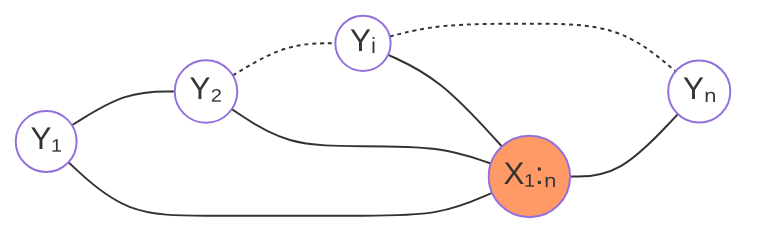
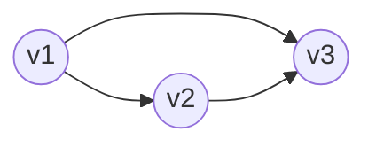
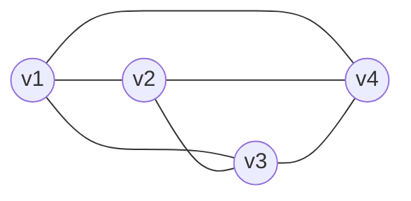
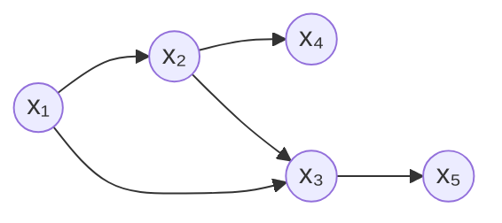
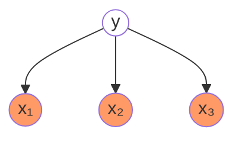
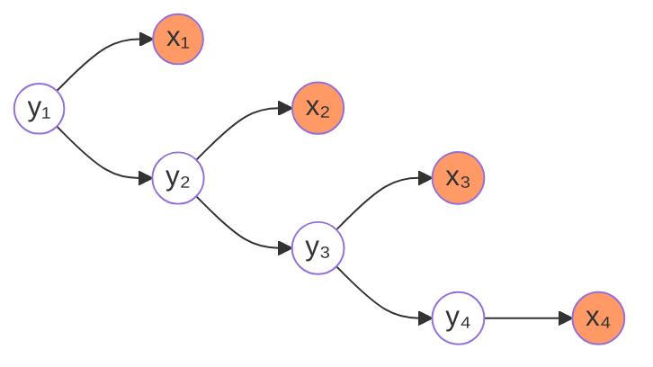
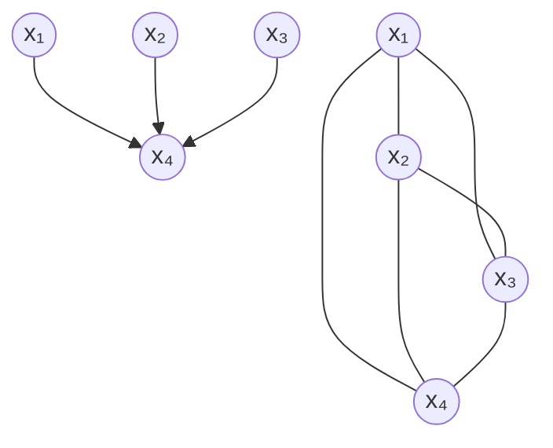

[TOC]
## 第 10 章 隐马尔可夫模型

**隐马尔可夫模型**（[Hidden Markov Model,HMM](https://en.jinzhao.wiki/wiki/Hidden_Markov_model)）是可用于**标注问题**的统计学习模型，描述由隐藏的马尔可夫链随机生成观测序列的过程，属于生成模型。

马尔可夫模型是关于时序的概率模型，描述由一个隐藏的马尔可夫链随机生成**不可观测的状态随机序列**，再由各个状态生成一个观测而产生观测随机序列的过程。
隐藏的马尔可夫链随机生成的状态的序列，称为**状态序列**（state sequence）；每个状态生成一个观测，而由此产生的观测的随机序列，称为**观测序列**（observation sequence）。序列的每一个位置又可以看作是一个时刻。

隐马尔可夫模型由初始概率分布、状态转移概率分布以及观测概率分布确定。
隐马尔可夫模型的形式定义如下：
设 Q 是所有可能的状态的集合，N 是可能的状态数；V 是所有可能的观测的集合，M 是可能的观测数。
$$Q = \{q_1,q_2,...,q_N\} , V= \{v_1,v_2,...,v_M\}$$
长度为 T 的状态序列$I = (i_1,i_2,...,i_T)$以及与状态序列对应的长度为 T 的观测序列$O = (o_1,o_2,...,o_T)$

**状态转移矩阵(状态转移概率分布)**：（就是初始化参数[transmat_prior](https://hmmlearn.readthedocs.io/en/latest/api.html#hmmlearn-hmm)，也可以用 params 和求出的属性 transmat_）
$$A=[a_{ij}]_{N\times N}$$
其中$a_{ij} = P(i\_{t+1} = q_j | i_t = q_i) ,下标 i,j = 1,...,N$表示在时刻$t$处于状态$q_i$的条件下 在时刻$t+1$转移到状态$q_j$的概率

**观测矩阵(观测概率分布)**：（对于 MultinomialHMM 用 params 和求出的属性 emissionprob_，叫发生概率矩阵；对于 GMMHMM 有 n_mix 、means_prior、covars_prior ；对于 GaussianHMM 有 means_prior、covars_prior ）
$$B = [b_j(k)]_{N \times M}$$
其中$b_j(k) = P(o_t = v_k | i_t = q_j) ,k = 1,...,M,j = 1,...,N$表示在时刻$t$处于状态$q_j$的条件下生成观测$v_k$的概率

**初始状态概率向量（初始概率分布）**：（就是初始化参数[startprob_prior](https://hmmlearn.readthedocs.io/en/latest/api.html#hmmlearn-hmm)和求出的属性 startprob\_ ）
$$\pi = (\pi_i)$$
其中$\pi_i = P(i_1 =q_i) ,下标i = 1,...,N$表示时刻$t=1$时 处于状态$q_i$的概率

隐马尔可夫模型由初始状态概率向量$\pi$、状态转移概率矩阵$A$和观测概率矩阵$B$决定。
$\pi$和$A$决定状态序列，$B$决定观测序列。
因此，**一个隐马尔可夫模型**可以用三元符号表示，即
$$\lambda = (A,B,\pi)$$
称为隐马尔可夫模型的三要素。

状态转移概率矩阵$A$与初始状态概率向量$\pi$确定了隐藏的马尔可夫链，生成不可观测的状态序列。观测概率矩阵$B$确定了如何从状态生成观测，与状态序列综合确定了如何产生观测序列。

从定义可知，隐马尔可夫模型作了**两个基本假设**：

1. **齐次马尔可夫性假设**，即假设隐藏的马尔可夫链在任意时刻 t 的状态只依赖于其前一时刻的状态，与其他时刻的状态及观测无关，也与时刻 t 无关。
   $$P(i_{t}|i_{t-1},o_{t-1},...,i_{1},o_{1}) = P(i_{t}|i_{t-1}), t=1,2,...,T$$
1. **观测独立性假设**，即假设任意时刻的观测只依赖于该时刻的马尔可夫链的状态，与其他观测及状态无关。
   $$P(o_{t}|i_{T},o_{T},i_{T-1},o_{T-1},...,i_{t+1},o_{t+1},i_{t},o_{t},i_{t-1},o_{t-1},...,i_{1},o_{1}) = P(o_{t}|i_{t})$$

隐马尔可夫模型的**三个基本问题**：

1. 概率计算问题。给定模型$\lambda = (A,B,\pi)$和观测序列$O = (o_1,o_2,...,o_T)$，计算在模型$\lambda$下观测序列$O$出现的概率$P(O|\lambda)$。

1. 学习问题。已知观测序列$O = (o_1,o_2,...,o_T)$，估计模型$\lambda = (A,B,\pi)$参数，使得在该模型下观测序列概率$P(O|\lambda)$最大。即用极大似然估计的方法估计参数。（$\lambda_{MLE}=\argmax_{\lambda}P(O|\lambda)$，使用 EM 算法求解。）

1. 预测问题，也称为解码（decoding）问题。已知模型$\lambda = (A,B,\pi)$和观测序列$O = (o_1,o_2,...,o_T)$，求对给定观测序列条件概率$P(I|O)$最大的状态序列$I = (i_1,i_2,...,i_T)$。即给定观测序列，求最有可能的对应的状态序列。（Viterbi 算法求$\hat{I}=\argmax_{I}P(I|O,\lambda)$）

**概率计算问题**：
引入隐变量，对完全数据建模(这里还是一样$P(O|\lambda),P(O;\lambda)$是一样的，$\lambda$是参数)
$$P(O|\lambda) = \sum_{I}P(O,I|\lambda)= \sum_{I}P(O|I,\lambda)P(I|\lambda)$$
根据乘法规则（概率论基础教程 51 页，注意$P(i_1|\lambda) = P(i_1)$）以及马尔可夫假设有：
$$P(I|\lambda) = P(i_1,i_2,...,i_T|\lambda)=P(i_1).P(i_2|i_1,\lambda).P(i_3|i_1,i_2,\lambda)...P(i_T|i_1,i_2,...,i_{T-1},\lambda) \\= P(i_1)\prod_{t=2}^T P(i_t|i_1,i_2,...,i_{t-1},\lambda) \\= P(i_1)\prod_{t=2}^T P(i_t|i_{t-1},\lambda) \\= \pi_{i_1}\prod_{t=2}^T a_{i_{t-1}i_{t}}$$
根据乘法规则以及观测独立性假设有：
$$P(O|I,\lambda) = P(o_1,o_2,...,o_T|i_1,i_2,...,i_{T},\lambda) \\= P(o_1|i_1,i_2,...,i_{T},\lambda).P(o_2|o_1,i_1,i_2,...,i_{T},\lambda).P(o_3|o_1,o_2,i_1,i_2,...,i_{T},\lambda)...P(o_T|o_1,o_2,...,o_{T-1},i_1,i_2,...,i_{T},\lambda) \\ = P(o_1|i_1,\lambda).P(o_2|i_2,\lambda)...P(o_T|i_T,\lambda) \\= \prod_{t=1}^Tb_{i_t}(o_t)$$
那么

$$
P(O,I|\lambda) = P(O|I,\lambda)P(I|\lambda) = \pi_{i_1}\prod_{t=2}^T a_{i_{t-1}i_{t}}\prod_{t=1}^Tb_{i_t}(o_t)
\\= \pi_{i_1}b_{i_1}(o_1) .a_{i_1i_2}b_{i_2}(o_2)...a_{i_{T-1}i_T}b_{i_T}(o_T) = \pi_{i_1}b_{i_1}(o_1)\prod_{t=2}^T a_{i_{t-1}i_{t}}b_{i_t}(o_t)
$$

**概率计算问题- 直接由上面计算概率**可得
$$P(O|\lambda) = \sum_{I}P(O,I|\lambda)= \sum_{I}P(O|I,\lambda)P(I|\lambda) \\= \sum_{i_1,i_2,...,i_T} \pi_{i_1}b_{i_1}(o_1)\prod_{t=2}^T a_{i_{t-1}i_{t}}b_{i_t}(o_t) \\= \sum_{i_1 \in N}...\sum_{i_T\in N} \pi_{i_1}b_{i_1}(o_1)\prod_{t=2}^T a_{i_{t-1}i_{t}}b_{i_t}(o_t) $$
时间复杂度$O(TN^{T})$，所以不可行。

上面说过直接求不好求，有以下方法可求得：
**概率计算问题- 前向计算**：
首先我们定义**前向概率**$\alpha_t(i) = P(o_1,o_2,...,o_t,i_t=q_i | \lambda)$，表示时刻$t$部分观测序列为$o_1,o_2,...,o_t$且状态为$q_i$的概率，那么
$$P(O|\lambda) = \sum_{i=1}^N P(O,i_T=q_i|\lambda) = \sum_{i=1}^N P(o_1,...,o_T,i_T=q_i|\lambda) = \sum_{i=1}^N \alpha_T(i)$$

> 其实$P(O|\lambda) = \sum_{j=1}^N P(O,i_1=q_j|\lambda) =...= \sum_{j=1}^N P(O,i_t=q_j|\lambda) = \sum_{i=1}^N\sum_{j=1}^N P(O,i_1=q_i,i_2=q_j|\lambda)$，注意这里是小 t，只不过我们定义了前向概率，并且$O=(o_1,...,o_T)$

所以我们只要求出$\alpha_T(i)$，如何求？依次$\alpha_1(i) ... \alpha_{t+1}(i) ... \alpha_T(i)$

$$\alpha_1(i) = P(o_1,i_1=q_i | \lambda) =P(i_1=q_i | \lambda)P(o_1|i_1=q_i , \lambda) = \pi_ib_i(o_1) \\  \vdots\\ \alpha_{t+1}(i) = P(o_1,o_2,...,o_t,o_{t+1},i_{t+1}=q_i | \lambda)  \\=\sum_{j=1}^N P(o_1,o_2,...,o_t,o_{t+1},i_{t+1}=q_i,i_{t}=q_j | \lambda) \\ =\sum_{j=1}^NP(o_{t+1}|o_1,..,o_t,i_{t+1}=q_i,i_{t}=q_j,\lambda)P(o_1,o_2,...,o_t,i_{t+1}=q_i,i_{t}=q_j | \lambda) \\=\sum_{j=1}^NP(o_{t+1}|i_{t+1}=q_i)P(o_1,o_2,...,o_t,i_{t+1}=q_i,i_{t}=q_j | \lambda)  \\= \sum_{j=1}^NP(o_{t+1}|i_{t+1}=q_i)P(i_{t+1}=q_i | o_1,o_2,...,o_t,i_{t}=q_j,\lambda)P(o_1,o_2,...,o_t,i_{t}=q_j | \lambda)  \\=\sum_{j=1}^NP(o_{t+1}|i_{t+1}=q_i)P(i_{t+1}=q_i | i_{t}=q_j,\lambda)P(o_1,o_2,...,o_t,i_{t}=q_j | \lambda) \\=\sum_{j=1}^NP(o_{t+1}|i_{t+1}=q_i)P(i_{t+1}=q_i | i_{t}=q_j,\lambda)\alpha_t(j) \\= P(o_{t+1}|i_{t+1}=q_i)\sum_{j=1}^NP(i_{t+1}=q_i | i_{t}=q_j,\lambda)\alpha_t(j) \\= \bigg[\sum_{j=1}^N\alpha_t(j)a_{ji} \bigg]  b_i(o_{t+1})$$

**概率计算问题- 后向计算**：
首先我们定义**后向概率**$\beta_t(i) = P(o_{t+1},o_{t+2},...,o_T|i_t=q_i , \lambda)$，表示时刻状态为$q_i$的条件下，从$t+1$到$T$的部分观测序列为$o_{t+1},o_{t+2},...,o_T$概率，那么
$$P(O|\lambda) = \sum_{i=1}^N P(O,i_1=q_i|\lambda) = \sum_{i=1}^N P(o_1,...,o_T,i_1=q_i|\lambda) \\= \sum_{i=1}^N P(o_1,...,o_T|i_1=q_i,\lambda)P(i_1=q_i|\lambda) \\= \sum_{i=1}^N P(o_1|o_2,...,o_T,i_1=q_i,\lambda)P(o_2,...,o_T|i_1=q_i,\lambda)P(i_1=q_i|\lambda) \\ = \sum_{i=1}^N P(o_1|i_1=q_i,\lambda)P(o_2,...,o_T|i_1=q_i,\lambda)P(i_1=q_i|\lambda) \\= \sum_{i=1}^N b_i(o_1)\beta_1(i)\pi_i$$
所以我们只要求出$\beta_1(i)$，如何求？依次$\beta_T(i) ... \beta_1{t-1}(i) ... \beta_1(i)$

$$\beta_T(i) = P(i_T = q_i,\lambda) = 1 \\ \vdots \\ \beta_t(i) = P(o_{t+1},o_{t+2},...,o_T|i_t=q_i , \lambda) \\= \sum_{j=1}^N P(o_{t+1},o_{t+2},...,o_T,i_{t+1}=q_j|i_t=q_i , \lambda) \\= \sum_{j=1}^N P(o_{t+1},o_{t+2},...,o_T|i_{t+1}=q_j,i_t=q_i , \lambda) P(i_{t+1}=q_j|i_t=q_i , \lambda) \\ 条件前面没有o_t(根据概率图也能得出给定i_{t+1}时，i_t与o_{t+1},...,o_T无关) \\= \sum_{j=1}^N P(o_{t+1},o_{t+2},...,o_T|i_{t+1}=q_j, \lambda) P(i_{t+1}=q_j|i_t=q_i , \lambda) \\= \sum_{j=1}^N P(o_{t+1}|o_{t+2},...,o_T,i_{t+1}=q_j, \lambda)P(o_{t+2},...,o_T|i_{t+1}=q_j, \lambda) P(i_{t+1}=q_j|i_t=q_i , \lambda)\\= \sum_{j=1}^N P(o_{t+1}|i_{t+1}=q_j, \lambda)P(o_{t+2},...,o_T|i_{t+1}=q_j, \lambda) P(i_{t+1}=q_j|i_t=q_i , \lambda) \\ =\sum_{j=1}^N b_j(o_{t+1}) \beta_{t+1}(j) a_{ij}$$

- **模型**：
  $$P(O|\lambda) = \sum_{I}P(O,I|\lambda) = \sum_{I}P(O|I,\lambda)P(I|\lambda)$$

- **策略**：
  $$\argmax_{\lambda} P(O|\lambda)$$

- **算法**：
  Baum-Welch 算法，其实就是 EM 算法的一个实现
  根据 EM 算法得 Q 函数
  $$Q(\lambda,\={\lambda}) = \sum_{I} \log P(O,I|\lambda) P(I|O,\={\lambda}) = \sum_{I} \log P(O,I|\lambda) P(I,O|\={\lambda}).\frac{1}{P(O|\={\lambda})}$$
  因为我们要求$\lambda$,而$1/{P(O|\={\lambda})}$对于$\lambda$而言，可以看作常数，所以
  $$Q(\lambda,\={\lambda}) =\sum_{I} \log P(O,I|\lambda) P(I,O|\={\lambda})$$
  因为
  $$P(O,I|\lambda) = \sum_{I} \pi_{i_1}b_{i_1}(o_1)\prod_{t=2}^T a_{i_{t-1}i_{t}}b_{i_t}(o_t)  = \sum_{I} \pi_{i_1}\prod_{t=2}^T a_{i_{t-1}i_{t}}\prod_{t=1}^T b_{i_t}(o_t) $$
  所以
  $$Q(\lambda,\={\lambda}) = \sum_{I}\bigg[ \log\pi_{i_1}+ \sum_{t=2}^T\log a_{i_{t-1}i_{t}} + \sum_{t=1}^T \log b_{i_t}(o_t) \bigg]P(I,O|\={\lambda})$$
  这里我们以求$\pi$（概率向量）为例子（A,B就不推导了,参见[一站式解决：隐马尔可夫模型（HMM）全过程推导及实现](https://zhuanlan.zhihu.com/p/85454896)），发现只有一项与$\pi$有关系
  $$\pi^{(t+1)} = \argmax_{\pi} Q(\lambda,\lambda^{(t)}) \\= \argmax_{\pi} \sum\_{I}\bigg[ \log\pi_{i_1}P(I,O|\lambda^{(t)})\bigg] \\= \argmax_{\pi} \sum_{i_1}\sum_{i_2}...\sum_{i_T}\bigg[ \log\pi_{i_1}P(i_1,i_2,...,i_T,O|\lambda^{(t)})\bigg] \\ 我们观察一下，发现边缘分布 可以只保留一项来计算\\ =\argmax_{\pi} \sum_{i_1}\bigg[ \log\pi_{i_1}P(i_1,O|\lambda^{(t)})\bigg] \\ 我们把 i_1 替换掉 \\ =\argmax_{\pi} \sum_{j=1}^N \bigg[ \log\pi_{j}P(i_1 = q_j,O|\lambda^{(t)})\bigg]$$
  我们知道$\pi = (\pi_1,..,\pi_N)$是概率向量，$ \sum_{j=1}^N \pi_{j} =1$，利用拉格朗日乘子法，写出拉格朗日函数：
  $$L(\pi,\gamma) = \sum_{j=1}^N \bigg[ \log\pi_{j}P(i_1 = q_j,O|\lambda^{(t)})\bigg] + \gamma\bigg(\sum_{j=1}^N \pi_{j} -1\bigg)$$
  求其中一个分量$\pi_j$，则对其求偏导，令偏导数为0得：
  $$\frac{\partial L}{\partial \pi_j} = \frac{1}{\pi_j}P(i_1 = q_j,O|\lambda^{(t)})+\gamma = 0$$
  得
  $$P(i_1 = q_j,O|\lambda^{(t)}) + \gamma\pi_j=0$$
  那么
   $$\sum_{j=1}^N\bigg[P(i_1 = q_j,O|\lambda^{(t)}) + \gamma\pi_j \bigg]=0 \\ \Darr \\ P(O|\lambda^{(t)}) + \gamma = 0$$
   带入上面得到的式子中，有：
   $$\pi_j^{(t+1)} = \frac{P(i_1 = q_j,O|\lambda^{(t)})}{P(O|\lambda^{(t)})}$$
  式子中分母$P\left(X|\lambda^{\left(t\right)}\right)$可以根据前向算法和后向算法求解出来，就是当前参数下观测数据的概率。
  另外，利用定义的前向概率和后向概率，有：
  $$\begin{align} &\alpha_t\left(i\right)\beta_t\left(i\right)\\ &=P\left(x_i,x_2,\ldots,x_t,z_t=q_i|\lambda\right)P\left(x_T,x_{T-1},\ldots,x_{t+1}|z_t=q_i,\lambda\right)\\ &=P\left(x_i,x_2,\ldots,x_t|z_t=q_i,\lambda\right)P\left(x_T,x_{T-1},\ldots,x_{t+1}|z_t=q_i,\lambda\right)P\left(z_t=q_i|\lambda\right)\\ &=P\left(x_i,x_2,\ldots,x_T|z_t=q_i,\lambda\right)P\left(z_t=q_i|\lambda\right)\\ &=P\left(X,z_t=q_i|\lambda\right) \end{align}$$
  那么
  $$\pi_i^{\left(t+1\right)}=\frac{\alpha_1\left(i\right)\beta_1\left(i\right)}{P\left(X|\lambda^{\left(t\right)}\right)}$$

**预测问题，也称为解码（decoding）问题**：
维特比算法（[Viterbi algorithm](https://en.jinzhao.wiki/wiki/Viterbi_algorithm)）实际是用动态规划解隐马尔可夫模型预测问题，即用动态规划（[dynamic programming](https://en.jinzhao.wiki/wiki/Dynamic_programming)）求概率最大路径（最优路径），这里的最优路径就是最优状态序列$I$。

> 请参考书籍和[机器学习-白板推导系列(十四)-隐马尔可夫模型 HMM（Hidden Markov Model）](https://www.bilibili.com/video/BV1MW41167Rf?p=6)

这一类模型需要求解的问题的大体框架为：
其中$X$代表观测序列，$Z$代表隐变量序列，$\lambda$代表参数。

$$
\begin{cases}
   Representation &  \text{Probabilistic graphical model} \\
   Learning & \lambda_{MLE}=arg \underset{\lambda}{\max} P(X|\lambda)  \boxed{\text{Baum Welch Algorithm(EM)}}\\
   Inference & \begin{cases} Decoding & Z=arg\underset{Z}{\max}P(Z|X,\lambda) or P(z_1,z_2,\cdots,z_t|x_1,x_2,\cdots,x_t,\lambda) \boxed{\text{Viterbi Algorithm}}\\ \text{Prob of evidence} & P(X|\lambda)  \boxed{\text{Forward Algorithm,Backward Algorithm}} \\ Filtering & P(z_t|x_1,x_2,\cdots,x_t,\lambda) \boxed{\text{(online)Forward Algorithm}}\\ Smothing & P(z_t|x_1,x_2,\cdots,x_T,\lambda) \boxed{\text{(offline)Forward-Backward Algorithm}}\\Prediction & \begin{Bmatrix} P(z_{t+1},z_{t+2},...|x_1,x_2,\cdots,x_t,\lambda) \\ P(x_{t+1},x_{t+2},...|x_1,x_2,\cdots,x_t,\lambda) \end{Bmatrix} \boxed{\text{Forward Algorithm}} \end{cases}\\
\end{cases}
$$

[Filtering problem (stochastic processes)](<https://en.jinzhao.wiki/wiki/Filtering_problem_(stochastic_processes)>)：
[Smoothing problem (stochastic processes)](<https://en.jinzhao.wiki/wiki/Smoothing_problem_(stochastic_processes)>)

### 附加知识

#### 随机过程

**随机过程**（[Stochastic process](https://en.jinzhao.wiki/wiki/Stochastic_process)）：

设$(\Omega ,{\mathcal {F}},P)$为一个**概率空间**（[Probability space](https://en.jinzhao.wiki/wiki/Probability_space)）,$\Omega$ 为**样本空间**（[sample space](https://en.jinzhao.wiki/wiki/Sample_space)）， $\mathcal {F}$ 是（[Sigma-algebra](https://en.jinzhao.wiki/wiki/%CE%A3-algebra)），$P$ 是（[Probability measure](https://en.jinzhao.wiki/wiki/Probability_measure)）；
设$(S,\Sigma )$为可测量的空间（measurable space），$S$为随机变量的集合
$${\displaystyle \{X(t):t\in T\}} or {\displaystyle \{X(t,\omega ):t\in T\}}$$

其中$X(t)$是一个随机变量，（在自然科学的许多问题中$t$表示时间，那么$X(t)$表示在时刻$t$观察到的值）；$\omega \in \Omega$；$T$是指标集 or 参数集（index set or parameter set），一般表示时间或空间，如：离散$T=\{0,1,2,...\}$一般称为随机序列或时间序列，连续$T=[a,b] ,a可以取0或者 -\infty,b可以取+\infty$

映射$X(t,\omega):T \times \Omega \to R$，即$X(.,.)$是定义在$T \times \Omega$上的二元值函数;
$\forall t \in T$（固定$t \in T$）,$ X(t,.)$是定义在样本空间$\Omega $上的函数，称为**随机变量**; 
$\forall \omega \in \Omega$,映射$X(.,\omega):T \to S$（其实就是固定$\omega \in \Omega $，变成关于T的函数）,被称为**样本函数**（sample function）,特别是当$T$表示时间时，称为随机过程${\displaystyle \{X(t,\omega ):t\in T\}}$的**样本路径**（sample path）。

#### 傻傻分不清楚的马尔可夫

**马尔可夫性质**（[Markov property](https://en.jinzhao.wiki/wiki/Markov_property)）：
如果**随机过程**（[Stochastic process](https://en.jinzhao.wiki/wiki/Stochastic_process)）的未来状态的条件概率分布（以过去和现在值为条件）仅取决于当前状态，则随机过程具有马尔可夫性质；与此属性的过程被认为是**马氏**或**马尔可夫过程**（[Markov process](https://en.jinzhao.wiki/wiki/Markov_chain)）。最著名的马尔可夫过程是**马尔可夫链**（[Markov chain](https://en.jinzhao.wiki/wiki/Markov_chain)）。**布朗运动**（[Brownian motion](https://en.jinzhao.wiki/wiki/Brownian_motion)）是另一个著名的马尔可夫过程。马尔可夫过程是不具备记忆特质的（[Memorylessness](https://en.jinzhao.wiki/wiki/Memorylessness)）

**一阶 离散**
$${\displaystyle P(X_{n}=x_{n}\mid X_{n-1}=x_{n-1},\dots ,X_{0}=x_{0})=P(X_{n}=x_{n}\mid X_{n-1}=x_{n-1}).}$$

**m 阶 离散**
$${\displaystyle {\begin{aligned}&\Pr(X_{n}=x_{n}\mid X_{n-1}=x_{n-1},X_{n-2}=x_{n-2},\dots ,X_{1}=x_{1})\\={}&\Pr(X_{n}=x_{n}\mid X_{n-1}=x_{n-1},X_{n-2}=x_{n-2},\dots ,X_{n-m}=x_{n-m}){\text{ for }}n>m\end{aligned}}}$$

**时间齐次**（Time-homogeneous）
$${\displaystyle \Pr(X_{n+1}=x\mid X_{n}=y)=\Pr(X_{n}=x\mid X_{n-1}=y)}$$

**马尔可夫模型**（[Markov model](https://en.jinzhao.wiki/wiki/Markov_model)）：
.|System state is fully observable |System state is partially observable
---|---|---
System is autonomous |[Markov chain](https://en.jinzhao.wiki/wiki/Markov_chain) | [Hidden Markov model](https://en.jinzhao.wiki/wiki/Hidden_Markov_model)
System is controlled |[Markov decision process](https://en.jinzhao.wiki/wiki/Markov_decision_process) |[Partially observable Markov decision process](https://en.jinzhao.wiki/wiki/Partially_observable_Markov_decision_process)

马尔可夫模型是具有马尔可夫性假设的随机过程，最简单的马尔可夫模型是**马尔可夫链**（[Markov chain](https://en.jinzhao.wiki/wiki/Markov_chain)）

| .                                        | Countable state space（对应随机过程的离散$\Omega$）               | Continuous or general state space（对应随机过程的连续$\Omega$）                              |
| ---------------------------------------- | ----------------------------------------------------------------- | -------------------------------------------------------------------------------------------- |
| Discrete-time（对应随机过程的离散$T$）   | (discrete-time) Markov chain on a countable or finite state space | Markov chain on a measurable state space (for example, Harris chain)                         |
| Continuous-time（对应随机过程的连续$T$） | Continuous-time Markov process or Markov jump process             | Any continuous stochastic process with the Markov property (for example, the Wiener process) |

令$\{X_n|n=1,2,\cdots\}$是有限个或可数个可能值的随机过程。除非特别提醒，这个随机过程的可能值的集合都将记为非负整数集$\{0,1,2,\cdots\}$ 。
如果 $X_n=i$，那么称该过程在时刻 $t$ 在状态 $i$ ，并假设$P_{i,j}$ 称为(单步(one-step))**转移概率**(transition probability)，表示处在$i$状态的随机变量下一时刻处在$j$ 状态的概率，如果对所有的状态 $i_0,i_1,\cdots,i_{n-1},i,j$及任意$n\ge 0$ ，$P\{X_{n+1}=j|X_n=i,X_{n-1}=i_{n-1},\cdots,X_1=i_1,X_0=i_0\}=P_{i,j}$，这样的过程称为**马尔可夫链**(Markov chain)。

> 一个随机过程$\{X(t):t \geq 0\}$如果$t \in \mathbb{R}_+$则称为连续时间的马尔科夫链，如果$t \in \mathbb{N}_0$则称为离散时间的马尔科夫链

根据 $P_{i,j}$的定义显然有$P_{i,j}\ge0,\;i,j\ge0;\;\;\sum_{j=0}^\infty P_{i,j}=1,\;i=0,1,\cdots$,
用 $P_{i,j}$ 记录从 $i$ 到 $j$ 的(单步)**转移（概率）矩阵**（[transition matrix](https://en.jinzhao.wiki/wiki/Stochastic_matrix)）也称为**随机矩阵、概率矩阵、转移矩阵、替代矩阵或马尔可夫矩阵**：
$$\mathbf{P}_{i,j}=(P_{i_{n},i_{n+1}}) =\begin{bmatrix}P_{0,0}&P_{0,1}&P_{0,2}&\cdots\\P_{1,0}&P_{1,1}&P_{1,2}&\cdots\\\vdots&\vdots&\vdots\\P_{i,0}&P_{i,1}&P_{i,2}&\cdots\\\vdots&\vdots&\vdots\end{bmatrix}$$
现在定义 n 步(n-step)**转移概率**$P_{i,j}^n$ ：$P_{i,j}^n=P\{X_{n+k=j}|X_k=i\},\;n\ge 0,i,j\ge 0$

**右随机矩阵**是一个非负实数的方阵，每个行总和为 1。
**左随机矩阵**是一个非负实数的方阵，每个列的总和为 1。
**双随机矩阵**是一个非负实数的方阵，每个行和每个列的总和为 1。

假设$A$是马尔可夫矩阵，其性质有：

1. 矩阵$A$的 k 次幂$A^k$也是马尔可夫矩阵。
1. 至少有一个特征值为 1，其特征值在[-1,1]区间，特征值为 1 对应的特征向量$\pi$称为**平稳概率向量**（stationary probability vector）。
1. 对于任意**概率向量**（[Probability vector](https://en.jinzhao.wiki/wiki/Probability_vector)）或者**随机向量**$\pi_0$有$\lim_{k \to \infty} A^k \pi_0 = \pi$ （这里是在没有-1 特征值的情况下）。
1. 对于任意**概率向量**$\mu_0$有$\mu_1 = A \mu_0$也是概率向量。

特征值的求解：$\det(A-\lambda I)=0$

由于 $A$ 的每一列相加等于 1，所以 $A−I$ 的每一列相加等于 0，这也就是说 $A−I$ 的行是相关的，其行列式$\det(A-I)=0$为零，所以 $A−I$奇异矩阵，所以 1 是 $A$ 的一个特征值。

[对角化](https://en.jinzhao.wiki/wiki/Diagonalizable_matrix#Diagonalization) $A = P \Lambda P^{-1} $ （参见线性代数及其应用279页，特征值相同特征向量不一定相同）,其中$\Lambda$是由$A$的特征值组成的对角矩阵
$$\mu_k = A^k \mu_0 = (P \Lambda P^{-1})^k \mu_0 = P \Lambda^k P^{-1} \mu_0$$
不妨设 $A$的特征向量和相应的特征值分别为 ${x_1},...,{x_n}$和 $\lambda_1,...,\lambda_n$，可以用特征向量来做一组基，可以把空间中任何向量写成它的线性组合：$\mu_0 = c_1{x_1} + \cdots + c_n{x_n}$
那么：
$$A^k\mathbf{\mu_0} = A^kc_1\mathbf{x_1} + \cdots + A^kc_n\mathbf{x_n}\\ = c_1A^k\mathbf{x_1} + \cdots + c_nA^k\mathbf{x_n} \\= c_1A^{k-1}A\mathbf{x_1} + \cdots + c_nA^{k-1}A\mathbf{x_n} \\= c_1A^{k-1}\lambda_1\mathbf{x_1} + \cdots + c_nA^{k-1}\lambda_n\mathbf{x_n}\\=c_1\lambda_1^k\mathbf{x_1} + \cdots + c_n\lambda_n^k\mathbf{x_n}\\=\sum_{i=1}^n{c_i\lambda_i^k\bm{x_i}}$$

不妨令$\lambda_1=1$, 有$|\lambda_i|\leq 1$,那么：
$$\bm{u_\infty}=\lim_{k\to\infty}{A^k\bm{u_0}}=\lim_{k\to\infty}{\sum_{i=1}^k{c_i\lambda_i^k\bm{x_i}}}=c_1\bm{x_1}$$

因为$u_\infty$是概率向量，而特征值为 1 对应的特征向量也是概率向量，所以$c_1=1$，得到$\bm{u_\infty}=\bm{x_1}$

值得注意的是，除包含 $\lambda=1$ 的情形还包含 $\lambda=-1$ 的情形。
上式如果除$\lambda_1=1$还有$\lambda_2=-1$，那么就有：
$$\bm{u_\infty}=\lim_{k\to\infty}{\sum_{i=1}^k{c_i\lambda_i^k\bm{x_i}}}=c_1\bm{x_1}+(-1)^k c_2\bm{x_2}$$

得$\bm{u_\infty}=\bm{x_1}+(-1)^k\bm{x_2}$,此时$k$为奇数和偶数结果是不同的，造成的结果就是在两种结果之间反复横跳，永远达不到稳态。

如：
$$A=\begin{bmatrix}0&1\\1&0\\\end{bmatrix}$$
其特征值为$\lambda_1=1，\lambda_2=-1$

> 也可以参考第 21 章 PageRank 算法

#### 规划论

规划论又称数学规划,运筹学（[Operations research](https://en.jinzhao.wiki/wiki/Category:Operations_research)）的一个分支。 规划论是指在既定条件（约束条件）下，按照某一衡量指标（目标函数）在多种 方案中寻求最优方案（取最大或最小值）。规划论包括线性规划、非线性规划和动态规划等，是一种优化算法或方法（[Optimization algorithms and methods](https://en.jinzhao.wiki/wiki/Category:Optimization_algorithms_and_methods)）

数学优化（[Mathematical optimization](https://en.jinzhao.wiki/wiki/Category:Mathematical_optimization)）

[优化技术](https://en.jinzhao.wiki/wiki/Mathematical_optimization#Computational_optimization_techniques)：

- 优化算法 Optimization algorithms
  [优化算法列表](https://en.jinzhao.wiki/wiki/List_of_algorithms#Optimization_algorithms)

- 迭代方法 Iterative methods
  [Iterative method](https://en.jinzhao.wiki/wiki/Iterative_method)

- 全局收敛 Global convergence
- 启发式 Heuristics
  [Heuristic algorithm](<https://en.jinzhao.wiki/wiki/Heuristic_(computer_science)>)

**线性规划**：

当目标函数与约束条件都是线形的，则称为线性规划（[Linear programming](https://en.jinzhao.wiki/wiki/Linear_programming)‎）。

求解方法：图解法(graphical method)、单纯形法（[simplex algorithm](https://en.jinzhao.wiki/wiki/Simplex_algorithm)）、对偶单纯形法等

**非线性规划**：

除去线性规划，则为非线性规划（[Nonlinear programming](https://en.jinzhao.wiki/wiki/Nonlinear_programming)）。其中，凸规划（前面的章节有讲到凸优化）、二次规划（[Quadratic programming](https://en.jinzhao.wiki/wiki/Quadratic_programming)）、几何规划都是一种特殊的非线性规划。

求解方法：拉格朗日乘子法、可行方向法、制约函数法(constrained function method )等。

内点法([Interior point methods](https://en.jinzhao.wiki/wiki/Interior-point_method))是一种求解线性规划或非线性凸优化问题的算法。

**无约束优化问题**：

去除带约束的规划问题，则为无约束优化问题（Unconstrained convex optimization，对应的有约束优化（[Constrained optimization](https://en.jinzhao.wiki/wiki/Constrained_optimization)））。

求解方法： 1、 最速下降法(也叫梯度下降) 2、 共轭梯度下降 3、 牛顿法 4、 拟牛顿法

**动态规划**：

若规划问题与时间有关，则称为动态规划（[Dynamic programming‎](https://en.jinzhao.wiki/wiki/Dynamic_programming)）；

> 把多阶段过程转化为一系列单阶段问题，逐个求解，解决这类问题的方法称为动态规划，它是一种方法、考察问题的一种途径，但不是一种特殊的算法。 没有统一的标准模型，也没有构造模型的通用方法，甚至还没有判断一个问题能否构造动态规划模型的准则。这样就只能对每类问题进行具体分析，构造具体的模型。对于较复杂的问题在选择状态、决策、确定状态转移规律等方面需要丰富的想象力和灵活的技巧性，这就带来了应用上的局限性。

动态规划一般可分为线性动规，区域动规，树形动规，背包动规（[Knapsack problem](https://en.jinzhao.wiki/wiki/Knapsack_problem)）四类。
线性动规：拦截导弹，合唱队形，挖地雷，建学校，剑客决斗等；
区域动规：石子合并， 加分二叉树，统计单词个数，炮兵布阵等；
树形动规：贪吃的九头龙，二分查找树，聚会的欢乐，数字三角形等；
背包问题：背包问题，完全背包问题，分组背包问题，二维背包，装箱问题，挤牛奶

**随机规划**：

若规划问题与随机变量有关，则称为随机规划（[Stochastic programming](https://en.jinzhao.wiki/wiki/Stochastic_programming)）。

**随机动态规划**：

[Stochastic dynamic programming](https://en.jinzhao.wiki/wiki/Stochastic_dynamic_programming)

**组合规划**：

若规划问题与有限个事物的排列组合有关，则称为组合规划([combinatorial optimization](https://en.jinzhao.wiki/wiki/Combinatorial_optimization))

### 参考文献

[10-1] Rabiner L,Juang B. [An introduction to hidden markov Models](http://ai.stanford.edu/~pabbeel/depth_qual/Rabiner_Juang_hmms.pdf). IEEE ASSPMagazine,January 1986

[10-2] Rabiner L. [A tutorial on hidden Markov models and selected applications in speechrecognition](https://courses.physics.illinois.edu/ece417/fa2017/rabiner89.pdf). Proceedings of IEEE,1989

[10-3] Baum L,et al. [A maximization technique occuring in the statistical analysis of probabilistic functions of Markov chains](https://projecteuclid.org/download/pdf_1/euclid.aoms/1177697196). Annals of Mathematical Statistics,1970,41: 164–171

[10-4] Bilmes JA. [A gentle tutorial of the EM algorithm and its application to parameter estimation for Gaussian mixture and hidden Markov models](https://people.ece.uw.edu/bilmes/p/mypubs/bilmes1997-em.pdf).

[10-5] Lari K,Young SJ. Applications of stochastic context-free grammars using the Inside-Outside algorithm,Computer Speech & Language,1991,5(3): 237–257

[10-6] Ghahramani Z. [Learning Dynamic Bayesian Networks](https://courses.cs.duke.edu//compsci662/current/pdf/ghahramani.1998.pdf). Lecture Notes in ComputerScience,Vol. 1387,1997,168–197

以下来自[隐马尔可夫模型](http://infolab.stanford.edu/~jiali/hmm.html)

[10-7] J. Li, A. Najmi, R. M. Gray, `Image classification by a two dimensional hidden Markov model`,IEEE Transactions on Signal Processing , 48(2):517-33, February 2000. [2-D HMM] ([download](http://www.stat.psu.edu/~jiali/pub/sp00.pdf))

[10-8] J. Li, R. M. Gray, R. A. Olshen, `Multiresolution image classification by hierarchical modeling with two dimensional hidden Markov models`, IEEE Transactions on Information Theory , 46(5):1826-41, August 2000. [2-D MHMM] ([download](http://www.stat.psu.edu/~jiali/pub/it00.pdf))

[10-9] J. Li, W. Miller, `Significance of inter-species matches when evolutionary rate varies`, Journal of Computational Biology , 10(3-4):537-554, 2003. [HMMMO] ([download](http://www.stat.psu.edu/~jiali/pub/jcb03.pdf))

[10-10] J. Li, J. Z. Wang, `Studying digital imagery of ancient paintings by mixtures of stochastic models`, IEEE Transactions on Image Processing, 12(3):340-353, 2004. [Mixture of 2-D MHMMs] ([download](http://www-db.stanford.edu/~wangz/project/imsearch/ART/TIP03/li_ip.pdf))

## 第 11 章 条件随机场
**条件随机场**（[Conditional random field, CRF](https://en.jinzhao.wiki/wiki/Conditional_random_field)）条件随机场(CRFs)是一类常用的统计建模方法（[statistical modeling methods](https://en.jinzhao.wiki/wiki/Statistical_model)），常用于模式识别（[pattern recognition](https://en.jinzhao.wiki/wiki/Pattern_recognition)）和机器学习，并用于结构预测（[structured prediction](https://en.jinzhao.wiki/wiki/Structured_prediction)）。

相关的机器学习库有[PyStruct](https://github.com/pystruct/pystruct)和[python-crfsuite](https://github.com/scrapinghub/python-crfsuite)

这里推荐学习：[机器学习-白板推导系列(十七)-条件随机场CRF（Conditional Random Field）](https://www.bilibili.com/video/BV19t411R7QU) 以及论文[Conditional Random Fields: Probabilistic Models for Segmenting and Labeling Sequence Data](https://repository.upenn.edu/cgi/viewcontent.cgi?article=1162&context=cis_papers)

条件随机场是在无向图上的判别模型。

条件随机场是给定一组输入随机变量条件下另一组输出随机变量的条件概率分布模型，其特点是假设输出随机变量构成马尔可夫随机场。
条件随机场可以用于不同的预测问题，本书仅论及它在标注问题的应用。因此主要讲述线性链（linear   chain）条件随机场，这时，问题变成了由输入序列对输出序列预测的判别模型，形式为对数线性模型，其学习方法通常是极大似然估计或正则化的极大似然估计。

**条件随机场**（conditional  random  field）是给定随机变量X条件下，随机变量Y的马尔可夫随机场。
设$X$与$Y$是随机变量，$P(Y|X)$是在给定X的条件下$Y$的条件概率分布。若随机变量$Y$构成一个由无向图$G＝(V,E)$表示的马尔可夫随机场，即
$$p(\boldsymbol{Y}_v |\boldsymbol{X}, \boldsymbol{Y}_w, w \neq v) = p(\boldsymbol{Y}_v |\boldsymbol{X}, \boldsymbol{Y}_w, w \sim v)$$
对任意结点$v$成立，则称条件概率分布$P(Y|X)$为条件随机场。式中$w \sim v$表示在图$G＝(V,E)$中与结点$v$有边连接的所有结点$w$，$w \neq v$表示结点$v$以外的所有结点，$Y_v$，$Y_u$与$Y_w$为结点$v$，$u$与$w$对应的随机变量。

**线性链条件随机场**（linear chain conditional random field）假设X和Y有相同的图结构。
> 条件随机场在定义中并没有要求X和Y具有相同的结构。现实中，一般假设X和Y有相同的图结构。

设$X＝(X_1,X_2,...,X_n)，Y＝(Y_1，Y_2,...,Y_n)$均为线性链表示的随机变量序列，若在给定随机变量序列$X$的条件下，随机变量序列$Y$的条件概率分布$P(Y|X)$构成条件随机场，即满足马尔可夫性
$$P(Y_i|X,Y_1,...,Y_{i-1},Y_{i+1},...,Y_n) = P(Y_i|X,Y_{i-1},Y_{i+1})\\ i=1,2,...,n(当i=1和n时只考虑单边)$$
则称$P(Y|X)$为线性链条件随机场。

线性链条件随机场可以用于标注等问题。
在标注问题中，$X$表示输入观测序列，$Y$表示对应的输出标记序列或状态序列。

这时，在条件概率模型P(Y|X)中，Y是输出变量，表示标记序列，X是输入变量，表示需要标注的观测序列。也把标记序列称为状态序列。
学习时，利用训练数据集通过极大似然估计或正则化的极大似然估计得到条件概率模型$\hat{P}(Y|X)$；
预测时，对于给定的输入序列x，求出条件概率$\hat{P}(Y|X)$最大的输出序列$\hat{y}$。

- **模型**：
根据无向图的因子分解，得：
$$P(Y|X) = \frac{1}{Z} exp\sum_{i=1}^K F_i(x_{ci})$$
根据CRF的概率无向图表示，我们可以将其实际的节点带入进去（最大团$y_{t-1},y_t,x_{1:T}$），有：
$$P(Y|X) = \frac{1}{Z} exp\sum_{t=1}^T F(y_{t-1},y_t,x_{1:T})$$
- **策略**：
- **算法**：

> 参考[【NLP】从隐马尔科夫到条件随机场](https://anxiang1836.github.io/2019/11/05/NLP_From_HMM_to_CRF/)

### 附加知识

#### 随机场

**随机场**（[Random field, RF](https://en.jinzhao.wiki/wiki/Random_field)）是由若干个位置组成的整体，当给每一个位置中按照某种分布（或者是某种概率）随机赋予一个值之后，其全体就叫做随机场。

以词性标注为例：

假如我们有10个词形成的句子需要做词性标注。这10个词每个词的词性可以在我们已知的词性集合（名词，动词…）中去选择。当我们为每个词选择完词性后，这就形成了一个随机场。

**马尔科夫随机场**（[Markov random field, MRF](https://en.jinzhao.wiki/wiki/Markov_random_field)）是随机场的特例，它假设随机场中某一个位置的赋值仅仅与和它相邻的位置的赋值有关，和与其不相邻的位置的赋值无关。
换一种表示方式，把马尔科夫随机场映射到无向图中。此无向图中的节点都与某个随机变量相关，连接着节点的边代表与这两个节点有关的随机变量之间的关系。
继续词性标注为例：（还是10个词的句子）
如果我们假设所有词的词性仅与和它相邻的词的词性有关时，这个随机场就特化成一个马尔科夫随机场。
比如第3个词的词性除了与自己本身的位置有关外，只与第2个词和第4个词的词性有关。

**条件随机场**(CRF)是马尔科夫随机场的特例，它假设马尔科夫随机场中只有𝑋和𝑌两种变量，𝑋一般是给定的，而𝑌一般是在给定𝑋的条件下我们的输出。这样马尔科夫随机场就特化成了条件随机场。

在我们10个词的句子词性标注的例子中，𝑋是词，𝑌是词性。因此，如果我们假设它是一个马尔科夫随机场，那么它也就是一个CRF。
对于CRF，我们给出准确的数学语言描述：
设𝑋与𝑌是随机变量，P(𝑌|𝑋)是给定𝑋时𝑌的条件概率分布，若随机变量𝑌构成的是一个马尔科夫随机场，则称条件概率分布P(𝑌|𝑋)是条件随机场。

**线性链条件随机场**(Linear-CRF)
注意在CRF的定义中，我们并没有要求𝑋和𝑌有相同的结构。当𝑋和𝑌有相同结构，即：
$$X=(x_1,x_2,…,x_T),Y=(y_1,y_2,…,y_T)$$
这个时候，𝑋和𝑌有相同的结构的CRF就构成了线性链条件随机场。

#### MEMM(Maximum Entropy Markov Model)
判别模型
[Maximum Entropy Markov Models for Information Extraction and Segmentation](http://www.ai.mit.edu/courses/6.891-nlp/READINGS/maxent.pdf)
[Maximum Entropy Markov Models](http://www.cs.cornell.edu/courses/cs778/2006fa/lectures/05-memm.pdf)
[Hidden Markov Model and Naive Bayes relationship](https://aman.ai/primers/ai/hmm-and-naive-bayes/)
[Maximum Entropy Markov Models and Logistic Regression](https://aman.ai/primers/ai/maximum-entropy-markov-models-and-logistic-reg/)

[Maximum-Entropy Markov Model](https://devopedia.org/maximum-entropy-markov-model)

MEMM与HMM

#### 概率图模型
介绍概率图模型（Probabilistic Graphical Model）之前，先简单了解下**结构学习**（[Structured Learning](https://en.jinzhao.wiki/wiki/Structured_prediction)），相比于回归，输出一个标量或者预测，输出一个向量，结构化学习的输出更加复杂，可以是图像，可以是语句，可以是树结构，等。
那么与概率图模型有什么关系呢？
概率图形模型形成了大量的结构化预测模型。特别是，贝叶斯网络和随机场很受欢迎。[参见](https://en.jinzhao.wiki/wiki/Structured_prediction#Techniques)

[什么是结构化学习？What is structured learning?](https://pystruct.github.io/intro.html#intro)
结构化预测是监督学习、分类和回归标准范式的概括。所有这些都可以被认为是找到一个函数来最小化训练集上的一些损失。区别在于使用的函数类型和损失。
在分类中，目标域是离散的类标签，损失通常是0-1的损失，即对误分类进行计数。在回归中，目标域是实数，损失通常是均方误差。在结构化预测中，目标域和损失或多或少都是任意的。这意味着目标不是预测标签或数字，而是可能更复杂的对象，如序列或图形。

**概率图模型**（[Probabilistic Graphical Model，PGM](https://en.jinzhao.wiki/wiki/Graphical_model)），简称图模型（Graphical Model，GM），是指一种用图结构来描述多元随机变量之间条件独立关系的概率模型，从而给研究高维空间中的概率模型带来了很大的便捷性。
很多机器学习模型都可以归结为概率模型，即建模输入和输出之间的条件概率分布．因此，图模型提供了一种新的角度来解释机器学习模型，并且这种角度有很多优点，比如了解不同机器学习模型之间的联系，方便设计新模型（Developing Bayesian networks）等．在机器学习中，图模型越来越多地用来设计和分析各种学习算法．

**图模型有三个基本问题**：
1. 表示（Representation）问题：对于一个概率模型，如何通过图结构来描述变量之间的依
赖关系．
1. 学习（Learning）问题：图模型的学习包括图结构的学习和参数的学习．在本章中，
我们只关注在给定图结构时的参数学习，即参数估计问题．
1. 推断（Inference）问题：在已知部分变量时，计算其他变量的条件概率分布

$$
\begin{cases}
   Representation(表示) &  \begin{cases} \text{有向图 Bayesian Network} \\ \text{无向图 Markov Network} \end{cases} \\
   Learning(学习) & \begin{cases} \text{参数学习} & \begin{cases} \text{完备数据} \\ \text{隐变量} \to EM \end{cases} \\ \text{结构学习} \end{cases}\\
   Inference(推断) & \begin{cases} \text{精确推断} \\ \text{近似推断} & \begin{cases} \text{确定性近似} \to 变分推断 \\ \text{随机近似} \to MCMC \end{cases} \end{cases} \\
\end{cases}
$$

**图的表示**：
图可以用$G=(V,E)$表示，$V$是顶点vertices(nodes or points)集合，
${\displaystyle E\subseteq \{(x,y)\mid (x,y)\in V^{2}\;{\textrm {and}}\;x\neq y\}}$是边的集合edges;对于有向图而言，边是有向的（directed edges, directed links, directed lines, arrows or arcs）它们是有序的顶点对，代表着方向;对于无向图而言，边是无向的。

也有些地方有向边一般用尖括号表示<>；而无向边一般用弧形括号表示（）；如：
有向图：
$$G1=(V,E) \\ V(G1)=\{v1,v2,v3\}\\  E(G1)=\{\braket{v1,v2},\braket{v1,v3},\braket{v2,v3}\}$$

无向图：
$$G2=(V,E) \\ V(G2)=\{v1,v2,v3,v4\} \\ E(G2)=\{(vl,v2),(v1,v3),(v1,v4),(v2,v3),(v2,v4),(v3,v4)\}$$

##### （概率）有向图模型
有向图模型（Directed Graphical Model）又称贝叶斯网络（[Bayesian Network](https://en.jinzhao.wiki/wiki/Bayesian_network)）或信念网络（Belief Network，BN）或（causal networks）是一类用有向图（[Directed Graphical](https://en.jinzhao.wiki/wiki/Graph_(discrete_mathematics)#Directed_graph)）来描述随机向量概率分布的模型．

> 这里是 有向无环图(DAG)

定义和概率 Definitions and concepts：
> parent 父节点
> descendants 后代
> non-descendants 非后代（不包括父代，也就是all-parent-descendants）

- **概率分布的分解（Factorization definition）**：
$X$是一个关于$G$的贝叶斯网络，如果$X$的联合概率分布(联合概率密度函数)可以写成【单个密度函数的乘积，条件是它们的父变量】也就是局部条件概率分布（Local Conditional Probability Distribution）的连乘形式（广义的一阶马可夫性质）:
$$p(X)=\prod _{v\in V}p\left(x_{v}\,{\big |}\,x_{\operatorname {pa} (v)}\right)$$
其中$x_{\operatorname {pa} (v)}$表示$x_{v}$的父亲节点集合。
如：

$X=x_1,x_2,x_3,x_4,x_5$
$V=\{x_1,x_2,x_3,x_4,x_5\}$
$E=\{\braket{x_1,x_2},\braket{x_1,x_3},\braket{x_2,x_3},\braket{x_2,x_4}\},\braket{x_3,x_5}$
$G=(V,E)$
有向图对应的概率分布可以分解为
$$p(X) = p(x_1,x_2,x_3,x_4,x_5) = p(x_1)p(x_2|x_1)p(x_3|x_1,x_2)p(x_4|x_2)p(x_5|x_3)$$

- **因果网络(Causal networks)**：
在贝叶斯网络中，如果两个节点是直接连接的，它们肯定是非条件独立的，是直接因果关系．父节点是“因”(tail)，子节点是“果”（也就是箭头指向的，也称head）$tail \rightarrow head (因\rightarrow 果)$。如果两个节点不是直接连接的，但可以由一条经过其他节点的路径来连接，那么这两个节点之间的**条件独立性**就比较复杂。
以三个节点的贝叶斯网络为例

Pattern|Model | 条件独立性
---|---|---
Chain（间接因果关系/tail to head）	|$X\rightarrow Y\rightarrow Z$ | 已知Y时,X和Z为条件独立，即 $X \perp \!\!\!\perp Z\mid Y$
Fork（共因关系/tail to tail）|$X\leftarrow Y\rightarrow Z$ | 已知Y时,X和Z为条件独立，即 $X \perp \!\!\!\perp Z \mid Y$ （Y未知时，X和Z为不独立）
Collider（共果关系/head to head）	|$X\rightarrow Y\leftarrow Z$ | 已知Y时,X和Z为不独立，即 $X \perp \!\!\!\perp \!\!\!\!\!\!/ \;\; Z \mid Y$（Y未知时，X和Z为独立）

- **局部马尔可夫性质（Local Markov property）**：
对一个更一般的贝叶斯网络，其局部马尔可夫性质为：每个随机变量在给定父节点的情况下，条件独立于它的非后代节点． 
$${\displaystyle X_{v}\perp \!\!\!\perp X_{V\,\smallsetminus \,\operatorname {de} (v)}\mid X_{\operatorname {pa} (v)}\quad {\text{for all }}v\in V}$$
其中$X_{V\,\smallsetminus \,\operatorname {de} (v)}$表示非后代集合

- **马尔可夫毯**（[Markov blanket](https://en.jinzhao.wiki/wiki/Markov_blanket)）：
在随机变量的全集U UU中，对于给定的变量$X\in U$和变量集$MB\subset U(X\notin MB)$，若有
$$X\perp \!\!\!\perp\{U-MB-\{X\}\}|MB$$
则称能满足上述条件的最小变量集$MB$为$X$的马尔可夫毯(Markov Blanket)。

- **D划分（d-separation）**：
d表示方向（directional）。p是u to v的去除方向的路径。p被一组节点Z分隔。
  - 如果p是这样的路径 ${\displaystyle u\cdots \leftarrow m\leftarrow \cdots v}$ or ${\displaystyle u\cdots \rightarrow m\rightarrow \cdots v}$ 并且$m \in Z$
  - 如果p是这样的路径 ${\displaystyle u\cdots \leftarrow m\rightarrow \cdots v}$ 并且$m \in Z$
  - 如果p是这样的路径 ${\displaystyle u\cdots \rightarrow m\leftarrow \cdots v}$ 并且$m \notin Z$
$$X_{u}\perp \!\!\!\perp X_{v}\mid X_{Z}$$

- **常见的有向图模型**：
如朴素贝叶斯分类器、隐马尔可夫模型、深度信念网络等
朴素贝叶斯：假设输入X有三个特征

由图可得
$$P(y,x_1,x_2,x_3) = P(y)P(x_1|y)P(x_2|y)P(x_3|y) = P(x_1,x_2,x_3|y)P(y) \\ \Darr\\  P(x_1,x_2,x_3|y)=P(x_1|y)P(x_2|y)P(x_3|y)$$
这不就是朴素贝叶斯的条件相互独立的假设么?$P(X|y) = \prod_{i=1}^n P(x_i|y)$
而这个独立假设太强了，每个特征之间没有任何关系（独立同分布i.i.d.）；
那么我们假设当前只与前一时刻有关，与其它无关，那么我们就有了Markov假设，如隐马尔可夫模型：
其中y为隐变量，x为观测变量

我们能从图中直接得到
$P(y_t|y_{t-1},...,y_1,x_{t-1},...,x_1) = P(y_t|y_{t-1})$，即Markov假设；
$P(x_t|x_{T},...,x_{t+1},x_{t-1},...,x_1,Y) = P(x_t|y_{t})$，即观测独立性假设；

##### （概率）无向图模型
无向图模型（Undirected Graphical Model）又称马尔可夫随机场（[Markov random field, MRF](https://en.jinzhao.wiki/wiki/Markov_random_field)）或马尔可夫网络（Markov network）是一类用无向图（[Undirected Graphical](https://en.jinzhao.wiki/wiki/Graph_(discrete_mathematics)#Undirected_graph)）来描述一组具有局部马尔可夫性质的随机向量𝑿的联合概率分布的模型．
以下定义是等价的
$$\text{Global Markov} \iff \text{Local Markov}\iff\text{Pair Markov}\xLeftrightarrow{Hammesley−Clifford } 因子分解$$

- **团分解，因子分解**（Clique factorization）：
无向图G中任何两个结点均有边连接的结点子集称为**团**（clique）。若C是无向图G的一个团，并且不能再加进任何一个G的结点使其成为一个更大的团，则称此C为**最大团**（maximal clique）。
将概率无向图模型的联合概率分布表示为其最大团上的随机变量的函数的乘积形式的操作，称为概率无向图模型的因子分解（factorization）。
给定概率无向图模型，设其无向图为G，随机变量${\displaystyle X=(X_{v})_{v\in V}}$，C为G上的最大团，$X_C$表示C对应的随机变量。那么概率无向图模型的联合概率分布$P(X)$可写作图中所有最大团C上的函数$\phi_C (x_C)$的乘积形式，即
$$P(X) =\frac{1}{Z} \prod_{C \in \operatorname{cl}(G)} \phi_C (X_C) $$
$$Z=\sum_{X}\prod_{C \in \operatorname{cl}(G)} \phi_C (X_C)$$
Z是规范化因子（normalization factor）或归一化因子也被称为配分函数（partition function）;
$\phi_C (X_C)$称为势函数（potential function or factor potentials or clique potentials），势函数要求是严格正的，通常定义为指数函数：
$$\phi_C (X_C) = \exp\{-E(X_C)\}$$
其中E为能量函数（energy function）。
实际上用这种形式表达的p(x)，为Gibbs Distribution，或者又被称之为Boltzman Distribution。可以写成：
$$P(x) = \frac{1}{Z} \prod_{i=1}^K \phi (x_{C_{i}}) = \frac{1}{Z} \prod_{i=1}^K \exp\{-E(x_{C_{i}})\} =  \frac{1}{Z}\exp\{-\sum_{i=1}^K E(x_{C_{i}})\} = \frac{1}{Z}\exp\sum_{i=1}^K F_i(x_{ci})，x \in \mathbb{R}^{p}$$
$x \in \mathbb{R}^p$是个联合概率分布，它的维度是$p$维；$\phi$表示势函数；$E$表示能量函数；$K$表示最大团的个数；$C_i$表示第$i$个最大团。
我们将指数族分布和势函数联系起来：
$${\displaystyle p(x\mid {\boldsymbol {\eta }})=h(x)\,\exp {\Big (}{\boldsymbol {\eta^T }}\cdot \mathbf {T} (x)-A({\boldsymbol {\eta }}){\Big )}} = h(x) \frac{1}{Z(\eta)}\exp\{\eta^T \cdot \mathbf {T} (x)\}$$
发现势函数(Gibbs Distribution)是一个指数族分布。Gibbs是来自统计物理学，形式上和指数族分布时一样的。而指数族分布实际上是由最大熵分布得到的，那么我们可以理解Gibbs分布也是有最大熵原理得到的。而马尔可夫随机场(Markov Random Field)实际上等价于Gibbs分布。即：
最大熵原理 ⇒ 指数族分布(Gibbs分布).
Markov Random Field ⇔ Gibbs Distribution.

- **成对马尔可夫性**（Pairwise Markov property）：
任意两个不相邻的变量在给定其他变量的条件下是独立的:${\displaystyle X_{u}\perp \!\!\!\perp X_{v}\mid X_{V\setminus \{u,v\}}}$
- **局部马尔可夫性**（Local Markov property）：
一个变量在给定其相邻变量的条件下是独立于所有其他变量:${\displaystyle X_{v}\perp \!\!\!\perp X_{V\setminus \operatorname {N} [v]}\mid X_{\operatorname {N} (v)}}$
其中$\operatorname {N} (v)$是v的邻居（neighbor）节点；${\displaystyle \operatorname {N} [v]=v\cup \operatorname {N} (v)}$
- **全局马尔可夫性**（Global Markov property）：
给定一个分离子集（separating subset），任意两个变量子集都是条件独立的:$X_A \perp\!\!\!\perp X_B \mid X_S$
A中的节点到B中的节点都要经过S；

- **道德图**（Moral graph）：
有向图和无向图可以相互转换，但将无向图转为有向图通常比较困难．在实际应用中，将有向图转为无向图更加重要，这样可以利用无向图上的精确推断算法，比如联合树算法（Junction Tree Algorithm）．
有向图转化成无向图的过程称为道德化（Moralization），转化后的无向图称为道德图（[Moral graph](https://en.jinzhao.wiki/wiki/Moral_graph)）。
每个有向图分解的因子要处于一个最大团中，如：
$$P(X) = p(x_1)p(x_2)p(x_3)p(x_4|x_1,x_2,x_3)$$
其中$p(x_4|x_1,x_2,x_3)$有四个变量，那么：

> 道德化的过程中，原有的一些条件独立性会丢失。

- **因子图**（Factor graph）：
这里不作介绍，目前不太明白用处。

- **常见的有向图模型**：
对数线性模型（最大熵模型）、条件随机场、玻尔兹曼机、受限玻尔兹曼机等．

> 以上内容只是讲到了概率图的表示。

### 参考文献

[11-1] Bishop M. Pattern Recognition and Machine Learning. Springer-Verlag,2006

[11-2] Koller D,Friedman N. Probabilistic Graphical Models: Principles and Techniques.MIT Press,2009

[11-3] Lafferty J,McCallum A,Pereira F. Conditional random fields: probabilistic models for segmenting and labeling sequence data. In: International Conference on Machine Learning,2001

[11-4] Sha F,Pereira F. Shallow parsing with conditional random fields. In: Proceedings ofthe 2003 Conference of the North American Chapter of Association for ComputationalLinguistics on Human Language Technology,Vol.1,2003

[11-5] McCallum A,Freitag D,Pereira F. Maximum entropy Markov models for informationextraction and segmentation. In: Proc of the International Conference on Machine Learning,2000

[11-6] Taskar B,Guestrin C,Koller D. Max-margin Markov networks. In: Proc of the NIPS2003,2003

[11-7] Tsochantaridis I,Hofmann T,Joachims T. Support vector machine learning forinterdependent and structured output spaces. In: ICML,2004

## 第 12 章 监督学习方法总结
