## 第 19 章 马尔可夫链蒙特卡罗法

**马尔可夫链蒙特卡罗**（[Markov Chain Monte Carlo, MCMC](https://en.jinzhao.wiki/wiki/Markov_chain_Monte_Carlo)）由两个MC组成，即**蒙特卡罗方法**（[Monte Carlo Simulation, MC](https://en.jinzhao.wiki/wiki/Monte_Carlo_method)）和**马尔可夫链**（[Markov Chain, MC](https://en.jinzhao.wiki/wiki/Markov_chain)）。

要弄懂MCMC的原理我们首先得搞清楚蒙特卡罗方法和马尔可夫链的原理。

马尔可夫链在前面的章节有讲到，再结合书中的内容。这里补充下几个知识：
**马尔可夫链的遍历定理**：
书中啰嗦了很多，我的理解是遍历足够多能达到平稳分布的马尔可夫链。并且达到任何一个状态的概率不能为0；（不可约，非周期且正常返）

**可逆马尔可夫链**（reversible Markov chain）：
设有马尔可夫链$X=\{X_0,X_1,...,X_t,...\}$，状态空间S，转移矩阵P，如果有状态分布$\pi = (\pi_1,\pi_2,...)^T$，对任意状态$i,j \in S$，对任意时刻t满足
$$P(X_t=i|X_{t-1}=j)\pi_j = P(X_{t-1}=j|X_t=i)\pi_i  ,\quad i,j =1,2,...$$
或者简写
$$p_{ij}\pi_j = p_{ji}\pi_i ,\quad i,j =1,2,...$$
则称此马尔可夫链为可逆马尔可夫链；简写的等式称为**细致平衡方程**（detailed balance equation），并且满足细致平衡方程的状态分布$\pi$就是该马尔可夫链的平稳分布（并不是所有的马尔可夫链都是可逆的）。
可逆马尔可夫链满足遍历定理。


**采样法**（[Sampling Method](https://en.jinzhao.wiki/wiki/Sampling_(statistics))）也称为蒙特卡罗方法（[Monte Carlo Method, MC](https://en.jinzhao.wiki/wiki/Monte_Carlo_method)）或统计模拟方法（Statistical Simulation  Method）

蒙特卡罗方法诞生于20 世纪 40 年代美国的“曼哈顿计划”，其名字来源于摩纳哥的一个以赌博业闻名的城市蒙特卡罗，象征概率．
蒙特卡罗方法是一种通过随机采样来近似估计一些计算问题**数值解**（Numerical solution与其对应的是闭式解Closed-form solution或解析解Analytical solution）的方法．

最早的蒙特卡罗方法都是为了求解一些不太好求解的求和或者积分问题。比如积分：$\theta = \int_a^b f(x)dx$ 或者估计$\pi$值或圆的面积（积分）。

我们可以通过蒙特卡罗方法来模拟求解近似值。如何模拟呢？

**随机采样**指从给定概率密度函数 𝑝(𝑥) 中抽取出符合其概率分布的样本．

随机采样 采样法的难点是如何进行随机采样，即如何让计算机生成满足概率密度函数 𝑝(𝑥) 的样本．我们知道，计算机可以比较容易地随机生成一个在 [0, 1]区间上均布分布的样本 𝜉．如果要随机生成服从某个非均匀分布的样本，就需要一些间接的采样方法．
如果一个分布的概率密度函数为 𝑝(𝑥)，其累积分布函数 cdf(𝑥) 为连续的严格增函数，且存在逆函数$cdf^{−1}(𝑦), 𝑦 ∈ [0, 1]$，那么我们可以利用**累积分布函数的逆函数**（inverse CDF）来生成服从该随机分布的样本．假设 𝜉 是 [0, 1] 区间上均匀分布的随机变量，则 $cdf^{−1}(\xi)$ 服从概率密度函数为𝑝(𝑥)的分布．但当 𝑝(𝑥) 非常复杂，其累积分布函数的逆函数难以计算，或者不知道 𝑝(𝑥)的精确值，只知道未归一化的分布 ̂𝑝(𝑥)时，就难以直接对𝑝(𝑥)进行采样，往往需要使用一些间接的采样策略，比如**拒绝采样、重要性采样、马尔可夫链蒙特卡罗采样**等．这些方法一般是先根据一个比较容易采样的分布进行采样，然后通过一些策略来间接得到符合𝑝(𝑥)分布的样本．

> rejection sampling, inverse CDF, Box-Muller,  Ziggurat algorithm

**拒绝采样**（Rejection Sampling）是一种间接采样方法，也称为接受-拒绝采样（Acceptance-Rejection Sampling）．
假设原始分布𝑝(𝑥)难以直接采样，我们可以引入一个容易采样的分布𝑞(𝑥)，一般称为提议分布（Proposal Distribution），然后以某个标准来拒绝一部分的样本使得最终采集的样本服从分布 𝑝(𝑥)。我们需要构建一个提议分布 𝑞(𝑥) 和一个常数 𝑘，使得 𝑘𝑞(𝑥) 可以覆盖函数𝑝(𝑥)，即𝑘𝑞(𝑥) ≥ 𝑝(𝑥),

对于每次抽取的样本 $\^{x}$ 计算接受概率（Acceptance Probability）：$\alpha(\^{x}) = \frac{p(\^{x})}{kq(\^{x})}$，并以概率$\alpha(\^{x})$)来接受样本 $\^{x}$

拒绝采样的采样过程
```
输入: 提议分布𝑞(𝑥)，常数𝑘，样本集合𝒱 = ∅;
1 repeat
2   根据𝑞(𝑥)随机生成一个样本 ;̂𝑥
3   计算接受概率𝛼( ̂𝑥);
4   从(0, 1)的均匀分布中随机生成一个值𝑧;
5   if 𝑧 ≤ 𝛼( ̂𝑥) then // 以𝛼(𝑥)̂ 的概率接受𝒙̂
6       𝒱 = 𝒱 ∪ { ̂𝑥};
7   end
8 until 获得 𝑁 个样本(|𝒱| = 𝑁);
输出: 样本集合𝒱
```

判断一个拒绝采样方法的好坏就是看其采样效率，即总体的接受率．如果函数𝑘𝑞(𝑥)远大于原始分布函数 ̂𝑝(𝑥)，拒绝率会比较高，采样效率会非常不理想．但要找到一个和 ̂𝑝(𝑥)比较接近的提议分布往往比较困难．特别是在高维空间中，其采样率会非常低，导致很难应用到实际问题中．

**重要性采样**（Importance sampling）
如果采样的目的是计算分布𝑝(𝑥)下函数𝑓(𝑥)的期望，那么实际上抽取的样本不需要严格服从分布 𝑝(𝑥)．也可以通过另一个分布，即提议分布 𝑞(𝑥)，直接采样并估计𝔼𝑝[𝑓(𝑥)]．
函数𝑓(𝑥)在分布𝑝(𝑥)下的期望可以写为
$$E_p[f(x)] = \int_x f(x)p(x)dx = \int_x f(x)\frac{p(x)}{q(x)}q(x)dx = \int_x f(x)w(x)q(x)dx = E_q[f(x)w(x)]$$
其中𝑤(𝑥)称为重要性权重．

重要性采样（Importance Sampling）是通过引入重要性权重，将分布 𝑝(𝑥)下𝑓(𝑥)的期望变为在分布𝑞(𝑥)下𝑓(𝑥)𝑤(𝑥)的期望，从而可以近似为
$$E_p[f(x)] = E_q[f(x)w(x)] =\frac{1}{N} \sum_{i=1}^N f(x_i)w(x_i) =\frac{1}{N} \sum_{i=1}^N f(x_i)\frac{p(x_i)}{q(x_i)}$$
其中$\{x_1,...,x_N\}$是独立从$q(x)$中随机采样来的（p(x)是已知的，只是不好采样，但是能计算）。

**马尔可夫链蒙特卡罗方法**
在高维空间中，拒绝采样和重要性采样的效率随空间维数的增加而指数降低．马尔可夫链蒙特卡罗（Markov Chain Monte Carlo，MCMC）方法是一种更好的采样方法，可以很容易地对高维变量进行采样．

假设多元随机变量$x$,满足$x \in \mathcal{X}$,其概率密度函数为$p(x)$；$f(x)$为定义在$x \in \mathcal{X}$上的函数，目标是获得概率分布$p(x)$的样本集合以及求函数$f(x)$的数学期望$E_{p(x)}[f(x)]$。

应用马尔可夫链蒙特卡罗法解决这个问题的**基本想法**是：
在随机变量$x$的状态空间$\mathcal{S}$上定义一个满足遍历定理的马尔可夫链$X=\{X_0,X_1,...,X_t,...\}$,使其平稳分布就是抽样的的目标分布$p(x)$（设计一个随机矩阵（连续随机变量就是转移核函数），使其平稳分布等于目标分布）。然后在这个马尔可夫链上进行随机游走，每个时刻得到一个样本。根据遍历定理，当时间趋于无穷时，样本的分布趋近平稳分布，样本的函数均值趋近函数的数学期望。所以，当时间足够长时（时刻大于某个正整数m），在之后的时间（时刻小于等于某个正整数n,n>m）里随机游走得到的样本集合$\left\{x_{m+1}, x_{m+2}, \cdots, x_{n}\right\}$就是目标概率分布的抽样结果，得到的函数均值就是要计算的数学期望值：
$$\hat{E} f=\frac{1}{n-m} \sum_{i=m+1}^{n} f\left(x_{i}\right)$$
从时刻0到时刻m为止的这段时间称为燃烧期（Burn-in Period）。燃烧期的样本也是要被丢弃的。

**基本步骤**
1. 首先，在随机变量$x$的状态空间$\mathcal{S}$上构造一个满足遍历定理的马尔可夫链，使其平稳分布为目标分布$p(x)$;
1. 从状态空间的某一点$x_0$出发，用构造的马尔可夫链进行随机游走，产生样本序列$x_0,x_1,...,x_t,...$。
1. 应用马尔可夫链的遍历原理，确定正整数m和n（m < n），得到样本集合$\{x_{m+1},x_{m+2},...,x_{n}\}$，求得函数$f(x)$的均值（遍历均值）
$$\hat{E} f=\frac{1}{n-m} \sum_{i=m+1}^{n} f\left(x_{i}\right)$$

这里有几个**重要问题**
1. 如何第一马尔可夫链，保证马尔可夫链蒙特卡罗法的条件成立。
1. 如何确定收敛步数$m$，保证样本抽样的无偏性。
1. 如何确定迭代步数$n$，保证遍历均值计算的精度。

**MCMC采样**
由于一般情况下，目标平稳分布 $\pi(x)$ 和某一个马尔科夫链状态转移矩阵 $Q$ 不满足细致平稳条件，即：

$$\pi(i)Q(i,j)\neq\pi(j)Q(j,i)$$

**这些记号表达同一个意思**： $Q(i,j)\Leftrightarrow Q(j|i)\Leftrightarrow Q(i\rightarrow j)$ （状态转移分布或提议分布）

我们引入一个 $\alpha(i,j)$ ,使上式可以取等号。

$$\pi(i)Q(i,j)\alpha(i,j)=\pi(j)Q(j,i)\alpha(j,i)$$

怎样才能成立呢，其实很简单，按照对称性：

$$\alpha(i,j)=\pi(j)Q(j,i); \pi(i)Q(i,j)=\alpha(j,i)$$

然后我们就可以得到了分布 $\pi(x)$ 对让马尔科夫链状态转移矩阵 $P(i,j)=Q(i,j)\alpha(i,j)$

其中 $\alpha(i,j)$ 一般称之为接受率，取值在 $[0,1]$ 之间，可以理解为一个概率值。这很像接受-拒绝采样，那里是以一个常用分布通过一定的接受-拒绝概率得到一个非常见分布， 这里是以一个常见的马尔科夫链状态转移矩阵 $Q$ 通过一定的接受-拒绝概率得到目标转移矩阵 $P$ ,两者的解决问题思路是类似的。

MCMC采样算法如下：
1. 输入任意给定的马尔科夫链状态转移矩阵 $Q$ ，目标平稳分布 $\pi(x)$ ，设定状态转移次数阈值 $n_1$ ，需要的样本数 $n_2$;
1. 从任意简单概率分布得到初始状态值 $x_0$ ；
1. for $t=0 ~in ~n_{1}+n_{2}-1$
    1. 从条件概率分布 $Q(x|x_{t})$ 得到样本值 $x_{*}$
    1. 从均匀分布中采样 $u\sim uniform[0,1]$
    1. 如果 $u<\alpha(x_{t},x_{*})=\pi(x_{*})Q(x_{*},x_{t})$ ，则接受 $x_{t}\rightarrow x_{*}$ ，即 $x_{t+1}= x_{*}$
    1. 否则不接受转移， 即$x_{t+1}= x_{t}$

上述过程中 $p(x),q(x|y)$ 说的都是离散的情形，事实上即便这两个分布是连续的，以上算法仍然是有效，于是就得到更一般的连续概率分布 $p(x)$ 的采样算法，而 $q(x|y)$ 就是任意一个连续二元概率分布对应的条件分布。

但是这个采样算法还是比较难在实际中应用，因为在第三步中，由于 $\alpha(x_{t},x_{*})$ 可能非常的小，比如0.1，导致我们大部分的采样值都被拒绝转移，采样效率很低。有可能我们采样了上百万次马尔可夫链还没有收敛，也就是上面这个 $n_1$ 要非常非常的大，这让人难以接受，怎么办呢？这时就轮到我们的M-H采样出场了。

**Metropolis-Hastings算法**：
M-H采样是Metropolis-Hastings采样的简称，这个算法首先由Metropolis提出，被Hastings改进，因此被称之为Metropolis-Hastings采样或M-H采样。

> 书中的介绍更详细，这里简单介绍原理

我们回到MCMC采样的细致平稳条件：$\pi(i)Q(i,j)\alpha(i,j) = \pi(j)Q(j,i)\alpha(j,i)$
我们采样效率低的原因是$\alpha(i,j)$太小了，比如为0.1，而$\alpha(j,i)$为0.2。即：$\pi(i)Q(i,j)\times 0.1 = \pi(j)Q(j,i)\times 0.2$
这时我们可以看到，如果两边同时扩大五倍，接受率提高到了0.5，但是细致平稳条件却仍然是满足的，即：$\pi(i)Q(i,j)\times 0.5 = \pi(j)Q(j,i)\times 1$
这样我们的接受率可以做如下改进，即：$\alpha(i,j) = min\{ \frac{\pi(j)Q(j,i)}{\pi(i)Q(i,j)},1\}$

所以修正转移概率的$\hat{Q}(i,j) = Q(i,j)\alpha(i,j)$，并且平稳分布就是$\pi(x)$

**Metropolis算法**中的提议分布是对称的(很多时候，我们选择对称的马尔科夫链状态转移矩阵$Q$)，即$Q(i,j)=Q(j,i)$，所以接受概率$\alpha(i,j) = min\{ \frac{\pi(j)}{\pi(i)},1\}$

M-H采样算法过程如下：
1. 输入我们任意选定的马尔科夫链状态转移矩阵$Q$，平稳分布$\pi(x)$，设定状态转移次数阈值$n_1$，需要的样本个数$n_2$
1. 从任意简单概率分布采样得到初始状态值$x_0$
1. for $t=0 ~to ~n_1+n_2−1$: 
    1. 从条件概率分布$Q(x|x_t)$中采样得到样本$x_∗$
    1. 从均匀分布采样$u∼uniform[0,1]$
    1. 如果$u < \alpha(x_t,x_{*}) = min\{ \frac{\pi(j)Q(j,i)}{\pi(i)Q(i,j)},1\}$, 则接受转移$x_t \to x_{*}$，即$x_{t+1}=x_∗$
    1. 否则不接受转移，即$x_{t+1}=x_t$


样本集$(x_{n_1}, x_{n_1+1},..., x_{n_1+n_2-1})$即为我们需要的平稳分布对应的样本集。


M-H采样完整解决了使用蒙特卡罗方法需要的任意概率分布样本集的问题，因此在实际生产环境得到了广泛的应用。
但是在大数据时代，**M-H采样面临着两大难题**：
1. 我们的数据特征非常的多，M-H采样由于接受率计算式$\frac{\pi(j)Q(j,i)}{\pi(i)Q(i,j)}$的存在，在高维时需要的计算时间非常的可观，算法效率很低。同时$\alpha(i,j)$一般小于1，有时候辛苦计算出来却被拒绝了。能不能做到不拒绝转移呢？
1. 由于特征维度大，很多时候我们甚至很难求出目标的各特征维度联合分布，但是可以方便求出各个特征之间的条件概率分布。这时候我们能不能只有各维度之间条件概率分布的情况下方便的采样呢？

**吉布斯采样**（Gibbs Sampling）是一种有效地对高维空间中的分布进行采样的 MCMC 方法，可以看作 Metropolis-Hastings 算法的特例．吉布斯采样使用全条件概率（Full Conditional Probability）作为提议分布来依次对每个维度进行采样，并设置接受率为$\alpha = 1$．

前面讲到了细致平稳条件：如果非周期马尔科夫链的状态转移矩阵$P$和概率分布$\pi(x)$对于所有的$i,j$满足：$\pi(i)P(i,j) = \pi(j)P(j,i)$，则称概率分布$\pi(x)$是状态转移矩阵$P$的平稳分布。

在M-H采样中我们通过引入接受率使细致平稳条件满足。现在我们换一个思路。
从二维的数据分布开始，假设$\pi(x_1,x_2)$是一个二维联合数据分布，观察第一个特征维度相同的两个点$A(x_1^{(1)},x_2^{(1)})$和$B(x_1^{(1)},x_2^{(2)})$，容易发现下面两式成立(就是联合概率公式，仔细看，很简单)：
$$\pi(x_1^{(1)},x_2^{(1)}) \pi(x_2^{(2)} | x_1^{(1)}) = \pi(x_1^{(1)})\pi(x_2^{(1)}|x_1^{(1)}) \pi(x_2^{(2)} | x_1^{(1)})$$
$$\pi(x_1^{(1)},x_2^{(2)}) \pi(x_2^{(1)} | x_1^{(1)}) = \pi(x_1^{(1)}) \pi(x_2^{(2)} | x_1^{(1)})\pi(x_2^{(1)}|x_1^{(1)})$$
由于两式的右边相等，因此我们有：
$$\pi(x_1^{(1)},x_2^{(1)}) \pi(x_2^{(2)} | x_1^{(1)})  = \pi(x_1^{(1)},x_2^{(2)}) \pi(x_2^{(1)} | x_1^{(1)})$$
也就是：
$$\pi(A) \pi(x_2^{(2)} | x_1^{(1)})  = \pi(B) \pi(x_2^{(1)} | x_1^{(1)})$$
观察上式再观察细致平稳条件的公式，我们发现在$x_1 = x_1^{(1)}$这条直线上，如果用条件概率分布$\pi(x_2| x_1^{(1)})$作为马尔科夫链的状态转移概率，则任意两个点之间的转移满足细致平稳条件！这真是一个开心的发现，同样的道理，在在$x_2 = x_2^{(1)}$这条直线上，如果用条件概率分布$\pi(x_1| x_2^{(1)})$作为马尔科夫链的状态转移概率，则任意两个点之间的转移也满足细致平稳条件。那是因为假如有一点$C(x_1^{(2)},x_2^{(1)})$,我们可以得到：
$$\pi(A) \pi(x_1^{(2)} | x_2^{(1)})  = \pi(C) \pi(x_1^{(1)} | x_2^{(1)})$$
基于上面的发现，我们可以这样构造分布$\pi(x_1,x_2)$的马尔可夫链对应的状态转移矩阵$P$：
$$P(A \to B) = \pi(x_2^{(B)}|x_1^{(1)})\;\; if\; x_1^{(A)} = x_1^{(B)} =x_1^{(1)} \\ P(A \to C) = \pi(x_1^{(C)}|x_2^{(1)})\;\; if\; x_2^{(A)} = x_2^{(C)} =x_2^{(1)} \\ P(A \to D) = 0\;\; else$$
于是这个二维空间上的马氏链将收敛到平稳分布$\pi(x,y)$

二维Gibbs采样，这个采样需要两个维度之间的条件概率。具体过程如下：
1. 输入平稳分布$\pi(x_1,x_2)$，设定状态转移次数阈值$n_1$，需要的样本个数$n_2$
1. 随机初始化初始状态值$x_1^{(0)}$和$x_2^{(0)}$
1. for $t=0 ~to ~n_1 +n_2-1$: 
    1. 从条件概率分布$P(x_2|x_1^{(t)})$中采样得到样本$x_2^{t+1}$
    1. 从条件概率分布$P(x_1|x_2^{(t+1)})$中采样得到样本$x_1^{t+1}$

样本集$\{(x_1^{(n_1)}, x_2^{(n_1)}), (x_1^{(n_1+1)}, x_2^{(n_1+1)}), ...,  (x_1^{(n_1+n_2-1)}, x_2^{(n_1+n_2-1)})\}$即为我们需要的平稳分布对应的样本集。


整个采样过程中，我们通过轮换坐标轴，采样的过程为：
$$(x_1^{(1)}, x_2^{(1)}) \to  (x_1^{(1)}, x_2^{(2)}) \to (x_1^{(2)}, x_2^{(2)}) \to ... \to (x_1^{(n_1+n_2-1)}, x_2^{(n_1+n_2-1)})$$

马氏链收敛后，最终得到的样本就是 $p(x_1,x_2)$的样本，而收敛之前的阶段称为 burn-in period。额外说明一下，我们看到教科书上的 Gibbs Sampling 算法大都是坐标轴轮换采样的，但是这其实是不强制要求的。最一般的情形可以是，在 $t$ 时刻，可以在 $x_1$ 轴和 $x_2$ 轴之间随机的选一个坐标轴，然后按条件概率做转移，马氏链也是一样收敛的。轮换两个坐标轴只是一种方便的形式。

上面的这个算法推广到多维的时候也是成立的。比如一个$n$维的概率分布$\pi(x_1,x_2,...x_n)$，我们可以通过在$n$个坐标轴上轮换采样，来得到新的样本。对于轮换到的任意一个坐标轴$x_i$上的转移，马尔科夫链的状态转移概率为$P(x_i|x_1,x_2,...,x_{i-1},x_{i+1},...,x_n)$，即固定$n−1$个坐标轴，在某一个坐标轴上移动。

多维Gibbs采样过程如下：
1. 输入平稳分布$\pi(x_1,x_2，...,x_n)$或者对应的所有特征的条件概率分布，设定状态转移次数阈值$n_1$，需要的样本个数$n_2$
1. 随机初始化初始状态值$(x_1^{(0)},x_2^{(0)},...,x_n^{(0)})$
1. for $t=0 ~to ~n_1 +n_2-1$: 
    1. 从条件概率分布$P(x_1|x_2^{(t)}, x_3^{(t)},...,x_n^{(t)})$中采样得到样本$x_1^{t+1}$
    1. 从条件概率分布$P(x_2|x_1^{(t+1)}, x_3^{(t)}, x_4^{(t)},...,x_n^{(t)})$中采样得到样本$x_2^{t+1}$
    1. ...
    1. 从条件概率分布$P(x_j|x_1^{(t+1)}, x_2^{(t+1)},..., x_{j-1}^{(t+1)},x_{j+1}^{(t)}...,x_n^{(t)})$中采样得到样本$x_j^{t+1}$
    1. ...
    1. 从条件概率分布$P(x_n|x_1^{(t+1)}, x_2^{(t+1)},...,x_{n-1}^{(t+1)})$中采样得到样本$x_n^{t+1}$

样本集$\{(x_1^{(n_1)}, x_2^{(n_1)},...,  x_n^{(n_1)}), ...,  (x_1^{(n_1+n_2-1)}, x_2^{(n_1+n_2-1)},...,x_n^{(n_1+n_2-1)})\}$即为我们需要的平稳分布对应的样本集。

整个采样过程和Lasso回归的[坐标轴下降法算法](https://www.cnblogs.com/pinard/p/6018889.html)非常类似，只不过Lasso回归是固定$n−1$个特征，对某一个特征求极值。而Gibbs采样是固定$n−1$个特征在某一个特征采样。

- **模型**：
- **策略**：
- **算法**：
### 参考文章
[马尔可夫链蒙特卡罗算法（MCMC）](https://zhuanlan.zhihu.com/p/37121528)
[MCMC(三)MCMC采样和M-H采样](https://www.cnblogs.com/pinard/p/6638955.html)
[神经网络与深度学习 - 马尔可夫链蒙特卡罗方法 296 页](https://github.com/nndl/nndl.github.io/blob/master/nndl-book.pdf)

### 参考文献
[19-1] Serfozo R. [Basics of applied stochastic processes](http://www.stat.yale.edu/~jtc5/251/readings/Basics%20of%20Applied%20Stochastic%20Processes_Serfozo.pdf). Springer, 2009.
[19-2] Metropolis N, Rosenbluth A W, Rosenbluth M N, et al. Equation of state calculations by fast computing machines. The Journal of Chemical Physics, 1953,21(6):1087-1092. 
[19-3] Geman S, Geman D. Stochastic relaxation, Gibbs distribution and the Bayesian restoration of images. IEEE Transactions on Pattern Analysis and Machine Intelligence, 1984,6:721-741
[19-4] Bishop C M. Pattern recognition and machine learning. Springer, 2006.
[19-5] Gilks W R, Richardson S, Spiegelhalter, DJ. Introducing Markov chain Monte Carlo. Markov Chain Monte Carlo in Practice, 1996.
[19-6] Andrieu C, De Freitas N, Doucet A, et al. An introduction to MCMC for machine learning. Machine Learning, 2003,50(1-2): 5-43.
[19-7] Hoff P. [A first course in Bayesian statistical methods](https://esl.hohoweiya.xyz/references/A_First_Course_in_Bayesian_Statistical_Methods.pdf). Springer, 2009.
[19-8] 茆诗松，王静龙，濮晓龙. 高等数理统计. 北京：高等教育出版社， 1998.


## 第 20 章 潜在狄利克雷分配
> 生成概率模型

潜在狄利克雷分配（[latent Dirichlet allocation，LDA](https://en.jinzhao.wiki/wiki/Latent_Dirichlet_allocation)），作为基于 贝叶斯学习的话题模型，是潜在语义分析、概率潜在语义分析的扩展，于2002年由Blei等提出。LDA在文本数据挖掘、图像处理、生物信息处理等领域被广泛使用。
书中的模型以及参数（推导参考[Latent Dirichlet allocation](https://www.jmlr.org/papers/volume3/blei03a/blei03a.pdf)以及书中的推导）


sklearn中的模型以及参数（下面的介绍以此图为准）


> 上图来源以及解释：“[Stochastic Variational Inference](http://www.columbia.edu/~jwp2128/Papers/HoffmanBleiWangPaisley2013.pdf)” M. Hoffman, D. Blei, C. Wang, J. Paisley, 2013

> 在介绍概率图时有讲过各种图形代表的含义，这里的图更全面也很标准：实心圆点代表超参数；箭头代表因果关系；方框代表重复；方框右下角的字母代表重复次数；无阴影圆圈代表隐变量；阴影圆圈代表观测变量；

假设每个文本由话题的一个多项分布表示，每个话题由单词的一个多项分布表示；
特别假设文本的话题分布的先验分布是狄利克雷分布，话题的单词分布的先验分布也是狄利克雷分布。


$D$个文档组成的语料库（corpus），每个文档有$N_d$个单词；
假设整个语料库有$K$个话题（sklearn参数n_components）；方框代表重复抽样；
$w_{d,n}$表示第$d$个文档中的第$n$个单词（注意整个集合（圆圈）是一个概率分布）；
$N_d$表示第$d$个文档中的单词个数；
$Z_{d,n}$表示第$d$个文档中的第$n$个话题；
$\theta_d$表示第$d$个文档的话题分布（document topic distribution）参数；
$\beta_k$表示第$k$个话题的单词分布（topic word distribution）参数；
$\eta$（sklearn参数topic_word_prior）
$\alpha$（sklearn参数doc_topic_prior）

$${\displaystyle {\begin{aligned}{\boldsymbol {\beta }}_{k=1\dots K}&\sim \operatorname {Dirichlet} _{V}({\boldsymbol {\eta }})\\{\boldsymbol {\theta }}_{d=1\dots D}&\sim \operatorname {Dirichlet} _{K}({\boldsymbol {\alpha }})\\z_{d=1\dots D,n=1\dots N_{d}}&\sim \operatorname {Categorical} _{K}({\boldsymbol {\theta }}_{d})\\w_{d=1\dots D,n=1\dots N_{d}}&\sim \operatorname {Categorical} _{V}({\boldsymbol {\beta }}_{z_{dn}})\end{aligned}}}$$

其中$V$单词总数

每个doc的每个word，都是通过一定概率选择了某个topic并从这个topic中以一定概率选择了某个word。
具体生成（doc）过程：
1. 根据超参数$\eta, K$生成$K$个topic的word分布的参数$\beta_k$
$\beta_k ∼ Dir(\eta) \text{ for } k \in \{1,...,K\}$
1. For each doc $d \in \{1,...,D\}$
    ---$\theta_d ∼ Dir(\alpha)$ 每个doc的topic分布
    ---For each word $n \in \{1,...,N_d\}$
    ------$Z_{d,n} ∼ Mult(\theta_d)$ 确定一个topic
    ------$w_{d,n} ∼ Mult(\beta_{Z_{d,n}})$ 根据topic生成word($Z_{d,n} \in \{1,...,K\}$)


Var| Type |Conditional|Param|Relevant Expectations
---|---|---|---|---
$Z_{d,n}$|Multinomial|$\log \theta_{dk} + \log \beta_{k,w_{d,n}}$|$\phi_{dn}$|$E[Z^k_{dn}]=\phi_{dn}^k$
$\theta_d$|Dirichlet|$\alpha + \sum_{n=1}^{N_d} Z_{dn}$|$\gamma_d$|$E[\log \theta_{dk}]=\Psi(\gamma_{dk}) -\sum_{j=1}^K \Psi(\gamma_{dj})$
$\beta_k$|Dirichlet|$\eta + \sum_{d=1}^D\sum_{n=1}^{N_d} Z_{dn}^k w_{dn}$|$\lambda_k$|$$E[\log \beta_{kv}]=\Psi(\lambda_{kv}) -\sum_{y=1}^V \Psi(\lambda_{ky})$


- **模型**：
后验分布posterior distribution：
$$p(z, \theta, \beta |w, \alpha, \eta) =  \frac{p(z, \theta, \beta, w|\alpha, \eta)}{p(w|\alpha, \eta)}$$
已知$w, \alpha, \eta$，求$z, \theta, \beta$
- **策略**：
假设三个隐变量$(z, \theta, \beta)$分别由独立分布$(\phi,\gamma,\lambda)$形成，则联合的变分分布为$q(z, \theta, \beta |\phi,\gamma,\lambda)$，变分推断的目的就是用$q(z, \theta, \beta |\phi,\gamma,\lambda)$来近似$p(z, \theta, \beta |w, \alpha, \eta)$
$$(\phi^*,\gamma^*,\lambda^*) = \argmin_{\phi,\gamma,\lambda} KL(q\|p)$$
直接求解不好求，我们来看下证据（数据）
$$\log p(w|\alpha, \eta) = \log p(z, \theta, \beta, w|\alpha, \eta) - \log p(z, \theta, \beta |w, \alpha, \eta) \\= \log \frac{p(z, \theta, \beta, w|\alpha, \eta)}{q(z, \theta, \beta |\phi,\gamma,\lambda)}  - \log \frac{ p(z, \theta, \beta |w, \alpha, \eta)}{q(z, \theta, \beta |\phi,\gamma,\lambda)}$$
等式两边同时对$q(z, \theta, \beta |\phi,\gamma,\lambda)$求期望
$$LHS = E_q[\log p(w|\alpha, \eta)] = \int_{z, \theta, \beta} q(z, \theta, \beta |\phi,\gamma,\lambda) \log p(w|\alpha, \eta) dz d\theta d\beta = \log p(w|\alpha, \eta)$$
$$RHS = E_q[\log \frac{p(z, \theta, \beta, w|\alpha, \eta)}{q(z, \theta, \beta |\phi,\gamma,\lambda)}  - \log \frac{ p(z, \theta, \beta |w, \alpha, \eta)}{q(z, \theta, \beta |\phi,\gamma,\lambda)}] \\= \int_{z, \theta, \beta} q(z, \theta, \beta |\phi,\gamma,\lambda) \log \frac{p(z, \theta, \beta, w|\alpha, \eta)}{q(z, \theta, \beta |\phi,\gamma,\lambda)}dz d\theta d\beta - \int_{z, \theta, \beta} q(z, \theta, \beta |\phi,\gamma,\lambda) \log \frac{ p(z, \theta, \beta |w, \alpha, \eta)}{q(z, \theta, \beta |\phi,\gamma,\lambda)} dz d\theta d\beta \\= \int_{z, \theta, \beta} q(z, \theta, \beta |\phi,\gamma,\lambda) \log \frac{p(z, \theta, \beta, w|\alpha, \eta)}{q(z, \theta, \beta |\phi,\gamma,\lambda)}dz d\theta d\beta + KL(q\|p)$$
令
$$ELBO = \int_{z, \theta, \beta} q(z, \theta, \beta |\phi,\gamma,\lambda) \log \frac{p(z, \theta, \beta, w|\alpha, \eta)}{q(z, \theta, \beta |\phi,\gamma,\lambda)}dz d\theta d\beta \\=   E_{q}[\log\:p(w,z,\theta,\beta|\alpha,\eta)] - E_{q}[\log\:q(z, \theta, \beta)]$$

$$\log\: P(w | \alpha, \eta) \geq L(w,\phi,\gamma,\lambda) \overset{\triangle}{=}
  E_{q}[\log\:p(w,z,\theta,\beta|\alpha,\eta)] - E_{q}[\log\:q(z, \theta, \beta)]$$
我们希望最大证据，而KL最小，所以最终是：
$$\max ELBO$$
接着就用EM算法
- **算法**：
Gibbs采样和变分EM算法

### 参考文章
[spark-ml LDA](/BigData/spark-ml-source-analysis/聚类/LDA/lda.md)

[徐亦达机器学习：Variational Inference for LDA 用变分推断做LDA【2015年版-全集】](https://www.bilibili.com/video/BV1pp411d7US)

[主题模型-潜在狄利克雷分配-Latent Dirichlet Allocation(LDA)](https://www.bilibili.com/video/BV1t54y127U8)


### 附加知识
#### Dirichlet Process 狄利克雷过程
[徐亦达机器学习：Dirichlet Process 狄利克雷过程【2015年版-全集】](https://www.bilibili.com/video/BV1Tp411R7Sf)

#### 指数族分布
参考：[概率分布](../图解数学/概率分布.md)

**狄利克雷分布**（[Dirichlet distribution](https://en.jinzhao.wiki/wiki/Dirichlet_distribution)）

**单纯形**（[Simplex](https://en.jinzhao.wiki/wiki/Simplex)）

```mermaid
graph LR
    x1["狄利克雷分布"]
    x2["多项分布"]
    x3["类别分布"]
    x4["贝塔分布"]
    x5["二项分布"]
    x6["伯努利分布"]
    x1--"共轭先验"-->x2
    x1--"包含"-->x4
    x2--"包含"-->x3
    x2--"包含"-->x5
    x3--"包含"-->x6
    x4--"共轭先验"-->x5
    x5--"包含"-->x6
```



前面讲贝叶斯估计时有提到**共轭先验**（[Conjugate prior](https://en.jinzhao.wiki/wiki/Conjugate_prior)）
如果先验分布 prior 和后验分布 posterior 属于同一分布簇，则 prior 称为 likehood 的共轭先验。

$$\underbrace{p(\theta|data)}_{\text{后验分布posterior distribution}} = \frac{\overbrace{p(data|\theta)}^{\text{似然(数据)likelihood }}\overbrace{p(\theta)}^{\text{ 先验分布prior distribution}}}{\underbrace{p(data)}_{\text{证据evidence}}}$$

常见的共轭先验：
- likehood 为高斯分布，prior 为高斯分布，则 posterior 也为高斯分布。
- likehood 为伯努利分布（二项式分布），prior 为 beta 分布，则 posterior 也为 beta 分布。
- likehood 为多项式分布，prior 为 Dirichlet 分布（beta 分布的一个扩展），则 posterior 也为 Dirichlet（狄利克雷）分布。beta 分布可以看作是 dirichlet 分布的特殊情况。

### 参考文献
[20-1] Blei D M, Ng A Y, Jordan M I. Latent Dirichlet allocation. In: Advances in Neural Information Processing Systems 14. MIT Press, 2002.
[20-2] Blei D M, Ng A Y, Jordan M I. [Latent Dirichlet allocation](https://www.jmlr.org/papers/volume3/blei03a/blei03a.pdf). Journal of Machine Learning Research, 2003, 3:933-1022.
[20-3] Griffiths T L, Steyvers M. Finding scientific topics. Proceedings of the National Academy of Science, 2004, 101:5288-5235.
[20-4] Steyvers M, Griffiths T. Probabilistic topic models. In: Landauer T, McNamara D, Dennis S, et al. (eds.) Handbook of Latent Semantic Analysis, Psychology Press, 2014.
[20-5] Gregor Heinrich. Parameter estimation for text analysis. Techniacl note, 2004.
[20-6] Blei D M, Kucukelbir A, McAuliffe J D. Variational inference: a review for statisticians. Journal of the American Statistical Association, 2017, 112(518).
[20-7] Newman D, Smyth P, Welling M, Asuncion A U. Distributed inference for latent Dirichlet allocation. In: Advances in Neural Information Processing Systems, 2008: 1081-1088
[20-8] Porteous I, Newman D, Ihler A, et al. Fast collapsed Gibbs sampling for latent Dirichlet allocation. Proceedings of the 14th ACM SIGKDD International Conference on Knowledge Discovery and Data Mining, 2008: 569-577.
[20-9] Hoffiman M, Bach F R, Blei D M. [Online learning for latent Dirichlet allocation](https://papers.nips.cc/paper/2010/file/71f6278d140af599e06ad9bf1ba03cb0-Paper.pdf). In: Advances in Neural Information Processing Systems, 2010:856-864.

## 第 21 章 PageRank算法
[PageRank](https://en.jinzhao.wiki/wiki/PageRank)是衡量网站页面重要性的一种方式。PageRank 的工作原理是计算页面链接的数量和质量，以确定对网站重要性的粗略估计。
目前，PageRank 并不是 Google 用于对搜索结果进行排序的唯一算法，但它是该公司使用的第一个算法，并且是最著名的算法。

PageRank 是一种链接分析算法，它为超链接文档集（例如万维网）的每个元素分配数字权重，目的是“衡量”其在集合中的相对重要性。该算法可以应用于具有相互引用和引用的任何实体集合。它分配给任何给定元素$E$的数字权重称为$E$的PageRank，表示为 ${\displaystyle PR(E).}$。

一个状态转移矩阵的平稳分布就对应各个元素的PageRank

- **模型**：
$$MR = R$$
含有n个节点的有向图是强连通且非周期的，在其基础上定义随机游走模型（即一阶马尔可夫链具有平稳分布）；
$M=[m_{ij}]_{n \times n}$ 是马尔可夫链的状态转移矩阵，其中的元素 $m_{ij}$表示节点$j$跳到节点$i$的概率；$R$是平稳分布向量，称为这个有向图的PageRank
- **策略**：
$$\lim_{t \to \infty} M^tR_0 = R$$
- **算法**：
迭代，幂法，代数算法

### 参考文献
[21-1] Page L, Brin S, Motwani R, et al. The PageRank citation ranking: bringing order to the Web. Stanford University, 1999.
[21-2] Rajaraman A, Ullman J D. Mining of massive datasets. Cambridge University Press, 2014.
[21-3] Liu B. Web data mining: exploring Hyperlinks, contents, and usage data. Springer Science & Business Media, 2007.
[21-4] Serdozo R. Basics of applied stochastic processes. Springer, 2009.
[21-5] Kleinberg J M. Authoritative sources in a hyperlinked environment. Journal of the ACM(JACM), 1999,46(5):604-632.
[21-6] Liu Y, Gao B, Liu T Y, et al. BrowseRank: letting Web users vote for page importance. Proceedings of the 31st SIGIR Conference, 2008:451-458 
[21-7] Jeh G, Widom J. Scaling Personalized Web search. Proceedings of the 12th WWW Conference, 2003: 271-279.
[21-8] Haveliwala T H. Topic-sensitive PageRank. Proceedings of the 11th WWW Conference, 2002: 517-526.
[21-9] Gyöngyi Z, Garcia-Molina H, Pedersen J. Combating Web spam with TrustRank. Proceedings of VLDB Conference, 2004:576-587.

## 第 22 章 无监督学习方法总结

无监督学习方法之间的关系


无监督学习方法的特点
.|方法|模型|策略|算法
---|---|---|---|---
聚类| 层次聚类|聚类树|类内样本距离最小|启发式算法
聚类|k均值聚类|k中心聚类|样本与类中心距离最小|迭代算法
聚类|高斯混合模型|高斯混合模型|似然函数最大|EM算法
降维|PCA|低维正交空间|方差最大|SVD
话题分析|LSA|矩阵分解模型|平方损失最小|SVD
话题分析|NMF|矩阵分解模型|平方损失最小|非负矩阵分解
话题分析|PLSA|PLSA模型|似然函数最大|EM算法
话题分析|LDA|LDA模型|后验概率估计|吉布斯抽样，变分推理
图分析|PageRank|有向图上的马尔可夫链|平稳分布求解|幂法

含有隐变量概率模型的学习方法的特点
算法|基本原理|收敛性|收敛速度|实现难易度|适合问题
---|---|---|---|---|---
EM算法| 迭代计算、后验概率估计|收敛于局部最优|较快|容易|简单模型
变分推理|迭代计算、后验概率近似估计|收敛于局部最优|较慢|较复杂|复杂模型
吉布斯抽样|随机抽样、后验概率估计|以概率收敛于全局最优|较慢|容易|复杂模型


矩阵分解的角度看话题模型(B表示[Bregman散度](https://en.jinzhao.wiki/wiki/Bregman_divergence))
方法|一般损失函数$B(D\|UV)$|矩阵$U$的约束条件|矩阵$V$的约束条件
---|---|---|---
LSA| $\|D-UV\|^2_F$|$U^TU = I$|$VV^T=\Lambda^2$
NMF| $\|D-UV\|^2_F$|$u_{mk} \geq 0$|$u_{kn} \geq 0$
PLSA|$\sum_{mn}d_{mn} \log\frac{d_{mn}}{(UV)_{mn}}$| $U^T1=1 \\ u_{mk} \geq 0$ |$V^T1=1 \\ u_{kn} \geq 0$

### 附加知识
#### 线性代数
[【完整版-麻省理工-线性代数】全34讲+配套教材](https://www.bilibili.com/video/BV1ix411f7Yp)

[中科大-凸优化](https://www.bilibili.com/video/BV1Jt411p7jE)

#### 徐亦达机器学习
EM， MCMC，HMM， LDA, 变分推断， 指数族分布等讲的都非常好，[B站](https://space.bilibili.com/97068901/)
#### 【机器学习】白板推导系列
强烈建议看完，[B站](https://space.bilibili.com/327617676)

### 参考文献
[22-1] Singh A P, Gordon G J. A unified view of matrix factorization models. In: Daelemans W, Goethals B, Morik K,(eds) Machine Learning and Knowledge Discovery in Databases. ECML PKDD 2008. Lecture Notes in Computer Science, vol 5212. Berlin: Springer, 2008.
[22-2] Wang Q, Xu J, Li H, et al. Regularized latent semantic indexing:a new approach to large-scale topic modeling. ACM Transactions on Information Systems (TOIS), 2013, 31(1), 5.
