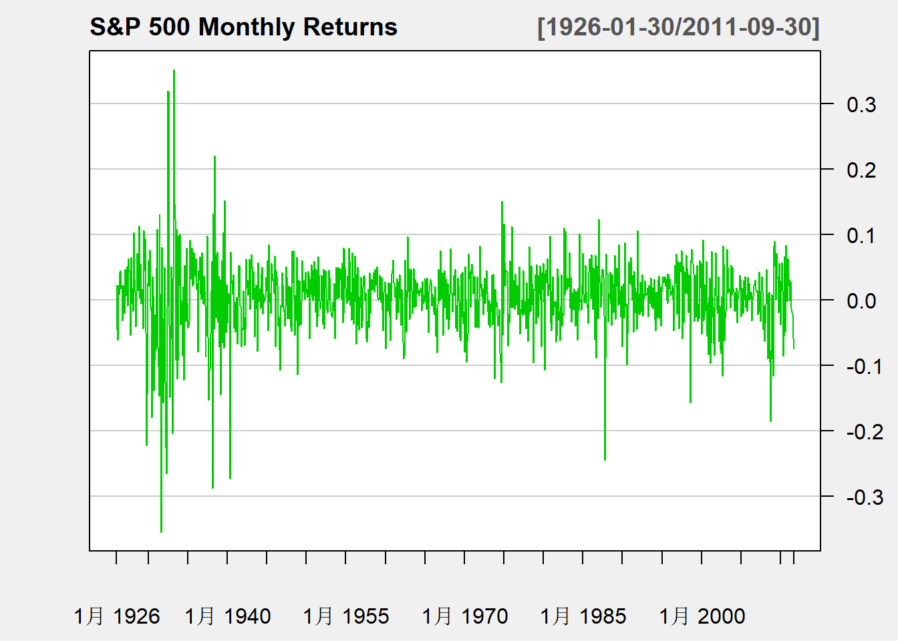
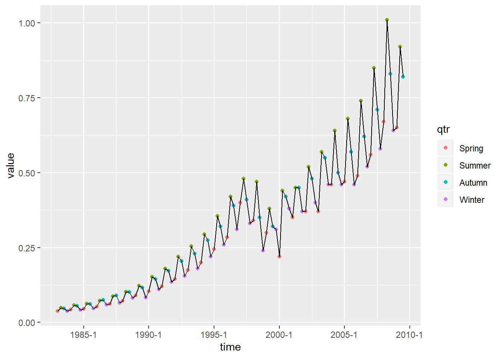

[TOC]
# Time Series

**时间序列分析**（[Time Series Analysis](https://en.jinzhao.wiki/wiki/Time_series)）包括分析时间序列数据以提取有意义的统计数据和数据的其他特征的方法。
按照时间的顺序把随机事件变化发展的过程记录下来就构成了一个时间序列。对时间序列进行观察、研究、找寻它变化发展的规律，预测它将来的走势就是时间序列分析。

**时间序列预测**（[Time series forecasting](https://en.jinzhao.wiki/wiki/Time_series)）是使用模型根据先前观察到的值来预测未来值。

## 简述
**按序列的统计特性**：平稳序列，非平稳序列 (平稳性stationary)
- **平稳序列**：时间序列的统计特性不随时间而变化。
- **非平稳序列**：时间序列的统计特性随时间而变化。

例如：平稳序列

标普500月收益率, 收益率在0上下波动，除了个别时候基本在某个波动范围之内。
这样的收益率数据基本呈现出在一个水平线（一般是0）上下波动， 且波动范围基本不变。 这样的表现是时间序列“**弱平稳序列**”的表现。 由弱平稳性， 可以对未来的标普500收益率预测如下： 均值在0左右，上下幅度在$\pm 0.2$之间。
弱平稳需要一阶矩和二阶矩有限。即$Ex_t = \mu$不变，$\gamma_0 = \text{Var}(x_t) = E(x_t - \mu)^2$基本不变。 某些分布是没有有限的二阶矩的，比如柯西分布， 这样的分布就不适用传统的线性时间序列理论。
平稳序列的平稳性主要体现在均值不变、方差有限，别的限制很弱。自协方差函数的不变性仍然允许周期性的出现。
平稳序列的周期性：可以体现在它的自协方差函数。

例如：非平稳序列

现在可以看出，每年一般冬季和春季最低， 夏季最高，秋季介于夏季和冬季之间。
这样的价格序列则呈现出水平的上下起伏， 如果分成几段平均的话， 各段的平均值差距较大。 这体现出**非平稳的特性**。

### 相关定义

**时域**(Time Domain)：时域分析方法主要从序列自相关的监督揭示时间序列的发展规律。相对于谱分析方法，它具有理论基础扎实，操作步骤规范、分析结果易于解释的优点。
时域分析方法具有相对固定的分析套路，通常都遵循如下分析步骤：
1. 考察观察值的特征。
1. 根据序列的特征选择适当的拟合模型。
1. 根据序列的观察数据确定模型的口径。
1. 检验模型，优化模型。
1. 利用拟合好的模型来推断序列其他的统计性质或预测序列将来的发展。

**频域**(Frequency domain)：频域分析方法也被称为“频谱分析”或“谱分析”（spectral Analysis）方法

**时间序列**: 设有随机变量序列$\{ x_t, t=\dots, -2, -1, 0, 1, 2, \dots \}$， 称其为一个时间序列。其中$x_t$是一个随机变量， 也可以写成大写的$X_t$。时间序列$\{ X_t \}$严格来说是一个二元的函数 $X(t, \omega) , t \in \mathbb Z$, ($\mathbb Z$表示所有整数组成的集合)，$\omega \in \Omega$ ， $\Omega$表示在一定的条件下所有可能的试验结果的集合。 经济和金融中的时间序列我们只能观察到其中某一个$\omega_0 \in \Omega$对应的结果， 称为一条“轨道”。 而针对随机变量的许多理论性质都是在$\omega \in \Omega$上讨论的， 比如$E X_t = \int X_t(\omega) P(d\omega)$是$X_t(\omega)$对$\omega\in \Omega$的平均。
为了能够用一条轨道的观测样本得到所有$\omega \in \Omega$的性质， 需要时间序列满足“遍历性”。
时间序列的样本： 设$\{x_t, t=1,2,\dots, T \}$是时间序列中的一段。 仍将$x_t$看成随机变量，也可以写成大写的$X_t$。 如果有了具体数值， 那么样本就是一条轨道中的一段。

> 时间序列定义: 按时间顺序排列的随机变量序列。记$\{ X_t \} , \{ x_t \}, X(t), x(t)$

**自协方差函数**: 时间序列$\{ X_t \}$中两个随机变量的协方差$\text{Cov}(X_s, X_t)$ 叫做自协方差。 如果$\text{Cov}(X_s, X_t) = \gamma_{|t-s|}$仅依赖于$t-s$， 则称$\gamma_k = \text{Cov}(X_{t-k}, X_t), k=0,1,2,\dots$为时间序列$\{ X_t \}$的自协方差函数。 因为$\text{Cov}(X_s, X_t) = \text{Cov}(X_t, X_s)$， 所以$\gamma_{-k} = \gamma_k$。 易见$\gamma_0 = \text{Var}(X_t)$。
由Cauchy-Schwartz不等式，
$$|\gamma_k | = \left| E[ (X_{t-k} - \mu) (X_t - \mu)] \right|\leq \left( E(X_{t-k} - \mu)^2 \; E(X_t - \mu)^2 \right)^{1/2} = \gamma_0$$

**相关系数**
$$\rho(X,Y) = \rho_{xy} = \frac{\text{Cov}(X,Y)}{\sqrt{\text{Var}(X) \text{Var}(Y)}} = \frac{E[(X-\mu_x)(Y-\mu_y)]}{\sqrt{E(X-\mu_x)^2 E(Y-\mu_y)^2}}$$

**严(强)平稳**（strictly stationary）:根据限制条件的严格程度，分为严平稳时间序列和宽平稳时间序列。
就是一种条件比较苛刻的平稳性定义，它认为只有当序列所有的统计性质都不会随着时间的推移而发生变化时，该序列才被认为平稳。随机变量族的统计性质由它们的联合概率分布族决定。严平稳时间序列通过只有理论意义，在实践中更多的是条件比较宽松的平稳时间序列。

**弱平稳序列**(宽平稳序列，weakly stationary time series): 使用序列额特征统计量来定义一种平稳性。它认为序列的统计性质主要由它的低阶矩决定，所以只要保证序列低阶平稳（二阶），就能保证序列的主要性质近似稳定。
宽平稳也称为若平稳或二阶平稳（second-order stationary）
显然，严平稳比宽平稳条件严格。严平稳是对序列联合分布的要求，以保证序列所有的统计特征都相同；而宽平稳只要求序列二阶平稳，对于高于二阶的矩没有任何要求。所以通常情况下，严平稳序列也满足宽平稳条件，而宽平稳序列不能反推平稳成立。
但这不是绝对的，两种情况都有特例。
比如服从可惜柯西分布的严平稳序列就不是宽平稳序列，因为它不存在一、二阶矩，所以无法验证它二阶平稳。严格地讲，只有存在二阶矩的严平稳序列才能保证它一定也是宽平稳序列。
在实际应用中，研究中最多的是宽平稳随机序列，以后见到平稳随机序列，如果不加特殊注明，指的都是宽平稳随机序列。如果序列不满足平稳条件，就称为非平稳序列。

如果时间序列$\{ X_t \}$存在有限的二阶矩且满足：
 (1) $EX_t = \mu$与$t$无关；
 (2) $\text{Var}(X_t) = \gamma_0$与$t$无关;
 (3) $\gamma_k = \text{Cov}(X_{t-k}, X_t), k=1,2,...$ 与$t$无关，
则称$\{ X_t \}$为弱平稳序列。
适当条件下可以用时间序列的样本估计自协方差函数， 这是用一条轨道的信息推断所有实验结果$\Omega$， 估计公式为
$$\hat\gamma_k = \frac{1}{T} \sum_{t=k+1}^T (x_{t-k} - \bar x)(x_t - \bar x),k=0,1,\dots, T-1$$
称$\hat\gamma_k$为样本自协方差。 注意这里用了$1/T$而不是$1/(T-K)$， 用$1/(T-K)$在获得无偏性的同时会造成一些理论上的困难。

**平稳时间序列的统计性质**
1. 常数均值
1. 自相关系数的三个性质：规范性、对称性、非负性
一个平稳时间序列一定唯一决定了它的自相关函数，但一个相关函数未必唯一对应着一个平稳时间序列。
时间序列分析方法作为数理统计学的一个专业分支，它遵循数数理统计学的基本原理，都是利用样本信息来推测总体信息。
根据数理统计学 常识，显然要分析的随机变量越少越好，而每个变量获得样本信息越多越好。随机变量越少，分析的过程就越简单，而样本容量越大，分析的结果就越可靠。

**时间序列的预处理**: 拿到一个观察序列后，首先要对它的平稳性和纯随机性进行检验，这两个重要的检验称为序列的预处理。根据检验的结果可以将序列分为不同的类型，对不同的类型我们采用不同的分析方法。
- **平稳性检验**:
特征统计量：平稳性是某些时间序列具有的一种统计特征。要描述清楚这个特征，我们必须借助如下统计工具：
    - 概率分布
    - 一个更简单的、更实用的描述时间序列统计特征的方法是研究该序列的低阶矩，特别是均值、方差、自协方差（autocovariance function）和自相关系数（autocorrelation coefficients），它们也被称之为**特征统计量**。
    尽管这些特征统计量不能描述随机序列全部的统计性质，但由于它们概率意义明显，易于计算，而且往往能代表随机序列的主要概率特征，所以我们对时间序列进行分析，主要就是通过分析这些特征量的统计特性，推断出随机序列的性质。
    通常的协方差函数和自相关系数度量的是两个不同事件彼此之间的相互影响程度，而协方差函数和自相关系数度量的是同一事件在两个不同时期之间的相关程度，形象地讲就是度量自己过去的行为对自己现在的影响。

一种是根据时序图和自相关图显示的特征做出判断的图检验方法；
一种是构造检验统计量进行假设检验的方法。
图检验是一种操作简便，运用广泛的平稳性判别方法，它的缺点是判别结论带有很强的主观色彩。
所以最好能用统计检验的方法加以辅助判断。目前最常用的平稳性检验方法是单位根检验（unit root test）。

时序图检验：
根据平稳时间序列均值、方差为常数的性质，平稳序列的时序图应该显示出该序列始终在一个常数附近随机波动，而且波动的范围有界的特点。如果观察序列的时序图显示出有明显的趋势性或周期性，那它通常不是平稳序列。

- **纯随机性检验（白噪声检验）**: 过去的行为对将来的发展没有任何的影响，这种序列我们称之为纯随机序列。从统计分析的角度而言，纯随机序列是没有任何分析价值的序列。
**白噪声序列的性质**：
    - 纯随机性
    - 方差齐性：序列中每个变量的方差都相等。如果序列不满足方差齐性，就称该方差具有异方差性质。
    在时间序列分析中，方差齐性是一个非常重要的限制条件。因为根据马尔可夫定理，只有方差齐性假定成立，我们用最小二乘法得到的未知参数估计值才是准确的、有效的。如果假定不成立，最小二乘估计值就不是方差最小线性无偏估计，拟合模型的预测精度会受到很大影响。
    所以我们在进行模型拟合时，检验内容之一就是要检验拟合模型的残差是否满足方差齐性假定。如果不满足，那就说明残差序列还不是白噪声序列，即拟合模型没有充分提取随机序列中的相关信息，这时拟合模型的精度是值得怀疑的。这种场合下，我们通常需要使用适当的条件异方差模型来拟合该序列的发展。

**平稳时间序列分析**
一个序列经过预处理被识别为平稳非白噪声序列，那就说明该序列是一个蕴含着相关信息的平稳序列。在统计上，我们通常建立一个线性模型来拟合该序列的发展，借此提取该序列中的有用信息。
ARMA（auto regression moving average ）模型是目前最常用的平稳序列拟合模型。
线性差分方程在时间序列分析中有着重要的应用。常用的时间序列模型和某些模型的自协方差函数和自相关函数都可以视为线性差分方程，而线性差分方程对应的特征根的性质对判断平稳性有着非常重要的意义。
ARMA模型的全称是自回归移动平均模型，它是目前最常用的拟合平稳序列的模型。它又可以细分为AR模型（auto regression model）,MA模型（moving average model）和ARMA模型（auto regression moving average model）三大类。
- **模型检验**
    一、模型的显著性检验
    模型的显著性检验主要是检验模型的有效性。一个模型是否显著主要看它提取的信息是否充分。一个好的拟合模型应该能提取观察值序列中几乎所有的样本相关信息，换言之，拟合残差项中将不再蕴含任何相关信息，即残差序列应该为白噪声序列。这样的模型称为显著有效模型。
    反之，如果残差序列为非白噪声序列，那就意味着残差序列中还残留着相关信息未被提取，这就说明拟合模型不够有效，通常需要选择其他模型，重新拟合。
    二、参数的显著性检验
    参数的显著性检验是要检验每一个未知参数是否显著非零。这个检验的目的是为了使模型最精简。
    如果某个参数不显著，即表示该参数所对应的那个自变量的影响不明显，该自变量可以从拟合模型中删除。最终模型将由一系列显著非零的自变量表示。
    三、模型优化
    一个好的拟合模型应该是一个拟合精度和未知参数个数的综合最优配置。
- **序列预测**
    平稳性判别、白噪声判别、模型选择、参数估计及模型检验。这些工作的最终目的常常是利用这个拟合模型对随机序列的未来发展进行预测。
    所谓预测就是利用序列已经观测到的样本值对序列在未来某个时刻的取值进行估计。目前对平稳序列最常用的预测方法是线性最小方差预测。线性是指预测值为观测值序列的线性函数，最小方差是指预测方差达到最小。
   
### 时间序列的表现形式

时间序列依据其特征，有以下几种表现形式，并产生与之相适应的分析方法：
1. 长期趋势变化：受某种基本因素的影响，数据依时间变化时表现为一种确定倾向，它按某种规则稳步地增长或下降。使用的分析方法有：移动平均法、指数平滑法、模型拟和法等。
2. 季节性周期变化：受季节更替等因素影响（这里季节性并不一定是自然的季节性），序列依一固定周期规则性的变化，又称商业循环。采用的方法：季节指数。
3. 循环变化：周期不固定的波动变化。
4. 随机性变化：由许多不确定因素引起的序列变化。

时间序列有三种基本模式：
- 平稳性 / 随机性(Stationarity)：
    1. 期望为常数
    $E(Z_t) = constant$
    2. 方差为常数
    $Var(Z_t) = constant$
    3. 只要K固定，任意两个相隔K个时间段的数据组的协方差相同的(也就是说协方差只依赖于K这个时间跨度，不依赖于时间点t本身)
    $Cov(Z_t,Z_{t+k}) \text{ depends on k}$
- 趋势性(Trend)：
- 季节性(Seasonarity)：

### 时间序列分析的基本思路

1. 平稳性检验（单位根检验、自相关图ACF、偏自相关图PACF）
否：非平稳——差分变换——平稳
是：下一步

2. 白噪声检验
否：计算ACF、PACF（如果没有计算这些）
是：——停止，无分析价值

3. 模型识别（根据ACF、PACF等找到具体使用哪一种模型，也就是最优模型）
4. 参数估计
5. 模型检验
6. 模型优化
7. 模型预测

选择合适的方法建立预测模型
- 没有趋势和季节性成分，可以选择移动平均或指数平滑模型
- 有趋势情况，选择趋势预测模型
- 有季节性情况，选择季节指数模型

选择合适的损失函数
- 当我们关注大销量的时候，我们就会选择均方误差(MSE)，但是销量大储量大并不代表利润大
- 当我们关注销量的时候，就可以考虑使用绝对值误差(MAE)

## 相关模型
[Python 中11 种经典时间序列预测方法](https://zhuanlan.zhihu.com/p/407589768)
[11 Classical Time Series Forecasting Methods in Python (Cheat Sheet)](https://machinelearningmastery.com/time-series-forecasting-methods-in-python-cheat-sheet/)
[7 methods to perform Time Series forecasting (with Python codes)](https://www.analyticsvidhya.com/blog/2018/02/time-series-forecasting-methods)  [数据集](https://gitee.com/myles2019/dataset/raw/master/jetrail/jetrail_train.csv)

Seasonal Autoregressive Integrated Moving Average
SARIMA模型（Seasonal Autoregressive Integrated Moving Average），季节性差分自回归滑动平均模型，时间序列预测分析方法之一

ARIMA - Autoregressive Integrated Moving Average model
ARIMA模型（英语：Autoregressive Integrated Moving Average model），差分整合移动平均自回归模型，又称整合移动平均自回归模型（移动也可称作滑动），是时间序列预测分析方法之一
对应实现的库

VARIMA - Autoregressive integrated moving average
Prophet - Modeling Multiple Seasonality With Linear or Non-linear Growth
HWAAS - Exponential Smoothing With Additive Trend and Additive Seasonality
HWAMS - Exponential Smoothing with Additive Trend and Multiplicative Seasonality
Hidden Markov Models (HMM)

### 简单平均(Simple Average)
$$\hat{y}_{t+h | t} = \frac{1}{t} \sum_{i=1}^t y_i$$
这是最简单的模型，就是对过去值进行平均作为预测值，简单并不意味无效。其实越简单就越可靠。

### 滑动平均(moving average)
$$\hat{y}_{t+h | t} = \frac{1}{T} \sum_{i=t-1}^{t-T} y_i$$
所谓滑动平均，就是通过计算最近一个窗口(一定范围)内平均值作为预测值。

### 指数加权平均(exponentially weighted moving average)
我们在使用滑动平均时，没有考虑历史值距离不同(远近不同)而贡献不同，没有考虑不同历史值对预测值贡献不同，考虑到这点我们就引入指数平均，通过以系数来不同阶段的历史数据对预测值的影响，
$$\hat{y}_{t+h | t} = \alpha y_t + (1 - \alpha) \hat{y}_{t|t-1}$$

用 $\alpha$ 为平滑指数来控制历史数据对预测数据贡献程度的大小。也就是用一个系数乘以历史值，通过系数倒乘上历史值来实现历史值对预测值贡献不衰减。

## 相关开源库

### statsmodels
[statmodels - 6.5k](https://github.com/statsmodels/statsmodels)：是一个Python包，提供了对scipy统计计算的补充，包括描述性统计和统计模型的估计和推断。

> 注重统计分析，[时间序列分析](https://www.statsmodels.org/stable/tsa.html)只是其中一小部分。
### tsfresh
[tsfresh - 5.9k](https://github.com/blue-yonder/tsfresh)：从时间序列中自动提取相关特征

> 注重特征提取和特征选择

### AutoTS
[AutoTS - 200](https://github.com/winedarksea/AutoTS)：自动时间序列预测（Automated Time Series Forecasting)
> 注重自动机器学习
> 支持: statsmodels,prophet[等](https://github.com/winedarksea/AutoTS/blob/master/extended_tutorial.md#optional-packages)

### Prophet
[Prophet - 13.2k](https://github.com/facebook/prophet)：为具有多重季节性的线性或非线性增长的时间序列数据生成高质量预测的工具。

Prophet是一种基于可加模型预测时间序列数据的程序，其中非线性趋势与年度、每周和每日的季节性以及节假日影响相匹配。它最适用于具有强烈季节性影响的时间序列和几个季节的历史数据。Prophet对于丢失的数据和趋势的变化是稳健的，并且通常能很好地处理异常值。

> 适用于具有强烈季节性影响的数据和多个季节的历史数据
> 遵循sklearn模型 API

### Kats
[Kats - 2.8k](https://github.com/facebookresearch/Kats/tree/master/tutorials)：Kats是一个用于分析时间序列数据的工具包，是一个轻量级的、易于使用的、可概括的和可扩展的框架，用于执行时间序列分析，从理解关键统计数据和特征，检测变化点和异常，到预测未来趋势。

> 时间序列分析
> 模式检测，包括季节性、异常值、趋势变化
> 对时间序列数据建立预测模型，包括 Prophet、ARIMA、Holt Winters 等。

### Darts
[Darts - 2.3k](https://github.com/unit8co/darts)：一个用于简单操作和预测时间序列的python库。

> 语法是“sklearn-friendly”

### AtsPy
[AtsPy - 370](https://github.com/firmai/atspy)：Python中的自动时间序列模型
> 自动时间序列模型

### Sktime
[Sktime - 4.4k](https://github.com/alan-turing-institute/sktime)：时间序列机器学习的统一框架

> 深度学习:[sktime-dl](https://github.com/sktime/sktime-dl)
> 遵循sklearn模型 API

## 参考资料
https://www.jianshu.com/nb/47529965
https://www.jianshu.com/p/68016de16984

[应用时间序列分析备课笔记](https://www.math.pku.edu.cn/teachers/lidf/course/atsa/atsanotes/html/_atsanotes/index.html)
[金融时间序列分析讲义](https://www.math.pku.edu.cn/teachers/lidf/course/fts/ftsnotes/html/_ftsnotes/index.html)
