 

### 文章目录

- 一、什么是机器学习

- 二、线性回归

- 2.1 线性回归的表达式

- 三、逻辑回归

- 3.1 逻辑回归的损失函数

- 3.2 逻辑回归实现多分类

- 四、LR的特点

- 五、 为什么逻辑回归比线性回归好

- 六、 LR和SVM的关系

 
 
### 一、什么是机器学习
 
 利用大量的数据样本，使得计算机通过不断的学习获得一个模型，用来对新的未知数据做预测。

- **有监督学习（分类、回归）**

 同时将数据样本和标签输入给模型，模型学习到数据和标签的映射关系，从而对新数据进行预测。 

- **无监督学习（聚类）**

 只有数据，没有标签，模型通过总结规律，从数据中挖掘出信息。 

- **强化学习**

 强化学习会在没有任何标签的情况下，通过先尝试做出一些行为得到一个结果，通过这个结果是对还是错的反馈，调整之前的行为，就这样不断的调整，算法能够学习到在什么样的情况下选择什么样的行为可以得到最好的结果。
 
 就好比你有一只还没有训练好的小狗，每当它把屋子弄乱后，就减少美味食物的数量（惩罚），每次表现不错时，就加倍美味食物的数量（奖励），那么小狗最终会学到一个知识，就是把客厅弄乱是不好的行为。
 
### 二、线性回归
 
 利用大量的样本D = ( x i , y i ) i = 1 N D={(x_i,y_i)}_{i=1}^N D=(xi ,yi )i=1N，通过有监督的学习，学习到由x到y的映射f f f，利用该映射关系对未知的数据进行预估，因为y为连续值，所以是回归问题。

- **单变量情况：** 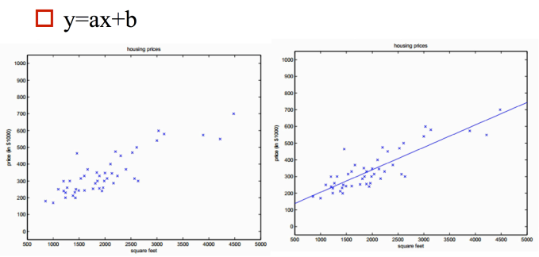
 
- **多变量情况：**

 二维空间的直线，转化为高维空间的平面 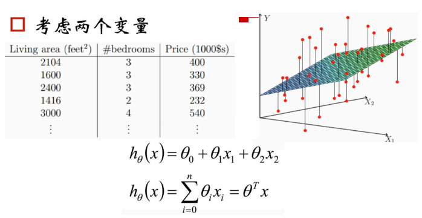
 
#### 2.1 线性回归的表达式
 
 机器学习是数据驱动的算法，数据驱动=数据+模型，模型就是输入到输出的映射关系。
 
 **模型=假设函数（不同的学习方式）+优化**
 
 **1. 假设函数**
 
 线性回归的假设函数（θ 0 \theta_0 θ0表示截距项，x 0 = 1 x_0=1 x0 =1，方便矩阵表达）：f ( x ) = θ 0 x 0 + θ 1 x 1 + θ 2 x 2 . . . + θ n x n f(x)=\theta_0x_0+\theta_1x_1+\theta_2x_2...+\theta_nx_n f(x)=θ0 x0 +θ1 x1 +θ2 x2 ...+θn xn
 
 向量形式（θ , x \theta,x θ,x都是列向量）：f ( x ) = θ T x f(x)=\theta^Tx f(x)=θTx
 
 **2. 优化方法**
 
 监督学习的优化方法=损失函数+对损失函数的优化
 
 **3. 损失函数**
 
 **如何衡量已有的参数θ \theta θ的好坏？**
 
 利用损失函数来衡量，损失函数度量预测值和标准答案的偏差，不同的参数有不同的偏差，所以要通过最小化损失函数，也就是最小化偏差来得到最好的参数。
 
 映射函数：h θ ( x ) h_{\theta}(x) hθ (x)
 
 损失函数：J ( θ 0 , θ 1 , . . . , θ n ) = 1 2 m ∑ i = 1 m ( h θ ( x ( i ) ) − y ( i ) ) 2 J(\theta_0,\theta_1,...,\theta_n)=\frac{1}{2m}\sum_{i=1}^m(h_{\theta}(x^{(i)})-y^{(i)})^2 J(θ0 ,θ1 ,...,θn )=2m1 i=1∑m (hθ (x(i))−y(i))2
 
 解释：因为有m个样本，所以要平均，分母的2是为了求导方便
 
 损失函数：凸函数
 
 **4. 损失函数的优化**
 
 损失函数如右图所示，是一个凸函数，我们的目标是达到最低点，也就是使得损失函数最小。 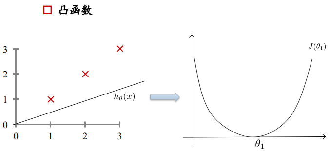 多元情况下容易出现局部极值
 
 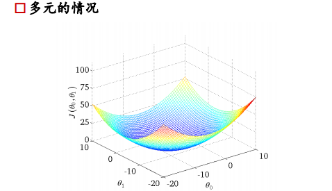
 
 求极值的数学思想，对公式求导=0即可得到极值，但是工业上计算量很大，公式很复杂，所以从计算机的角度来讲，求极值是利用梯度下降法。
 
 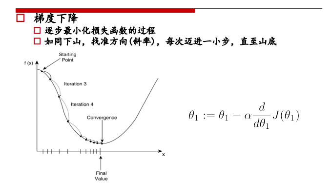
 
 ① 初始位置选取很重要
 
 ② 复梯度方向更新，二维情况下，函数变换最快的方向是斜率方向，多维情况下就成为梯度，梯度表示函数值增大的最快的方向，所以要在负梯度方向上进行迭代。
 
 ③ θ \theta θ的更新公式如上图，每个参数θ 1 , θ 2 . . . \theta_1,\theta_2... θ1 ,θ2 ...都是分别更新的
 
 **高维情况：梯度方向就是垂直于登高线的方向** 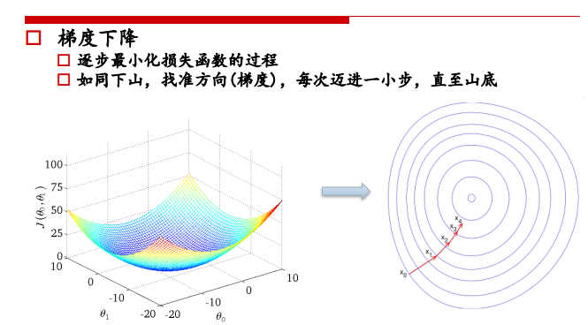 参数更新示例： 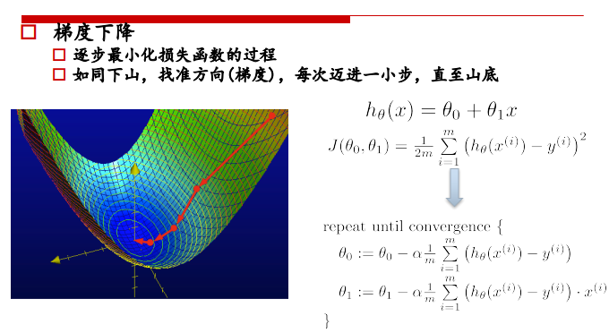 对每个theta都进行更新： 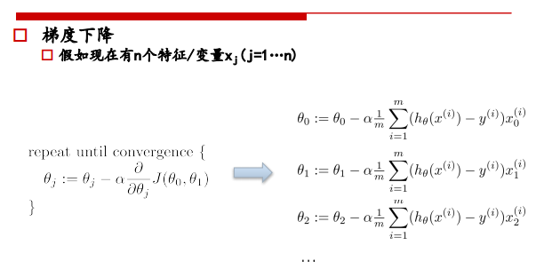
 
 **学习率：**
 
 ① 学习率太大，会跳过最低点，可能不收敛 ② 学习率太小收敛速度过慢
 
 **5. 过拟合和欠拟合**
 
 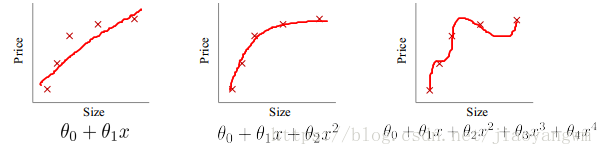 **过拟合的原因：**
 
 ① 如果我们有很多的特征或模型很复杂，则假设函数曲线可以对训练样本拟合的非常好，学习能力太强了，但是丧失了一般性。 ② 眼见不一定为实，训练样本中肯定存在噪声点，如果全都学习的话肯定会将噪声也学习进去。
 
 **过拟合造成什么结果：**
 
 过拟合是给参数的自由空间太大了，可以通过简单的方式让参数变化太快，并未学习到底层的规律，模型抖动太大，很不稳定，variance变大，对新数据没有泛化能力。
 
 **6. 利用正则化解决过拟合问题**
 
 正则化的作用：
 
 ① 控制参数变化幅度，对变化大的参数惩罚
 
 ② 限制参数搜索空间
 
 添加正则化的损失函数： J ( θ 0 , θ 1 , . . . , θ n ) = 1 2 m ∑ i = 1 m ( h θ ( x ( i ) ) − y ( i ) ) 2 + λ 2 m ∑ j = 1 n θ j 2 J(\theta_0,\theta_1,...,\theta_n)=\frac{1}{2m}\sum_{i=1}^m(h_{\theta}(x^{(i)})-y^{(i)})^2+ \frac{\lambda}{2m}\sum_{j=1}^n \theta_j^2 J(θ0 ,θ1 ,...,θn )=2m1 i=1∑m (hθ (x(i))−y(i))2+2mλ j=1∑n θj2
 
 m：样本有m个 n：n个参数，对n个参数进行惩罚 λ \lambda λ：对误差的惩罚程度，λ \lambda λ越大对误差的惩罚越大，容易出现过拟合，λ \lambda λ越小，对误差的惩罚越小，对误差的容忍度越大，泛化能力好。
 
### 三、逻辑回归
 
 监督学习，解决二分类问题。
 
 分类的本质：在空间中找到一个决策边界来完成分类的决策
 
 逻辑回归：线性回归可以预测连续值，但是不能解决分类问题，我们需要根据预测的结果判定其属于正类还是负类。所以逻辑回归就是将线性回归的( − ∞ , + ∞ ) (-\infty,+\infty) (−∞,+∞)结果，通过sigmoid函数映射到( 0 , 1 ) (0,1) (0,1)之间。
 
 线性回归决策函数：h θ ( x ) = θ T x h_{\theta}(x)=\theta^Tx hθ (x)=θTx
 
 将其通过sigmoid函数，获得逻辑回归的决策函数：h θ ( x ) = 1 1 + e − θ T x h_{\theta}(x)=\frac{1}{1+e^{-\theta^Tx}} hθ (x)=1+e−θTx1
 
 **为什么使用sigmoid函数：** 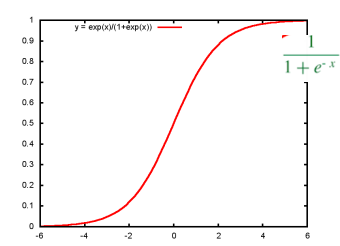 ① 可以对( − ∞ , + ∞ ) (-\infty,+\infty) (−∞,+∞)结果，映射到( 0 , 1 ) (0,1) (0,1)之间，作为概率。
 
 ② x < 0 , s i g m o i d ( x ) < 1 2 ; x > 0 , s i g m o i d ( x ) > 1 2 x<0,sigmoid(x)0,sigmoid(x)>\frac{1}{2} x<0,sigmoid(x)<21 ;x>0,sigmoid(x)>21，可以将1 2 \frac{1}{2} 21作为决策边界。
 
 ③ 数学特性好，求导容易：g ′ ( z ) = g ( z ) ⋅ ( 1 − g ( z ) ) g'(z)=g(z)\cdot(1-g(z)) g′(z)=g(z)⋅(1−g(z)) 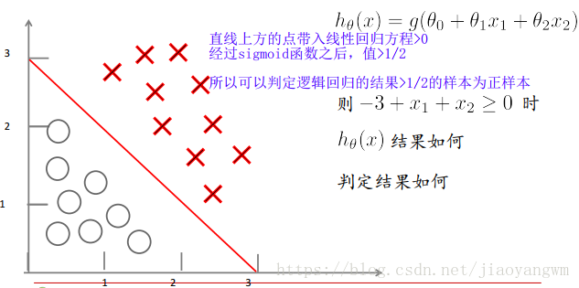
 
#### 3.1 逻辑回归的损失函数
 
 线性回归的损失函数为平方损失函数，如果将其用于逻辑回归的损失函数，则其数学特性不好，有很多局部极小值，难以用梯度下降法求最优。 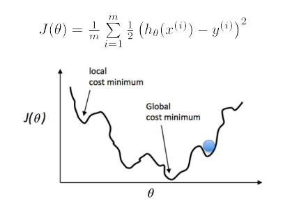 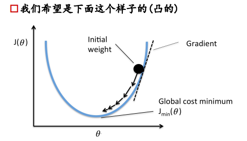
 
 **逻辑回归损失函数：对数损失函数**
 
 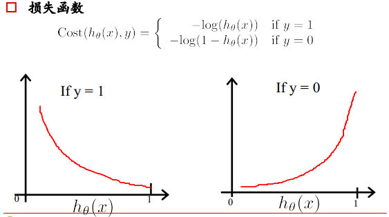
 
 解释：如果一个样本为正样本，那么我们希望将其预测为正样本的概率p越大越好，也就是决策函数的值越大越好，则logp越大越好，逻辑回归的决策函数值就是样本为正的概率；
 
 如果一个样本为负样本，那么我们希望将其预测为负样本的概率越大越好，也就是(1-p)越大越好，即log(1-p)越大越好。
 
 **为什么要用log：**
 
 样本集中有很多样本，要求其概率连乘，概率为(0,1)间的数，连乘越来越小，利用log变换将其变为连加，不会溢出，不会超出计算精度。
 
 **逻辑回归损失函数：**
 
 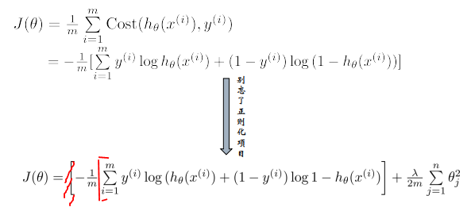
 
 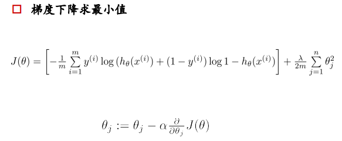 ∂ J ( θ ) ∂ θ j = 1 m [ ∑ i = 1 m ( h θ ( x ( i ) ) − y ( i ) ) x j ( i ) ] \frac{\partial J(\theta)}{\partial \theta_j}=\frac{1}{m}[\sum_{i=1}^m(h_{\theta}(x^{(i)})-y^{(i)})x_j^{(i)}] ∂θj ∂J(θ) =m1 [∑i=1m (hθ (x(i))−y(i))xj(i) ]
 
#### 3.2 逻辑回归实现多分类
 
 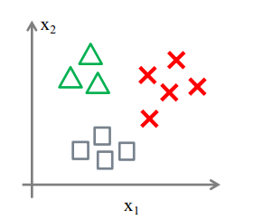

- 一对一(one vs one)

 一对一分类，每两个类之间构建一个分类器，共需要N ( N − 1 ) 2 \frac{N(N-1)}{2} 2N(N−1)个分类器

- 一对多（one vs rest）

 一对多分类器，每个分类器判断是三角形还是不是三角形，共需要N个分类器。
 
### 四、LR的特点
 
 可解释性高，工业中可控度高。
 
 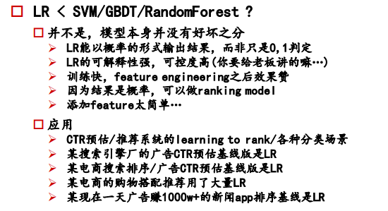
 
 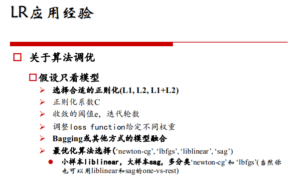
 
### 五、 为什么逻辑回归比线性回归好
 
 虽然逻辑回归能够用于分类，不过其本质还是线性回归。它仅在线性回归的基础上，在特征到结果的映射中加入了一层sigmoid函数（非线性）映射，即先把特征线性求和，然后使用sigmoid函数来预测。
 
 这主要是由于线性回归在整个实数域内敏感度一致，而分类范围，需要在[0,1]之内。而逻辑回归就是一种减小预测范围，将预测值限定为[0,1]间的一种回归模型，其回归方程与回归曲线如下图所示。逻辑曲线在z=0时，十分敏感，在z>>0或z<<0处，都不敏感，将预测值限定为(0,1)。

- LR在线性回归的实数范围输出值上施加sigmoid函数将值收敛到0~1范围, 其目标函数也因此从差平方和函数变为对数损失函数, 以提供最优化所需导数（sigmoid函数是softmax函数的二元特例, 其导数均为函数值的f*(1-f)形式）。请注意, LR往往是解决二元0/1分类问题的, 只是它和线性回归耦合太紧, 不自觉也冠了个回归的名字(马甲无处不在). 若要求多元分类,就要把sigmoid换成大名鼎鼎的softmax了。
 
- 首先逻辑回归和线性回归首先都是广义的线性回归，其次经典线性模型的优化目标函数是最小二乘，而逻辑回归则是似然函数，另外线性回归在整个实数域范围内进行预测，敏感度一致，而分类范围，需要在[0,1]。逻辑回归就是一种减小预测范围，将预测值限定为[0,1]间的一种回归模型，因而对于这类问题来说，逻辑回归的鲁棒性比线性回归的要好。
 
- 逻辑回归的模型本质上是一个线性回归模型，逻辑回归都是以线性回归为理论支持的。但线性回归模型无法做到sigmoid的非线性形式，sigmoid可以轻松处理0/1分类问题。

### 六、 LR和SVM的关系
 
 1、LR和SVM都可以处理分类问题，且一般都用于处理线性二分类问题（在改进的情况下可以处理多分类问题）
 
 2、两个方法都可以增加不同的正则化项，如l1、l2等等。所以在很多实验中，两种算法的结果是很接近的。
 
 区别：
 
 1、LR是参数模型，SVM是非参数模型。
 
 2、从目标函数来看，区别在于逻辑回归采用的是logistical loss，SVM采用的是hinge loss，这两个损失函数的目的都是增加对分类影响较大的数据点的权重，减少与分类关系较小的数据点的权重。
 
 3、SVM的处理方法是只考虑support vectors，也就是和分类最相关的少数点，去学习分类器。而逻辑回归通过非线性映射，大大减小了离分类平面较远的点的权重，相对提升了与分类最相关的数据点的权重。
 
 4、逻辑回归相对来说模型更简单，好理解，特别是大规模线性分类时比较方便。而SVM的理解和优化相对来说复杂一些，SVM转化为对偶问题后,分类只需要计算与少数几个支持向量的距离,这个在进行复杂核函数计算时优势很明显,能够大大简化模型和计算。
 
 5、logic 能做的 svm能做，但可能在准确率上有问题，svm能做的logic有的做不了。
