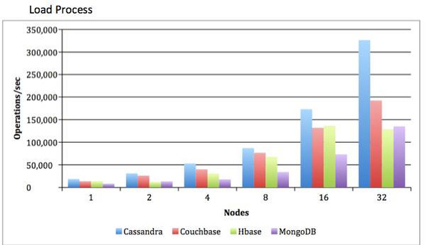
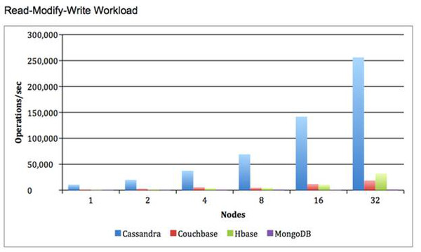
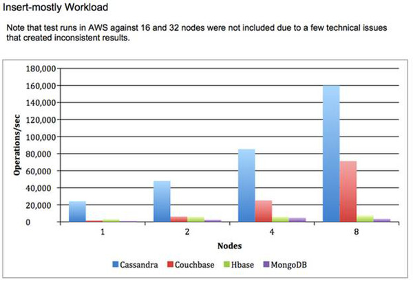

# 三大NoSQL数据库HBase、Cassandra和MongoDB大比拼
NoSQL是什么？NoSQL提供了新的数据管理技术，旨在应对数据数量、速度和种类与日俱增的态势。它可以存储和检索数据，能够以关系数据库中所用的表格式关系之外的方式来建立模型。
NoSQL系统又叫“Not only SQL”，强调这一事实：它们还支持类似SQL的查询语言。

## 我们为什么需要NoSQL？

关系数据库面临下列挑战：

- 并不适用于数据类型多样化（比如图像、视频和文本）的大量（PB级）数据。

- 无法扩展、支持庞大的数据量。

- 无法纵向扩展，受制于内存和处理器的功能。

- 无法横向扩展，受制于依赖缓存的读取和写入操作。

- 分片（将数据库分成几个部分，存储在不同的节点）引起操作问题（比如管理共享式故障）。

- 复杂的RDBMS模型

- 一致性限制了RDBMS的可扩展性。

相比关系数据库，NoSQL更具有可扩展性，并提供了出色的性能。NoSQL数据库提供了下列解决方案，从而克服了关系模型无法克服的挑战：

- 横向扩展、什么都不共享的架构，能够在大量节点上运行。

- 非锁定并发性控制机制，那样实时读取不会与写入产生冲突。

- 可扩展的复制和分发――成千上万个机器拥有分布式数据。

- 每个节点提供的性能高于RDBMS的架构。

- 无模式（schema-less）数据模型。

## HBase：

宽列式数据库，基于Apache Hadoop和BigTable的概念。

Apache HBase是一种NoSQL键/值存储系统，它在Hadoop分布式文件系统（HDFS）上运行。不像Hive，HBase操作在数据库上，而不是MapReduce作业上实时运行。HBase分成表，表又细分成列族（column family）。列族必须在模式中加以声明，它将某一组列（列不需要模式定义）分为小组。比如说，“message”列族可能包括以下这几列：“to”、“from”、“date”、“subject”和“body”。HBase中的每个键/值对被定义为一个单元（cell），每个键含有行键、列族和时间戳。HBase中的行是一组键/值映射，由行键来识别。HBase可以使用Hadoop的基础设施，并使用现成服务器实现横向扩展。

HBase的工作方式是，将数据存储为键/值。它支持四种主要的操作：添加或更新行的put，检索一组单元的scan，返回某个指定行的单元的get，以及从表上删除行、列或列版本的delete。拥有版本控制功能，那样可以获取数据的之前值（历史记录可以通过HBase压缩时不时删除，以释放空间）。虽然HBase包括表，但只有表和列族才需要模式，列不需要模式，它还包括增量/计数器功能。

HBase查询用一种需要学习的自定义语言来编写。可以通过Apache Phoenix，获得类似SQL的功能，不过其代价是需要维护模式。此外，HBase并不完全符合ACID，不过它确实支持某些属性。最后但并非最不重要的是，为了运行HBase，就需要ZooKeeper――这是面向分布式协调的服务器，比如配置、维护和命名。

HBase最适合大数据的实时查询。Facebook将它用于消息传递和实时分析。Facebook甚至将它用于计数Facebook点赞。

Hbase有集中式架构， Master服务器负责监控集群中的所有RegionServer（负责服务和管理区域）实例，它也是查看所有元数据变化的界面。它提供了CAP原理中的CP（一致性和可用性）。

HBase针对读取操作进行了优化，得到单次写入master的支持，支持因而获得的严格一致性模型，以及使用支持行扫描的顺序分区（Ordered Partitioning）。HBase很适合执行基于范围的扫描。

- 线性可扩展性，支持大表和范围扫描－－由于顺序分区，HBase很容易横向扩展，同时仍支持行键范围扫描。

- 辅助索引－－Hbase并不直接支持辅助索引，但触发器的一个使用场合是，“put”方面的触发器会自动确保辅助索引是最新版本，因而并不给应用程序（客户端）添加负担。

- 简单聚合－－Hbase Co Processors支持HBase中的即开即用的简单聚合。SUM、MIN、MAX、AVG和STD。如果定义java类，就可以构建其他聚合，从而执行聚合操作。

实际应用：Facebook Messanger

## Cassandra:

宽列式数据库，基于BigTable和DynamoDB的概念。

Apache Cassandra是一种主要的NoSQL分布式数据库管理系统，它支撑着如今的许多现代商务应用系统，它提供了持续可用性、高扩展性和高性能、强安全性和操作简单性，同时降低了总体拥有成本。

Cassandra拥有分散式架构。任何节点都能执行任何操作。它提供了CAP原理中的AP（可用性和分区可容忍性）。

Cassandra拥有出色的单行读取性能，只要最终的一致性语义足以满足使用场合的需要。Cassandra quorum读取是严格一致性所需要的，它自然不如Hbase读取来得快。Cassandra不支持基于范围的行扫描，这在某些使用场合可能具有局限性。Cassandra很适合支持单行查询，或者基于列值索引选择多行。

如果数据存储在Cassandra中的列里面以支持范围扫描，Cassandra中行大小的实际限制是10MB。大于这个数的行会在压缩开销和时间方面引起问题。

Cassandra支持列族辅助索引，其中列的名称已知（但不支持动态列）。

- Cassandra中的聚合并不受到Cassandra节点的支持――客户端必须提供聚合机制。聚合需求横跨多个行时，随机分区（Random Partitioning）使得聚合对客户端来说很难。建议使用Storm或Hadoop用于聚合。

实际应用：Twitter

## MongoDB：

最流行的文档数据库之一。

它是一种面向文档的数据库。Mongodb中的所有数据以JSON/BSON格式来处理。它是一种无模式数据库，数据库中的数据量超过TB级。它还支持主从复制方法，以便在服务器上复制数据的多个副本，从而使得某些应用系统中的数据整合来得更容易、更快速。

MongoDB结合了关系数据库的优点和NoSQL技术的创新，让工程师能够构建现代应用。

MongoDB保留了关系数据库最宝贵的功能特性：强一致性、表达式查询语言和辅助索引。因而，开发人员能够以比NoSQL数据库更快的速度来构建高度实用的应用程序。

MongoDB提供了NoSQL数据库的数据模型灵活性、弹性可扩展性以及高性能。因而，工程师可以不断改进应用，并且可以在商用硬件上实现几乎无限制的可扩展性。

支持全索引，以实现高性能

实际应用：FourSquare

## HBase、Cassandra和MongoDB三大NoSQL数据库的比较

### HBase：

#### 主要特点：

- 分布式和可扩展的庞大数据存储系统

- 强一致性

- 建立在Hadoop HDFS的基础上

- CAP中的CP

#### 适合于：

- 针对读取进行了优化

- 很适合基于范围的扫描

- 严格一致性

- 快速读取和写入，具有可扩展性

#### 不适合于：

- 典型的事务型应用程序或甚至关系分析

- 应用程序需要全表扫描

- 数据需要跨聚合、累积以及跨行分析。

使用场合：Facebook消息

### Cassandra:

#### 主要特点：

- 高可用性

- 逐步可扩展性

- 最终一致性

- 兼顾一致性和延迟

- 最小化管理

- 没有单一故障点――Cassandra中所有节点都一样

- CAP中的AP

#### 适合于：

- 简单的安装，维护节点

- 快速随机性读取/写入

- 灵活的解析/宽列需求

- 不需要多个辅助索引

#### 不适合于：

- 辅助索引

- 关系数据

- 事务型操作（回滚和提交）

- 主记录/财务记录

- 对数据需要严格的授权

- 针对列数据的动态查询/搜索

- 低延迟

使用场合：Twitter和Travel门户网站

### MongoDB：

#### 主要特点：

- 应用程序完善后，模式随之变化（无模式）

- 支持全索引，实现高性能

- 复制和故障切换，实现高可用性

- 自动分片，易于扩展

- 基于丰富文档的查询，易于读取

- 主从模式

- CAP中的CP

#### 适合于：

- 取代Web应用的RDBMS

- 半结构化内容管理

- 实时分析和高速日志、缓存和高扩展性

- Web 2.0、媒体、SaaS和游戏

#### 不适合：

- 高度事务型系统

- 存在传统数据库需求的应用程序，比如外键约束。

使用场合：Craigslist和Foursquare

## 性能基准测试：

