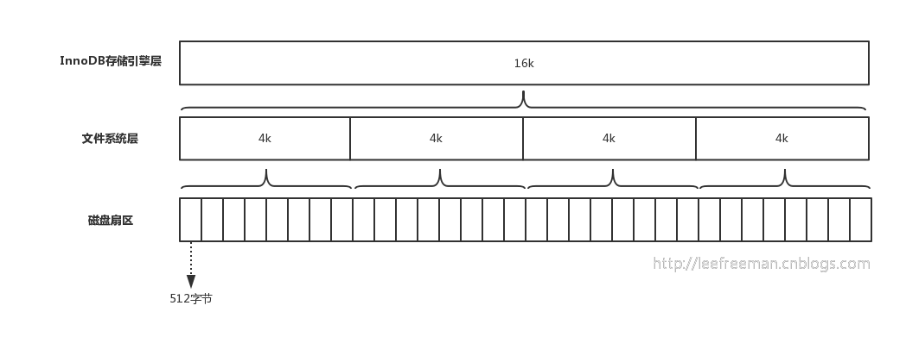

[怎么看innodb的B+TREE层数?](https://www.cnblogs.com/2woods/p/9978011.html)

[面试题：InnoDB中一棵B+树能存多少行数据？](https://www.cnblogs.com/wuneng/p/11455327.html)


磁盘扇区、文件系统、InnoDB存储引擎都有各自的最小存储单元。



show global variables like 'innodb_page_size';
```
+------------------+-------+
| Variable_name    | Value |
+------------------+-------+
| innodb_page_size | 16384 |
+------------------+-------+
1 row in set (0.00 sec)
```

Mysql 一页的大小为16K

### mysql b+ tree 3阶索引能存多少数据

[Understanding B+tree Indexes and how they Impact Performance](http://www.ovaistariq.net/733/understanding-btree-indexes-and-how-they-impact-performance/)

> Consider InnoDB whose page size is 16KB and suppose we have an index on a integer column of size 4bytes, so a node can contain at most 16 * 1024 / 4 = 4096 keys, and a node can have at most 4097 children.
So for a B+tree of height 1, the root node has 4096 keys and the nodes at height 1 (the leaf nodes) have 4096 * 4097 = 16781312 key values.
This goes to show the effectiveness of a B+tree index, more than 16 million key values can be stored in a B+tree of height 1 and every key value can be accessed in exactly 2 lookups.

> #### How important is the size of the index values?
> As can be seen from the above example, the size of the index values plays a very important role for the following reasons:
> - The longer the index, the less number of values that can fit in a node, and hence the more the height of the B+tree.
> - The more the height of the tree, the more disk accesses are needed.
> - The more the disk accesses the less the performance.
So the size of the index values have a direct bearing on performance!
>
> I hope you have understood how B+tree indexes work and how they are used to improve the performance of lookups. I hope you have also understood how important it is to keep the height of the B+tree smaller so as to reduce the number of disk accesses.

主键id，我们采用bigint，8字节
一条数据大小1KB
- 第一层
一个页16K，每一个索引键的大小8字节（bigint）+6字节（指针大小），因此第一层可存储16*1024/14=1170个索引键。
- 第二层
第二层只存储索引键，能存储多少个索引键呢？1170（这么多个页，有第一层延伸的指针）1170(每页的索引键个数，跟第一步计算一致)=1368900
如果第二层存储数据呢？1170（这么多个页，有第一层延伸的指针）16(16KB的页大小/1KB的数据大小)=18720，也就是能存储一万多条数。
- 第三层
直接看三层能存储多少数据？1170*1170*16=21902400，是不是很强大，此处应该有掌声和鲜花，3次IO就可以查询到2千多万左右的数据，也就是这么大的数据量如果通过主键索引来查找是很快，这就是explain一个sql时，type=const为什么性能是最优的。

对于MySQL，1亿行将有一个大约4层深的B + Tree
