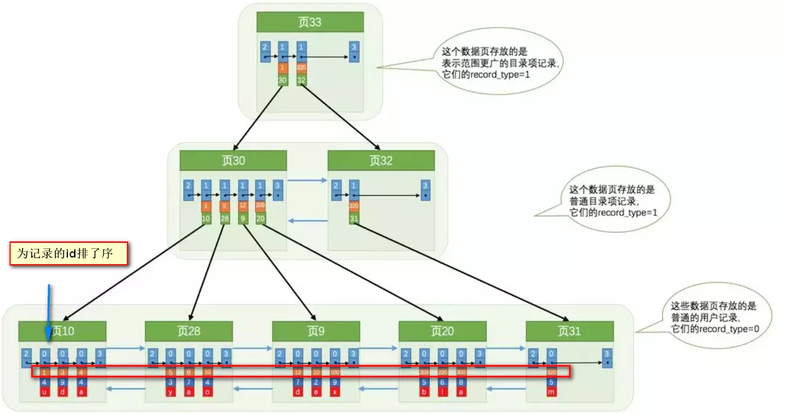
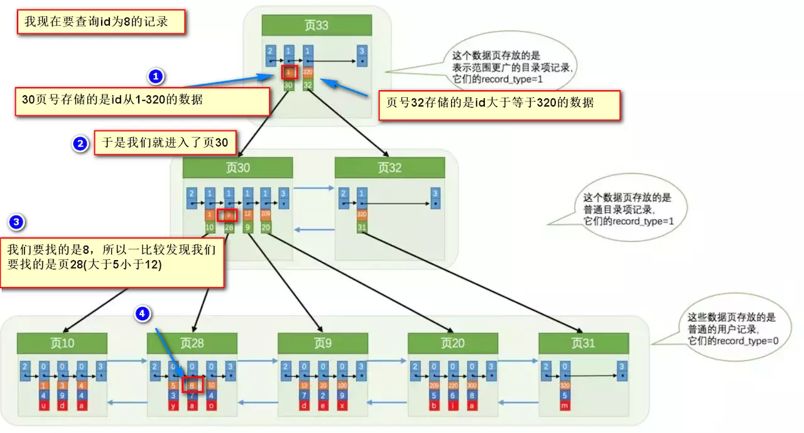

[MySQL 一些内部原理](https://www.cnblogs.com/keme/p/10243333.html)
[可能是全网最好的MySQL重要知识点/面试题总结](https://segmentfault.com/a/1190000019619667)
## 页
MySQL的基本存储结构是页 (记录都存在页里边) ：

- 各个数据页可以组成一个双向链表
- 每个数据页中的记录又可以组成一个单向链表
- 每个数据页都会为存储在它里边儿的记录生成一个页目录，在通过主键查找某条记录的时候可以在页目录中使用二分法快速定位到对应的槽，然后再遍历该槽对应分组中的记录即可快速找到指定的记录
- 以其他列(非主键)作为搜索条件：只能从最小记录开始依次遍历单链表中的每条记录。

select * from user where indexname = 'xxx'这样没有进行任何优化的sql语句，默认会这样做：时间复杂度为O（n）

1. 定位到记录所在的页：需要遍历双向链表，找到所在的页
2. 从所在的页内中查找相应的记录：由于不是根据主键查询，只能遍历所在页的单链表了

## 索引

要找到id为8的记录简要步骤：

很明显的是：没有用索引我们是需要遍历双向链表来定位对应的页，现在通过 “目录” 就可以很快地定位到对应的页上了！（二分查找，时间复杂度近似为O(logn)）

### 注意避免冗余索引
冗余索引指的是索引的功能相同，能够命中就肯定能命中 ，那么 就是冗余索引如（name,city ）和（name ）这两个索引就是冗余索引，能够命中后者的查询肯定是能够命中前者的 在大多数情况下，都应该尽量扩展已有的索引而不是创建新索引。

MySQLS.7 版本后，可以通过查询 sys 库的 schema_redundant_indexes 表来查看冗余索引

## 锁

### 乐观锁
总是假设最好的情况，每次去拿数据的时候都认为别人不会修改，所以不会上锁，但是在更新的时候会判断一下在此期间别人有没有去更新这个数据，可以使用版本号机制和CAS算法实现。乐观锁适用于多读的应用类型，这样可以提高吞吐量，像数据库提供的类似于write_condition机制，其实都是提供的乐观锁。在Java中java.util.concurrent.atomic包下面的原子变量类就是使用了乐观锁的一种实现方式CAS实现的。

乐观锁适用于写比较少的情况下（多读场景），即冲突真的很少发生的时候，这样可以省去了锁的开销，加大了系统的整个吞吐量。但如果是多写的情况，一般会经常产生冲突，这就会导致上层应用会不断的进行retry，这样反倒是降低了性能，所以一般多写的场景下用悲观锁就比较合适。

#### 版本号机制

一般是在数据表中加上一个数据版本号version字段，表示数据被修改的次数，当数据被修改时，version值会加一。当线程A要更新数据值时，在读取数据的同时也会读取version值，在提交更新时，若刚才读取到的version值为当前数据库中的version值相等时才更新，否则重试更新操作，直到更新成功。

#### CAS算法

即compare and swap（比较与交换），是一种有名的无锁算法。无锁编程，即不使用锁的情况下实现多线程之间的变量同步，也就是在没有线程被阻塞的情况下实现变量的同步，所以也叫非阻塞同步（Non-blocking Synchronization）。CAS算法涉及到三个操作数

- 需要读写的内存值 V
- 进行比较的值 A
- 拟写入的新值 B

当且仅当 V 的值等于 A时，CAS通过原子方式用新值B来更新V的值，否则不会执行任何操作（比较和替换是一个原子操作）。一般情况下是一个自旋操作，即不断的重试。

### 自旋锁
自旋锁（spinlock）：是指当一个线程在获取锁的时候，如果锁已经被其它线程获取，那么该线程将循环等待，然后不断的判断锁是否能够被成功获取，直到获取到锁才会退出循环。

获取锁的线程一直处于活跃状态，但是并没有执行任何有效的任务，使用这种锁会造成busy-waiting。

它是为实现保护共享资源而提出一种锁机制。其实，自旋锁与互斥锁比较类似，它们都是为了解决对某项资源的互斥使用。无论是互斥锁，还是自旋锁，在任何时刻，最多只能有一个保持者，也就说，在任何时刻最多只能有一个执行单元获得锁。但是两者在调度机制上略有不同。对于互斥锁，如果资源已经被占用，资源申请者只能进入睡眠状态。但是自旋锁不会引起调用者睡眠，如果自旋锁已经被别的执行单元保持，调用者就一直循环在那里看是否该自旋锁的保持者已经释放了锁，”自旋”一词就是因此而得名。

[深入理解自旋锁](https://blog.csdn.net/qq_34337272/article/details/81252853)

