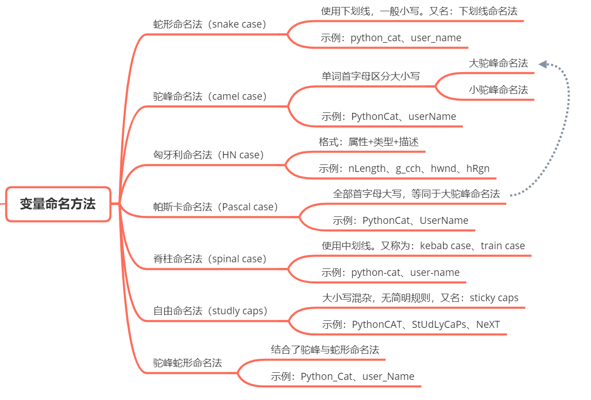

# 学习笔记

[技术面试必备基础知识、Leetcode、计算机操作系统、计算机网络、系统设计、Java、Python、C++ https://cyc2018.github.io/CS-Notes](https://github.com/CyC2018/CS-Notes)

[2019年最新总结，阿里，腾讯，百度，美团，头条等技术面试题目，以及答案，专家出题人分析汇总。](https://github.com/0voice/interview_internal_reference)

[开源技术 * IBM 微讲堂：Kubernetes 系列](https://developer.ibm.com/cn/tv/2018/opentec-k8s/)

[欢迎参加 Istio 系列课程](https://developer.ibm.com/cn/os-academy-istio/)

https://www.wanweibaike.com/

## kubernetes

中文文档1：https://kubernetes.io/zh/docs/

中文文档2：https://jimmysong.io/kubernetes-handbook/  https://github.com/rootsongjc/kubernetes-handbook

中文文档3： https://blog.frognew.com/

中文文档4:  https://www.kubernetes.org.cn/k8s

所有安装方式列表：https://kubernetes.io/docs/setup/

中文二进制文件安装方式文档： https://github.com/opsnull/follow-me-install-kubernetes-cluster

英文二进制文件安装方式文档： https://github.com/kelseyhightower/kubernetes-the-hard-way

使用Ansible脚本安装文档：https://github.com/gjmzj/kubeasz （在自建机房,建议使用此方法）

k8s-kubeasz-阿里云vpc部署记录: https://li-sen.github.io/2018/09/27/k8s-kubeasz-阿里云vpc部署记录/

kops在AWS中国区安装k8s文档：

https://github.com/nwcdlabs/kops-cn （建议使用此方法，该项目由aws中国区维护）

https://github.com/kubernetes/kops/blob/master/docs/aws-china.md

http://senlinzhan.github.io/2018/01/11/k8s-on-aws/

https://blog.csdn.net/cloudvtech/article/details/80539086

中文社区1： https://www.kubernetes.org.cn

中文社区2：http://dockone.io/

kubernetes相关的工具：https://github.com/kubernetes-sigs/ （你会发现很多有实用的工具可以使用）

这里有一个在aws上管理k8s的pdf文档：https://s3.cn-north-1.amazonaws.com.cn/sides-share/AWS+Webinar+2018/PDF/EKS+Webinar+Chinese.pdf

这里介绍Terraform 管理 EKS：https://www.hashicorp.com/blog/hashicorp-announces-terraform-support-aws-kubernetes

## istio

中文文档：https://istio.io/zh/

中文社区： http://www.servicemesher.com/

历届Meetup视频: http://www.servicemesher.com/activity/

中文论坛：http://www.servicemesh.cn

## helm

中文文档：https://whmzsu.github.io/helm-doc-zh-cn/

helm工具集合：https://github.com/helm/charts/tree/master/stable  

## gitlab

中文文档：https://docs.gitlab.com.cn

## elk

中文社区：https://elasticsearch.cn

## AWS 中国区文档

官方文档：https://docs.amazonaws.cn

视频教程：http://aws.amazon.bokecc.com/

aws真实云场景的动手练习网站：https://amazonaws-china.com/cn/training/self-paced-labs/

## python 基础教程

python2: https://www.runoob.com/python/python-tutorial.html

python3: https://www.runoob.com/python3/python3-tutorial.html

Python - 100天从新手到大师: https://github.com/jackfrued/Python-100-Days

