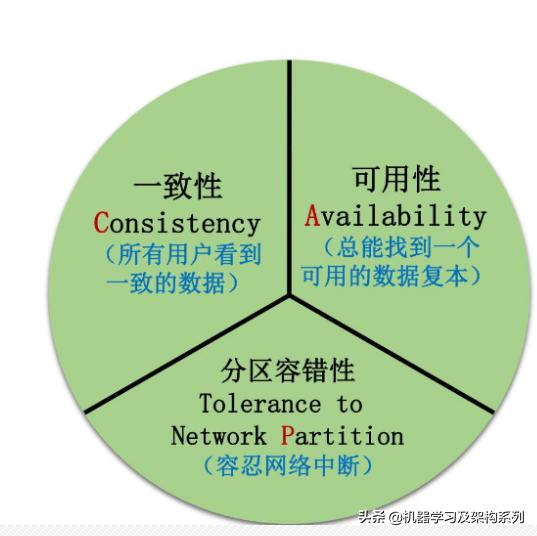
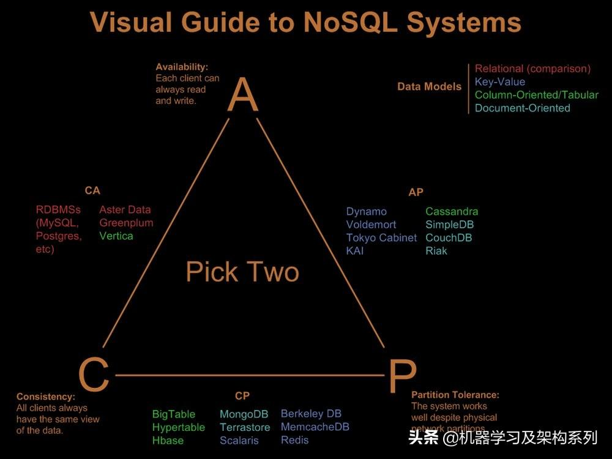

[分布式一致性与共识算法](https://www.jianshu.com/p/f73cee95821e)

## CAP讲解
在分布式环境下面，P 是铁定存在的，也就是只要我们有多台机器，那么网络隔离分区就一定不可避免，所以在设计系统的时候我们就要选择到底是设计的是 AP 系统还是 CP 系统，但实际上，我们只要深入理解下 CAP，就会发现其实有时候系统设计上面没必要这么纠结，主要表现在：
网络分区出现的概率虽然市场发生，但是我们可以感知心跳强行剔除下线，将流量平均分往其他节点，毕竟谁也不能保证网络百分百稳定，不出现网络分区。自然而然的没必要刻意 A、C 中选一个，而是可以都做得不错。也就是说的 AC 系统。

CAP 里面规定 A 是 100% 的可用性，但实际上，我们只需要提供 high availability，也就是像网关一样，全年不宕不可能，但是满足 99.99% 或者 99.999% 等几个 9 就可以了

[从分布式一致性到共识机制（一）Paxos算法](https://www.cnblogs.com/binyue/p/8645565.html)
[从分布式一致性到共识机制（二）Raft算法](https://www.cnblogs.com/binyue/p/8647733.html)
[从分布式一致性到共识机制（三）拜占庭问题](https://www.cnblogs.com/binyue/p/8647743.html)

[一致性算法—Paxos、Raft、ZAB](https://blog.csdn.net/bulingma/article/details/89438851)

[分布式事务与一致性算法Paxos & raft & zab](https://blog.csdn.net/followmyinclinations/article/details/52870418)

paxos 理论算法
zab 协议
Raft

Paxos
Raft（multi-paxos）
ZAB（multi-paxos）

Pasox
Paxos算法是莱斯利·兰伯特(Leslie Lamport)1990年提出的一种基于消息传递的一致性算法。
Paxos的发展分类：Basic Paxos、Multi Paxos、Fast Paxos

[众协议 Paxos/ZAB/Raft/VR 值得注意的细节](https://www.jianshu.com/p/4dcf3325269d)
[分布式系统理论进阶 - Raft、Zab](https://zhuanlan.zhihu.com/p/23279196)
ZAB
ZAB随着Zookeeper诞生于2007年，此时Raft协议还没有发明，根据ZAB的论文，之所以Zookeeper没有直接使用Paxos而是自己造轮子，是因为他们认为Paxos并不能满足他们的要求。比如Paxos允许多个proposer，可能会造成客户端提交的多个命令没法按照FIFO次序执行。同时在恢复过程中，有一些follower的数据不全。这些断论都是基于最原始的Paxos协议的，实际上后来一些Paxos的变种，比如Multi-Paxos已经解决了这些问题。当然我们只能站在历史的角度去看待这个问题，由于当时的Paxos并不能很好的解决这些问题，因此Zookeeper的开发者创造了一个新的一致性协议ZAB。（但其实心里要明白它们其实是一回事。）

https://github.com/maemual/raft-zh_cn/blob/master/raft-zh_cn.md

[raft 论文](../files/raft.pdf)

https://raft.github.io/