<!-- toc -->
[TOC]
# Kafka
[kafka 29.3k](https://github.com/apache/kafka)
## Tools
[kafka tool 可视化](https://www.kafkatool.com/download.html)
[kafka-topics-ui](https://github.com/lensesio/kafka-topics-ui)
[Kafka Web UI 可视化界面](https://github.com/obsidiandynamics/kafdrop)
[Kafka Eagle 监控系统是一款用来监控 Kafka 集群的工具](https://github.com/smartloli/kafka-eagle)
[Kafka 管理工具 CMAK,以前叫 kafka-manager](https://github.com/yahoo/CMAK)

## 其它相似
[性能测试：Kafka、Pulsar和Pravega哪个强？](https://www.toutiao.com/i6890835822057095692/)
- [Pulsar 14.4k](https://github.com/apache/pulsar)
- [Pravega 2k](https://github.com/pravega/pravega)
- [Redpanda 9.9k](https://github.com/redpanda-data/redpanda) C++兼容Kafka

## News

[Kafka Needs No Keeper](https://www.confluent.io/blog/removing-zookeeper-dependency-in-kafka/)

[KIP-500：Replace ZooKeeper with a Metadata Quorum](https://cwiki.apache.org/confluence/display/KAFKA/KIP-500%3A+Replace+ZooKeeper+with+a+Self-Managed+Metadata+Quorum)

提到将使用 Quorum 机制

多年前就有人提到[Is Zookeeper a must for Kafka?](https://stackoverflow.com/questions/23751708/is-zookeeper-a-must-for-kafka)

zookeeper 将从 kafka 中移除. - 2020.05.15
Kafka 2.6 版本还是需要 zookeeper(说明不是那么简单的事) - 2020.07.16

Kafka 2.8  [What’s New in Apache Kafka 2.8.0](https://blogs.apache.org/kafka/entry/what-s-new-in-apache5)  - 2021.04.19
我们很高兴地宣布2.8引入了不带ZooKeeper的Kafka的抢先体验！
该实现尚未完成功能，不应在生产中使用，但是可以在没有ZooKeeper的情况下启动新集群

Kafka 3.0 - 2021.09.20 进度：还没有完全移除ZooKeeper
改进了 KRaft--Apache Kafka 的内置共识机制，该机制将取代 Apache ZooKeeper™。
https://downloads.apache.org/kafka/3.0.0/RELEASE_NOTES.html


## 文章
Kafka 总结（一）：Kafka 概述
https://blog.csdn.net/qq_36807862/article/details/81283142
Kafka 总结（二）：Kafka 核心组件
https://blog.csdn.net/qq_36807862/article/details/81283229

Kafka 总结（三）：Kafka 核心流程分析
https://blog.csdn.net/qq_36807862/article/details/81283286

Kafka 总结（四）：Kafka 命令操作
https://blog.csdn.net/qq_36807862/article/details/81283397

Kafka 总结（五）：API 编程详解
https://blog.csdn.net/qq_36807862/article/details/81283460

Kafka 总结（六）：Kafka Stream 详解
https://blog.csdn.net/qq_36807862/article/details/81283491

Kafka 总结（七）：数据采集应用
https://blog.csdn.net/qq_36807862/article/details/81283546

Kafka 总结（八）：KafKa 与 ELK 整合应用
https://blog.csdn.net/qq_36807862/article/details/81283568

Kafka 总结（九）：KafKa 与 Spark 整合应用
https://blog.csdn.net/qq_36807862/article/details/81283606

大数据中台之 Kafka，到底好在哪里？
https://blog.csdn.net/csdn_bang/article/details/103797920

## 什么是 Kafka

### kafka 简介

Kafka 是最初由 Linkedin 公司开发，是一个分布式、分区的、多副本的、多订阅者，基于 zookeeper 协调的分布式日志系统（也可以当做 MQ 系统），常见可以用于 web/nginx 日志、访问日志，消息服务等等，Linkedin 于 2010 年贡献给了 Apache 基金会并成为顶级开源项目。

主要应用场景是：日志收集系统和消息系统。
Kafka 主要设计目标如下：

- 以时间复杂度为 O(1)的方式提供消息持久化能力，即使对 TB 级以上数据也能保证常数时间的访问性能。
- 高吞吐率。即使在非常廉价的商用机器上也能做到单机支持每秒 100K 条消息的传输。
- 支持 Kafka Server 间的消息分区，及分布式消费，同时保证每个 partition 内的消息顺序传输。
- 同时支持离线数据处理和实时数据处理。
- Scale out:支持在线水平扩展

Kafka 是一个分布式的、可分区的、可复制的消息系统。
Kafka 是一种快速、可扩展的、设计内在就是分布式的，分区的和可复制的提交日志服务。

有两种主要的消息传递模式：点对点传递模式、发布-订阅模式。
Kafka 就是一种发布-订阅模式


### kafka 基本架构

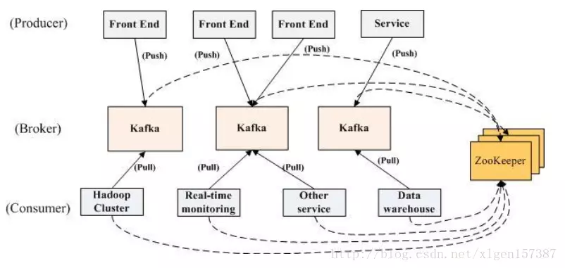

#### 话题（Topic）：

是特定类型的消息流（字节的有效负载），话题是消息的分类；

kafka 中消息订阅和发送都是基于某个 topic。
比如有个 topic 叫做 NBA 赛事信息，那么 producer 会把 NBA 赛事信息的消息发送到此 topic 下面。
所有订阅此 topic 的 consumer 将会拉取到此 topic 下的消息。
Topic 就像一个特定主题的收件箱，producer 往里丢，consumer 取走。

#### 生产者（Producer）：

是能够发布消息到话题的任何对象；

生产者即数据的发布者，该角色将消息发布到 Kafka 的 topic 中。broker 接收到生产者发送的消息后，broker 将该消息追加到当前用于追加数据的 segment 文件中。生产者发送的消息，存储到一个 partition 中，生产者也可以指定数据存储的 partition。

如果 Partition 没填，那么情况会是这样的：

- Key 有填。按照 Key 进行哈希，相同 Key 去一个 Partition。（如果扩展了 Partition 的数量那么就不能保证了）
- Key 没填。Round-Robin 来选 Partition。

#### 服务代理（Broker）：

已发布的消息保存在一组服务器中，它们被称为代理（Broker）或 Kafka 集群；

一个 Borker 就是 Kafka 集群中的一个实例，或者说是一个服务单元。
连接到同一个 zookeeper 的多个 broker 实例组成 kafka 的集群。
在若干个 broker 中会有一个 broker 是 leader，其余的 broker 为 follower。

---

broker 存储 topic 的数据。如果某 topic 有 N 个 partition，集群有 N 个 broker，那么每个 broker 存储该 topic 的一个 partition。

如果某 topic 有 N 个 partition，集群有(N+M)个 broker，那么其中有 N 个 broker 存储该 topic 的一个 partition，剩下的 M 个 broker 不存储该 topic 的 partition 数据。

如果某 topic 有 N 个 partition，集群中 broker 数目少于 N 个，那么一个 broker 存储该 topic 的一个或多个 partition。在实际生产环境中，尽量避免这种情况的发生，这种情况容易导致 Kafka 集群数据不均衡。

#### 分区（Partition）：

topic 中的数据分割为一个或多个 partition。每个 topic 至少有一个 partition。每个 partition 中的数据使用多个 segment 文件存储。partition 中的数据是有序的，不同 partition 间的数据丢失了数据的顺序。如果 topic 有多个 partition，消费数据时就不能保证数据的顺序。在需要严格保证消息的消费顺序的场景下，需要将 partition 数目设为 1。

每个分区可以设置备份数量
分区由一个 leader+多个 followers 组成，生产者直接与 leader 进行沟通，leader 接收消息后，其他的 followers 会同步这个消息。所有的 follwers 同步消息后，该消息才会成为可消费的状态。
Broker 中 Topic 与分区，分区与生产者，分区之间的选举备份等等信息都需要 zookeeper 进行协调。

---

每个 Topic 由多个分区组成，每个分区内部的数据保证了有序性，即是按照时间序列，append 到分区的尾部。分区是有固定大小的，容量不够时，会创建新的分区。Kafka 在一定时间内会定期清理过期的文件。

这种连续性的文件存储，一方面有效的利用磁盘的线性存取；另一方面减轻了内存的压力。

#### 消费者（Consumer）：

可以订阅一个或多个话题，并从 Broker 拉（pull）数据，从而消费这些已发布的消息；

push 模式很难适应消费速率不同的消费者，因为消息发送速率是由 broker 决定的。push 模式的目标是尽可能以最快速度传递消息，但是这样很容易造成 consumer 来不及处理消息，典型的表现就是拒绝服务以及网络拥塞。而 pull 模式则可以根据 consumer 的消费能力以适当的速率消费消息。

Kafka 和其它消息系统有一个不一样的设计，在 consumer 之上加了一层 group（Consumer Group）；
同一个 group 的 consumer 可以并行消费同一个 topic 的消息，但是同 group 的 consumer，不会重复消费。
如果同一个 topic 需要被多次消费，可以通过设立多个 consumer group 来实现。每个 group 分别消费，互不影响。

#### Consumer Group

每个 Consumer 属于一个特定的 Consumer Group（可为每个 Consumer 指定 group name，若不指定 group name 则属于默认的 group）。

很多传统的 message queue 都会在消息被消费完后将消息删除，一方面避免重复消费，另一方面可以保证 queue 的长度比较少，提高效率。而如上文所将，Kafka 并不删除已消费的消息，为了实现传统 message queue 消息只被消费一次的语义，Kafka 保证保证同一个 consumer group 里只有一个 consumer 会消费一条消息。与传统 message queue 不同的是，Kafka 还允许不同 consumer group 同时消费同一条消息，这一特性可以为消息的多元化处理提供了支持。实际上，Kafka 的设计理念之一就是同时提供离线处理和实时处理。根据这一特性，可以使用 Storm 这种实时流处理系统对消息进行实时在线处理，同时使用 Hadoop 这种批处理系统进行离线处理，还可以同时将数据实时备份到另一个数据中心，只需要保证这三个操作所使用的 consumer 在不同的 consumer group 即可。

Kafka 的相关术语以及之间的关系 1
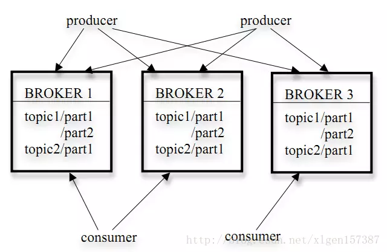
Kafka 的相关术语以及之间的关系 2

上图中一个 topic 配置了 3 个 partition。Partition1 有两个 offset：0 和 1。Partition2 有 4 个 offset。Partition3 有 1 个 offset。副本的 id 和副本所在的机器的 id 恰好相同。

如果一个 topic 的副本数为 3，那么 Kafka 将在集群中为每个 partition 创建 3 个相同的副本。集群中的每个 broker 存储一个或多个 partition。多个 producer 和 consumer 可同时生产和消费数据。

#### Leader

每个 partition 有多个副本，其中有且仅有一个作为 Leader，Leader 是当前负责数据的读写的 partition。

#### Follower

Follower 跟随 Leader，所有写请求都通过 Leader 路由，数据变更会广播给所有 Follower，Follower 与 Leader 保持数据同步。如果 Leader 失效，则从 Follower 中选举出一个新的 Leader。当 Follower 与 Leader 挂掉、卡住或者同步太慢，leader 会把这个 follower 从“in sync replicas”（ISR）列表中删除，重新创建一个 Follower。

## kafka 原理

我们将消息的发布（publish）称作 producer，
将消息的订阅（subscribe）表述为 consumer，
将中间的存储阵列称作 broker(代理);

多个 broker 协同合作，
producer 和 consumer 部署在各个业务逻辑中被频繁的调用，
三者通过 zookeeper 管理协调请求和转发。
这样一个高性能的分布式消息发布订阅系统就完成了。


- producer 到 broker 的过程是 push，也就是有数据就推送到 broker；
- consumer 到 broker 的过程是 pull，是通过 consumer 主动去拉数据的，
  而不是 broker 把数据主懂发送到 consumer 端的。

## Zookeeper 在 kafka 的作用

- 无论是 kafka 集群，还是 producer 和 consumer 都依赖于 zookeeper 来保证系统可用性集群保存一些 meta 信息（kafka 的配置，集群状态和连接信息等元数据）。
- Kafka 使用 zookeeper 作为其分布式协调框架，很好的将消息生产、消息存储、消息消费的过程结合在一起。
- 借助 zookeeper，kafka 能够生产者、消费者和 broker 在内的所以组件在无状态的情况下，
  建立起生产者和消费者的订阅关系，并实现生产者与消费者的负载均衡。

Producer 如果生产了数据，会先通过 zookeeper 找到 broker，然后将数据存放到 broker；
Consumer 如果要消费数据，会先通过 zookeeper 找对应的 broker，然后消费；

---

在 Kafka 中很多节点的调度以及资源的分配，都要依赖于 zookeeper 来完成。

1. Broker 的注册，保存 Broker 的 IP 以及端口；
2. Topic 注册，管理 broker 中 Topic 的分区以及分布情况
3. Broker 的负载均衡，讲 Topic 动态的分配到 broker 中，通过 topic 的分布以及 broker 的负载判断
4. 消费者，每个分区的消息仅发送给一个消费者
5. 消费者与分区的对应关系，存储在 zk 中
6. 消费者负载均衡，一旦消费者增加或者减少，都会触发消费者的负载均衡
7. 消费者的 offset，High level 中由 zk 维护 offset 的信息；Low Level 中由自己维护 offset

## kafka 特性

#### 高吞吐量、低延迟：

kafka 每秒可以处理几十万条消息，它的延迟最低只有几毫秒，
每个 topic 可以分多个 partition, consumer group 对 partition 进行 consume 操作；

#### 可扩展性：

kafka 集群支持热扩展（不停机的情况下扩展 kafka）；

#### 持久性、可靠性：

消息被持久化到本地磁盘，并且支持数据备份防止数据丢失；

#### 容错性：

允许集群中节点失败（若副本数量为 n,则允许 n-1 个节点失败）；

#### 高并发：

支持数千个客户端同时读写；

#### 支持实时在线处理和离线处理：

可以使用 Storm 这种实时流处理系统对消息进行实时进行处理，
同时还可以使用 Hadoop 这种批处理系统进行离线处理；

## kafka 使用场景

- 日志收集：
- 消息系统：
  解耦和生产者和消费者、缓存消息等；
- 用户活动跟踪：
  记录 web 用户或者 app 用户的各种活动，
  如浏览网页、搜索、点击等活动，这些活动信息被各个服务器发布到 kafka 的 topic 中，
  然后订阅者通过订阅这些 topic 来做实时的监控分析；
  或者装载到 Hadoop、数据仓库中做离线分析和数据挖掘；
- 运营指标：
  Kafka 也经常用来记录运营监控数据。
- 事件源：

## kafka 的分区（针对 topic）

- kafka 采用分区（Partition）的方式，使得消费者能够做到并行消费，从而大大提高了自己的吞吐能力。
- 同时为了实现高可用，每个分区又有若干份副本（Replica），这样在某个 broker 挂掉的情况下，数据不会丢失。
- 无分区时，一个 topic 只有一个消费者在消费这个消息队列。
  采用分区后，如果有两个分区，最多两个消费者同时消费，消费的速度肯定会更快。

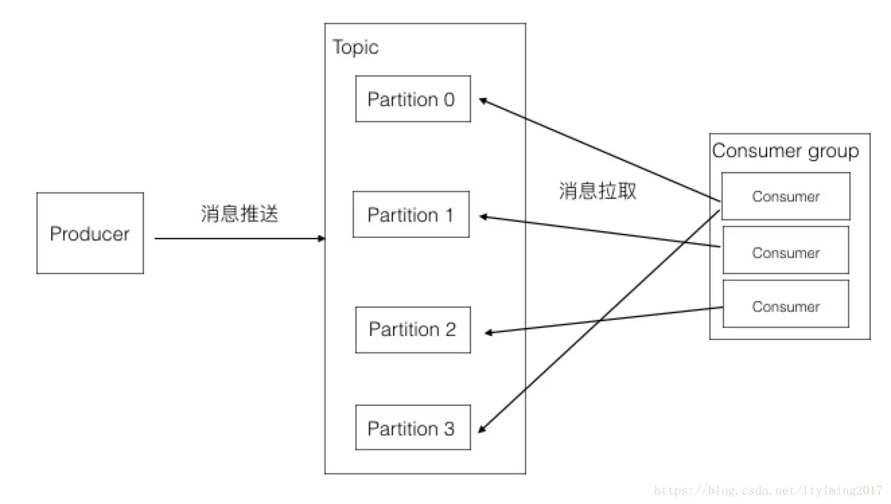
注意：

- 一个分区只能被同组的一个 consumer 消费；
- 同一个组里面的一个 consumer 可以消费多个分区；
- 消费率最高的情况是分区数和 consumer 数量相同；确保每个 consumer 专职负责一个分区。
- consumer 数量不能大于分区数量；当 consumer 多余分区时，就会有 consumer 闲置；
- consumer group 可以认为是一个订阅者集群，其中每个 consumer 负责自己所消费的分区；

## 副本（Replica-确保数据可恢复）

- 每个分区的数据都会有多份副本，以此来保证 Kafka 的高可用。
- topic 下会划分多个 partition，每个 partition 都有自己的 replica，
  其中只有一个是 leader replica，其余的是 follower replica。
- 消息进来的时候会先存入 leader replica，然后从 leader replica 复制到 follower replica。
  只有复制全部完成时，consumer 才可以消费此条消息。

Topic、partition、replica 的关系图
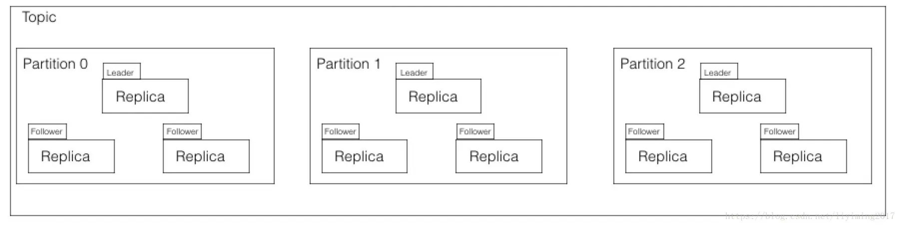

由上图可见，leader replica 做了大量的工作。所以如果不同 partition 的 leader replica 在 kafka 集群的 broker 上分布不均匀，就会造成负载不均衡。
注：kafka 通过轮询算法保证 leader replica 是均匀分布在多个 broker 上。如下图。

副本均匀分部图
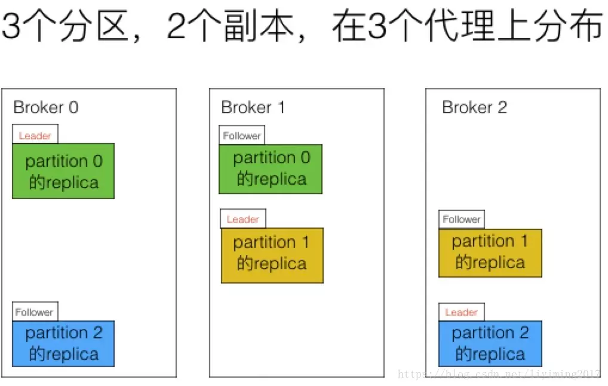
可以看到每个 partition 的 leader replica 均匀的分布在三个 broker 上，follower replica 也是均匀分布的。

Replica 总结：

- Replica 均匀分配在 Broker 上，同一个 partition 的 replica 不会在同一个 borker 上；
- 同一个 partition 的 Replica 数量不能多于 broker 数量。
  多个 replica 为了数据安全，一台 server 存多个 replica 没有意义。server 挂掉，上面的副本都要挂掉。
- 分区的 leader replica 均衡分布在 broker 上。此时集群的负载是均衡的。这就叫做分区平衡；

## Partition 的读和写

topic 下划分了多个 partition，消息的生产和消费最终都是发生在 partition 之上；

读写示意图
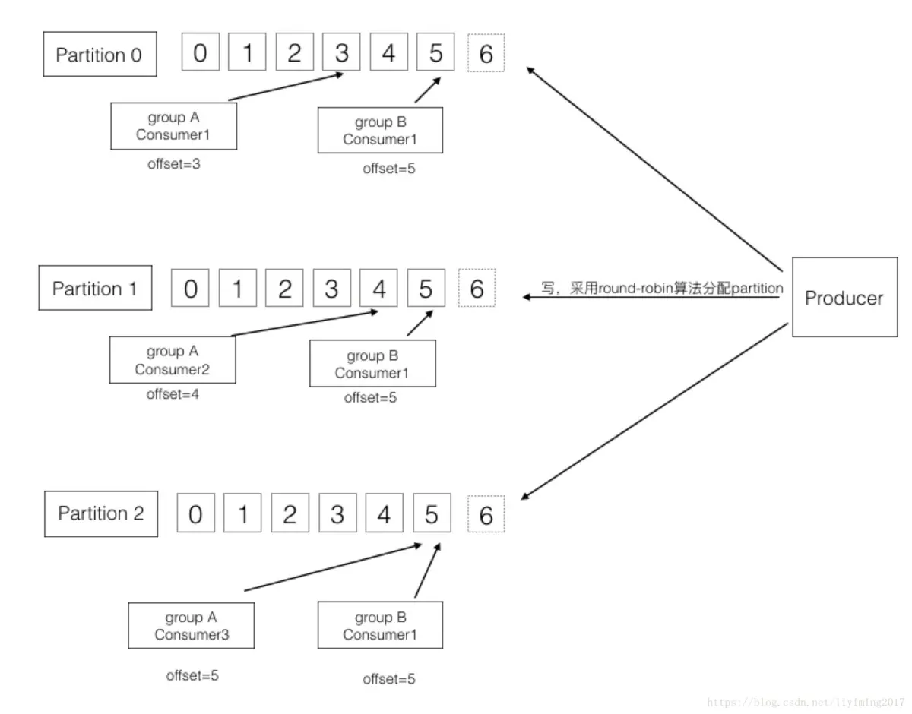

- producer 采用 round-robin 算法，轮询往每个 partition 写入 topic；
- 每个 partition 都是有序的不可变的。
- Kafka 可以保证 partition 的消费顺序，但不能保证 topic 消费顺序。
- 每个 consumer 维护的唯一元数据是 offset，代表消费的位置，一般线性向后移动。
- consumer 也可以重置 offset 到之前的位置，可以以任何顺序消费，不一定线性后移。

## 数据持久化

为了提高性能，现代操作系统往往使用内存作为磁盘的缓存；
虽然每个程序都在自己的线程里只缓存了一份数据，但在操作系统的缓存里还有一份，这等于存了两份数据。
与传统的将数据缓存在内存中然后刷到硬盘的设计不同，
Kafka 直接将数据写到了文件系统的日志中。

## 消息传输的事务定义

### 消息投递语义

在业务中，常常都是使用 At least once 的模型，如果需要可重入的话，往往是业务自己实现。

#### At most once：最多一次，消息可能会丢失，但不会重复。

先获取数据，再 Commit Offset，最后进行业务处理：

- 生产者生产消息异常，不管，生产下一个消息，消息就丢了。
- 消费者处理消息，先更新 Offset，再做业务处理，做业务处理失败，消费者重启，消息就丢了。

#### At least once：最少一次，消息不会丢失，可能会重复。

先获取数据，再进行业务处理，业务处理成功后 Commit Offset：

- 生产者生产消息异常，消息是否成功写入不确定，重做，可能写入重复的消息。
- 消费者处理消息，业务处理成功后，更新 Offset 失败，消费者重启的话，会重复消费。

#### Exactly once：只且一次，消息不丢失不重复，只且消费一次（0.11 中实现，仅限于下游也是 Kafka）

思路是这样的，首先要保证消息不丢，再去保证不重复。所以盯着 At least once 的原因来搞。

首先想出来的：

- 生产者重做导致重复写入消息：生产保证幂等性。
- 消费者重复消费：消灭重复消费，或者业务接口保证幂等性重复消费也没问题。

由于业务接口是否幂等，不是 Kafka 能保证的，所以 Kafka 这里提供的 Exactly once 是有限制的，消费者的下游也必须是 Kafka。

所以以下讨论的，没特殊说明，消费者的下游系统都是 Kafka（注：使用 Kafka Conector，它对部分系统做了适配，实现了 Exactly once）。生产者幂等性好做，没啥问题。

解决重复消费有两个方法：

- 下游系统保证幂等性，重复消费也不会导致多条记录。
- 把 Commit Offset 和业务处理绑定成一个事务。

本来 Exactly once 实现第 1 点就 OK 了。但是在一些使用场景下，我们的数据源可能是多个 Topic，处理后输出到多个 Topic，这时我们会希望输出时要么全部成功，要么全部失败。这就需要实现事务性。

既然要做事务，那么干脆把重复消费的问题从根源上解决，把 Commit Offset 和输出到其他 Topic 绑定成一个事务。

##### 生产幂等性

思路是这样的，为每个 Producer 分配一个 Pid，作为该 Producer 的唯一标识。

Producer 会为每一个维护一个单调递增的 Seq。类似的，Broker 也会为每个记录下最新的 Seq。

**当 req_seq == broker_seq+1 时，Broker 才会接受该消息，因为：**

- 消息的 Seq 比 Broker 的 Seq 大超过时，说明中间有数据还没写入，即乱序了。
- 消息的 Seq 不比 Broker 的 Seq 小，那么说明该消息已被保存。
  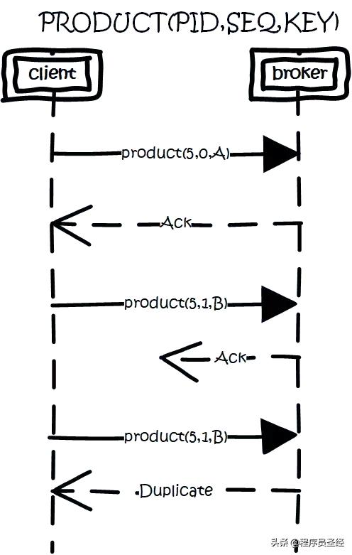

##### 事务性/原子性广播

场景是这样的：

- 先从多个源 Topic 中获取数据。
- 做业务处理，写到下游的多个目的 Topic。
- 更新多个源 Topic 的 Offset。

其中第 2、3 点作为一个事务，要么全成功，要么全失败。这里得益于 Offset 实际上是用特殊的 Topic 去保存，这两点都归一为写多个 Topic 的事务性处理。

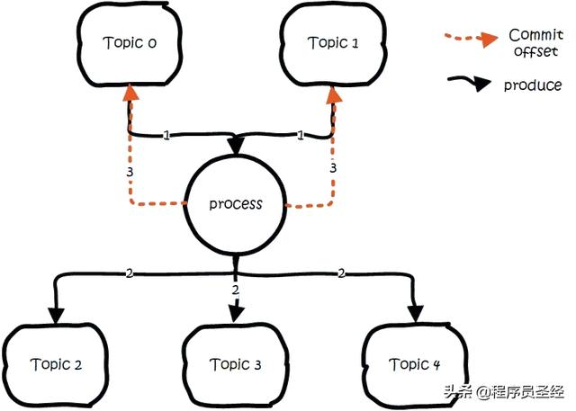
基本思路是这样的：

- 引入 Tid（transaction id），和 Pid 不同，这个 ID 是应用程序提供的，用于标识事务，和 Producer 是谁并没关系。
- 就是任何 Producer 都可以使用这个 Tid 去做事务，这样进行到一半就死掉的事务，可以由另一个 Producer 去恢复。
- 同时为了记录事务的状态，类似对 Offset 的处理，引入 Transaction Coordinator 用于记录 Transaction Log。
- 在集群中会有多个 Transaction Coordinator，每个 Tid 对应唯一一个 Transaction Coordinator。
- 注：Transaction Log 删除策略是 Compact，已完成的事务会标记成 Null，Compact 后不保留。

做事务时，先标记开启事务，写入数据，全部成功就在 Transaction Log 中记录为 Prepare Commit 状态，否则写入 Prepare Abort 的状态。

之后再去给每个相关的 Partition 写入一条 Marker（Commit 或者 Abort）消息，标记这个事务的 Message 可以被读取或已经废弃。成功后在 Transaction Log 记录下 Commit/Abort 状态，至此事务结束。


数据流：

- 首先使用 Tid 请求任意一个 Broker（代码中写的是负载最小的 Broker），找到对应的 Transaction Coordinator。
- 请求 Transaction Coordinator 获取到对应的 Pid，和 Pid 对应的 Epoch，这个 Epoch 用于防止僵死进程复活导致消息错乱。
- 当消息的 Epoch 比当前维护的 Epoch 小时，拒绝掉。Tid 和 Pid 有一一对应的关系，这样对于同一个 Tid 会返回相同的 Pid。
- Client 先请求 Transaction Coordinator 记录的事务状态，初始状态是 Begin，如果是该事务中第一个到达的，同时会对事务进行计时。
- Client 输出数据到相关的 Partition 中；Client 再请求 Transaction Coordinator 记录 Offset 的事务状态；Client 发送 Offset Commit 到对应 Offset Partition。
- Client 发送 Commit 请求，Transaction Coordinator 记录 Prepare Commit/Abort，然后发送 Marker 给相关的 Partition。
- 全部成功后，记录 Commit/Abort 的状态，最后这个记录不需要等待其他 Replica 的 ACK，因为 Prepare 不丢就能保证最终的正确性了。

这里 Prepare 的状态主要是用于事务恢复，例如给相关的 Partition 发送控制消息，没发完就宕机了，备机起来后，Producer 发送请求获取 Pid 时，会把未完成的事务接着完成。

当 Partition 中写入 Commit 的 Marker 后，相关的消息就可被读取。所以 Kafka 事务在 Prepare Commit 到 Commit 这个时间段内，消息是逐渐可见的，而不是同一时刻可见。

##### 消费事务

前面都是从生产的角度看待事务。还需要从消费的角度去考虑一些问题。

消费时，Partition 中会存在一些消息处于未 Commit 状态，即业务方应该看不到的消息，需要过滤这些消息不让业务看到，Kafka 选择在消费者进程中进行过来，而不是在 Broker 中过滤，主要考虑的还是性能。

Kafka 高性能的一个关键点是 Zero Copy，如果需要在 Broker 中过滤，那么势必需要读取消息内容到内存，就会失去 Zero Copy 的特性。

文件组织

Kafka 的数据，实际上是以文件的形式存储在文件系统的。Topic 下有 Partition，Partition 下有 Segment，Segment 是实际的一个个文件，Topic 和 Partition 都是抽象概念。

在目录 /partitionid}/ 下，存储着实际的 Log 文件（即 Segment），还有对应的索引文件。

每个 Segment 文件大小相等，文件名以这个 Segment 中最小的 Offset 命名，文件扩展名是 .log。Segment 对应的索引的文件名字一样，扩展名是 .index。

有两个 Index 文件：

- 一个是 Offset Index 用于按 Offset 去查 Message。
- 一个是 Time Index 用于按照时间去查，其实这里可以优化合到一起，下面只说 Offset Index。
  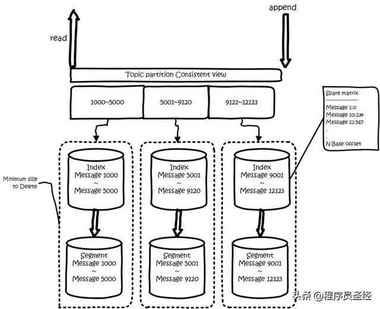

为了减少索引文件的大小，降低空间使用，方便直接加载进内存中，这里的索引使用稀疏矩阵，不会每一个 Message 都记录下具体位置，而是每隔一定的字节数，再建立一条索引。

索引包含两部分：

BaseOffset：意思是这条索引对应 Segment 文件中的第几条 Message。这样做方便使用数值压缩算法来节省空间。例如 Kafka 使用的是 Varint。
Position：在 Segment 中的绝对位置。

查找 Offset 对应的记录时，会先用二分法，找出对应的 Offset 在哪个 Segment 中，然后使用索引，在定位出 Offset 在 Segment 中的大概位置，再遍历查找 Message。

### 数据传输的事务定义通常有以下三种级别：

#### 1. 最多一次(at most onece):

消息不会被重复发送，最多被传输一次，但也有可能一次不传输。

---

基本思想是保证每一条消息 commit 成功之后，再进行消费处理；
设置自动提交为 false，接受到消息之后，首先 commit，然后再进行消费

#### 2. 最少一次(at least onece):

消息不会被漏发送，最少被传输一次，但也有可能被重复传输.

---

基本思想是保证每一条消息处理成功之后，再进行 commit；
设置自动提交为 false；消息处理成功之后，手动进行 commit；
采用这种模式时，最好保证消费操作的“幂等性”，防止重复消费；

#### 3. 精确的一次（exactly once）:

不会漏传输也不会重复传输,每个消息都传输被一次而且仅仅被传输一次，这是大家所期望的。

---

核心思想是将 offset 作为唯一 id 与消息同时处理，并且保证处理的原子性；
设置自动提交为 false；消息处理成功之后再提交；
比如对于关系型数据库来说，可以将 id 设置为消息处理结果的唯一索引，再次处理时，如果发现该索引已经存在，那么就不处理；

### kafka 存在的问题

如果 producer 发布消息时发生了网络错误，但又不确定实在提交之前发生的还是提交之后发生的，
这种情况虽然不常见，但是必须考虑进去，现在 Kafka 版本还没有解决这个问题，
将来的版本正在努力尝试解决。

### kafka 的可指定消息传输级别

并不是所有的情况都需要“精确的一次”这样高的级别，Kafka 允许 producer 灵活的指定级别。
比如 producer 可以指定必须等待消息被提交的通知，
或者完全的异步发送消息而不等待任何通知，或者仅仅等待 leader 声明它拿到了消息。

## kafka 性能优化

### 1、消息集：

以消息集为单位处理消息，比以单个的消息为单位处理，会提升不少性能。
Producer 把消息集一块发送给服务端，而不是一条条的发送；
服务端把消息集一次性的追加到日志文件中，这样减少了琐碎的 I/O 操作。
consumer 也可以一次性的请求一个消息集。

### 2、数据压缩

Kafka 采用了端到端的压缩：因为有“消息集”的概念，客户端的消息可以一起被压缩后送到服务端，
并以压缩后的格式写入日志文件，以压缩的格式发送到 consumer，
消息从 producer 发出到 consumer 拿到都是被压缩的，只有在 consumer 使用的时候才被解压缩，所以叫做“端到端的压缩”。
Kafka 支持 GZIP 和 Snappy 压缩协议。

## Kafka Producer 消息发送

客户端控制消息将被分发到哪个分区。
可以通过负载均衡随机的选择，或者使用分区函数。
Kafka 允许用户实现分区函数，指定分区的 key，将消息 hash 到不同的分区上;
比如如果你指定的 key 是 user id，那么同一个用户发送的消息都被发送到同一个分区上。
经过分区之后，consumer 就可以有目的的消费某个分区的消息。

### Producer 异步发送消息：

批量发送可以很有效的提高发送效率。
Kafka producer 的异步发送模式允许进行批量发送，先将消息缓存在内存中，然后一次请求批量发送出去。
这个策略可以配置的，比如可以指定缓存的消息达到某个量的时候就发出去，
或者缓存了固定的时间后就发送出去（比如 100 条消息就发送，或者每 5 秒发送一次）。
这种策略将大大减少服务端的 I/O 次数。

## Kafka Consumer

Kafa consumer 消费消息时，向 broker 发出"fetch"请求去消费特定分区的消息。
consumer 指定消息在日志中的偏移量（offset），就可以消费从这个位置开始的消息。
customer 拥有了 offset 的控制权，可以向后回滚去重新消费之前的消息，这是很有意义的。

Kafka 遵循了一种大部分消息系统共同的传统的设计：
producer 将消息推送到 broker，consumer 从 broker 拉取消息。

- push 模式下，当 broker 推送的速率远大于 consumer 消费的速率时，consumer 恐怕就要崩溃了。
  因此最终 Kafka 还是选取了传统的 pull 模式。
- Pull 模式的另外一个好处是 consumer 可以自主决定是否批量的从 broker 拉取数据。
- Pull 有个缺点是，如果 broker 没有可供消费的消息，将导致 consumer 不断在循环中轮询，直到新消息到达。
  为了避免这点，Kafka 有个参数可以让 consumer 阻塞知道新消息到达(当然也可以阻塞知道消息的数量达到某个特定的量 consumer 才去拉去消息)。

### 消费者存在 group 时 auto.offset.reset=

latest 最后, earliest 最早, none

### 几种不同的注册方式

1. subscribe 方式：当主题分区数量变化或者 consumer 数量变化时，会进行 rebalance；
2. 注册 rebalance 监听器，可以手动管理 offset
3. 不注册监听器，kafka 自动管理
4. assign 方式：手动将 consumer 与 partition 进行对应，kafka 不会进行 rebanlance

### 默认配置

采用默认配置情况下，既不能完全保证 At-least-once 也不能完全保证 at-most-once；

比如：

在自动提交之后，数据消费流程失败，这样就会有丢失，不能保证 at-least-once；

数据消费成功，但是自动提交失败，可能会导致重复消费，这样也不能保证 at-most-once；

但是将自动提交时长设置的足够小，则可以最大限度的保证 at-most-once；

### 关键配置及含义

enable.auto.commit 是否自动提交自己的 offset 值；默认值时 true
auto.commit.interval.ms 自动提交时长间隔；默认值时 5000 ms
consumer.commitSync(); offset 提交命令；

### 消费的机制

- at most once，即消费数据后，保存 offset，就再也取不到这个数据了。
- at least once，即消费数据后，保存 offset，如果保存出错，下次可能还会取到该数据

在 Kafka 中 offset 是由 consumer 维护的（实际可以由 zookeeper 来完成，0.8 以后在名为\_\_consumer_offsets 的 topic 中，该 topic 有 50 个分区）。这种机制有两个好处

- 一个是可以依据 consumer 的能力来消费数据，避免产生消费数据的压力；
- 另一个就是可以自定义 fetch 消费的数据数目，可以一次读取 1 条，也可以 1 次读取 100 条。

## 主从同步

- 创建副本的单位是 topic 的分区，每个分区都有一个 leader 和零或多个 followers；
  所有的读写操作都由 leader 处理；同一个分区的副本数量不能多于 brokers 的数量；

- 各分区的 leader 均匀的分布在 brokers 中。
  所有的 followers 都复制 leader 的日志，日志中的消息和顺序都和 leader 中的一致。
  flowers 向普通的 consumer 那样从 leader 那里拉取消息并保存在自己的日志文件中。

- Kafka 判断一个节点是否活着有两个条件：

  1. 节点必须可以维护和 ZooKeeper 的连接，Zookeeper 通过心跳机制检查每个节点的连接。
  2. 如果节点是个 follower,他必须能及时的同步 leader 的写操作，延时不能太久。

- leader 的选择
  Kafka 的核心是日志文件，日志文件在集群中的同步是分布式数据系统最基础的要素。
  - 1. Kafaka 动态维护了一个同步状态的副本的集合简称 ISR；
       集合中的任何一个节点随时都可以被选为 leader。ISR 在 ZooKeeper 中维护。
       ISR 的成员是动态的，如果一个节点被淘汰了，当它重新达到“同步中”的状态时，他可以重新加入 ISR。
       这种 leader 的选择方式是非常快速的，适合 kafka 的应用场景。
  - 2. 所有的副本都 down 掉时，必须及时作出反应。可以有以下两种选择（kafka 选择 b）： - a. 等待 ISR 中的任何一个节点恢复并担任 leader
       （ISR 中的节点都起不来，那集群就永远恢复不了） - b. 选择所有节点中（不只是 ISR）第一个恢复的节点作为 leader（如果等待 ISR 以外的节点恢复，这个节点的数据就会被作为线上数据，
       有可能和真实的数据有所出入，因为有些数据它可能还没同步到。）

### Partition

当存在多副本的情况下，会尽量把多个副本，分配到不同的 Broker 上。

Kafka 会为 Partition 选出一个 Leader，之后所有该 Partition 的请求，实际操作的都是 Leader，然后再同步到其他的 Follower。

当一个 Broker 歇菜后，所有 Leader 在该 Broker 上的 Partition 都会重新选举，选出一个 Leader。（这里不像分布式文件存储系统那样会自动进行复制保持副本数）
然后这里就涉及两个细节：

1. 怎么分配 Partition
2. 怎么选 Leader
   关于 Partition 的分配，还有 Leader 的选举，总得有个执行者。在 Kafka 中，这个执行者就叫 **Controller**。

Kafka 使用 ZK 在 Broker 中选出一个 Controller，用于 Partition 分配和 Leader 选举。

### Partition 的分配

- 将所有 Broker（假设共 n 个 Broker）和待分配的 Partition 排序。
- 将第 i 个 Partition 分配到第（i mod n）个 Broker 上 （这个就是 Leader）。
- 将第 i 个 Partition 的第 j 个 Replica 分配到第（(i + j) mode n）个 Broker 上。

### Leader 容灾

Controller 会在 ZK 的 /brokers/ids 节点上注册 Watch，一旦有 Broker 宕机，它就能知道。

当 Broker 宕机后，Controller 就会给受到影响的 Partition 选出新 Leader。

Controller 从 ZK 的 /brokers/topics/[topic]/partitions/[partition]/state 中，读取对应 Partition 的 ISR（in-sync replica 已同步的副本）列表，选一个出来做 Leader。

选出 Leader 后，更新 ZK，然后发送 LeaderAndISRRequest 给受影响的 Broker，让它们知道改变这事。

为什么这里不是使用 ZK 通知，而是直接给 Broker 发送 RPC 请求，我的理解可能是这样做 ZK 有性能问题吧。

如果 ISR 列表是空，那么会根据配置，随便选一个 Replica 做 Leader，或者干脆这个 Partition 就是歇菜。

如果 ISR 列表的有机器，但是也歇菜了，那么还可以等 ISR 的机器活过来。

### 多副本同步

#### 生产

这里的策略，服务端这边的处理是 Follower 从 Leader 批量拉取数据来同步。但是具体的可靠性，是由生产者来决定的。

生产者生产消息的时候，通过 request.required.acks 参数来设置数据的可靠性。
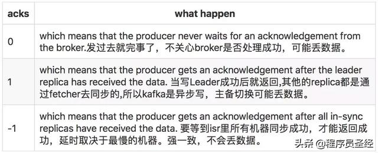
在 Acks=-1 的时候，如果 ISR 少于 min.insync.replicas 指定的数目，那么就会返回不可用。

这里 ISR 列表中的机器是会变化的，根据配置 replica.lag.time.max.ms，多久没同步，就会从 ISR 列表中剔除。

以前还有根据落后多少条消息就踢出 ISR，在 1.0 版本后就去掉了，因为这个值很难取，在高峰的时候很容易出现节点不断的进出 ISR 列表。

从 ISA 中选出 Leader 后，Follower 会把自己日志中上一个高水位后面的记录去掉，然后去和 Leader 拿新的数据。

因为新的 Leader 选出来后，Follower 上面的数据，可能比新 Leader 多，所以要截取。

这里高水位的意思，对于 Partition 和 Leader，就是所有 ISR 中都有的最新一条记录。消费者最多只能读到高水位。

从 Leader 的角度来说高水位的更新会延迟一轮，例如写入了一条新消息，ISR 中的 Broker 都 Fetch 到了，但是 ISR 中的 Broker 只有在下一轮的 Fetch 中才能告诉 Leader。

也正是由于这个高水位延迟一轮，在一些情况下，Kafka 会出现丢数据和主备数据不一致的情况，0.11 开始，使用 Leader Epoch 来代替高水位。

##### 思考：当 Acks=-1 时

- 是 Follwers 都来 Fetch 就返回成功，还是等 Follwers 第二轮 Fetch？
- Leader 已经写入本地，但是 ISR 中有些机器失败，那么怎么处理呢？
- acks=all 就可以代表数据一定不会丢失了吗？
  当然不是，如果你的 Partition 只有一个副本，也就是一个 Leader，任何 Follower 都没有，你认为 acks=all 有用吗？
  当然没用了，因为 ISR 里就一个 Leader，他接收完消息后宕机，也会导致数据丢失。
  所以说，这个 acks=all，必须跟 ISR 列表里至少有 2 个以上的副本配合使用，起码是有一个 Leader 和一个 Follower 才可以。
  这样才能保证说写一条数据过去，一定是 2 个以上的副本都收到了才算是成功，此时任何一个副本宕机，不会导致数据丢失。

首先这个 acks 参数，是在 KafkaProducer，也就是生产者客户端里设置的

也就是说，你往 kafka 写数据的时候，就可以来设置这个 acks 参数。然后这个参数实际上有三种常见的值可以设置，分别是：0、1 和 all。

第一种选择是把 acks 参数设置为 0，意思就是我的 KafkaProducer 在客户端，只要把消息发送出去，不管那条数据有没有在哪怕 Partition Leader 上落到磁盘，我就不管他了，直接就认为这个消息发送成功了。

如果你采用这种设置的话，那么你必须注意的一点是，可能你发送出去的消息还在半路。结果呢，Partition Leader 所在 Broker 就直接挂了，然后结果你的客户端还认为消息发送成功了，此时就会导致这条消息就丢失了。

第二种选择是设置 acks = 1，意思就是说只要 Partition Leader 接收到消息而且写入本地磁盘了，就认为成功了，不管他其他的 Follower 有没有同步过去这条消息了。

这种设置其实是 kafka 默认的设置，大家请注意，划重点！这是默认的设置

也就是说，默认情况下，你要是不管 acks 这个参数，只要 Partition Leader 写成功就算成功。

但是这里有一个问题，万一 Partition Leader 刚刚接收到消息，Follower 还没来得及同步过去，结果 Leader 所在的 broker 宕机了，此时也会导致这条消息丢失，因为人家客户端已经认为发送成功了。

最后一种情况，就是设置 acks=all，这个意思就是说，Partition Leader 接收到消息之后，还必须要求 ISR 列表里跟 Leader 保持同步的那些 Follower 都要把消息同步过去，才能认为这条消息是写入成功了。

如果说 Partition Leader 刚接收到了消息，但是结果 Follower 没有收到消息，此时 Leader 宕机了，那么客户端会感知到这个消息没发送成功，他会重试再次发送消息过去。

此时可能 Partition 2 的 Follower 变成 Leader 了，此时 ISR 列表里只有最新的这个 Follower 转变成的 Leader 了，那么只要这个新的 Leader 接收消息就算成功了。

#### 消费

订阅 Topic 是以一个消费组来订阅的，一个消费组里面可以有多个消费者。同一个消费组中的两个消费者，不会同时消费一个 Partition。

换句话来说，就是一个 Partition，只能被消费组里的一个消费者消费，但是可以同时被多个消费组消费。

因此，如果消费组内的消费者如果比 Partition 多的话，那么就会有个别消费者一直空闲。

订阅 Topic 时，可以用正则表达式，如果有新 Topic 匹配上，那能自动订阅上。

##### Offset 的保存

一个消费组消费 Partition，需要保存 Offset 记录消费到哪，以前保存在 ZK 中，由于 ZK 的写性能不好，以前的解决方法都是 Consumer 每隔一分钟上报一次。

这里 ZK 的性能严重影响了消费的速度，而且很容易出现重复消费。在 0.10 版本后，Kafka 把这个 Offset 的保存，从 ZK 总剥离，保存在一个名叫 consumeroffsets topic 的 Topic 中。

写进消息的 Key 由 Groupid、Topic、Partition 组成，Value 是偏移量 Offset。Topic 配置的清理策略是 Compact。总是保留最新的 Key，其余删掉。

一般情况下，每个 Key 的 Offset 都是缓存在内存中，查询的时候不用遍历 Partition，如果没有缓存，第一次就会遍历 Partition 建立缓存，然后查询返回。

确定 Consumer Group 位移信息写入 consumers_offsets 的哪个 Partition，具体计算公式：

```
__consumers_offsets partition =
 Math.abs(groupId.hashCode() % groupMetadataTopicPartitionCount)
//groupMetadataTopicPartitionCount由offsets.topic.num.partitions指定，默认是50个分区。
```

### 分配 Partition—Reblance

生产过程中 Broker 要分配 Partition，消费过程这里，也要分配 Partition 给消费者。

类似 Broker 中选了一个 Controller 出来，消费也要从 Broker 中选一个 Coordinator，用于分配 Partition。

#### 1 选 Coordinator：

看 Offset 保存在那个 Partition；该 Partition Leader 所在的 Broker 就是被选定的 Coordinator。

这里我们可以看到，Consumer Group 的 Coordinator，和保存 Consumer Group Offset 的 Partition Leader 是同一台机器。

#### 2 交互流程：

把 Coordinator 选出来之后，就是要分配了。
整个流程是这样的：

- Consumer 启动、或者 Coordinator 宕机了，Consumer 会任意请求一个 Broker，发送 ConsumerMetadataRequest 请求。
- Broker 会按照上面说的方法，选出这个 Consumer 对应 Coordinator 的地址。
- Consumer 发送 Heartbeat 请求给 Coordinator，返回 IllegalGeneration 的话，就说明 Consumer 的信息是旧的了，需要重新加入进来，进行 Reblance。
- 返回成功，那么 Consumer 就从上次分配的 Partition 中继续执行。

#### Reblance 流程：

- Consumer 给 Coordinator 发送 JoinGroupRequest 请求。
- 这时其他 Consumer 发 Heartbeat 请求过来时，Coordinator 会告诉他们，要 Reblance 了。
- 其他 Consumer 发送 JoinGroupRequest 请求。
- 所有记录在册的 Consumer 都发了 JoinGroupRequest 请求之后，Coordinator 就会在这里 Consumer 中随便选一个 Leader。
- 然后回 JoinGroupRespone，这会告诉 Consumer 你是 Follower 还是 Leader，对于 Leader，还会把 Follower 的信息带给它，让它根据这些信息去分配 Partition。
- Consumer 向 Coordinator 发送 SyncGroupRequest，其中 Leader 的 SyncGroupRequest 会包含分配的情况。
- Coordinator 回包，把分配的情况告诉 Consumer，包括 Leader。

当 Partition 或者消费者的数量发生变化时，都得进行 Reblance。

#### 列举一下会 Reblance 的情况：

- 增加 Partition
- 增加消费者
- 消费者主动关闭
- 消费者宕机了
- Coordinator 自己也宕机了

## kafka 与 rabbitmq 的区别

- 架构模型方面
  kafka 遵从一般的 MQ 结构，producer，broker，consumer，以 consumer 为中心，消息的消费信息保存的客户端 consumer 上，
  consumer 根据消费的点，从 broker 上批量 pull 数据；无消息确认机制。
  RabbitMQ 遵循 AMQP 协议，RabbitMQ 的 broker 由 Exchange,Binding,queue 组成，
  其中 exchange 和 binding 组成了消息的路由键（消息到哪个队列）；
  客户端 Producer 通过连接 channel 和 server 进行通信，Consumer 从 queue 获取消息进行消费
  （长连接，queue 有消息会推送到 consumer 端，consumer 循环从输入流读取数据）
  rabbitMQ 以 broker 为中心；有消息的确认机制（消费过后剔除队列）。

- 在吞吐量方面
  kafka 具有高的吞吐量，内部采用消息的批量处理，zero-copy 机制，
  数据的存储和获取是本地磁盘顺序批量操作（文件系统），具有 O(1)的复杂度，消息处理的效率很高。
  rabbitMQ 在吞吐量方面稍逊于 kafka，rabbitMQ 支持对消息的可靠的传递，支持事务，不支持批量的操作；

- 在可用性方面
  rabbitMQ 支持 miror 的 queue，主 queue 失效，miror queue 接管。
  kafka 的 broker 支持主备模式（副本）。

- 在集群负载均衡方面
  kafka 采用 zookeeper 对集群中的 broker、consumer 进行管理，可以注册 topic 到 zookeeper 上；
  通过 zookeeper 的协调机制，producer 保存对应 topic 的 broker 信息，可以随机或者轮询发送到 broker 上；
  rabbitMQ 的负载均衡需要单独的 loadbalancer 进行支持。

## API

### High Level API

Offset，路由啥都替我们干了，用起来很简单。

### Simple API /low level API

Offset 啥的都是要我们自己记录。（注：消息消费的时候，首先要知道去哪消费，这就是路由，消费完之后，要记录消费单哪，就是 Offset）

## 常用配置项

### Broker 配置

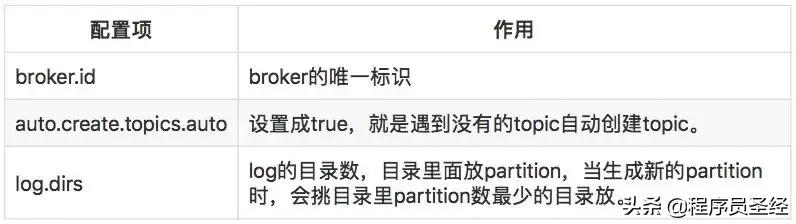

### Topic 配置


### kafka 持久化配置

因为磁盘限制，不可能永久保留所有数据（实际上也没必要），因此 Kafka 提供两种策略去删除旧数据。一是基于时间，二是基于 partition 文件大小。例如可以通过配置\$KAFKA_HOME/config/server.properties，让 Kafka 删除一周前的数据，也可通过配置让 Kafka 在 partition 文件超过 1GB 时删除旧数据，如下所示。

```
############################# Log Retention Policy #############################
# The following configurations control the disposal of log segments. The policy can
# be set to delete segments after a period of time, or after a given size has accumulated.
# A segment will be deleted whenever *either* of these criteria are met. Deletion always happens
# from the end of the log.
# The minimum age of a log file to be eligible for deletion
# 可以删除的日志文件的最小年龄
log.retention.hours=168
# A size-based retention policy for logs. Segments are pruned from the log as long as the remaining
# segments don't drop below log.retention.bytes.
#log.retention.bytes=1073741824
# The maximum size of a log segment file. When this size is reached a new log segment will be created.
#日志段文件的最大大小。当达到这个大小时，将创建一个新的日志段。
log.segment.bytes=1073741824
# The interval at which log segments are checked to see if they can be deleted according
# to the retention policies
log.retention.check.interval.ms=300000
# By default the log cleaner is disabled and the log retention policy will default to
#just delete segments after their retention expires.
# If log.cleaner.enable=true is set the cleaner will be enabled and individual logs
#can then be marked for log compaction.
log.cleaner.enable=false
```

Kafka 读取特定消息的时间复杂度为 O(1)，即与文件大小无关，所以这里删除文件与 Kafka 性能无关，选择怎样的删除策略只与磁盘以及具体的需求有关
