# Language Server protocol（LSP）

## 什么是LSP？

按照官方的定义，“The Language Server Protocol (LSP) defines the protocol used between an editor or IDE and a language server that provides language features like auto complete, go to definition, find all references etc.（语言服务器协议是一种被用于编辑器或集成开发环境 与 支持比如自动补全，定义跳转，查找所有引用等语言特性的语言服务器之间的一种协议）”。

       我们都知道，协议通常是通讯双方必须共同遵从的一组约定。对于LSP来说，这里的双方指的是“编辑器或集成开发环境（IDE）”与“语言服务器”。编辑器或集成开发环境（下文将两者统称IDE）我们都很熟悉，比如传统的代码编辑神器Sublime、近年广受前端工程师青睐的Atom、Java后端的Eclipse、用于.net开发的Microsoft Visual Studio等等。

       然而，关键是语言服务器（language server）是什么？简单来说，语言服务器就是一台/组提供了检查语言特性功能的服务器。当你提供相关的代码等信息给语言服务器后，它能响应给你关于语法检查、自动补全、跳转位置、引用查找等信息。

## 为什么需要LSP？LSP能解决什么问题？

说了这么多，到底LSP有什么用？为什么需要LSP？LSP能解决什么问题？

 传统上，安装一个IDE，即使离线使用也能解决语法检查、自动补全、跳转位置、引用查找等功能。为什么还要劳烦“语言服务器”？离线情况下便能使用Sublime、Eclipse等IDE，完成上述的语法特性检查，可以说明这些IDE的语法特性检查功能都是在本地实现的。不仅如此，还是各家IDE有各家的实现。也就是说，以Java IDE为例，对于Java的语法特性检查，IntelliJ IDEA有其自己的实现，Eclipse也有其自己的实现。IntelliJ IDEA并不直接支持scala语言，但是可以通过安装扩展的插件来支持，而该支持scala插件肯定是需要遵照IntelliJ IDEA的插件规范去实现，该插件并不能直接用于eclipse。

看出来问题了没有！如果要在任何IDE中提供支持任何编程语言的语言特性检查功能，其实现的复杂度是M*N！有M种编程语言，有N种IDE，就需要有M*N种插件（内置）的实现。

而LSP提出的改变了这种局面，使得编程语言社区能专注于不断完善一个能提供语法检查、自动补全、跳转位置、引用查找等语言特性检查的高性能“语言服务器”实现。与此同时，IDE厂商和组织只专注于提供能与任何“语言服务器”交互和“渲染”响应数据的实现方案即可。

我们再也不需要专门为IntelliJ IDEA写一个Python插件，为Sublime Text也专门写一个Python插件，为Vim也专门写一个...  我们只需要让Python社区贡献出一个能提供各种语言特性检查的“Python语言服务器”，该语言服务器支持LSP。而任何IDE只要支持LSP，都可以直接与该”Python语言服务器“交互以实现检查Python语言的效果。

## LSP的原理是怎样的？

笔者暂时没深入去了解LSP的规范，但可以猜测的是：IDE和语言服务器双方只需要遵照LSP去通讯，而当IDE收到响应反馈后，具体的显示效果可以是各异的。 比如，当IDE从语言服务器得到的反馈信息是：“第1行代码的第15个单词在该处不符合语法规则”时，甲IDE渲染出来的提示效果可能是“下划线”提示，而乙IDE渲染出来的提示效果可能是“画圈”提示。
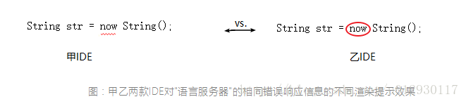

具体规范可参见：[Language Server Protocol Specification - Microsoft](https://microsoft.github.io/language-server-protocol/specification)

## 支持LSP的客户端

你可以下载任意一款支持LSP的编辑器或者IDE，通过简单的添加支持某编程语言的服务器配置，来快速完成对该编程语言的语言特性的检查。这意味着，只要你使用的编辑器或者IDE支持LSP，并且你要使用的编程语言社区有提供“语言服务器”，便可以快速地“武装”你的编辑器或IDE以支持该编程语言，再也不用纠结喜爱的IDE不支持某种编程语言了。

但由于LSP是自从2016年才由微软开源推广的，而主流的编辑器或者IDE通常已经有支持各类语言的插件，所以实际上来看，“语言服务器”的数量，可能并不比某主流IDE的语言支持插件要多。

说明
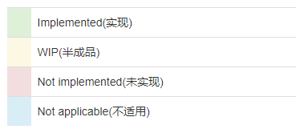

根据langserver.org网站的显示，目前已支持LSP的编辑器或IDE有：
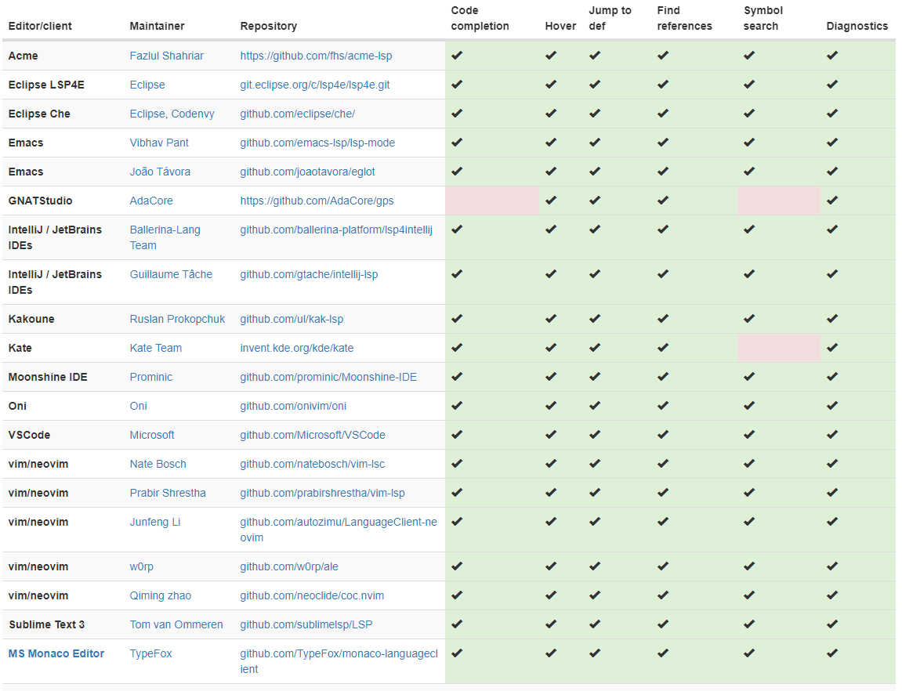
正在支持中：
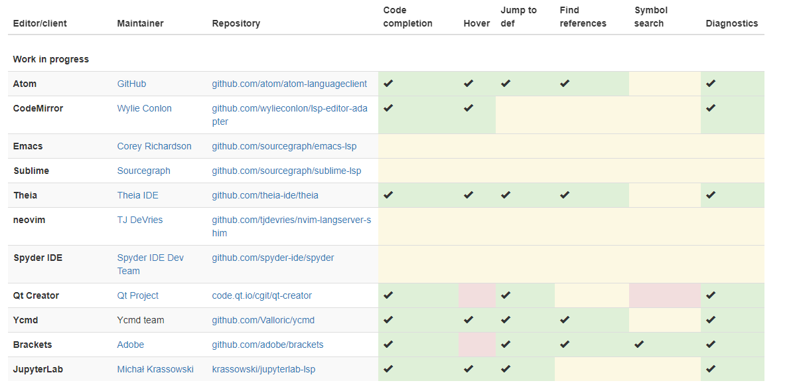

## Language servers

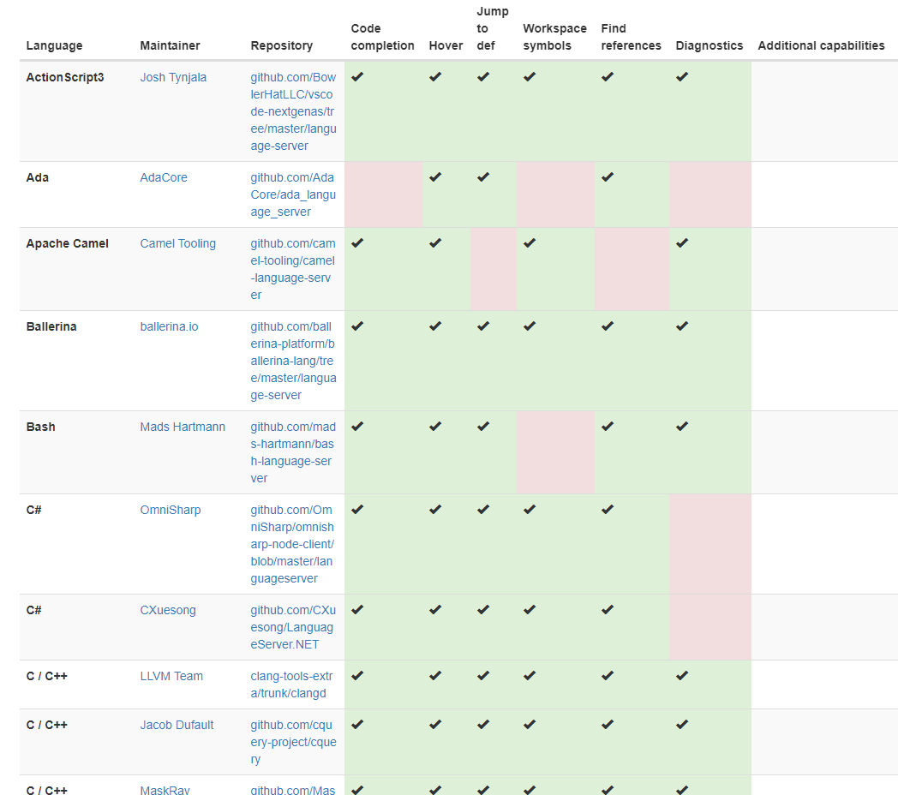
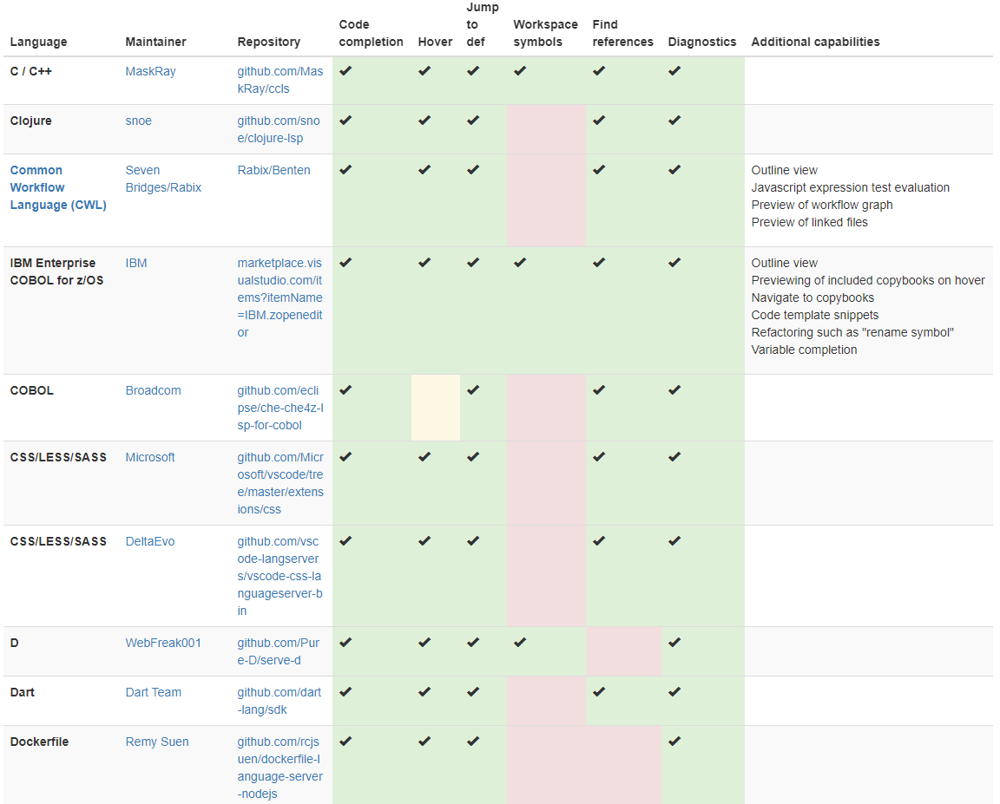
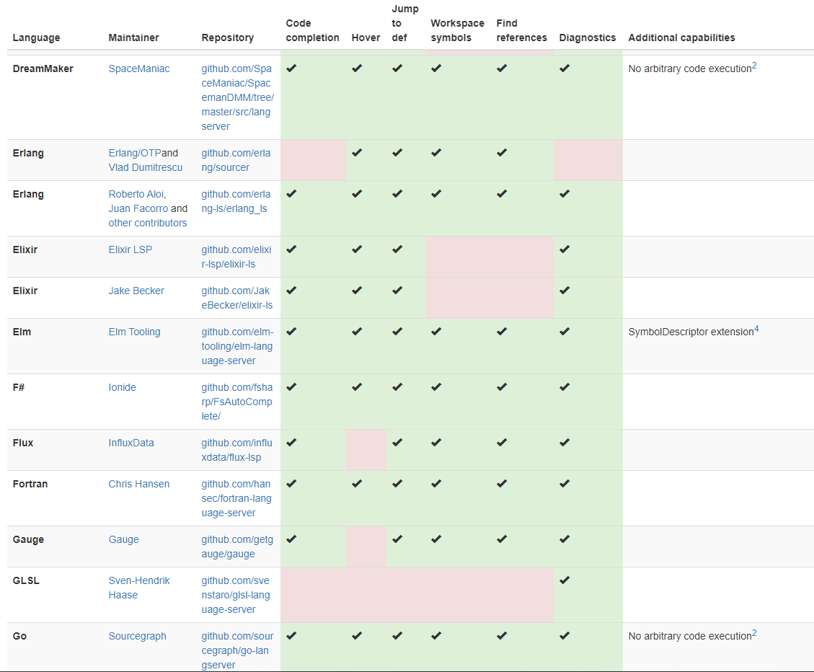
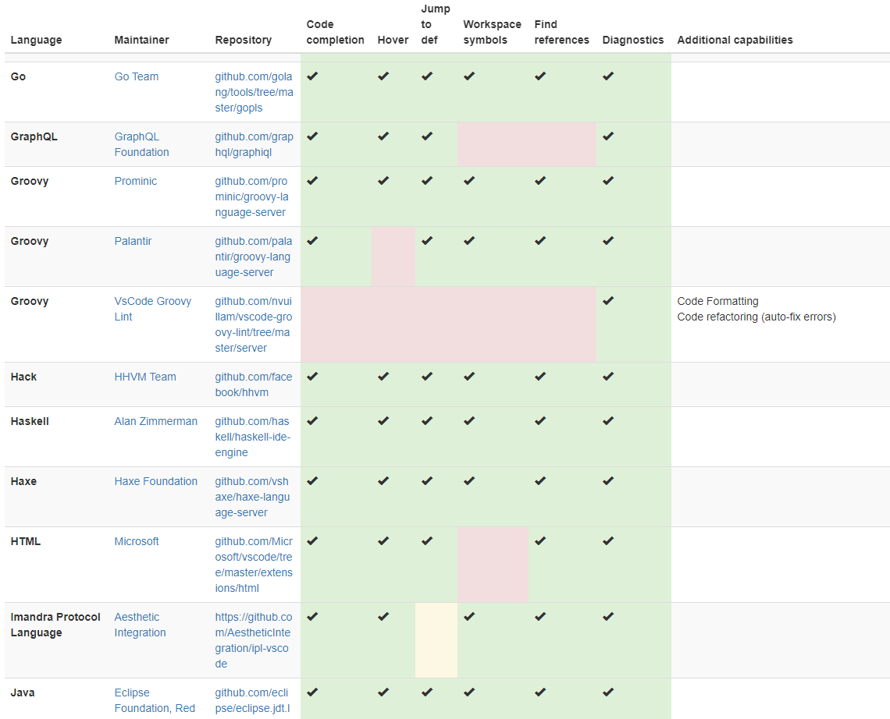
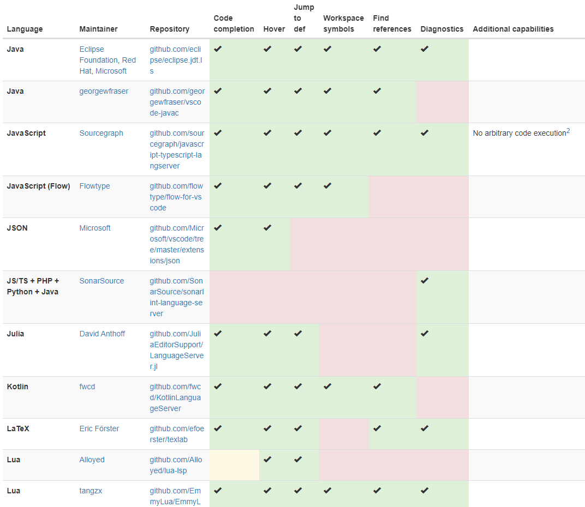

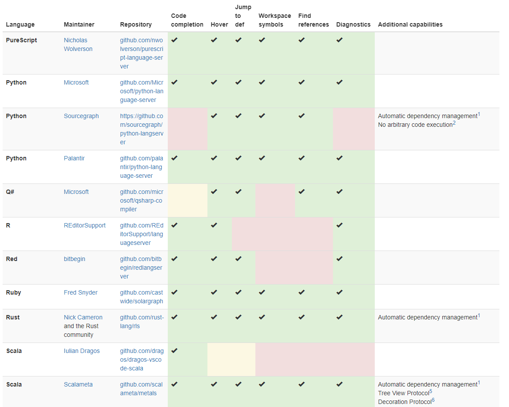
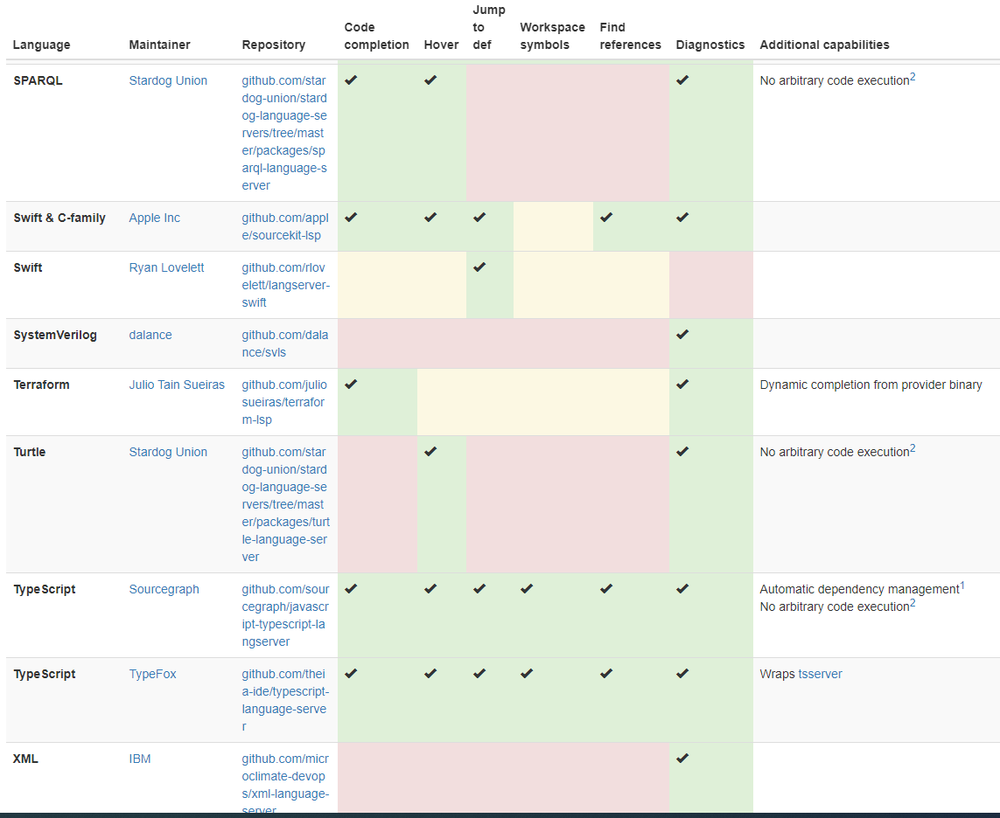
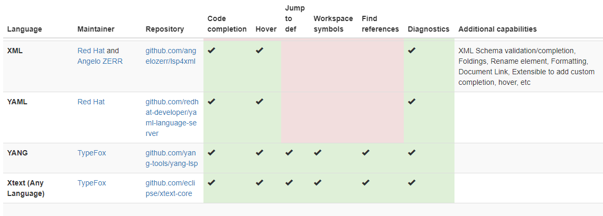
正在支持中：
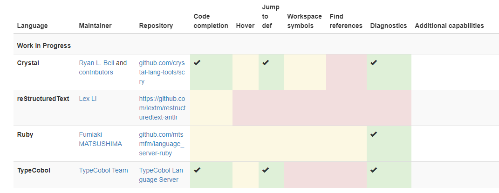
[Language Server Protocol](https://microsoft.github.io/language-server-protocol/)
[langserver](https://langserver.org/)

