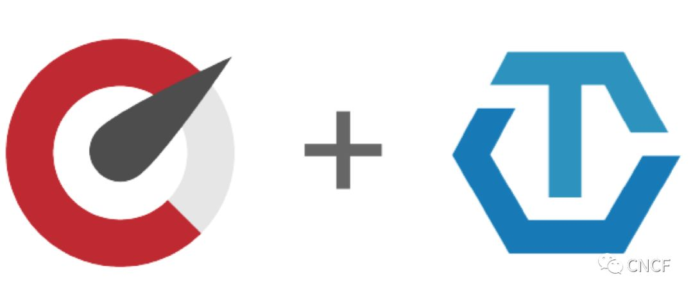
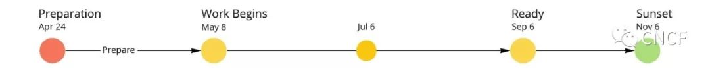
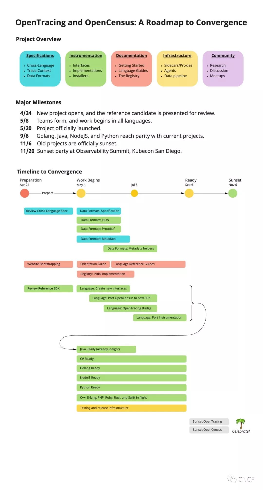

<!--toc-->
[TOC]
# 分布式跟踪
- [Tempo](https://github.com/grafana/tempo)
- Jaeger
- Zipkin
- OpenCensus

## Sentry 
这个监控也很好用, 支持的client很丰富
https://github.com/getsentry/sentry

https://docs.sentry.io/

opentelemetry浏览器侧支持不完善, [Sentry+opentelemetry](https://sentry.io/for/opentelemetry/)支持前后端链路打通

[self-hosted](https://github.com/getsentry/self-hosted)

```
git clone https://github.com/getsentry/self-hosted.git
cd self-hosted
./install.sh

docker-compose up -d
```
访问 http://localhost:9000

> 可以理解调用链+性能监控

## highlight
[highlight.io](https://github.com/highlight/highlight)：开源的全栈监控平台。包括错误监控、会话回放、日志记录等功能。

支持的client后端数量一般, 前端常用的框架基本上都支持

# APM
## DeepFlow
https://github.com/deepflowio/deepflow
eBPF类型监控
## SigNoz
是一个完整的解决方案, 是一款集日志、指标及追踪一体的开源平台
SigNoz是一个开源的性能监控工具(SigNoz is an open-source APM)，可以用来监控应用程序。SigNoz使用分布式跟踪获得可见性。

SigNoz在很多地方是基于OpenTelemetry体系的，他的collector是基于OpenTelemetry Collector的，他的客户端采样方式也是基于OpenTelemetry。

代码：https://github.com/SigNoz/signoz

官网站点：https://signoz.io/
## Odigos
https://github.com/keyval-dev/odigos
## skywalking
## cat
## Sentry
## pinpoint
## DataDog
## OpenObserve 
## Elastic APM
https://github.com/elastic/apm
## New Relic
https://github.com/newrelic

# opentelemetry

## OpenTelemetry Collector

### 介绍
OpenTelemetry Collector提供了与供应商无关的实现，以实现如何无缝地接收，处理和导出遥测数据。另外，它消除了运行，操作和维护多个代理/收集器的需要，以支持发送到多个开源或商业后端的开源可观察性数据格式（例如Jaeger，Prometheus等）。

### 目标：

- 可用：合理的默认配置，支持流行的协议，可以运行并立即收集。
- 性能：在不同的负载和配置下具有很高的稳定性和性能。
- 可观察的：可观察服务的示例。
- 可扩展：可定制，无需接触核心代码。
- 统一的：单个代码库，可部署为代理或收集器，并支持跟踪，指标和日志（未来）。
### 部署方式 Deployment
OpenTelemetry Collector由单个二进制文件和两种部署方法组成：

- 与应用程序一起运行或与应用程序位于同一主机上的代理（例如，二进制文件，sidecar或守护程序集）
- 作为独立服务运行的收集器（例如，容器或部署）

### Agent
建议在环境中的每个主机上部署代理。通过这样做，代理能够将元数据添加到其接收或收集的可观察性数据中。此外，代理还可以分担客户端工具原本需要处理的职责，包括批处理，重试，加密，压缩等。

### Collector
（可选）可以在每个群集/数据中心/区域中部署收集器。收集器作为独立服务运行，可以在代理上提供高级功能，包括基于尾部的采样。此外，收集器可以限制发送数据所需的出口点数量。每个收集器都独立运行，因此可以轻松地根据性能需求扩展体系结构。


https://opentelemetry.io/docs/collector/about/


# 合并OpenTracing和OpenCensus的趋同路线图




## 简短的版本

- 我们正在创建一套新的、统一的库和可观测遥测技术规范。它将合并OpenTracing和OpenCensus项目，并提供一个受支持的迁移路径。
- Java参考实现于4月24日发布，跨语言工作将于2019年5月8日正式开始。这里查看合并的时间表。
- 到2019年9月，我们计划与现有的C#、Golang、Java、NodeJS和Python项目实现功能对等。有很多事情要做，但是如果我们并行化，我们可以做到。如果你有兴趣参与这个项目，请登记并告诉我们你想如何贡献。
- 当每种语言达到功能对等时，对应的OpenTracing和OpenCensus项目将会消失。这意味着旧的项目将被冻结，但是新项目将通过向后兼容桥继续支持现有的测仪两年。

https://storage.googleapis.com/open-source-software/OpenConsensus%20Roadmap.jpg

https://forms.gle/HCGGoLRzoPm6o29K6

## 项目概述


我们合并！高级目标是将OpenTracing和OpenCensus项目综合成一个单一的、统一的项目。新项目的核心将是一组干净的、经过深思熟虑的接口，以及实现这些接口的库的规范分发（称为SDK）。数据和有线协议的推荐标准，以及基础设施的共同部分，完成了该项目。

其结果将是一个完整的遥测系统，适用于监测微服务和其他类型的现代分布式系统，并将兼容大多数主要的OSS和商业后端。

## 主要里程碑

- **4月24日** 推荐的候选提交评审。
- **5月8日** 组成团队，所有语言的工作开始。
- **5月20日** 项目在巴塞罗那KubeCon正式启动。
- **9月6日** C#、Golang、Java、NodeJS和Python项目实现功能对等。
- **11月6日** OpenTracing和OpenCensus项目正式落下帷幕。
- **11月20日** 圣地亚哥KubeCon的可观测性峰会举办日落派对。

## 趋同时间线



每种语言的迁移包括构建可生产的SDK、流行库的测仪、文档、CI、向后兼容性桥，以及关闭相关的OpenCensus和OpenTracing项目（“日落”）。我们已经定下一个雄心勃勃的目标，**2019年9月**是C#、Golang、Java、NodeJS和Python实现功能对等的目标日期。如果一种语言在那个时候还没有准备好，我们将把日落的日期推迟到日落的时候。但我们希望这不会发生。

当你检查下面的目标时，想想你想要如何参与其中。请填写登记表，或者在OpenTracing和OpenCensus Gitter聊天室中打招呼。

https://forms.gle/HCGGoLRzoPm6o29K6

https://gitter.im/opentracing/public

https://gitter.im/census-instrumentation/Lobby



时间轴的信息图表

## 目标：跨语言规范初稿（5月8日完成）

重要的是项目保持内聚性，即使我们在不同的语言上并行工作。跨语言规范为项目提供了此指导。它是用散文编写的，并且确保我们维护一个一致的系统，不管使用什么编程语言，这个系统都感觉很熟悉。

跨语言规范的初稿要求如下：

- 常用术语的定义。
- 用于描述分布式事务、统计和度量的模型。
- 澄清在执行过程中遇到的重要问题。

这个目标阻碍所有其他工作，初稿必须在**5月8日**前完成。

## 目标：数据规范初稿（7月6日完成）

数据规范为跟踪和度量定义了一种通用的数据格式，以便所有流程导出的数据都可以由相同的遥测基础设施处理，而不管流程如何生成数据。这包括用于跨语言规范中描述的跟踪模型的数据模式，还包括用于跟踪用于捕获的常见操作（如HTTP请求、错误和数据库查询）的元数据定义。这些语义约定就是一个例子。

https://github.com/opentracing/specification/blob/master/semantic\_conventions.md

第一个草案是基于当前OpenCensus数据格式，将包含以下内容：

- 实现跨语言规范的数据模式
- 常见操作的元数据定义。
- JSON和Protobuf定义。
- 客户端实现参考。

注意，还有一个用于在带内传播跟踪的有线协议，我们希望对其进行标准化。跟踪上下文（Trace-Context）传播格式正在通过W3C开发，可以在这里找到。

https://w3c.github.io/trace-context/

## 目标：在所有当前支持的语言中实现功能对等（9月6日完成）

为了使新项目取代现有项目，我们必须实现与现有语言生态系统的功能对等。

- 用于跟踪、度量和上下文传播的接口定义，基于跨语言规范。
- 一个可用于生产的SDK，它实现这些接口并导出跟踪数据。当可用时，SDK将通过移植现有OpenCensus实现来创建。
- 用于当前由OpenTracing和OpenCensus覆盖的流行库的测仪。

我们重视向后兼容性，并确保从现有项目顺利迁移。

- 新的SDK将包含一个OpenTracing桥，它实现了当前的OpenTracing接口。这允许遗留的OpenTracing测仪与同一过程中的新测仪一起工作，因此用户可以增量地迁移他们的测仪代码。
- 当新的SDK准备就绪时，现有OpenCensus用户的升级计划将可用。与OpenTracing一样，遗留的测仪将继续与新测仪一起工作。
- 到11月，OpenTracing和OpenCensus都将日落。从此以后，将不再发生提交。将在两年内支持与遗留测仪的向后兼容性。

为每种语言创建一流的SDK需要大量的工作，而这正是我们最需要帮助的地方。

## 目标：核心文档（9月6日完成）

文档对于任何开源项目的成功都是至关重要的。我们非常希望文档和学习成为一流的组件，编写文档的人被认为是这个项目的主要提交者。教开发者如何正确地观察他们的软件是我们想要对世界产生影响的关键部分。

至少，我们需要以下几点来开始：

- 项目定位
- 可观测性101
- 入门
- 语言指南（每种语言一本）

欢迎所有背景和技能水平的作家！新的网站是基于Hugo，markdown编写，非常容易作贡献。

## 目标：Registry v1.0（7月6日完成）

另一个关键组件是仓库，它是OpenTracing仓库的改进版本。

https://opentracing.io/registry

- 很容易找到库、插件、安装程序和其他组件。
- 轻松添加和管理仓库组件。
- 了解每种语言中的SDK特性。

如果你对设计、前端和UX感兴趣，这是一个很好的项目。

## 目标：测试和发布基础架构（9月6日完成）

我们有一个广泛的项目承诺，建立一个质量测试和发布管道，以确保我们继续交付我们可以依赖的安全代码。如果你关心测试、基准测试和发布管道，请让我们知道。我们将清楚地标记生产准备的水平，测试基础设施的成熟度将是一个主要的决定因素。

## 目标：日落OpenTracing和OpenCensus（11月6日完成）

到9月6日，如果新项目达到功能对等，现有项目将开始关闭。在每种语言达到功能对等之后的两个月，相应的OpenTracing和OpenCensus项目将会日落。这意味着：

- 存储库将被冻结，不再进行提交。
- 现有测仪将有两年的支持计划。
- 用户可以在继续使用现有测仪的同时升级到新的SDK。
- 可以增量地迁移测仪。


https://forms.gle/HCGGoLRzoPm6o29K6

https://gitter.im/opentracing/public

https://gitter.im/census-instrumentation/Lobby

https://github.com/bogdandrutu/openconsensus/

https://opentelemetry.io/

https://github.com/open-telemetry/opentelemetry-specification

[原文](https://cloud.tencent.com/developer/article/1548200)


# Team OpenCensus or OpenTracing? It'll be neither and both now: Hello, OpenTelemetry

KubeCon Europe Something odd happened at KubeCon 2019. Rather than snipe at each other from the safety of Twitter, two very similar open-source projects opted to pool their ideas into one: OpenTelemetry.

The project is geared towards solving the problem of working out just what the heck is happening in today's microservices or container-based apps. Logging without incurring a chunky overhead both in terms of generating useful telemetry and actually collating the output.

Distributed tracing is a bit more than fancy logging, as one commentator put it. Think more a transaction log over all the containers, services and components used in an application.

Two projects emerged to deal with the challenge – OpenCensus from Google and OpenTracing, co-created by Ben Sigelman of Lightstep.

In an interview with The Register, Sigelman reckoned that having the two options just left developers confused on the best approach and some would say: "'This is too confusing. I don't want to deal with this right now.' And they do neither."

Google's Morgan McLean agreed, adding without a hint of irony: "[Distributed] tracing itself is relatively new outside of horribly large internet companies."

Tracing is a particular obsession of Sigelman – he confessed to us that he'd been fixated with it over the last 15 years.

Still, it is to his credit that he has been willing to throw his open-source baby in with Google's take on telemetry. The leadership of both projects has committed to migrating their communities to this initiative. Those already invested need not fear too much, Sigelman and McLean insisted that backwards compatibility will be provided by software bridges.

However, dispensing with the old and embracing the new at some point would be a good idea – OpenTracing and OpenCensus will both be put into read-only mode by the end of 2019.

Sigelman also had reassuring words: "We're going to support OpenTracing and OpenCensus for a full two years after we've put them in read-only mode."

So not that urgent, and a welcome respite from the habit some open-source projects have of forcing users to upgrade at a rate that can leave enterprises a little dizzy.

As for actually using the thing, the team is keen that it be built into the frameworks upon which developers depend (Google's muscle will likely come in handy here). Sigelman explained: "Most applications, when you integrate, should actually be able to generate compliant traces based on the fact that they use popular frameworks."

Having experienced the pain of debugging containers in the past, we were keen to learn how low the tracing could go. Perhaps some naughty peeking at memory?

Alas, no – going down in the weeds could incur a penalty in terms of overhead, according to Sigelman. McClean agreed, regarding just getting distributed tracing out alone as "a huge win". However, he did add that later on, the gang might "pursue things like profiling and looking at kernel memory and others".

As for the output, the team pointed users to Prometheus and its ilk to actually do something with all that telemetry.

Sigelman also had some tips for those looking to do similar with near-duplicate projects in the increasingly fractious world of sniping foundations: cut down on the tweeting.

"If we only had Twitter, we would not have done it. Twitter amplifies negativity that wasn't even there, you know?" he said, before pointing to outsiders in both projects amplifying the negative messages.

[原文](https://www.theregister.co.uk/2019/05/21/opentelemetry/)