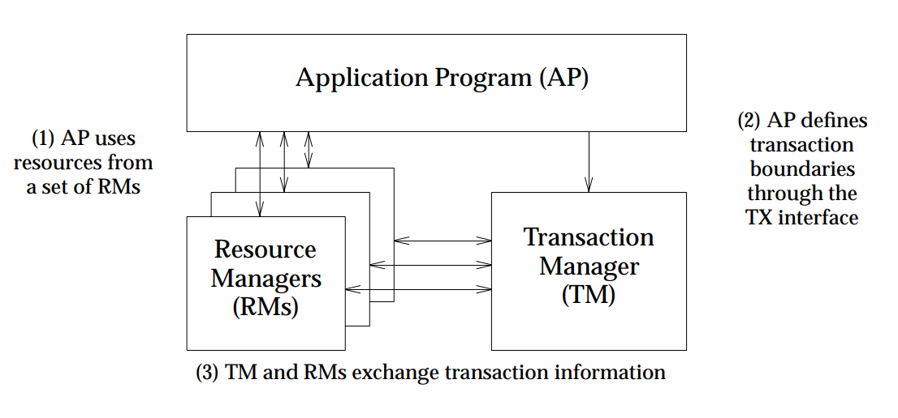

<!--toc-->
[TOC]

## 柔性事务
## DTP（Distributed Transaction Processing）模型
https://pubs.opengroup.org/onlinepubs/009680699/toc.pdf

- RM负责本地事务的提交，同时完成分支事务的注册、锁的判定，扮演事务参与者角色。
- TM负责整体事务的提交与回滚的指令的触发，扮演事务的总体协调者角色。

不同框架在实现时，各组件角色的功能、部署形态会根据需求进行调整，例如TM有的是以jar包形式与应用部署在一起，有的则剥离出来需要单独部署（例如Seata中将TM的主要功能放到一个逻辑上集中的Server上，叫做TC( Transaction Coordinator )）

## FLP
[FLP impossibility](https://www.cnblogs.com/firstdream/p/6585923.html)

### XA
XA协议本质上就是两阶段提交

基于XA的分布式事务如果要严格保证ACID，实际需要事务隔离级别为SERLALIZABLE

### MSTC
### 2PC
### TCC
TCC的特点在于业务资源检查与加锁，一阶段进行校验，资源锁定，如果第一阶段都成功，二阶段对锁定资源进行交易逻辑，否则，对锁定资源进行释放。应用实施成本较高。
### 本地消息表
### 可靠消息最终一致
有一些第三方的MQ是支持事务消息的，比如RocketMQ，他们支持事务消息的方式也是类似于采用的二阶段提交，但是市面上一些主流的MQ都是不支持事务消息的，比如 RabbitMQ 和 Kafka 都不支持。

以阿里的 RocketMQ 中间件为例，其思路大致为：

第一阶段Prepared消息，会拿到消息的地址。 第二阶段执行本地事务，第三阶段通过第一阶段拿到的地址去访问消息，并修改状态。

### Saga
Saga的核心就是补偿，一阶段就是服务的正常顺序调用（数据库事务正常提交），如果都执行成功，则第二阶段则什么都不做；但如果其中有执行发生异常，则依次调用其补偿服务（一般多逆序调用未已执行服务的反交易）来保证整个交易的一致性。应用实施成本一般。

### 阿里云GTS
### 阿里Seata 
阿里开源分布式事务框架Fescar，后来跟蚂蚁TCC方案整合后改名为Seata
https://github.com/seata/seata

- 应用层基于SQL解析实现了自动补偿，从而最大程度的降低业务侵入性；

- 将分布式事务中TC（事务协调者）独立部署，负责事务的注册、回滚；

- 通过全局锁实现了写隔离与读隔离。

> Seata的引入全局锁会额外增加死锁的风险

一条Update的SQL，则需要全局事务xid获取（与TC通讯）、before image（解析SQL，查询一次数据库）、after image（查询一次数据库）、insert undo log（写一次数据库）、before commit（与TC通讯，判断锁冲突），这些操作都需要一次远程通讯RPC，而且是同步的。

另外undo log写入时blob字段的插入性能也是不高的。每条写SQL都会增加这么多开销,粗略估计会增加5倍响应时间（二阶段虽然是异步的，但其实也会占用系统资源，网络、线程、数据库）。

#### Seata History
##### Ant Financial

###### XTS: 
Extended Transaction Service. Ant Financial middleware team developed the distributed transaction middleware since 2007, which is widely used in Ant Financial and solves the problems of data consistency across databases and services.

###### DTX: 
Distributed Transaction Extended. Since 2013, XTS has been published on the Ant Financial Cloud, with the name of DTX .

##### Alibaba

###### TXC: 
Taobao Transaction Constructor. Alibaba middleware team start this project since 2014 to meet distributed transaction problem caused by application architecture change from monolithic to microservices.

###### GTS: 
Global Transaction Service. TXC as an Aliyun middleware product with new name GTS was published since 2016.

###### Fescar: 
we start the open source project Fescar based on TXC/GTS since 2019 to work closely with the community in the future.

##### Seata Community

###### Seata :
Simple Extensible Autonomous Transaction Architecture. Ant Financial joins Fescar, which make it to be a more neutral and open community for distributed transaction，and Fescar be renamed to Seata.

#### Seata AT 模式
#### Seata TCC 模式

#### Seata Saga 模式

### LCN
https://github.com/codingapi/tx-lcn 国人写的，很少维护
LCN5.0.2有3种模式，分别是LCN模式，TCC模式，TXC模式

#### LCN模式：

LCN模式是通过代理Connection的方式实现对本地事务的操作，然后在由TxManager统一协调控制事务。当本地事务提交回滚或者关闭连接时将会执行假操作，该代理的连接将由LCN连接池管理。
该模式的特点：
- 该模式对代码的嵌入性为低。
- 该模式仅限于本地存在连接对象且可通过连接对象控制事务的模块。
- 该模式下的事务提交与回滚是由本地事务方控制，对于数据一致性上有较高的保障。
- 该模式缺陷在于代理的连接需要随事务发起方一共释放连接，增加了连接占用的时间。

#### TCC模式：

TCC事务机制相对于传统事务机制（X/Open XA Two-Phase-Commit），其特征在于它不依赖资源管理器(RM)对XA的支持，而是通过对（由业务系统提供的）业务逻辑的调度来实现分布式事务。主要由三步操作，Try: 尝试执行业务、 Confirm:确认执行业务、 Cancel: 取消执行业务。

该模式的特点：

- 该模式对代码的嵌入性高，要求每个业务需要写三种步骤的操作。
- 该模式对有无本地事务控制都可以支持使用面广。
- 数据一致性控制几乎完全由开发者控制，对业务开发难度要求高。
 
#### TXC模式：
TXC模式命名来源于淘宝，实现原理是在执行SQL之前，先查询SQL的影响数据，然后保存执行的SQL快走信息和创建锁。当需要回滚的时候就采用这些记录数据回滚数据库，目前锁实现依赖redis分布式锁控制。
该模式的特点：

- 该模式同样对代码的嵌入性低。
- 该模式仅限于对支持SQL方式的模块支持。
- 该模式由于每次执行SQL之前需要先查询影响数据，因此相比LCN模式消耗资源与时间要多。
- 该模式不会占用数据库的连接资源。