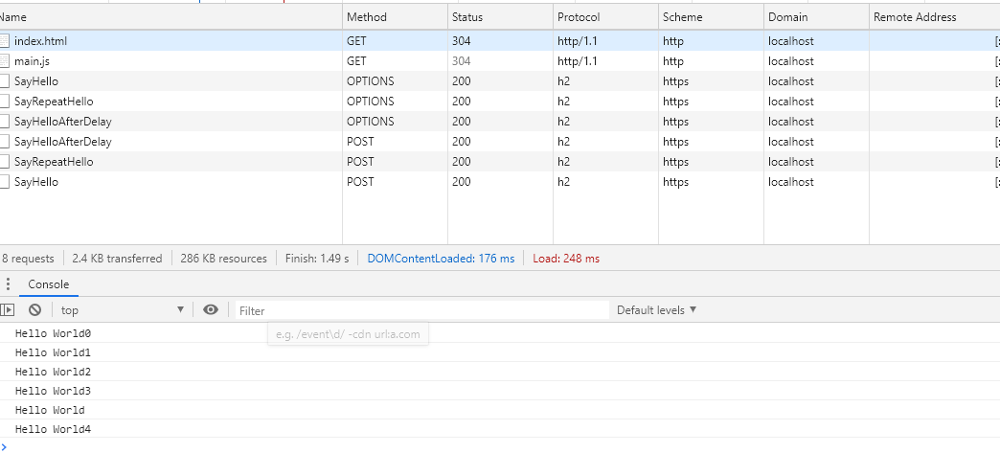

## grpc-web
https://github.com/BuiltCloud/grpc-web-demo



1. 创建grpc-service
https://github.com/KnowitSolutions/Grpc.Helpers
2. 创建grpc-web
https://github.com/grpc/grpc-web/tree/master/net/grpc/gateway/examples/helloworld
grpc-web
```
protoc -I=. helloworld.proto \
  --js_out=import_style=commonjs:. \
  --grpc-web_out=import_style=commonjs,mode=grpcwebtext:.
```
```
  npm install
```
```
npx webpack client.js
```
```
dotnet serve
```

https://github.com/grpc/grpc/blob/master/doc/PROTOCOL-WEB.md#protocol-differences-vs-grpc-over-http2

## protoc
protoc -h
```
  --cpp_out=OUT_DIR           Generate C++ header and source.
  --csharp_out=OUT_DIR        Generate C# source file.
  --java_out=OUT_DIR          Generate Java source file.
  --javanano_out=OUT_DIR      Generate Java Nano source file.
  --js_out=OUT_DIR            Generate JavaScript source.
  --objc_out=OUT_DIR          Generate Objective C header and source.
  --php_out=OUT_DIR           Generate PHP source file.
  --python_out=OUT_DIR        Generate Python source file.
  --ruby_out=OUT_DIR          Generate Ruby source file.
```

```
protoc --version

wget https://github.com/protocolbuffers/protobuf/releases/download/v3.3.0/protoc-3.3.0-linux-x86_64.zip

unzip protoc-3.14.0-linux-x86_64.zip
```

如果你打算用其中的包含的其他类型，同时需要将include目录的内容也复制到某个地方，例如输入/usr/local/include/

我们把protoc放在/usr/local/bin可执行程序目录中，这样全局都可以访问到，同时把include目录的内容也复制到/usr/local/include/中
```
# 移动安装proto (cd到解压目录bin中后执行)
mv proto /usr/local/bin

# 把`include`目录的内容复制(cd到解压目录include中后执行)
cp google /usr/local/include
```

### protoc-gen-go
1. 安装protoc (前面安装过的可以省略)

下载连接： https://github.com/protocolbuffers/protobuf/releases 

选择相应的版本下载并解压到制定目录

Linux： unzip protoc-3.10.0-rc-1-linux-x86_64.zip -d /usr/local/

2. 安装protoc-gen-go（golang安装版本）

go get -u github.com/golang/protobuf/protoc-gen-go

如果不行就编译
```
cd github.com/golang/protobuf/protoc-gen-go

go build

go install
```

> protoc-gen-go也可以在这里下载 https://github.com/protocolbuffers/protobuf-go/releases

https://grpc.io/docs/languages/go/quickstart/