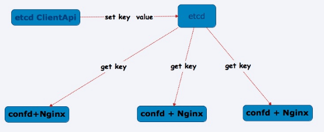

# hashicorp 


## Consul
https://github.com/hashicorp/consul
Consul provides several key features:

- Service Discovery - Consul makes it simple for services to register themselves and to discover other services via a DNS or HTTP interface. External services such as SaaS providers can be registered as well.

- Health Checking - Health Checking enables Consul to quickly alert operators about any issues in a cluster. The integration with service discovery prevents routing traffic to unhealthy hosts and enables service level circuit breakers.

- Service Segmentation/Service Mesh - Consul Connect enables secure service-to-service communication with automatic TLS encryption and identity-based authorization. Applications can use sidecar proxies in a service mesh configuration to establish TLS connections for inbound and outbound connections without being aware of Connect at all.

- Key/Value Storage - A flexible key/value store enables storing dynamic configuration, feature flagging, coordination, leader election and more. The simple HTTP API makes it easy to use anywhere.

- Multi-Datacenter - Consul is built to be datacenter aware, and can support any number of regions without complex configuration.

### fabio

https://github.com/fabiolb/fabio

Consul + fabio 实现自动服务发现、负载均衡
```
======    服务注册     =========         =========
  A服务      <------>       consul集群  ---->  健康的 A/不健康的 A 集群
======    健康检查     =========         =========
                                            ^
                                            | 加入/移出路由表
                                            |
                                     ========
                                      fabio 集群
                                     ========
                                             |
                                             | A服务   如果找到则成功路由，否则返回错误
                                             V
                                         http 请求
```

### consul-template
https://github.com/hashicorp/consul-template

Consul-Template是基于Consul的自动替换配置文件的应用(nginx)
动态的配置系统可以分化为Etcd+Confd和Consul+Consul-Template两大阵营。Consul-Template的定位和Confd差不多，Confd的后端可以是Etcd或者Consul。



### confd
https://github.com/kelseyhightower/confd
- confd supports the following backends:
- etcd
- consul
- vault
- environment variables
- file
- redis
- zookeeper
- dynamodb
- rancher
- ssm (AWS Simple Systems Manager Parameter Store)


## vault

https://github.com/hashicorp/vault