https://kafka.apache.org/

<!-- toc -->
[TOC]

## Topic & Partition
为了使得Kafka的吞吐率可以水平扩展，物理上把topic分成一个或多个partition，每个partition在物理上对应一个文件夹，该文件夹下存储这个partition的所有消息和索引文件。

查看位置：server.properties
log.dirs=/tmp/kafka-logs

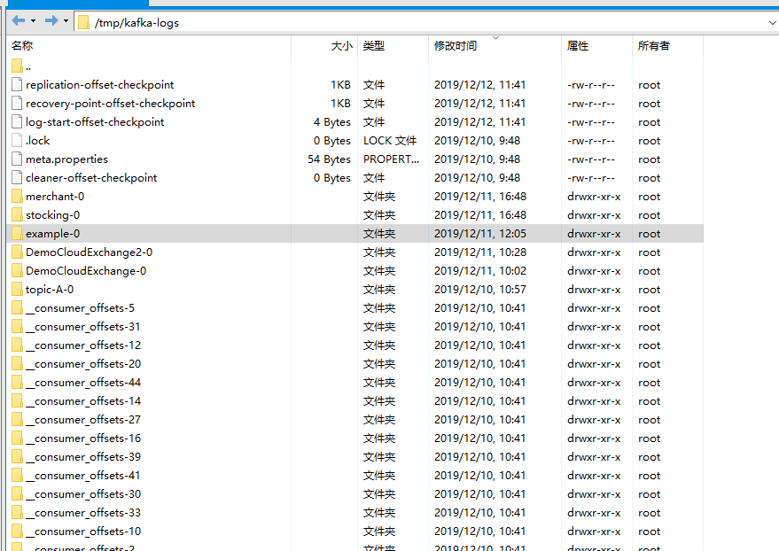
每个日志文件都是“log entries”序列，每一个log entry包含一个4字节整型数（值为N），其后跟N个字节的消息体。每条消息都有一个当前partition下唯一的64字节的offset，它指明了这条消息的起始位置。磁盘上存储的消息格式如下：
```
message length : 4 bytes (value: 1+4+n)
"magic" value : 1 bytes
crc : 4 bytes
payload : n bytes
```
这个“log entries”并非由一个文件构成，而是分成多个segment，每个segment名为该segment第一条消息的offset和“.kafka”组成。另外会有一个索引文件，它标明了每个segment下包含的log entry的offset范围，如下图所示。　　
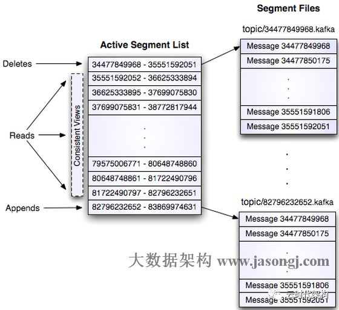

因为每条消息都被append到该partition中，是顺序写磁盘，因此效率非常高（经验证，顺序写磁盘效率比随机写内存还要高，这是Kafka高吞吐率的一个很重要的保证）。

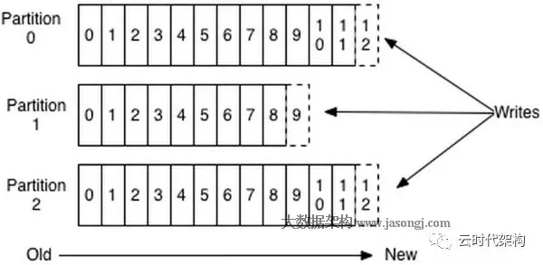
每一条消息被发送到broker时，会根据paritition规则选择被存储到哪一个partition。如果partition规则设置的合理，所有消息可以均匀分布到不同的partition里，这样就实现了水平扩展。（如果一个topic对应一个文件，那这个文件所在的机器I/O将会成为这个topic的性能瓶颈，而partition解决了这个问题）。

在创建topic时可以在$KAFKA_HOME/config/server.properties中指定这个partition的数量(如下所示)，当然也可以在topic创建之后去修改parition数量。
```
# The default number of log partitions per topic. More partitions allow greater
# parallelism for consumption, but this will also result in more files across
# the brokers.
num.partitions=1
```
在发送一条消息时，可以指定这条消息的key，producer根据这个key和partition机制来判断将这条消息发送到哪个parition。paritition机制可以通过指定producer的paritition. class这一参数来指定，该class必须实现kafka.producer.Partitioner接口。本例中如果key可以被解析为整数则将对应的整数与partition总数取余，该消息会被发送到该数对应的partition。（每个parition都会有个序号）
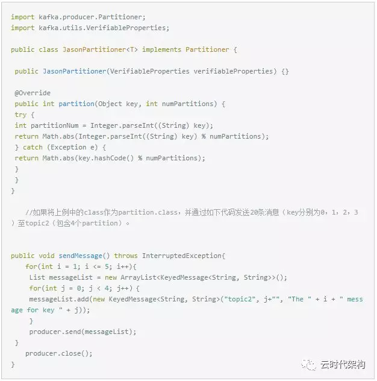
则key相同的消息会被发送并存储到同一个partition里，而且key的序号正好和partition序号相同。（partition序号从0开始，本例中的key也正好从0开始）。如下图所示。


对于传统的message queue而言，一般会删除已经被消费的消息，而Kafka集群会保留所有的消息，无论其被消费与否。当然，因为磁盘限制，不可能永久保留所有数据（实际上也没必要），因此Kafka提供两种策略去删除旧数据。一是基于时间，二是基于partition文件大小。例如可以通过配置$KAFKA_HOME/config/server.properties，让Kafka删除一周前的数据，也可通过配置让Kafka在partition文件超过1GB时删除旧数据，如下所示。

```

############################# Log Retention Policy #############################

# The following configurations control the disposal of log segments. The policy can
# be set to delete segments after a period of time, or after a given size has accumulated.
# A segment will be deleted whenever *either* of these criteria are met. Deletion always happens
# from the end of the log.

# The minimum age of a log file to be eligible for deletion due to age
log.retention.hours=168

# A size-based retention policy for logs. Segments are pruned from the log unless the remaining
# segments drop below log.retention.bytes. Functions independently of log.retention.hours.
#log.retention.bytes=1073741824

# The maximum size of a log segment file. When this size is reached a new log segment will be created.
log.segment.bytes=1073741824

# The interval at which log segments are checked to see if they can be deleted according
# to the retention policies
log.retention.check.interval.ms=300000
```
这里要注意，因为Kafka读取特定消息的时间复杂度为O(1)，即与文件大小无关，所以这里删除文件与Kafka性能无关，选择怎样的删除策略只与磁盘以及具体的需求有关。另外，Kafka会为每一个consumer group保留一些metadata信息–当前消费的消息的position，也即offset。这个offset由consumer控制。正常情况下consumer会在消费完一条消息后线性增加这个offset。当然，consumer也可将offset设成一个较小的值，重新消费一些消息。因为offet由consumer控制，所以Kafka broker是无状态的，它不需要标记哪些消息被哪些consumer过，不需要通过broker去保证同一个consumer group只有一个consumer能消费某一条消息，因此也就不需要锁机制，这也为Kafka的高吞吐率提供了有力保障。

### 日志分段存储
Kafka 规定了一个分区内的 .log 文件最大为 1G，做这个限制目的是为了方便把 .log 加载到内存去操作：
00000000000000000000.index
00000000000000000000.log
00000000000000000000.timeindex
00000000000005367851.index
00000000000005367851.log
00000000000005367851.timeindex
00000000000009936472.index
00000000000009936472.log
00000000000009936472.timeindex
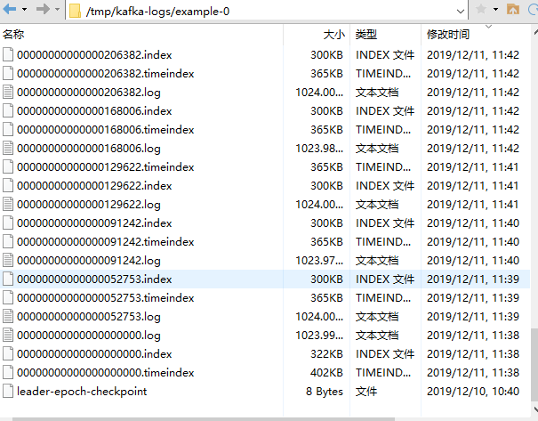

这个 9936472 之类的数字，就是代表了这个日志段文件里包含的起始 Offset，也就说明这个分区里至少都写入了接近 1000 万条数据了。

Kafka Broker 有一个参数，log.segment.bytes，限定了每个日志段文件的大小，最大就是 1GB。
一个日志段文件满了，就自动开一个新的日志段文件来写入，避免单个文件过大，影响文件的读写性能，这个过程叫做 log rolling，正在被写入的那个日志段文件，叫做 active log segment。

如果大家有了解 HDFS 就会发现 NameNode 的 edits log 也会做出限制，所以这些框架都是会考虑到这些问题。


为了减少索引文件的大小，降低空间使用，方便直接加载进内存中，这里的索引使用稀疏矩阵，不会每一个 Message 都记录下具体位置，而是每隔一定的字节数，再建立一条索引。

索引包含两部分：

BaseOffset：意思是这条索引对应 Segment 文件中的第几条 Message。这样做方便使用数值压缩算法来节省空间。例如 Kafka 使用的是 Varint。
Position：在 Segment 中的绝对位置。

查找 Offset 对应的记录时，会先用二分法，找出对应的 Offset 在哪个 Segment 中，然后使用索引，在定位出 Offset 在 Segment 中的大概位置，再遍历查找 Message。


### 高可靠分布式存储模型
在Kafka中保证高可靠模型的依靠的是副本机制，有了副本机制之后，就算机器宕机也不会发生数据丢失。
#### 高性能的日志存储

kafka一个topic下面的所有消息都是以partition的方式分布式的存储在多个节点上。同时在kafka的机器上，每个Partition其实都会对应一个日志目录，在目录下面会对应多个日志分段(LogSegment)。LogSegment文件由两部分组成，分别为“.index”文件和“.log”文件，分别表示为segment索引文件和数据文件。这两个文件的命令规则为：partition全局的第一个segment从0开始，后续每个segment文件名为上一个segment文件最后一条消息的offset值，数值大小为64位，20位数字字符长度，没有数字用0填充，如下，假设有1000条消息，每个LogSegment大小为100，下面展现了900-1000的索引和Log：

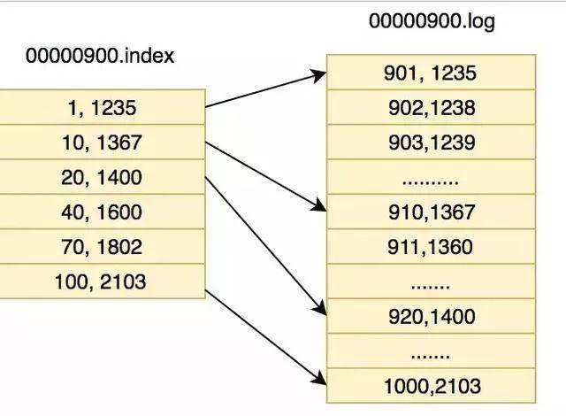

由于kafka消息数据太大，如果全部建立索引，即占了空间又增加了耗时，所以kafka选择了稀疏索引的方式，这样的话索引可以直接进入内存，加快偏查询速度。

简单介绍一下如何读取数据，如果我们要读取第911条数据首先第一步，找到他是属于哪一段的，根据二分法查找到他属于的文件，找到0000900.index和00000900.log之后，然后去index中去查找 (911-900) =11这个索引或者小于11最近的索引,在这里通过二分法我们找到了索引是[10,1367]然后我们通过这条索引的物理位置1367，开始往后找，直到找到911条数据。

上面讲的是如果要找某个offset的流程，但是我们大多数时候并不需要查找某个offset,只需要按照顺序读即可，而在顺序读中，操作系统会对内存和磁盘之间添加page cahe，也就是我们平常见到的预读操作，所以我们的顺序读操作时速度很快。但是kafka有个问题，如果分区过多，那么日志分段也会很多，写的时候由于是批量写，其实就会变成随机写了，随机I/O这个时候对性能影响很大。所以一般来说Kafka不能有太多的partition。针对这一点，RocketMQ把所有的日志都写在一个文件里面，就能变成顺序写，通过一定优化，读也能接近于顺序读。


#### 副本机制
Kafka的副本机制是多个服务端节点对其他节点的主题分区的日志进行复制。当集群中的某个节点出现故障，访问故障节点的请求会被转移到其他正常节点(这一过程通常叫Reblance),kafka每个主题的每个分区都有一个主副本以及0个或者多个副本，副本保持和主副本的数据同步，当主副本出故障时就会被替代。

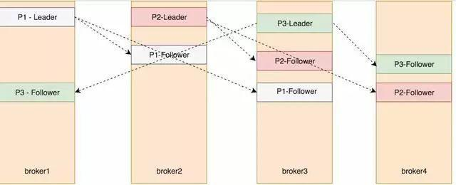
在Kafka中并不是所有的副本都能被拿来替代主副本，所以在kafka的leader节点中维护着一个ISR(In sync Replicas)集合，翻译过来也叫正在同步中集合，在这个集合中的需要满足两个条件:
- 节点必须和ZK保持连接
- 在同步的过程中这个副本不能落后主副本太多

另外还有个AR(Assigned Replicas)用来标识副本的全集,OSR用来表示由于落后被剔除的副本集合，所以公式如下:ISR = leader + 没有落后太多的副本; AR = OSR+ ISR;

这里先要说下两个名词:HW(高水位)是consumer能够看到的此partition的位置，LEO是每个partition的log最后一条Message的位置。HW能保证leader所在的broker失效，该消息仍然可以从新选举的leader中获取，不会造成消息丢失。

当producer向leader发送数据时，可以通过request.required.acks参数来设置数据可靠性的级别：
- 1（默认）：这意味着producer在ISR中的leader已成功收到的数据并得到确认后发送下一条message。如果leader宕机了，则会丢失数据。

- 0：这意味着producer无需等待来自broker的确认而继续发送下一批消息。这种情况下数据传输效率最高，但是数据可靠性确是最低的。

- -1：producer需要等待ISR中的所有follower都确认接收到数据后才算一次发送完成，可靠性最高。但是这样也不能保证数据不丢失，比如当ISR中只有leader时(其他节点都和zk断开连接，或者都没追上)，这样就变成了acks=1的情况。


## 持久化
Kafka对消息的存储和缓存依赖于文件系统，每次接收数据都会往磁盘上写，人们对于“磁盘速度慢”的普遍印象，使得人们对于持久化的架构能够提供强有力的性能产生怀疑。

事实上，磁盘的速度比人们预期的要慢的多，也快得多，这取决于人们使用磁盘的方式。而且设计合理的磁盘结构通常可以和网络一样快。

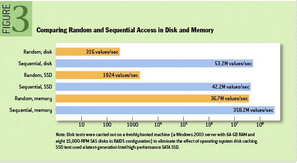

通过上图对比，我们可以看出实际上顺序磁盘访问在某些情况下比随机内存访问还要快，其实Kafka就是利用这一优势来实现高性能写磁盘

See:http://kafka.apachecn.org/documentation.html#persistence

### 页缓存技术 + 磁盘顺序写
Kafka就是基于页缓存技术 + 磁盘顺序写 技术实现了写入数据的超高性能。

所以要保证每秒写入几万甚至几十万条数据的核心点，就是尽最大可能提升每条数据写入的性能，这样就可以在单位时间内写入更多的数据量，提升吞吐量。
#### 页缓存技术
Kafka 为了保证磁盘写入性能，首先Kafka是基于操作系统的页缓存来实现文件写入的。

操作系统本身有一层缓存，叫做page cache，是在内存里的缓存，我们也可以称之为os cache，意思就是操作系统自己管理的缓存。

你在写磁盘文件的时候，可以直接写入os cache 中，也就是仅仅写入内存中，接下来由操作系统自己决定什么时候把os cache 里的数据真的刷入到磁盘中。

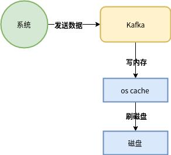
通过上图这种方式可以将磁盘文件的写性能提升很多，其实这种方式相当于写内存，不是在写磁盘

#### 顺序写磁盘
另外还有非常关键的一点，Kafka在写数据的时候是以磁盘顺序写的方式来落盘的，也就是说，仅仅将数据追加到文件的末尾(append)，而不是在文件的随机位置来修改数据。

对于普通的机械硬盘如果你要是随机写的话，确实性能极低，这里涉及到磁盘寻址的问题。但是如果只是追加文件末尾按照顺序的方式来写数据的话，那么这种磁盘顺序写的性能基本上可以跟写内存的性能本身是差不多的。

---
操作系统每次从磁盘读写数据的时候，需要先寻址，也就是先要找到数据在磁盘上的物理位置，然后再进行数据读写，如果是机械硬盘，寻址就需要较长的时间。

Kafka 的设计中，数据其实是存储在磁盘上面，一般来说，会把数据存储在内存上面性能才会好。

但是 Kafka 用的是顺序写，追加数据是追加到末尾，磁盘顺序写的性能极高，在磁盘个数一定，转数达到一定的情况下，基本和内存速度一致。

随机写的话是在文件的某个位置修改数据，性能会较低。

## 零拷贝技术(zero-copy)
说完了写入这块，再来谈谈消费这块。

大家应该都知道，从Kafka里我们经常要消费数据，那么消费的时候实际上就是要从kafka的磁盘文件里读取某条数据然后发送给下游的消费者，如下图所示：

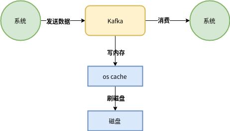
如果Kafka以上面这种方式从磁盘中读取数据发送给下游的消费者，大概过程是：

1. 先看看要读的数据在不在os cache中，如果不在的话就从磁盘文件里读取数据后放入os cache
2. 接着从操作系统的os cache 里拷贝数据到应用程序进程的缓存里，再从应用程序进程的缓存里拷贝数据到操作系统层面的Socket缓存里，最后从Soket缓存里提取数据后发送到网卡，最后发送出去给下游消费者

非零拷贝

可以看到数据的拷贝从内存拷贝到 Kafka 服务进程那块，又拷贝到 Socket 缓存那块，整个过程耗费的时间比较高。
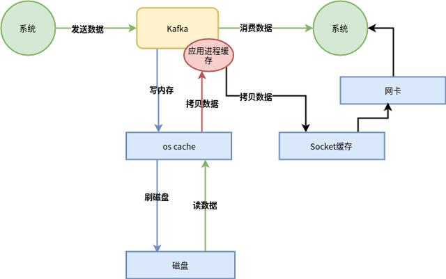
> **从上图可以看出，这整个过程有两次没必要的拷贝**
>一次是从操作系统的cache里拷贝到应用进程的缓存里，接着又从应用程序缓存里拷贝回操作系统的Socket缓存里。
>而且为了进行这两次拷贝，中间还发生了好几次上下文切换，一会儿是应用程序在执行，一会儿上下文切换到操作系统来执行。
>所以这种方式来读取数据是比较消耗性能的。

Kafka 为了解决这个问题，在读数据的时候是引入零拷贝技术。

也就是说，直接让操作系统的cache中的数据发送到网卡后传出给下游的消费者，中间跳过了两次拷贝数据的步骤，Socket缓存中仅仅会拷贝一个描述符过去，不会拷贝数据到Socket缓存。

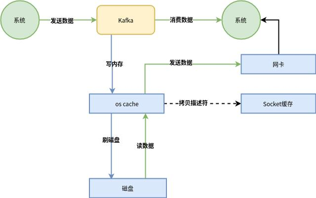
>体会一下这个精妙的过程吧
>通过零拷贝技术，就不需要把os cache里的数据拷贝到应用缓存，再从应用缓存拷贝到Socket缓存了，两次拷贝都省略了，所以叫做零拷贝。
>对Socket缓存仅仅就是拷贝数据的描述符过去，然后数据就直接从os cache中发送到网卡上去了，这个过程大大的提升了数据消费时读取文件数据的性能。
>而且大家会注意到，在从磁盘读数据的时候，会先看看os cache内存中是否有，如果有的话，其实读数据都是直接读内存的。
>如果kafka集群经过良好的调优，大家会发现大量的数据都是直接写入os cache中，然后读数据的时候也是从os cache中读。
>相当于是Kafka完全基于内存提供数据的写和读了，所以这个整体性能会极其的高。

---

Kafka 利用了 Linux 的 sendFile 技术(NIO)，省去了进程切换和一次数据拷贝，让性能变得更好。

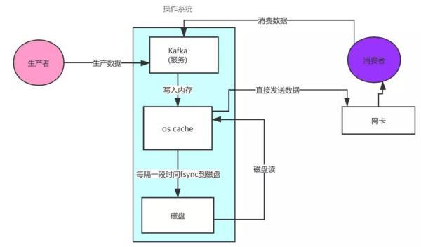


## Kafka 的网络设计

Kafka 的网络设计和 Kafka 的调优有关，这也是为什么它能支持高并发的原因：
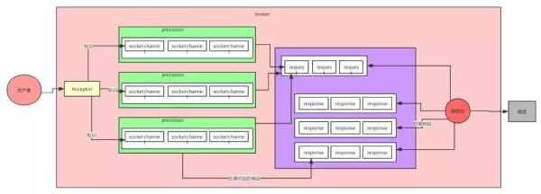


首先客户端发送请求全部会先发送给一个 Acceptor，Broker 里面会存在 3 个线程(默认是 3 个)。

这 3 个线程都是叫做 Processor，Acceptor 不会对客户端的请求做任何的处理，直接封装成一个个 socketChannel 发送给这些 Processor 形成一个队列。

发送的方式是轮询，就是先给第一个 Processor 发送，然后再给第二个，第三个，然后又回到第一个。

消费者线程去消费这些 socketChannel 时，会获取一个个 Request 请求，这些 Request 请求中就会伴随着数据。

线程池里面默认有 8 个线程，这些线程是用来处理 Request 的，解析请求，如果 Request 是写请求，就写到磁盘里。读的话返回结果。

Processor 会从 Response 中读取响应数据，然后再返回给客户端。这就是 Kafka 的网络三层架构。

所以如果我们需要对 Kafka 进行增强调优，增加 Processor 并增加线程池里面的处理线程，就可以达到效果。

Request 和 Response 那一块部分其实就是起到了一个缓存的效果，是考虑到 Processor 们生成请求太快，线程数不够不能及时处理的问题。

所以这就是一个**加强版的 Reactor 网络线程模型**。


### KafkaClient --单线程Selector

单线程模式适用于并发链接数小，逻辑简单，数据量小。

在kafka中，consumer和producer都是使用的上面的单线程模式。这种模式不适合kafka的服务端，在服务端中请求处理过程比较复杂，会造成线程阻塞，一旦出现后续请求就会无法处理，会造成大量请求超时，引起雪崩。而在服务器中应该充分利用多线程来处理执行逻辑。

### Kafka--server -- 多线程Selector
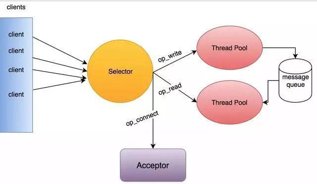

在kafka服务端采用的是多线程的Selector模型，Acceptor运行在一个单独的线程中，对于读取操作的线程池中的线程都会在selector注册read事件，负责服务端读取请求的逻辑。成功读取后，将请求放入message queue共享队列中。然后在写线程池中，取出这个请求，对其进行逻辑处理，即使某个请求线程阻塞了，还有后续的县城从消息队列中获取请求并进行处理，在写线程中处理完逻辑处理，由于注册了OP_WIRTE事件，所以还需要对其发送响应。


## Replication & Leader election

Kafka从0.8开始提供partition级别的replication，replication的数量可在$KAFKA_HOME/config/server.properties中配置。
```
############################# Internal Topic Settings  #############################
# The replication factor for the group metadata internal topics "__consumer_offsets" and "__transaction_state"
# For anything other than development testing, a value greater than 1 is recommended for to ensure availability such as 3.
offsets.topic.replication.factor=1
transaction.state.log.replication.factor=1
transaction.state.log.min.isr=1
```


https://mp.weixin.qq.com/s/QRNb4Az5HKvo0seGHTBvww


## KSQL
KSQL是Apache Kafka的SQL流引擎。它提供了易于使用但功能强大的交互式SQL界面，用于在Kafka上进行流处理，而无需使用Java或Python之类的编程语言编写代码。KSQL具有可伸缩性，弹性和容错性。它支持各种流操作，包括数据过滤，转换，聚合，联接，窗口和会话化。
https://docs.confluent.io/current/ksql/docs/index.html