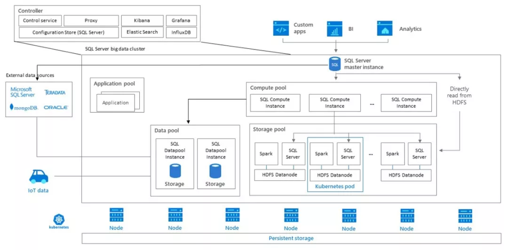

[选择SQL Server 2019的十大原因](../files/sqlserver/SQL_Server_2019_Top_10_Reasons_to_Choose_ZH_CN.pdf)
[数据分析](../files/sqlserver/SQL_Server_2019_Transform-Data_into_Insights_Infographic_ZH_CN.pdf)
[白皮书](../files/sqlserver/EN-US-CNTNT-white-paper-DBMod-Microsoft-SQL-Server-2019-Technical-white-paper.pdf)

[SQL Server 2019深度解读：微软数据平台的野望](https://mp.weixin.qq.com/s?__biz=MjM5MDE0Mjc4MA==&mid=2651021946&idx=2&sn=73e80b1cf61c9d01c861fe3b8a2069a9&chksm=bdbe9a298ac9133f48b7c56580be4b2e890a0b4583dfe788fec0747fc3647c0f86de7c581e67&mpshare=1&scene=1&srcid=&sharer_sharetime=1573034039525&sharer_shareid=16697c4af176d0bae6f144be947679f7#rd)


我们再来看编程语言集成方面。以往扩展 SQL Server 功能是 C#/.NET 的专利，例如用户可以通过 SQL Server 的 CLR 集成调用.NET 编写的 UDF。随着微软近年来的开放策略持续推进，更多语言进入了 SQL Server 的体系。两年前我们曾介绍 SQL Server 2017 中集成了 Python/R 的环境以方便进行机器学习方面工作，而在 SQL Server 2019 中此次 Java 则成为了主要的集成和支持对象。通过全新的语言扩展体系 (SQL Server Language Extensions) 可使得 Java 类与方法直接在 SQL Server 服务器上本地执行。用户只需要实现微软 Java 扩展 SDK (Microsoft Extensibility SDK for Java) 中的抽象类 AbstractSqlServerExtensionExecutor 即可让自己封装的 Java 代码通过 sp_execute_external_script 存储过程在数据库 T-SQL 上下文中调用运行。

在 SQL Server 2016 中 PolyBase 则真正变得成熟并且广为人知，正式出现在了标准 SQL Server 中，大大地拓展了受众。
Polybase 的外联能力在 SQL Server 2019 版本中进一步得到了强化，除原先支持的 Hadoop 和 Azure Blob Storage 外，新版本额外添加了 SQL Server、Oracle、Teradata、MongoDB 和 ODBC 的支持。如果说 PolyBase 之前只是不起眼的附属功能，在强调数据虚拟化的 SQL Server 2019 中已是位居聚光灯下的核心能力。
不妨来看一个在 SQL Server 2019 中使用 PolyBase 配置远端 MongoDB 数据源的简单例子，以此来理解数据虚拟化的落地形态。
```
CREATE DATABASE SCOPED CREDENTIAL MongoCredential 
  WITH IDENTITY = 'username', SECRET = 'password';
CREATE EXTERNAL DATA SOURCE MongoDBSource
  WITH (  
    LOCATION = 'mongodb://<server>[:<port>]',
    PUSHDOWN = ON,
    CREDENTIAL = MongoCredential 
  );
CREATE EXTERNAL TABLE MyMongoCollection(
  [_id] NVARCHAR(24) NOT NULL,  
  [column1] NVARCHAR(MAX) NOT NULL,
  [column2] INT NOT NULL
  -- ..., other columns to be mapped
)
  WITH (
    LOCATION='dbname.collectionname',
    DATA_SOURCE= MongoDBSource
  );
```