https://www.toutiao.com/a6602010040293392904/
https://www.toutiao.com/a6763994195544785421/

https://zookeeper.apache.org/

http://zookeeper.apache.org/doc/current/recipes.html

[TOC]

# ZooKeeper

## 什么是 ZooKeeper
ZooKeeper 的由来
Zookeeper最早起源于雅虎研究院的一个研究小组。在当时，研究人员发现，在雅虎内部很多大型系统基本都需要依赖一个类似的系统来进行分布式协调，但是这些系统往往都存在分布式单点问题。所以，雅虎的开发人员就试图开发一个通用的无单点问题的分布式协调框架，以便让开发人员将精力集中在处理业务逻辑上。

关于“ZooKeeper”这个项目的名字，其实也有一段趣闻。在立项初期，考虑到之前内部很多项目都是使用动物的名字来命名的（例如著名的Pig项目),雅虎的工程师希望给这个项目也取一个动物的名字。时任研究院的首席科学家RaghuRamakrishnan开玩笑地说：“在这样下去，我们这儿就变成动物园了！”此话一出，大家纷纷表示就叫动物园管理员吧一一一因为各个以动物命名的分布式组件放在一起，雅虎的整个分布式系统看上去就像一个大型的动物园了，而Zookeeper正好要用来进行分布式环境的协调一一于是，Zookeeper的名字也就由此诞生了。

ZooKeeper主要服务于分布式系统，可以用ZooKeeper来做：统一配置管理、统一命名服务、分布式锁、集群管理。

使用分布式系统就无法避免对节点管理的问题(需要实时感知节点的状态、对节点进行统一管理等等)，而由于这些问题处理起来可能相对麻烦和提高了系统的复杂性，ZooKeeper作为一个能够通用解决这些问题的中间件就应运而生了。

## ZooKeeper 概览
ZooKeeper 是一个开源的分布式协调服务，ZooKeeper框架最初是在“Yahoo!"上构建的，用于以简单而稳健的方式访问他们的应用程序。 后来，Apache ZooKeeper成为Hadoop，HBase和其他分布式框架使用的有组织服务的标准。 例如，Apache HBase使用ZooKeeper跟踪分布式数据的状态。ZooKeeper 的设计目标是将那些复杂且容易出错的分布式一致性服务封装起来，构成一个高效可靠的原语集，并以一系列简单易用的接口提供给用户使用。

ZooKeeper 是一个典型的分布式数据一致性解决方案，分布式应用程序可以基于 ZooKeeper 实现诸如数据发布/订阅、负载均衡、命名服务、分布式协调/通知、集群管理、Master 选举、分布式锁和分布式队列等功能。

Zookeeper 一个最常用的使用场景就是用于担任服务生产者和服务消费者的注册中心。 服务生产者将自己提供的服务注册到Zookeeper中心，服务的消费者在进行服务调用的时候先到Zookeeper中查找服务，获取到服务生产者的详细信息之后，再去调用服务生产者的内容与数据。

## 能做什么

### 发布/订阅
数据发布/订阅（Publish/Subscribe）系统，即所谓的配置中心，顾明思义就是发布者将数据发布到zookeeper的一个或一系列的节点上，供订阅者进行数据订阅，进而达到动态获取数据的目的，实现配置信息的集中式管理和数据的动态更新。

zookeeper采用推拉结合的方式来实现发布订阅系统：客户端向服务端注册自己需要关注的节点，一旦该节点的数据发生变更，那么服务端就会向相应的客户端发送Watcher事件通知，客户端接收到这个消息通知之后，需要主动到服务端获取最新的数据。

程序总是需要配置的，如果程序分散部署在多台机器上，要这个改变配置就变得困难。好吧，现在把这些配置全部放到zookeeper上去，保存在zookeeper的某个目录节点中，然后所有相关应用程序对这个目录节点进行监控，一旦配置信息发生变化，每个应用程序就会收到zookeeper的通知，然后从zookeeper中获取新的配置信息应用到系统中就好
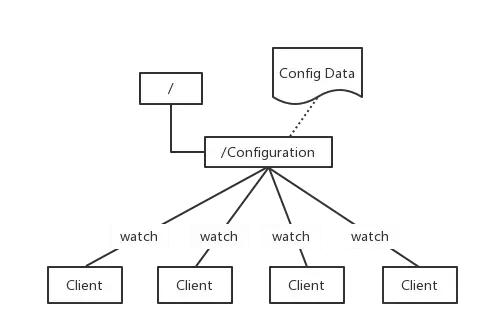

### 负载均衡
每台服务端在启动时都会去zookeeper的servers节点下注册临时节点（注册临时节点是因为，当服务不可用时，这个临时节点会消失，客户端也就不会请求这个服务端），每台客户端在启动时都会去servers节点下取得所有可用的工作服务器列表，并通过一定的负载均衡算法计算得出应该将请求发到哪个服务器上
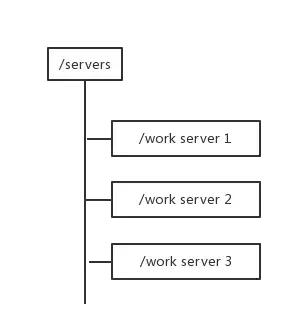

### 生成分布式唯一ID
在过去的单库单表型系统中，通常可以使用数据库字段自带的auto_increment属性来自动为每条记录生成一个唯一的ID。但是分库分表后，就无法在依靠数据库的auto_increment属性来唯一标识一条记录了。此时我们就可以用zookeeper在分布式环境下生成全局唯一ID。做法如下：每次要生成一个新Id时，创建一个持久顺序节点，创建操作返回的节点序号，即为新Id，然后把比自己节点小的删除即可。
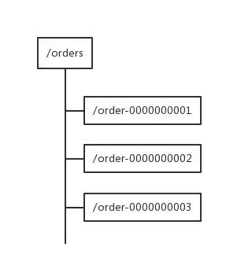

### 命名服务
### 分布式协调/通知
### 集群管理
集群管理：容错、负载均衡
集群的入口
canal

三个系统A、B、C为例，在ZooKeeper中创建临时节点即可
只要系统A挂了，那/groupMember/A这个节点就会删除，通过监听groupMember下的子节点，系统B和C就能够感知到系统A已经挂了。(新增也是同理)

除了能够感知节点的上下线变化，ZooKeeper还可以实现动态选举Master的功能。(如果集群是主从架构模式下)

原理也很简单，如果想要实现动态选举Master的功能，Znode节点的类型是带顺序号的临时节点(EPHEMERAL_SEQUENTIAL)就好了。

Zookeeper会每次选举最小编号的作为Master，如果Master挂了，自然对应的Znode节点就会删除。然后让新的最小编号作为Master，这样就可以实现动态选举的功能了。

### Master 选举
Master选举是一个在分布式系统中非常常见的应用场景。在分布式系统中，Master往往用来协调系统中的其他系统单元，具有对分布式系统状态变更的决定权。例如，在一些读写分离的应用场景用，客户端的写请求往往是由Master来处理的，而在另一些场景中， Master则常常负负责处理一下复杂的逻辑，并将处理结果同步给集群中其他系统单元。Master选举可以说是zookeeper最典型的应用场景了

利用zookeeper的强一致性，能够很好地保证在分布式高并发情况下节点的创建一定能保证全局唯一性，即zookeeper将会保证客户端无法重复创建一个已经存在的数据节点。也就是说，如果同时有多个客户端请求创建同一个节点，那么最终一定只有一个客户端能够创建成功。利用这个特性，就很容易在分布式环境中进行Master选举

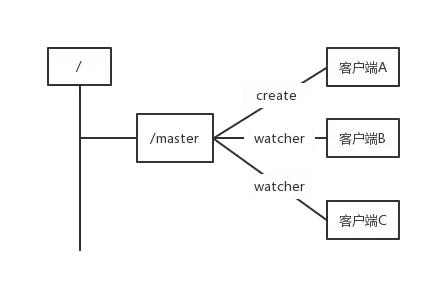
客户端集群往zookeeper上创建一个/master临时节点。在这个过程中，只有一个客户端能够成功创建这个节点，那么这个客户端就成了master。同时其他没有在zookeeper上成功创建节点的客户端，都会在节点/master上注册一个变更的watcher，用于监控当前的master机器是否存活，一旦发现当前的master挂了，那么其余的客户端将会重新进行master选举

### 分布式锁
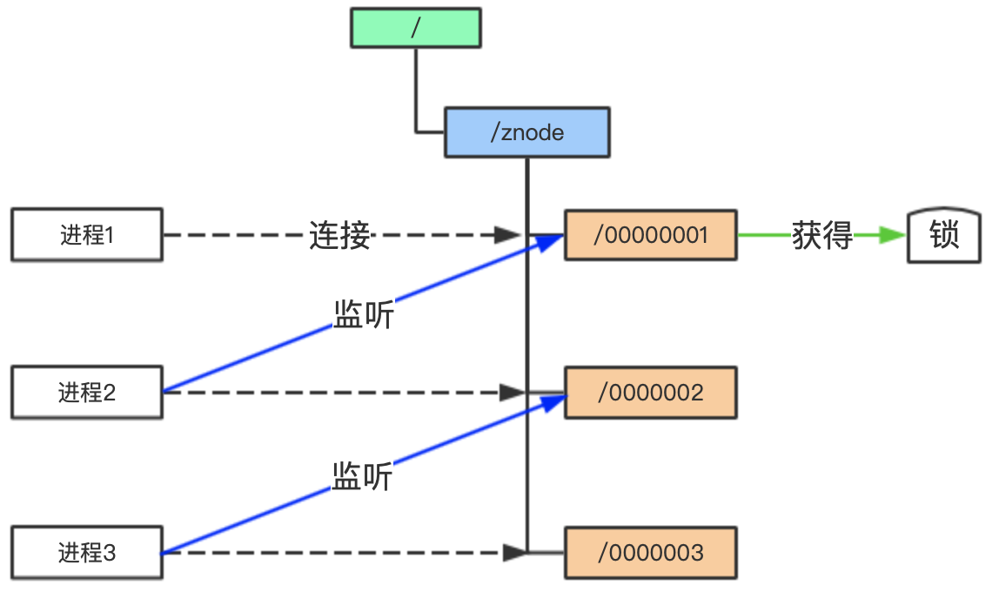
步骤1: 如图，根据zookeeper有序临时节点的特性，每个进程对应连接一个有序临时节点（进程1对应节点/znode/00000001，进程2对应节点/znode/00000002…如此类推）。每个进程监听对应的上一个节点的变化。编号最小的节点对应的进程获得锁，可以操作资源。
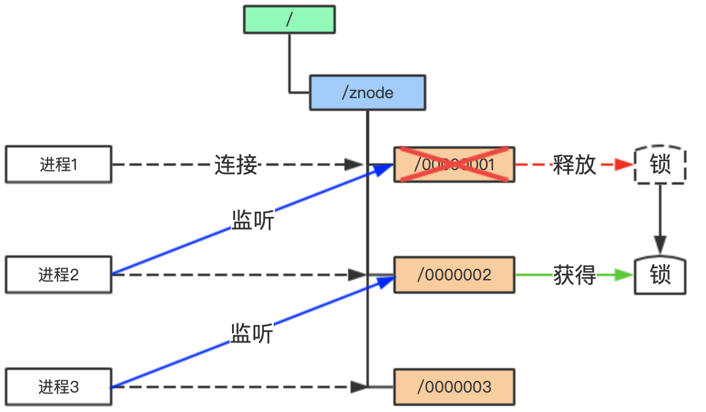
步骤2: 当进程1完成业务后，删除对应的子节点/znode/00000001，释放锁。此时，编号最小的锁便获得锁（即/znode/00000002对应进程）。
重复以上步骤，保证了多个进程获取的是同一个锁，且只有一个进程能获得锁，就是zookeeper分布式锁的实现原理。

---

系统A、B、C都去访问/locks节点

访问的时候会创建带顺序号的临时/短暂(EPHEMERAL_SEQUENTIAL)节点，比如，系统A创建了id_000000节点，系统B创建了id_000002节点，系统C创建了id_000001节点。

接着，拿到/locks节点下的所有子节点(id_000000,id_000001,id_000002)，判断自己创建的是不是最小的那个节点

- 如果是，则拿到锁。
- 释放锁：执行完操作后，把创建的节点给删掉
- 如果不是，则监听比自己要小1的节点变化

举个例子：

- 系统A拿到/locks节点下的所有子节点，经过比较，发现自己(id_000000)，是所有子节点最小的。所以得到锁
- 系统B拿到/locks节点下的所有子节点，经过比较，发现自己(id_000002)，不是所有子节点最小的。所以监听比自己小1的节点id_000001的状态
- 系统C拿到/locks节点下的所有子节点，经过比较，发现自己(id_000001)，不是所有子节点最小的。所以监听比自己小1的节点id_000000的状态
- ……
- 等到系统A执行完操作以后，将自己创建的节点删除(id_000000)。通过监听，系统C发现id_000000节点已经删除了，发现自己已经是最小的节点了，于是顺利拿到锁
- ….系统B如上

---

在同一个JVM中，为了保证对一个资源的有序访问，如往文件中写数据，可以用synchronized或者ReentrantLock来实现对资源的互斥访问，如果2个程序在不同的JVM中，并且都要往同一个文件中写数据，如何保证互斥访问呢？这时就需要用到分布式锁了

目前分布式锁的主流实现方式有两种

- 利用redis setnex(key value) key不存在返回0，key存在返回1
- zookeeper实现排他锁，共享锁（读锁）

这里只简单介绍一下排他锁的实现方式

实现原理和master选举类似，所有客户端在/exclusive_lock节点下创建临时子节点/exclusive_lock/lock，zookeeper会保证在所有的客户端中，最终只有一个客户端能够创建成功，那么就认为该客户端获取了锁，其他没有获取到锁的客户端就需要到/exclusive_lock节点看上注册一个子节点变更的watcher监听，以便实时监听到lock节点的变更情况

释放锁的情况有如下两种

- 当前获取锁的客户端发生宕机，那么zookeeper上的这个临时节点就会被删除
- 正常执行完业务逻辑后，客户端会主动将自己创建的临时节点删除

整个排他锁的获取和释放流程可以用如下图表示

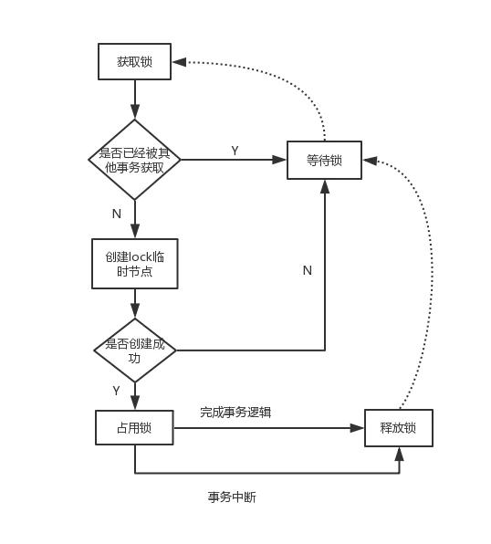

### 分布式队列
分布式队列是一种常见的数据结构。 要在ZooKeeper中实现分布式队列，首先要指定一个znode来保存队列，即队列节点。 分布式客户端通过调用带有以“queue-”结尾的路径名的create（）将某些内容放入队列，并将create（）调用中的序列和临时标志设置为true。 因为设置了序列标志，所以新的路径名将具有_path-to-queue-node_ / queue-X形式，其中X是单调递增的数字。 想要从队列中删除的客户端调用ZooKeeper的getChildren（）函数，并在队列节点上将watch设置为true，并开始处理编号最小的节点。 客户端不需要发出另一个getChildren（），直到它耗尽从第一个getChildren（）调用获得的列表。 如果队列节点中没有子节点，则阅读器会等待观看通知再次检查队列。

注意：
现在在ZooKeeper recipes 目录中存在一个Queue实现。这与发布工件的release-src/recipes/queue目录一起分发。

优先级队列
要实现优先级队列，只需对通用队列配方进行两处简单更改。 首先，要添加到队列，路径名以“queue-YY”结尾，其中YY是元素的优先级，较低的数字表示较高的优先级（就像UNIX一样）。 其次，当从队列中删除时，客户端使用最新的子列表，这意味着如果监视通知触发队列节点，则客户端将使先前获得的子列表无效。

---
如下图，创建/queue作为一个队列，然后每创建一个顺序节点，视为一条消息(节点存储的数据即为消息内容)，生产者每次创建一个新节点，做为消息发送，消费者监听queue的子节点变化（或定时轮询)，每次取最小节点当做消费消息，处理完后，删除该节点。相当于实现了一个FIFO(先进先出)的队列。注：zookeeper强调的是CP（一致性)，而非专为高并发、高性能场景设计的，如果在高并发，qps很高的情况下，分布式队列需酌情考虑。
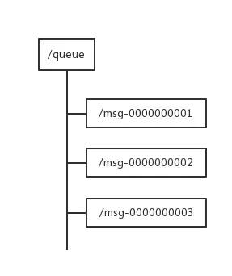

### 注册中心
在比较流行的微服务框架Dubbo、Spring Cloud都可以使用Zookeeper作为服务发现与组册中心。Dubbo 官方推荐使用 ZooKeeper注册中心.

#### 背景
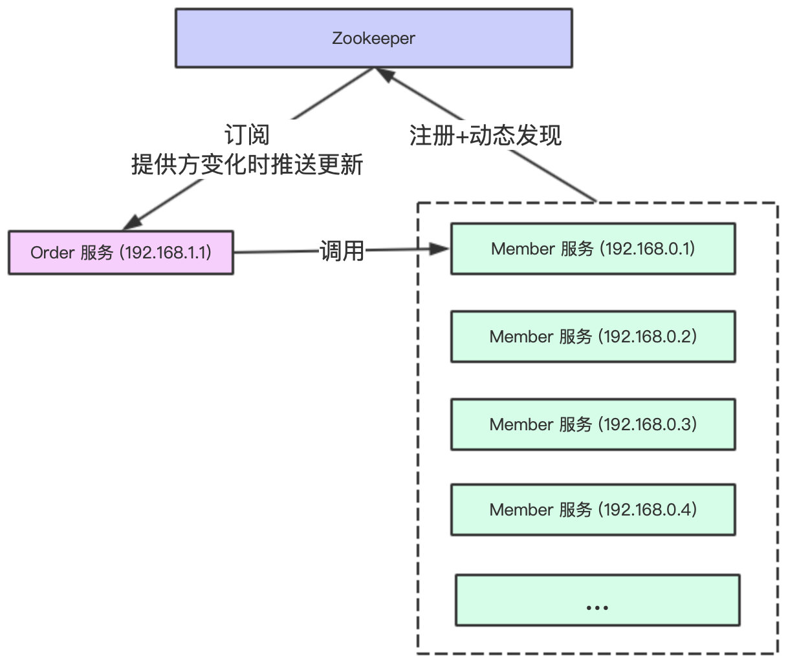
在微服务中，服务提供方把服务注册到zookeeper中心去如图中的Member服务，但是每个应用可能拆分成多个服务对应不同的Ip地址，zookeeper注册中心可以动态感知到服务节点的变化。
服务消费方（Order 服务）需要调用提供方（Member 服务）提供的服务时，从zookeeper中获取提供方的调用地址列表，然后进行调用。这个过程称为服务的订阅。

#### 服务注册原理
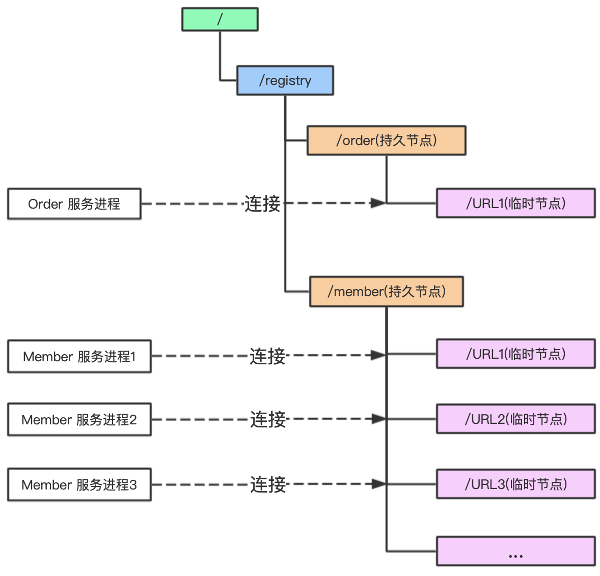
rpc框架会在zookeeper的注册目录下，为每个应用创建一个持久节点，如order应用创建order持久节点，member应用创建member持久节点。
然后在对应的持久节点下，为每个微服务创建一个临时节点，记录每个服务的URL等信息。
#### 服务动态发现原理
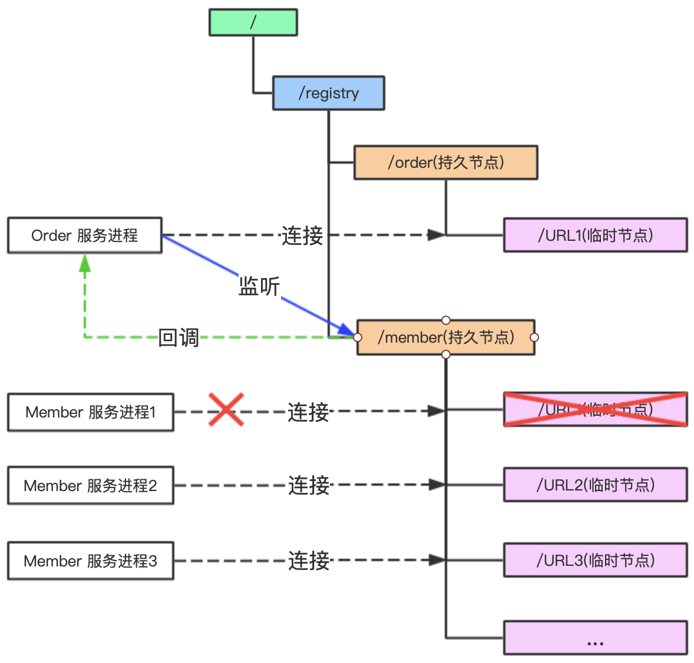
由于服务消费方向zookeeper订阅了（监听）服务提供方，一旦服务提供方有变动的时候（增加服务或者减少服务），zookeeper就会把最新的服务提供方列表（member list）推送给服务消费方，这就是服务动态发现的原理。

### 配置中心
配置文件的集中管理
系统A、B、C监听着这个Znode节点有无变更，如果变更了，及时响应。
https://blog.csdn.net/u011320740/article/details/78742625

## ZooKeeper 重要概念

### 集群
为了保证高可用，最好是以集群形态来部署 ZooKeeper，这样只要集群中大部分机器是可用的（能够容忍一定的机器故障），那么 ZooKeeper 本身仍然是可用的。

Zookeeper中 Leader 选举算法采用了Zab协议。Zab核心思想是当多数 Server 写成功，则任务数据写成功。

ZooKeeper 本身就是一个分布式程序（只要半数以上节点存活，ZooKeeper 就能正常服务）

- 如果有3个Server，则最多允许1个Server 挂掉。
- 如果有4个Server，则同样最多允许1个Server挂掉。

ZooKeeper 将数据保存在内存中，这也就保证了 高吞吐量和低延迟（但是内存限制了能够存储的容量不太大，此限制也是保持znode中存储的数据量较小的进一步原因）。

ZooKeeper 是高性能的。 在“读”多于“写”的应用程序中尤其地高性能，因为“写”会导致所有的服务器间同步状态。（“读”多于“写”是协调服务的典型场景。）

ZooKeeper有临时节点的概念。 当创建临时节点的客户端会话一直保持活动，瞬时节点就一直存在。而当会话终结时，瞬时节点被删除。持久节点是指一旦这个ZNode被创建了，除非主动进行ZNode的移除操作，否则这个ZNode将一直保存在Zookeeper上。

ZooKeeper 底层其实只提供了两个功能：①管理（存储、读取）用户程序提交的数据；②为用户程序提交数据节点监听服务。

### Session
Session 指的是 ZooKeeper 服务器与客户端会话。在 ZooKeeper 中，一个客户端连接是指客户端和服务器之间的一个 TCP 长连接。客户端启动的时候，首先会与服务器建立一个 TCP 连接，从第一次连接建立开始，客户端会话的生命周期也开始了。通过这个连接，客户端能够通过心跳检测与服务器保持有效的会话，也能够向Zookeeper服务器发送请求并接受响应，同时还能够通过该连接接收来自服务器的Watch事件通知。 Session的sessionTimeout值用来设置一个客户端会话的超时时间。当由于服务器压力太大、网络故障或是客户端主动断开连接等各种原因导致客户端连接断开时，只要在sessionTimeout规定的时间内能够重新连接上集群中任意一台服务器，那么之前创建的会话仍然有效。

在为客户端创建会话之前，服务端首先会为每个客户端都分配一个sessionID。由于 sessionID 是 Zookeeper 会话的一个重要标识，许多与会话相关的运行机制都是基于这个 sessionID 的，因此，无论是哪台服务器为客户端分配的 sessionID，都务必保证全局唯一。

### Znode
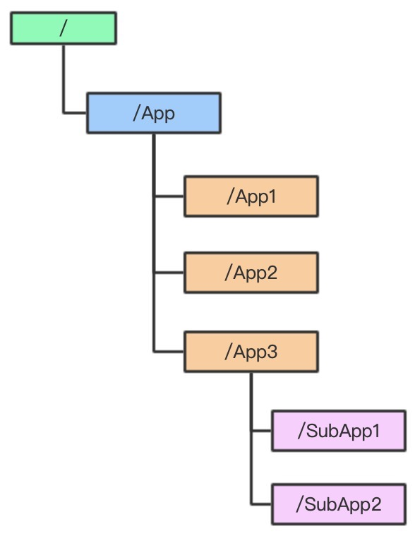
如上图，Zookeeper是一个树状的文件目录结构，有点想应用系统中的文件系统的概念。每个子目录（如App）被称为znode，我们可以对每个znode进行增删改查。
#### 短暂/临时(Ephemeral)：
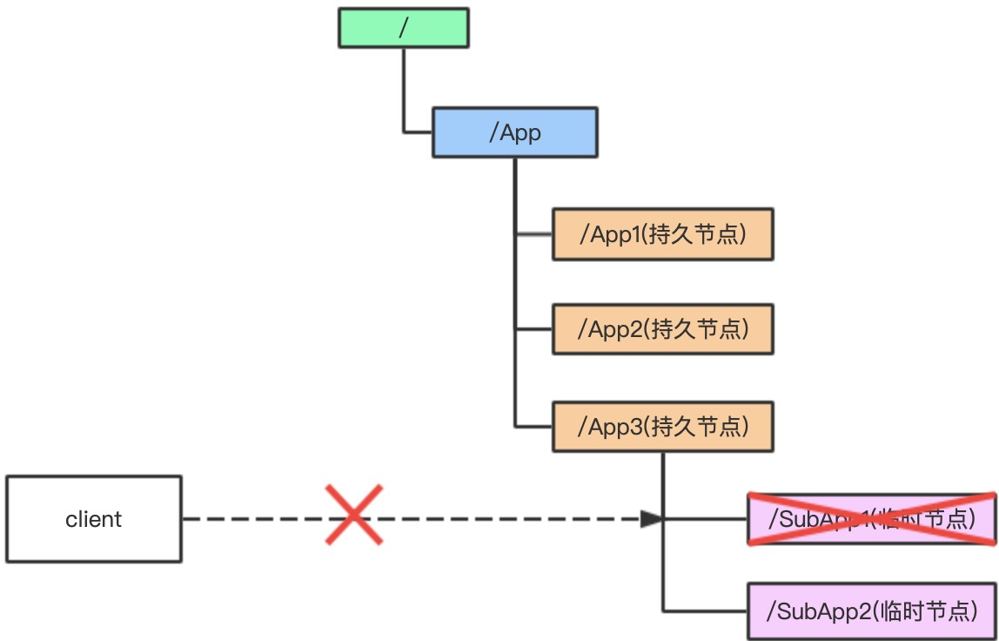
当客户端和服务端断开连接后，所创建的Znode(节点)会自动删除,临时节点下，不存在子节点。
##### 临时有序节点(Ephemeral_sequential)
在临时节点基础上，由zookeeper给该节点名称进行有序编号，如0000001，0000002。
#### 持久节点(Persistent)：
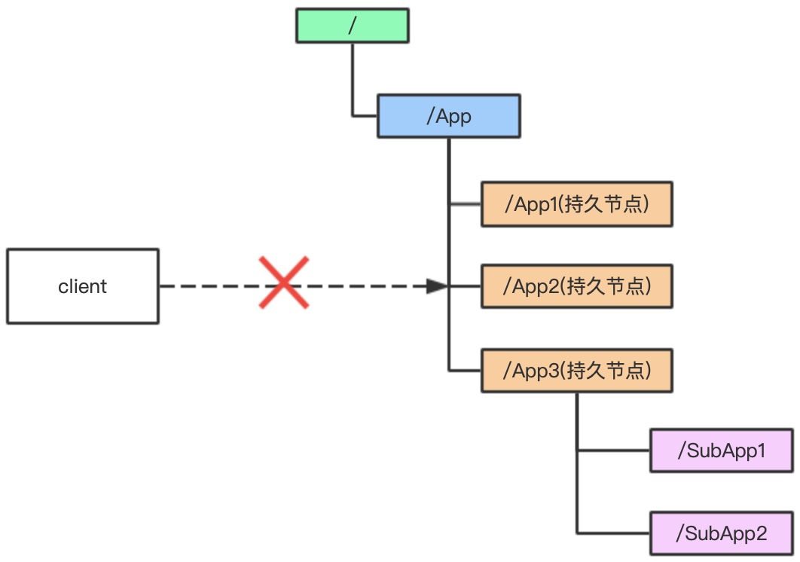
当客户端和服务端断开连接后，所创建的Znode(节点)不会删除

在谈到分布式的时候，我们通常说的“节点"是指组成集群的每一台机器。然而，在Zookeeper中，“节点"分为两类，第一类同样是指构成集群的机器，我们称之为机器节点；第二类则是指数据模型中的数据单元，我们称之为数据节点一一ZNode。

Zookeeper将所有数据存储在内存中，数据模型是一棵树（Znode Tree)，由斜杠（/）的进行分割的路径，就是一个Znode，例如/foo/path1。每个上都会保存自己的数据内容，同时还会保存一系列属性信息。

在Zookeeper中，node可以分为持久节点和临时节点两类。所谓持久节点是指一旦这个ZNode被创建了，除非主动进行ZNode的移除操作，否则这个ZNode将一直保存在Zookeeper上。而临时节点就不一样了，它的生命周期和客户端会话绑定，一旦客户端会话失效，那么这个客户端创建的所有临时节点都会被移除。另外，ZooKeeper还允许用户为每个节点添加一个特殊的属性：SEQUENTIAL.一旦节点被标记上这个属性，那么在这个节点被创建的时候，Zookeeper会自动在其节点名后面追加上一个整型数字，这个整型数字是一个由父节点维护的自增数字。
##### 持久有序节点(Persistent_sequential)
在持久节点基础上，由zookeeper给该节点名称进行有序编号，如0000001，0000002。

### 版本
在前面我们已经提到，Zookeeper 的每个 ZNode 上都会存储数据，对应于每个ZNode，Zookeeper 都会为其维护一个叫作 Stat 的数据结构，Stat中记录了这个 ZNode 的三个数据版本，分别是version（当前ZNode的版本）、cversion（当前ZNode子节点的版本）和 cversion（当前ZNode的ACL版本）。

### 节点监听Watcher
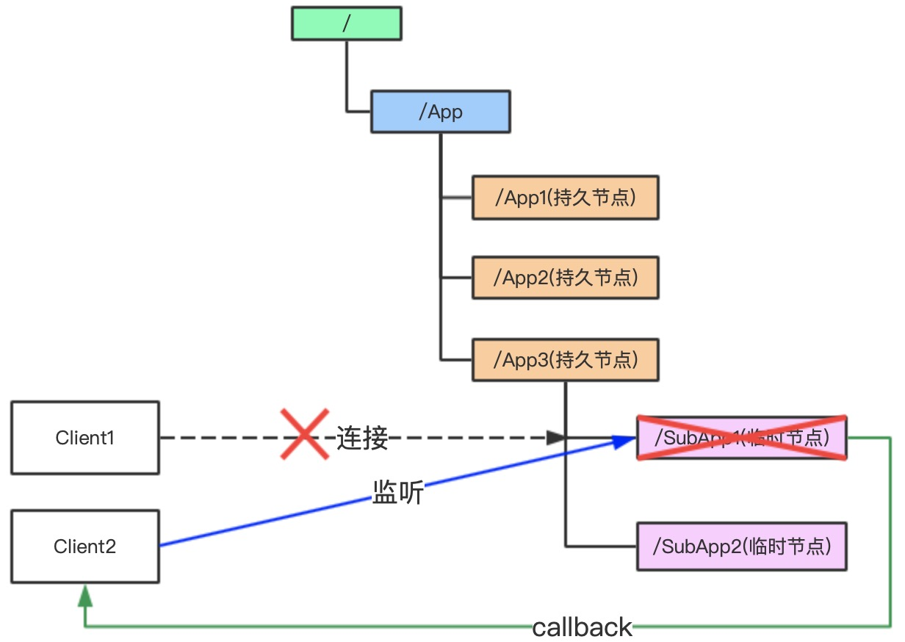
客户端2注册监听它关心的临时节点SubApp1的变化，当临时节点SubApp1发生变化时（如图中被删除的时候），zookeeper会通知客户端2。
该机制是zookeeper实现分布式协调的重要特性。我们可以通过get，exists，getchildren三种方式对某个节点进行监听。但是该事件只会通知一次。

Watcher（事件监听器），是Zookeeper中的一个很重要的特性。Zookeeper允许用户在指定节点上注册一些Watcher，并且在一些特定事件触发的时候，ZooKeeper服务端会将事件通知到感兴趣的客户端上去，该机制是Zookeeper实现分布式协调服务的重要特性。
常见的监听场景有以下两项：
- **监听Znode节点的数据变化**

- **监听子节点的增减变化**

触发watch事件的条件有4种，create，delete，change，child（子节点事件）

watch的重要特性
1. 仅一次性：watch触发后会立即删除，要持续监听变化的话就要持续提供设置watch，这也是watch的注意事项
2. 有序性：客户端先得到watch通知才可查看变化结果

watch的注意事项
1. 刚刚提及到的它的仅一次性
2. 获取事件和发送watch，获取watch，这些请求有可能存在延时，所以不能绝对可靠得到每个节点发生的每个更改
3. 一个watch对象只会被通知一次，如果一个watch同时注册了多个接口（exists,getData）,如果此时删除节点，虽然这个事件对exists和getData都有效，但是watch只会被调用一次

简单举几个watcher的事件类型

EventType | 触发条件
--|--
NodeCreated（节点创建） | Watcher监听的对应数据节点被创建
NodeDeleted（节点删除）  |Watcher监听的对应数据节点被删除
NodeDataChanged（节点数据修改） |Watcher监听的对应数据节点的数据内容发生变更
NodeChildrenChanged（子节点变更） |Watcher监听的对应数据节点的子节点列表发生变更

### ACL
Zookeeper采用ACL（AccessControlLists）策略来进行权限控制，类似于 UNIX 文件系统的权限控制。Zookeeper 定义了如下5种权限。

中尤其需要注意的是，CREATE和DELETE这两种权限都是针对子节点的权限控制。

## ZooKeeper 特点

### 顺序一致性： 
从同一客户端发起的事务请求，最终将会严格地按照顺序被应用到 ZooKeeper 中去。
### 原子性： 
所有事务请求的处理结果在整个集群中所有机器上的应用情况是一致的，也就是说，要么整个集群中所有的机器都成功应用了某一个事务，要么都没有应用。
### 单一系统映像：
无论客户端连到哪一个 ZooKeeper 服务器上，其看到的服务端数据模型都是一致的。
### 可靠性：
一旦一次更改请求被应用，更改的结果就会被持久化，直到被下一次更改覆盖。

## ZooKeeper 设计目标

### 简单的数据模型
ZooKeeper 允许分布式进程通过共享的层次结构命名空间进行相互协调，这与标准文件系统类似。 名称空间由 ZooKeeper 中的数据寄存器组成 - 称为znode，这些类似于文件和目录。 与为存储设计的典型文件系统不同，ZooKeeper数据保存在内存中，这意味着ZooKeeper可以实现高吞吐量和低延迟。

### 可构建集群
为了保证高可用，最好是以集群形态来部署 ZooKeeper，这样只要集群中大部分机器是可用的（能够容忍一定的机器故障），那么zookeeper本身仍然是可用的。 客户端在使用 ZooKeeper 时，需要知道集群机器列表，通过与集群中的某一台机器建立 TCP 连接来使用服务，客户端使用这个TCP链接来发送请求、获取结果、获取监听事件以及发送心跳包。如果这个连接异常断开了，客户端可以连接到另外的机器上。

上图中每一个Server代表一个安装Zookeeper服务的服务器。组成 ZooKeeper 服务的服务器都会在内存中维护当前的服务器状态，并且每台服务器之间都互相保持着通信。集群间通过 Zab 协议（Zookeeper Atomic Broadcast）来保持数据的一致性。

### 顺序访问
对于来自客户端的每个更新请求，ZooKeeper 都会分配一个全局唯一的递增编号，这个编号反应了所有事务操作的先后顺序，应用程序可以使用 ZooKeeper 这个特性来实现更高层次的同步原语。 这个编号也叫做时间戳——zxid（Zookeeper Transaction Id）

### 高性能
ZooKeeper 是高性能的。 在“读”多于“写”的应用程序中尤其地高性能，因为“写”会导致所有的服务器间同步状态。（“读”多于“写”是协调服务的典型场景。）

## ZooKeeper 集群角色介绍

最典型集群模式： Master/Slave 模式（主备模式）。在这种模式中，通常 Master服务器作为主服务器提供写服务，其他的 Slave 服务器从服务器通过异步复制的方式获取 Master 服务器最新的数据提供读服务。

但是，在 ZooKeeper 中没有选择传统的 Master/Slave 概念，而是引入了Leader、Follower 和 Observer 三种角色。如下图所示

ZooKeeper 集群中的所有机器通过一个 Leader 选举过程来选定一台称为 “Leader” 的机器，Leader 既可以为客户端提供写服务又能提供读服务。除了 Leader 外，Follower 和 Observer 都只能提供读服务。Follower 和 Observer 唯一的区别在于 Observer 机器不参与 Leader 的选举过程，也不参与写操作的“过半写成功”策略，因此 Observer 机器可以在不影响写性能的情况下提升集群的读性能。

## ZooKeeper &ZAB 协议&Paxos算法

### ZAB 协议&Paxos算法
Paxos 算法应该可以说是 ZooKeeper 的灵魂了。但是，ZooKeeper 并没有完全采用 Paxos算法 ，而是使用 ZAB 协议作为其保证数据一致性的核心算法。另外，在ZooKeeper的官方文档中也指出，ZAB协议并不像 Paxos 算法那样，是一种通用的分布式一致性算法，它是一种特别为Zookeeper设计的崩溃可恢复的原子消息广播算法。

### ZAB 协议介绍
ZAB（ZooKeeper Atomic Broadcast 原子广播） 协议是为分布式协调服务 ZooKeeper 专门设计的一种支持崩溃恢复的原子广播协议。 在 ZooKeeper 中，主要依赖 ZAB 协议来实现分布式数据一致性，基于该协议，ZooKeeper 实现了一种主备模式的系统架构来保持集群中各个副本之间的数据一致性。

### ZAB 协议两种基本的模式：崩溃恢复和消息广播

ZAB协议包括两种基本的模式，分别是 崩溃恢复和消息广播。当整个服务框架在启动过程中，或是当 Leader 服务器出现网络中断、崩溃退出与重启等异常情况时，ZAB 协议就会进人恢复模式并选举产生新的Leader服务器。当选举产生了新的 Leader 服务器，同时集群中已经有过半的机器与该Leader服务器完成了状态同步之后，ZAB协议就会退出恢复模式。其中，所谓的状态同步是指数据同步，用来保证集群中存在过半的机器能够和Leader服务器的数据状态保持一致。

当集群中已经有过半的Follower服务器完成了和Leader服务器的状态同步，那么整个服务框架就可以进人消息广播模式了。 当一台同样遵守ZAB协议的服务器启动后加人到集群中时，如果此时集群中已经存在一个Leader服务器在负责进行消息广播，那么新加人的服务器就会自觉地进人数据恢复模式：找到Leader所在的服务器，并与其进行数据同步，然后一起参与到消息广播流程中去。正如上文介绍中所说的，ZooKeeper设计成只允许唯一的一个Leader服务器来进行事务请求的处理。Leader服务器在接收到客户端的事务请求后，会生成对应的事务提案并发起一轮广播协议；而如果集群中的其他机器接收到客户端的事务请求，那么这些非Leader服务器会首先将这个事务请求转发给Leader服务器。

## ZooKeeper客户端 zkCli.sh 节点的增删改查

在 bin 目录下的  zkCli.sh  就是ZooKeeper客户端

./zkCli.sh -timeout 5000  -server 127.0.0.1:2181 　　客户端与ZooKeeper建立链接

timeout：超时时间，单位毫秒

r：只读模式，当节点坏掉的时候，还可以提供读服务
### 常见命令
命令基本语法|功能描述
--|--
help                |显示所有操作命令
ls path [watch]     |使用 ls 命令来查看当前znode中所包含的内容
stat                |查看节点状态
ls2 path [watch]    |查看当前节点数据及状态信息，相当于ls+stat
get path [watch]    |获得节点的值
create              |普通创建  -s  创建一个带sequnence（递增序号）的目录  -e  临时（session关闭后消失）
set path data [dataVersion] |设置节点的具体值
delete          |删除节点
rmr             |递归删除节点

### Stat状态说明
Stat | 状态说明
--|--
czxid |节点创建的事务zxid。每次修改ZooKeeper状态都会收到一个zxid形式的时间戳，也就是ZooKeeper事务ID。 事务ID是ZooKeeper中所有修改总的次序。每个修改都有唯一的zxid，如果zxid1小于zxid2，那么zxid1在zxid2之前发生。(数据节点创建时的事务ID)
ctime  | znode被创建的毫秒数(从1970年开始) (数据节点创建时的时间)
mzxid  | znode最后修改的zxid(数据节点最后一次更新时的事务ID)
mtime  | znode最后修改的毫秒数(从1970年开始)(数据节点最后一次更新时的时间)
pZxid  | znode最后更新的子节点zxid(数据节点的子节点列表最后一次被修改（是子节点列表变更，而不是子节点内容变更）时的事务ID)
cversion  | znode子节点变化号，每变化一次就自增1
dataversion  | znode数据变化号，数据每变化一次就自增1（每次更新读取最新的值，可用于实现类似数据库乐观锁功能）
aclVersion  | znode访问控制列表的变化号(数据节点的ACL版本号 )
ephemeralOwner  | 如果是临时节点，这个是znode拥有者的session id。如果不是临时节点则是0
dataLength  | znode的数据长度
numChildren  | znode子节点数量

#### Zxid
致使ZooKeeper节点状态改变的每一个操作都将使节点接收到一个Zxid格式的时间戳，并且这个时间戳全局有序。也就是说，也就是说，每个对节点的改变都将产生一个唯一的Zxid。如果Zxid1的值小于Zxid2的值，那么Zxid1所对应的事件发生在Zxid2所对应的事件之前。实际上，ZooKeeper的每个节点维护者三个Zxid值，为别为：cZxid、mZxid、pZxid。

- cZxid： 是节点的创建时间所对应的Zxid格式时间戳（Create）。

- mZxid：是节点的修改时间所对应的Zxid格式时间戳（Mofify）。

- pZxid：这个节点就和子节点有关啦！是与 该节点的子节点（或该节点）的最近一次 创建 / 删除 的时间戳对应。（注：只与 本节点 / 该节点的子节点，有关；与孙子节点无关）

实现中Zxid是一个64为的数字，它高32位是epoch用来标识leader关系是否改变，每次一个leader被选出来，它都会有一个 新的epoch。低32位是个递增计数。

#### 版本号
- version：节点数据版本号
- cversion：子节点版本号
- aversion：节点所拥有的ACL版本号

## Consul vs Zookeeper vs Etcd vs Eureka

Feature	 | Consul	 |zookeeper|	etcd|	Eureka
--|--|--|--|--
服务健康检查 | 	服务状态，内存，硬盘等 | 	(弱)长连接，keepalive | 	连接心跳 | 	可配支持
多数据中心 | 	支持 | 	—	 | — | 	—
存储服务 | 支持	 | 支持	 | 支持	 | —
一致性 | 	raft | 	paxos	 | raft | 	—
cap | 	ca | 	cp | 	cp | 	ap
使用接口(多语言能力) | 	支持http和dns | 客户端	 | http/grpc | 	http（sidecar）
watch支持 | 	全量/支持long polling | 	支持 | 	支持 long polling	 | 支持 long polling/大部分增量
自身监控 | 	metrics | 	—	 | metrics | 	metrics
安全 | 	acl /https | 	acl	 | https支持（弱） | 	—
spring cloud集成 | 	已支持 | 	已支持 | 	已支持 | 	已支持
Star | 18.1k| 7.5K| 28.7k|8.7k

benchmarked

Zookeeper : “读”多于“写”
ETCD : 10,000 writes/sec

整体etcd性能较好

https://blog.csdn.net/github_32521685/article/details/89953710
https://coreos.com/blog/performance-of-etcd.html

## zetcd: running ZooKeeper apps without ZooKeeper
https://coreos.com/blog/introducing-zetcd
