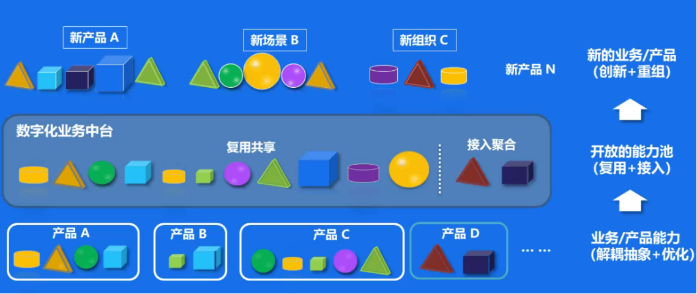
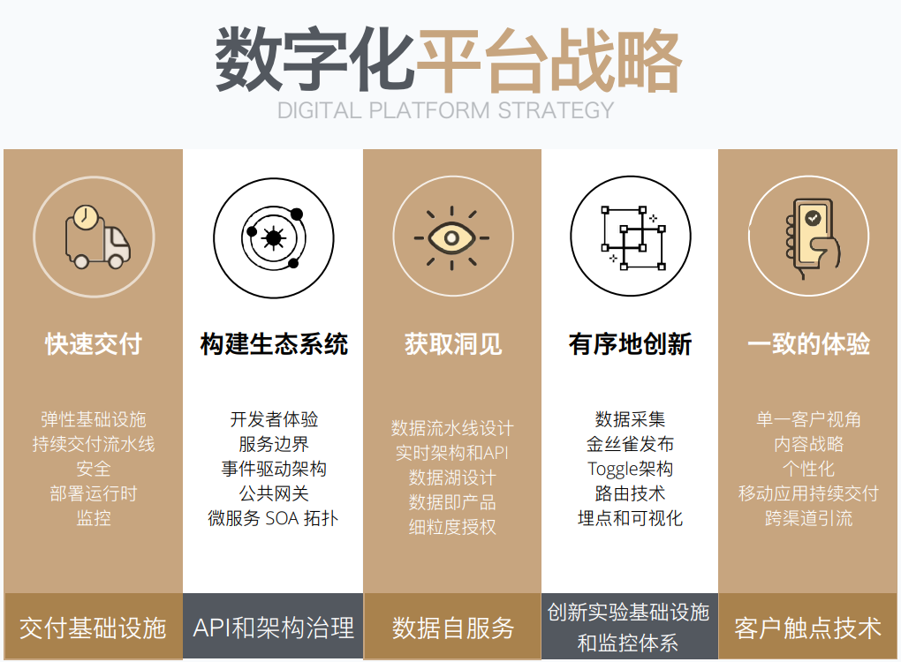

## 什么是中台
说起中台，大家很容易想到阿里在16年提出的“大中台小前台”战略。

中台是一套结合互联网技术和行业特性，能够把企业核心能力形成“大中台，小前台”的组织和业务机制。中台其实是个比较大的概念，按照划分的话，可以是技术平台，像微服务开发框架、Devops平台，集成各类公有云SaaS ；也可以是微服务业务平台，如：业务定制中台。

## 要了解中台，首先要了解前台与后台各指什么：

前台：由各类前台系统组成的前端平台。前台是系统的前端平台，是直接与终端用户进行交互的应用层。每个前台系统就是一个用户触点，即企业的最终用户直接使用或交互的系统，是企业与最终用户的交点。拿电商平台来举例，我们日常使用的app、H5端、pc端以及小程序都属于电商的前台系统。

后台：由后台系统组成的后端平台。后台是指系统的后端平台，终端用户无法感知其存在。后台的价值是存储和计算企业的核心数据（数据+计算），例如财务系统，产品系统，客户管理系统，仓库物流管理系统等，这类系统构成了企业的后台。基础设施和计算平台作为企业的核心计算资源，也属于后台的一部分。

## 中台迷思
到处都在喊中台，到处都是中台，中台这个词在我看来已经被滥用了。

- 在有些人眼里：中台就是技术平台，像微服务开发框架、Devops平台、PaaS平台，容器云之类的，人们都叫它“技术中台”。
- 在有些人眼里：中台就是微服务业务平台，像最常见的什么用户中心，订单中心，各种微服务集散地，人们都叫它“业务中台”。
- 在有些人眼里：中台应该是组织的事情，在释放潜能：平台型组织的进化路线图 (豆瓣)中就提出了平台型组织和组织中台的概念，这类组织中台在企业中主要起到投资评估与投后管理的作用，类似于企业内部资源调度中心和内部创新孵化组织，人们叫它“组织中台”

看完本篇你就会理解，上边的这几类“中台”划分还是靠谱的，更多我看到的情况是大家为了响应企业的“中台战略”，干脆直接将自己系统的“后端”或是“后台”改个名，就叫“中台”。

## 后台并不为前台而生
定义了前台和后台，对于第二个问题（企业为什么要建中台），同样先给出我的答案：

> 因为企业后台往往并不能很好的支撑前台快速创新响应用户的需求，后台更多解决的是企业管理效率问题，而中台要解决的才是前台的创新问题

大多数企业已有的后台，要么前台根本就用不了，要么不好用，要么变更速度跟不上前台的节奏。

我们看到的很多企业的后台系统，在创建之初的目标，并不是主要服务于前台系统创新，而更多的是为了实现后端资源的电子化管理，解决企业管理的效率问题。这类系统要不就是当年花大价钱外购，需要每年支付大量的服务费，并且版本老旧，定制化困难；要不就是花大价钱自建，年久失修，一身的补丁，同样变更困难，也是企业所谓的“遗留系统”的重灾区。

总结下来就两个字“慢”和“贵”，对业务的响应慢，动不动改个小功能就还要花一大笔钱。

有人会说了，你不能拿遗留系统说事儿啊，我们可以新建后台系统啊，整个2.0问题不就解决了。

但就算是新建的后台系统，因为其管理的是企业的关键核心数据，考虑到企业安全、审计、合规、法律等限制。导致其同样往往⽆法被前台系统直接使用，或是受到各类限制⽆法快速变化，以⽀持前台快速的创新需求。

此时的前台和后台就像是两个不同转速的⻮轮，前台由于要快速响应前端用户的需求，讲究的是快速创新迭代，所以要求转速越快越好；⽽后台由于⾯对的是相对稳定的后端资源，⽽且往系统陈旧复杂，甚至还受到法律法规审计等相关合规约束，所以往往是稳定至上，越稳定越好， 转速也自然是越慢越好。

所以，随着企业务的不断发展，这种“前台+后台”的⻮轮速率“匹配失衡”的问题就逐步显现出来。

随着企业业务的发展壮大，因为后台修改的成本和⻛险较⾼，所以驱使我们会尽量选择保持后台系统的稳定性，但还要响应用户持续不断的需求，自然就会将大量的业务逻辑(业务能力)直接塞到了前台系统中，引入重复的同时还会致使前台系统不断膨胀，变得臃肿，形成了一个个⼤泥球的“烟囱式单体应用”。渐渐拖垮了前台系统的“⽤户响应⼒”，用户满意度降低，企业竞争力也随之不断下降。

## 中台才是为前台而生

> 中台是真正为前台而生的平台（可以是技术平台，业务能力甚至是组织机构），它存在的唯一目的就是更好的服务前台规模化创新，进而更好的响应服务引领用户，使企业真正做到自身能力与用户需求的持续对接。

- 以用户为中心的持续规模化创新，是中台建设的核心目标。企业的业务响应能⼒和规模化创新能力，是互联⽹时代企业综合竞争⼒的核⼼体现。平台化包括中台化只是帮助企业达到这个目标的⼿段，并不是⽬标本身。

- 中台(⽆论是技术中台、业务中台还是组织中台)的建设根本上是为了解决企业响应⼒困境， 弥补创新驱动快速变化的前台和稳定可靠驱动变化周期相对较慢的后台之间的⽭盾，提供⼀个中间层来适配前台与后台的配速问题，沉淀能⼒，打通并顺滑链接前台需求与后台资源，帮助企业不断提升用户响应⼒。

- 所以，中台到底是什么根本不重要，如何想方设法持续提高企业对于⽤户的响应⼒才是最重要的。⽽平台化或是中台化，只是恰巧走在了了这条正确的⼤道上。

