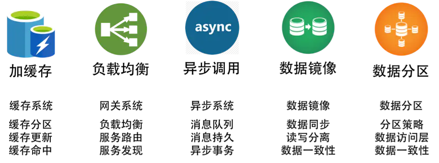
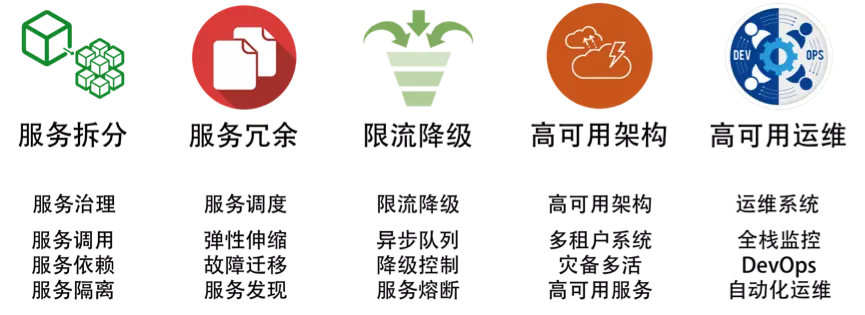
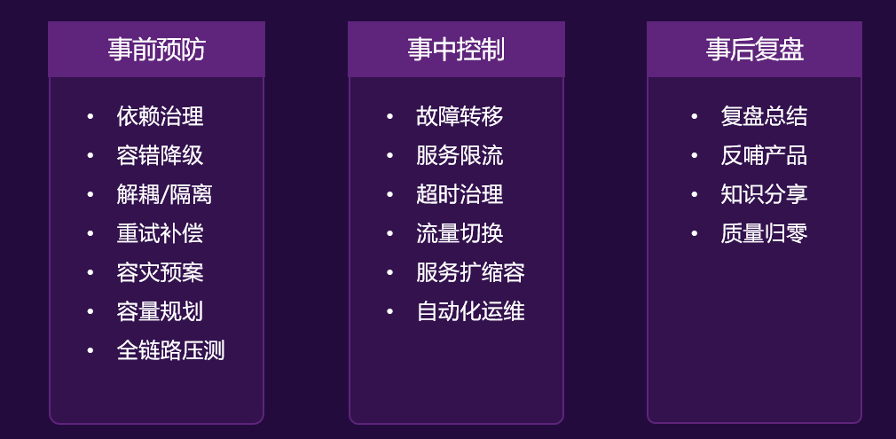
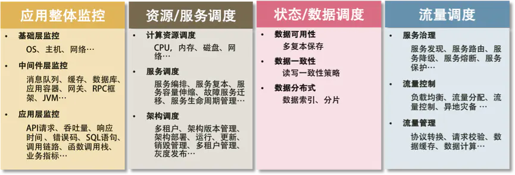
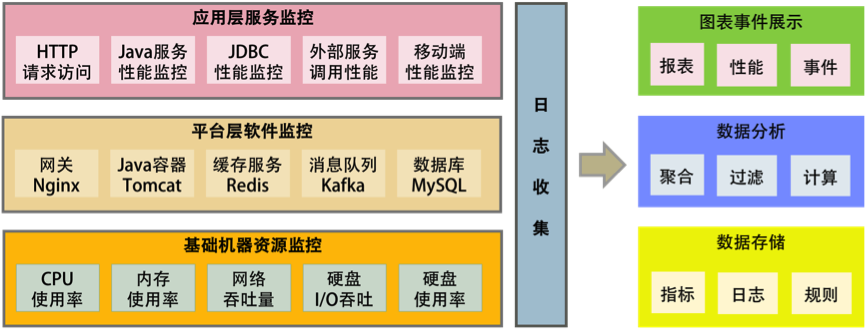
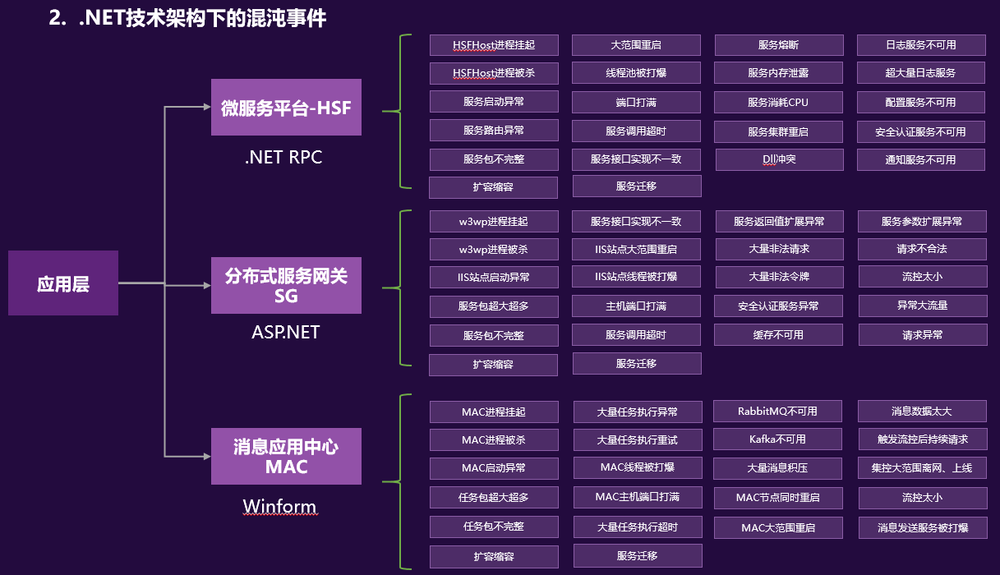
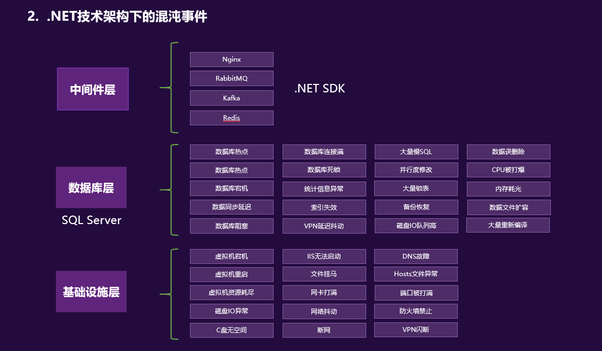

# 分布式技术栈
构建分布式系统的目的是增加系统容量，提高系统的可用性，转换成技术方面，也就是完成下面两件事。

- 大流量处理。通过集群技术把大规模并发请求的负载分散到不同的机器上。
- 关键业务保护。提高后台服务的可用性，把故障隔离起来阻止多米诺骨牌效应（雪崩效应）。如果流量过大，需要对业务降级，以保护关键业务流转。

说白了就是干两件事。一是提高整体架构的吞吐量，服务更多的并发和流量，二是为了提高系统的稳定性，让系统的可用性更高。
## 分布式ID
- [CosId](https://github.com/Ahoo-Wang/CosId) 国产
- SnowflakeId 国产
## 提高架构的性能

- 缓存系统。加入缓存系统，可以有效地提高系统的访问能力。从前端的浏览器，到网络，再到后端的服务，底层的数据库、文件系统、硬盘和 CPU，全都有缓存，这是提高快速访问能力最有效的手段。对于分布式系统下的缓存系统，需要的是一个缓存集群。这其中需要一个 Proxy 来做缓存的分片和路由。

- 负载均衡系统，是做水平扩展的关键技术。其可以用多台机器来共同分担一部分流量请求。

- 异步调用。异步系统主要通过消息队列来对请求做排队处理，这样可以把前端的请求的峰值给“削平”了，而后端通过自己能够处理的速度来处理请求。这样可以增加系统的吞吐量，但是实时性就差很多了。同时，还会引入消息丢失的问题，所以要对消息做持久化，这会造成“有状态”的结点，从而增加了服务调度的难度。

- 数据分区和数据镜像。数据分区是把数据按一定的方式分成多个区（比如通过地理位置），不同的数据区来分担不同区的流量。这需要一个数据路由的中间件，会导致跨库的 Join 和跨库的事务非常复杂。而数据镜像是把一个数据库镜像成多份一样的数据，这样就不需要数据路由的中间件了。你可以在任意结点上进行读写，内部会自行同步数据。然而，数据镜像中最大的问题就是数据的一致性问题。

对于一般公司来说，在初期，会使用读写分离的数据镜像方式，而后期会采用分库分表的方式。

## 提高架构的稳定性

- 服务拆分，主要有两个目的：一是为了隔离故障，二是为了重用服务模块。但服务拆分完之后，会引入服务调用间的依赖问题。

- 服务冗余，是为了去除单点故障，并可以支持服务的弹性伸缩，以及故障迁移。然而，对于一些有状态的服务来说，冗余这些有状态的服务带来了更高的复杂性。其中一个是弹性伸缩时，需要考虑数据的复制或是重新分片，迁移的时候还要迁移数据到其它机器上。

- 限流降级。当系统实在扛不住压力时，只能通过限流或者功能降级的方式来停掉一部分服务，或是拒绝一部分用户，以确保整个架构不会挂掉。这些技术属于保护措施。

- 高可用架构，通常来说是从冗余架构的角度来保障可用性。比如，多租户隔离，灾备多活，或是数据可以在其中复制保持一致性的集群。总之，就是为了不出单点故障。

- 高可用运维，指的是 DevOps 中的 CI（持续集成）/CD（持续部署）。一个良好的运维应该是一条很流畅的软件发布管线，其中做了足够的自动化测试，还可以做相应的灰度发布，以及对线上系统的自动化控制。这样，可以做到“计划内”或是“非计划内”的宕机事件的时长最短。

上述这些技术非常有技术含量，而且需要投入大量的时间和精力。

## 分布式系统的关键技术
而通过上面的分析，我们可以看到，引入分布式系统，会引入一堆技术问题，需要从以下几个方面来解决。

- 服务治理。服务拆分、服务调用、服务发现，服务依赖，服务的关键度定义……服务治理的最大意义是需要把服务间的依赖关系、服务调用链，以及关键的服务给梳理出来，并对这些服务进行性能和可用性方面的管理。

- 架构软件管理。服务之间有依赖，而且有兼容性问题，所以，整体服务所形成的架构需要有架构版本管理、整体架构的生命周期管理，以及对服务的编排、聚合、事务处理等服务调度功能。

- DevOps。分布式系统可以更为快速地更新服务，但是对于服务的测试和部署都会是挑战。所以，还需要 DevOps 的全流程，其中包括环境构建、持续集成、持续部署等。

- 自动化运维。有了 DevOps 后，我们就可以对服务进行自动伸缩、故障迁移、配置管理、状态管理等一系列的自动化运维技术了。

- 资源调度管理。应用层的自动化运维需要基础层的调度支持，也就是云计算 IaaS 层的计算、存储、网络等资源调度、隔离和管理。

- 整体架构监控。如果没有一个好的监控系统，那么自动化运维和资源调度管理只可能成为一个泡影，因为监控系统是你的眼睛。没有眼睛，没有数据，就无法进行高效的运维。所以说，监控是非常重要的部分。这里的监控需要对三层系统（应用层、中间件层、基础层）进行监控。

- 流量控制。最后是我们的流量控制，负载均衡、服务路由、熔断、降级、限流等和流量相关的调度都会在这里，包括灰度发布之类的功能也在这里。

此时，你会发现，要做好这么多的技术，或是要具备这么多的能力，简直就是一个门槛，是一个成本巨高无比的技术栈，看着就都头晕。要实现出来得投入多少人力、物力和时间啊。是的，这就是分布式系统中最大的坑。

不过，我们应该庆幸自己生活在了一个非常不错的年代。今天有一个技术叫——Docker，通过 Docker 以及其衍生出来的 Kubernetes 之类的软件或解决方案，大大地降低了做上面很多事情的门槛。Docker 把软件和其运行的环境打成一个包，然后比较轻量级地启动和运行。在运行过程中，因为软件变成了服务可能会改变现有的环境。但是没关系，当你重新启动一个 Docker 的时候，环境又会变成初始化状态。

这样一来，我们就可以利用 Docker 的这个特性来把软件在不同的机器上进行部署、调度和管理。如果没有 Docker 或是 Kubernetes，那么你可以认为我们还活在“原始时代”。现在你知道为什么 Docker 这样的容器化虚拟化技术是未来了吧。因为分布式系统已经是完全不可逆转的技术趋势了。

但是，上面还有很多的技术是 Docker 及其周边技术没有解决的，所以，依然还有很多事情要做。那么，如果是一个一个地去做这些技术的话，就像是我们在撑开一张网里面一个一个的网眼，本质上这是使蛮力的做法。我们希望可以找到系统的“纲”，一把就能张开整张网。那么，这个纲在哪里呢？

## 分布式系统的“纲”
总结一下上面讲述的内容，你不难发现，分布式系统有五个关键技术，它们是：

- 全栈系统监控；
- 服务 / 资源调度；
- 流量调度；
- 状态 / 数据调度；
- 开发和运维的自动化。

而最后一项——开发和运维的自动化，是需要把前四项都做到了，才有可能实现的。所以，最为关键是下面这四项技术，即应用整体监控、资源和服务调度、状态和数据调度及流量调度，它们是构建分布式系统最最核心的东西。

### 全栈监控
监控系统需要完成的功能为：
- 全栈监控；
- 关联分析；
- 跨系统调用的串联；
- 实时报警和自动处置；
- 系统性能分析。

### 多层体系的监控
所谓全栈监控，其实就是三层监控。
- 基础层：监控主机和底层资源。比如：CPU、内存、网络吞吐、硬盘 I/O、硬盘使用等。
- 中间层：就是中间件层的监控。比如：Nginx、Redis、ActiveMQ、Kafka、MySQL、Tomcat 等。
- 应用层：监控应用层的使用。比如：HTTP 访问的吞吐量、响应时间、返回码、调用链路分析、性能瓶颈，还包括用户端的监控。

这还需要一些监控的标准化。
- 日志数据结构化；
- 监控数据格式标准化；
- 统一的监控平台；
- 统一的日志分析。

### 服务调度
服务治理上的一些关键技术，主要有以下几点。
- 服务关键程度
- 服务依赖关系
- 服务发现
- 整个架构的版本管理
- 服务应用生命周期全管理

### 流量与数据调度
#### 流量调度的主要功能

对于一个流量调度系统来说，其应该具有的主要功能是：
1. 依据系统运行的情况，自动地进行流量调度，在无需人工干预的情况下，提升整个系统的稳定性；
2. 让系统应对爆品等突发事件时，在弹性计算扩缩容的较长时间窗口内或底层资源消耗殆尽的情况下，保护系统平稳运行。

这还是为了提高系统架构的稳定性和高可用性。

此外，这个流量调度系统还可以完成以下几方面的事情。

- 服务流控。服务发现、服务路由、服务降级、服务熔断、服务保护等。
- 流量控制。负载均衡、流量分配、流量控制、异地灾备（多活）等。
- 流量管理。协议转换、请求校验、数据缓存、数据计算等。

所有的这些都应该是一个 API Gateway 应该做的事。
#### 流量调度的关键技术
但是，作为一个 API Gateway 来说，因为要调度流量，首先需要扛住流量，而且还需要有一些比较轻量的业务逻辑，所以一个好的 API Gateway 需要具备以下的关键技术。

1. 高性能。使用高性能的语言。

2. 扛流量。需要使用集群技术，在集群内的各个结点中共享数据。像 Paxos、Raft、Gossip 这样的通讯协议 Gateway 需要部署在广域网上，集群的分组技术。

3. 业务逻辑。简单的业务逻辑，像 AWS 的 Lambda 服务一样，可注入不同语言的简单业务逻辑。

4. 服务化。通过 Admin API 来不停机地管理配置变更的，而不是通过一个.conf 文件来人肉地修改配置。

