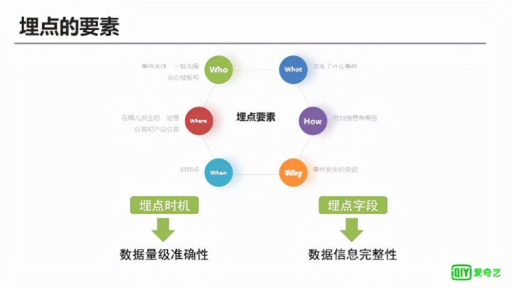
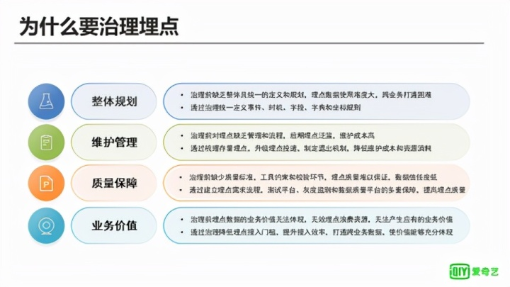
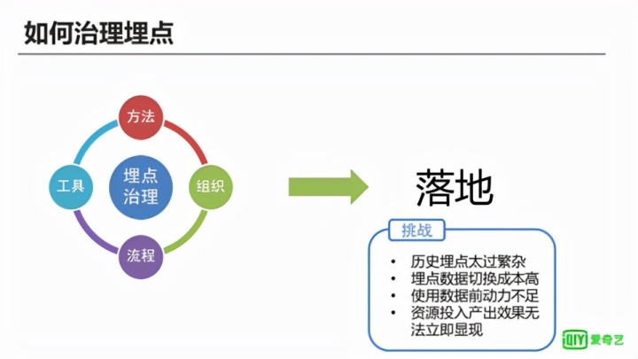
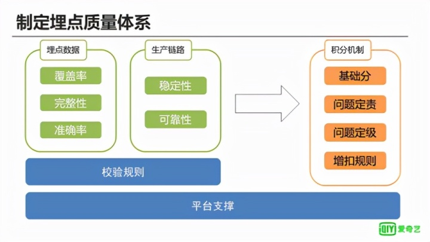
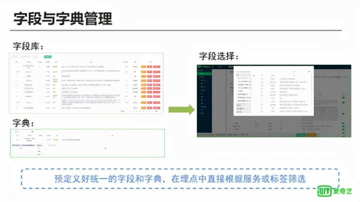
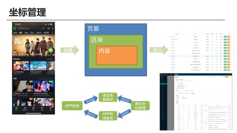
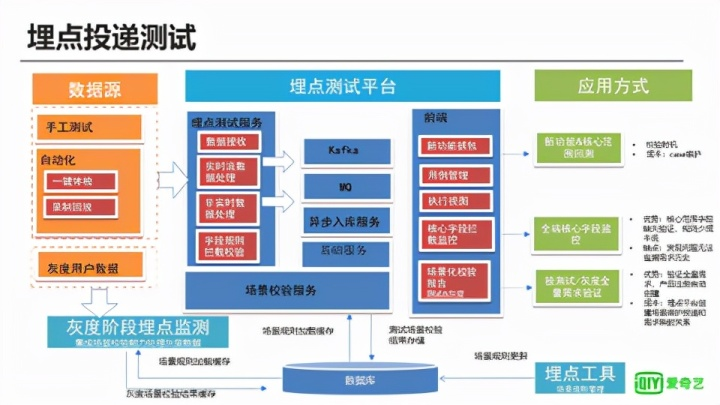
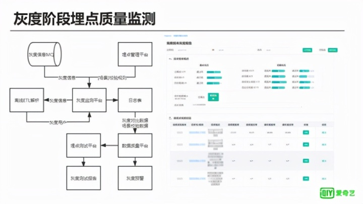
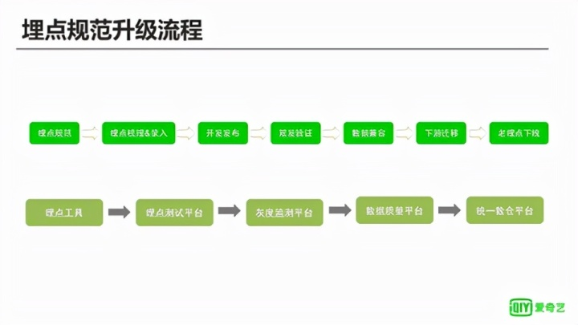
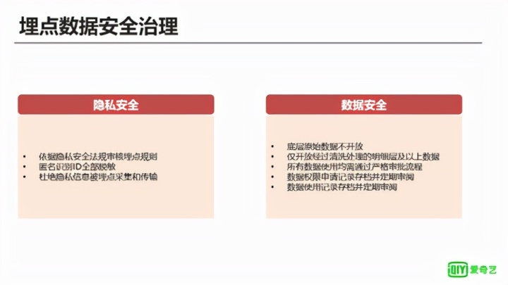

9月26日下午，爱奇艺技术产品团队举办了 **第19期“i技术会”**，本次技术会的主题是 **“数据治理探索与应用”**，来自快手、美团、快看的几位资深专家同大家就相关议题进行了深入探讨。

爱奇艺研究员杜益凡分享了题为 **《爱奇艺埋点投递治理实践》** 的内容。分享从埋点的定义、规范以及数据质量要求开始，介绍了爱奇艺在治理埋点数据、提高埋点数据质量工作中的一些实践经验。

以下为“ **《爱奇艺埋点投递治理实践》**”干货分享，根据 **【i技术会】** 演讲整理成文。

## 一、什么是埋点

埋点在爱奇艺内部习惯被称为 **Pingback**，其本质是对事件的描述，在得到用户允许的情况下，在一些特定过程中收集行为数据，来研究对象的使用状况，为后续的优化和运营策略提供数据支撑。

在爱奇艺最常见的埋点场景是在播放环节，例如在视频 **“开始播放”以及“快进”“快退”** 这三种行为上做埋点，来获取一个视频具体的播放情况，进而了解用户更喜欢看哪个片断。很明显，如果某个片断用户不喜欢看，相应的快进会比较多，如果某个片断被拖回来次数比较多，说明用户喜欢看这个片断，这样可以评估内容具体的质量，给后续的内容策略做一些数据支撑。

再比如在播放卡顿的时候增加埋点，来探测具体视频播放的卡顿情况，就可以了解用户在实际播放这个视频的时候性能观感如何，这样可以给网络优化以及播放器性能优化提供很好的数据支持。

**埋点主要的组成要素是什么？**

首先对于埋点来说很重要的一个因素是时机，因为时机选择的好与坏和它定义的是否清晰直接影响了它所要研究事件的数据准确性。比如刚才说的开始播放，如果要探查一个视频真正起播的数据情况，一旦把时机错误的选择在用户进入播放器就开始发送真正起播，那么这样的埋点就会导致在计算视频播放量的时候把广告误计进来。正确的操作是在视频真正开始播放第一帧的时候发出来，这样才是视频的起播量，而不受广告播放的影响。

**为什么要治理埋点？**

**主要有四个方面：** 整体规划、维护管理、质量保障、业务价值。

随着的业务的发展，先期可能没有意识到对于埋点需要统一的定义规划，导致在业务发展大了之后埋点的数据使用难度大。比如跨业务的情况，同样是展示事件，A业务定义的是一种规范，B业务定义是另外一种规范， **但需要对整个公司分析的时候就无法使用统一的规则去进行分析，这样跨业务打通很困难。**

另外缺乏整体规划，后期的埋点会泛滥，无用埋点会很多，造成资源浪费，维护成本也高。同时如果缺少质量标准，埋点的故障非常多，错误数据非常多，数据信任度比较低。 **这样数据的业务价值无法很好地体现，没有正常产生应有的业务价值，浪费计算存储和开发资源。**

要解决这些问题，需要把埋点治理好。要建立统一的埋点规范，并把现有的存量埋点进行梳理，把定义比较糟糕的埋点升级成新规范的埋点，并且把旧埋点下线，节省资源消耗和降低维护成本。同时建立流程和质量规范，提高埋点数据质量，同时也降低埋点数据的接入门槛，提高整体效率。

## 二、如何治理埋点

治理最大的挑战是 **落地**，因为历史惯性总是很强的，历史存量埋点非常繁杂，梳理的成本就会很高，切换的成本也会很高，落地就是个巨大的考验。

在业务真正使用数据之前，对于切换埋点这件事情投入资源的动力是不足的，因为它的产出价值无法立刻体现，所以要把埋点治理这件事更好的落地，需要强有力的组织，去确保这个事情能够被很好的推进。

此外还需要一个很好的方法论，让治理达到很好的效果。同时依靠组织和方法论来制定一个新的、合理的流程。使整个规划可以顺利的进行落地。为了支持这样一个流程和整个规范管理，需要建立一套支撑的工具平台，助力治理的落地。

从组织与专项来看，为了让数据从公司策略角度发挥更大的价值，需要成立数据委员会，数据委员会是从整个公司策略的角度考虑来制定数据工作的方向和目标。这些规划和流程具体的实施是由业务数据BP组去执行，业务数据BP组主要由各个业务具体的产品以及项目组成，对具体规划的执行落地负责。工作组会定期的跟踪具体的执行情况，然后再向数据委员会汇报执行的具体成果，数据委员会会考核此项治理的具体运转情况。由这样的一个组织就具体运作埋点治理的专项，让具体埋点治理能够具体落地。

为此制定整个埋点投递体系，首先制定好埋点规范，这是最基础的一个方法论，由埋点规范去指导埋点平台该如何去建立，再根据埋点规范开发出埋点SDK，来助力具体的业务开发。埋点平台是对埋点SDK有一个控制策略的，可以控制埋点SDK具体能发出哪些投递。埋点SDK主要发出的投递进入收集服务，测试数据进入测试平台，其它的直接进入ETL处理，测试平台是在测试阶段使用的，以保证埋点质量，灰度监测是灰度阶段使用，从线上数据中抽取灰度用户的投递数据，对它的投递情况进行质量监测。数据质量平台就是之前彭涛老师在《爱奇艺数据质量监控的探索和实践》所讲的数据质量的产品化的结果，它会接收灰度策略、测试平台的结果，同时给灰度监测提供规则引擎的服务。

数据质量平台除了对灰度、测试阶段起作用，还在上线之后的线上监控起作用，会检测整个埋点在线上的数据质量情况。最终数据质量没有问题的情况下会进入统一数据仓库，来给上层提供服务，如果有问题会对数据生产流程进行拦截。

我们对存量埋点进行梳理，从中归纳了7大类核心的事件，把核心事件的定义进行了统一，同时对它的发送时机也进行统一，避免各个业务有不一样的发送时机，这样让整个数据统一，同时对核心事件的通用字段也做了统一，每个事件应该有哪些必发的字段、选发的字段，或者建议发的字段，都在埋点工具里面。

对字段进行全局的统一，因为在进行治理之前，同一个含义的内容可能出现两种不同的字段定义。使用的时候不知道该用哪个字段，所以把整个存量的几千个字段进行整体的梳理、合并并且剔除那些有歧义和重复字段之后得到几百个字段，对字段进行统一命名，并把含义进行明确。

对于字典字段，进行统一的梳理，把重复和冲突的字典项剔除或者合并，对于一些核心的字典也进行统一的编码。

另外对坐标进行统一，建立统一的坐标体系，使所有新坐标以及新坐标的编制有了很好的依据。

制定埋点质量体系，对于埋点数据更关注覆盖率，需要衡量的事件都需要对其进行埋点，对于埋点信息要有完整性，不能漏收集信息，字段信息必须要完整而且准确。 **不能有漏发、多发，包括字段、埋点事件都不能有多发漏发，这样才能保证完整性和准确率。**

除了埋点发送，数据生产链路也是要有很好的监控机制，或者说质量衡量机制，要保证一个生产链路的稳定性和可靠性，它必须在合理的时间到达数仓能够供下游使用。同时也要保证整个处理数据是比较可靠的情况，数据是没有问题的。所以基于这两块，制定统一的校验规则，在底层又有平台支撑，这个平台就是数据质量平台。在此基础上建立积分机制，对所发生的埋点问题建立定责定级机制，对具体的问题责任方进行积分的增加或者扣减的操作，这样在每季度可以对具体业务的埋点治理执行情况进行衡量。

我们对整个埋点的需求的新增也制定了一个流程，首先在产品的新需求规划阶段，会考虑这个需求是否会涉及到埋点，如果涉及到埋点就需要先通过埋点系统进行比较好的埋点设计，并把它落地在PRD里面。在需求系统提交需求的时候，如果设计了埋点，数据产品会对这个埋点进行复查，确定埋点是否合理，是否需要补充信息或者有多余的信息或者涉及错漏的地方，确认无误之后这项需求进入需求池，由开发团队决定是否开发。

在开发阶段具体开发会使用埋点SDK进行具体埋点需求的开发。到测试阶段测试根据埋点规范中产出的测试用例以及使用埋点测试工具进行测试，最终产生的测试报告要同步给数据中台的埋点治理团队，进行审核，如果没有问题才能继续下一步的上线阶段。上线阶段首先经过灰度，灰度过程中会通过灰度监测评估这个版本的埋点质量，并出具灰度测试报告，没有问题上线，上线之后通过数据质量平台进行正常的数据监测。

针对这些制定的规范和方法、流程，建立了埋点设计的工具。在这个工具中提供对事件的管理，把事件划分成启动、播放、展点、互动、阅读和投屏这些事件，具体的核心事件中分了一些细的子事件：播放分开始播放、结束播放等展点分展示和点击；阅读有开始、结束阅读，阅读计时，对核心事件在工具中统一维护了时机的定义以及具体的事件描述以及这些事件默认的字段，就是具体的产品在勾选这些事件后会首先生成基础的埋点规范，包含其中默认要投的字段，这些字段会在埋点SDK中包含自动的一个采集和发送。

**QOS和自定义事件**：这两种事件自定义程度高，QOS事件偏重于开发对于性能的监测，可能在前端也可能在后端，自定义事件更多的是临时的产品的探测类事件。这些都是可以进行更加灵活的自定义处理。

**字段和字典的管理：** 在全局字段库中对字段名、中文含义以及具体的说明进行统一的维护，另外给字段打上标签，是环境信息字段还是内容信息的字段，同时也给字段建立服务包。可能是一个字段属于推荐服务所关注的服务包中，也可能是搜索类的可能放在搜索的服务包中，这样的用户在制定埋点规范的时候可以通过服务包或者通过标签去更加方便的字段库中检索他所需要的字段。

字段库同时维护了字典类型字段的字典，把字典统一维护，这样用户在埋点中选择了这个字段后，字典直接可以被引用。

## 三、坐标管理

坐标的管理把页面展示情况分为三个层次，最外层是页面，页面中可以包含多个区块，比如左边这个页面焦点图就是一个区块，中间“猜你喜欢”也是个区块，下面热播也是区块，区块里面又包含不同内容，比如下面的热播这部分在我截图里面有四个内容，按照这个层次去组织的坐标信息。在埋点工具中进行维护，然后所有产品的定义都需要先把坐标录入到埋点工具中去，录入之后就可以在坐标上绑定具体的事件了。可以绑定展示点击事件、具体互动事件，这样可以更好的指导进行开发，这些事件绑定进来有默认字段，针对不同坐标，针对坐标设置个性化的字段。

坐标管理除了维护这些信息之外，同时也会去和APP后端服务进行交互，APP后端服务读取具体坐标定义，才能给前端下发具体的展示内容，同时埋点收集、解析也会根据坐标管理中的信息来进行坐标过滤，如果没有进行注册的坐标是无法正确入库。这样对埋点质量进行衡量。

有了坐标+事件埋点定义可以解决很多问题，但对于某些细节的投递有规范定义过宽的情况，比如热播可能前两个内容是编辑手动编辑的内容，后面有可能是个性化推荐内容，这样前两个坐标和后两个坐标所要投递的字段是不一样的，在这类直接的事件绑定中，虽然可以绑定两个不同的事件，但对于开发来说是比较疑惑的，所以引入了场景管理。

一个场景可能是一系列事件的组合，一个场景可能依次发生包括展示、点击、播放，这样细粒度的定义可以让一个具体事件某些字段有确定值，以及这个事件的某个字段是否需要在这个场景下需要发送，就有很精细的定义。这样可以更好的指导开发进行具体的业务开发。同时也可以更容易的生成一个测试校验规则和测试用例。

所以场景管理可以向埋点质量监测发送校验规则，同时给测试平台传输具体的测试用例以及校验规则。这样埋点质量监控就可以根据校验规则去生成具体质量校验的结果，测试平台也进而可以根据生成的场景测试用例生成具体的测试报告。

埋点投递的开发是为了让开发更多地去专注于所有开发的共有业务，而不用考虑这个埋点是如何构造和发送的，所以可以给各个不同端提供SDK，SDK首先把发送和构造全部包装起来，这样避免发送格式问题。

对于个性投递需求可以在此基础上进行扩展，把需要增加的字段和自定义字段取值给扩展，以扩展的形式注入进来。同时SDK会有云控的策略模块，在有时发生埋点问题的时候可以紧急下线一些埋点。同时可以对具体某个字段是不是发送，需不需要连接进行控制。

埋点投递测试平台主要面向的用户是具体的QA人员，这个平台从刚才的埋点平台中去取具体事件的校验规则和字段的校验规则，以及由场景管理所生成的场景测试用例来在测试阶段进行功能的测试。数据源也有几个方面，一方面根据测试用例所生成的自动化的测试执行的脚本，这样可以实现APP自动测试，同时也提供手动抓包的测试工具，在零散需要知道埋点投递情况的时候提供有力的工具支持，在能看到抓包结果的同时就能看到这些具体埋点事件的质量检测的结果。

## 四、灰度数据

灰度数据经过灰度监测平台的计算也可以进入测试平台，形成统一的测试报告。

数据质量平台在埋点上主要关注事件的投递量，来确认投递量是否有问题，另外是重点字段的空值率、核心字段取值的分布，来评估是否新上的版本可能在某个部分存在bug之类；还有字段校验规则的通过率，来评估没有字典值的字段发送的质量情况；另外就是场景校验的通过率，还有重要条件的数据量，其实就是一部分简单的核心指标的监测。

相关产出首先是报警，还有就是对于生产任务是否要进行拦截，或者对于灰度是否要进行拦截。

## 五、埋点升级流程

定义好了新的埋点规范，对于大存量的旧规范需要有一个升级的流程，所以说也制定了整个升级流程、埋点规范的升级流程，这个不管是对于现在存量的埋点治理还是对于未来有可能会发生的同一个事件的埋点规范的升级，都是有作用的。

首先就是要制定新的合理的埋点规范，把它录入到埋点工具当中，然后在此过程中旧埋点先不下线，先让开发把新的埋点加入进来，进行双发，对双发的数据进行数据验证。首先是正常情况下数据对得上，或者比以前的数据更好，在数据更好的情况下，也要分析出来旧的埋点数据为什么不对，有什么问题，达到心中有数，才能确定双发是否是通过的状态。如果双发通过后在统一数仓中对数据进行兼容，从某个版本之后开始有新的埋点数据，某个版本之前还是使用老的数据，会通知下游，如果是没有使用统一数仓数据的下游，需要把他的消费迁移到统一数仓当中，迁移之后对老的埋点进行下线。

下线建立了埋点退出机制，对于埋点的事件和字段，通过数据图谱来对其血缘进行分析，根据使用情况、质量情况，还有资源消耗情况以及最终是否产生应有的价值来对它的热度进行评估。可以定期审查这样的埋点事件的热度或者字段的热度，来决定一个埋点是否要下线或者说埋点中某个字段是否没用了，应该要下线。如果决定要下线的埋点，可以先通过云控使它不再继续发送，确定没有问题之后可以在后续版本中把它的代码、发送代码直接给删除。这样先通过云控下线，万一有问题可以方便的让它继续发送。

​重中之重是数据安全的治理，《数据安全法》近期实施，隐私安全越来越受重视，对于新的埋点规则的审核以及存量埋点的定期的审查都是关注的重点，需要查看其中是否有不应该发的隐私信息，如果有要坚决去掉，坚决杜绝在埋点中有隐私的采集和传输。

数据安全，首先底层的数据是不对外开放的，所有对下游开放的是清洗处理之后的明细层，同时所有数据使用要经过严格审批，而且审批的记录都是要存档并且定期审阅，数据使用记录存档并定期审阅。

爱奇艺2019年开始治理埋点，经过这两年的治理，埋点量整体减少了40%，资源消耗直接节省一半。同时通过新的埋点规范，业务的接入从过去一周的时间，降低到现在最多两天时间就可以完成，同时故障量大幅的下降，整体达到了提效和降低成本的目的。