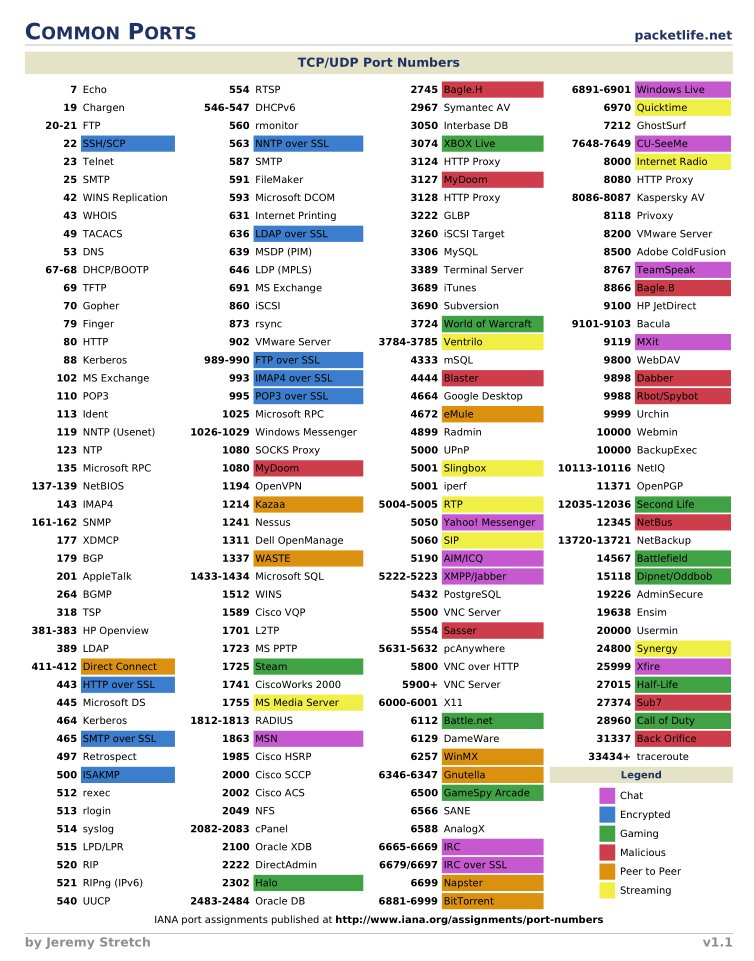

## github
https://github.com/LeCoupa/awesome-cheatsheets

https://github.com/wx-chevalier/Awesome-CheatSheets

https://github.com/rstacruz/cheatsheets

https://devhints.io/

https://github.com/search?q=awesome+Cheat+Sheet&type=Repositories

https://github.com/OUCMachineLearning/OUCML/tree/master/%E4%BB%A3%E7%A0%81%E9%80%9F%E6%9F%A5%E8%A1%A8

## opensource
https://opensource.com/downloads/cheat-sheets

## Common Ports Cheat Sheet

[Common Ports Cheat Sheet](https://www.stationx.net/common-ports-cheat-sheet/)

## Developer Roadmaps
https://roadmap.sh/roadmaps
### JWT
