 点击上方“程序员大白”，选择“星标”公众号


 重磅干货，第一时间送达


 

 来源：最码农

 

 Linux 内存是后台开发人员，需要深入了解的计算机资源。合理的使用内存，有助于提升机器的性能和稳定性。本文主要介绍Linux 内存组织结构和页面布局，内存碎片产生原因和优化算法，Linux 内核几种内存管理的方法，内存使用场景以及内存使用的那些坑。

 

 从内存的原理和结构，到内存的算法优化，再到使用场景，去探寻内存管理的机制和奥秘。

## 一、走进Linux 内存

 1、内存是什么？

 1)内存又称主存，是 CPU 能直接寻址的存储空间，由半导体器件制成

 2)内存的特点是存取速率快


 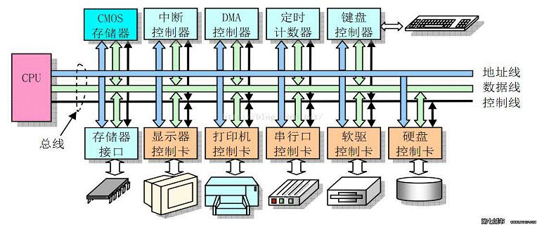


 2、内存的作用


- 1)暂时存放 cpu 的运算数据

- 2)硬盘等外部存储器交换的数据

- 3)保障 cpu 计算的稳定性和高性能


 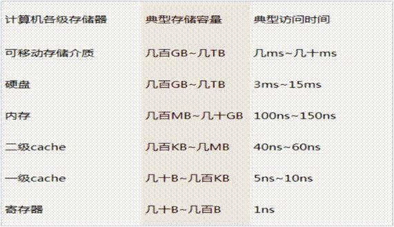

## 二、 Linux 内存地址空间

 1、Linux 内存地址空间 Linux 内存管理全貌


 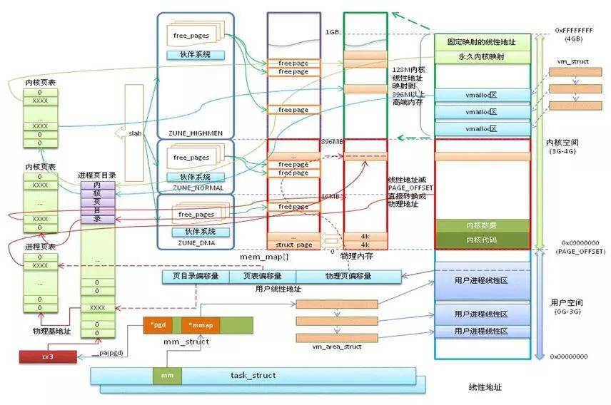


 2、内存地址——用户态&内核态


- 用户态：Ring3 运行于用户态的代码则要受到处理器的诸多

- 内核态：Ring0 在处理器的存储保护中，核心态

- 用户态切换到内核态的 3 种方式：系统调用、异常、外设中断

- 区别：每个进程都有完全属于自己的，独立的，不被干扰的内存空间；用户态的程序就不能随意操作内核地址空间，具有一定的安全保护作用；内核态线程共享内核地址空间；


 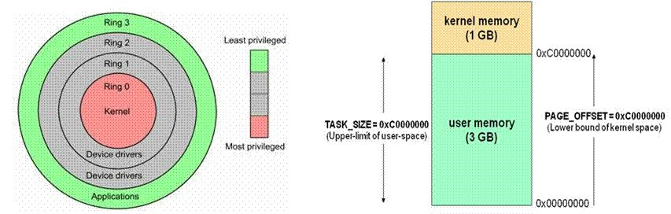


 3、内存地址——MMU 地址转换


- MMU 是一种硬件电路，它包含两个部件，一个是分段部件，一个是分页部件

- 分段机制把一个逻辑地址转换为线性地址

- 分页机制把一个线性地址转换为物理地址


 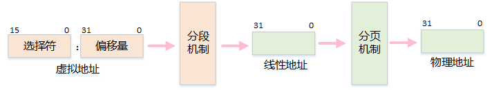


 4、内存地址——分段机制

 1) 段选择符


- 为了方便快速检索段选择符，处理器提供了 6 个分段寄存器来缓存段选择符，它们是：cs,ss,ds,es,fs 和 gs

- 段的基地址(Base Address)：在线性地址空间中段的起始地址

- 段的界限(Limit)：在虚拟地址空间中，段内可以使用的最大偏移量


 2) 分段实现


- 逻辑地址的段寄存器中的值提供段描述符，然后从段描述符中得到段基址和段界限，然后加上逻辑地址的偏移量，就得到了线性地址 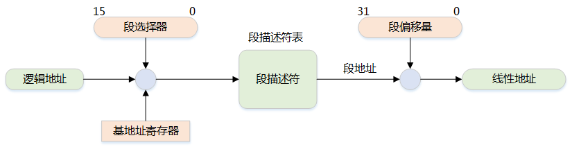


 5、内存地址——分页机制（32 位）

 


- 分页机制是在分段机制之后进行的，它进一步将线性地址转换为物理地址

- 10 位页目录，10 位页表项， 12 位页偏移地址

- 单页的大小为 4KB


 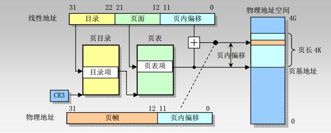


 6、用户态地址空间


 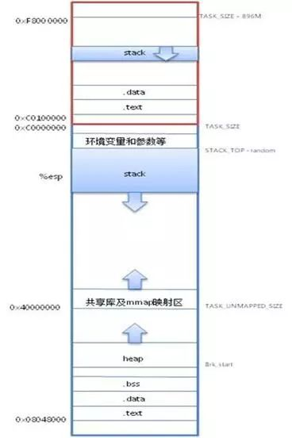


- TEXT：代码段可执行代码、字符串字面值、只读变量

- DATA：数据段，映射程序中已经初始化的全局变量

- BSS 段：存放程序中未初始化的全局变量

- HEAP：运行时的堆，在程序运行中使用 malloc 申请的内存区域

- MMAP：共享库及匿名文件的映射区域

- STACK：用户进程栈


 7、内核态地址空间


 


- 直接映射区：线性空间中从 3G 开始最大 896M 的区间，为直接内存映射区

- 动态内存映射区：该区域由内核函数 vmalloc 来分配

- 永久内存映射区：该区域可访问高端内存

- 固定映射区：该区域和 4G 的顶端只有 4k 的隔离带，其每个地址项都服务于特定的用途，如：ACPI_BASE 等


 8、进程内存空间


- 用户进程通常情况只能访问用户空间的虚拟地址，不能访问内核空间虚拟地址

- 内核空间是由内核负责映射，不会跟着进程变化；内核空间地址有自己对应的页表，用户进程各自有不同额页表


 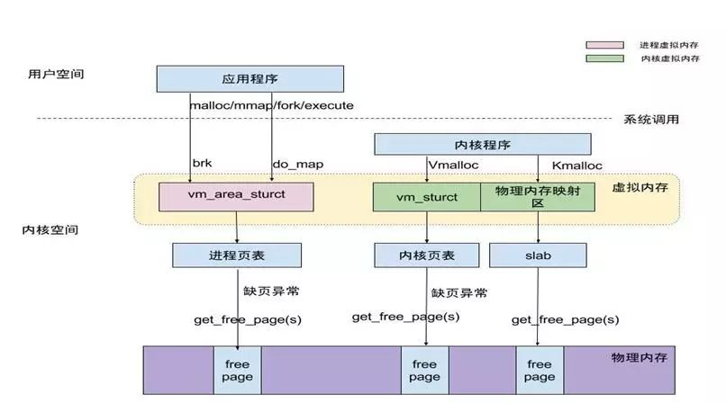


## 三、 Linux 内存分配算法

 内存管理算法：对讨厌自己管理内存的人来说是天赐的礼物。

 1、内存碎片

 1)    基本原理


- 产生原因：内存分配较小，并且分配的这些小的内存生存周期又较长，反复申请后将产生内存碎片的出现

- 优点：提高分配速度，便于内存管理，防止内存泄露

- 缺点：大量的内存碎片会使系统缓慢，内存使用率低，浪费大


 2) 如何避免内存碎片


- 少用动态内存分配的函数(尽量使用栈空间)

- 分配内存和释放的内存尽量在同一个函数中

- 尽量一次性申请较大的内存，而不要反复申请小内存

- 尽可能申请大块的 2 的指数幂大小的内存空间

- 外部碎片避免——伙伴系统算法

- 内部碎片避免——slab 算法

- 自己进行内存管理工作，设计内存池


 2、伙伴系统算法——组织结构

 1)    概念


- 为内核提供了一种用于分配一组连续的页而建立的一种高效的分配策略，并有效的解决了外碎片问题

- 分配的内存区是以页框为基本单位的


 2)    外部碎片


- 外部碎片指的是还没有被分配出去（不属于任何进程），但由于太小了无法分配给申请内存空间的新进程的内存空闲区域3)    组织结构

- 把所有的空闲页分组为 11 个块链表，每个块链表分别包含大小为 1，2，4，8，16，32，64，128，256，512 和 1024 个连续页框的页块。最大可以申请 1024 个连续页，对应 4MB 大小的连续内存。


 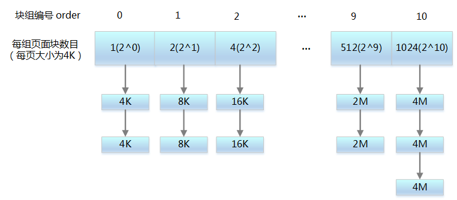


 3、伙伴系统算法——申请和回收

 1)    申请算法


- 申请 2^i 个页块存储空间，如果 2^i 对应的块链表有空闲页块，则分配给应用

- 如果没有空闲页块，则查找 2^(i 1) 对应的块链表是否有空闲页块，如果有，则分配 2^i 块链表节点给应用，另外 2^i 块链表节点插入到 2^i 对应的块链表中

- 如果 2^(i 1) 块链表中没有空闲页块，则重复步骤 2，直到找到有空闲页块的块链表

- 如果仍然没有，则返回内存分配失败


 2)    回收算法


- 释放 2^i 个页块存储空间，查找 2^i 个页块对应的块链表，是否有与其物理地址是连续的页块，如果没有，则无需合并 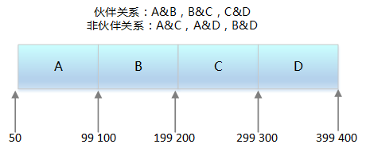

- 如果有，则合并成 2^（i 1）的页块，以此类推，继续查找下一级块链接，直到不能合并为止


 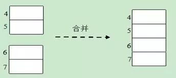


 3)    条件


- 两个块具有相同的大小

- 它们的物理地址是连续的

- 页块大小相同


 4、如何分配 4M 以上内存？

 1)    为何限制大块内存分配


- 分配的内存越大, 失败的可能性越大

- 大块内存使用场景少


 2)    内核中获取 4M 以上大内存的方法


- 修改 MAX_ORDER, 重新编译内核

- 内核启动选型传递'mem='参数, 如'mem=80M，预留部分内存；然后通过

- request_mem_region 和 ioremap_nocache 将预留的内存映射到模块中。需要修改内核启动参数, 无需重新编译内核. 但这种方法不支持 x86 架构, 只支持 ARM, PowerPC 等非 x86 架构

- 在 start_kernel 中 mem_init 函数之前调用 alloc_boot_mem 函数预分配大块内存, 需要重新编译内核

- vmalloc 函数，内核代码使用它来分配在虚拟内存中连续但在物理内存中不一定连续的内存


 5、伙伴系统——反碎片机制

 1)    不可移动页


- 这些页在内存中有固定的位置，不能够移动，也不可回收

- 内核代码段，数据段，内核 kmalloc() 出来的内存，内核线程占用的内存等


 2)    可回收页


- 这些页不能移动，但可以删除。内核在回收页占据了太多的内存时或者内存短缺时进行页面回收3)    可移动页

- 这些页可以任意移动，用户空间应用程序使用的页都属于该类别。它们是通过页表映射的

- 当它们移动到新的位置，页表项也会相应的更新


 6、slab 算法——基本原理

 1)    基本概念


- Linux 所使用的 slab 分配器的基础是 Jeff Bonwick 为 SunOS 操作系统首次引入的一种算法

- 它的基本思想是将内核中经常使用的对象放到高速缓存中，并且由系统保持为初始的可利用状态。比如进程描述符，内核中会频繁对此数据进行申请和释放


 2)    内部碎片


- 已经被分配出去的的内存空间大于请求所需的内存空间3)    基本目标

- 减少伙伴算法在分配小块连续内存时所产生的内部碎片

- 将频繁使用的对象缓存起来，减少分配、初始化和释放对象的时间开销

- 通过着色技术调整对象以更好的使用硬件高速缓存


 7、slab 分配器的结构


- 由于对象是从 slab 中分配和释放的，因此单个 slab 可以在 slab 列表之间进行移动

- slabs_empty 列表中的 slab 是进行回收（reaping）的主要备选对象

- slab 还支持通用对象的初始化，从而避免了为同一目而对一个对象重复进行初始化


 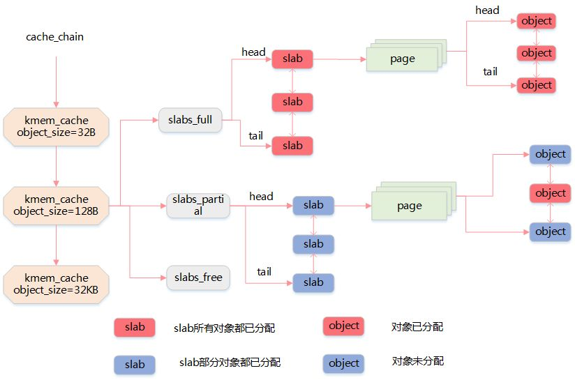


 8、slab 高速缓存

 1)    普通高速缓存


- slab 分配器所提供的小块连续内存的分配是通过通用高速缓存实现的

- 通用高速缓存所提供的对象具有几何分布的大小，范围为 32 到 131072 字节。

- 内核中提供了 kmalloc() 和 kfree() 两个接口分别进行内存的申请和释放


 2)    专用高速缓存


- 内核为专用高速缓存的申请和释放提供了一套完整的接口，根据所传入的参数为具体的对象分配 slab 缓存

- kmem_cache_create() 用于对一个指定的对象创建高速缓存。它从 cache_cache 普通高速缓存中为新的专有缓存分配一个高速缓存描述符，并把这个描述符插入到高速缓存描述符形成的 cache_chain 链表中

- kmem_cache_alloc() 在其参数所指定的高速缓存中分配一个 slab。相反， kmem_cache_free() 在其参数所指定的高速缓存中释放一个 slab


 9、内核态内存池

 1)    基本原理


- 先申请分配一定数量的、大小相等(一般情况下) 的内存块留作备用

- 当有新的内存需求时，就从内存池中分出一部分内存块，若内存块不够再继续申请新的内存

- 这样做的一个显著优点是尽量避免了内存碎片，使得内存分配效率得到提升


 2)    内核 API


- mempool_create 创建内存池对象

- mempool_alloc 分配函数获得该对象

- mempool_free 释放一个对象

- mempool_destroy 销毁内存池


 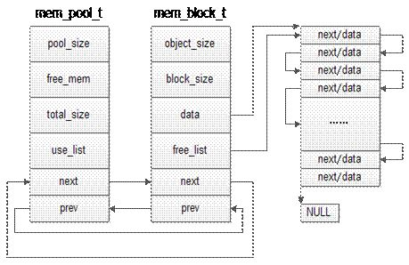


 10、用户态内存池

 1)    C++ 实例


 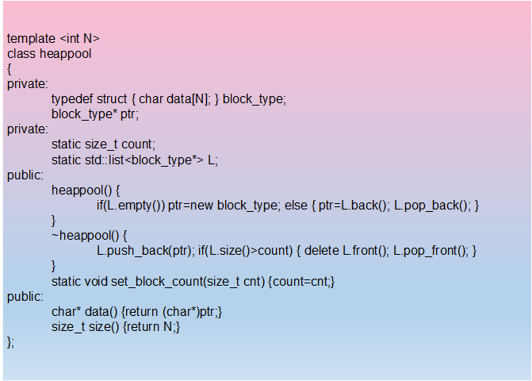


 11、DMA 内存

 1)    什么是 DMA


- 直接内存访问是一种硬件机制，它允许外围设备和主内存之间直接传输它们的 I/O 数据，而不需要系统处理器的参与2)    DMA 控制器的功能

- 能向 CPU 发出系统保持（HOLD）信号，提出总线接管请求

- 当 CPU 发出允许接管信号后，负责对总线的控制，进入 DMA 方式

- 能对存储器寻址及能修改地址指针，实现对内存的读写操作

- 能决定本次 DMA 传送的字节数，判断 DMA 传送是否结束

- 发出 DMA 结束信号，使 CPU 恢复正常工作状态


 2)    DMA 信号


- DREQ：DMA 请求信号。是外设向 DMA 控制器提出要求，DMA 操作的申请信号

- DACK：DMA 响应信号。是 DMA 控制器向提出 DMA 请求的外设表示已收到请求和正进行处理的信号

- HRQ：DMA 控制器向 CPU 发出的信号，要求接管总线的请求信号。

- HLDA：CPU 向 DMA 控制器发出的信号，允许接管总线的应答信号：


 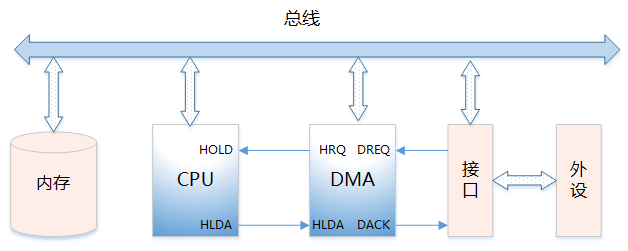


## 四、 内存使用场景

 out of memory 的时代过去了吗？no，内存再充足也不可任性使用。

 1、内存的使用场景


- page 管理

- slab（kmalloc、内存池）

- 用户态内存使用（malloc、relloc 文件映射、共享内存）

- 程序的内存 map（栈、堆、code、data）

- 内核和用户态的数据传递（copy_from_user、copy_to_user）

- 内存映射（硬件寄存器、保留内存）

- DMA 内存


 2、用户态内存分配函数


- alloca 是向栈申请内存,因此无需释放

- malloc 所分配的内存空间未被初始化，使用 malloc() 函数的程序开始时(内存空间还没有被重新分配) 能正常运行，但经过一段时间后(内存空间已被重新分配) 可能会出现问题

- calloc 会将所分配的内存空间中的每一位都初始化为零

- realloc 扩展现有内存空间大小


- a)如果当前连续内存块足够 realloc 的话，只是将 p 所指向的空间扩大，并返回 p 的指针地址。这个时候 q 和 p 指向的地址是一样的

- b)如果当前连续内存块不够长度，再找一个足够长的地方，分配一块新的内存，q，并将 p 指向的内容 copy 到 q，返回 q。并将 p 所指向的内存空间删除


 3、内核态内存分配函数

 

 函数分配原理最大内存其他_get_free_pages直接对页框进行操作4MB适用于分配较大量的连续物理内存kmem_cache_alloc基于 slab 机制实现128KB适合需要频繁申请释放相同大小内存块时使用kmalloc基于 kmem_cache_alloc 实现128KB最常见的分配方式，需要小于页框大小的内存时可以使用vmalloc建立非连续物理内存到虚拟地址的映射物理不连续，适合需要大内存，但是对地址连续性没有要求的场合dma_alloc_coherent基于_alloc_pages 实现4MB适用于 DMA 操作ioremap实现已知物理地址到虚拟地址的映射适用于物理地址已知的场合，如设备驱动alloc_bootmem在启动 kernel 时，预留一段内存，内核看不见小于物理内存大小，内存管理要求较高


 4、malloc 申请内存

 


- 调用 malloc 函数时，它沿 free_chuck_list 连接表寻找一个大到足以满足用户请求所需要的内存块


 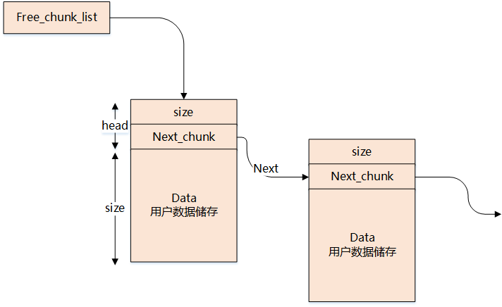


- free_chuck_list 连接表的主要工作是维护一个空闲的堆空间缓冲区链表

- 如果空间缓冲区链表没有找到对应的节点，需要通过系统调用 sys_brk 延伸进程的栈空间


 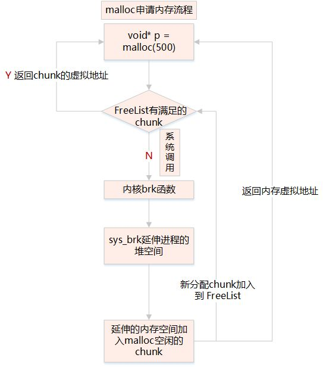


 5、缺页异常


- 通过 get_free_pages 申请一个或多个物理页面

- 换算 addr 在进程 pdg 映射中所在的 pte 地址

- 将 addr 对应的 pte 设置为物理页面的首地址

- 系统调用：Brk—申请内存小于等于 128kb，do_map—申请内存大于 128kb


 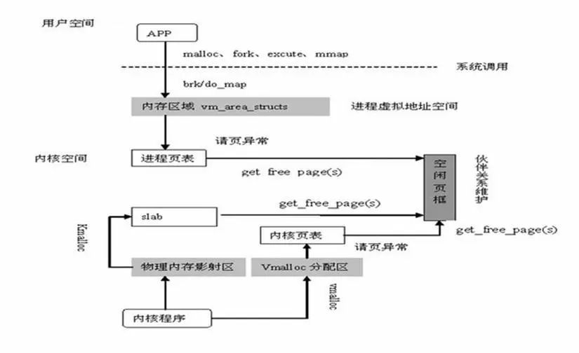


 6、用户进程访问内存分析


- 用户态进程独占虚拟地址空间，两个进程的虚拟地址可相同

- 在访问用户态虚拟地址空间时，如果没有映射物理地址，通过系统调用发出缺页异常

- 缺页异常陷入内核，分配物理地址空间，与用户态虚拟地址建立映射


 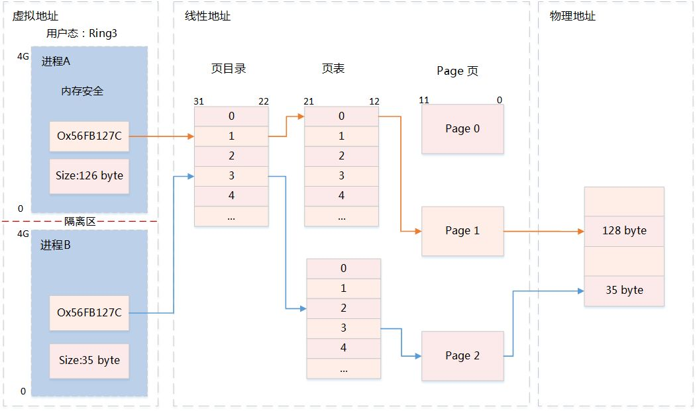


 7、共享内存

 1)    原理


- 它允许多个不相关的进程去访问同一部分逻辑内存

- 两个运行中的进程之间传输数据，共享内存将是一种效率极高的解决方案

- 两个运行中的进程共享数据，是进程间通信的高效方法，可有效减少数据拷贝的次数


 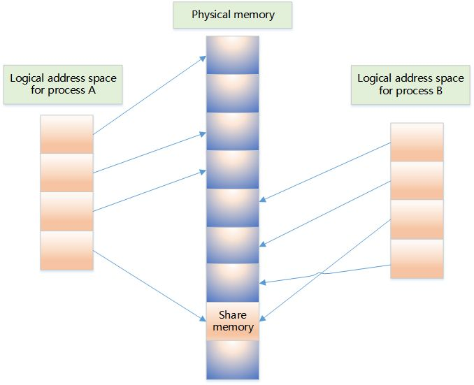


 2)    Shm 接口


- shmget 创建共享内存

- shmat 启动对该共享内存的访问，并把共享内存连接到当前进程的地址空间

- shmdt 将共享内存从当前进程中分离


## 五、 内存使用那些坑

 1、C 内存泄露


- 在类的构造函数和析构函数中没有匹配地调用 new 和 delete 函数 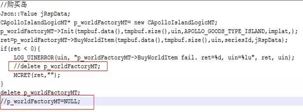

- 没有正确地清除嵌套的对象指针

- 没有将基类的析构函数定义为虚函数

- 当基类的指针指向子类对象时，如果基类的析构函数不是 virtual，那么子类的析构函数将不会被调用，子类的资源没有得到正确释放，因此造成内存泄露

- 缺少拷贝构造函数，按值传递会调用（拷贝）构造函数，引用传递不会调用

- 指向对象的指针数组不等同于对象数组，数组中存放的是指向对象的指针，不仅要释放每个对象的空间，还要释放每个指针的空间

- 缺少重载赋值运算符，也是逐个成员拷贝的方式复制对象，如果这个类的大小是可变的，那么结果就是造成内存泄露


 2、C 野指针


- 指针变量没有初始化

- 指针被 free 或 delete 后，没有设置为 NULL

- 指针操作超越了变量的作用范围，比如返回指向栈内存的指针就是野指针

- 访问空指针（需要做空判断）

- sizeof 无法获取数组的大小

- 试图修改常量，如：char p='1234';p=\'1\';


 3、C 资源访问冲突


- 多线程共享变量没有用 valotile 修饰

- 多线程访问全局变量未加锁

- 全局变量仅对单进程有效

- 多进程写共享内存数据，未做同步处理

- mmap 内存映射，多进程不安全


 4、STL 迭代器失效


- 被删除的迭代器失效

- 添加元素（insert/push_back 等）、删除元素导致顺序容器迭代器失效


 错误示例：删除当前迭代器，迭代器会失效


 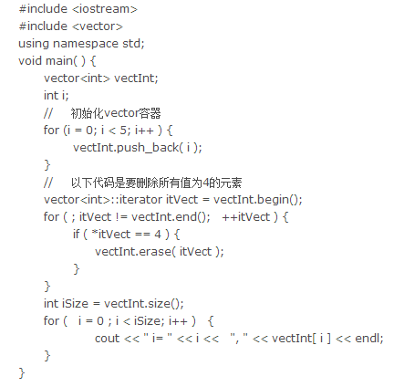


 正确示例：迭代器 erase 时，需保存下一个迭代器


 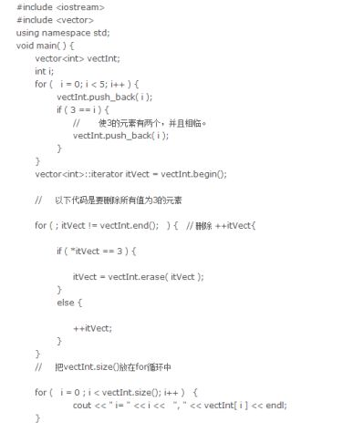


 5、C++ 11 智能指针


- auto_ptr 替换为 unique_ptr 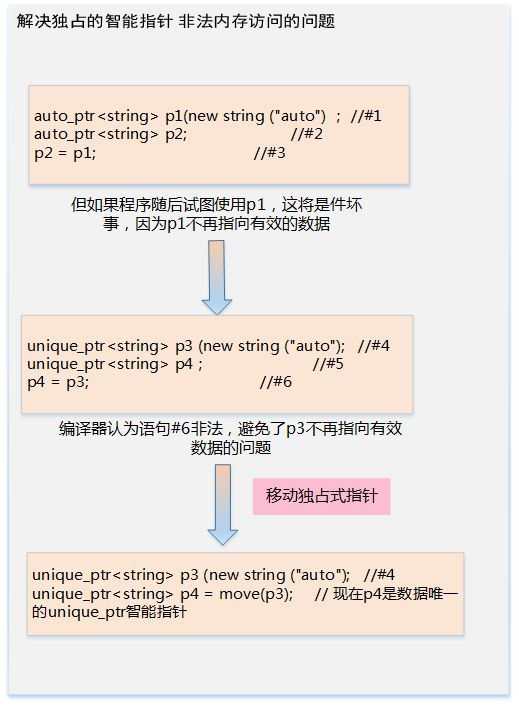

- 使用 make_shared 初始化一个 shared_ptr


 


- weak_ptr 智能指针助手（1）原理分析： 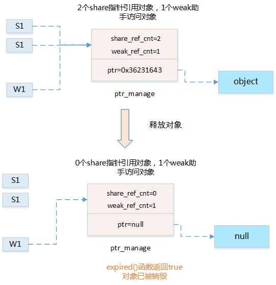 （2）数据结构： 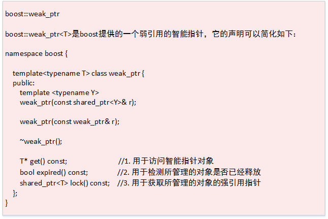 （3）使用方法：a.  lock() 获取所管理的对象的强引用指针 b. expired() 检测所管理的对象是否已经释放 c. get() 访问智能指针对象


 6、C++ 11 更小更快更安全


- std::atomic 原子数据类型 多线程安全

- std::array 定长数组开销比 array 小和 std::vector 不同的是 array 的长度是固定的，不能动态拓展

- std::vector vector 瘦身 shrink_to_fit()：将 capacity 减少为于 size() 相同的大小

- td::forward_list


 forward_list 是单链表（std::list 是双链表），只需要顺序遍历的场合，forward_list 能更加节省内存，插入和删除的性能高于 list


- std::unordered_map、std::unordered_set用 hash 实现的无序的容器，插入、删除和查找的时间复杂度都是 O(1)，在不关注容器内元素顺序的场合，使用 unordered 的容器能获得更高的性能六、 如何查看内存

- 系统中内存使用情况：/proc/meminfo


 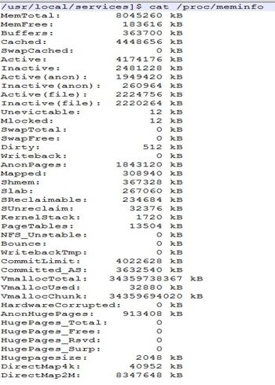


- 进程的内存使用情况：/proc/28040/status

- 查询内存总使用率：free


 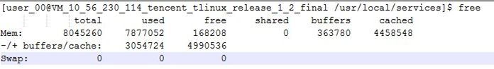


- 查询进程 cpu 和内存使用占比：top 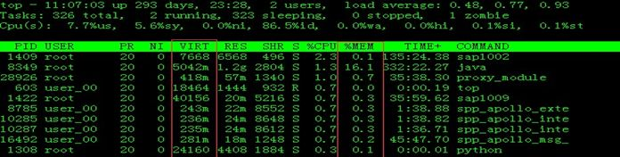

- 虚拟内存统计：vmstat


 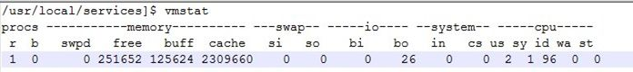


- 进程消耗内存占比和排序：ps aux –sort -rss 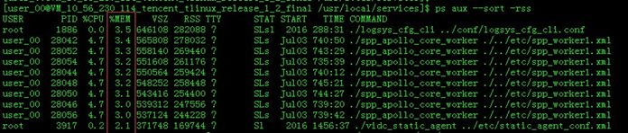

- 释放系统内存缓存： /proc/sys/vm/drop_caches


- To free pagecache, use echo 1 > /proc/sys/vm/drop_caches

- To free dentries and inodes, use echo 2 > /proc/sys/vm/drop_caches

- To free pagecache, dentries and inodes, use echo 3 >/proc/sys/vm/drop_caches


```


```

 ****
```

 **重磅！程序员大白交流群-学术微信交流群已成立**

 

 **额外赠送福利资源！邱锡鹏深度学习与神经网络，pytorch官方中文教程，利用Python进行数据分析，机器学习学习笔记，pandas官方文档中文版，effective java（中文版）等20项福利资源**

 

 获取方式：进入群后**点开群公告即可领取下载链接**

 

 

 

 注意：请大家添加时修改备注为 [学校/公司 + 姓名 + 方向]

 例如 —— 哈工大+张三+对话系统。

 号主，微商请自觉绕道。谢谢！

 


 推荐阅读


 [拍一拍，微信史上最短一行代码](http://mp.weixin.qq.com/s?__biz=MzU3NDgxMzI0Mw==&mid=2247487180&idx=1&sn=2452de2e96cd90bd8f43a195badbab43&chksm=fd2deb98ca5a628e1dc3d6359982ab54d7ce5571dbb1832085ddb8c5f2e14d78810ccf8b460a&scene=21#wechat_redirect)

 [插件界的瑞士军刀，vs code已经无所不能！](http://mp.weixin.qq.com/s?__biz=MzU3NDgxMzI0Mw==&mid=2247487117&idx=1&sn=308726d7d9aac6a75aa99ebd87a5e3d3&chksm=fd2debd9ca5a62cf1e7c1670ba32eeacddac935f813db71086f7260895c438683ada4b817e82&scene=21#wechat_redirect)

 [又跌！6月全国程序员工资新统计，太扎心](http://mp.weixin.qq.com/s?__biz=MzU3NDgxMzI0Mw==&mid=2247486904&idx=1&sn=c770ec21f3626f995ee444910ac9250c&chksm=fd2de8ecca5a61fac6186694e4fc1e384402e6b7b694966583cedae02ec96f27e5b9b7414fa5&scene=21#wechat_redirect)

 [竟有如此沙雕的代码注释！](http://mp.weixin.qq.com/s?__biz=MzU3NDgxMzI0Mw==&mid=2247486764&idx=1&sn=83b1559e556bc4d8114a7c712c663b0f&chksm=fd2de878ca5a616e325fdc2c050fefafa6dd4bb87c2cf4a65e71a55c11dff610284b1ae8c76e&scene=21#wechat_redirect)

 [忍无可忍，2款工具解决APP开屏广告！](http://mp.weixin.qq.com/s?__biz=MzU3NDgxMzI0Mw==&mid=2247486630&idx=1&sn=cfbd793da22817b6ea6d9c86cdd5a9d6&chksm=fd2de9f2ca5a60e48c7e30cd7bc19827ac742d9bcdc51fd0c64a53bcda7e90a80373395e6c8d&scene=21#wechat_redirect)

 

 关于程序员大白

 

 程序员大白是一群哈工大，东北大学，西湖大学和上海交通大学的硕士博士运营维护的号，大家乐于分享高质量文章，喜欢总结知识，欢迎关注[程序员大白]，大家一起学习进步！

 

 


```
