# CPU Cache

## Cache 缓存技术-1
  

**还有人问我， 你说的CPU 和内存都是啥关系，是什么东东？**  

用最浅显的话说，如下图，最概括的认识，可以把  CPU理解为 内部有些算数单元，比如可以做加法，减法，等计算，他使用一系列的内部存储(寄存器)的硬件，他一条条的执行指令，需要访问内存就从内存拿些数据放到寄存器里或者可以输出结果到寄存器或内存。如下图    

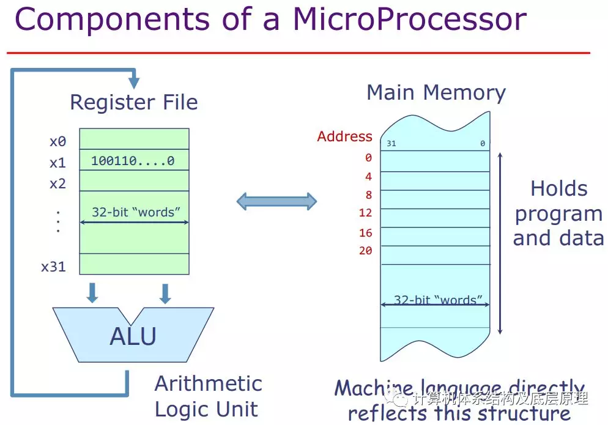
  

       转入正题Cache (缓存) 应该是现代计算机中最重要的技术，我们从今天起开始探究Cache.   我认为计算机最基本的三个技术就是Cache, Memory，中断,这些是最基础，理解了，理解起来计算机体系结构就是如庖丁解牛般游刃有余。 关于memory 我们前几篇文章涉及了一些内存地址的技术，虚存技术，还有很多没有讲，以后在说。 
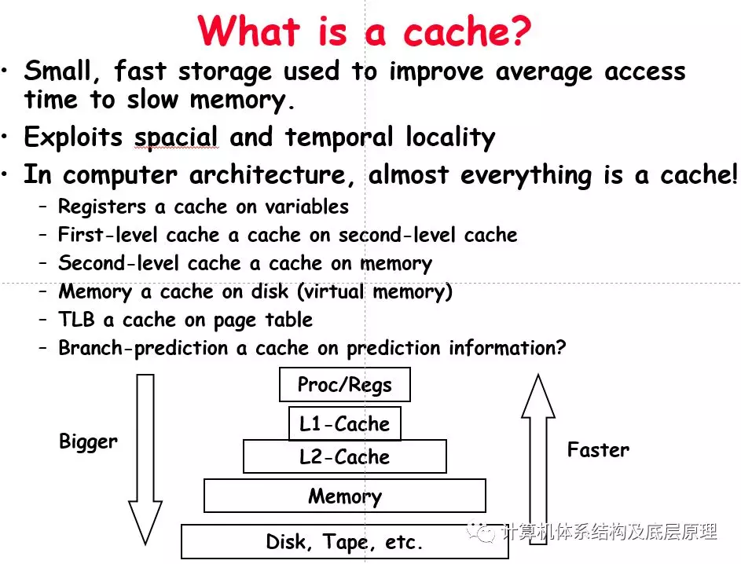

  

我费劲脑汁想出来一个生活中的例子，来解释Cache和在Cache 中各种概念。

比如说你在看书，你比方是CPU ，这本书就是寄存器，你从你手上读取这本书几乎不需要时间很快(CPU 读取寄存器的速度很快，你手上这本书就是相当于register),没有啥延迟,可是看的过程中你可能需要查阅其他的资料，所以就从书桌上拿起另一本书 ，读取这本书至少要花费你一点时间，因为不在你手上，这书桌上的书就是你的 L1 cache ,一级缓存，假如说这本书没有你要的资料( L1 cache miss), 然后你起身到你的书架上找，如果找到(L2 cache hit ) ,如果没有找到，就是L2 Cache miss, 然后你跑到你同事的位置上去找(memory) 这个可能需要更久的时间来获得来读取这本书，如果还没有找到，(Memory 的页面可能被换页到磁盘)，那么你需要跑到图书馆(磁盘)去借那本书.大概就是这意思  

       上图表示,cache 层级越往下，速度越慢，容量越大，每字节越便宜。

       关于cache 层级的速度,为了给大家一个直观的概念，我们看下CPU和各级存储单元的速度，我们大概给个数字，比如说CPU 3GHZ ，假设每条指令需要1个 cycle 周期，也就是说 CPU的频率可以到每0.33 纳秒完成一条指令，当然在x86系统里每条指令的执行时间是不定的，我们就假设一下

OK ，时间单位是纳秒（ns，10^-9秒）,1那么L1 cache 的速度大概是1ns , 等于3 cycles,  L2 cache读取需要 4.7 ns , 大概14个周期（cycle)，读取外部内存 DDR ,大概83ns , 259 周期（cycle）, 这个感觉就有点长了，还算可以接受吧，那么读取磁盘上的数据15ms 这个就是级数的增长了，大约相当于CPU 可以执行4千万个cylce/指令，大家可以看到在CPU 视角里里，L1 /L2 的速度还凑合，到了Memory 内存就是又点长了， 到了读写磁盘CPU 看起来就是比蜗牛还慢，所以现代的操作系统磁盘的IO操作多是异步的，就是CPU 先去下一个读命令，然后去干其他了，等到他好了，在通知CPU。

  

你可能要问我说那为啥不把所有的都做成L1 Cache ,也想啊，一个字贵啊。速度越快,越贵,计算机为了保证性能和速度的平衡采取了这个Cache 的设计，cache 总是放着你经常使用的内存拷贝，如果出现了cache 缺失在从外部内存中读取 。

  

目前SSD可能比机械硬盘要快不少，但是相当内存CPU还是很慢，所以 Intel 现在有个傲腾技术，比SSD 快很多，比memory 稍慢一点，也算弥补了这两层存储设备之间速度差吧，不好意思，给东家做个广告啊。

  

那么cache 里面都是啥 ? 首先，一般我们硬件都是以一个cache line 为单位来整体读写，这个根据CPU的不同，可以是是32byte, 64bytes,128byte 等等，即使 CPU只是读取其中的一个字节，硬件也是直接操作整个cache line 的，也就是说，CPU的指令 从内存中如果只是读取一个byte的话，CPU其实会把那个byte 对应的所有cache line 的数据一次性都放到cache 里, 下图给出cache 内部的示例：注意几个概念，cache line, data block  

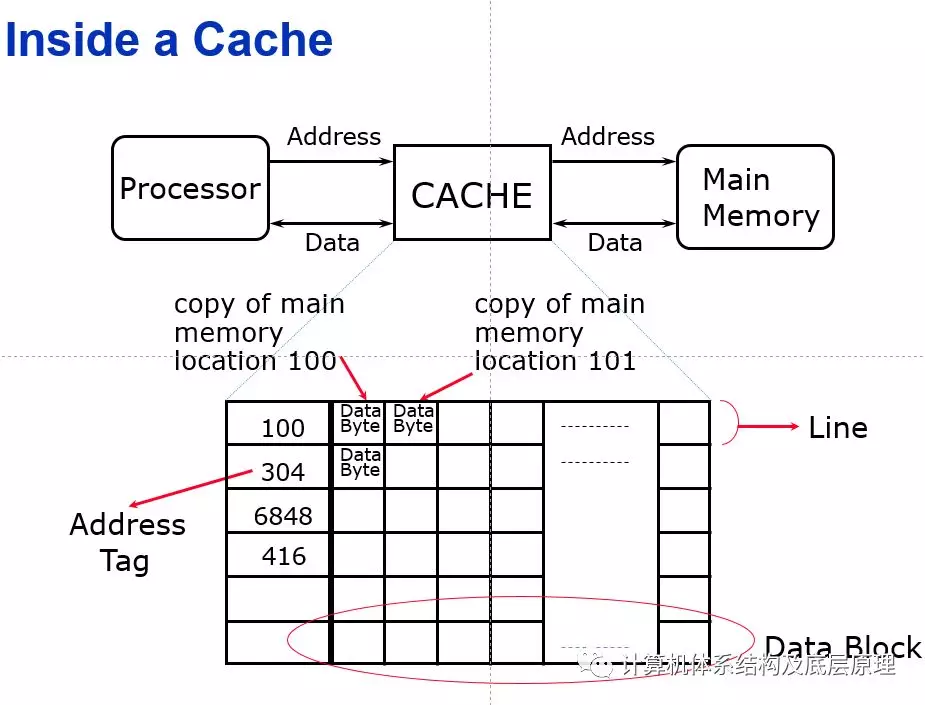

接下来我们要深入的了解下Cache 层级的几个需要考虑的问题，先把问题抛出了，再看现代的CPU 是如何设计来解决这些问题的

  

Q1.  既然下一级的cache 都比上一级的大，那么我们的下一级的内存块可以放在上一级的那个地方呢？或者说同一时刻只有一部分的数据可以放在上一级cache 里，那么他可以放在那个地方呢？  

  

这个就有带来了三种选择

Associative            组相连的技术 ，  可以放在上一级多个固定地方

Direct mapped      直接连接             只可以放在上一级的一个固定地方

Fully Associative    全相联                 可以放在上一级的任何位置

  

Q2,   我们如何知道我要找的内存地址是否存放在cache 中  

这个就需要我们理解上面那个图中的tag/block,来根据地址来查找cache 中是否有该地址对应的内容

Q3.   Cache 如果不够用了，那么cache 的替换策略是啥?  

         LRU（最近最少被用) ,Radom(随机)  

Q4.    写Cache的时候的策略是什么？   

      write back 直接写到cache 里面, 不马上写memeory, 直到被踢出去，或者在硬件不忙的时候写会

      write though 写穿 我每次既写到cache 里面又写到memory 里面

  

wirte though 到主存储器的好处是它简化了计算机系统的设计。通过直写，主存储器始终具有该行的最新副本。因此，当完成读取时，主存储器总是可以使用所请求的数据进行回复。

  

如果使用wirte back ，有时最新数据位于处理器高速缓存中，有时它位于主存储器中。如果数据在处理器高速缓存中，则该处理器必须停止主存储器回复读取请求，因为主存储器可能具有数据的陈旧副本。这比直写更复杂。

  

此外，直写可以简化缓存一致性协议，因为它不需要修改状态。“修改”状态记录缓存必须在缓存行无效或逐出之前写回缓存行。在直写中，高速缓存行总是可以无效而无需回写，因为内存已经具有该行的最新副本。

接下来需要一一详细的去解答这些问题。

## Cache 缓存技术-2  

继续看Cache的这几个问题  

Q1：块可以放在缓存的那个位置？下图显示了对Cache块放置位置的限制

有如下三个缓存组织类别：■如果每个块只有一个位置，它可以出现在缓存中，则称为缓存直接映射。映射通常是 （块地址）MOD（缓存中的块数） ■如果块可以放在缓存中的任何位置，则称缓存完全关联。■如果块可以放置在缓存中的一组受限位置，则缓存为组相连。集合A Set 是缓存中的一组块。块是映射到一个集合，然后该块可以放在该集合中的任何位置。
  

该组通常通过位选择来选择;那是，（块地址）MOD（缓存中的集数） 如果集合中有n个块，则缓存放置称为n路集关联。

从直接映射到完全关联的缓存范围实际上是一个连续统一体 集合关联度。直接映射只是单向集合关联， 并且具有m个块的完全关联缓存可以被称为“m-way set associative”。等价地，直接映射可以被认为具有m个集合，并且完全关联为有一组。今天绝大多数处理器缓存都是直接映射的双向集 我们很快就会看到关联或四向关联的原因
  

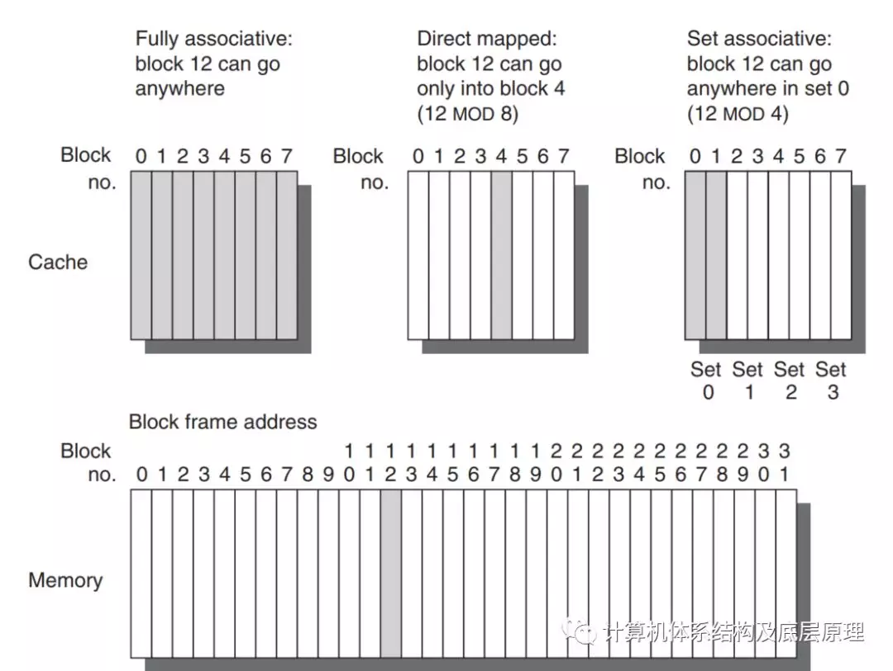
  

意思是这样的，上面的图，假设我的cache 是有8个block的，内存都是比cache 大的假设有32 个block,那么，

对于全相联的cache , 如果我要把地址为12 的放到cache 里，我可以放到任何对方，0-7 的位置  

对于直接相连联的cache ,如果我只能放在cache 中的4号位置，原因是12/8 是余4 ， 即 0位置对0 ，1对1，2对2 .。。。到8的时候又对cache 0 ,.。。12对4 ，也就是说如果我在访问了地址4后，命中了，但是我CPU 又要访问地址12 ，那么怎么办呢，如果全相联，如果cache 其他位置还有空间，我可以放到那边去，但是对于直接相连，就要把4 写回到内存中把12 放到cache里，明白？ 

对于组相联，实际上是直接相连和全相联的一种折中，我把cache 先分成几组，然后内存的地址可以放在这一组的任何地方，如果他属于这一组。
  

现代的 CPU 大多采用组相连技术 (8/16 -way associative) ,我们会在CPU的手册中看到类似这样的字眼。 

那么为什么都会使用组相联的技术呢
  

这个要看cache  内部的实现
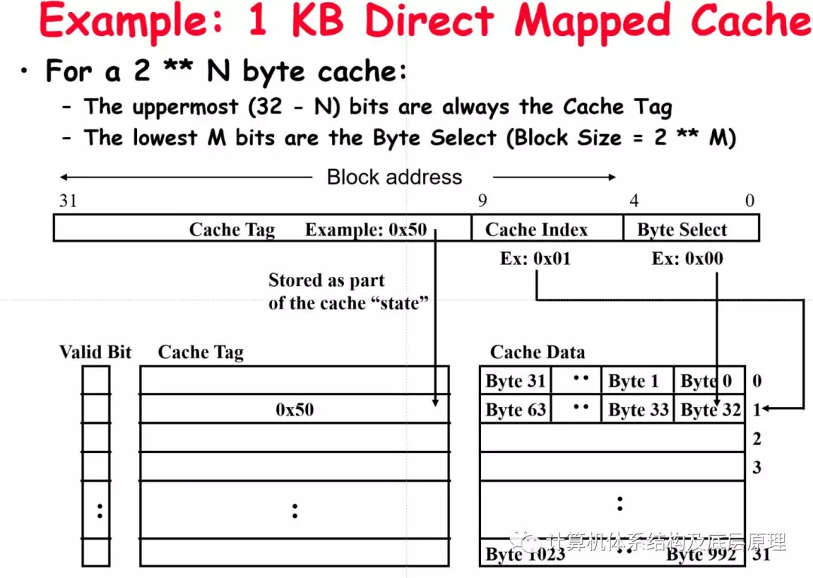
  

如果是直接相连，看这个图，我们把内存地址中的Cache Tag  直接和cache 中的索引比较，一样的就是我要找的cache 数据了，很直接把
  

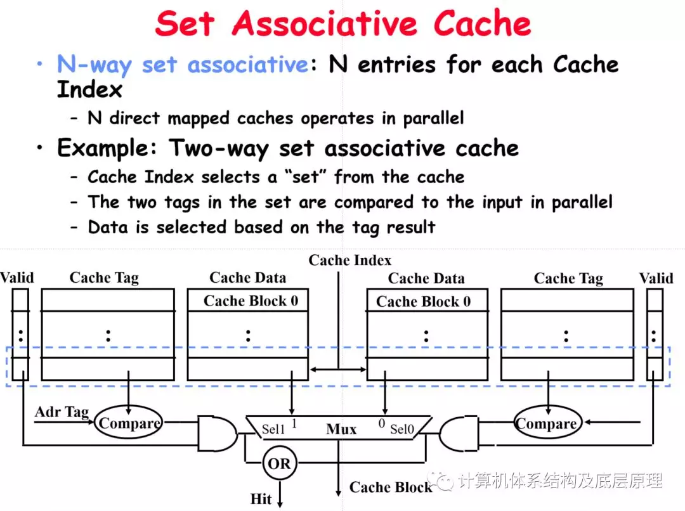

如果是组相连，大家看下是不是硬件的逻辑要复杂一下，需要把cache Tag 和组内的多个相关的  cacth tag 进行比较，确认是否在这个 集合里面  

比如16路组相联，就需要有16 路比较器，来判断是否cache 命中，相比直接相连就复杂了一些，但是这个代价是值得的，因为他这样设计比直接相连提高了cache 的命中率。  
  

全相联虽然更加提高了cache 了命中率，但是大大增加了硬件设计的复杂性，所以也不可取

所以组相联技术即在全相联和直接相连中找到的巧妙的权衡
  

现代的CPU 设计中处处体现了这种哲学思想， 计算机性能和价格的权衡
## Cache 缓存技术-3

**首先回答之前写的Cache文章有人问，****Cache 读取的逻辑是什么?**

1\. 首先用CPU需要访问的地址，使用地址中属于Tag 的部分去cache 中查找，

2.  如果找到，返回该地址的内容，叫Cache 命中

3.  如果在cache 里面没有找到，叫Cache Miss, Cache 缺失

说明在下一级存储单元中，然后直接从主存中获取这个cache 块

给 CPU ，等下，就完了？？，你得把这个内容放在cache 里(下次在取得时候就命中了），可是这个tag 对应的cache block已经有放其他的数据了，怎么办？就把这个目前的cache 块写回到主存，在更新Cache。至于怎么知道Cache 块要放在cache 哪里，我们前面讲了三种策略。 

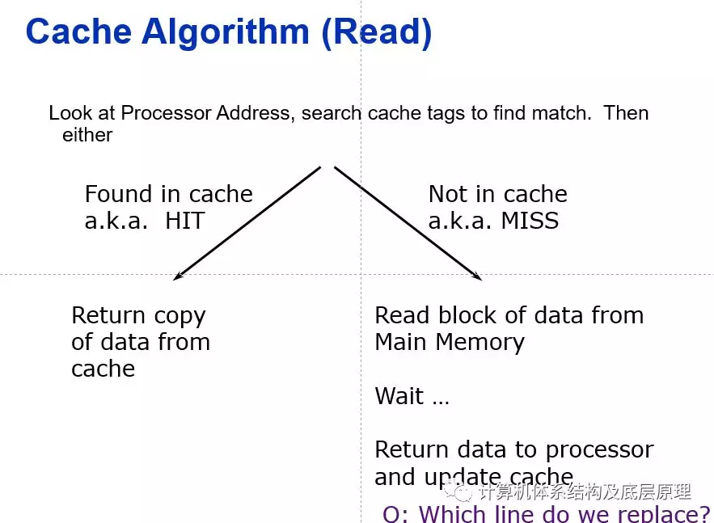

好，继续我们之前的探究来讨论第二个问题

**Q2, 我们是如何知道一个给定的地址是否在 cache 中的？**

  

Cache在每个块帧上都有一个地址标记tag，用于给出块地址。该检查可能包含所需信息的每个缓存块的标记看它是否与处理器的块地址匹配。通常，所有可能的tag并行搜索，因为速度至关重要。必须有一种方法可以知道缓存块没有有效vaild信息(有用到否）。最常见的处理是向标记添加有效位以表示是否此条目不包含有效地址。如果未设置该位，则不能匹配在这个地址上

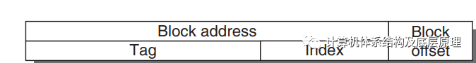
  

块地址(block address)可以进一步分为标记字段和索引字段。该块偏移字段从块中选择所需数据，索引字段选择集合(cache line索引)，用tag字段来判断是否命中。虽然可以在比标签tag更多的地址上进行比较，但是没有必要。因为以下的原因

1\. 不应在比较中使用偏移量，因为整个块都是是否存在，因此所有块偏移都会导致匹配。

2\. 检查索引Index 是多余的，因为它用于选择要设置的索引检查。例如，存储在集合0中的地址在索引中必须为0字段或它无法存储在集合0中; set 1必须具有索引值1;和等等。

也就是说Cache 中只需要存储Tag 和Cache 的内容就可以通过地址查找匹配。这种优化通过减小宽度来节省硬件和功率，以及缓存标记的内存大小（都是钱啊），芯片的每个门都是钱啊

  

来看个例子会更直观些，对于直接相连的情况

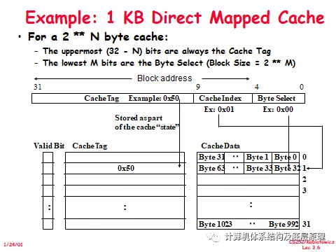

让我们使用一个具有实际数字的特定示例：

假设我们有一个1 KB的直接映射cache，其块大小等于32个字节。

换句话说，与cache tag (标记)相关联的每个块将在其中具有32个字节（行1）。当块大小等于32字节时，地址的5个最低有效位将用作cache块内的字节选择。由于cache大小为1K字节，因此高32位减去10位或22位地址将被存储为cache标记(Tag)中间的其余地址位，即位5到9，将用作cache索引，以选择适当的cache条目

  

啥意思呢,1K cache ，2的10次方，块大小是32 ,2 的5次方，所以最后5位作为字节选择，那么32 个块 32x32-1024 组成了cache,即cache 一共有32 个Cache line. 每个Cache line 有32 个字节。如果我是32 位地址的话，那么我用后10位作为位cache line 索引和cache line 内部的偏移，各有5个bit ,那么地址的前32-N(10)=22 位都是Tag

也就是是说我地址的这个前22位要记录在Cache 里面的，所以一个32 位地址的系统，1K cache， Tag 要使用22 位在可以在cache 中进行查找。  

  

一个完整的的Cahel line 包括数据部分 Cache data, 32byes =256 bits + Cache tag 22 bit =278 bit, 加上一个表示Cache 是否有效的bit 一共279bit, 所以一个完整的cache line 是279 bit.  

硬件要实现一个数据为1K 的cache, 需要额外的23x32 bit 的数据来对Cache 做标记。
  

大家可以算下，如果是2路组相联的时候需要多少位的Tag .
  

**如果总缓存大小保持不变，则增加关联性会增加每组的块数，从而减小index索引的大小并增加标签tag的大小。****也就是说，**随着关联性的增加**,上图中的标签tag索引边界右移****，最后是全连接的cahce 没有索引字段。**
  

最后再顺便补充下组相联的带来的缺点:  

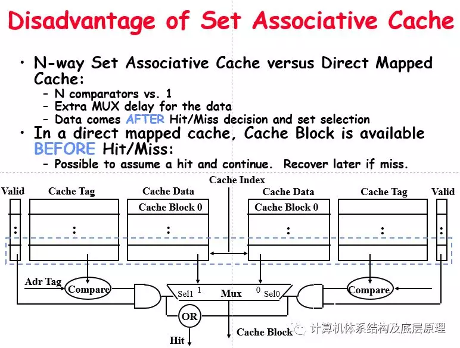
  

首先，N路组关联高速缓存将需要N个比较器而不是仅仅一个比较器（使用图的右侧进行直接映射高速缓存）。由于额外的多路复用器延迟，N路组关联高速缓存也将比直接映射高速缓存慢。最后，对于N路组关联高速缓存，在命中/未命中信号变为有效之后数据将是可用的，因为需要命中/误差来控制数据MUX。对于直接映射的高速缓存，即在右侧或左侧的MUX之前的所有内容，高速缓存块将在命中/未命中信号（AND门输出）之前可用，因为数据不必通过比较器。这可能是一个重要的考虑因素，因为处理器现在可以继续使用数据，而无需知道它是命中还是错过。只是假设它是一个命中。

由于缓存命中率处于90％以上的范围内，因此您将在90％的时间内领先于游戏，并且在10％的时间内您错了，只需确保您可以恢复。

你不能用N路set-associatvie缓存玩这个推测游戏，因为如前所述，在命中/未命中信号有效之前，数据将无法使用。

即便有以上的缺点，如上篇文章所说，现代的CPU还是大都采取的Cache 组相联的设计方式。

## Cache 缓存技术-4

接着讨论剩下两个我们之前提出的问题  

      在讨论之前我们先讨论下多核架构下，Intel 的MESI协议 

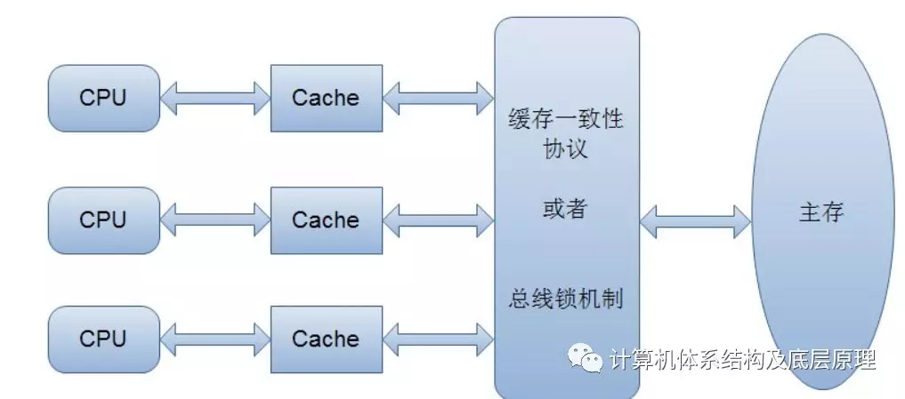

       多核情况如上图就比单核稍复杂，需要考虑每个CPU都有Cache而且可能访问同一个内存的情况。这种情况如何保证CPU 之间的Cache 一致性呢？   

       在早期的CPU当中，是通过在总线上加LOCK#锁的形式来解决缓存不一致的问题。因为CPU和其他部件进行通信都是通过总线来进行的，如果对总线加LOCK#锁的话，也就是说阻塞了其他CPU对其他部件访问（如内存），从而使得只能有一个CPU能使用这个变量的内存。

　　但是上面的方式会有一个问题，由于在锁住总线期间，其他CPU无法访问内存，导致效率低下。

　　所以就出现了缓存一致性协议。最出名的就是Intel 的MESI协议，MESI协议保证了每个缓存中使用的共享变量的副本是一致的。它核心的思想是：当CPU写数据时，如果发现操作的变量是共享变量，即在其他CPU中也存在该变量的副本，会发出信号通知其他CPU将该变量的缓存行置为无效状态，因此当其他CPU需要读取这个变量时，发现自己缓存中缓存该变量的缓存行是无效的，那么它就会从内存重新读取。
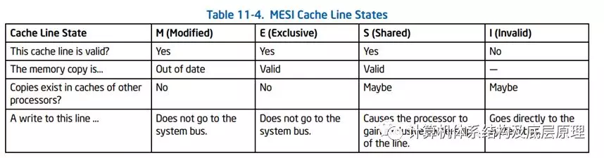
**修改（M）**

高速缓存行仅存在于当前高速缓存中，并且是脏dirty的 - 它已从主存储器中的值修改（M状态）。在允许对（不再有效）主存储器状态的任何其他读取之前，需要高速缓存在将来的某个时间将数据写回主存储器。回写将该行更改为共享状态（S）。

**独家（E）**

高速缓存行仅存在于当前高速缓存中，但是是干净的 \- 它与主存储器匹配。它可以随时更改为共享状态，以响应读取请求。或者，可以在写入时将其改变为修改状态。exclusive

**共享（S）**

表示此高速缓存行可能存储在计算机的其他高速缓存中并且是干净的 \- 它与主存储器匹配。可以随时丢弃该行（更改为无效状态）。share

**无效（I）**

表示此缓存行无效（未使用）invaild
  

**问题3：**** Cache 如果不够用了，那么cache 的替换策略是啥?,或者这么说更准确  缓存缺失应该替换哪个块？**

发生未命中时，高速缓存控制器必须选择要替换的块所需的数据。

我们还是要区别上篇文章中的三种情况，

**直接相连**的情况的好处是硬件决策实际上是简单的，简单到没有选择：只有一个块检查命中，只能替换该块。

**完全相连和组相连**的方式，在未命中时有许多块可供选择。那里

是用于选择要替换的块的三种主要策略：

■随机 \- 为了均匀地分配分配，候选块是随机的

选择。一些系统生成伪随机块编号以获得可重现的行为，这在调试硬件时特别有用。

■最近使用的最少（LRU） - 为了减少丢弃即将需要的信息的机会，记录对块的访问。依靠过去预测未来，被替换的块是未被使用的块最长的时间。LRU依赖于当地的必然结果：如果最近使用的话块可能会被再次使用，那么一个好的处置候选者就是最近最少使用的块。

■先进先出（FIFO） - 因为LRU可能很难计算，这个通过确定最旧的块而不是LRU来近似LRU。

随机替换的优点是在硬件中构建起来很简单。

  

**Q4.    写Cache的时候的策略是什么？**

我们之前所有的都是在讨论读cache 的时候，那么写的时候呢？  

根据缓存设计，写策略通常有几种

有两个基本的写入缓存时的选项：

■**直写 write through**  \- 信息被写入缓存中的块和到较低级别内存中的块。

■**回写 write back** \- 信息仅写入缓存中的块。该修改后的高速缓存块只有在被替换时才会写入主存储器。为了降低替换时写回块的频率，这是一项功能称为脏位是常用的。此状态位指示是否阻止脏（在缓存中修改）或清理（未修改）。如果它是干净的，由于与缓存相同的信息，因此不会在未命中时写回块发现在较低的水平。

回写和直写都有其优点。

**回写**，写入以高速缓冲存储器的速度发生，并且在块内进行多次写入

只需要一次写入较低级别的内存。因为有些写不去内存，回写使用较少的内存带宽，使回写具有吸引力在多处理器中。回写使用内存层次结构的其余部分内存互连不如直写，它还可以节省功耗对嵌入式应用有吸引力

**直写**比回写更容易实现。缓存总是干净的，所以不像回写读取未命中永远不会导致写入较低级别。直写还具有下一个较低级别具有最新电流的优点数据副本，简化了数据一致性。在多处理器和I / O操作中数据一致性非常重要。我们以后再讨论cache 一致性的问题，多级缓存使得高级缓存的直写更加可行，如写入只需要传播到下一个较低级别而不是一直传播到下一个级别主记忆

  

在写miss 的时候，write miss 的时候，还有两种策略

write allocate 写分配 和 read miss 一样，当写缺失的时候，要先在cache 里面分配一个新的cache Line  

write non-allocate 写不分配，就是简单的对下一级的内存进行写，不在创建新的cache line.  

注意 write miss，既可以是发生在wirte though 和wirte back的，这个概念不要搞混。

  
## 神奇的Cache 之旅

        介绍了Cache的一些基本概念以后，有了一些朋友的反馈，有人说你写的太少了，要多些，详细些，有些人说节奏稍许有点快，所谓众口难调，有关Cache 的部分我们就先告一段落，但是在讲其他的Topic 之前，我们先轻松一下看一个例子 ，个人觉得cache 的讨论常常缺乏具体的例子，让读者觉得晦涩，也许是我的脑袋比较慢，但是我觉得有实际的例子更容易理解。 

本文简要介绍了现代英特尔处理器中CPU缓存的组织方式。

这个是一个物理内存总线的宽度为36 bit ,L1  cache 大小为32K , 8 路组相连，cache line 64为 byte 的CPU
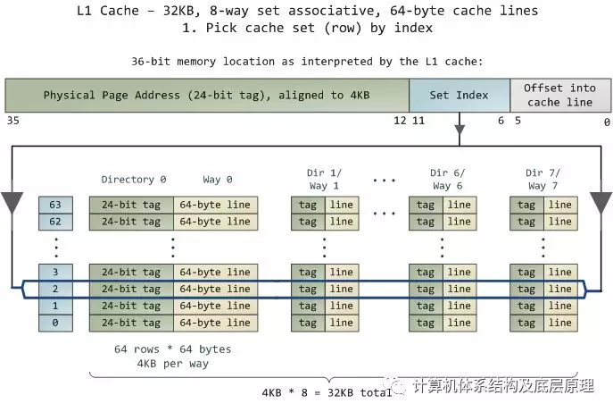

       缓存中的数据单元是行(cache line)，它只是内存中连续的一大块字节。这个CPU的缓存(cache)使用64字节cache line。每个Cache line 都有一个Tag 来标记他对应在内存中的位置。还记得我们之前的例子么,我们64 byte cache line , 是2的6次方，所以地址的后6个bit(0-5) 表示在cache line 中的offset， 所以这个部分不需要作为tag 的部分，36位地址中36-6=30 位用来下标index 和tag, 下标表示cache line 中的索引。

好，如果是直接相连的情况

高速缓存中的组数就等于cache line的个数，就是有 32KB/64=512 个组log2(512)=9 所以要用9 bit 来表示cachel line  的索引，所以cache line offset + cache line 的索引一共式9+6=15bit ，所以tag 需要36-15=21 bit 

这个例子是8路组相连的  

关联度每增加1倍，组数就会减少1/2， 用来作为高速缓存的下标tag的位数就相应的加1,索引位( 组数) 数就减1   

8路组相联，就是所有的cache 分为的 512/8 (8 个 cache line 一组）一共有64个组，所以cahce line 索引(set index)  需要 6bit, 2的6次方位64, 这样就和上图一致了，物理地址最右边最低 6bit 是cache line 里面的offset ，2的6次方可以保证访问到64byte 里面的任何一个，在往右边是组索引(set index), 因为是8路，所以是分了64个组，需要6bit 来表示这些组，所以地址的6到11位是组号，这样tag 的位数就出来了 36-6-6=24 bit tag.  和直接相连的方式tag 增加了3bit, 正好是8(2的3次方) ，所以8路组相联就是tag 相对于直接相连的方式右移3位。 (21+3=24)  

如果是全相连的情况呢，只有一个组，组里有512 cache line. 就没有组号了，tag 就是36-6=30 bit 了.

您可以将每种相连的方式中的tag 想象为电子表格中的列，每种情况下，每组cachel line  是一行。列中的每个单元格都包含一个缓存行，由相应tag 来追踪。在直接相连的情况，每行只有一列，512行，8路组相联每行8列,64行，也就是每组有8个 cache line , 全连接的情况和直接相连正好相反，只有一行，有512 列.

我们举得例子里就是 有64行和8列方式，因此有512个单元来存储缓存行，每个cache line 大小64 byte  所以cache 的大小位512x64byte =32KB 

又来了啊，开始眼睛闭起来，想象在这个cache 的世界中，物理内存分为4KB物理页面。每页有4KB / 64字节 = 64个缓存行。当您查看4KB页面时，该页面中的字节0到63位于第一个缓存行中，第二个缓存行中的字节为64-127，依此类推。每个页面都会重复该模式，因此第0页中的第3行与第1页中的第3行不同。我一直认为眼睛闭起来把这些图片和他们中的内部关系如果能想清楚是很舒服的，**这个是不是我在印度出差回来学习的一种印度人的那种****冥想meditation 有关呢？^-^ ,闭上眼睛，随着物理地址的增长，你看到了什么，一行行的cache, 每4K会换到同一组，另一列，在一行行的组成4K ,多么优美的设计.**

在完全相连的高速缓存中，存储器中的任何行都可以存储在任何高速缓存单元中。这使存储变得灵活，但在访问单元时搜索单元会变得昂贵。由于L1和L2高速缓存在功耗，物理空间和速度的严格限制下运行，因此在大多数情况下，完全关联高速缓存不是一个很好的折衷。

所以大多的缓存是组相连的，这意味着内存中的地址只能存储在上面显示的一个特定行中,可以放在这个行中的任何一列都可以。因此，_任何物理页面_的第一行（_页面中的_字节0-63）必须存储在行0中，第二行存储在行1中，等等。每行有8个单元可用于存储与其关联的缓存行，这是一个8路组相连。当查看存储器地址时，位11-6确定4KB页面内的行号，由他来决定使用来的set 组号, 因此确定要使用的组号。例如，物理地址0x800010a0 在11-6位中是000010，是2, 就是第二行 因此它必定存储在第2组中。

接下来就是在这行里面那个单元格,或者那个列保存那个数据的问题,这就需要tag 来查找了。每个缓存行都由其对应的tag_标记_ ; tag只是该行所在页面的编号。因为处理器可以处理36bit(36bit 物理地址) 64GB的物理RAM，因此这些页面有64GB / 4KB == 2^24，因此我们的标签需要24位。我们的示例物理地址**0x800010a0**对应于页码524,289。

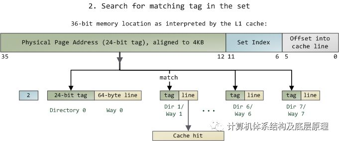
  

由于我们只需要查看一组8 cache line ，因此标签匹配非常快; 事实上，硬件的比较器 ,是把所有tag都是同时进行比较，在这里用箭头显示。如果有一个标记tag 是和该地址拼配的0x800010a0 ,，那么我们会有一个缓存命中(cache hit) 。否则，请求将被转发到L2缓存

        英特尔通过逐级放大方式的大小和数量来构建大型L2缓存，但设计是相同的。例如，您可以通过添加8路相连变为16路组相联将其转换为64KB缓存。然后将组数增加到4096，每路可以存储256KB。这两个修改将提供4MB L2缓存。在这种情况下，标签需要18位，设置索引需要12位; 缓存使用的物理页面大小等于每个组大小。

如果其中一组(set) ,就是上图中的行已经填满，则必须先删除该组一个缓存行，然后才能存储另一个缓存行。为避免这种情况，性能敏感的程序尝试组织其数据，以便内存访问在缓存行之间均匀分布。例如，假设程序具有512字节对象的数组，使得某些对象在内存中相隔4KB。这些对象中的字段属于同一行，并竞争相同的缓存集。如果程序经常访问给定字段（_例如_，vtable）通过调用虚方法），该组可能会填满，并且缓存就会带来性能下降，因为同一cache line 被重复驱逐evict 并随后重新加载。这叫做cache 的颠簸效应 . 由于8路组相联是固定的，我们的示例L1缓存只能容纳其中8个对象的vtable。这是组相联的成本：即使整体缓存使用量不大，我们也可能因设置冲突而导致缓存未命中。但是，由于现代计算机的相对速度，大多数应用程序无论如何都不需要担心。如果你是做优化的,就需要更深入的了解计算机的底层设计来对代码进行优化,尽可能的减少cache miss.

       内存访问通常以线性（虚拟）地址开始，因此L1缓存依赖于分页单元来获取用于缓存标记的物理页面地址。相比之下，设置索引set 可以来自线性地址的最低有效位，可以在没有转换的情况下使用（在我们的示例中为位11-6）。这个也是为了效率,我不需要等到MMU 出来完全的物理地址就可以做cache 的查找了.   因此，L1高速缓存被物理标记但虚拟索引(physically tagged but virtually indexed, )，帮助CPU并行查找操作。因为L1 的组数永远不会比MMU页面大，所以即使使用虚拟索引，也可以保证给定的物理内存位置与同一组相关联。另一方面，L2缓存必须进行物理标记和物理索引，因为它们的组数大小可能大于MMU页面。但话说再说一次，当请求到达L2缓存时，物理地址已经出来了，所以问题不大. 

        最后，tag 的部分还存储其对应的高速缓存行的_状态_。这个上篇文章有讲过 ,  L1代码缓存(代码缓存不可以改动,CPU中的缓存分为数据缓存和代码缓存)中的一行是无效的或共享的（这意味着有效）。在L1数据高速缓存和L2高速缓存中，线路可以处于4种MESI状态中的任何一种状态：已修改，独占，共享或无效。英特尔的CPU 高速缓存大多具有包容性inclusive：L1高速缓存的内容在总是在L2高速缓存中,(记住这个不是一定的,比如在有些server 的CPU 上L2 to L3 cache 可能是non-inclusive的,要看CPU 的SPEC)这些状态将在后来关于线程，锁定和那种东西的中发挥作用。我们以后将看看前端总线以及内存访问_是_如何工作的。就到这里吧,休息,休息一下. 欢迎问题和批评指正.

