<!--toc-->
[TOC]
# 编译器是如何工作的
[哈弗大学demo](https://cs50.harvard.edu/x/2020/notes/2/#compiling)
## Compiler 编译器
编译器是一种计算机程序，负责把一种编程语言编写的源码转换成另外一种计算机代码，后者往往是以二进制的形式被称为目标代码(object code)。这个转换的过程通常的目的是生成可执行的程序。

编译器的产出是「另外一种代码」，然后这些代码等着被别人拿来执行，如果还不能直接被执行，那么还需要再编译或解释一遍，再交由计算机硬件执行。
编译器，往往是在「执行」之前完成，产出是一种可执行或需要再编译或者解释的「代码」。


[原文](https://www.programcreek.com/2011/02/how-compiler-works/)

最基本的，一个编译器由以下几个阶段组成：词法分析、语法分析、语义分析、IR（中间代码，intermediate Representation）产生、IR优化、代码产生、最终优化。

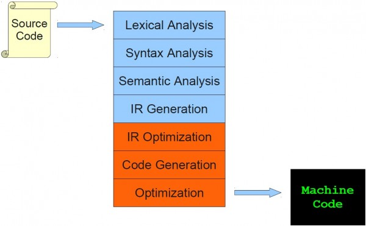

给个简单的例子:
```
while (y < z) {
    int x = a + b;
    y +=x;
}
```

下面显示了每个阶段的输出。

### 1. 词法分析 Lexical Analysis
将程序转换为令牌序列。
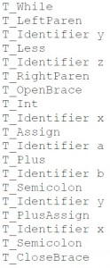

### 2. 语法分析 Syntax Analysis
使用之前的扫描仪中的一系列令牌恢复描述的结构。
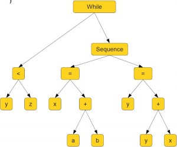

### 3. 语义分析 Semantic Analysis
确保程序具有明确定义的含义。
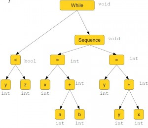

### 4. IR Generation  生成
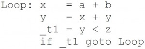

### 5. IR Optimization 优化

### 6. Code Generation 目标代码生成
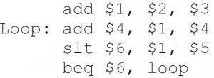
### 7. Optimization 最终优化
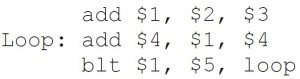


编译器是如何工作的<《编译原理》（Compilers—Principles, Techniques and Tools）中的图>
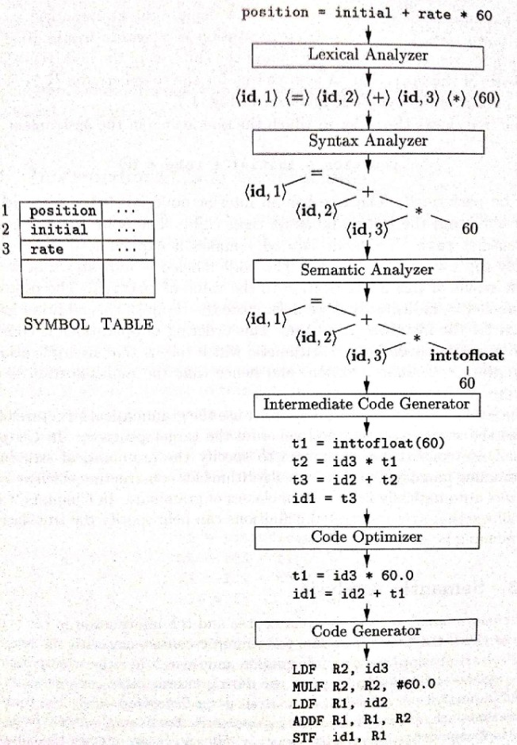


在生成汇编代码之后，这些汇编代码会被写入到一个新的汇编文件中 (.s 或 .asm)。然后该文件会被传递给汇编器，汇编器是汇编语言的编译器，它会生成相应的二进制代码。之后这些二进制代码会被写入到一个新的目标文件中 (.o) 。

目标文件是机器码，但是它们并不可以被执行。 为了让它们变成可执行文件，目标文件需要被链接到一起。链接器读取通用的机器码，然后使它变为一个可执行文件、共享库或是 静态库。

链接器是因操作系统而不同的应用程序。随便一个第三方的链接器都应该可以编译你后端产生的目标代码。因此在写编译器的时候不需要创建你自己的链接器。
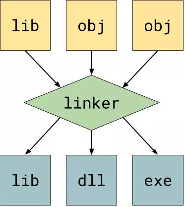

编译器可能有 中间表示,或者简称 IR 。IR 主要是为了在优化或者翻译成另一门语言的时候，无损地表示原来的指令。 IR 不再是原来的代码；IR 是为了寻找代码中潜在的优化而进行的无损简化。循环展开 和 向量化 都是利用 IR 完成的。

## Linker 链接器
一个大的程序往往会分为多个源程序文件来编写，因而需要对多个源程序分别进行编译或汇编，来生成多个不同的目标文件(.o文件)，这些目标文件包含指令、数据、和其他说明信息。

为了生成一个可执行文件，需要按照一定的格式将多个目标文件融合在一起。而这就是链接器最基本的作用。

链接器可操作的最小元素是一个简单的目标文件，通常我们写的.c源文件编译后就生成了对应的目标文件，我们写的实现文件比如list.c编译后就生成了对应的目标文件list.o(Windows下为list.obj)，这个list.o就是链接器可以操作的最小元素。我们见到的所有应用程序，小到自己实现的hello world程序，大到复杂的比如浏览器，网络服务器等，都是链接器将一个个所需要用到的目标文件汇集起来最终形成了非常复杂的应用程序(Windows下是我们常见的EXE文件，Linux下为ELF文件)。

**链接的过程，主要包括了地址和空间分配，负号决议，重定位等步骤。**

链接器的工作分3个步骤：
1. 将代码和数据模块象征性地放入内存。
2. 决定数据和指令标签的地址。
3. 修补内部和外部引用。

链接器的工作过程：
- 首先，链接器对给定的目标文件或库的集合进行符号决议以确保模块间的依赖是正确的。
- 其次，链接器将给定的目标文件集合进行拼接打包成需要的库或最终可执行文件。
- 最后，链接器对链接好的库或可执行文件进行重定位。

### 符号决议
编译器的任务就是把人类可以理解的代码转换成机器可以执行的机器指令，源文件编译后形成对应的目标文件，这个我们在之前的章节中已经多次提到过了。源文件被编译后生成的目标文件中本质上只有两部分：

**代码部分**：你可能会想，一个源文件中不都是代码吗，这里的代码指的是计算机可以执行的机器指令，也就是源文件中定义的所有函数。比如上图中定义的函数fn_b以及fn_c。
**数据部分**：源文件中定义的全局变量。如果是已经初始化后的全局变量，该全局变量的值也存在于数据部分。

编译器在遇到外部定义的全局变量或者函数时只要能在当前文件找到其声明，编译器就认为编译正确。而寻找使用变量定义的这项任务就被留给了链接器。链接器的其中一项任务就是要确定所使用的变量要有其唯一的定义。虽然编译器给链接器留了一项任务，但为了让链接器工作的轻松一点编译器还是多做了一点工作的，这部分工作就是符号表(Symbol table)。
最终编译器会统计出如下所示的一张符号表：
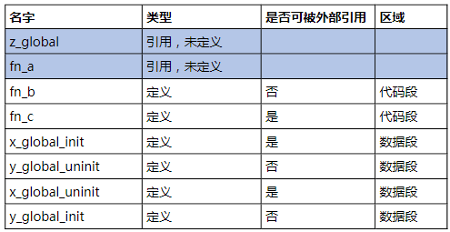

z_global以及fn_a是未定义的，因为在当前文件中，这两个变量仅仅是声明，编译器并没有找到其定义。剩余的变量编译器都可以在当前文件中找到其定义。

fn_b以及fn_c为当前文件定义的函数，因为在代码段。

剩余的符号都是全局变量，因此放在了数据段。


有了符号表，链接器就可以进行符号决议了。

#### 符号决议的过程
我们知道符号表给链接器提供了两种信息，一个是当前目标文件可以提供给其它目标文件使用的符号，另一个其它目标文件需要提供给当前目标文件使用的符号。有了这些信息链接器就可以进行符号决议了。如图所示，假设链接器需要链接三个目标文件：
链接器会依次扫描每一个给定的目标文件，同时链接器还维护了两个集合，一个是已定义符号集合D，另一个是未定义符合集合U，下面是链接器进行符合决议的过程：
1. 对于当前目标文件，查找其符号表，并将已定义的符号并添加到已定义符号集合D中。
2. 对于当前目标文件，查找其符号表，将每一个当前目标文件引用的符号与已定义符号集合D进行对比，如果该符号不在集合D中则将其添加到未定义符合集合U中。
3. 当所有文件都扫描完成后，如果为定义符号集合U不为空，则说明当前输入的目标文件集合中有未定义错误，链接器报错，整个编译过程终止。
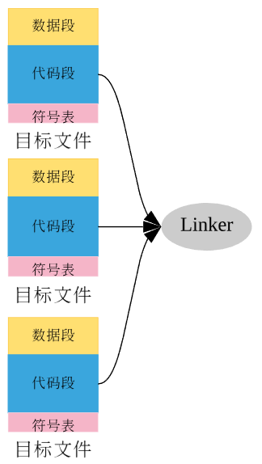

#### 实例说明undefined reference
假设我们写了一个math.c的数字计算程序，其中定义了一个add函数，该函数在main.c中被引用到，那么很简单，我们只需要在main.c中include写好的math.h头文件就可以使用add函数了，如图所示：
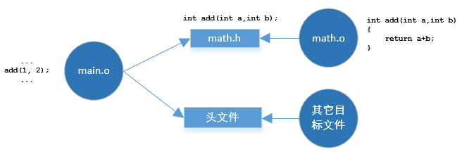

但是由于粗心大意，一不小心把math.c中的add函数给注释掉了，当你在写完main.c、打算很潇洒的编译一下时，出现了很经典的undefined reference to add(int, int)错误，如图所示：

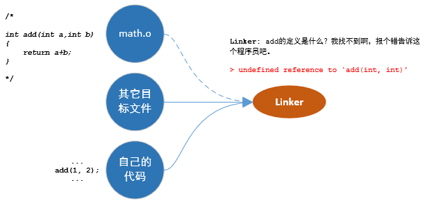

这个错误其实是这样产生的：
1. 链接器发现了你写的代码math.o中引用了外部定义的add函数(不要忘了，这是通过检查目标文件math.o中的符号表得到的信息)，所以链接器开始查找add函数到底是在哪里定义的。
2. 链接器转而去目标文件math.o的目标文件符号表中查找，没有找到add函数的定义。
3. 链接器转而去其它目标文件符号表中查找，同样没有找到add函数的定义。
4. 链接器在查找了所有目标文件的符号表后都没有找到add函数，因此链接器停止工作并报出错误undefined reference to `add(int, int)'，如上图所示。

因此如果你很清楚链接器符号决议这个过程的话就会进行如下排查：
1. main.c中对add函数的函数名有没有写正确。
2. 链接命令中有没有包含math.o，如果没有添加上该目标文件。
3. 如果链接命令没有问题，查看math.c中定义的add函数定义是否有问题。
4. 如果是C和C++混合编程时，确保相应的位置添加了extern "C"。

一般情况下经过这几个步骤的排查基本能够解决问题。
所以当你再次看到undefined reference这样的错误的是时候，你就应该可以很从容的去解决这类问题了。


### 库、可执行文件的生成
给定目标文件以及链接选项，链接器可以生成两种库，分别是静态库以及动态库
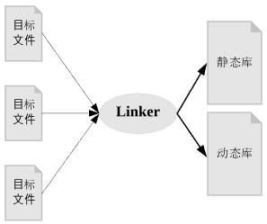

可执行文件和目标文件没有什么本质的不同，可执行文件区别于目标文件的地方在于，可执行文件有一个入口函数，这个函数也就是我们在C语言当中定义的main函数，main函数在执行过程中会用到所有可执行文件当中的代码和数据。而这个main函数是被谁调用执行的呢，答案就是操作系统(Operating System).

#### 静态库
静态库在Windows下是以.lib为后缀的文件，Linux下是以.a为后缀的文件。

静态库在程序的链接阶段被复制到了程序中，和程序运行的时候没有关系；
静态库特点是可执行文件中包含了库代码的一份完整拷贝；缺点就是被多次使用就会有多份冗余拷贝。

##### 静态连接
静态库是链接器通过静态链接将其和其它目标文件合并生成可执行文件的，如下图一所示，而静态库只不过是将多个目标文件进行了打包，在链接时只取静态库中所用到的目标文件。
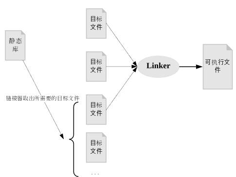
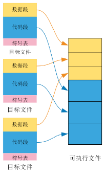
从上图中我们可以看到可执行文件的特点：

- 可执行文件和目标文件一样，也是由代码段和数据段组成。
- 每个目标文件中的数据段都合并到了可执行文件的数据段，每个目标文件当中的代码段都合并到了可执行文件的代码段。
- 目标文件当中的符号表并没有合并到可执行文件当中，因为可执行文件不需要这些字段。


静态链接是使用库的最简单最直观的形式， 从静态链接生成可执行文件的过程中可以看到，静态链接会将用到的目标文件直接合并到可执行文件当中，想象一下，如果有这样的一种静态库，几乎所有的程序都要使用到，也就是说，生成的所有可执行文件当中都有一份一模一样的代码和数据，这将是对硬盘和内存的极大浪费，假设一个静态库为2M，那么500个可执行文件就有1G的数据是重复的。如何解决这个问题呢，答案就是使用动态库。


#### 动态库
动态库(Dynamic Library)，又叫共享库(Shared Library)，动态链接库等，在Windows下就是我们常见的大名鼎鼎的DLL文件了，Windows系统下大量使用了动态库。在Linux下动态库是以.so为后缀的文件，同时以lib为前缀，比如进行数字计算的动态库Math，编译链接后产生的动态库就叫做`libMath.so`。

动态库在链接阶段没有被复制到程序中，而是程序在运行时由系统动态加载到内存中供程序调用；
使用动态库的优点是系统只需载入一次动态库，不同的程序可以得到内存中相同的动态库的副本，因此节省了很多内存。

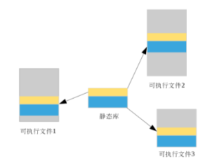
动态库允许使用该库的可执行文件仅仅包含对动态库的引用而无需将该库拷贝到可执行文件当中。也就是说，同静态库进行整体拷贝的方式不同，对于动态库的使用仅仅需要可执行文件当中包含必要的信息即可，为了方便理解，你可以将可执行文件当中保存的必要信息仅仅理解为需要记录动态库的名字就可以了，如图所示，同静态库相比，动态库的使用减少了可执行文件的大小。
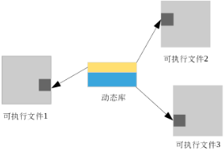

**printf函数到底是在哪里定义的，答案就是该函数是在libc.so当中定义的，Linux下编译链接生成可执行文件时会默认动态链接libc.so(Windows下也是同样的道理)，使用ldd命令就会发现每个可执行文件都依赖libc.so。因此虽然你从没有看到过printf的定义也可以正确的使用这个函数。**


##### 动态链接

***静态库其实是在编译期间(Compile time)链接使用的，那么动态库又是在什么时候才链接使用的呢，动态链接可以在两种情况下被链接使用，分别是load-time dynamic linking(加载时动态链接) 以及 run-time dynamic linking(运行时动态链接)***

###### load-time dynamic linking(加载时动态链接)
我们只需要简单的把加载理解为程序从磁盘复制到内存的过程，加载时动态链接就出现在这个过程。

当把可执行文件复制到内存后，且在程序开始运行之前，操作系统会查找可执行文件依赖的动态库信息(主要是动态库的名字以及存放路径)，找到该动态库后就将该动态库从磁盘搬到内存，并进行符号决议，如果这个过程没有问题，那么一切准备工作就绪，程序就可以开始执行了，如果找不到相应的动态库或者符号决议失败，那么会有相应的错误信息报告为用户，程序运行失败。

加载时动态链接可以分为两个阶段：

- 阶段一，将动态库信息写入可执行文件

在编译链接生成可执行文件时，需要将使用的动态库加入到链接选项当中，比如在Linux下引用libMath.so，就需要将libMath.so加入到链接选项当中（比如libMath.so放到了/usr/lib下，那么使用命令 gcc ... -lMath -L/user/lib ... 进行编译链接），所以使用这种方式生成的可执行文件中保存了依赖的动态库信息，在Linux可使用一个简单的命令ldd来查看。

- 阶段二：加载可执行文件时依据动态库信息进行动态链接
由于在阶段一生成的可执行文件中保存了动态库信息，当可执行文件加载完成后，就可以依据此信息进行中动态库的查找以及符号决议了。

通过这个过程也可以清楚的看到静态库和动态库的区别，使用动态库的可执行文件当中仅仅保留相应信息，动态库的链接过程被推迟到了程序启动加载时。


###### run-time dynamic linking(运行时动态链接)
运行时动态链接则不需要在编译链接时提供动态库信息

在可执行文件被启动运行之前，可执行文件对所依赖的动态库信息一无所知，只有当程序运行到需要调用动态库所提供的代码时才会启动动态链接过程。


我们可以使用特定的API来运行时加载动态库，在Windows下通过LoadLibrary或者LoadLibraryEx，在Linux下通过使用dlopen、dlsym、dlclose这样一组函数在运行时链接动态库

相对于加载时动态链接，运行时动态链接更加灵活，同时将动态链接过程推迟到运行时可以加快程序的启动速度。


可执行文件当中会新增两段，即dynamic段以及GOT（Global offset table）段，这两段内容就是是我们之前所说的必要信息。

dynamic段中保存了可执行文件依赖哪些动态库，动态链接符号表的位置以及重定位表的位置等信息

### 重定位
链接器必须对这些可重定位目标文件完成两个主要任务：

- 符号解析。将每个符号引用刚好和一个符号定义联系起来。
- 重定位。链接器把每个符号定义与一个虚拟地址联系起来，然后修改所有对这些符号的引用，使得它们指向这个存储位置，从而重定位这些节。

符号分为四类： 导出符号（export，本地符号）， 导入符号（import，外部符号）， 静态符号（本地符号）， 局部符号（本地符号，不出现在符号表中）。

导出符号， 在本模块定义， 能够被其他模块引用的符号。 非static全局函数， 非static全局变量。
导入符号， 在其他模块定义，被本模块引用的符号。 extern 修饰的全局非static变量声明（extern int a）， 其他模块的函数引用
静态符号， 在本模块定义， 只能被本模块引用的符号。 static函数， static全局变量。
局部符号， 在函数内部定义的非static变量。不出现在符号表，由栈管理。链接器不care这类符号

外部符号（导入符号）： 本模块未定义却被本模块引用的符号。

汇编器生成可重定位目标文件后， 内部符号都已被正确地符号解析， 外部符号可能会引用了非本模块的符号定义，汇编器无法找到符号定义， 因此无法解析。 汇编器把外部符号放入”符号表“.symtab，同时把如何解析该符号的方法放入”重定位表“。

链接器符号解析：
使用的表： 符号表
强符号，若符号： 函数和初始化的全局变量叫强符号， 未初始化的全局变量叫弱符号。（extern int a是一个弱符号定义， int a 也是弱符号）

符号解析规则：
1， （定义多个强符号） 当引用符号时，该符号的符号定义有不止一个强符号定义时，会出现符号重定义错误。
2， （定义一个强符号和一个或者多个软符号）当引用符号时， 该符号的符号定义有个强符号定义和一个和多个弱符号定义， 使用强符号定义。
3， （定义多个弱符号）当引用符号时， 该符号的符号定义都是弱符号时， 选择任意一个定义。

链接器符号重定位：
使用的表： 重定位表，符号表

重定位表记录要修改的符号引用的位置，以及如何修改。

一旦链接器完成了符号解析这一步，它就把代码中的每个符号引用和确定的一个符号定义联系起来。此时，链接器就知道了每个模块（文件）代码节和数据节的大小，就可以开始重定位了。

重定位由三步组成：

1. 合并可重定位目标文件中相同的节，
2. 重定位节和符号定义，修改符号表。为节和符号定义分配虚拟地址。修改符号表中符号定义的值为刚分配的虚拟地址。
3. 重定位节中的符号引用，修改代码段和数据段符号引用。使用重定位表.rel.text .rel.data， 修改text，data中符号引用的地址

简述为， 合并节， 重定位符号定义（修改符号表），重定位符号引用(修改数据段代码段）

汇编器遇到对存储位置未知（在可重定位目标文件中，汇编器都不知道数据和代码会存放在存储器的什么位置）的符号引用时，它也会将这些符号的信息存于.rel.text和.rel.data表中。告诉链接器将可重定位目标文件合并成可执行目标文件时如何修改符号引用。


生成目标文件后，编译器完成任务，编译器确定了定义在该源文件中函数以及全局变量的相对地址。对于编译器不能确定的引用类变量，编译器在目标文件的.rel.text以及.rel.data段中生成相应的记录告诉链接器要修正这些变量的地址。

接下来就是链接器的工作了。

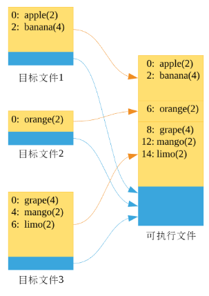
链接器在链接三个目标文件时其顺序是依次链接的，链接完成后：

- 目标文件一：该数据段的起始地址为0，因此该数据段中的变量的最终地址不变。
- 目标文件二：由于目标文件一的数据段长度为6，因此链接完成后该数据段的起始地址为6(这里的起始地址其实就是偏移offset)，相应的orange的最终内存地址为0+offset即6。
- 目标文件三：由于前两个数据段的长度为8，因此该数据段的起始地址为8(即offset为8)，因此所有该数据段中的变量其地址都要加上该offset，即grape的最终地址为8，即0+offset，mango的最终地址为4+offset即12，limo的最终地址为6+offset即14。

从这个过程中可以看到，数据段中的相对地址是通过这个公式来修正的，即：

> 相对地址 + offset(偏移) = 最终内存地址

而每个段的偏移只有在链接完成后才能确定，因此对相对地址的修正只能由链接器来完成，编译器无法完成这项任务。

当所有目标文件的同类型段合并完毕后，数据段和代码段中的相对地址都被链接器修正为最终的内存位置，这样所有的变量以及函数都确定了其各自位置。

至此，重定位的第一阶段完成。接下来是重定位的第二阶段，即引用符号的重定位。

相对地址是编译器在编译过程中确定了，在链接器完成后被链接器修正为最终地址，而对于编译器没有确定的所引用的外部函数以及变量的地址，编译器将其记录在了.rel.text和.rel.data中。

由于在第一阶段中，所有函数以及数据都有了最终地址，因此重定位的第二阶段就相对简单了。我们知道编译器引用外部变量时将机器指令中的引用地址设置为空(比如call 0x000000)，并将该信息记录在了目标文件的.rel.text以及.rel.data段中。因此在这个阶段链接器依次扫描所有的.rel.text以及.rel.data段并找到相应变量的最终地址(这些位置都已在第一阶段确定)，并将机器指令中的0x000000修正为所引用变量的最终地址就可以了。
#### 问题：为什么链接器能确定运行时地址

我们知道只有把可执行文件加载到内存当中程序才可以开始运行。不同的程序会被加载到内存的不同位置。我们从前两节的过程中可以看出，链接器完全没有考虑不同的程序会被加载不同的内存位置被执行。比如对于一个可执行文件我们分别运行两次，如下图所示，因为两个程序数据段变量的地址是一样的，那么程序一的数据会不会被程序二修改呢？
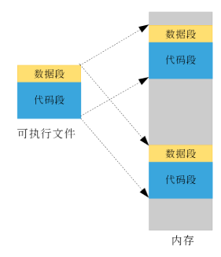


答案虚拟内存.
**实际上，每个进程只存活在自己的虚拟世界里，却感觉自己独占了所有的系统资源（内存）。**
一个典型的内存排布结构如下图所示：
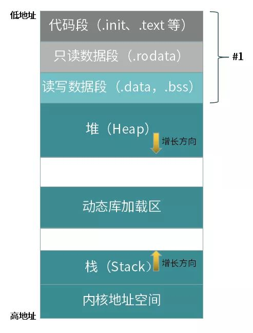
是按照 ELF 文件中的程序头信息，加载文件内容所得到的。除此之外，加载器还会为每个应用分配栈区（Stack）、堆区（Heap）和动态链接库加载区。栈和堆分别向相对的方向增长，系统会有相应的保护措施，阻止越界行为发生。

在 Linux 系统中，使用如下命令可查看一个运行中的进程的内存排布。
```
cat /prox/PID/maps
```

Linux的可执行文件格式elf与进程内存布局的区别：


栈空间, 栈内存往低地址扩展，栈顶和栈最大容量固定，2M(1M?，编译选项)
堆空间， 链表形式，有效的虚拟内存, 最大3G
全局区+static
    const                       .rodata段 （不可改动）
    未初始化的全局变量： .bss段    （可以改动）------------未初始化的全局变量不占据可执行文件的空间, `char buf[1024]`, 可执行文件大小为1k ,
    初始化的全局变量：   .data段   （可以改动）--------------初始化的全局变量占据可执行文件空间, `int buf[1024]={1}`, 可执行文件大小为1K+4M

文字常量区
二进制代码区

共享内存映射在memory mapping处，大小有限制。栈从高道低分配，堆从低到高分配
```
//main.cpp 
int a = 0; 全局初始化区 
char *p1; 全局未初始化区 
main() 
{ 
int b; 栈 
char s[] = "abc"; 栈 
char *p2; 栈 
char *p3 = "123456"; 123456\0在常量区，p3在栈上。 
static int c =0； 全局（静态）初始化区 
p1 = (char *)malloc(10); 
p2 = (char *)malloc(20); 
分配得来得10和20字节的区域就在堆区。 
strcpy(p1, "123456"); 123456\0放在常量区，编译器可能会将它与p3所指向的"123456"优化成一个地方。 
}
```

## Interpreter 解释器
在计算机科学中，解释器是一种计算机程序，它直接执行由编程语言或脚本语言编写的代码，并不会把源代码预编译成机器码。一个解释器，通常会用以下的姿势来执行程序代码：

分析源代码，并且直接执行。
把源代码翻译成相对更加高效率的中间码，然后立即执行它。
执行由解释器内部的编译器预编译后保存的代码
可以把解释器看成一个黑盒子，我们输入源码，它就会实时返回结果。
不同类型的解释器，黑盒子里面的构造不一样，有些还会集成编译器，缓存编译结果，用来提高执行效率（例如 Chrome V8 也是这么做的）。
解释器通常是工作在「运行时」，并且对于我们输入的源码，是一行一行的解释然后执行，然后返回结果。

> 解释器会读取源代码，并且直接生成指令让计算机硬件执行，不会输出另外一种代码。

## 低级语言代码 Low-Level Code
### 汇编语言 Assembly Language

汇编语言作为一门低级语言，对应于计算机或者其他可编程的硬件。
它和计算机的体系结构以及机器指令是强关联的。
换句话说，就是不同的汇编语言代码对应特定的硬件，所以不用谈可移植性了。
相对于需要编译和解释的高级语言代码来说，汇编代码只需要翻译成机器码就可以执行了。
所以汇编语言也往往被称作象征性机器码(symbolic machine code)

### 字节码 Byte Code

字节码严格来说不算是编程语言，而是高级编程语言为了种种需求（可移植性、可传输性、预编译等）而产生的中间码（Intermediate Code）。
它是由一堆指令集组成的代码，例如在javac编译过后的java源码产生的就是字节码。
源码在编译的过程中，是需要进行「词法分析 → 语法分析 → 生成目标代码」等过程的，在预编译的过程中，就完成这部分工作，生成字节码。
然后在后面交由解释器（这里通常指编程语言的虚拟机）解释执行，省去前面预编译的开销。

### 机器码 Machine Code

机器码是一组可以直接被CPU执行的指令集，
每一条指令都代表一个特定的任务，或者是加载，或者是跳转，亦或是计算操作等等。
所有可以直接被CPU执行的程序，都是由这么一系列的指令组成的。
机器码可是看作是编译过程中，最低级的代码，因外再往下就是交由硬件来执行了。
当然机器码也是可以被编辑的，但是以人类难以看懂的姿势存在，可读性非常差。


从左往右看，

以 Java 为例，我们在文本编译器写好了 Java 代码，交由「编译器」编译成 Java Bytecode。然后 Bytecode 交由 JVM 来执行，这时候 JVM 充当了「解释器」的角色，在解释 Bytecode 成 Machine Code 的同时执行它，返回结果。
以 BASIC 语言（早期的可以由计算机直译的语言） 为例，通过文本编译器编写好，不用经历「编译」的过程，就可以直接交由操作系统内部来进行「解释」然后执行。
以 C 语言为例，我们在文本编译器编写好源代码，然后运行 gcc hello.c 编译出 hello.out 文件，该文件由一系列的机器指令组成的机器码，可以直接交由硬件来执行。
