<!--toc-->
[TOC]
# 中央处理器（CPU，central processing unit）
CPU是计算机系统的运算和控制核心，是信息处理、程序运行的最终执行单元。


## CPU的内部结构解析
CPU和内存是由许多晶体管组成的电子部件，通常称为IC（Integrated Circuit，集成电路）。从功能方面来看，CPU的内部由寄存器，控制器，运算器和时钟四部分构成，各部分之间由电流信号相互连通。

- 寄存器：可用来暂存指令，数据等处理对象，可以将其看做是内存的一种。根据种类的不同，一个CPU内部会有20~100个寄存器。

- 控制器：负责把内存上的指令，数据等读入寄存器，并根据指令的执行结果来控制整个计算机。

- 运算器：负责运算从内存读入寄存器的数据。

- 时钟：负责发出CPU开始计时的时钟信号。不过，也有些计算机的时钟位于CPU的外部。


## CPU具有的功能
- 指令控制：由于程序是一个指令序列，这些指令的相互顺序不能任意颠倒，必须严格按程序规定的顺序进行。

- 操作控制： CPU管理并产生由内存取出的每条指令的操作信号，把各种操作信号送往相应部件，从而控制这些部件按指令的要求进行动作。

- 时间控制：对各种操作实施时间上的定时。

- 数据加工：对数据进行算术运算和逻辑运算处理。


## 核心部分

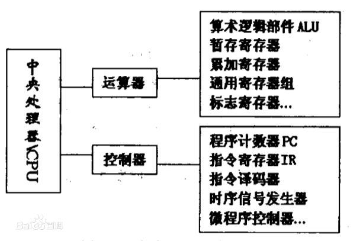
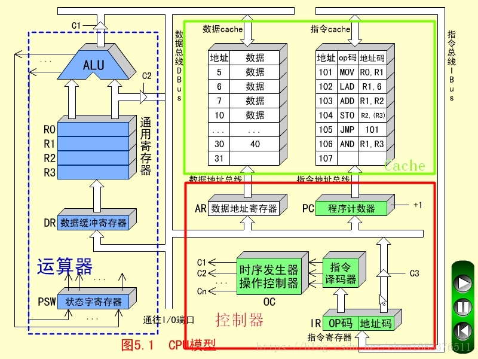


### 运算器
运算器是指计算机中进行各种算术和逻辑运算操作的部件， 其中算术逻辑单元是中央处理核心的部分。 

1. 算术逻辑单元（ALU）。算术逻辑单元是指能实现多组 算术运算与逻辑运算的组合逻辑电路，其是中央处理中的重要组成部分。算术逻辑单元的运算主要是进行二位元算术运算，如加法、减法、乘法。在运算过程中，算术逻辑单元主要是以计算机指令集中执行算术与逻辑操作，通常来说，ALU能够发挥直接读入读出的作用，具体体现在处理器控制器、内存及输入输出设备等方面，输入输出是建立在总线的基础上实施。输入指令包含一 个指令字，其中包括操作码、格式码等。

2. 中间寄存器（IR）。其长度为 128 位，其通过操作数来决定实际长度。IR 在“进栈并取数”指令中发挥重要作用，在执行该指令过程中，将ACC的内容发送于IR，之后将操作数取到ACC，后将IR内容进栈。

3. 运算累加器（ACC）。当前的寄存器一般都是单累加器，其长度为128位。对于ACC来说，可以将它看成可变长的累加器。在叙述指令过程中，ACC长度的表示一般都是将ACS的值作为依据，而ACS长度与 ACC 长度有着直接联系，ACS长度的加倍或减半也可以看作ACC长度加倍或减半。 

4. 描述字寄存器（DR）。其主要应用于存放与修改描述字中。DR的长度为64位，为了简化数据结构处理，使用描述字发挥重要作用。 

5. B寄存器。其在指令的修改中发挥重要作用，B 寄存器长度为32位，在修改地址过程中能保存地址修改量，主存地址只能用描述字进行修改。指向数组中的第一个元素就是描述字， 因此，访问数组中的其它元素应当需要用修改量。对于数组成来说，其是由大小一样的数据或者大小相同的元素组成的，且连续存储，常见的访问方式为向量描述字，因为向量描述字中的地址为字节地址，所以，在进行换算过程中，首先应当进行基本地址 的相加。对于换算工作来说，主要是由硬件自动实现，在这个过程中尤其要注意对齐，以免越出数组界限。

运算器：算术逻辑单元（ALU）、通用寄存器、数据缓冲寄存器DR和状态条件寄存器PSW组成。

运算器的功能：

1. 执行所有的算术运算。

2. 执行所有的逻辑运算，并进行逻辑测试，如零值测试或两个值的比较。

通常，一个算术操作产生一个运算结果，而一个逻辑操作则产生一个判决。


### 控制器
控制器是指按照预定顺序改变主电路或控制电路的接线和 改变电路中电阻值来控制电动机的启动、调速、制动与反向的主令装置。控制器由程序状态寄存器PSR，系统状态寄存器SSR， 程序计数器PC，指令均存器等组成，其作为“决策机构”，主要任务就是发布命令，发挥着整个计算机系统操作的协调与指挥作用。 控制的分类主要包括两种，分别为组合逻辑控制器、微程序控制器，两个部分都有各自的优点与不足。其中组合逻辑控制器结构相对较复杂，但优点是速度较快；微程序控制器设计的结构简单，但在修改一条机器指令功能中，需对微程序的全部重编。

**控制器：程序计数器、指令寄存器、指令译码器、时序产生器和操作控制器组成。**
控制器的功能：

1. 从指令cache中取出一条指令，并指出下一条指令在指令cache中的位置。

2. 对指令进行译码或测试，并产生相应的操作控制信号，以便启动规定的动作。比如一次数据cache的读/写操作，一个算术逻辑运算操作，或一个输入/输出操作。

3. 指挥并控制CPU、数据cache和输入/输出设备之间数据流动的方向。


## CPU是寄存器的集合体
程序是把寄存器作为对象来描述的

使用高级语言编写的程序会在编译后转化成机器语言，然后通过CPU内部的寄存器来处理。不同类型的CPU，其内部寄存器的数量，种类以及寄存器存储的数值范围都是不同的。根据功能的不同，我们可以将寄存器大致划分为八类。

累加寄存器：存储执行运算的数据和运算后的数据。

标志寄存器：存储运算处理后的CPU的状态。

程序计数器：存储下一条指令所在内存的地址。

基址寄存器：存储数据内存的起始地址。

变址寄存器：存储基址寄存器的相对地址。

通用寄存器：存储任意数据。

指令寄存器：存储指令。CPU内部使用，程序员无法通过程序对该寄存器进行读写操作。

栈寄存器：存储栈区域的起始地址。

其中，程序计数器，累加寄存器，标志寄存器，指令寄存器和栈寄存器都只有一个，其他的寄存器一般有多个。

### 寄存器
程序是把寄存器作为对象来描述的，程序运行就是依赖寄存器的控制。

- 存储的内容既可以是指令也可以是数据
    - Instruction Register（指令寄存器）
    - Data Register（数据寄存器）
- 数据分为“用于运算的数值”和“表示内存地址的数值”两种。数据种类不同，存储该数值的寄存器也不同

> 累加寄存器 --> 运算的数值
> 基址寄存器和变址寄存器 --> 表示内存地址的数值
> 标志寄存器 --> 运算处理后的CPU的状态
> 程序计数器 --> 下一条指令所在内存的地址
> 栈寄存器 --> 栈区域的起始地址

Program Counter（程序计数器）用来存放指令的地址
Instruction Register（指令寄存器）用来存放指令
Data Register（数据寄存器）存放参与计算的数据

### 主要寄存器
#### 数据缓冲寄存器（DR）

数据缓冲寄存器用来暂时存放ALU的运算结果，或由数据存储器读出的一个数据字，或来自外部接口的一个数据字。缓冲寄存器的作用是：

1. 作为ALU运算结果和通用寄存器之间信息传送中时间上的缓冲；

2. 补偿CPU和内存、外围设备之间在操作速度上的差别。

#### 指令寄存器（IR）

指令寄存器用来保存当前正在执行的一条指令。

1. 当执行一条指令时，先把它从指令cache存储器（简称指存）读出，然后再传送至指令寄存器。

2. 对操作码进行测试，以便识别所要求的操作。（指令译码器的工作）指令寄存器中操作码字段的输出就hi指令译码器的输入。

3. 操作码一经译码之后，即可向操作控制器发出具体操作的特定信号。

#### 程序计数器（PC）

为了保证程序能够连续地执行下去，CPU必须具有某些手段来确定下一条指令的地址。

1. 程序执行之前，必须将它的起始地址（第一条指令所在的指存单元地址）送入PC，因此PC的内容即是从指存提取的第一条指令的地址。

2. 当执行指令时，CPU将自动修改PC的内容，以便使其保持的总是将要执行的下一条指令的地址。

3. 由于大多数指令都是按顺序来执行的，所以修改的过程通常只是简单的对PC加1.

#### 数据地址寄存器（AR）

用来保存当前CPU所访问的数据cache存储器中（简称数存）单元的地址。

1. 作用：由于要对存储器阵列进行地址译码，所以必须使用地址寄存器来保持地址信息，直到一次读/写操作完成为止。

2. 信息的存入一般采用电位-脉冲方式，即电位输入端对应数据信息位，脉冲输入端对应控制信号。（结构和数据缓冲寄存器、指令寄存器不一样）

3. 在控制信号作用下，瞬时地将信息打入寄存器。

#### 通用寄存器（R0~R3）

当算术逻辑单元（ALU）执行算术或逻辑运算时，为ALU提供一个工作区。

例如：在执行一次假发运算时，选择两个操作数（分别放在两个寄存器）相加，所得的结果送回其中一个寄存器（如R2）中，而R2中原有的内容即被替换。

在众多通用寄存器中，其中任何一个可存放源操作数，也可存放结果操作数。

#### 状态字寄存器（PSW）

功能：

1. 保存由算术指令和逻辑指令运算或测试结果建立的各种条件代码。
如：运算结果进位状态（C），运算结果溢出标志（V），运算结果为零标志（Z），运算结果为负标志（N）。这些标志通常为1位触发器保存。

2. 保存中断和系统工作状态等信息，以便使CPU和系统能及时了解机器运行状态和程序运行状态。因此，状态条件寄存器是一个由各种状态条件标志拼凑而成的寄存器。


## CPU工作原理
根据冯诺依曼体系，CPU的工作分为以下 5 个阶段：取指令阶段、指令译码阶段、执行指令阶段、访存取数和结果写回。

1. 取指令（IF，instruction fetch），即将一条指令从主存储器中取到指令寄存器的过程。程序计数器中的数值，用来指示当前指令在主存中的位置。当 一条指令被取出后，PC中的数值将根据指令字长度自动递增。  

2. 指令译码阶段（ID，instruction decode），取出指令后，指令译码器按照预定的指令格式，对取回的指令进行拆分和解释，识别区分出不同的指令类 别以及各种获取操作数的方法。 [1] 

3. 执行指令阶段（EX，execute），具体实现指令的功能。CPU的不同部分被连接起来，以执行所需的操作。

4. 访存取数阶段（MEM，memory），根据指令需要访问主存、读取操作数，CPU得到操作数在主存中的地址，并从主存中读取该操作数用于运算。部分指令不需要访问主存，则可以跳过该阶段。 [1] 

5. 结果写回阶段（WB，write back），作为最后一个阶段，结果写回阶段把执行指令阶段的运行结果数据“写回”到某种存储形式。结果数据一般会被写到CPU的内部寄存器中，以便被后续的指令快速地存取；许多指令还会改变程序状态字寄存器中标志位的状态，这些标志位标识着不同的操作结果，可被用来影响程序的动作。 

在指令执行完毕、结果数据写回之后，若无意外事件（如结果溢出等）发生，计算机就从程序计数器中取得下一条指令地址，开始新一轮的循环，下一个指令周期将顺序取出下一条指令。

## CPU执行指令的过程

CPU通过控制器执行指令

PC计数器先把指令地址发送到MAR

MDR通过MAR的地址读取指令

然后送到IR

通过ID译码 CPU识别指令

然后计数器PC+1

### 决定程序流程的程序计数器

地址0100是程序运行的开始位置。Windows等操作系统把程序从硬盘复制到内存后，会将程序计数器（CPU寄存器的一种）设定为0100，然后程序开始运行。CPU每执行一个指令，程序计数器的值就会自动加1。例如，CPU执行0100地址的指令后，程序计算器的值就变成0101（当执行的指令占据多个内存地址时，增加与指令长度相应的数值）。然后，CPU的控制器就会参照程序计数器的数值，从内存中读取命令并执行。也就是说，程序计数器决定着程序的流程。

1. 程序计数器初始内容为100，指向内存中的某一项指令，注意100指的是地址；
2. 指令寄存器根据程序计算器的指向地址，将内存中地址为100的指令抓取到自身，此时存放LOAD A，2000；
3. CPU按照指令内容，将内存地址为2000的数据，上载到数据寄存器A中，此时CPU和RAM的状态如下图所示；

4. 以上3步已完成一个指令的基本操作步骤。接下来程序计数器依次指向104指令地址、108指令地址、112指令地址，分别完成将2004地址的数据赋值给B数据寄存器；ALU将A、B内的数据相乘赋值给C数据寄存器；将C数据寄存器数据写入内容地址2008中。
5. 这样就完成了50×0.1这个简单程序的计算，最后CPU和RAM所处状态如下图所示。


### 条件分支和循环机制
程序的流程分为顺序执行， 条件分支和循环三种。顺序执行是指按照地址内容的顺序执行指令。条件分支是指根据条件执行任意地址的指令。循环是指重复执行同一地址的指令。


上图表示把内存中存储的数值的绝对值输出到显示器的程序的内存状态。程序运行的开始位置是0100地址。随着程序计数器数值的增加，当达到0102地址时，如果累加寄存器的值是正数，则执行跳转指令（jump指令）跳转到0104地址。此时，由于累加寄存器的数值是123，为正数，因此0103地址的指令被跳过，程序的流程直接跳转到0104地址。也就是说，“跳转到0104地址”这个指令间接执行了“将程序计数器设定成0104地址”这个操作。

条件分支和循环中使用的跳转指令，会参照当前执行的运算结果来判断是否跳转。无论当前累加寄存器的运算结果是负数，零还是正数，标志寄存器都会将其保存。CPU在进行运算时，标志寄存器的数值会根据运算结果自动设定。条件分支在跳转指令前会进行比较运算。至于是否执行跳转指令，则由CPU在参考标志寄存器的数值后进行判断。运算结果的正，零，负三种状态由标志寄存器的三个位表示。如图：

标志寄存器的第一个字节位，第二个字节位和第三个字节位的值为1时，表示运算结果分别为正数、零和负数。

CPU执行比较的机制很有意思，因此请大家务必牢记。例如，假设要比较累加寄存器中存储的XXX值和通用寄存器中存储的YYY值，执行比较的指令后，CPU的运算装置就会在内部（暗中）进行XXX-YYY的减法运算。而无论减法运算的结果是正数、零还是负数，都会保存在标志寄存器中。程序中的比较指令，就是在CPU内部做减法运算。

### 函数的调用机制
函数调用处理是通过把程序计数器的值设定成函数的存储地址来实现的。


上图是给变量a和b分别代入123和456后，将其赋值给参数（parameter）来调用MyFunc函数的C语言程序。图中地址是将C语言编译成机器语言后运行的地址。由于1行C语言程序在编译后通常会变成多行的机器语言，所以图中的地址是离散的。

此外，通过跳转指令把程序计数器的值设定成0260也可实现调用MyFunc函数。函数的调用原点（0132地址）和被调用函数（0260地址）之间的数据传递，可以通过内存或寄存器来实现。

机器语言的call指令和return指令能够解决这个问题。函数调用使用的是call指令，而不是跳转指令。在将函数的入口地址设定到程序计数器之前，call指令会把调用函数后要执行的指令地址存储在名为栈的主存内。函数处理完毕后，再通过函数的出口来执行return命令。return的功能是把保持在栈中的地址设定到程序计数器中。如图所示，MyFunc函数被调用之前，0514地址保持在栈中。MyFunc函数的处理完毕后，栈中的0514地址就会被读取出来，然后再被设定到程序计数器中。

#### 通过地址和索引实现数组 


如图所示，出现的基址寄存器和变址寄存器。通过这两个寄存器，我们可以对主内存上特定的内存区域进行划分，从而实现类似于数组的操作。

首先，用十六进制数将计算机内存上00000000~FFFFFFFF的地址分出来。那么，凡是该范围的内存区域，只要是有一个32位的寄存器，即可查看全部的内存地址。但如果想要像数组那样分割特定的内存区域以达到连续查看的目的，使用两个寄存器会更方便些。例如查看10000000地址~1000FFFF地址时，可以将10000000存入基址寄存器，并使变址寄存器的值在0000000~0000FFFF变化。CPU则会把基址寄存器+变址寄存器的值解释为实际查看的内存地址。变址寄存器的值就相当于高级编程语言程序中数组的索引功能。


## CPU指令

### 指令周期

指令周期：取出一条指令并执行这条指令的时间。
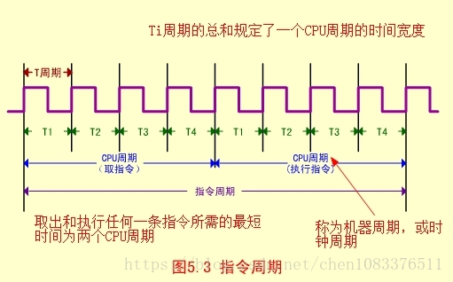
单周期：在一个CPU周期中完成取指和执行操作（少数指令可实现）。

多周期：大多数指令需要在多个CPU周期中完成指令周期的全部操作。

### 五条基本指令
#### 一、MOV指令(传送指令,RR型)
MOV RO,R1

MOV执行（R1）->R0

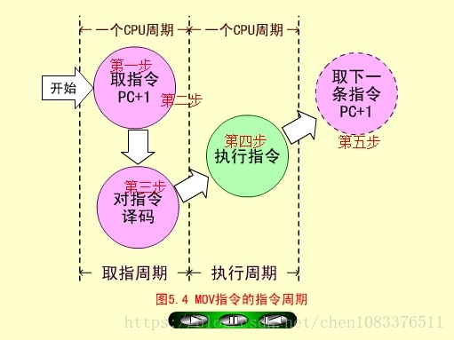

##### MOV取指周期
1. 程序计数器PC中装入第一条指令地址101（八进制）；

2. PC的内容被放到指令地址总线ABUS(I)上，对指存进行译码，并启动读命令；

3. 从101号地址读出的MOV指令通过指令总线IBUS装入指令寄存器IR；

4. 程序计数器内容加1，变成102，为取下一条指令做好准备。

5. 指令寄存器中的操作吗（OP）被译码；

6. CPU识别出是MOV指令。至此，取指周期即告结束。
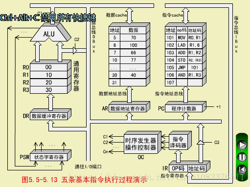

##### MOV执行周期
1. 操作控制器（OC）送出控制信号到通用寄存器，选择R1（10）作源寄存器，选择R0作目标寄存器；

2. OC送出控制信号到ALU，指定ALU做传送操作；

3. OC送出控制信号，打开ALU输出三态门，将ALU输出送到数据总线DBUS上。注意，任何时候DBUS上只能有一个数据。

4. OC送出控制信号，将DBUS上的数据，入到数据缓冲寄存器DR（10）；

5. OC送出控制信号，将DR中的数据10打入到目标寄存器R0,R0的内容由00变为10.至此，MOV指令执行结束。

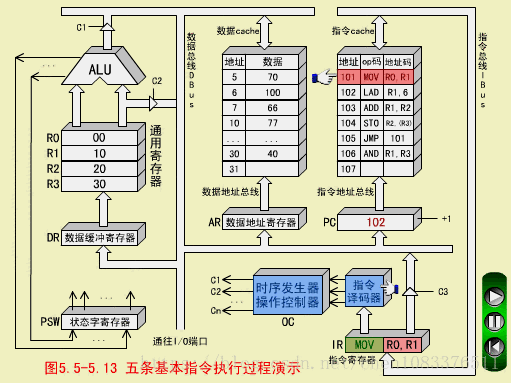


#### 二、LAD指令（取数指令,RS型）
LAD R1,6

LAD从数存6号单元取数（100）->R1
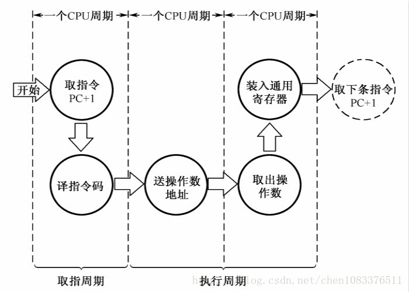


##### LAD取指周期

步骤和MOV取指周期相同。

##### LAD执行周期

1. 操作控制器OC发出控制命令打开IR输出三态门，将指令中的直接地址码6放到数据总线DBUS上；

2. OC发出操作命令，将地址码6装入数存地址寄存器AR;

3. OC发出读命令，将数存6号单元中的数100读出到DBUS上；

4. OC发出命令，将DBUS上的数据100装入缓冲寄存器DR；

5. OC发出命令，将DR中的数100装入通用寄存器R1,原来R1中的数10被冲掉。至此，LAD指令执行周期结束。

注意，数据总线DBUS上分时进行了地址传送和数据传送，所以需要2个CPU周期。
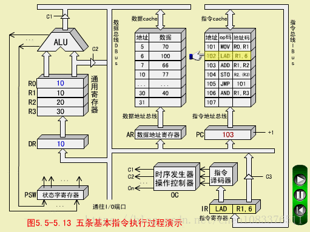

#### 三、ADD指令（加法指令，RR型）
ADD R1,R2

ADD执行（R1）+(R2)->R2,结果为（R2）=120

##### ADD取指周期

步骤和MOV取指周期相同。

##### ADD执行周期

1. 操作控制器OC送出控制命令到通用寄存器，选择R1做源寄存器，R2做目标寄存器；

2. OC送出控制命令到ALU，指定ALU做R1（100）和R2（20）的加法操作；

3. OC送出控制命令，打开ALU输出三态门，运算结果120放到DBUS上；

4. OC送出控制命令。将DBUS上数据打入缓冲寄存器DR；ALU产生的进位信号保存状态字寄存器在PS中；

5. OC送出控制命令，将DR（120）装入R2，R2中原来的内容20被冲掉。至此，ADD指令执行周期结束。
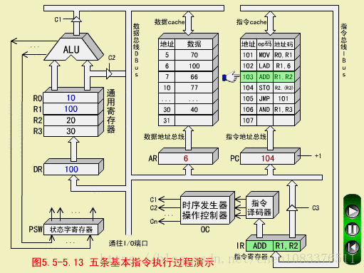

#### 四、STO指令（存数指令，RS型）
STO R2,(R3)

STO用(R3)间接寻址，(R2)=120写入数存30号单元
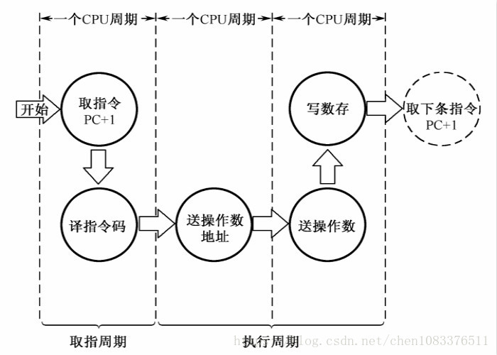
##### STO取指周期

步骤和MOV取指周期相同。

##### STO执行周期

1. 操作控制器OC送出操作命令到通用寄存器，选择(R3)=30做数据存储器的地址单元；

2. OC发出操作命令，打开通用寄存器输出三态门（不经过AU以节省时间），将地址30放到DBUS上；

3. OC发出操作命令，将地址30打入AR，并进行数存地址译码；

4. OC发出操作命令到通用寄存器，选择（R2）=120，作为数存的写入数据；

5. OC发出操作命令，打开通用寄存器输出三态门，将数据120放到DBUS上；

6. OC发出操作命令，将数据120写入数存30号单元，它原先的数据40被冲掉。至此，STO指令执行周期结束。

注意，DBUS是单总线结构，先送地址（30），后送数据（120），必须分时传送。
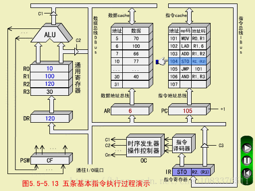


#### 五、JMP指令（转移指令）
无条件转移指令，用来改变程序的执行顺序。

JMP 101

JMP改变程序执行顺序到101号单元
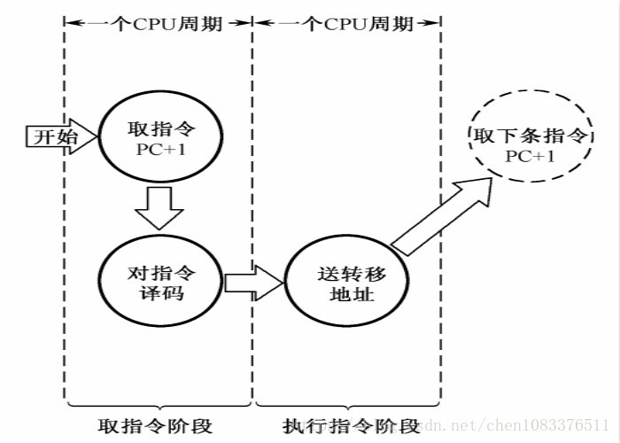
##### JMP取指周期

步骤和MOV取指周期相同。

##### JMP执行周期

1. OC发生操作控制命令，打开指令寄存器IR的输出三态门，将IR中的地址码101发送到DBUS上；

2. OC发出操作控制命令，将DBUS上的地址码101打入到程序计数器PC中，PC中的原先内容106被更换。于是下一条指令不是从106号单元取出，而是转移到101号单元取出。至此，JMP指令执行周期结束。

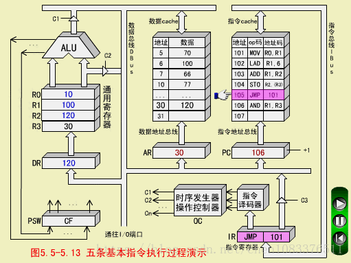

#### 小结：

所有指令的取指周期是完全相同的，而且是一个CPU周期。但是指令的执行周期，由于各条指令的功能不同，所用的CPU是各个不相同的。

其中MOV、ADD、JMP指令是一个CPU周期；LAD和STO指令是两个CPU周期。
> 获取内存中的一条数据大概需要200多个CPU周期(CPU cycles),

## CPU性能衡量指标之Cache

影响其性能的指标主要有**主频、 CPU的位数以及CPU的缓存指令集**。所谓CPU的主频，指的就是时钟频率，它直接的决定了CPU的性能，因此要想CPU的性能得到很好地提高，提高CPU的主频是一个很好地途径。而CPU的位数指的就是处理器能够一次性计算的浮点数的位数，通常情况下，CPU的位数越高，CPU 进行运算时候的速度就会变得越快。现在CPU的位数一般为32位或者64位。以前人们使用的计算机都是32位系统， 近年来人们使用的计算机的处理器中64位所占用的比例则显得更多，这是因为64位的计算机的运行速度变得更快，提高了人们的工作效率。而CPU的缓存指令集是存储在CPU内部的，主要指的是能够对CPU的运算进行指导以及优化的硬程序。一般来讲，CPU 的缓存可以分为一级缓存、二级缓存和三级缓存，而那些处理能力比较强的处理器则一般具有较大的三级缓存。

### CPU缓存的来历
众所周知,CPU是计算机的大脑，它负责执行程序的指令，而内存负责存数据, 包括程序自身的数据。在很多年前，CPU的频率与内存总线的频率在同一层面上。内存的访问速度仅比寄存器慢一些。但是，这一局面在上世纪90年代被打破了。CPU的频率大大提升，但内存总线的频率与内存芯片的性能却没有得到成比例的提升。并不是因为造不出更快的内存，只是因为太贵了。内存如果要达到目前CPU那样的速度，那么它的造价恐怕要贵上好几个数量级。所以，CPU的运算速度要比内存读写速度快很多，这样会使CPU花费很长的时间等待数据的到来或把数据写入到内存中。所以，为了解决CPU运算速度与内存读写速度不匹配的矛盾，就出现了CPU缓存。

### CPU缓存的概念
CPU缓存是位于CPU与内存之间的临时数据交换器，它的容量比内存小的多但是交换速度却比内存要快得多。CPU缓存一般直接跟CPU芯片集成或位于主板总线互连的独立芯片上。

为了简化与内存之间的通信，高速缓存控制器是针对数据块，而不是字节进行操作的。高速缓存其实就是一组称之为缓存行(Cache Line)的固定大小的数据块组成的，典型的一行是64字节。

### CPU缓存的意义
CPU往往需要重复处理相同的数据、重复执行相同的指令，如果这部分数据、指令CPU能在CPU缓存中找到，CPU就不需要从内存或硬盘中再读取数据、指令，从而减少了整机的响应时间。所以，缓存的意义满足以下两种局部性原理：

- 时间局部性（Temporal Locality）：如果一个信息项正在被访问，那么在近期它很可能还会被再次访问。
- 空间局部性（Spatial Locality）：如果一个存储器的位置被引用，那么将来他附近的位置也会被引用。

### CPU的三级缓存
随着多核CPU的发展，CPU缓存通常分成了三个级别：L1，L2，L3。级别越小越接近CPU，所以速度也更快，同时也代表着容量越小。
L1 是最接近CPU的, 它容量最小（例如：32K），速度最快，每个核上都有一个 L1 缓存，L1 缓存每个核上其实有两个 L1 缓存, 一个用于存数据的 L1d Cache（Data Cache），一个用于存指令的 L1i Cache（Instruction Cache）。
L2 缓存 更大一些（例如：256K），速度要慢一些, 一般情况下每个核上都有一个独立的L2 缓存; 
L3 缓存是三级缓存中最大的一级（例如3MB,12M），同时也是最慢的一级, 在同一个CPU插槽之间的核共享一个 L3 缓存。

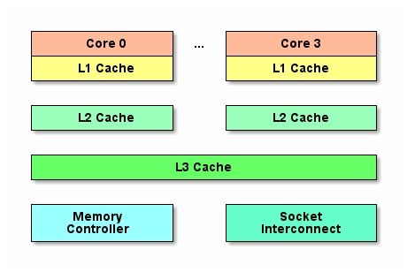

下面是三级缓存的处理速度参考表：
从CPU到	 | 大约需要的CPU周期| 	大约需要的时间(单位ns)
---|---| ---
寄存器| 	1 cycle	|  
L1 Cache| 	~3-4 cycles| 	~0.5-1 ns
L2 Cache| 	~10-20 cycles| 	~3-7 ns
L3 Cache| 	~40-45 cycles	| ~15 ns
跨槽传输| 	 	| ~20 ns
内存| 	~120-240|  cycles	~60-120ns

```sh
$ cat /sys/devices/system/cpu/cpu0/cache/index0/size  
32K  
$ cat /sys/devices/system/cpu/cpu0/cache/index0/type  
Data  
$ cat /sys/devices/system/cpu/cpu0/cache/index0/level   
1  
$ cat /sys/devices/system/cpu/cpu3/cache/index3/level     
3 
```
缓存行(Cache line) 
为了高效地存取缓存, 不是简单随意地将单条数据写入缓存的.  缓存是由缓存行组成的, 典型的一行是64字节. 读者可以通过下面的shell命令,查看cherency_line_size就知道知道机器的缓存行是多大.
```sh
$ cat /sys/devices/system/cpu/cpu0/cache/index0/coherency_line_size   
64
``` 
CPU存取缓存都是按行为最小单位操作的. 在这儿我将不提及缓存的associativity问题, 将问题简化一些. 一个Java long型占8字节, 所以从一条缓存行上你可以获取到8个long型变量. 所以如果你访问一个long型数组, 当有一个long被加载到cache中, 你将无消耗地加载了另外7个. 所以你可以非常快地遍历数组. 

#### 带有高速缓存CPU执行计算的流程

1. 程序以及数据被加载到主内存
2. 指令和数据被加载到CPU的高速缓存
3. CPU执行指令，把结果写到高速缓存
4. 高速缓存中的数据写回主内存


### CPU缓存一致性协议(MESI)

MESI（Modified Exclusive Shared Or Invalid）(也称为伊利诺斯协议，是因为该协议由伊利诺斯州立大学提出的）是一种广泛使用的支持写回策略的缓存一致性协议。为了保证多个CPU缓存中共享数据的一致性，定义了缓存行(Cache Line)的四种状态，而CPU对缓存行的四种操作可能会产生不一致的状态，因此缓存控制器监听到本地操作和远程操作的时候，需要对地址一致的缓存行的状态进行一致性修改，从而保证数据在多个缓存之间保持一致性。

#### MESI协议中的状态
[理解CPU缓存一致性协议](https://www.toutiao.com/i7012483826572067341)
[在线体验 MESI 协议状态转换](https://www.scss.tcd.ie/Jeremy.Jones/VivioJS/caches/MESIHelp.htm)
CPU中每个缓存行（Caceh line)使用4种状态进行标记，使用2bit来表示:

状态 |	描述 |	监听任务|	状态转换
---|---|---|---
M 修改 (Modified)	|该Cache_line有效，数据被修改了，和内存中的数据不一致，数据只存在于本Cache中。|	缓存行必须时刻监听所有试图读该缓存行相对就主存的操作，这种操作必须在缓存将该缓存行写回主存并将状态变成S（共享）状态之前被延迟执行。	|当被写回主存之后，该缓存行的状态会变成独享（exclusive)状态。
E 独享、互斥 (Exclusive)|	该Cache line有效，数据和内存中的数据一致，数据只存在于本Cache中。	|缓存行也必须监听其它缓存读主存中该缓存行的操作，一旦有这种操作，该缓存行需要变成S（共享）状态。|	当CPU修改该缓存行中内容时，该状态可以变成Modified状态
S 共享 (Shared)	|该Cache line有效，数据和内存中的数据一致，数据存在于很多Cache中。|	缓存行也必须监听其它缓存使该缓存行无效或者独享该缓存行的请求，并将该缓存行变成无效（Invalid）。|	当有一个CPU修改该缓存行时，其它CPU中该缓存行可以被作废（变成无效状态 Invalid）。
I 无效 (Invalid)	|该Cache line无效。|	无	|无

> 对于M和E状态而言总是精确的，他们在和该缓存行的真正状态是一致的，而S状态可能是非一致的。如果一个缓存将处于S状态的缓存行作废了，而另一个缓存实际上可能已经独享了该缓存行，但是该缓存却不会将该缓存行升迁为E状态，这是因为其它缓存不会广播他们作废掉该缓存行的通知，同样由于缓存并没有保存该缓存行的copy的数量，因此（即使有这种通知）也没有办法确定自己是否已经独享了该缓存行。


从上面的意义看来E状态是一种投机性的优化：如果一个CPU想修改一个处于S状态的缓存行，总线事务需要将所有该缓存行的copy变成invalid状态，而修改E状态的缓存不需要使用总线事务。

MESI状态转换图：


理解该图的前置说明：
1. 触发事件

触发事件 |	描述
---|---
本地读取（Local read）	|本地cache读取本地cache数据
本地写入（Local write）	|本地cache写入本地cache数据
远端读取（Remote read）	|其他cache读取本地cache数据
远端写入（Remote write）	|其他cache写入本地cache数据

2. cache分类：
前提：所有的cache共同缓存了主内存中的某一条数据。

本地cache:指当前cpu的cache。
触发cache:触发读写事件的cache。
其他cache:指既除了以上两种之外的cache。
注意：本地的事件触发 本地cache和触发cache为相同。

上图的切换解释：

状态 |	触发本地读取|	触发本地写入|	触发远端读取|	触发远端写入
---|---|---|---|---
M状态（修改）	|本地cache:M  触发cache:M 其他cache:I	|本地cache:M 触发cache:M 其他cache:I	| 本地cache:M→E→S 触发cache:I→S 其他cache:I→S <br/>同步主内存后修改为E独享,同步触发、其他cache后本地、触发、其他<br/>cache修改为S共享	| 本地cache:M→E→S→I 触发cache:I→S→E→M 其他cache:I→S→I 同步和读取一样,同步完成后触发cache改为M，本地、其他cache改为I
E状态（独享）	|本地cache:E 触发cache:E 其他cache:I	|本地cache:E→M 触发cache:E→M 其他cache:I 本地cache变更为M,其他cache状态应当是I（无效）|	本地cache:E→S 触发cache:I→S 其他cache:I→S 当其他cache要读取该数据时，其他、触发、本地cache都被设置为S(共享)	|本地cache:E→S→I 触发cache:I→S→E→M 其他cache:I→S→I <br/>当触发cache修改本地cache独享数据时时，将本地、触发、其他cache修改为S共享.然后触发cache修改为独享，其他、本地cache修改为I（无效），触发cache再修改为M
S状态(共享)	|本地cache:S 触发cache:S 其他cache:S	|本地cache:S→E→M 触发cache:S→E→M 其他cache:S→I 当本地cache修改时，将本地cache修改为E,其他cache修改为I,然后再将本地cache为M状态	|本地cache:S 触发cache:S 其他cache:S	|本地cache:S→I 触发cache：S→E→M 其他cache:S→I 当触发cache要修改本地共享数据时，触发cache修改为E（独享）,本地、其他cache修改为I（无效）,触发cache再次修改为M(修改)
I状态（无效）	|本地cache:I→S或者I→E 触发cache:I→S或者I→E 其他cache:E、M、I→S、I 本地、触发cache将从I无效修改为S共享或者E独享，其他cache将从E、M、I 变为S或者I	|本地cache:I→S→E→M 触发cache:I→S→E→M 其他cache:M、E、S→S→I | 既然是本cache是I，其他cache操作与它无关	|既然是本cache是I，其他cache操作与它无关


下图表示了当一个缓存行(Cache line)的调整的状态的时候，另外一个缓存行(Cache line)需要调整的状态。

状态 |	M |	E |	S |	I
---|---|---|---|---
M |	× |	× |	× |	√
E |	× |	× |	× |	√
S |	× |	× |	√ |	√
I |	√ |	√ |	√ |	√

> 举个示例：
> 假设cache 1 中有一个变量x = 0的 Cache line 处于S状态(共享)。
那么其他拥有x变量的 cache 2、cache 3 等x的 Cache line调整为S状态（共享）或者调整为I状态（无效）。

#### 多核缓存协同操作
##### 1. 内存变量
假设有三个CPU A、B、C，对应三个缓存分别是cache a、b、c。在主内存中定义了x的引用值为0。

内存变量


##### 2. 单核读取

执行流程是：

- CPU A发出了一条指令，从主内存中读取x。
- 从主内存通过 bus 读取到 CPU A 的缓存中（远端读取 Remote read）,这时该 Cache line 修改为 E 状态（独享）。

单核读取


##### 3. 双核读取

执行流程是：

- CPU A发出了一条指令，从主内存中读取x。
- CPU A从主内存通过bus读取到 cache a 中并将该 Cache line 设置为E状态。
- CPU B发出了一条指令，从主内存中读取x。
- CPU B试图从主内存中读取x时，CPU A检测到了地址冲突。这时CPU A对相关数据做出响应。此时x存储于 cache a 和 cache b 中，x在 chche a 和 cache b 中都被设置为S状态(共享)。

双核读取

##### 4. 修改数据
执行流程是：

- CPU A 计算完成后发指令需要修改x.
- CPU A 将x设置为M状态（修改）并通知缓存了x的 CPU B, CPU B 将本地 cache b 中的x设置为I状态(无效)
- CPU A 对x进行赋值。

修改数据


##### 5. 同步数据
执行流程是：

- CPU B 发出了要读取x的指令。
- CPU B 通知CPU A,CPU A将修改后的数据同步到主内存时cache a 修改为E（独享）
- CPU A同步CPU B的x,将cache a和同步后cache b中的x设置为S状态（共享）。

同步数据


#### CPU 存储模型简介


MESI协议为了保证多个 CPU cache 中共享数据的一致性，定义了 Cache line 的四种状态，而 CPU 对 cache 的4种操作可能会产生不一致状态，因此 cache 控制器监听到本地操作和远程操作的时候，需要对地址一致的 Cache line 状态做出一定的修改，从而保证数据在多个cache之间流转的一致性。

但是，缓存的一致性消息传递是要时间的，这就使得状态切换会有更多的延迟。某些状态的切换需要特殊的处理，可能会阻塞处理器。这些都将会导致各种各样的稳定性和性能问题。比如你需要修改本地缓存中的一条信息，那么你必须将I（无效）状态通知到其他拥有该缓存数据的CPU缓存中，并且等待确认。等待确认的过程会阻塞处理器，这会降低处理器的性能。因为这个等待远远比一个指令的执行时间长的多。所以，为了为了避免这种阻塞导致时间的浪费，引入了存储缓存(Store Buffer)和无效队列(Invalidate Queue)。

##### 1. 存储缓存
在没有存储缓存时，CPU 要写入一个量，有以下情况：

- 量不在该 CPU 缓存中，则需要发送 Read Invalidate 信号，再等待此信号返回，之后再写入量到缓存中。
- 量在该 CPU 缓存中，如果该量的状态是 Exclusive 则直接更改。而如果是 Shared 则需要发送 Invalidate 消息让其它 CPU 感知到这一更改后再更改。

这些情况中，很有可能会触发该 CPU 与其它 CPU 进行通讯，接着需要等待它们回复。这会浪费大量的时钟周期！为了提高效率，可以使用异步的方式去处理：先将值写入到一个 Buffer 中，再发送通讯的信号，等到信号被响应，再应用到 cache 中。并且此 Buffer 能够接受该 CPU 读值。这个 Buffer 就是 Store Buffer。而不须要等待对某个量的赋值指令的完成才继续执行下一条指令，直接去 Store Buffer 中读该量的值，这种优化叫Store Forwarding。

##### 2. 无效队列
同理，解决了主动发送信号端的效率问题，那么，接受端 CPU 接受到 Invalidate 信号后如果立即采取相应行动(去其它 CPU 同步值)，再返回响应信号，则时钟周期也太长了，此处也可优化。接受端 CPU 接受到信号后不是立即采取行动，而是将 Invalidate 信号插入到一个队列 Queue 中，立即作出响应。等到合适的时机，再去处理这个 Queue 中的 Invalidate 信号，并作相应处理。这个 Queue 就是Invalidate Queue。

### 乱序执行

乱序执行（out-of-orderexecution）：是指CPU允许将多条指令不按程序规定的顺序分开发送给各相应电路单元处理的技术。这样将根据各电路单元的状态和各指令能否提前执行的具体情况分析后，将能提前执行的指令立即发送给相应电路。

这好比请A、B、C三个名人为晚会题写横幅“春节联欢晚会”六个大字，每人各写两个字。如果这时在一张大纸上按顺序由A写好”春节”后再交给B写”联欢”，然后再由C写”晚会”，那么这样在A写的时候，B和C必须等待，而在B写的时候C仍然要等待而A已经没事了。

但如果采用三个人分别用三张纸同时写的做法， 那么B和C都不必须等待就可以同时各写各的了，甚至C和B还可以比A先写好也没关系（就象乱序执行），但当他们都写完后就必须重新在横幅上（自然可以由别人做，就象CPU中乱序执行后的重新排列单元）按”春节联欢晚会”的顺序排好才能挂出去。

所以，CPU 为什么会有乱序执行优化？本质原因是CPU为了效率，将长费时的操作“异步”执行，排在后面的指令不等前面的指令执行完毕就开始执行后面的指令。而且允许排在前面的长费时指令后于排在后面的指令执行完。

CPU 执行乱序主要有以下几种：

- 写写乱序(store store)：a=1;b=2; -> b=2;a=1;
- 写读乱序(store load)：a=1;load(b); -> load(b);a=1;
- 读读乱序(load load)：load(a);load(b); -> load(b);load(a);
- 读写乱序(load store)：load(a);b=2; -> b=2;load(a);

总而言之，CPU的乱序执行优化指的是处理器为提高运算速度而做出违背代码原有顺序的优化。