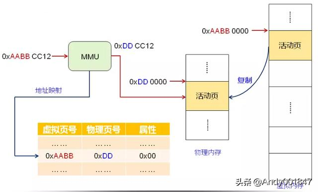
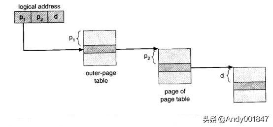
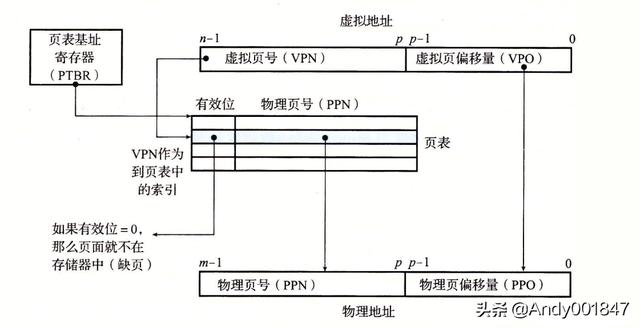
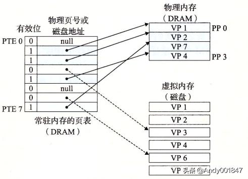
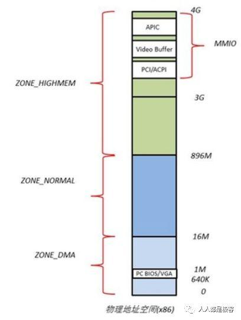
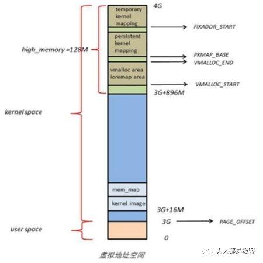
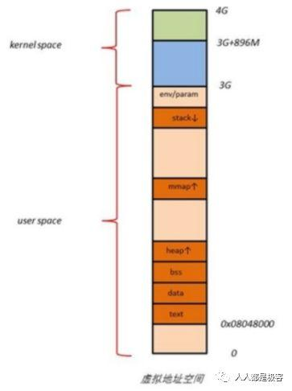
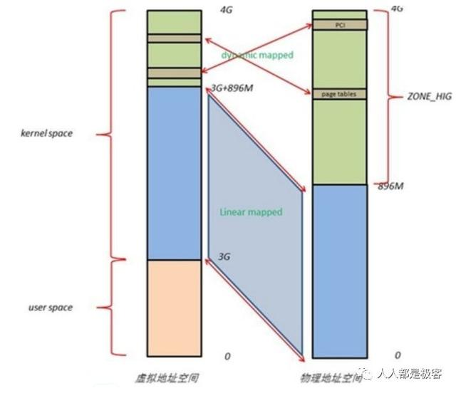
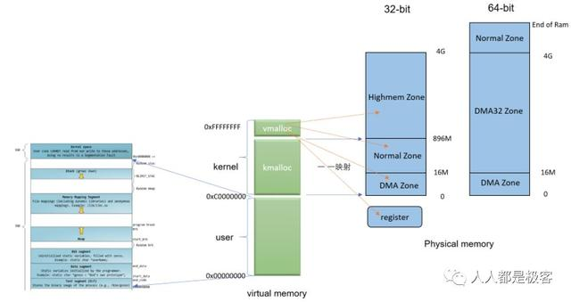

<!-- toc -->
[TOC]
# 虚拟内存

## 一、定义
虚拟内存是计算机系统内存管理的一种技术。它使得应用程序认为它拥有连续的可用的内存（一个连续完整的地址空间），而实际上，它通常是被分隔成多个物理内存碎片，还有部分暂时存储在外部磁盘存储器上，在需要时进行数据交换。目前，大多数操作系统都使用了虚拟内存，如：
- Windows家族的“虚拟内存”
WINDOWS的虚拟内存技术，即拿出一部分硬盘空间来充当内存使用，这部分空间即称为虚拟内存，虚拟内存在硬盘上的存在形式就是 PAGEFILE.SYS这个页面文件。

- Linux的“交换空间”

### 内存管理单元MMU（Memory Management Unit）
内存管理单元MMU的主要功能是虚拟地址到物理地址的转换。除此之外，它还可以实现内存保护、缓存控制、总线仲裁以及存储体切换。也就是说程序运行的过程所需要的物理内存地址都是经过一个叫内存管理单元的东西完成的，需要注意的是内存管理单元是硬件管理，而不是软件实现内存管理的。内存管理单元使每一个程序都有自己独立的虚拟地址空间，提高了物理内存的使用率，它还提供了内存保护功能，可以将特定的内存块设置为读、写或者可执行属性，可以防止被程序恶意窜改内存。它的工作流程如下所示：

## 二、虚拟内存的工作方式

虚拟存储器是由硬件和操作系统自动实现存储信息调度和管理的。它的工作过程包括6个步骤：

1. 中央处理器访问主存的逻辑地址分解成组号a和组内地址b，并对组号a进行地址变换，即将逻辑组号a作为索引，查地址变换表，以确定该组信息是否存放在主存内。
2. 如该组号已在主存内，则转而执行④；如果该组号不在主存内，则检查主存中是否有空闲区，如果没有，便将某个暂时不用的组调出送往辅存，以便将这组信息调入主存。
3. 从辅存读出所要的组，并送到主存空闲区，然后将那个空闲的物理组号a和逻辑组号a登录在地址变换表中。
4. 从地址变换表读出与逻辑组号a对应的物理组号a。
5. 从物理组号a和组内字节地址b得到物理地址。
6. 根据物理地址从主存中存取必要的信息。

## 三、虚拟内存的调度方式

调度方式有分页式、段式、段页式3种。页式调度是将逻辑和物理地址空间都分成固定大小的页。主存按页顺序编号，而每个独立编址的程序空间有自己的页号顺序，通过调度辅存中程序的各页可以离散装入主存中不同的页面位置，并可据表一一对应检索。页式调度的优点是页内零头小，页表对程序员来说是透明的，地址变换快，调入操作简单；缺点是各页不是程序的独立模块，不便于实现程序和数据的保护。段式调度是按程序的逻辑结构划分地址空间，段的长度是随意的，并且允许伸长，它的优点是消除了内存零头，易于实现存储保护，便于程序动态装配；缺点是调入操作复杂。将这两种方法结合起来便构成段页式调度。在段页式调度中把物理空间分成页，程序按模块分段，每个段再分成与物理空间页同样小的页面。段页式调度综合了段式和页式的优点。其缺点是增加了硬件成本，软件也较复杂。大型通用计算机系统多数采用段页式调度。

### 1.页式调度
在页式虚拟存储系统中，虚拟空间被分成大小相等的页，称为逻辑页或虚页。主存空间也被分成同样大小的页，称为物理页或实页。相应地，虚拟地址分为两个字段:高位字段为虚页号，低位字段为页内地址。实存地址也分为两个字段：高位字段为实页号，低位字段为页内地址。同时，页的大小都取2的整数幂个字。

通过页表可以把虚拟地址转换成物理地址。每个程序设置一张页表，在页表中，对应每一个虚页号都有一个条目，条目内容至少包含该虚页所在的主存页面地址(实页号)，用它作为实存地址的高位字段;实页号与虚拟地址的页内地址相拼接，就产生完整的实存地址，据此访问主存。

#### 页表
虚拟内存中的一些虚拟页是要缓存在物理内存中才能被执行的，因此操作系统存在一种机制用来判断某个虚拟页是否被缓存在物理内存中，还需要知道这个虚拟页存放在磁盘上的哪个位置，从而在物理内存中选择空闲页或者更新缓存页，并将需要的虚拟页从磁盘复制到物理内存中。这些功能是由软硬件结合完成的，他存放在物理内存中一个叫页表的数据结构中。页表的结构如下图所示：

页表实际上是一个数组。该数组存放的是一个称为页表条目（PTE）的结构。虚拟地址空间的每一个页在页表中，都有一个对应的页表条目（PTE）。虚拟页地址翻译的时候就是查询的各个虚拟页在页表中的PTE，从而进行地址翻译的。地址翻译的过程如下所示：

假设每一个PTE都有一个有效位和一个n位字段的地址。其中有效位表示对应的虚拟页是否缓存在了物理内存中。0表示未缓存。1表示已缓存。n位地址字段表示如果未缓存（有效字段为0），n位地址字段不为空的话，这个n位地址字段就表示该虚拟页在磁盘上的起始的位置。如果这个n位字段为空，那么就说明该虚拟页未分配；如果已缓存（有效字段为1），n位地址字段则不为空，它表示该虚拟页在物理内存中的起始地址。

在上图中，四个虚拟页VP1 , VP2, VP4 , VP7 是被缓存在物理内存中。 两个虚拟页VP0, VP5还未被分配。但是剩下的虚拟页VP3 ,VP6已经被分配了，但是还没有缓存到物理内存中去执行。

### 2.段式调度
页面是主存物理空间中划分出来的等长的固定区域。分页方式的优点是页长固定，因而便于构造页表、易于管理，且不存在外碎片。但分页方式的缺点是页长与程序的逻辑大小不相关。例如，某个时刻一个子程序可能有一部分在主存中，另一部分则在辅存中。这不利于编程时的独立性，并给换入/换出处理、存储保护和存储共享等操作造成麻烦。

另一种划分可寻址的存储空间的方法称为分段。段是按照程序的自然分界划分的、长度可以动态改变的区域。通常，程序员把子程序、操作数和常数等不同类型的数据划分到不同的段中，并且每个程序可以有多个相同类型的段。 

在段式虚拟存储系统中，虚拟地址由段号和段内地址组成，虚拟地址到实存地址的变换通过段表来实现。每个程序设置一个段表，段表的每一个表项对应一个段，每个表项至少包括三个字段：有效位(指明该段是否已经调入主存)、段起址(该段在实存中的首地址)和段长(记录该段的实际长度)。 

### 3.段页式调度
段页式虚拟存储器是段式虚拟存储器和页式虚拟存储器的结合。

首先，实存被等分成页。在段页式虚拟存储器中，把程序按逻辑结构分段以后，再把每段按照实存的页的大小分页，程序按页进行调入和调出操作，但它又可按段实现共享和保护。因此，它可以兼有页式和段式系统的优点。它的缺点是在地址映像过程中需要多次查表，虚拟地址转换成物理地址是通过一个段表和一组页表来进行定位的。段表中的每个表目对应一个段，每个表目有一个指向该段的页表的起始地址(页号)及该段的控制保护信页表指明该段各页在主存中的位置以及是否已装入、已修改等标志。

## 四、虚拟内存的调度方式
虚拟存储器地址变换基本上有3种形虚拟存储器工作过程式：全联想变换、直接变换和组联想变换。任何逻辑空间页面能够变换到物理空间任何页面位置的方式称为全联想变换。每个逻辑空间页面只能变换到物理空间一个特定页面的方式称为直接变换。组联想变换是指各组之间是直接变换，而组内各页间则是全联想变换。替换规则用来确定替换主存中哪一部分，以便腾空部分主存，存放来自辅存要调入的那部分内容。常见的替换算法有4种。

1. 随机算法：用软件或硬件随机数产生器确定替换的页面。  
2. 先进先出：先调入主存的页面先替换。
3. 近期最少使用算法（LRU，Least Recently Used）：替换最长时间不用的页面。 
4. 最优算法：替换最长时间以后才使用的页面。这是理想化的算法，只能作为衡量其他各种算法优劣的标准。

## 五、虚拟内存的作用
虚拟内存提供了三个重要的能力： 缓存，内存管理，内存保护

1. 将主存视为一个存储在磁盘上的地址空间的高速缓存，在主存中只保存活动区域，并根据需要在磁盘和主存之间来回传送数据
2. 为每个进程提供了一致的地址空间，简化内存管理
3. 保护了每个进程的地址空间不被其他进程破坏

## 六、物理地址和虚拟地址的分布
### 物理地址空间布局
Linux系统在初始化时，会根据实际的物理内存的大小，为每个物理页面创建一个page对象，所有的page对象构成一个mem_map数组。进一步，针对不同的用途，Linux内核将所有的物理页面划分到3类内存管理区中，如图，分别为ZONE_DMA，ZONE_NORMAL，ZONE_HIGHMEM。

- ZONE_DMA 的范围是 0~16M，该区域的物理页面专门供 I/O 设备的 DMA 使用。之所以需要单独管理 DMA 的物理页面，是因为 DMA 使用物理地址访问内存，不经过 MMU，并且需要连续的缓冲区，所以为了能够提供物理上连续的缓冲区，必须从物理地址空间专门划分一段区域用于 DMA。

- ZONE_NORMAL 的范围是 16M~896M，该区域的物理页面是内核能够直接使用的。

- ZONE_HIGHMEM 的范围是 896M~结束，该区域即为高端内存，内核不能直接使用。

### Linux内核空间虚拟地址分布

在 Kernel Image 下面有 16M 的内核空间用于 DMA 操作。位于内核空间高端的 128M 地址主要由3部分组成，分别为 vmalloc area、持久化内核映射区、临时内核映射区。

由于 ZONE_NORMAL 和内核线性空间存在直接映射关系，所以内核会将频繁使用的数据如 Kernel 代码、GDT、IDT、PGD、mem_map 数组等放在 ZONE_NORMAL 里。而将用户数据、页表（PT）等不常用数据放在 ZONE_HIGHMEM 里，只在要访问这些数据时才建立映射关系（kmap()）。比如，当内核要访问 I/O 设备存储空间时，就使用 ioremap 将位于物理地址高端的 mmio 区内存映射到内核空间的 vmalloc area 中，在使用完之后便断开映射关系。

### Linux用户空间虚拟地址分布

用户进程的代码区一般从虚拟地址空间的 0x08048000 开始，这是为了便于检查空指针。代码区之上便是数据区，未初始化数据区，堆区，栈区，以及参数、全局环境变量。

### Linux物理地址和虚拟地址的关系

Linux 将 4G 的线性地址空间分为2部分，0~3G 为 user space，3G~4G 为 kernel space。

由于开启了分页机制，内核想要访问物理地址空间的话，必须先建立映射关系，然后通过虚拟地址来访问。为了能够访问所有的物理地址空间，就要将全部物理地址空间映射到 1G 的内核线性空间中，这显然不可能。于是，内核将 0~896M 的物理地址空间一对一映射到自己的线性地址空间中，这样它便可以随时访问 ZONE_DMA 和 ZONE_NORMAL 里的物理页面；此时内核剩下的 128M 线性地址空间不足以完全映射所有的 ZONE_HIGHMEM，Linux 采取了动态映射的方法，即按需的将 ZONE_HIGHMEM 里的物理页面映射到 kernel space 的最后 128M 线性地址空间里，使用完之后释放映射关系，以供其它物理页面映射。虽然这样存在效率的问题，但是内核毕竟可以正常的访问所有的物理地址空间了。

Linux 是如何用虚拟地址来映射物理地址的，我们用一张图来总结一下：

## 七、总结

1. 调度问题：决定哪些程序和数据应被调入主存。
2. 地址映射问题：在访问主存时把虚地址变为主存物理地址（这一过程称为内地址变换）；在访问辅存时把虚地址变成辅存的物理地址（这一过程称为外地址变换），以便换页。此外还要解决主存分配、存储保护与程序再定位等问题。
3. 替换问题：决定哪些程序和数据应被调出主存。
4. 更新问题：确保主存与辅存的一致性。

5. CPU是如何访问内存
- 以虚拟地址（VA）的形式，为应用程序提供远大于物理内存的虚拟地址空间（Virtual Address Space）

- 每个进程都有独立的虚拟地址空间，不会相互影响，进而可提供非常好的内存保护（memory protection）

- 提供内存映射（Memory Mapping）机制，以便把物理内存、I/O空间、Kernel Image、文件等对象映射到相应进程的地址空间中，方便进程的访问

- 提供公平、高效的物理内存分配（Physical Memory Allocation）算法

- 提供进程间内存共享的方法（以虚拟内存的形式），也称作Shared Virtual Memory

在操作系统的控制下，硬件和系统软件为用户解决了上述问题，从而使应用程序的编程大大简化。
