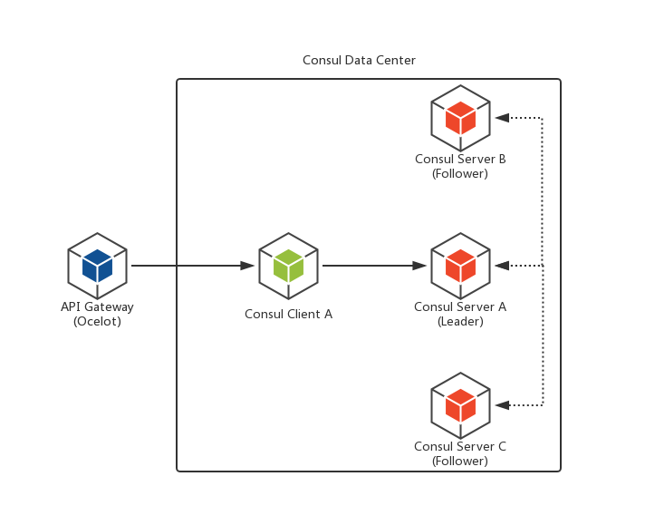
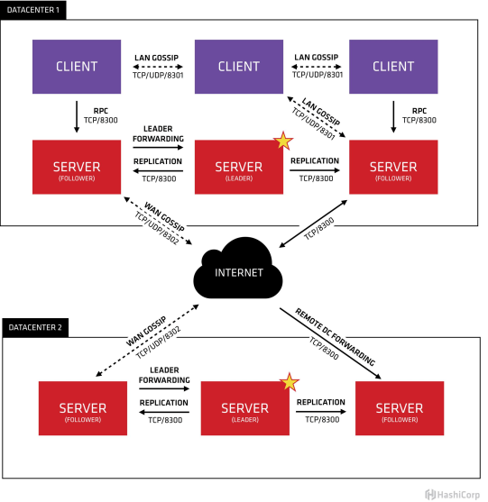

[参考](https://hub.docker.com/_/consul)


单机版：
```
docker pull consul:1.6.1

docker run -d -p 8500:8500 -v /d/dockerv/consul/data/:/consul/data/ -v /d/dockerv/consul/config/:/consul/config/ --name consul --restart always consul:1.6.1 agent -dev -bind=0.0.0.0 -client=0.0.0.0


网上的版本:
docker run --name consul1 -d -p 8500:8500 -p 8300:8300 -p 8301:8301 -p 8302:8302 -p 8600:8600 consul:1.6.1 agent -server -bootstrap-expect 2 -ui -bind=0.0.0.0 -client=0.0.0.0

```

在Consul方案中，每个提供服务的节点上都要部署和运行Consul的Client Agent，所有运行Consul Agent节点的集合构成Consul Cluster。Consul Agent有两种运行模式：Server和Client。这里的Server和Client只是Consul集群层面的区分，与搭建在Cluster之上的应用服务无关。以Server模式运行的Consul Agent节点用于维护Consul集群的状态，官方建议每个Consul Cluster至少有3个或以上的运行在Server Mode的Agent，Client节点不限。

Consul支持多数据中心，每个数据中心的Consul Cluster都会在运行于Server模式下的Agent节点中选出一个Leader节点，这个选举过程通过Consul实现的raft协议保证，多个 Server节点上的Consul数据信息是强一致的。处于Client Mode的Consul Agent节点比较简单，无状态，仅仅负责将请求转发给Server Agent节点。

集群以及多数据中心:[参考](https://www.jianshu.com/p/df3ef9a4f456)
[参考2](https://www.cnblogs.com/edisonchou/p/consul_cluster_based_on_docker_introduction.html)
```
忽略
```
[consul知识](https://www.cnblogs.com/edisonchou/p/9124985.html)




[参数说明](https://www.consul.io/docs/agent/options.html)
Ports Table
Before running Consul, you should ensure the following bind ports are accessible.

Use |	Default Ports
-|-|-
DNS: The DNS server (TCP and UDP)	|8600
HTTP: The HTTP API (TCP Only)	|8500
HTTPS: The HTTPs API	|disabled (8501)*
gRPC: The gRPC API|	disabled (8502)*
LAN Serf: The Serf LAN port (TCP and UDP)	|8301
Wan Serf: The Serf WAN port (TCP and UDP)	|8302
server: Server RPC address (TCP Only)	|8300
Sidecar Proxy Min: Inclusive min port number to use for automatically assigned sidecar service registrations.	|21000
Sidecar Proxy Max: Inclusive max port number to use for automatically assigned sidecar service registrations.	|21255
*For HTTPS and gRPC the ports specified in the table are recommendations.