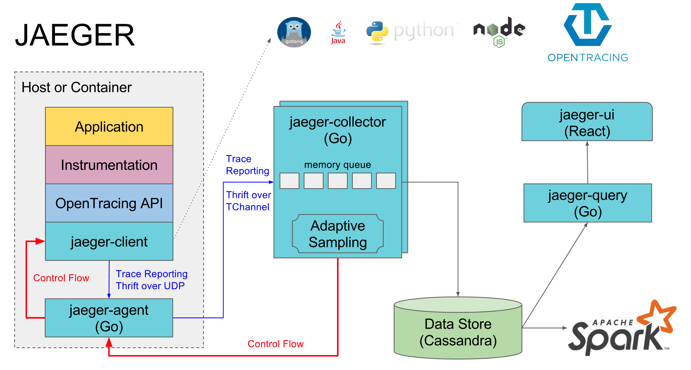

[参考](https://www.jaegertracing.io/docs/1.14/deployment/)
[参考2](https://my.oschina.net/u/2548090/blog/1821372)


```
如果你的数据量特别多，使用kafka缓冲一下也是可以的(组件jaeger-ingester）这里不介绍

-e ES_USERNAME=elastic
注意，ES_USERNAME、ES_PASSWORD这两个环境变量，当你的elasticsearch未设置账号密码时，你可以不填，也可以填上默认值，elasticsearch的默认ES_USERNAME=elastic，ES_PASSWORD=changeme

安装收集器:
docker pull jaegertracing/jaeger-collector:1.14.0 #41MB

docker run -d --name jaeger-collector --restart=always --link es7.4:elasticsearch -e SPAN_STORAGE_TYPE=elasticsearch -e ES_SERVER_URLS=http://elasticsearch:9200  -p 14267:14267 -p 14268:14268 -p 9421:9411 jaegertracing/jaeger-collector:1.14.0

9411 是 zipkin的端口，所以改一下

安装界面:
docker pull jaegertracing/jaeger-query:1.14.0  #44MB

docker run -d --name jaeger-query --restart=always --link es7.4:elasticsearch -e SPAN_STORAGE_TYPE=elasticsearch -e ES_SERVER_URLS=http://elasticsearch:9200 -p 16686:16686/tcp jaegertracing/jaeger-query:1.14.0


安装agent:[参考](https://www.jaegertracing.io/docs/1.14/deployment/#discovery-system-integration)
docker pull jaegertracing/jaeger-agent:1.14.0 #27MB

docker run  -d  --name jaeger-agent --restart=always  --link jaeger-collector:jaegercollector -p 5775:5775/udp   -p 6831:6831/udp   -p 6832:6832/udp   -p 5778:5778/tcp   jaegertracing/jaeger-agent:1.14.0   --reporter.grpc.host-port=jaegercollector:14250

安装服务依赖:[参考](https://hub.docker.com/r/jaegertracing/spark-dependencies)
docker pull jaegertracing/spark-dependencies   #210MB

docker run --rm -d --name  spark-dependencies --link es7.4:elasticsearch   --env STORAGE=elasticsearch --env ES_NODES=http://elasticsearch:9200 jaegertracing/spark-dependencies

--rm  跑完删除容器

这里要做一个定时任务
```

端口说明:
elasticsearch暴露如下端口

端口号 |	协议 |	功能
-|-|-
9200 | HTTP |	通过http协议连接es使用的端口
9300 | TCP |	通过tcp协议连接es使用的端口
 

agent 暴露如下端口

端口号 | 协议 |	功能
-|-|-
5775 | UDP |	通过兼容性 thrift 协议，接收 zipkin thrift 类型的数据
6831 | UDP |	通过二进制 thrift 协议，接收 jaeger thrift 类型的数据
6832 | UDP |	通过二进制 thrift 协议，接收 jaeger thrift 类型的数据
5778 | HTTP |	可用于配置采样策略
collector 暴露如下端口

端口号	| 协议	| 功能
-|-|-
14267 |	TChannel |	用于接收 jaeger-agent 发送来的 jaeger.thrift 格式的 span
14268 |	HTTP |	能直接接收来自客户端的 jaeger.thrift 格式的 span
9411 |	HTTP |	能通过 JSON 或 Thrift 接收 Zipkin spans，默认关闭
query 暴露如下端口

端口号|	协议|	功能
-|-|-
16686| HTTP |	1. /api/* - API 端口路径 2. / - Jaeger UI 路径




```
# agent收集器 (1.15 客户端)
docker run -itd \
  --name=jaeger-agent \
  -p6831:6831/udp \
  -p6832:6832/udp \
  -p5778:5778/tcp \
  -p5775:5775/udp \
  -p14271:14271/tcp \
  --restart=always \
  jaegertracing/jaeger-agent:1.15 \
  --admin-http-port=14271 \
  --reporter.grpc.host-port=192.168.110.253:14250


# collector集成 (1.15)
docker run -itd \
    --name=jaeger-collector \
    -p 14250:14250\
    -p 14267:14267 \
    -p 14268:14268 \
    -p 9411:9411 \
	-p 14269:14269 \
    -e COLLECTOR_ZIPKIN_HTTP_PORT=9411 \
    -e SPAN_STORAGE_TYPE=elasticsearch \
    -e ES_SERVER_URLS=http://192.168.110.253:9200 \
    --restart=always \
    jaegertracing/jaeger-collector:1.15 \
	--admin-http-port=14269 
	
	
--reporter.grpc.host-port=192.168.110.253:14250  (加了就起不来)

单连接，无负载平衡。如果指定单个，则为默认设置host:port。（例如：--reporter.grpc.host-port=jaeger-collector.jaeger-infra.svc:14250）
主机名和循环负载均衡的静态列表。这是用逗号分隔的地址列表得到的。（例如：reporter.grpc.host-port=jaeger-collector1:14250,jaeger-collector2:14250,jaeger-collector3:14250）
动态DNS解析和循环负载平衡。要获得此行为，请在地址dns:///前面加上，并且gRPC将尝试使用SRV记录（用于外部负载平衡），TXT记录（用于服务配置）和A记录来解析主机名。有关更多信息，请参阅gRPC名称解析文档和dns_resolver.go实现。（例如：--reporter.grpc.host-port=dns:///jaeger-collector.jaeger-infra.svc:14250）


# queryUI界面 (1.15)
docker run -dit  \
  --name=jaeger-query \
  -p 16686:16686 \
  -p 16687:16687 \
  -e SPAN_STORAGE_TYPE=elasticsearch \
  -e ES_SERVER_URLS=http://192.168.110.253:9200 \
  --restart=always \
  jaegertracing/jaeger-query:1.15 \
  --admin-http-port=16687
```

## 兼容opentelemetry
```
docker run --name jaeger \
  -e COLLECTOR_OTLP_ENABLED=true \
  -p 16686:16686 \
  -p 4317:4317 \
  -p 4318:4318 \
  jaegertracing/all-in-one:1.51
```

```
4317	gRPC	n/a	Accepts traces in OpenTelemetry OTLP format  (Protobuf).
4318	HTTP	/v1/traces	Accepts traces in OpenTelemetry OTLP format  (Protobuf and JSON).
```
