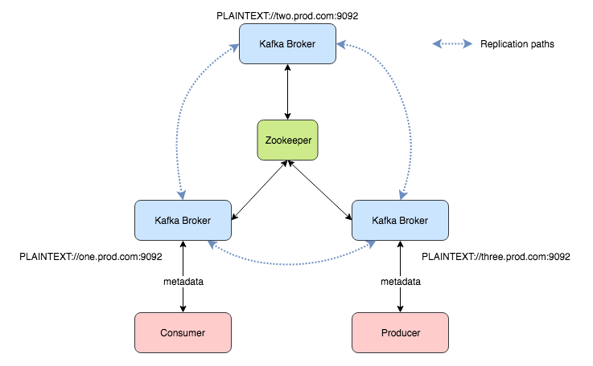
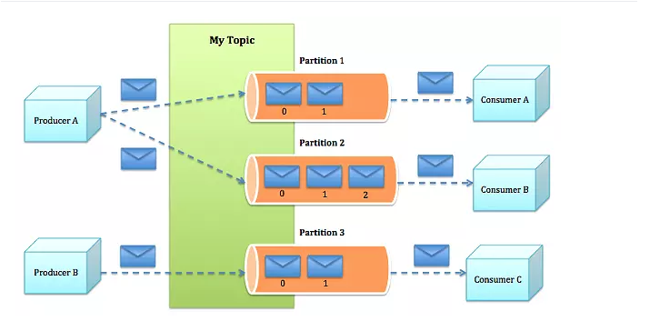

docker 安装kafka
参考地址：https://blog.csdn.net/lblblblblzdx/article/details/80548294
https://github.com/wurstmeister/kafka-docker
```
docker pull wurstmeister/kafka:2.12-2.3.0

docker run -d --name kafka --publish 9092:9092 --link zookeeper:zookeeper --env KAFKA_ZOOKEEPER_CONNECT=zookeeper:2181  --env KAFKA_ADVERTISED_PORT=9092  wurstmeister/kafka:2.12-2.3.0


https://yq.aliyun.com/articles/657849

HOSTNAME_COMMAND: ""
KAFKA_ADVERTISED_LISTENERS: INSIDE://:9092,OUTSIDE://_{HOSTNAME_COMMAND}:9094
KAFKA_LISTENERS: INSIDE://:9092,OUTSIDE://:9094
KAFKA_LISTENER_SECURITY_PROTOCOL_MAP: INSIDE:PLAINTEXT,OUTSIDE:PLAINTEXT
KAFKA_INTER_BROKER_LISTENER_NAME: INSIDE


--volume /d/dockerv/kafka/localtime:/etc/localtime
--env  KAFKA_LISTENERS=192.168.59.101
192.168.59.101 改为宿主机器的IP地址，如果不这么设置，可能会导致在别的机器上访问不到kafka。


进入kafka容器的命令行
 docker exec -it kafka /bin/bash


安装管理界面:
docker pull sheepkiller/kafka-manager

```


关键名词：
broker：kafka集群包含一个或者多个服务器，服务器就称作broker
producer：负责发布消息到broker
consumer：消费者，从broker获取消息
topic：发布到kafka集群的消息类别。
partition：每个topic划分为多个partition。
group：每个partition分为多个group