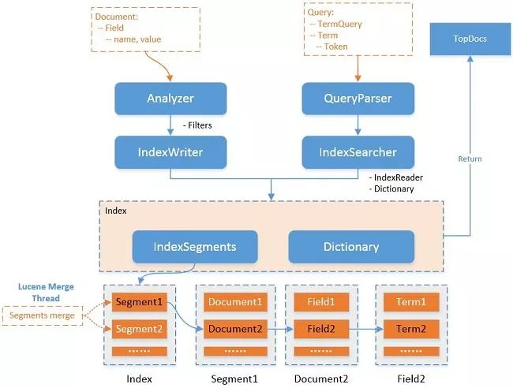

<!-- toc -->
[TOC]
# ES优化
https://learnku.com/elasticsearch
[十亿级数据ES搜索怎么优化](https://www.toutiao.com/i6836213244743385611)

filesystem cache 加大分配内存
数据预热  定时查询热数据
冷热分离
scroll分页


## 分片个数计算

SN(分片数) = IS(索引大小) / 30

NN(节点数) = SN(分片数) + MNN(主节点数[无数据]) + NNN(负载节点数)

假设有300G大小的数据文件

- 每一个分片数据文件小于30GB
- 每一个索引中的一个分片对应一个节点
- 节点数大于等于分片数



在Lucene中，分为索引(录入)与检索(查询)两部分，索引部分包含分词器、过滤器、字符映射器等，检索部分包含查询解析器等。

一个Lucene索引包含多个segments，一个segment包含多个文档，每个文档包含多个字段，每个字段经过分词后形成一个或多个term。

## ES优化1
https://www.elastic.co/guide/en/elasticsearch/reference/current/tune-for-indexing-speed.html

1. 关闭不需要字段的doc values。

2. 尽量使用keyword替代一些long或者int之类，term查询总比range查询好 (参考lucene说明 http://lucene.apache.org/core/7_4_0/core/org/apache/lucene/index/PointValues.html)。

3. 关闭不需要查询字段的_source功能，不将此存储仅ES中，以节省磁盘空间。

4. 评分消耗资源，如果不需要可使用filter过滤来达到关闭评分功能，score则为0，如果使用constantScoreQuery则score为1。

5. 关于分页：

from + size: 每分片检索结果数最大为 from + size，假设from = 20, size = 20，则每个分片需要获取20 * 20 = 400条数据，多个分片的结果在协调节点合并(假设请求的分配数为5，则结果数最大为 400*5 = 2000条) 再在内存中排序后然后20条给用户。这种机制导致越往后分页获取的代价越高，达到50000条将面临沉重的代价，默认from + size默认如下：index.max_result_window ：10000

search_after: 使用前一个分页记录的最后一条来检索下一个分页记录，在我们的案例中，首先使用from+size，检索出结果后再使用search_after，在页面上我们限制了用户只能跳5页，不能跳到最后一页。

scroll 用于大结果集查询，缺陷是需要维护scroll_id

6. 关于排序：我们增加一个long字段，它用于存储时间和ID的组合(通过移位即可)，正排与倒排性能相差不明显。

7. 关于CPU消耗，检索时如果需要做排序则需要字段对比，消耗CPU比较大，如果有可能尽量分配16cores以上的CPU，具体看业务压力。

8. 关于合并被标记删除的记录，我们设置为0表示在合并的时候一定删除被标记的记录，默认应该是大于10%才删除："merge.policy.expunge_deletes_allowed": "0"。


### 1.1、设计阶段调优

（1）根据业务增量需求，采取基于日期模板创建索引，通过 roll over API 滚动索引；

（2）使用别名进行索引管理；

（3）每天凌晨定时对索引做 force_merge 操作，以释放空间；
```
补充：关于 Lucene 的 Segement：

（1）Lucene 索引是由多个段组成，段本身是一个功能齐全的倒排索引。

（2）段是不可变的，允许 Lucene 将新的文档增量地添加到索引中，而不用从头重建索引。

（3）对于每一个搜索请求而言，索引中的所有段都会被搜索，并且每个段会消耗CPU 的时钟周、文件句柄和内存。这意味着段的数量越多，搜索性能会越低。

（4）为了解决这个问题，Elasticsearch 会合并小段到一个较大的段，提交新的合并段到磁盘，并删除那些旧的小段。
```
（4）采取冷热分离机制，热数据存储到 SSD，提高检索效率；冷数据定期进行 shrink操作，以缩减存储；

（5）采取 curator 进行索引的生命周期管理；

（6）仅针对需要分词的字段，合理的设置分词器；

（7）Mapping 阶段充分结合各个字段的属性，是否需要检索、是否需要存储等。……..

### 1.2、写入调优

（1）写入前副本数设置为 0；

（2）写入前关闭 refresh_interval 设置为-1，禁用刷新机制；

（3）写入过程中：采取 bulk 批量写入；

（4）写入后恢复副本数和刷新间隔；

（5）尽量使用自动生成的 id。

1.3、查询调优

（1）禁用 wildcard；

（2）禁用批量 terms（成百上千的场景）；

（3）充分利用倒排索引机制，能 keyword 类型尽量 keyword；

（4）数据量大时候，可以先基于时间敲定索引再检索；

（5）设置合理的路由机制。

### 1.4、其他调优

部署调优，业务调优等。

3.1 动态索引层面

基于模板+时间+rollover api 滚动创建索引，举例：设计阶段定义：blog 索引的模板格式为：blog_index_时间戳的形式，每天递增数据。这样做的好处：不至于数据量激增导致单个索引数据量非常大，接近于上线 2 的32 次幂-1，索引存储达到了 TB+甚至更大。

一旦单个索引很大，存储等各种风险也随之而来，所以要提前考虑+及早避免。

3.2 存储层面

冷热数据分离存储，热数据（比如最近 3 天或者一周的数据），其余为冷数据。

对于冷数据不会再写入新数据，可以考虑定期 force_merge 加 shrink 压缩操作，节省存储空间和检索效率。

3.3 部署层面

一旦之前没有规划，这里就属于应急策略。

结合 ES 自身的支持动态扩展的特点，动态新增机器的方式可以缓解集群压力，注意：如果之前主节点等规划合理，不需要重启集群也能完成动态新增的。

### Elasticsearch 在部署时，对 Linux 的设置有哪些优化方法
面试官：想了解对 ES 集群的运维能力。

解答：

（1）关闭缓存 swap;

（2）堆内存设置为：Min（节点内存/2, 32GB）;

（3）设置最大文件句柄数；

（4）线程池+队列大小根据业务需要做调整；

（5）磁盘存储 raid 方式——存储有条件使用 RAID10，增加单节点性能以及避免单节点存储故障。

### Elasticsearch 中的节点（比如共 20 个），其中的 10 个
选了一个 master，另外 10 个选了另一个 master，怎么办？

（1）当集群 master 候选数量不小于 3 个时，可以通过设置最少投票通过数量（discovery.zen.minimum_master_nodes）超过所有候选节点一半以上来解决脑裂问题；

（3）当候选数量为两个时，只能修改为唯一的一个 master 候选，其他作为 data节点，避免脑裂问题。

其实是个脑裂问题，也是不存在的，至少要11个节点投票才能选出master

## ES优化2
### 查看profile
在原有参数中加入"profile": true，查看ES处理搜索请求的耗时分布情况；

```json
GET single-a/_search
{
  "query": { "match_all": {} },
  "profile": true
}

"profile" : {
    "shards" : [
      {
        "id" : "[CwFkz48MS_mJ_qivr8vghw][security-user-single-a][0]",
        "searches" : [
          {
            "query" : [
              {
                "type" : "MatchAllDocsQuery",
                "description" : "*:*",
                "time_in_nanos" : 76916,
                "breakdown" : {
                  "set_min_competitive_score_count" : 2,
                  "match_count" : 0,
                  "shallow_advance_count" : 0,
                  "set_min_competitive_score" : 3871,
                  "next_doc" : 5861,
                  "match" : 0,
                  "next_doc_count" : 10,
                  "score_count" : 10,
                  "compute_max_score_count" : 0,
                  "compute_max_score" : 0,
                  "advance" : 2813,
                  "advance_count" : 2,
                  "score" : 23293,
                  "build_scorer_count" : 4,
                  "create_weight" : 13220,
                  "shallow_advance" : 0,
                  "create_weight_count" : 1,
                  "build_scorer" : 27829
                }
              }
            ],
            "rewrite_time" : 2444,
            "collector" : [
              {
                "name" : "CancellableCollector",
                "reason" : "search_cancelled",
                "time_in_nanos" : 109386,
                "children" : [
                  {
                    "name" : "SimpleTopScoreDocCollector",
                    "reason" : "search_top_hits",
                    "time_in_nanos" : 68751
                  }
                ]
              }
            ]
          }
        ],
        "aggregations" : [ ]
      }
    ]
  }
```
### 查看segment
索引文件是由多个segment组成，这里是读取多个segment到内存进行查询匹配，打开segment分布情况发现一个索引节点有多个小的segment，判断是由于打开多个文件随机读写提升了读取索引数据耗时；

```
http://xx:9200/_cat/segments/single-a?v&h=shard,segment,size,size.memory

shard segment    size size.memory
0     _0        1.1mb        5454
0     _b      695.1kb        3812
0     _c        3.2kb         953
0     _d        3.2kb         953
0     _e        3.2kb         953
0     _1        1.1mb        5357
0     _b      698.3kb        3693
```
#### 手动合并segment
几分钟后合并完成，并进行搜索，性能显著提升，问题解决；
```
curl -XPOST 'http://xxxx:9200/_forcemerge?max_num_segments=1'
```

#### 永久解决
加配置项index.merge.policy.floor_segment=设置每个segment最小值，index.merge.scheduler.max_thread_count=ES集群负载较低时，后台合并segment线程数，一般=核数/2；
```
curl -XPUT http://xxxx:9200/index_name/_settings -d '{"index.merge.policy.floor_segment":"100mb"}'
curl -XPUT http://xx:9200/index_name/_settings -d '{"index.merge.scheduler.max_thread_count":"2"}'
```

每个segment是一个包含正排（空间占比90~95%）+倒排（空间占比5~10%）的完整索引文件，每次搜索请求会将所有segment中的倒排索引部分加载到内存，进行查询和打分，然后将命中的文档号拿到正排中召回完整数据记录；如果不对segment做配置，提交又特别频繁的话，就会导致查询性能下降
### 总结
#### 搜索性能优化建议：
1. segment合并；索引节点粒度配置index.merge.policy.floor_segment=xx mb；segment默认最小值2M
2. 索引时不需要做打分的字段，关闭norms选项，减少倒排索引内存占用量；字段粒度配置omit_norms=true；
3. BoolQuery 优于 TermQuery；目前需求场景全部不需要用到分词，所以尽可能用BoolQuery；
4. 避免使用对象嵌套结构组建document，建议优化为一个扁平化结构，查询多个扁平化结构在内存做聚合关联；
5. 设定字符串类型为不分词，可以用于字符串排序，但是比起数字排序会消耗cpu，搜索效率更低，慎用；
6. cache设置，就目前数据业务类型，保持默认配置即可，设值fielddata.cache之类的缓存命中率低，反而吃掉了ES集群的一部分内存；

#### 索引性能优化建议：
1. 调小索引副本数；针对索引节点粒度：`curl -XPUT http://xxxx:9200/m_pd_cu_id_gps_2es_inc_hi_out/_settings -d '{"number_of_replicas":1}'`
2. 设置延迟提交，延迟提交意味着数据提交到搜索可见，有延迟，需要结合业务配置；针对索引节点粒度：`curl -XPUT http://xxxx:9200/m_pd_cu_id_gps_2es_inc_hi_out/_settings -d '{"index.refresh_interval":"10s"}'`；默认值1s；
3. 设置索引缓冲buffer，最大512m，默认值是jvm的10%；ES集群粒度config/elasticsearch.yml ：`indices.memory.index_buffer_size = 10%`

4. 适当减少备份数，必要字段只需要提供搜索，不需要返回则将stored设为false；

如果ES提交索引请求达到瓶颈，一般任务队列task-queue为50，可以设置task-queue队列，提升搜索集群索引能力；


以上涉及到索引节点/字段 粒度的配置，均可在创建时代码指定；