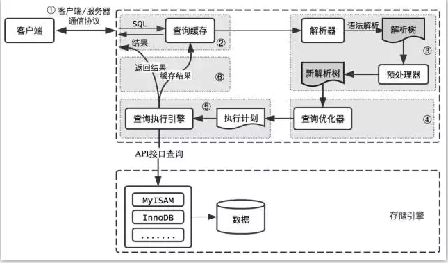
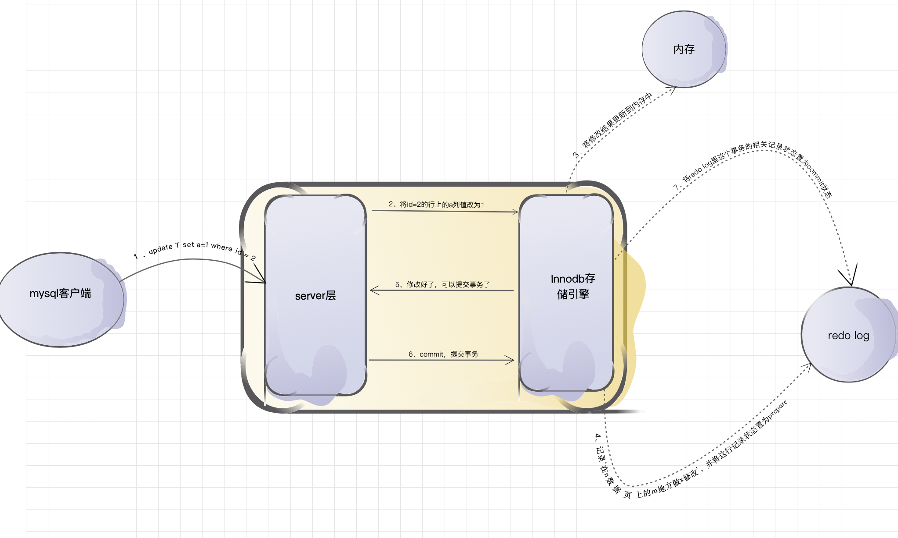

[TOC]
# binlog浅析

## binlog浅析

### 什么是binlog？
全称：Binary Log （二进制日志）,包含描述数据库更改的“ 事件 ”，例如表创建操作或对表数据的更改。二进制日志不用于诸如select或 show不修改数据的语句 。要记录所有语句（例如，标识问题查询），请使用常规查询日志。 

我们都知道MYSQL有两层结构，第一层：server层，里面包含连接器、查询缓存、解析器、优化器、执行器，第二次是存储引擎层，例如：InnoDB、MyISAM、Memory 等多个存储引擎

binlog产生于mysql中的server层。

若是mysql采用的为innodb引擎（这里是经典的两阶段提交）：


### binlog文件都有什么？

binlog文件包含两种类型：

- 索引文件（文件名后缀为.index）用于记录哪些日志文件正在被使用
- 日志文件（文件名后缀为.00000*）记录数据库所有的DDL和DML(除了数据查询语句)语句事件。

1. 索引文件大小：我们可以通过 max_binlog_size  参数设置binlog文件的大小。Binlog最大值，最大和默认值是1GB，该设置并不能严格控制Binlog的大小，尤其是Binlog比较靠近最大值而又遇到一个比较大事务时，为了保证事务的完整性，不可能做切换日志的动作，只能将该事务的所有SQL都记录进当前日志，直到事务结束

2. 索引文件删除：binlog的删除可以手工删除或自动删除。通过设置 expire_logs_days 实现自动删除 

手动删除需登录mysql后执行如下命令：
```
mysql> reset master;        //删除master的binlog，即手动删除所有的binlog日志
mysql> reset slave;          //删除slave的中继日志
mysql> purge master logs before '2019-07-07 17:20:00';         //删除指定日期以前的日志索引中binlog日志文件
mysql> purge master logs to 'binlog.000003';       //删除指定日志文件的日志索引中binlog日志文件
```
查看所有二进制日志
```
show binary logs;
```

可以通过如下命令确认目前正在使用binlog文件：
```
-- 通过这句话查询到目前写入的是哪个binlog文件
show master status;
```
然后可以跟踪下日志的内容了
```
-- 查看第一个
show binlog events;
-- 然后看下记录的内容
show binlog events in 'binlogs.000003';
```
binlog是否开启：
```
show variables like 'log_bin';
```
binlog 大小：
```
show variables like 'max_binlog_size'
```

[binlog浅析](https://www.cnblogs.com/fengtingxin/p/11104758.html)


## 其它
### 什么时候切换binlog
手动切换：
flush logs 或者flush binary logs

被动触发：
show variables like 'max_binlog_size'

达到1G，自动切换，但是并不是准确的1G,要保证每个事务在一个日志中，要等到最后一个事务做完再Rotate。


### canal
https://dev.mysql.com/doc/refman/5.5/en/binary-log.html

- mysql的binlog是多文件存储，定位一个LogEvent需要通过binlog filename + binlog position，进行定位
- mysql的binlog数据格式，按照生成的方式，主要分为：statement-based、row-based、mixed。
show variables like 'binlog_format';

目前canal支持所有模式的增量订阅(但配合同步时，因为statement只有sql，没有数据，无法获取原始的变更日志，所以一般建议为ROW模式)
# binlog的格式都有什么？
## Statement
### Statement 优点
历史悠久，技术成熟；
产生的 binlog 文件较小；
binlog 中包含了所有数据库修改信息，可以据此来审核数据库的安全等情况；
binlog 可以用于实时的还原，而不仅仅用于复制；
主从版本可以不一样，从服务器版本可以比主服务器版本高；

### Statement 缺点：
不是所有的 UPDATE 语句都能被复制，尤其是包含不确定操作的时候；
调用具有不确定因素的 UDF 时复制也可能出现问题；
运用以下函数的语句也不能被复制：
* LOAD_FILE()
* UUID()
* USER()
* FOUND_ROWS()
* SYSDATE() (除非启动时启用了 –sysdate-is-now 选项)
INSERT … SELECT 会产生比 RBR 更多的行级锁；
复制须要执行全表扫描 (WHERE 语句中没有运用到索引) 的 UPDATE 时，须要比 row 请求更多的行级锁；
对于有 AUTO_INCREMENT 字段的 InnoDB 表而言，INSERT 语句会阻塞其他 INSERT 语句；
对于一些复杂的语句，在从服务器上的耗资源情况会更严重，而 row 模式下，只会对那个发生变化的记录产生影响；
存储函数(不是存储流程 )在被调用的同时也会执行一次 NOW() 函数，这个可以说是坏事也可能是好事；
确定了的 UDF 也须要在从服务器上执行；
数据表必须几乎和主服务器保持一致才行，否则可能会导致复制出错；
执行复杂语句如果出错的话，会消耗更多资源；

## ROW
### Row 优点

任何情况都可以被复制，这对复制来说是最安全可靠的；
和其他大多数数据库系统的复制技能一样；
多数情况下，从服务器上的表如果有主键的话，复制就会快了很多；
复制以下几种语句时的行锁更少：
* INSERT … SELECT
* 包含 AUTO_INCREMENT 字段的 INSERT
* 没有附带条件或者并没有修改很多记录的 UPDATE 或 DELETE 语句
执行 INSERT，UPDATE，DELETE 语句时锁更少；
从服务器上采用多线程来执行复制成为可能；

### Row 缺点
生成的 binlog 日志体积大了很多；
复杂的回滚时 binlog 中会包含大量的数据；
主服务器上执行 UPDATE 语句时，所有发生变化的记录都会写到 binlog 中，而 statement 只会写一次，这会导致频繁发生 binlog 的写并发请求；
UDF 产生的大 BLOB 值会导致复制变慢；
不能从 binlog 中看到都复制了写什么语句(加密过的)；
当在非事务表上执行一段堆积的 SQL 语句时，最好采用 statement 模式，否则很容易导致主从服务器的数据不一致情况发生；
另外，针对系统库 MySQL 里面的表发生变化时的处理准则如下：
如果是采用 INSERT，UPDATE，DELETE 直接操作表的情况，则日志格式根据 binlog_format 的设定而记录；
如果是采用 GRANT，REVOKE，SET PASSWORD 等管理语句来做的话，那么无论如何都要使用 statement 模式记录；
使用 statement 模式后，能处理很多原先出现的主键重复问题；

## Mixed
是以上两种level的混合使用，一般的语句修改使用statment格式保存binlog，如一些函数，statement无法完成主从复制的操作，则采用row格式保存binlog,MySQL会根据执行的每一条具体的sql语句来区分对待记录的日志形式，也就是在Statement和Row之间选择一种.新版本的MySQL中队row level模式也被做了优化，并不是所有的修改都会以row level来记录，像遇到表结构变更的时候就会以statement模式来记录。至于update或者delete等修改数据的语句，还是会记录所有行的变更。
在slave日志同步过程中，对于使用now这样的时间函数，MIXED日志格式，会在日志中产生对应的unix_timestamp()*1000的时间字符串，slave在完成同步时，取用的是sqlEvent发生的时间来保证数据的准确性。另外对于一些功能性函数slave能完成相应的数据同步，而对于上面指定的一些类似于UDF函数，导致Slave无法知晓的情况，则会采用ROW格式存储这些Binlog，以保证产生的Binlog可以供Slave完成数据同步。