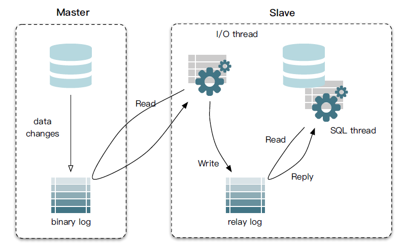
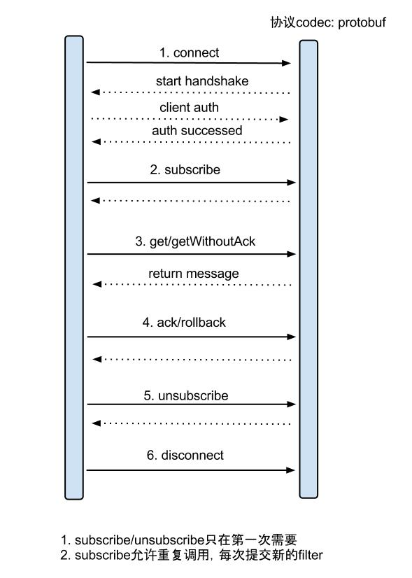
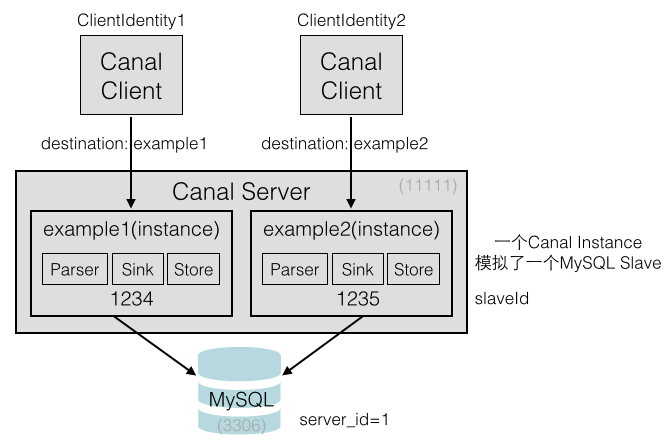
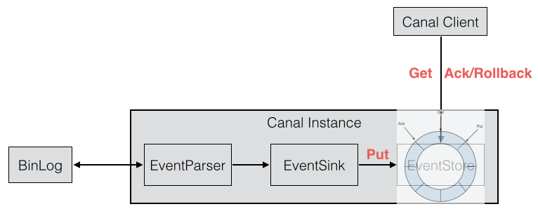
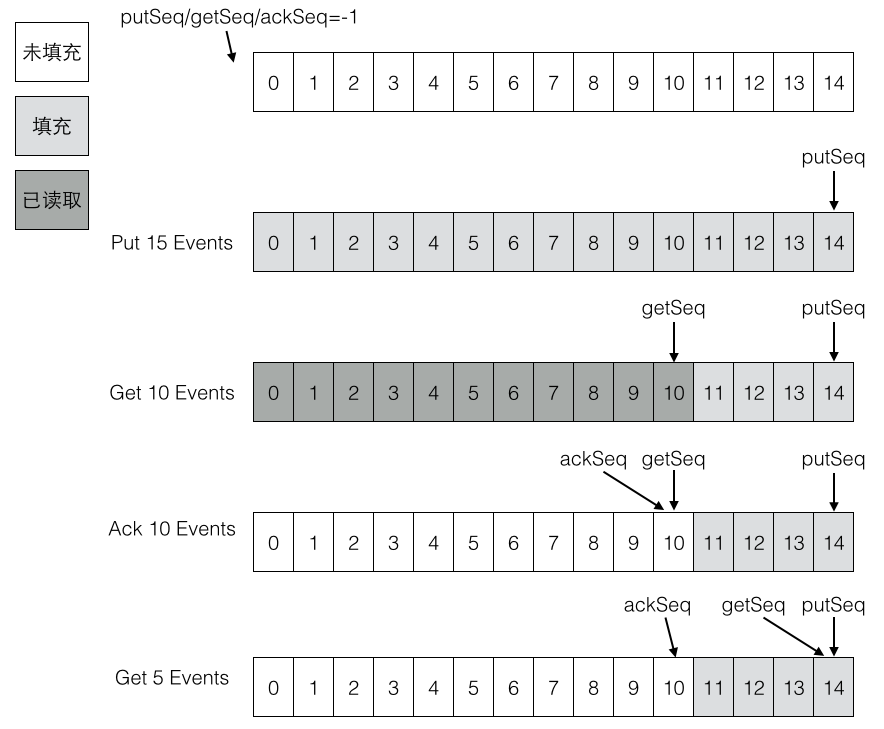
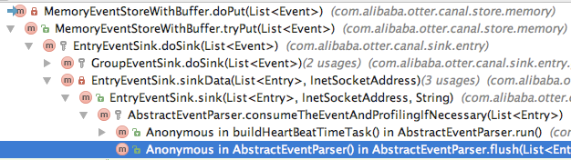
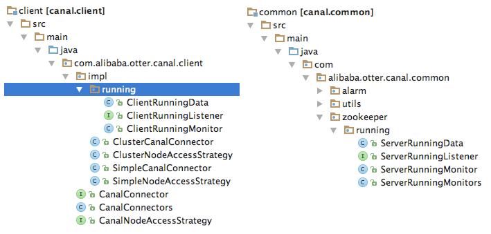
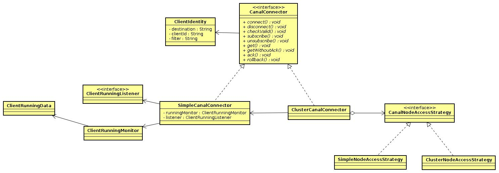
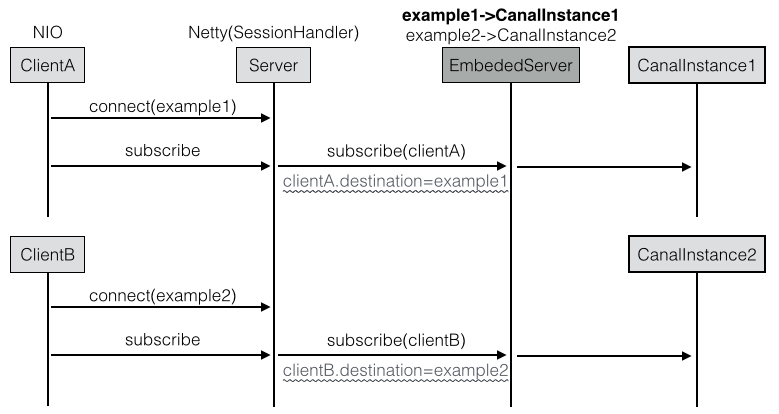
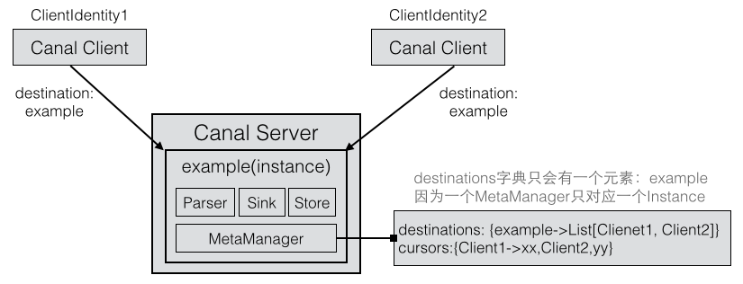

<!-- toc -->
[TOC]

# 深入解析中间件之-Canal

[canal](https://github.com/alibaba/canal): 阿里巴巴mysql数据库binlog的增量订阅&消费组件  

## MySQL binlog


### MySQL主从复制

mysql服务端修改配置并重启
```
$ vi /etc/my.cnf  
[mysqld]  
log-bin=mysql-bin  
binlog-format=ROW  
server_id=1  
  
$ mysql -uroot  
CREATE USER canal IDENTIFIED BY 'canal';   
GRANT ALL PRIVILEGES ON *.* TO 'canal'@'%' ;  
FLUSH PRIVILEGES;  
  
$ sudo service mysqld start  
```
> 问题：创建canal用户的目的是什么？直接使用现有的用户名可以吗，比如root。  
> 答案：有些用户没有REPLICATION SLAVE, REPLICATION CLIENT的权限，用这些用户连接canal时，无法获取到binlog。  
> 这里的canal用户授权了全部权限，所以客户端可以从canal中获取binlog。

明确两个概念：canal server连接mysql，客户端连接canal server。

*   canal指的是canal server，它会读取mysql的binlog，解析后存储起来
*   客户端指的是消费canal server的binlog

本机连接服务端，验证binlog的格式是ROW
```
$ mysql -h192.168.6.52 -ucanal -pcanal  
mysql> show variables like '%binlog_format%';  
+---------------+-------+  
| Variable_name | Value |  
+---------------+-------+  
| binlog_format | ROW   |  
+---------------+-------+  
```
mysql主从复制的原理：

*   master将改变记录到二进制日志(binary log)中；
*   slave将master的binary log events拷贝到它的中继日志(relay log)；
*   slave重做中继日志中的事件，将改变反映它自己的数据。



### binlog
在启动canal之前，先来了解下什么是mysql的binlog:
```
mysql> show binlog events;                                                                ```
```
mysql数据文件下会生成mysql-bin.xxx的binlog文件，以及索引文件
```
$ ll /var/lib/mysql/  
总用量 26228  
drwx------ 2 mysql mysql     4096 10月 11 14:05 canal_test  
-rw-rw---- 1 mysql mysql 10485760 9月  30 22:12 ibdata1  
-rw-rw---- 1 mysql mysql  5242880 10月 11 09:57 ib_logfile0  
-rw-rw---- 1 mysql mysql  5242880 10月 11 09:57 ib_logfile1  
drwx------ 2 mysql mysql     4096 8月   2 11:01 mysql  
-rw-rw---- 1 mysql mysql    18451 8月   2 11:01 mysql-bin.000001  
-rw-rw---- 1 mysql mysql   929226 8月   2 11:01 mysql-bin.000002  
-rw-rw---- 1 mysql mysql  4890698 9月  30 22:12 mysql-bin.000003  
-rw-rw---- 1 mysql mysql      897 10月 11 14:06 mysql-bin.000004  
-rw-rw---- 1 mysql mysql       76 10月 11 09:57 mysql-bin.index  
srwxrwxrwx 1 mysql mysql        0 10月 11 09:57 mysql.sock  
```
针对mysql的操作都会有二进制的事件记录到binlog文件中。下面的一些操作包括创建用户，授权，创建数据库，创建表，插入一条记录。
```
$ sudo strings /var/lib/mysql/mysql-bin.000004  
5.1.73-log  
CREATE USER canal IDENTIFIED BY 'canal'  
root    localhost  
GRANT ALL PRIVILEGES ON *.* TO 'canal'@'%'  
FLUSH PRIVILEGES  
canal_test  
create database canal_test    ===》创建数据库  
canal_test  
create table test (   uid int (4) primary key not null auto_increment,   name varchar(10) not null)  ==》创建表  
canal_test  
BEGIN     ==》插入记录，这里有事务。但是没有把具体的语句打印出来  
canal_test  
test  
canal_test  
COMMIT  
```
## Canal QuickStart

### canal & config

部署canal server到6.52，并启动。查看canal的日志：
```
[ canal]$ cat logs/canal/canal.log  
2017-10-11 11:31:52.076 [main] INFO  com.alibaba.otter.canal.deployer.CanalLauncher - ## start the canal server.  
2017-10-11 11:31:52.151 [main] INFO  com.alibaba.otter.canal.deployer.CanalController - ## start the canal server[192.168.6.52:11111]  
2017-10-11 11:31:52.644 [main] INFO  com.alibaba.otter.canal.deployer.CanalLauncher - ## the canal server is running now ......  
```
查看instance的日志：
```
[ canal]$ cat logs/example/example.log  
2017-10-11 11:31:52.435 [main] INFO  c.a.o.c.i.spring.support.PropertyPlaceholderConfigurer - Loading properties file from class path resource [canal.properties]  
2017-10-11 11:31:52.444 [main] INFO  c.a.o.c.i.spring.support.PropertyPlaceholderConfigurer - Loading properties file from class path resource [example/instance.properties]  
2017-10-11 11:31:52.587 [main] INFO  c.a.otter.canal.instance.spring.CanalInstanceWithSpring - start CannalInstance for 1-example  
2017-10-11 11:31:52.599 [main] INFO  c.a.otter.canal.instance.core.AbstractCanalInstance - start successful....  
2017-10-11 11:31:52.679 [destination = example , address = /127.0.0.1:3306 , EventParser] WARN  c.a.otter.canal.parse.inbound.mysql.MysqlEventParser - prepare to find start position just show master status  
```
canal server的conf下有几个配置文件
```
➜  canal.deployer-1.0.24 tree conf  
conf  
├── canal.properties  
├── example  
│   └── instance.properties  
├── logback.xml  
└── spring  
 ├── default-instance.xml  
 ├── file-instance.xml  
 ├── group-instance.xml  
 ├── local-instance.xml  
 └── memory-instance.xml  
```
先来看`canal.properties`的**common**属性前四个配置项：
```
canal.id= 1  
canal.ip=  
canal.port= 11111  
canal.zkServers=  
```
canal.id是canal的编号，在集群环境下，不同canal的id不同，注意它和mysql的server_id不同。  
ip这里不指定，默认为本机，比如上面是192.168.6.52，端口号是11111。zk用于canal cluster。

再看下`canal.properties`下**destinations**相关的配置：
```

#################################################  
#########       destinations        #############   
#################################################  
canal.destinations = example  
canal.conf.dir = ../conf  
canal.auto.scan = true  
canal.auto.scan.interval = 5  
  
canal.instance.global.mode = spring   
canal.instance.global.lazy = false  
canal.instance.global.spring.xml = classpath:spring/file-instance.xml  
```
这里的canal.destinations = example可以设置多个，比如example1,example2，  
则需要创建对应的两个文件夹，并且每个文件夹下都有一个instance.properties文件。

全局的canal实例管理用spring，这里的`file-instance.xml`最终会实例化所有的destinations instances:

```
<bean class="com.alibaba.otter.canal.instance.spring.support.PropertyPlaceholderConfigurer" lazy-init="false">  
 <property name="ignoreResourceNotFound" value="true" />  
 <property name="systemPropertiesModeName" value="SYSTEM_PROPERTIES_MODE_OVERRIDE"/><!-- 允许system覆盖 -->  
 <property name="locationNames">  
 <list>  
 <value>classpath:canal.properties</value>  
 <value>classpath:${canal.instance.destination:}/instance.properties</value>  
 </list>  
 </property>  
</bean>  
<bean id="instance" class="com.alibaba.otter.canal.instance.spring.CanalInstanceWithSpring">  
 <property name="destination" value="${canal.instance.destination}" />  
 <property name="eventParser"><ref local="eventParser" /></property>  
 <property name="eventSink"><ref local="eventSink" /></property>  
 <property name="eventStore"><ref local="eventStore" /></property>  
 <property name="metaManager"><ref local="metaManager" /></property>  
 <property name="alarmHandler"><ref local="alarmHandler" /></property>  
</bean>  
```
比如`canal.instance.destination`等于example，就会加载`example/instance.properties`配置文件

example下instance.properties配置文件不需要修改。一个canal server可以运行多个canal instance。

```
#################################################  
## mysql serverId，这里的slaveId不能和myql集群中已有的server_id一样  
canal.instance.mysql.slaveId = 1234  
  
# position info 这里连接的是mysql master的地址。  
canal.instance.master.address = 127.0.0.1:3306  
canal.instance.master.journal.name =   
canal.instance.master.position =   
canal.instance.master.timestamp =   
  
#canal.instance.standby.address =   
#canal.instance.standby.journal.name =  
#canal.instance.standby.position =   
#canal.instance.standby.timestamp =   
  
# username/password  
canal.instance.dbUsername = canal  
canal.instance.dbPassword = canal  
canal.instance.defaultDatabaseName =  
canal.instance.connectionCharset = UTF-8  
  
canal.instance.filter.regex = .*\\\..*  
canal.instance.filter.black.regex =   
#################################################  
```
### simple client

在mysql上创建数据库，创建表，插入一条记录，再修改记录。
```
create database canal_test;  
use canal_test;  
create table test (   uid int (4) primary key not null auto_increment,   name varchar(10) not null);  
insert into test (name) values('10');  
```
修改[客户端测试例子](https://github.com/alibaba/canal/blob/master/example/src/main/java/com/alibaba/otter/canal/example/SimpleCanalClientTest.java)的连接信息。其中example对应了canal实例的名称。
```

public class SimpleCanalClientTest extends AbstractCanalClientTest {  
 public static void main(String args[]) {  
 String destination = "example";  
 CanalConnector connector = CanalConnectors.newSingleConnector(  
 new InetSocketAddress("192.168.6.52", 11111), destination, "canal", "canal");  
 }  
}  
```
> 注意：如果连接有错误，客户端测试例子会立即结束，打印## stop the canal client。正常的话，终端不会退出，会一直运行。

SimpleCanalClientTest控制台的结果如下：
```
****************************************************  
* Batch Id: [1] ,count : [2] , memsize : [263] , Time : 2017-10-11 14:06:06  
* Start : [mysql-bin.000004:396:1507701897000(2017-10-11 14:04:57)]   
* End : [mysql-bin.000004:491:1507701904000(2017-10-11 14:05:04)]   
****************************************************  
  
----------------> binlog[mysql-bin.000004:396] , name[canal_test,] , eventType : QUERY , executeTime : 1507701897000 , delay : 69710ms  
 sql ----> create database canal_test  
  
----------------> binlog[mysql-bin.000004:491] , name[canal_test,test] , eventType : CREATE , executeTime : 1507701904000 , delay : 62723ms  
 sql ----> create table test (   uid int (4) primary key not null auto_increment,   name varchar(10) not null)  
```
插入一条记录：（其中uid和name的update都等于true）
```

****************************************************  
* Batch Id: [2] ,count : [3] , memsize : [186] , Time : 2017-10-11 14:06:32  
* Start : [mysql-bin.000004:659:1507701989000(2017-10-11 14:06:29)]   
* End : [mysql-bin.000004:822:1507701989000(2017-10-11 14:06:29)]   
****************************************************  
  
================> binlog[mysql-bin.000004:659] , executeTime : 1507701989000 , delay : 3142ms  
 BEGIN ----> Thread id: 11  
----------------> binlog[mysql-bin.000004:785] , name[canal_test,test] , eventType : INSERT , executeTime : 1507701989000 , delay : 3154ms  
uid : 1    type=int(4)    update=true  
name : 10    type=varchar(10)    update=true  
----------------  
 END ----> transaction id: 0  
================> binlog[mysql-bin.000004:822] , executeTime : 1507701989000 , delay : 3179ms  
```
修改记录：（其中name的update等于true）
```
****************************************************  
* Batch Id: [3] ,count : [3] , memsize : [202] , Time : 2017-10-11 14:49:11  
* Start : [mysql-bin.000004:897:1507704547000(2017-10-11 14:49:07)]   
* End : [mysql-bin.000004:1076:1507704547000(2017-10-11 14:49:07)]   
****************************************************  
  
================> binlog[mysql-bin.000004:897] , executeTime : 1507704547000 , delay : 4048ms  
 BEGIN ----> Thread id: 13  
----------------> binlog[mysql-bin.000004:1023] , name[canal_test,test] , eventType : UPDATE , executeTime : 1507704547000 , delay : 4059ms  
uid : 1    type=int(4)  
name : zqhxuyuan    type=varchar(10)    update=true  
----------------  
 END ----> transaction id: 0  
================> binlog[mysql-bin.000004:1076] , executeTime : 1507704547000 , delay : 4096ms  
```
canal安装包下的example instance下除了example.log外，还有一个`meta.log`
```
[ canal]$ cat logs/example/meta.log  
2017-10-11 14:06:03.728 - clientId:1001 cursor:[mysql-bin.000004,396,1507701897000] address[/127.0.0.1:3306]  
2017-10-11 14:06:04.589 - clientId:1001 cursor:[mysql-bin.000004,491,1507701904000] address[localhost/127.0.0.1:3306]  
2017-10-11 14:06:29.589 - clientId:1001 cursor:[mysql-bin.000004,822,1507701989000] address[localhost/127.0.0.1:3306]  
2017-10-11 14:49:08.589 - clientId:1001 cursor:[mysql-bin.000004,1076,1507704547000] address[localhost/127.0.0.1:3306]  
```
## Cannal Internal Overview

### canal client & server

[canal client](https://github.com/alibaba/canal/blob/master/example/src/main/java/com/alibaba/otter/canal/example/AbstractCanalClientTest.java)与canal server之间是C/S模式的通信，客户端采用NIO，服务端采用Netty。  
canal server启动后，如果没有canal client，那么canal server不会去mysql拉取binlog。  
即Canal客户端主动发起拉取请求，服务端才会模拟一个MySQL Slave节点去主节点拉取binlog。  
通常Canal客户端是一个死循环，这样客户端一直调用get方法，服务端也就会一直拉取binlog。
```

public class AbstractCanalClientTest {  
 protected void process() {  
 int batchSize = 5 * 1024; // 一次请求拉取多条记录  
 try {  
 connector.connect(); // 先连接服务端  
 connector.subscribe(); // 订阅  
 // keep send request to canal server, thus canal server can fetch binlog from mysql  
 while (running) {   
 Message message = connector.getWithoutAck(batchSize); // 获取指定数量的数据  
 long batchId = message.getId();  
 int size = message.getEntries().size();  
 printSummary(message, batchId, size);  
 printEntry(message.getEntries());  
 connector.ack(batchId); // 提交确认  
 //connector.rollback(batchId); // 处理失败, 回滚数据  
 }  
 } finally {  
 connector.disconnect();  
 }  
 }  
}  
```
canal client与canal server之间属于增量订阅/消费，流程图如下：（其中C端是canal client，S端是canal server）



canal client调用[connect()](https://github.com/alibaba/canal/blob/master/client/src/main/java/com/alibaba/otter/canal/client/impl/SimpleCanalConnector.java#L129)方法时，发送的数据包（PacketType）类型为：

1.  [**HANDSHAKE**](https://github.com/alibaba/canal/blob/master/server/src/main/java/com/alibaba/otter/canal/server/netty/handler/HandshakeInitializationHandler.java)，
2.  [**CLIENTAUTHENTICATION**](https://github.com/alibaba/canal/blob/master/server/src/main/java/com/alibaba/otter/canal/server/netty/handler/ClientAuthenticationHandler.java)。

canal client调用`subscribe()`方法，类型为[**SUBSCRIPTION**]。

对应服务端采用netty处理RPC请求（[`CanalServerWithNetty`](https://github.com/alibaba/canal/blob/master/server/src/main/java/com/alibaba/otter/canal/server/netty/CanalServerWithNetty.java)）:
```

public class CanalServerWithNetty extends AbstractCanalLifeCycle implements CanalServer {  
 public void start() {  
 bootstrap.setPipelineFactory(new ChannelPipelineFactory() {  
 public ChannelPipeline getPipeline() throws Exception {  
 ChannelPipeline pipelines = Channels.pipeline();  
 pipelines.addLast(FixedHeaderFrameDecoder.class.getName(), new FixedHeaderFrameDecoder());  
 // 处理客户端的HANDSHAKE请求  
 pipelines.addLast(HandshakeInitializationHandler.class.getName(),  
 new HandshakeInitializationHandler(childGroups));  
 // 处理客户端的CLIENTAUTHENTICATION请求  
 pipelines.addLast(ClientAuthenticationHandler.class.getName(),  
 new ClientAuthenticationHandler(embeddedServer));  
  
 // 处理客户端的会话请求，包括SUBSCRIPTION，GET等  
 SessionHandler sessionHandler = new SessionHandler(embeddedServer);  
 pipelines.addLast(SessionHandler.class.getName(), sessionHandler);  
 return pipelines;  
 }  
 });  
 }  
}  
```
ClientAuthenticationHandler处理鉴权后，会移除HandshakeInitializationHandler和[ClientAuthenticationHandler](https://github.com/alibaba/canal/blob/master/server/src/main/java/com/alibaba/otter/canal/server/netty/handler/ClientAuthenticationHandler.java#L81)。  
最重要的是会话处理器[**SessionHandler**](https://github.com/alibaba/canal/blob/master/server/src/main/java/com/alibaba/otter/canal/server/netty/handler/SessionHandler.java)。

以client发送GET，server从mysql得到binlog后，返回**MESSAGES**给client为例，说明client和server的rpc交互过程：

SimpleCanalConnector发送[**GET**](https://github.com/alibaba/canal/blob/master/client/src/main/java/com/alibaba/otter/canal/client/impl/SimpleCanalConnector.java#L272)请求，并读取响应结果的流程：

```
public Message getWithoutAck(int batchSize, Long timeout, TimeUnit unit) throws CanalClientException {  
 waitClientRunning();  
 int size = (batchSize <= 0) ? 1000 : batchSize;  
 long time = (timeout == null || timeout < 0) ? -1 : timeout; // -1代表不做timeout控制  
 if (unit == null) unit = TimeUnit.MILLISECONDS;  
  
 // client发送GET请求  
 writeWithHeader(Packet.newBuilder()  
 .setType(PacketType.GET)  
 .setBody(Get.newBuilder()  
 .setAutoAck(false)  
 .setDestination(clientIdentity.getDestination())  
 .setClientId(String.valueOf(clientIdentity.getClientId()))  
 .setFetchSize(size)  
 .setTimeout(time)  
 .setUnit(unit.ordinal())  
 .build()  
 .toByteString())  
 .build()  
 .toByteArray());  
 // client获取GET结果   
 return receiveMessages();  
}  
  
private Message receiveMessages() throws IOException {  
 // 读取server发送的数据包  
 Packet p = Packet.parseFrom(readNextPacket());  
 switch (p.getType()) {  
 case MESSAGES: {  
 Messages messages = Messages.parseFrom(p.getBody());  
 Message result = new Message(messages.getBatchId());  
 for (ByteString byteString : messages.getMessagesList()) {  
 result.addEntry(Entry.parseFrom(byteString));  
 }  
 return result;  
 }  
 }  
}  
```
服务端SessionHandler处理客户端发送的[**GET**](https://github.com/alibaba/canal/blob/master/server/src/main/java/com/alibaba/otter/canal/server/netty/handler/SessionHandler.java#L105)请求流程：

```
case GET:  
 // 读取客户端发送的数据包，封装为Get对象  
 Get get = CanalPacket.Get.parseFrom(packet.getBody());  
 // destination表示canal instance  
 if (StringUtils.isNotEmpty(get.getDestination()) && StringUtils.isNotEmpty(get.getClientId())) {  
 clientIdentity = new ClientIdentity(get.getDestination(), Short.valueOf(get.getClientId()));  
 Message message = null;  
 if (get.getTimeout() == -1) {// 是否是初始值  
 message = embeddedServer.getWithoutAck(clientIdentity, get.getFetchSize());  
 } else {  
 TimeUnit unit = convertTimeUnit(get.getUnit());  
 message = embeddedServer.getWithoutAck(clientIdentity, get.getFetchSize(), get.getTimeout(), unit);  
 }  
 // 设置返回给客户端的数据包类型为MESSAGES   
 Packet.Builder packetBuilder = CanalPacket.Packet.newBuilder();  
 packetBuilder.setType(PacketType.MESSAGES);  
 // 构造Message  
 Messages.Builder messageBuilder = CanalPacket.Messages.newBuilder();  
 messageBuilder.setBatchId(message.getId());  
 if (message.getId() != -1 && !CollectionUtils.isEmpty(message.getEntries())) {  
 for (Entry entry : message.getEntries()) {  
 messageBuilder.addMessages(entry.toByteString());  
 }  
 }  
 packetBuilder.setBody(messageBuilder.build().toByteString());  
 // 输出数据，返回给客户端  
 NettyUtils.write(ctx.getChannel(), packetBuilder.build().toByteArray(), null);  
 }  
```
get/ack/rollback协议介绍：

*   `Message getWithoutAck(int batchSize)`，允许指定batchSize，一次可以获取多条，每次返回的对象为Message，包含的内容为：  
    – batch id 唯一标识  
    – entries 具体的数据对象，对应的数据对象格式：[EntryProtocol.proto](https://github.com/alibaba/canal/blob/master/protocol/src/main/java/com/alibaba/otter/canal/protocol/EntryProtocol.proto)
*   [`void rollback(long batchId)`](https://github.com/alibaba/canal/blob/master/client/src/main/java/com/alibaba/otter/canal/client/impl/SimpleCanalConnector.java#L325)，回滚上次的get请求，重新获取数据。基于get获取的batchId进行提交，避免误操作
*   [`void ack(long batchId)`](https://github.com/alibaba/canal/blob/master/client/src/main/java/com/alibaba/otter/canal/client/impl/SimpleCanalConnector.java#L343)，确认已经消费成功，通知server删除数据。基于get获取的batchId进行提交，避免误操作

EntryProtocol.protod对应的canal消息结构如下：
```
Entry   
 Header   
 logfileName [binlog文件名]   
 logfileOffset [binlog position]   
 executeTime [binlog里记录变更发生的时间戳,精确到秒]   
 schemaName   
 tableName   
 eventType [insert/update/delete类型]   
 entryType   [事务头BEGIN/事务尾END/数据ROWDATA]   
 storeValue  [byte数据,可展开，对应的类型为RowChange]   
    
RowChange   
 isDdl       [是否是ddl变更操作，比如create table/drop table]   
 sql         [具体的ddl sql]   
 rowDatas    [具体insert/update/delete的变更数据，可为多条，1个binlog event事件可对应多条变更，比如批处理]   
 beforeColumns [Column类型的数组，变更前的数据字段]   
 afterColumns [Column类型的数组，变更后的数据字段]   
    
Column   
 index   
 sqlType     [jdbc type]   
 name        [column name]   
 isKey       [是否为主键]   
 updated     [是否发生过变更]   
 isNull      [值是否为null]   
 value       [具体的内容，注意为string文本]  
```
SessionHandler中服务端处理客户端的其他类型请求，都会调用[CanalServerWithEmbedded](https://github.com/alibaba/canal/blob/master/server/src/main/java/com/alibaba/otter/canal/server/embedded/CanalServerWithEmbedded.java)的相关方法：

```

case SUBSCRIPTION:  
 Sub sub = Sub.parseFrom(packet.getBody());  
 embeddedServer.subscribe(clientIdentity);  
case GET:  
 Get get = CanalPacket.Get.parseFrom(packet.getBody());  
 message = embeddedServer.getWithoutAck(clientIdentity, get.getFetchSize());  
case CLIENTACK:  
 ClientAck ack = CanalPacket.ClientAck.parseFrom(packet.getBody());  
 embeddedServer.ack(clientIdentity, ack.getBatchId());  
case CLIENTROLLBACK:  
 ClientRollback rollback = CanalPacket.ClientRollback.parseFrom(packet.getBody());  
 embeddedServer.rollback(clientIdentity);// 回滚所有批次  
```
所以真正的处理逻辑在CanalServerWithEmbedded中，下面重点来了。。。

### CanalServerWithEmbedded

CanalServer包含多个Instance，它的成员变量`canalInstances`记录了instance名称与[实例](https://github.com/alibaba/canal/blob/master/instance/core/src/main/java/com/alibaba/otter/canal/instance/core/AbstractCanalInstance.java)的映射关系。  
因为是一个Map，所以同一个Server不允许出现相同instance名称（本例中实例名称为example），  
比如不能同时有两个example在一个server上。但是允许一个Server上有example1和example2。

> 注意：`CanalServer`中最重要的是`CanalServerWithEmbedded`，而CanalServerWithEmbedded中最重要的是`CanalInstance`。
```
public class CanalServerWithEmbedded extends AbstractCanalLifeCycle implements CanalServer, CanalService {  
 private Map<String, CanalInstance> canalInstances;  
 private CanalInstanceGenerator     canalInstanceGenerator;  
}  
```
下图表示一个server配置了两个Canal实例（instance），每个Client连接一个Instance。  
每个Canal实例模拟为一个MySQL的slave，所以每个Instance的slaveId必须不一样。  
比如图中两个Instance的id分别是1234和1235，它们都会拉取MySQL主节点的binlog。



这里每个Canal Client都对应一个Instance，每个Client在启动时，  
都会指定一个Destination，这个Destination就表示Instance的名称。  
所以CanalServerWithEmbedded处理各种请求时的参数都有ClientIdentity，  
从ClientIdentity中获取destination，就可以获取出对应的CanalInstance。

理解下各个组件的对应关系：

*   Canal Client通过destination找出Canal Server中对应的Canal Instance。
*   一个Canal Server可以配置多个Canal Instances。

下面以CanalServerWithEmbedded的订阅方法为例：

1.  根据客户端标识获取CanalInstance
2.  向CanalInstance的元数据管理器订阅当前客户端
3.  从元数据管理中获取客户端的游标
4.  通知CanalInstance订阅关系发生变化

> 注意：提供订阅方法的作用是：MySQL新增了一张表，客户端原先没有同步这张表，现在需要同步，所以需要重新订阅。

```
public void subscribe(ClientIdentity clientIdentity) throws CanalServerException {  
 // ClientIdentity表示Canal Client客户端，从中可以获取出客户端指定连接的Destination  
 // 由于CanalServerWithEmbedded记录了每个Destination对应的Instance，可以获取客户端对应的Instance  
 CanalInstance canalInstance = canalInstances.get(clientIdentity.getDestination());  
 if (!canalInstance.getMetaManager().isStart()) {  
 canalInstance.getMetaManager().start(); // 启动Instance的元数据管理器  
 }  
 canalInstance.getMetaManager().subscribe(clientIdentity); // 执行一下meta订阅  
 Position position = canalInstance.getMetaManager().getCursor(clientIdentity);  
 if (position == null) {  
 position = canalInstance.getEventStore().getFirstPosition();// 获取一下store中的第一条  
 if (position != null) {  
 canalInstance.getMetaManager().updateCursor(clientIdentity, position); // 更新一下cursor  
 }  
 }  
 // 通知下订阅关系变化  
 canalInstance.subscribeChange(clientIdentity);  
}  
```
每个CanalInstance中包括了四个组件：**EventParser、EventSink、EventStore、MetaManager**。

服务端主要的处理方法包括get/ack/rollback，这三个方法都会用到Instance上面的几个内部组件，主要还是EventStore和MetaManager：

在这之前，要先理解EventStore的含义，EventStore是一个RingBuffer，有三个指针：**Put、Get、Ack**。

*   Put: Canal Server从MySQL拉取到数据后，放到内存中，Put增加
*   Get: 消费者（Canal Client）从内存中消费数据，Get增加
*   Ack: 消费者消费完成，Ack增加。并且会删除Put中已经被Ack的数据

这三个操作与Instance组件的关系如下：



客户端通过canal server获取mysql binlog有几种方式（get方法和getWithoutAck）：

*   如果timeout为null，则采用tryGet方式，即时获取
*   如果timeout不为null
    1.  timeout为0，则采用get阻塞方式，获取数据，不设置超时，直到有足够的batchSize数据才返回
    2.  timeout不为0，则采用get+timeout方式，获取数据，超时还没有batchSize足够的数据，有多少返回多少
```
private Events<Event> getEvents(CanalEventStore eventStore, Position start, int batchSize, Long timeout,  
 TimeUnit unit) {  
 if (timeout == null) {  
 return eventStore.tryGet(start, batchSize); // 即时获取  
 } else if (timeout <= 0){  
 return eventStore.get(start, batchSize); // 阻塞获取  
 } else {  
 return eventStore.get(start, batchSize, timeout, unit); // 异步获取  
 }  
}  
```
> 注意：EventStore的实现采用了类似Disruptor的RingBuffer环形缓冲区。RingBuffer的实现类是MemoryEventStoreWithBuffer

get方法和getWithoutAck方法的区别是：

*   get方法会立即调用ack
*   getWithoutAck方法不会调用ack

### EventStore

以10条数据为例，初始时current=-1，第一个元素起始next=0，end=9，循环`[0,9]`所有元素。  
List元素为(A,B,C,D,E,F,G,H,I,J)

next|entries[next]|next-current-1|list element
--|--|--|--
0|entries[0]|0-(-1)-1=0|A
1|entries[1]|1-(-1)-1=1|B
2|entries[2]|2-(-1)-1=2|C
3|entries[3]|3-(-1)-1=3|D
.|……….|……….|.
9|entries[9]|9-(-1)-1=9|J

第一批10个元素put完成后，putSequence设置为end=9。假设第二批又Put了5个元素:(K,L,M,N,O)

current=9，起始next=9+1=10，end=9+5=14，在Put完成后，putSequence设置为end=14。

next|entries[next]|next-current-1|list element
--|--|--|--
10|entries[10]|10-(9)-1=0|K
11|entries[11]|11-(9)-1=1|L
12|entries[12]|12-(9)-1=2|M
13|entries[13]|13-(9)-1=3|N
14|entries[14]|14-(9)-1=3|O

这里假设环形缓冲区的最大大小为15个（源码中是16MB），那么上面两批一共产生了15个元素，刚好填满了环形缓冲区。  
如果又有Put事件进来，由于环形缓冲区已经满了，没有可用的slot，则Put操作会被阻塞，直到被消费掉。

下面是Put填充环形缓冲区的代码，检查可用slot（checkFreeSlotAt方法）在几个put方法中。
```
public class MemoryEventStoreWithBuffer extends AbstractCanalStoreScavenge implements CanalEventStore<Event>, CanalStoreScavenge {  
 private static final long INIT_SQEUENCE = -1;  
 private int               bufferSize    = 16 * 1024;  
 private int               bufferMemUnit = 1024;                         // memsize的单位，默认为1kb大小  
 private int               indexMask;  
 private Event[]           entries;  
  
 // 记录下put/get/ack操作的三个下标  
 private AtomicLong        putSequence   = new AtomicLong(INIT_SQEUENCE); // 代表当前put操作最后一次写操作发生的位置  
 private AtomicLong        getSequence   = new AtomicLong(INIT_SQEUENCE); // 代表当前get操作读取的最后一条的位置  
 private AtomicLong        ackSequence   = new AtomicLong(INIT_SQEUENCE); // 代表当前ack操作的最后一条的位置  
  
 // 启动EventStore时，创建指定大小的缓冲区，Event数组的大小是16*1024  
 // 也就是说算个数的话，数组可以容纳16000个事件。算内存的话，大小为16MB  
 public void start() throws CanalStoreException {  
 super.start();  
 indexMask = bufferSize - 1;  
 entries = new Event[bufferSize];  
 }  
  
 // EventParser解析后，会放入内存中（Event数组，缓冲区）  
 private void doPut(List<Event> data) {  
 long current = putSequence.get(); // 取得当前的位置，初始时为-1，第一个元素为-1+1=0  
 long end = current + data.size(); // 最末尾的位置，假设Put了10条数据，end=-1+10=9  
 // 先写数据，再更新对应的cursor,并发度高的情况，putSequence会被get请求可见，拿出了ringbuffer中的老的Entry值  
 for (long next = current + 1; next <= end; next++) {  
 entries[getIndex(next)] = data.get((int) (next - current - 1));  
 }  
 putSequence.set(end);  
 }   
}  
```
Put是生产数据，Get是消费数据，Get一定不会超过Put。比如Put了10条数据，Get最多只能获取到10条数据。但有时候为了保证Get处理的速度，Put和Get并不会相等。  
可以把Put看做是生产者，Get看做是消费者。生产者速度可以很快，消费者则可以慢慢地消费。比如Put了1000条，而Get我们只需要每次处理10条数据。

仍然以前面的示例来说明Get的流程，初始时current=-1，假设Put了两批数据一共15条，maxAbleSequence=14，而Get的BatchSize假设为10。  
初始时next=current=-1，end=-1。通过startPosition，会设置next=0。最后end又被赋值为9，即循环缓冲区[0,9]一共10个元素。
```
private Events<Event> doGet(Position start, int batchSize) throws CanalStoreException {  
 LogPosition startPosition = (LogPosition) start;  
  
 long current = getSequence.get();  
 long maxAbleSequence = putSequence.get();  
 long next = current;  
 long end = current;  
 // 如果startPosition为null，说明是第一次，默认+1处理  
 if (startPosition == null || !startPosition.getPostion().isIncluded()) { // 第一次订阅之后，需要包含一下start位置，防止丢失第一条记录  
 next = next + 1;  
 }  
  
 end = (next + batchSize - 1) < maxAbleSequence ? (next + batchSize - 1) : maxAbleSequence;  
 // 提取数据并返回  
 for (; next <= end; next++) {  
 Event event = entries[getIndex(next)];  
 if (ddlIsolation && isDdl(event.getEntry().getHeader().getEventType())) {  
 // 如果是ddl隔离，直接返回  
 if (entrys.size() == 0) {  
 entrys.add(event);// 如果没有DML事件，加入当前的DDL事件  
 end = next; // 更新end为当前  
 } else {  
 // 如果之前已经有DML事件，直接返回了，因为不包含当前next这记录，需要回退一个位置  
 end = next - 1; // next-1一定大于current，不需要判断  
 }  
 break;  
 } else {  
 entrys.add(event);  
 }  
 }  
 // 处理PositionRange，然后设置getSequence为end  
 getSequence.compareAndSet(current, end)  
}  
```
ack操作的上限是Get，假设Put了15条数据，Get了10条数据，最多也只能Ack10条数据。Ack的目的是清空缓冲区中已经被Get过的数据
```
public void ack(Position position) throws CanalStoreException {  
 cleanUntil(position);  
}  
  
public void cleanUntil(Position position) throws CanalStoreException {  
 long sequence = ackSequence.get();  
 long maxSequence = getSequence.get();  
  
 boolean hasMatch = false;  
 long memsize = 0;  
 for (long next = sequence + 1; next <= maxSequence; next++) {  
 Event event = entries[getIndex(next)];  
 memsize += calculateSize(event);  
 boolean match = CanalEventUtils.checkPosition(event, (LogPosition) position);  
 if (match) {// 找到对应的position，更新ack seq  
 hasMatch = true;  
  
 if (batchMode.isMemSize()) {  
 ackMemSize.addAndGet(memsize);  
 // 尝试清空buffer中的内存，将ack之前的内存全部释放掉  
 for (long index = sequence + 1; index < next; index++) {  
 entries[getIndex(index)] = null;// 设置为null  
 }  
 }  
  
 ackSequence.compareAndSet(sequence, next)  
 }  
 }  
}  
```
rollback回滚方法的实现则比较简单，将getSequence回退到ack位置。
```
public void rollback() throws CanalStoreException {  
 getSequence.set(ackSequence.get());  
 getMemSize.set(ackMemSize.get());  
}  
```
下图展示了RingBuffer的几个操作示例：



### EventParser WorkFlow

EventStore负责存储解析后的Binlog事件，而解析动作负责拉取Binlog，它的流程比较复杂。需要和MetaManager进行交互。  
比如要记录每次拉取的Position，这样下一次就可以从上一次的最后一个位置继续拉取。所以MetaManager应该是有状态的。

EventParser的流程如下：

1.  Connection获取上一次解析成功的位置 (如果第一次启动，则获取初始指定的位置或者是当前数据库的binlog位点)
2.  Connection建立链接，发送BINLOG_DUMP指令
3.  Mysql开始推送Binaly Log
4.  接收到的Binaly Log的通过Binlog parser进行协议解析，补充一些特定信息
5.  传递给EventSink模块进行数据存储，是一个阻塞操作，直到存储成功
6.  存储成功后，定时记录Binaly Log位置


上面提到的Connection指的是实现了`ErosaConnection`接口的`MysqlConnection`。  
`EventParser`的实现类是实现了`AbstractEventParser`的`MysqlEventParser`。

`EventParser`解析binlog后通过`EventSink`写入到`EventStore`，这条链路可以通过EventStore的put方法串联起来：



其实这里还有一个EventTransactionBuffer缓冲区，即Parser解析后先放到缓冲区中，  
当事务发生时或者数据超过阈值，就会执行刷新操作：即消费缓冲区的数据，放到EventStore中。  
这个缓冲区有两个偏移量指针：putSequence和flushSequence。

## Canal HA

单机模拟两个Canal Server，将单机模式复制出两个文件夹，并修改相关配置

canal_m/conf/canal.properties
```
canal.id= 2  
canal.ip=  
canal.port= 11112  
canal.zkServers=localhost:2181  
canal.instance.global.spring.xml = classpath:spring/default-instance.xml  
```
canal_m/conf/example/instance.properties
```
canal.instance.mysql.slaveId = 1235  
```
canal_s
```
canal.id= 3  
canal.ip=  
canal.port= 11113  
canal.zkServers=localhost:2181  
canal.instance.global.spring.xml = classpath:spring/default-instance.xml  
```
canal_s/conf/example/instance.properties
```
canal.instance.mysql.slaveId = 1236  
```
启动canal_m

```
2017-10-12 14:51:45.202 [main] INFO  com.alibaba.otter.canal.deployer.CanalLauncher - ## start the canal server.  
2017-10-12 14:51:45.776 [main] INFO  com.alibaba.otter.canal.deployer.CanalController - ## start the canal server[192.168.6.52:11112]  
2017-10-12 14:51:46.687 [main] INFO  com.alibaba.otter.canal.deployer.CanalLauncher - ## the canal server is running now ......  
```
启动canal_s
```
2017-10-12 14:52:18.999 [main] INFO  com.alibaba.otter.canal.deployer.CanalLauncher - ## start the canal server.  
2017-10-12 14:52:19.208 [main] INFO  com.alibaba.otter.canal.deployer.CanalController - ## start the canal server[192.168.6.52:11113]  
2017-10-12 14:52:19.364 [main] INFO  com.alibaba.otter.canal.deployer.CanalLauncher - ## the canal server is running now ......  
```
master提供服务，canal_m/logs/example/example.log下有日志，而canal_s/logs没有example文件夹
```
[ ~]$ tail -f canal_m/logs/example/example.log  
2017-10-12 14:51:46.453 [main] INFO  c.a.o.c.i.spring.support.PropertyPlaceholderConfigurer - Loading properties file from class path resource [canal.properties]  
2017-10-12 14:51:46.463 [main] INFO  c.a.o.c.i.spring.support.PropertyPlaceholderConfigurer - Loading properties file from class path resource [example/instance.properties]  
2017-10-12 14:51:46.624 [main] INFO  c.a.otter.canal.instance.spring.CanalInstanceWithSpring - start CannalInstance for 1-example  
2017-10-12 14:51:46.644 [main] INFO  c.a.otter.canal.instance.core.AbstractCanalInstance - start successful....  
2017-10-12 14:51:46.658 [destination = example , address = /127.0.0.1:3306 , EventParser] WARN  c.a.otter.canal.parse.inbound.mysql.MysqlEventParser - prepare to find start position just show master status  
```
查看Canal HA记录在ZK的信息
```
[zk: 192.168.6.52:2181(CONNECTED) 7] ls /otter/canal/destinations/example/cluster  
[192.168.6.52:11112, 192.168.6.52:11113]  
  
[zk: 192.168.6.52:2181(CONNECTED) 10] get /otter/canal/destinations/example/running  
{"active":true,"address":"192.168.6.52:11112","cid":2}  
```
启动example的[ClusterCanalClientTest](https://github.com/alibaba/canal/blob/master/example/src/main/java/com/alibaba/otter/canal/example/ClusterCanalClientTest.java)
```
CanalConnector connector = CanalConnectors.newClusterConnector("192.168.6.52:2181", destination, "canal", "canal");  
```
执行SQL：`update test set name = 'zqh' where uid=1;`，控制台打印日志如下：

```
****************************************************  
* Batch Id: [1] ,count : [3] , memsize : [203] , Time : 2017-10-12 15:05:20  
* Start : [mysql-bin.000004:1151:1507791918000(2017-10-12 15:05:18)]   
* End : [mysql-bin.000004:1331:1507791918000(2017-10-12 15:05:18)]   
****************************************************  
  
================> binlog[mysql-bin.000004:1151] , executeTime : 1507791918000 , delay : 2080ms  
 BEGIN ----> Thread id: 763  
----------------> binlog[mysql-bin.000004:1277] , name[canal_test,test] , eventType : UPDATE , executeTime : 1507791918000 , delay : 2092ms  
uid : 1    type=int(4)  
name : zqh    type=varchar(10)    update=true  
----------------  
 END ----> transaction id: 0  
================> binlog[mysql-bin.000004:1331] , executeTime : 1507791918000 , delay : 2130ms  
```
再次查看ZK中记录的客户端信息：

*   一个Instance对应一个Client，这里的Instance名称为example，对应的客户端编号是1001
*   为了验证Instance确实是由指定的Client连接，在Server上查看11112端口
```
[zk: 192.168.6.52:2181(CONNECTED) 18] get /otter/canal/destinations/example/1001/running  
{"active":true,"address":"10.57.241.44:53942","clientId":1001}  
  
[zk: 192.168.6.52:2181(CONNECTED) 19] get /otter/canal/destinations/example/1001/cursor  
{"@type":"com.alibaba.otter.canal.protocol.position.LogPosition",  
"identity":{"slaveId":-1,"sourceAddress":{"address":"localhost","port":3306}},  
"postion":{"included":false,"journalName":"mysql-bin.000004","position":1331,"serverId":1,"timestamp":1507791918000}} ==》serverId表示MySQL的server_id  
  
[ ~]$ netstat -anpt|grep 11112  
tcp        0      0 0.0.0.0:11112               0.0.0.0:*                   LISTEN      27816/java   ==》Canal服务端  
tcp        0     19 192.168.6.52:11112          10.57.241.44:53942          ESTABLISHED 27816/java   ==》Canal客户端  
```
停止canal_m
```
[ canal_m]$ bin/stop.sh  
dp0652: stopping canal 27816 ...  
Oook! cost:1  
```
Instance会在slave节点即canal_s上启动
```
[ ~]$ tail -f canal_s/logs/example/example.log  
2017-10-12 15:17:21.452 [New I/O server worker #1-1] ERROR com.alibaba.otter.canal.server.netty.NettyUtils - ErrotCode:400 , Caused by :  
something goes wrong with channel:[id: 0x0c182149, /10.57.241.44:54008 => /192.168.6.52:11113], exception=com.alibaba.otter.canal.server.exception.CanalServerException: destination:example should start first  
  
2017-10-12 15:17:21.661 [pool-1-thread-1] INFO  c.a.o.c.i.spring.support.PropertyPlaceholderConfigurer - Loading properties file from class path resource [canal.properties]  
2017-10-12 15:17:21.663 [pool-1-thread-1] INFO  c.a.o.c.i.spring.support.PropertyPlaceholderConfigurer - Loading properties file from class path resource [example/instance.properties]  
2017-10-12 15:17:21.767 [pool-1-thread-1] WARN  org.springframework.beans.TypeConverterDelegate - PropertyEditor [com.sun.beans.editors.EnumEditor] found through deprecated global PropertyEditorManager fallback - consider using a more isolated form of registration, e.g. on the BeanWrapper/BeanFactory!  
2017-10-12 15:17:21.968 [pool-1-thread-1] INFO  c.a.otter.canal.instance.spring.CanalInstanceWithSpring - start CannalInstance for 1-example  
2017-10-12 15:17:21.998 [pool-1-thread-1] INFO  c.a.otter.canal.instance.core.AbstractCanalInstance - start successful....  
2017-10-12 15:17:22.071 [destination = example , address = /127.0.0.1:3306 , EventParser] WARN  c.a.otter.canal.parse.inbound.mysql.MysqlEventParser - prepare to find start position just last position  
 {"identity":{"slaveId":-1,"sourceAddress":{"address":"localhost","port":3306}},"postion":{"included":false,"journalName":"mysql-bin.000004","position":1331,"serverId":1,"timestamp":1507791918000}}  
```
停止canal_m后，只剩下canal_s，所以Canal集群只有一个节点了：

```
[zk: 192.168.6.52:2181(CONNECTED) 14] ls /otter/canal/cluster  
[192.168.6.52:11113]  
  
[zk: 192.168.6.52:2181(CONNECTED) 5] get /otter/canal/destinations/example/running  
{"active":true,"address":"192.168.6.52:11113","cid":3}  
```
切换过程中，Client的日志
```

2017-10-12 15:17:22.524 [Thread-2] WARN  c.alibaba.otter.canal.client.impl.ClusterCanalConnector - failed to connect to:/192.168.6.52:11113 after retry 0 times  
2017-10-12 15:17:22.529 [Thread-2] WARN  c.a.otter.canal.client.impl.running.ClientRunningMonitor - canal is not run any in node  
2017-10-12 15:17:27.695 [Thread-2] INFO  c.alibaba.otter.canal.client.impl.ClusterCanalConnector - restart the connector for next round retry.  
  
****************************************************  
* Batch Id: [1] ,count : [1] , memsize : [75] , Time : 2017-10-12 15:17:27  
* Start : [mysql-bin.000004:1331:1507791918000(2017-10-12 15:05:18)]   
* End : [mysql-bin.000004:1331:1507791918000(2017-10-12 15:05:18)]   
****************************************************  
----------------  
 END ----> transaction id: 0  
================> binlog[mysql-bin.000004:1331] , executeTime : 1507791918000 , delay : 729763ms  
```
再次执行SQL语句

```
****************************************************  
* Batch Id: [2] ,count : [3] , memsize : [198] , Time : 2017-10-12 15:20:56  
* Start : [mysql-bin.000004:1406:1507792855000(2017-10-12 15:20:55)]   
* End : [mysql-bin.000004:1581:1507792855000(2017-10-12 15:20:55)]   
****************************************************  
  
================> binlog[mysql-bin.000004:1406] , executeTime : 1507792855000 , delay : 1539ms  
 BEGIN ----> Thread id: 763  
----------------> binlog[mysql-bin.000004:1532] , name[canal_test,test] , eventType : UPDATE , executeTime : 1507792855000 , delay : 1539ms  
uid : 1    type=int(4)  
name : zqhx    type=varchar(10)    update=true  
----------------  
 END ----> transaction id: 0  
================> binlog[mysql-bin.000004:1581] , executeTime : 1507792855000 , delay : 1540ms  
```
停止客户端后，查询ZK中的客户端信息。注意，仍然有cursor信息，但是没有running，因为instance没有对应的client了。
```
[zk: 192.168.6.52:2181(CONNECTED) 1] ls /otter/canal/destinations/example  
[running, cluster, 1001]  
  
[zk: 192.168.6.52:2181(CONNECTED) 0] ls /otter/canal/destinations/example/1001  
[cursor]  
  
[zk: 192.168.6.52:2181(CONNECTED) 6] get /otter/canal/destinations/example/1001/cursor  
{"@type":"com.alibaba.otter.canal.protocol.position.LogPosition",  
"identity":{"slaveId":-1,"sourceAddress":{"address":"localhost","port":3306}},  
"postion":{"included":false,"journalName":"mysql-bin.000004","position":1581,"serverId":1,"timestamp":1507792855000}}  
```
cursor信息是instance消费binlog的位置，即使客户端停掉了，也仍然保留在zk中。

> 注意：1001是ClientIdentity的固定编号，相关源码在[SimpleCanalConnector](https://github.com/alibaba/canal/blob/master/client/src/main/java/com/alibaba/otter/canal/client/impl/SimpleCanalConnector.java#L88)的构造方法里。

下面总结下zk中的相关记录：
```
/otter/canal/  
 |- cluster          ==> [192.168.6.52:11112, 192.168.6.52:11113]  
 |- destinations     ==> instances  
 |- example1/     ==> instance name  
 |  |- cluster    ==> [192.168.6.52:11112, 192.168.6.52:11113]  
 |  |- running    ==> {"active":true,"address":"192.168.6.52:11112","cid":2}  
 |  |- 1001  
 |     |- running  ==> {"active":true,"address":"10.57.241.44:53942","clientId":1001}  
 |     |- cursor  ==> {localhost:3306,"journalName":"mysql-bin.000004","position":1331,"serverId":1}  
 |- example2/  
 |  |- cluster    ==> [192.168.6.52:11112, 192.168.6.52:11113]  
 |  |- running    ==> {"active":true,"address":"192.168.6.52:11112","cid":2}  
 |  |- 1001  
 |     |- running  ==> {"active":true,"address":"10.57.241.44:53942","clientId":1001}  
 |     |- cursor  ==> {localhost:3306,"journalName":"mysql-bin.000004","position":1331,"serverId":1}  
```
注意这里有两个running节点，第一个是CanalServer，第二个是CanalClient。

*   `/otter/canal/destinations/example1/running`: _{“active”:true,”address”:”192.168.6.52:11112”,”cid”:2}_
*   `/otter/canal/destinations/example1/1001/running`: _{“active”:true,”address”:”10.57.241.44:53942”,”clientId”:1001}_

下图是Canal Server HA的流程图：

1.  canal server要启动某个canal instance时都先向zookeeper进行一次尝试启动判断 (实现：创建EPHEMERAL节点，谁创建成功就允许谁启动)
2.  创建zookeeper节点成功后，对应的canal server就启动对应的canal instance，没有创建成功的canal instance就会处于standby状态
3.  一旦zookeeper发现canal server A创建的节点消失后，立即通知其他的canal server再次进行步骤1的操作，重新选出一个canal server启动instance.
4.  canal client每次进行connect时，会首先向zookeeper询问当前是谁启动了canal instance，然后和其建立链接，一旦链接不可用，会重新尝试connect.


## Canal Client HA

Canal Client的方式和canal server方式类似，也是利用zookeeper的抢占EPHEMERAL节点的方式进行控制。

> HA的实现，客户端是ClientRunningMonitor，服务端是ServerRunningMonitor。

关于Canal Client HA的验证，可以参考：[http://blog.csdn.net/xiaolinzi007/article/details/52933909](http://blog.csdn.net/xiaolinzi007/article/details/52933909)

*   在IDEA中同时启动多个客户端，执行一条SQL语句，其中一个客户端会打印日志，另一个不会打印。
*   停止打印日志的那个客户端（在停止这个客户端之前，日志一直发动到这个客户端，不是负载均衡）。
*   再次执行SQL语句，另外一个客户端会打印日志。

Client1的日志：
```
****************************************************  
* Batch Id: [3] ,count : [3] , memsize : [198] , Time : 2017-10-12 17:59:59  
* Start : [mysql-bin.000004:1656:1507802398000(2017-10-12 17:59:58)]   
* End : [mysql-bin.000004:1831:1507802398000(2017-10-12 17:59:58)]   
****************************************************  
  
================> binlog[mysql-bin.000004:1656] , executeTime : 1507802398000 , delay : 1188ms  
 BEGIN ----> Thread id: 768  
----------------> binlog[mysql-bin.000004:1782] , name[canal_test,test] , eventType : UPDATE , executeTime : 1507802398000 , delay : 1199ms  
uid : 1    type=int(4)  
name : zqh    type=varchar(10)    update=true  
----------------  
 END ----> transaction id: 0  
================> binlog[mysql-bin.000004:1831] , executeTime : 1507802398000 , delay : 1236ms  
## stop the canal client## canal client is down.  
```
停止Client1后，Client2的日志：
```
****************************************************  
* Batch Id: [4] ,count : [3] , memsize : [198] , Time : 2017-10-12 18:02:15  
* Start : [mysql-bin.000004:1906:1507802534000(2017-10-12 18:02:14)]   
* End : [mysql-bin.000004:2081:1507802534000(2017-10-12 18:02:14)]   
****************************************************  
  
================> binlog[mysql-bin.000004:1906] , executeTime : 1507802534000 , delay : 1807ms  
 BEGIN ----> Thread id: 768  
----------------> binlog[mysql-bin.000004:2032] , name[canal_test,test] , eventType : UPDATE , executeTime : 1507802534000 , delay : 1819ms  
uid : 1    type=int(4)  
name : zqhx    type=varchar(10)    update=true  
----------------  
 END ----> transaction id: 0  
================> binlog[mysql-bin.000004:2081] , executeTime : 1507802534000 , delay : 1855ms  
```
观察ZK节点中instance对应的client节点，在Client切换时，会进行变更。  
比如下面的客户端从56806端口切换到了56842端口。  
把所有客户端都关闭后，1001下没有running。表示instance没有客户端消费binlog了。
```

启动两个客户端，第一个客户端（56806）正在运行  
[zk: 192.168.6.52:2181(CONNECTED) 29] get /otter/canal/destinations/example/1001/running  
{"active":true,"address":"10.57.241.44:56806","clientId":1001}  
  
停止第一个客户端，删除节点  
[zk: 192.168.6.52:2181(CONNECTED) 30] get /otter/canal/destinations/example/1001/running  
Node does not exist: /otter/canal/destinations/example/1001/running  
  
第二个客户端（56842）成为主  
[zk: 192.168.6.52:2181(CONNECTED) 31] get /otter/canal/destinations/example/1001/running  
{"active":true,"address":"10.57.241.44:56842","clientId":1001}  
  
[zk: 192.168.6.52:2181(CONNECTED) 32] ls /otter/canal/destinations/example/1001  
[cursor]  
```
具体实现相关类有：ClientRunningMonitor/ClientRunningListener/ClientRunningData。

client running相关控制，主要为解决client自身的failover机制。  
canal client允许同时启动多个canal client，  
通过running机制，可保证只有一个client在工作，其他client做为冷备.  
当运行中的client挂了，running会控制让冷备中的client转为工作模式，  
这样就可以确保canal client也不会是单点. 保证整个系统的高可用性.

下图左边是客户端的HA实现，右边是服务端的HA实现



## [Develop Canal Client](https://github.com/alibaba/canal/wiki/ClientAPI)

先理解下面的类图结构：

*   CanalConnector接口，定义了连接、订阅、获取、应答、回滚等方法
*   SimpleCanalConnector实现，单机版本
*   ClusterCanalConnector实现，HA版本



### subscribe change

重新看下CanalServerWithEmbedded的订阅方法。我们知道客户端在连接服务端的某个destination之后，会紧接着调用subscribe()方法。

客户端连接服务端时，必须指定destination名称，因为一个服务端可能有多个destination。  
比如服务端启动了两个Instance，它们的destination名称分别是example1和example2。  
假设有两个客户端A和B，A连接example1，B连接example2（在代码中手动指定的，不是自动选择）。  
服务端的canalInstances字典为：{example1=>Instance1，example2->Instance2}。  
那么ClientA的destination等于example1，对应的服务端实例为Instance1。  
ClientB的destination等于example2，对应的服务端实例为Instance3。


```
/**  
 * 客户端订阅，重复订阅时会更新对应的filter信息  
 */  
public void subscribe(ClientIdentity clientIdentity) throws CanalServerException {  
 CanalInstance canalInstance = canalInstances.get(clientIdentity.getDestination());  
 if (!canalInstance.getMetaManager().isStart()) {  
 canalInstance.getMetaManager().start();  
 }  
  
 canalInstance.getMetaManager().subscribe(clientIdentity); // 执行一下meta订阅  
  
 // 根据Client从MetaManager中获取最近一次的Cursor  
 Position position = canalInstance.getMetaManager().getCursor(clientIdentity);  
 if (position == null) { // 如果没有  
 position = canalInstance.getEventStore().getFirstPosition();// 获取一下store中的第一条  
 if (position != null) {  
 canalInstance.getMetaManager().updateCursor(clientIdentity, position); // 更新一下cursor  
 }  
 logger.info("subscribe successfully, {} with first position:{} ", clientIdentity, position);  
 } else { // 有就直接使用  
 logger.info("subscribe successfully, use last cursor position:{} ", clientIdentity, position);  
 }  
  
 // 通知下订阅关系变化  
 canalInstance.subscribeChange(clientIdentity);  
}  
```
这里面关于订阅方法有两个地方，CanalInstance本身调用了subscribeChange，它关联的MetaManager也调用了subscribe方法。

一个CanalServer可以有多个CanalInstance，每个Instance都会有一个MetaManager。  
而一个Instance对应一个Client。那么，这么说来，一个MetaManager也就只会有一个Client了。  
但是从下面的数据结构来看的话，一个MetaManager貌似可以有多个Destination。

```
public class MemoryMetaManager extends AbstractCanalLifeCycle implements CanalMetaManager {  
 protected Map<String, List<ClientIdentity>>              destinations;  
 protected Map<ClientIdentity, MemoryClientIdentityBatch> batches;  
 protected Map<ClientIdentity, Position>                  cursors;  
  
 public synchronized void subscribe(ClientIdentity clientIdentity) throws CanalMetaManagerException {  
 List<ClientIdentity> clientIdentitys = destinations.get(clientIdentity.getDestination());  
 if (clientIdentitys.contains(clientIdentity)) {  
 clientIdentitys.remove(clientIdentity);  
 }  
 clientIdentitys.add(clientIdentity);  
 }  
}  
```
> 猜测：多个Client可以连接到同一个Instance（虽然只会有一个Instance起作用），所以一个MetaManager可以管理多个Client。  
> NO！Client的HA与MetaManager记录的Client是不一样的。HA表示同一时间只有一个Client起作用，那么MetaManager不可能同时记录两个Client。

> 官方ClientAPI文档上：ClientIdentity是canal client和server交互之间的身份标识，目前clientId写死为1001.  
> **目前canal server上的一个instance只能有一个client消费**，  
> clientId的设计是为1个instance多client消费模式而预留的，暂时不需要理会。

也就是说：一个Instance还是有可能有多个Client连接上来的，只是目前只允许一个而已！！！



这里的数据结构为什么这么设计，还需要参考_AbstractMetaManagerTest_的_doSubscribeTest_方法来理解。

对于相同的destination，可以订阅不同的client。下面的示例分别订阅了[client1,client2]和[client1,client3]。

```
public void doSubscribeTest(CanalMetaManager metaManager) {  
 ClientIdentity client1 = new ClientIdentity(destination, (short) 1);  
 metaManager.subscribe(client1);  
 metaManager.subscribe(client1); // 重复调用：删除旧的client1，并继续增加新的client1  
 ClientIdentity client2 = new ClientIdentity(destination, (short) 2);  
 metaManager.subscribe(client2);  
  
 List<ClientIdentity> clients = metaManager.listAllSubscribeInfo(destination);  
 Assert.assertEquals(Arrays.asList(client1, client2), clients);  
  
 metaManager.unsubscribe(client2);  
 ClientIdentity client3 = new ClientIdentity(destination, (short) 3);  
 metaManager.subscribe(client3);  
  
 clients = metaManager.listAllSubscribeInfo(destination);  
 Assert.assertEquals(Arrays.asList(client1, client3), clients);  
}  
```
> 有不懂的地方，可以看看测试用例，验证自己的想法是否正确。

**CanalServerWithEmbedded**的订阅方法最后还会调用**AbstractCanalInstance**的`subscribeChange`方法。  
这里会设置表名的filter，以及黑名单。配置项在instance.properties中。
```
# table regex  
canal.instance.filter.regex = .*\\\..*  
# table black regex  
canal.instance.filter.black.regex =  
```
filter表示客户端要通过Canal Server获取MySQL哪些表的binlog，上面配置项表示获取所有表。

```
public class AbstractCanalInstance extends AbstractCanalLifeCycle implements CanalInstance {  
 protected Long                                   canalId;                                                      // 和manager交互唯一标示  
 protected String                                 destination;                                                  // 队列名字  
 protected CanalEventStore<Event>                 eventStore;                                                   // 有序队列  
  
 protected CanalEventParser                       eventParser;                                                  // 解析对应的数据信息  
 protected CanalEventSink<List<CanalEntry.Entry>> eventSink;                                                    // 链接parse和store的桥接器  
 protected CanalMetaManager                       metaManager;                                                  // 消费信息管理器  
 protected CanalAlarmHandler                      alarmHandler;                                                 // alarm报警机制  
  
 @Override  
 public boolean subscribeChange(ClientIdentity identity) {  
 if (StringUtils.isNotEmpty(identity.getFilter())) {  
 logger.info("subscribe filter change to " + identity.getFilter());  
 AviaterRegexFilter aviaterFilter = new AviaterRegexFilter(identity.getFilter());  
  
 boolean isGroup = (eventParser instanceof GroupEventParser);  
 if (isGroup) {  
 // 处理group的模式  
 List<CanalEventParser> eventParsers = ((GroupEventParser) eventParser).getEventParsers();  
 for (CanalEventParser singleEventParser : eventParsers) {// 需要遍历启动  
 ((AbstractEventParser) singleEventParser).setEventFilter(aviaterFilter);  
 }  
 } else {  
 ((AbstractEventParser) eventParser).setEventFilter(aviaterFilter);  
 }  
 }  
  
 // filter的处理规则  
 // a. parser处理数据过滤处理  
 // b. sink处理数据的路由&分发,一份parse数据经过sink后可以分发为多份，每份的数据可以根据自己的过滤规则不同而有不同的数据  
 // 后续内存版的一对多分发，可以考虑  
 return true;  
 }  
}  
```
对应在EventParser中，存在两个Filter的引用。比如上面eventParser.setEventFilter()方法会设置AbstractEventParser的eventFilter。
```
public abstract class AbstractEventParser<EVENT> extends AbstractCanalLifeCycle implements CanalEventParser<EVENT> {  
 protected CanalLogPositionManager                logPositionManager         = null;  
 protected CanalEventSink<List<CanalEntry.Entry>> eventSink                  = null;  
 protected CanalEventFilter                       eventFilter                = null;  
 protected CanalEventFilter                       eventBlackFilter           = null;  
}  
```
### EventParser Implement

AbstractEventParser的start()方法是解析binlog的主要方法。  
在启动transactionBuffer和BinLogParser后，  
会启动一个后台的工作线程**parseThread**一直运行：

注意：下面的几个步骤是嵌套在一个while死循环里，最后会进行sleep。
```
// 开始执行replication  
// 1\. 构造Erosa连接  
erosaConnection = buildErosaConnection();  
  
// 2\. 启动一个心跳线程  
startHeartBeat(erosaConnection);  
  
// 3\. 执行dump前的准备工作  
preDump(erosaConnection);  
  
// 4\. 连接MySQL数据库  
erosaConnection.connect();   
  
// 5\. 获取最后的位置信息  
EntryPosition startPosition = findStartPosition(erosaConnection);  
logger.info("find start position : {}", startPosition.toString());  
// 重新链接，因为在找position过程中可能有状态，需要断开后重建  
erosaConnection.reconnect();  
  
// 定义回调函数，当解析成功后，sink()方法会暂存到缓冲区transactionBuffer中。缓冲区的数据会通过心跳线程放入EventSink  
final SinkFunction sinkHandler = new SinkFunction<EVENT>() {  
 private LogPosition lastPosition;  
  
 public void sink(EVENT event) {  
 CanalEntry.Entry entry = parseAndProfilingIfNecessary(event);  
 if (entry != null) {  
 transactionBuffer.add(entry);  
 this.lastPosition = buildLastPosition(entry);  // 记录一下对应的positions  
 }  
 }  
};  
  
// 6\. 开始dump数据  
if (StringUtils.isEmpty(startPosition.getJournalName()) && startPosition.getTimestamp() != null) {  
 erosaConnection.dump(startPosition.getTimestamp(), sinkHandler);  
} else {  
 erosaConnection.dump(startPosition.getJournalName(), startPosition.getPosition(), sinkHandler);  
}  
```
这里的erosaConnection指的是Canal Server到MySQL的连接。  
而前面我们说的客户端（CanalClient）连接CanalConnector指的是CanalClient到CanalServer的连接。

**CanalServer到MySQL的连接是要获取binlog的dump数据包。而CanalClient到CanalServer有多种请求（GET/ACK等）。**

我们不会具体分析_dump_的流程，不过粗略看下erosaConnection的MySQL实现**MysqlConnection**是如何在获取到事件后调用回调函数。
```
public void dump(String binlogfilename, Long binlogPosition, SinkFunction func) throws IOException {  
 updateSettings();  
 sendBinlogDump(binlogfilename, binlogPosition);  
 // connector指的是CanalServer到MySQL Master服务器的连接，创建一个拉取线程拉取MySQL的binlog  
 DirectLogFetcher fetcher = new DirectLogFetcher(connector.getReceiveBufferSize());  
 fetcher.start(connector.getChannel());  
 LogDecoder decoder = new LogDecoder(LogEvent.UNKNOWN_EVENT, LogEvent.ENUM_END_EVENT);  
 LogContext context = new LogContext();  
 while (fetcher.fetch()) { // 由于设置了缓冲区的大小，每次dump都只会拉取一批数据  
 LogEvent event = null;  
 event = decoder.decode(fetcher, context);  
 if (!func.sink(event)) break; // 调用回调方法  
 }  
}  
```
服务端有一个心跳线程，它的目的是消费_transactionBuffer_，并写入到**EventSink**中。

```

protected boolean consumeTheEventAndProfilingIfNecessary(List<CanalEntry.Entry> entrys) {  
 boolean result = eventSink.sink(entrys,   
 (runningInfo == null) ? null : runningInfo.getAddress(), destination);  
 return result;  
}  
```
**EventSink**最终会将数据写入到**EventStore**中，即_Put_到**RingBuffer**中。回顾下这张图：


## CanalController

前面分析了这么多，一直没分析Canal服务是怎么起来的，其实很简单，  
执行脚本startup.sh本质上通过CanalLauncher会启动CanalController。

### eunomia
```

[zk: 192.168.6.55:2181(CONNECTED) 3] ls /otter/canal/destinations  
[octopus_demeter, example_bak, namelist_test, xiaopang2, namelist2, xiaopang3, namelist1, example, xiaopang]  
  
[zk: 192.168.6.55:2181(CONNECTED) 4] ls /otter/canal/destinations/xiaopang  
[eunomia, cluster, 1001, running]  
  
[zk: 192.168.6.55:2181(CONNECTED) 5] ls /otter/canal/destinations/xiaopang/eunomia  
[_c_2a900d4e-75fb-4445-b30c-04e1bdb2e5d9-lock-0001381746, runnning, _c_ea33db37-9193-4c75-9e61-85e59e123109-lock-0001381738]  
  
// Eunomia Server？还是Canal Client？  
[zk: 192.168.6.55:2181(CONNECTED) 7] get /otter/canal/destinations/xiaopang/eunomia/runnning  
10.57.17.100  
  
[zk: 192.168.6.55:2181(CONNECTED) 18] get /otter/canal/destinations/xiaopang/1001/running  
{"active":true,"address":"10.57.17.100:60661","clientId":1001}  
```