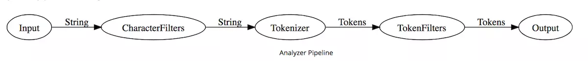

<!-- toc -->
[TOC]
# 认识 ElasticSearch Analyzer 分析器
做全文搜索就需要对文档分析、建索引。从文档中提取词元（Token）的算法称为分词器（Tokenizer），在分词前预处理的算法称为字符过滤器（Character Filter），进一步处理词元的算法称为词元过滤器（Token Filter），最后得到词（Term）。这整个分析算法称为分析器（Analyzer）。

文档包含词的数量称为词频（Frequency）。搜索引擎会建立词与文档的索引，称为倒排索引（Inverted Index）。



Analyzer 按顺序做三件事：
1. 使用 CharacterFilter 过滤字符
2. 使用 Tokenizer 分词
3. 使用 TokenFilter 过滤词

每一部分都可以指定多个组件。

Elasticsearch 默认提供了多种 [CharacterFilter](https://www.elastic.co/guide/en/elasticsearch/reference/current/analysis-charfilters.html)、[Tokenizer](https://www.elastic.co/guide/en/elasticsearch/reference/current/analysis-tokenizers.html)、[TokenFilter](https://www.elastic.co/guide/en/elasticsearch/reference/current/analysis-tokenfilters.html)、[Analyzer](https://www.elastic.co/guide/en/elasticsearch/reference/current/analysis-analyzers.html)，你也可以下载第三方的 Analyzer 等组件。

Analyzer 一般会提供一些设置。如 standard Analyzer 提供了 stop_words 停用词过滤配置。

以下样例构造了名为 standard 的 standard Analyzer 类型的带停用词列表的分析器：

```
PUT /my-index/_settings

{
  "index": {
    "analysis": {
      "analyzer": {
        "standard": {
          "type": "standard",
          "stop_words": [ "it", "is", "a" ]
        }
      }
    }
  }
}
```
你也可以通过 Setting API 构造组合自定义的 Analyzer。如：
```
PUT /my-index/_settings

{
  "index": {
    "analysis": {
      "analyzer": {
        "custom": {
          "type": "custom",
          "char_filter": [ "html_strip" ],
          "tokenizer": "standard",
          "filter": [ "lowercase", "stop", "snowball" ]
        }
      }
    }
  }
}
```
这构造了名为 custom 的 Analyzer，它完成以下工作：
1. 使用 html_strip 字符过滤器，移除 html 标签
2. 使用 standard 分词器，分词
3. 使用 lowercase 词过滤器，转为小写单词
4. 使用 stop 词过滤器，过滤停用词
5. 使用 snowball 词过滤器，用 snowball 雪球算法 提取词干

使用 Analyze API 分析给定文档，通过这种方式可以检查配置的行为是正确的。如：
```
POST /my-index/_analyze?analyzer=standard

quick brown
```
返回:
```
{
  "tokens": [
    {
      "token": "quick",
      "start_offset": 0,
      "end_offset": 5,
      "type": "<ALPHANUM>",
      "position": 0
    },
    {
      "token": "brown",
      "start_offset": 6,
      "end_offset": 11,
      "type": "<ALPHANUM>",
      "position": 1
    }
  ]
}
```
在给目标索引建映射时，指定待分析的字段的分析器来使用我们构造的分析器。如：
```
PUT /my-index/_mapping/my-type

{
  "my-type": {
    "properties": {
      "name": {
        "type": "string",
        "analyzer": "custom"
      }
    }
  }
}
```
如果希望使用多种分析器得到不同的分词，可以使用 [multi-fields](https://www.elastic.co/guide/en/elasticsearch/reference/current/mapping-types.html) 特性，指定多个产生字段：
```
PUT /my-index/_mapping/my-type

{
  "my-type": {
    "properties": {
      "name": {
        "type": "string",
        "analyzer": "standard",
        "fields": {
          "custom1": {
            "type": "string",
            "analyzer": "custom1"
          },
          "custom2": {
            "type": "string",
            "analyzer": "custom2"
          }
        }
      }
    }
  }
}
```
这样你可以通过 name、name.custom1、name.custom2 来使用不同的分析器得到的分词。

查询时也可以指定分析器。如：
```
POST /my-index/my-type/_search

{
  "query": {
    "match": {
      "name": {
        "query": "it's brown",
        "analyzer": "standard"
      }
    }
  }
}
```
或者在映射中分别指定他们。如：
```
PUT /my-index/_mapping/my-type

{
  "my-type": {
    "properties": {
      "name": {
        "type": "string",
        "index_analyzer": "custom",
        "search_analyzer": "standard" 
      }
    }
  }
}
```
然后索引一些文档，使用简单的 match 查询检查一下，如果发现问题，使用 Validate API 检查一下。如：
```
POST /my-index/my-type/_validate/query?explain

{
  "query": {
    "match": {
      "name": "it's brown"
    }
  }
}
```

# 一些概念
## Token（词元）
全文搜索引擎会用某种算法对要建索引的文档进行分析， 从文档中提取出若干Tokenizer(分词器)

## Tokenizer(分词器)

这些算法叫做Tokenizer(分词器)

---
一个分析器 必须 有一个唯一的分词器。 分词器把字符串分解成单个词条或者词汇单元。 标准 分析器里使用的 标准 分词器 把一个字符串根据单词边界分解成单个词条，并且移除掉大部分的标点符号，然而还有其他不同行为的分词器存在。

例如， 关键词 分词器 完整地输出 接收到的同样的字符串，并不做任何分词。 空格 分词器 只根据空格分割文本 。 正则 分词器 根据匹配正则表达式来分割文本 。


## Token Filter(词元处理器)
这些Token会被进一步处理， 比如转成小写等， 这些处理算法被称为TokenFilter(词元处理器)

---

经过分词，作为结果的 词单元流 会按照指定的顺序通过指定的词单元过滤器 。

词单元过滤器可以修改、添加或者移除词单元。我们已经提到过 lowercase 和 stop 词过滤器 ，但是在 Elasticsearch 里面还有很多可供选择的词单元过滤器。 词干过滤器 把单词 遏制 为 词干。 ascii_folding 过滤器移除变音符，把一个像 "très" 这样的词转换为 "tres" 。 ngram 和 edge_ngram 词单元过滤器 可以产生 适合用于部分匹配或者自动补全的词单元。


## Term(词)
被处理后的结果被称为Term(词)

## Character Filter(字符过滤器)
文本被Tokenizer处理前可能要做一些预处理， 比如去掉里面的HTML标记， 这些处理的算法被称为Character Filter(字符过滤器)

---
字符过滤器 用来 整理 一个尚未被分词的字符串。例如，如果我们的文本是HTML格式的，它会包含像 <p> 或者 <div> 这样的HTML标签，这些标签是我们不想索引的。我们可以使用 html清除 字符过滤器 来移除掉所有的HTML标签，并且像把 Á 转换为相对应的Unicode字符 Á 这样，转换HTML实体。

一个分析器可能有0个或者多个字符过滤器。

## Analyzer(分析器)
这整个的分析算法被称为Analyzer(分析器)

Analyzer（分析器）由Tokenizer（分词器）和Filter（过滤器）组成


# ES中的分词器
## ES内置分析器
standard analyzer
simple analyzer
stop analyzer
keyword analyzer
pattern analyzer
language analyzers
snowball analyzer
custom analyzer
## ES内置分析器
standard tokenizer
edge ngram tokenizer
keyword tokenizer
letter analyzer
lowercase analyzer
ngram analyzers
whitespace analyzer
pattern analyzer
uax email url analyzer
path hierarchy analyzer
## ES内置过滤器
standard filter
ascii folding filter
length filter
lowercase filter
ngram filter
edge ngram filter
porter stem filter
shingle filter
stop filter stop
word delimiter filter
stemmer token filter
stemmer override filter
keyword marker filter
keyword repeat filter
kstem filter
snowball filter
phonetic filter
synonym filter
compound word filter
reverse filter
elision filter
truncate filter
unique filter
pattern capture filter
pattern replace filter
trim filter
limit token count filter
hunspell filter
common grams filter
normalization filter
## ES内置的character filter
mapping char filter 根据配置的映射关系替换字符
html strip char filter 去掉HTML元素
pattern replace char filter 用正则表达式处理字符串

# 自定义分析器
ES允许用户通过配置文件elasticsearch.yml自定义分析器Analyzer
```
    index:
           analysis:
                     analyzer:
                            myAnalyzer:
                                   tokenizer: standard
                                   filter: [standard, lowercase, stop]
```
也可以使用第三方分析器，比如IKAnalyzer
- 采用了特有的“正向迭代最细粒度切分算法“，支持细粒度和智能分词两种切分模式
- 采用了多子处理器分析模式，支持：英文字母、数字、中文词汇等分词处理，兼容韩文、日文字符
- 优化的词典存储，更小的内存占用。支持用户词典扩展定义。词典支持中文，英文，数字混合词语。


