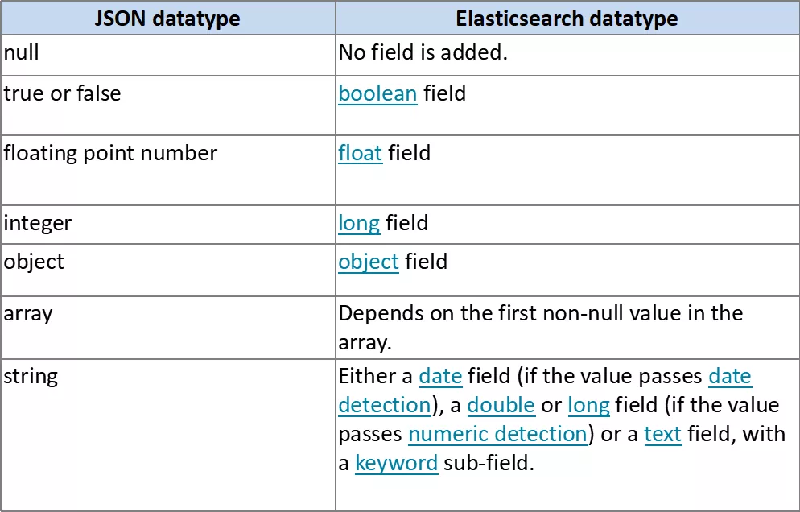

[TOC]
## Mapping 映射是什么
映射定义索引中有什么字段、字段的类型等结构信息。相当于数据库中表结构定义，或 solr中的schema。因为lucene索引文档时需要知道该如何来索引存储文档的字段。
ES中支持手动定义映射，动态映射两种方式。

### 为索引创建mapping
```
PUT test
{
<!--映射定义 -->
"mappings" : {
<!--名为type1的映射类别 mapping type-->
        "type1" : {
        <!-- 字段定义 -->
            "properties" : {
            <!-- 名为field1的字段，它的field datatype 为 text -->
                "field1" : { "type" : "text" }
            }
        }
    }
}
```
说明：映射定义后续可以修改
## 映射类别 Mapping type 废除说明
ES最先的设计是用索引类比关系型数据库的数据库，用mapping type 来类比表，一个索引中可以包含多个映射类别。这个类比存在一个严重的问题，就是当多个mapping type中存在同名字段时（特别是同名字段还是不同类型的），在一个索引中不好处理，因为搜索引擎中只有 索引-文档的结构，不同映射类别的数据都是一个一个的文档（只是包含的字段不一样而已）

从6.0.0开始限定仅包含一个映射类别定义（ "index.mapping.single_type": true ），兼容5.x中的多映射类别。从7.0开始将移除映射类别。
为了与未来的规划匹配，请现在将这个唯一的映射类别名定义为“_doc”,因为索引的请求地址将规范为：PUT {index}/_doc/{id} and POST {index}/_doc

Mapping 映射示例：
```
PUT twitter
{
  "mappings": {
    "_doc": {
      "properties": {
        "type": { "type": "keyword" },
        "name": { "type": "text" },
        "user_name": { "type": "keyword" },
        "email": { "type": "keyword" },
        "content": { "type": "text" },
        "tweeted_at": { "type": "date" }
      }
    }
  }
}
```

多映射类别数据转储到独立的索引中：
ES 提供了reindex API 来做这个事


## 字段类型 datatypes
字段类型定义了该如何索引存储字段值。ES中提供了丰富的字段类型定义，请查看官网链接详细了解每种类型的特点：

 https://www.elastic.co/guide/en/elasticsearch/reference/current/mapping-types.html

### Core Datatypes     核心类型
```
string
    text and keyword
Numeric datatypes
    long, integer, short, byte, double, float, half_float, scaled_float
Date datatype
    date
Boolean datatype
    boolean
Binary datatype
    binary
Range datatypes     范围
    integer_range, float_range, long_range, double_range, date_range
```
### Complex datatypes 复合类型
```
Array datatype
    数组就是多值，不需要专门的类型
Object datatype
    object ：表示值为一个JSON 对象
Nested datatype
    nested：for arrays of JSON objects（表示值为JSON对象数组 ）
```
### Geo datatypes  地理数据类型
```

Geo-point datatype
    geo_point：for lat/lon points  （经纬坐标点）
Geo-Shape datatype
    geo_shape：for complex shapes like polygons （形状表示）
```
### Specialised datatypes 特别的类型
```
IP datatype
    ip：for IPv4 and IPv6 addresses
Completion datatype
    completion：to provide auto-complete suggestions
Token count datatype
    token_count：to count the number of tokens in a string
mapper-murmur3
    murmur3：to compute hashes of values at index-time and store them in the index
Percolator type
    Accepts queries from the query-dsl
join datatype
    Defines parent/child relation for documents within the same index
```

## 字段定义属性介绍
字段的type (Datatype)定义了如何索引存储字段值，还有一些属性可以让我们根据需要来覆盖默认的值或进行特别定义。请参考官网介绍详细了解：https://www.elastic.co/guide/en/elasticsearch/reference/current/mapping-params.html
```
    analyzer   指定分词器
    normalizer   指定标准化器
    boost        指定权重值
    coerce      强制类型转换
    copy_to    值复制给另一字段
    doc_values  是否存储docValues
    dynamic
    enabled    字段是否可用
    fielddata
    eager_global_ordinals
    format    指定时间值的格式
    ignore_above
    ignore_malformed
    index_options
    index
    fields
    norms
    null_value
    position_increment_gap
    properties
    search_analyzer
    similarity
    store
    term_vector
```
字段定义属性—示例
```
PUT my_index
{
  "mappings": {
    "_doc": {
      "properties": {
        "date": {
          "type":   "date",
           <!--格式化日期 -->
          "format": "yyyy-MM-dd HH:mm:ss||yyyy-MM-dd||epoch_millis"
        }
      }
    }
  }
}
```

## Multi Field 多重字段
当我们需要对一个字段进行多种不同方式的索引时，可以使用fields多重字段定义。如一个字符串字段即需要进行text分词索引，也需要进行keyword 关键字索引来支持排序、聚合；或需要用不同的分词器进行分词索引。

示例：

定义多重字段：

说明：raw是一个多重版本名（自定义）

```
PUT my_index
{
  "mappings": {
    "_doc": {
      "properties": {
        "city": {
          "type": "text",
          "fields": {
            "raw": {
              "type":  "keyword"
            }
          }
        }
      }
    }
  }
}
```
往多重字段里面添加文档
```
PUT my_index/_doc/1
{
  "city": "New York"
}
 
PUT my_index/_doc/2
{
  "city": "York"
}
```

获取多重字段的值：
```
GET my_index/_search
{
  "query": {
    "match": {
      "city": "york"
    }
  },
  "sort": {
    "city.raw": "asc"
  },
  "aggs": {
    "Cities": {
      "terms": {
        "field": "city.raw"
      }
    }
  }
}
```


## 元字段
官网链接：
https://www.elastic.co/guide/en/elasticsearch/reference/current/mapping-fields.html

元字段是ES中定义的文档字段，有以下几类：
### Identity meta-fields
类型 |说明
--|--
_index | The index to which the document belongs.
_type | The document’s mapping type.
_id | The document’s ID.

### Document source meta-fields
类型 |说明
--|--
_source|The original JSON representing the body of the document.
_size|The size of the _source field in bytes, provided by the mapper-size plugin.

###  meta-fields
类型 |说明
--|--
_field_names|All fields in the document which contain non-null values.
_ignored|All fields in the document that have been ignored at index time because of ignore_malformed.
### Routing meta-field
类型 |说明
--|--
_routing|A custom routing value which routes a document to a particular shard.
### Other meta-field
类型 |说明
--|--
_meta|Application specific metadata.

## 动态映射

动态映射：ES中提供的重要特性，让我们可以快速使用ES，而不需要先创建索引、定义映射。如我们直接向ES提交文档进行索引：
```
PUT data/_doc/1
{ "count": 5 }
```
ES将自动为我们创建data索引、_doc 映射、类型为 long 的字段 count

索引文档时，当有新字段时， ES将根据我们字段的json的数据类型为我们自动加人字段定义到mapping中。
### 字段动态映射规则

### Date detection 时间侦测
所谓时间侦测是指我们往ES里面插入数据的时候会去自动检测我们的数据是不是日期格式的，是的话就会给我们自动转为设置的格式

 date_detection 默认是开启的，默认的格式dynamic_date_formats为：
```
[ "strict_date_optional_time","yyyy/MM/dd HH:mm:ss Z||yyyy/MM/dd Z"]
PUT my_index/_doc/1
{
  "create_date": "2015/09/02"
}
 
GET my_index/_mapping
```
自定义时间格式：
```
PUT my_index
{
  "mappings": {
    "_doc": {
      "dynamic_date_formats": ["MM/dd/yyyy"]
    }
  }
}
```
禁用时间侦测：
```

PUT my_index
{
  "mappings": {
    "_doc": {
      "date_detection": false
    }
  }
}
```

### Numeric detection  数值侦测
开启数值侦测（默认是禁用的）
```

PUT my_index
{
  "mappings": {
    "_doc": {
      "numeric_detection": true
    }
  }
}
PUT my_index/_doc/1
{
  "my_float":   "1.0",
  "my_integer": "1"
}
```
## text

参数 | 说明|中文
--|--|--
 analyzer | The analyzer which should be used for analyzed string fields, both at index-time and at search-time (unless overridden by the search_analyzer). Defaults to the default index analyzer, or the standard analyzer.|在索引时间和搜索时间都应用于 字符串字段的分析器analyzed（除非被覆盖 search_analyzer）。默认为默认索引分析器，或者为 standardAnalyzer。
boost | Mapping field-level query time boosting. Accepts a floating point number, defaults to 1.0.
eager_global_ordinals | Should global ordinals be loaded eagerly on refresh? Accepts true or false (default). Enabling this is a good idea on fields that are frequently used for (significant) terms aggregations.
fielddata | Can the field use in-memory fielddata for sorting, aggregations, or scripting? Accepts true or false (default).|该字段可以使用内存中的字段数据进行排序，聚合或编写脚本吗？接受true或false（默认）。
fielddata_frequency_filter | Expert settings which allow to decide which values to load in memory when fielddata is enabled. By default all values are loaded.|专家设置，可以决定fielddata 启用哪些值时将其加载到内存中。默认情况下，所有值均已加载。
fields | Multi-fields allow the same string value to be indexed in multiple ways for different purposes, such as one field for search and a multi-field for sorting and aggregations, or the same string value analyzed by different analyzers.|多字段允许针对不同目的以多种方式为同一字符串值建立索引，例如，一个字段用于搜索，多字段用于排序和聚合，或者由不同的分析器分析同一字符串值。
index | Should the field be searchable? Accepts true (default) or false.|该字段是否可以搜索？接受true（默认）或false。
index_options | What information should be stored in the index, for search and highlighting purposes. Defaults to positions.
index_prefixes | If enabled, term prefixes of between 2 and 5 characters are indexed into a separate field. This allows prefix searches to run more efficiently, at the expense of a larger index.
index_phrases | If enabled, two-term word combinations (shingles) are indexed into a separate field. This allows exact phrase queries (no slop) to run more efficiently, at the expense of a larger index. Note that this works best when stopwords are not removed, as phrases containing stopwords will not use the subsidiary field and will fall back to a standard phrase query. Accepts true or false (default).
norms | Whether field-length should be taken into account when scoring queries. Accepts true (default) or false.
position_increment_gap | The number of fake term position which should be inserted between each element of an array of strings. Defaults to the position_increment_gap configured on the analyzer which defaults to 100. 100 was chosen because it prevents phrase queries with reasonably large slops (less than 100) from matching terms across field values.
store | Whether the field value should be stored and retrievable separately from the _source field. Accepts true or false (default).
search_analyzer | The analyzer that should be used at search time on analyzed fields. Defaults to the analyzer setting. |本analyzer应该在搜索时使用 analyzed的字段。默认为analyzer设置。
search_quote_analyzer | The analyzer that should be used at search time when a phrase is encountered. Defaults to the search_analyzer setting.
similarity | Which scoring algorithm or similarity should be used. Defaults to BM25.
term_vector | Whether term vectors should be stored for an analyzed field. Defaults to no.

