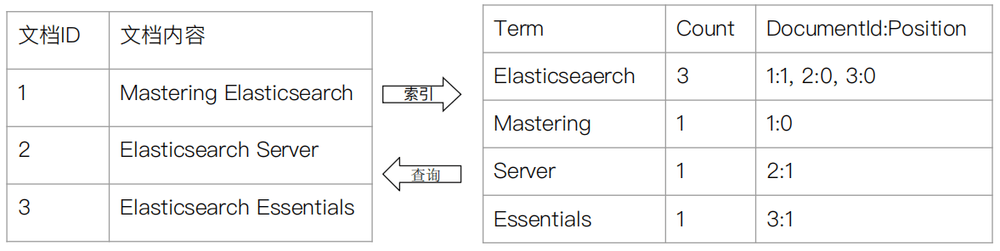
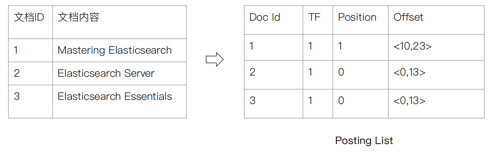

elasticSearch同步mysql数据
https://www.jianshu.com/p/bfa841df5fee
Elasticsearch顶尖高手系列：高手进阶篇（最新第二版）
https://zhuanlan.zhihu.com/p/88975745

Elasticsearch在日志分析领域应用和运维实践
https://zhuanlan.zhihu.com/p/90080383

Elasticsearch从入门到放弃：索引基本使用方法
https://zhuanlan.zhihu.com/p/87981545

Elasticsearch从入门到放弃：文档CRUD要牢记
https://zhuanlan.zhihu.com/p/93667559

ES之概念
https://zhuanlan.zhihu.com/p/94246622
ES分词器简介
https://zhuanlan.zhihu.com/p/91604790

Elasticsearch 7 探索之路】（二）文档的 CRUD 和批量操作
https://zhuanlan.zhihu.com/p/91825818

【Elasticsearch 7 探索之路】（三）倒排索引
https://zhuanlan.zhihu.com/p/92811103

Elasticsearch 7 探索之路】（四）Analyzer 分析
https://zhuanlan.zhihu.com/p/94162301

终于有人把Elasticsearch原理讲透了！
https://zhuanlan.zhihu.com/p/62892586

Elasticsearch Mapping设置相关
https://zhuanlan.zhihu.com/p/93894700


Elasticsearch索引字段类型简介
https://zhuanlan.zhihu.com/p/93895253


新一代海量数据搜索引擎 TurboSearch 来了
https://zhuanlan.zhihu.com/p/94186243

从Elasticsearch来看分布式系统架构设计
https://www.toutiao.com/a6765085585309696520

Elasticsearch太快了：一文详解其原理应用
https://www.toutiao.com/a6749080730841645580

Elasticsearch 创建索引前必须要了解的知识，提前避坑
https://www.toutiao.com/a6765232723524059659

[TOC]

# Elasticsearch中的一些基本概念
## 索引词(term)

在Elasticsearch中索引词(term)是一个能够被索引的精确值。foo，Foo Foo几个单词是不相同的索引词。索引词(term)是可以通过term查询进行准确的搜索。

## 文本(text)

文本是一段普通的非结构化文字，通常，文本会被分析称一个个的索引词，存储在Elasticsearch的索引库中，为了让文本能够进行搜索，文本字段需要事先进行分析；当对文本中的关键词进行查询的时候，搜索引擎应该根据搜索条件搜索出原文本。

## 分析(analysis)

分析是将文本转换为索引词的过程，分析的结果依赖于分词器，比如： FOO BAR, Foo-Bar, foo bar这几个单词有可能会被分析成相同的索引词foo和bar，这些索引词存储在Elasticsearch的索引库中。当用 FoO:bAR进行全文搜索的时候，搜索引擎根据匹配计算也能在索引库中搜索出之前的内容。这就是Elasticsearch的搜索分析。

## 集群(cluster)

一个集群由一个或多个共享相同的群集名称的节点组成。每个群集有一个单独的主节点，这是由程序自动选择，如果当前主节点失败，程序会自动选择其他节点作为主节点。

## 节点(node)

一个节点属于一个集群。通常情况下一个服务器有一个节点，但有时候为了测试方便，一台服务器也可以有多个节点。在启动时，一个节点将使用广播来发现具有相同群集名称的现有群集，并将尝试加入该群集。

## 路由(routing)

当存储一个文档的时候，他会存储在一个唯一的主分片中，具体哪个分片是通过散列值的进行选择。默认情况下，这个值是由文档的id生成。如果文档有一个指定的父文档，从父文档ID中生成，该值可以在存储文档的时候进行修改。


当你索引（动词，对该文档建立倒排索引）一个文档，它被存储到master节点上的一个主分片上。

Elasticsearch是如何知道文档属于哪个分片的呢？当你创建一个新文档，它是如何知道是应该存储在分片1还是分片2上的呢？
解答这个问题，我们需要了解Elasticsearch的路由机制。
简单地说，Elasticsearch将具有相关Hash值的文档存放到同一个主分片中，分片位置计算算法如下：
```
shard = hash(routing) % number_of_primary_shards
```
算法说明：

- routing值是一个字符串，它默认是文档_id，也可以自定义。这个routing字符串通过哈希函数生成一个数字，然后除以主切片的数量得到一个余数(remainder)，余数的范围是[0 , number_of_primary_shards-1]，这个数字就是特定文档所在的分片。
- 之前我们介绍过，创建索引时需要指定主分片数量，该不能修改。这是因为如果主分片的数量在未来改变了，所有先前的路由值就失效了，文档也就永远找不到了。
- 该算法基本可以保证所有文档在所有分片上平均分布，不会导致数据分布不均（数据倾斜）的情况。
- 默认情况下，routing值是文档的_id。我们创建文档时可以指定id的值；如果不指定id时，Elasticsearch将随机生成文档的_id值。这将导致在查询文档时，Elasticsearch不能确定文档的位置，需要将请求广播到所有的分片节点上。


假设我们有一个10个分片的索引。当一个请求在集群上执行时基本过程如下：

1. 这个搜索的请求会被发送到一个节点。
2. 接收到这个请求的节点，将这个查询广播到这个索引的每个分片上（可能是主分片，也可能是复制分片）。
3. 每个分片执行这个搜索查询并返回结果。
4. 结果在通道节点上合并、排序并返回给用户。


**通过使用用户提供的路由值，就可以做到定向存储，定向搜索**
```
PUT blog/_doc/1?routing=haron
{
  "title":"1、VMware安装",
  "author":"hadron",
  "content":"VMware Workstation虚拟机软件安装图解...",
  "url":"http://x.co/6nc81"
}


GET blog/_doc/1?routing=hardon
```

所有的文档API（GET、INDEX、DELETE、BULK、UPDATE、MGET）都接收一个routing参数，它用来自定义文档到分片的映射。添加routing参数形式与URL参数形式相同url?参数名=参数值。

注意：自定义routing值可以造成数据分布不均的情况。例如用户hadron的文档非常多，有数十万个，而其他大多数用户的文档只有数个到数十个，这样将导致hadron所在的分片较大。

## 分片(shard)

分片是一个单一的Lucene实例。这个是由Elasticsearch管理的比较底层的功能。索引是指向主分片和副本分片的逻辑空间。对于使用，只需要指定分片的数量，其他不需要做过多的事情。在开发使用的过程中，我们对应的对象都是索引，Elasticsearch会自动管理集群中所有的分片，当发生故障的时候，一个Elasticsearch会把分片移动到不同的节点或者添加新的节点。

## 主分片(primary shard)

每个文档都存储在一个分片中，当你存储一个文档的时候，系统会首先存储在主分片中，然后会复制到不同的副本中。默认情况下，一个索引有5个主分片。你可以在事先制定分片的数量，当分片一旦建立，分片的数量则不能修改。

## 副本分片(replica shard)

每一个分片有零个或多个副本。副本主要是主分片的复制，其中有两个目的：

1、增加高可用性：当主分片失败的时候，可以从副本分片中选择一个作为主分片。

2、提高性能：当查询的时候可以到主分片或者副本分片中进行查询。默认情况下，一个主分配有一个副本，但副本的数量可以在后面动态的配置增加。副本必须部署在不同的节点上，不能部署在和主分片相同的节点上。

## 索引(index)

索引就像关系数据库中的数据库，每个索引有不同字段，可以对应不同的类型；每个索引都可以有一个或者多个主索引片，同时每个索引还可以有零个或者多个副本索引片。

正排索引(forward index)：从文档角度看其中的单词，表示每个文档（用文档ID标识）都含有哪些单词，以及每个单词出现了多少次（词频）及其出现位置（相对于文档首部的偏移量）。倒排索引(inverted index，或inverted files)：从单词角度看文档，标识每个单词分别在那些文档中出现(文档ID)，以及在各自的文档中每个单词分别出现了多少次（词频）及其出现位置（相对于该文档首部的偏移量）。
简单记为：
正排索引：文档 ---> 单词
倒排索引：单词 ---> 文档

### 倒排索引的核心组成
倒排索引包含两个部分

- 单词词典（Term Dictionary） ，记录所有文档的单词，记录单词到倒排列表的关联关系
单词词典比较大，可以通过 B + 树 或者 哈希拉链法实现，以满足高性能的插入与查询
- 倒排列表（Postion List）- 记录了单词对应的文档结合，由倒排索引项组成
  - 倒排索引
  - 文档 ID
  - 词频 TF - 单词在文档中的分词的位置。用于语句搜索（phrase query）
  - 偏移（Offset） - 记录单词的开始结束时间，实现高亮显示


Elasticsearch 的 JSON 文档中的每个字段，都有自己的倒排索引
可以指定对某些字段不做索引(优点：节省储存空间,缺点：字段无法被搜索)


## 类型(type)

类型类似关系数据库中的表。每种类型都可以指定不同的列。映射定义文档中的每个字段的类型，并可以指定如何分析。

## 文档(document)

一个文档是一个JSON格式的字符串存储在Elasticsearch中。它就像在关系数据库中的表中的一行。每个存储在索引中的一个文件都有一个类型和一个id，每个文件都是一个json对象，存储了零个或者多个字段，或者键值对。原始的json文档被存储在一个叫做_source的字段中。当搜索文档的时候默认返回的就是这个字段。

## 映射(mapping)

映射像关系数据库中的表结构，每一个索引都有一个映射，它定义了索引中的每一个字段类型，以及一个索引范围内的设置。一个映射可以事先被定义，或者在第一次存储文档的时候自动识别。

使用ElasticSearch时，有可能创建映射（mapping）类型错误，需要修改mapping类型，但是ElasticSearch不支持直接修改mapping，因为底层Lucene的原因，修改一个field需要对所有已有数据的所有field进行reindex, 所以需要重建索引，进行数据迁移。

解决方案：重建索引

新建一个索引，mapping除了要修改的地方，与原索引一致。

之后迁移数据，ElasticSearch有自带的api。

如果项目已部署上线，想要不停机重建索引，有一个前提：**原索引有别名**

步骤：
1. 新增新索引store_v2

2. 修改alias别名的指向
```
curl -XPOST localhost:8305/_aliases -d '
{
    "actions": [
        { "remove": {
            "alias": "store",
            "index": "store_v1"
        }},
        { "add": {
            "alias": "store",
            "index": "store_v2"
        }}
    ]
}
'

```
3. reindex
```
# 将原索引全部放入新索引中，_id冲突的以原索引为准
# 虽然新索引中只有两个字段(原索引中有三个)，也会将原索引中的数据插入新索引中，并覆盖_id相同的数据。
POST _reindex
{
  "source": {"index": "store_v1"},
  "dest": {"index": "store_v2"}
}

# 将原索引放入新索引中，_id冲突的以新索引为准
# 虽然新索引中只有两个字段(原索引中有三个)，也会将原索引中的数据插入新索引中，但不覆盖_id相同的数据。
POST _reindex
{
  "conflicts": "proceed",
  "source": {"index": "store_v1"},
  "dest": {"index": "store_v2","op_type": "create"}
}
```

4. 索引删掉
```
curl -XDELETE localhost:8303/store_v1
```


## 字段(field)

一个文档中包含零个或者多个字段，字段可以是一个简单的值（例如字符串、整数、日期），也可以是一个数组或对象的嵌套结构。字段类似于关系数据库中的表中的列。每个字段都对应一个字段类型，例如整数、字符串、对象等。字段还可以指定如何分析该字段的值。

string 类型。ES 7.x 中，string 类型会升级为：text 和 keyword。keyword 可以排序；text 默认分词，不可以排序。

## 来源字段(source field)

默认情况下，你的原文档将被存储在_source这个字段中，当你查询的时候也是返回这个字段。这允许您可以从搜索结果中访问原始的对象，这个对象返回一个精确的json字符串，这个对象不显示索引分析后的其他任何数据。

## 主键(id)

id是一个文件的唯一标识，如果在存库的时候没有提供id，系统会自动生成一个id，文档的index/type/id必须是唯一的。
在elasticsearch 无法设置多主键，只有唯一ID
但是我们可以设置ID的规则，来实现多主键。
比如本来想设置两个主键，分别是NAME 和 AGE 。
ID的生成规则就可以写成 NAME_AGE，这样就实现了MYSQL数据库中的联合主键。

1. 手动指定ID
```
put /index/type/id
```
2. 自动生成document id
```
post /index/type
```

# 对应关系
RDBMS | Elasticsearch
--|--
数据库 Database|索引 Index
表 Table|类型 Type 6.0.0 废弃
行 Row|文档 Document
列 Column|字段 Feild
表结构 Schema|映射 Mapping
索引 Index| 反向索引(倒排索引) Everything is indexed
SQL|查询DSL Query DSL
SELECT * FROM table | GET /index/type 7.0 {index}/_doc
UPDATE table SET | PUT /index/type 7.0 {index}/_doc
DELETE|DELETE /index

## 抛弃type
```
PUT twitter
{
  "mappings": {
    "user": {
      "properties": {
        "name": { "type": "text" },
        "user_name": { "type": "keyword" },
        "email": { "type": "keyword" }
      }
    },
    "tweet": {
      "properties": {
        "content": { "type": "text" },
        "user_name": { "type": "keyword" },
        "tweeted_at": { "type": "date" }
      }
    }
  }
}

PUT twitter/user/kimchy
{
  "name": "Shay Banon",
  "user_name": "kimchy",
  "email": "shay@kimchy.com"
}

PUT twitter/tweet/1
{
  "user_name": "kimchy",
  "tweeted_at": "2017-10-24T09:00:00Z",
  "content": "Types are going away"
}

GET twitter/tweet/_search
{
  "query": {
    "match": {
      "user_name": "kimchy"
    }
  }
}
```
可以通过type字段来实现
```
PUT twitter
{
  "mappings": {
    "_doc": {
      "properties": {
        "type": { "type": "keyword" }, 
        "name": { "type": "text" },
        "user_name": { "type": "keyword" },
        "email": { "type": "keyword" },
        "content": { "type": "text" },
        "tweeted_at": { "type": "date" }
      }
    }
  }
}


PUT twitter/_doc/user-kimchy
{
  "type": "user", 
  "name": "Shay Banon",
  "user_name": "kimchy",
  "email": "shay@kimchy.com"
}

// 自定义type tweet
PUT twitter/_doc/tweet-1
{
  "type": "tweet", 
  "user_name": "kimchy",
  "tweeted_at": "2017-10-24T09:00:00Z",
  "content": "Types are going away"
}

GET twitter/_search
{
  "query": {
    "bool": {
      "must": {
        "match": {
          "user_name": "kimchy"
        }
      },
      "filter": {
        "match": {
          "type": "tweet" 
        }
      }
    }
  }
}
```
