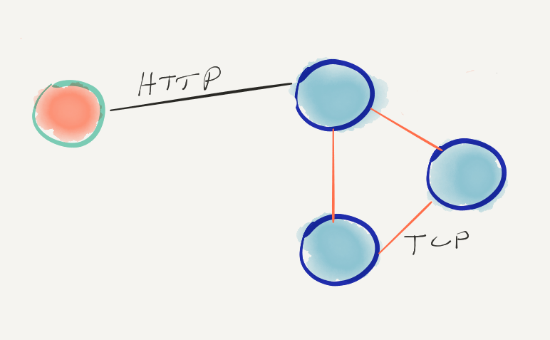

# 基于hashicorp/raft的分布式一致性实战1

# 基于hashicorp/raft的分布式一致性实战2

https://cloud.tencent.com/developer/article/1211094

## 1. 背景
对于后台开发来说，随着业务的发展，由于访问量增大的压力和数据容灾的需要，一定会需要使用分布式的系统，而分布式势必会引入一致性的问题。

一般把一致性分为三种类型：弱一致性、最终一致性、强一致性。这三种模型的一致性强度逐渐递增，实现代价也越来越大。通常弱一致性和最终一致性可以异步冗余，强一致性则是同步冗余，而同步也就意味着影响性能。

对常见的互联网业务来说，使用弱一致性或者最终一致性即可。而使用强一致性一方面会影响系统的性能，另一方面实现也比较困难。常见的一致性协议如zab、raft、paxos，如果由业务纯自己来实现的话代价较大，而且很可能会因为考虑不周而引入其他问题。

对于一些需要强一致性，而又希望花费较小代价的业务来说，使用开源的一致性协议实现组件会是个不错的选择。hashicorp/raft是raft协议的一种golang实现，由hashicorp公司实现并开源，已经在consul等软件中使用。它封装了raft协议的leader选举、log同步等底层实现，基于它能够相对比较容易的构建强一致性的分布式系统，下面以实现一个简单的分布式缓存服务(取名叫stcache)来演示hashicorp/raft的具体使用，完整代码可以在[github](https://github.com/openjw/genter/x/raft)上下载。

## 2. raft简介
首先还是简单介绍下raft协议。这里不详细介绍raft协议，只是为了方便理解后面的hashicorp/raft的使用步骤而简单列举出raft的一点原理。具体的raft协议可以参考[raft的官网](https://raft.github.io/)，如果已经了解raft协议可以直接跳过这一节。

raft是一种相对易于理解的一致性的协议。它属于leader-follower型的协议，有且只有一个leader，所有的事务请求都由leader处理，leader征求follower的意见，在集群内部达成一致，决定是否执行事务。当leader出现故障，集群中的follower会通过投票的方式选出一个新的leader，维持集群运行。

raft的理论基础是Replicated State Machine，Replicated State Machine需要满足如下的条件：一个server可以有多个state，多个server从同一个start状态出发，都执行相同的command序列，最终到达的stare是一样的。如上图，一般使用replicated log来记录command序列，client的请求被leader转化成log entry，然后通过一致性模块把log同步到各个server，让各个server的log一致。每个server都有state Machine，从start出发，执行完这些log中的command后，server处于相同的state。所以raft协议的关键就是保证各个server的log一致，然后每个server通过执行相同的log来达到一致的状态，理解这点有助于掌握后面对hashicorp/raft的具体使用。

