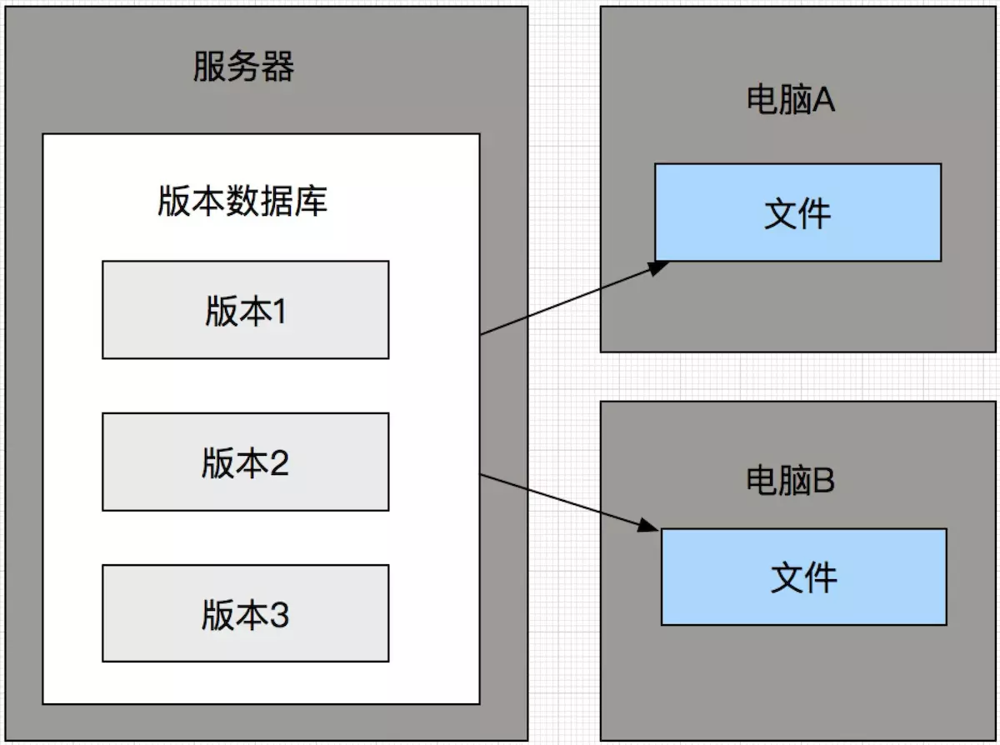
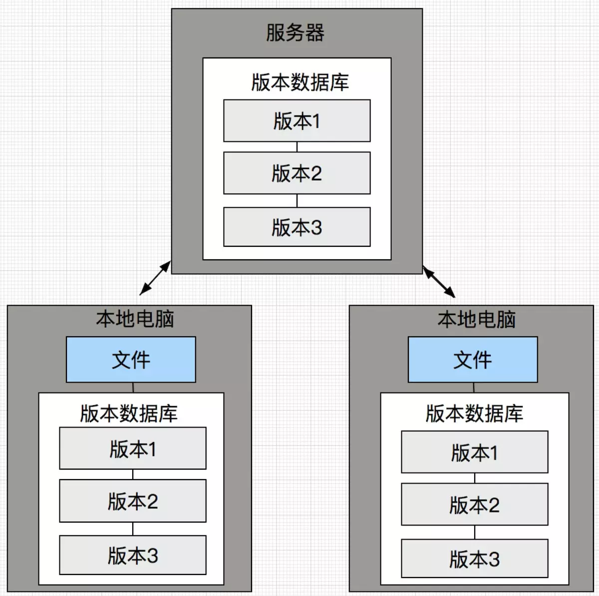
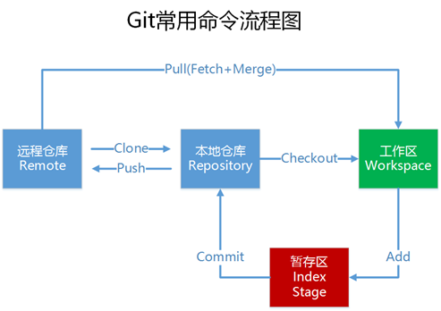
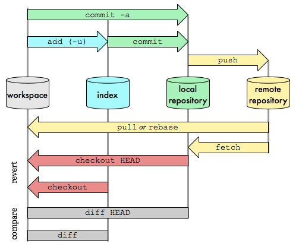

https://git-scm.com/book/zh/v2
# SVN 与 分布式版本控制系统git
 
 

主要优点:可以离线工作，分布式版本管理系统每个计算机都有一个完整的仓库，可本地提交，可以做到离线工作。没有了SVN令人抓狂的断网无法工作问题

1. GIT是分布式的，SVN为集中式的

这是常识，两者最重要的区别，也是后面所有区别的基石；

2. GIT随处都是版本库，SVN只有一个中央版本库

因为GIT是分布式的所以能做到到处都是版本库，而SVN是集中式的，所以只有一个中央仓库。因而GIT能够做到无需网络提交，到处到时版本库，压根不用担心提交速度问题，不用时刻依赖与网络工作，不用担心单点故障。当工作完成之后直接推送远程即可实现工作协作；

3. GIT没有全局版本号，SVN有全局版本号

GIT版本库到处都是，之间没有实时共享数据，所以无法确保版本号的唯一性，无法使用全局版本号，分布在各个机器上的版本库版本号使用40位的HASH值取代。重复的情况是存在的，从数学的角度考虑，可能性是2的63次方分之一，基本可忽略。而对于SVN，唯一版本，所以能够做到使用全局的版本号，版本号采用自增的方式；

4. GIT把内容按元数据存储，SVN按文件存储

GIT存储的不是实际的文件，而是指向性数据。SVN保存的是文件数据。当GIT切换版本的时候，实际上切换的是元数据，而且本地操作，快捷有效；

5. GIT记录文件快照，SVN记录文件差异

GIT的元数据，即指向性数据指向的是实际的文件快照，这也是GIT能够快速切换版本的一个原因。SVN保存的文件数据是各个版本之间的文件差异，所以切换版本的时候需要逐级的差异计算，速度比较慢，而且还需网络传输。当工程较大时，速度与GIT相比差异会相当的大。


# GIT架构
GIT的架构，可以分为几个部分：

- 本地工作区(working directory)
- 暂存区(stage area, 又称为索引区, index)
- 本地仓库(local repository,.git directory)
- 远程仓库(remote repository)

 


1. 工作区(working directory)

工作区，简言之就是你工作的区域。对于git而言，就是的本地工作目录。工作区的内容会包含提交到暂存区和版本库(当前提交点)的内容，同时也包含自己的修改内容。

2. 暂存区(stage area, 又称为索引区index)

暂存区是git中一个非常重要的概念。是我们把修改提交版本库前的一个过渡阶段。查看GIT自带帮助手册的时候，通常以index来表示暂存区。在工作目录下有一个.git的目录，里面有个index文件，存储着关于暂存区的内容。git add命令将工作区内容添加到暂存区。

3. 本地仓库(local repository)

版本控制系统的仓库，存在于本地。当执行git commit命令后，会将暂存区内容提交到仓库之中。在工作区下面有.git的目录，这个目录下的内容不属于工作区，里面便是仓库的数据信息，暂存区相关内容也在其中。Git 仓库目录是 Git 用来保存项目的元数据和对象数据库的地方。 这是 Git 中最重要的部分，从其它计算机克隆仓库时，拷贝的就是这里的数据。

4. 远程版本库(remote repository)

远程版本库与本地仓库概念基本一致，不同之处在于一个存在远程，可用于远程协作，一个却是存在于本地。通过push/pull可实现本地与远程的交互；

5. 其实还有个 远程仓库副本

可以理解为存在于本地的远程仓库缓存。如需更新，可通过git fetch/pull命令获取远程仓库内容。使用fech获取时，并未合并到本地仓库，此时可使用git merge实现远程仓库副本与本地仓库的合并。

# Git仓库.git文件夹目录介绍

- HEAD
 HEAD 指向当前所在的分支,文件内容：ref: refs/heads/tttt
 找到对应的文件，其实就是工作区的在版本库中的那个提交点，最终会指向一个40位的HASH值

- ORIG_HEAD
远程仓库 当前引用

- FETCH_HEAD
最后fetch引用

- packed-refs
clone仓库时所有的引用

- COMMIT_EDITMSG
本地最后一个提交的信息

- config
该文件主要记录针对该项目的一些配置信息，例如是否以bare方式初始化、remote的信息等，通过git remote add命令增加的远程分支的信息就保存在这里；如使用命令git config user.name poloxue便会记录在此文件；
- description
被gitweb (Github的原型)用来显示对repo的描述。

- index
该文件保存了暂存区域的信息。该文件某种程度就是缓冲区（staging area），内容包括它指向的文件的时间戳、文件名、sha1值等；

- hooks文件夹
hooks主要定义了客户端或服务端钩子脚本，这些脚本主要用于在特定的命令和操作(如commit/release/pull/push)之前或者之后进行特定的处理，比如：当你把本地仓库push到服务器的远程仓库时，可以在服务器仓库的hooks文件夹下定义post_update脚本，在该脚本中可以通过脚本代码将最新的代码部署到服务器的web服务器上，从而将版本控制和代码发布无缝连接起来；如pre-push可以用来强制进行代码检查。

- info文件夹
info文件夹保存了一份不希望在.gitignore 文件中管理的忽略模式的全局可执行文件，基本也用不上；
-- info/exclue
可以做到和.gitignore相同的事情，用于排除不要包含进版本库的文件。区别就是，此文件不会被共享。

- logs文件夹
记录了本地仓库和远程仓库的每一个分支的提交记录，即所有的commit对象（包括时间、作者等信息）都会被记录在这个文件夹中，因此这个文件夹中的内容是我们查看最频繁的，不管是Git log命令还是tortoiseGit的show log，都需要从该文件夹中获取提交日志

- refs文件夹
该文件夹存储指向数据（分支）的提交对象的指针。其中heads文件夹存储本地每一个分支最近一次commit的sha-1值（也就是commit对象的sha-1值），每个分支一个文件；remotes文件夹则记录你最后一次和每一个远程仓库的通信，Git会把你最后一次推送到这个remote的每个分支的值都记录在这个文件夹中；tag文件夹则是分支的别名，这里不需要对其有过多的了解；
-- refs/heads
目录下有关于本地仓库的所有分支；
-- refs/remote
目录下有关于远程仓库的所有分支；

- objects 文件夹
该文件夹主要包含git对象。关于什么是git对象，将会在下一节进行详细介绍。Git中的文件和一些操作都会以git对象来保存，git对象分为BLOB、tree和commit三种类型，例如git commit便是git中的commit对象，而各个版本之间是通过版本树来组织的，比如当前的HEAD会指向某个commit对象，而该commit对象又会指向几个BLOB对象或者tree对象。objects文件夹中会包含很多的子文件夹，其中Git对象保存在以其sha-1值的前两位为子文件夹、后38位位文件名的文件中；除此以外，Git为了节省存储对象所占用的磁盘空间，会定期对Git对象进行压缩和打包，其中pack文件夹用于存储打包压缩的对象，而info文件夹用于从打包的文件中查找git对象；


# 忽略文件
一般我们总会有些文件无需纳入 Git 的管理，也不希望它们总出现在未跟踪文件列表。 通常都是些自动生成的文
件，比如日志文件，或者编译过程中创建的临时文件等。 在这种情况下，我们可以创建一个名为 .gitignore
的文件，列出要忽略的文件模式。 来看一个实际的例子：
```
$ cat .gitignore
*.[oa]
*~
```
第一行告诉 Git 忽略所有以 .o 或 .a 结尾的文件。一般这类对象文件和存档文件都是编译过程中出现的。 第二
行告诉 Git 忽略所有以波浪符（~）结尾的文件，许多文本编辑软件（比如 Emacs）都用这样的文件名保存副
本。 此外，你可能还需要忽略 log，tmp 或者 pid 目录，以及自动生成的文档等等。 要养成一开始就设置好
.gitignore 文件的习惯，以免将来误提交这类无用的文件。

文件 .gitignore 的格式规范如下：
• 所有空行或者以 ＃ 开头的行都会被 Git 忽略。
• 可以使用标准的 glob 模式匹配。
• 匹配模式可以以（/）开头防止递归。
• 匹配模式可以以（/）结尾指定目录。
• 要忽略指定模式以外的文件或目录，可以在模式前加上惊叹号（!）取反。

所谓的 glob 模式是指 shell 所使用的简化了的正则表达式。 星号（* ）匹配零个或多个任意字符；[abc] 匹配任何一个列在方括号中的字符（这个例子要么匹配一个 a，要么匹配一个 b，要么匹配一个 c）；问号（?）只匹配一个任意字符；如果在方括号中使用短划线分隔两个字符，表示所有在这两个字符范围内的都可以匹配（比如 [0-9] 表示匹配所有 0 到 9 的数字）。 使用两个星号（* ) 表示匹配任意中间目录，比如 a/**/z 可以匹配 a/z , a/b/z 或 a/b/c/z 等。

[常用忽略文件](https://github.com/github/gitignore)

我们再看一个 .gitignore 文件的例子：
```
# no .a files
*.a
# but do track lib.a, even though you're ignoring .a files above
!lib.a
# only ignore the TODO file in the current directory, not subdir/TODO
/TODO
# ignore all files in the build/ directory
build/
# ignore doc/notes.txt, but not doc/server/arch.txt
doc/*.txt
# ignore all .pdf files in the doc/ directory
doc/**/*.pdf

```

#  从底层命令理解Git
#### Git的基本原理
本质上，Git是一套内容寻址（content-addressable）文件系统，而和我们直接接触的Git界面，只不过是封装在其之上的一个应用层。这个关系颇有点类似于计算机网络中应用层和下属层的关系。

在Git中，那些和应用层相关的命令（也就是我们最常用的命令，如git commit、 git push等），我们称之为porcelain命令（瓷器之意，意为成品、高级命令）；

而和底层相关的命令（几乎不会在日常中使用，如git hash-object、git update-index等），则称之为plumbing命令（管道之意，是连接git应用界面和git底层实现的一个管道，类似于shell，底层命令）。


而porcelain命令是基于plumbing来实现的。

要了解Git的底层原理，就需要了解Git是如何利用底层命令来实现高层命令的

#### Git对象
在之前我们提到过，Git是一套内容寻址（content-addressable）文件系统，那么Git是怎么进行寻址呢？其实，寻址无非就是查找，而Git采用HashTable的方式进行查找，也就是说，Git只是通过简单的存储键值对（key-value pair）的方式来实现内容寻址的，**而key就是文件（头+内容）的哈希值（采用sha-1的方式，40位），value就是经过压缩后的文件内容**。因此，在接下来的实践中，我们会经常通过40位的hash值来进行plumbing操作，几乎每一个plumbing命令都需要通过key来指定所要操作的对象。

Git对象的类型包括：**BLOB、tree对象、commit对象**。

- BLOB对象可以存储几乎所有的文件类型，全称为binary large object，顾名思义，就是大的二进制表示的对象，这种对象类型和数据库中的BLOB类型（经常用来在数据库中存储图片、视频等）是一样的，当作一种数据类型即可；

- tree对象是用来组织BLOB对象的一种数据类型，你完全可以把它想象成二叉树中的树节点，只不过Git中的树不是二叉树，而是"多叉树"；

- commit对象表示每一次的提交操作，由tree对象衍生，每一个commit对象表示一次提交，在创建的过程中可以指定该commit对象的父节点，这样所有的commit操作便可以连接在一起，而这些commit对象便组成了提交树，branch只不过是这个树中的某一个子树罢了。

如果你能理解commit树，那Git几乎就已经理解了一半了。

Git对象的存储方式也很简单，基本可以用如下表达式来表示：
```
Key = sha1(file_header + file_content)
Value = zlib(file_content)
```
简单来说，Git 将文件头与原始数据内容拼接起来，并计算拼接后的新内容的 40位的sha-1校验和，将该校验和的前2位作为object目录中的子目录的名称，后38位作为子目录中的文件名；然后，Git 用zlib的方式对数据内容进行压缩，最后将用 zlib 压缩后的内容写入磁盘。文件头的格式为 "blob #{content.length}\0"，例如"blob 16\000"，这种文件头格式也是经常采用的格式。
对于tree对象和commit对象，文件头的格式都是一样的，但是其文件数据却是有固定格式的，鉴于本次只是Git原理的基本介绍，这里不再详细描述，有兴趣的可以去Git的官网查找相关文档进行了解；
其实也可以自己按照理解构思一下，如果让你来设计这种格式，应该如何设计：tree对象类似于树中节点的定义，在tree对象中要包含对连接的BLOB对象的引用，而commit对象与tree对象类似，要包含提交的tree对象的引用，想到这里，我觉得文档的阅读大概也就可以省去了。

#### 对象暂存区
在procelain命令中，为了将修改的文件加入暂存区（也叫索引库，将修改的文件key-value化，.git根目录下的index文件记录该暂存区中的文件索引），我们会使用git add filename命令。那么在git add这个命令的背后，Git是如何使用plumbing命令来完成文件的索引操作呢？其实，git add命令对应着两个基本的plumbing命令：
```
git hash-object #获取指定文件的key，如果带上-w选项，则会将该对象的value进行存储
git update-index #将指定的object加入索引库，需要带上—add选项
```
因此，git add命令在plumbing命令中其实是分成了两步：首先，通过hash-object命令将需要暂存的文件进行key-value化转换成Git对象，并进行存储，拿到这些文件的key；然后，通过update-index命令将这些对象加入到索引库进行暂存，这样便完成了Git文件的暂存操作。

如果要根据Git对象的key来查看文件的信息，还需要涉及下面的一个plumbing命令：
```
git cat-file –p/-t key #获取指定key的对象信息，-p打印详细信息，-t打印对象的类型
```
利用该命令可以查看已经key-value化的Git对象的详细信息。


[原文](https://www.cnblogs.com/yelbosh/p/7471979.html)
