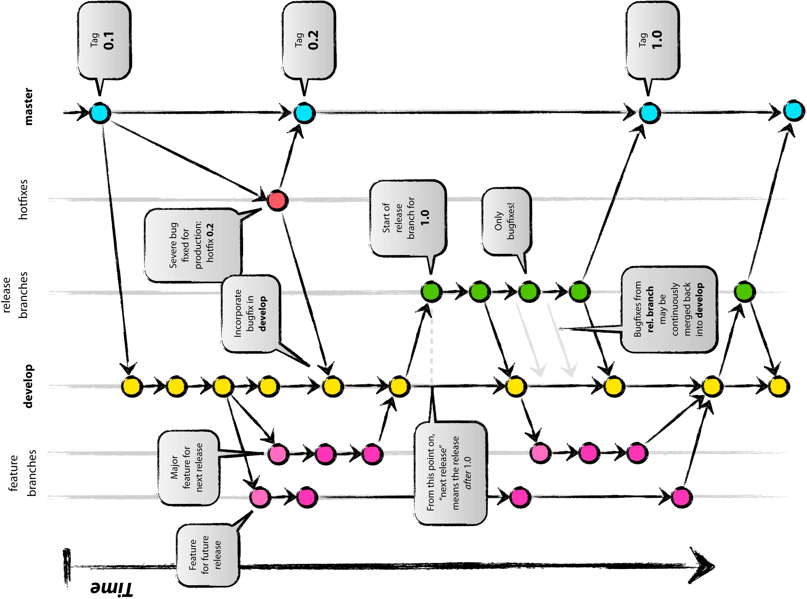

## 如何正确使用Git Flow

1. SVN式开发，在当前分支下开发，每个人都有写的权限，都可以直接push
2. Git Flow

下面是Git Flow的流程图


#### Git Flow常用的分支
- Production 分支
也就是我们经常使用的Master分支，这个分支最近发布到生产环境的代码，最近发布的Release， 这个分支只能从其他分支合并，不能在这个分支直接修改

- Develop 分支
这个分支是我们是我们的主开发分支，包含所有要发布到下一个Release的代码，这个主要合并与其他分支，比如Feature分支

- Feature 分支
这个分支主要是用来开发一个新的功能，一旦开发完成，我们合并回Develop分支进入下一个Release

- Release分支
当你需要一个发布一个新Release的时候，我们基于Develop分支创建一个Release分支，完成Release后，我们合并到Master和Develop分支

- Hotfix分支
当我们在Production发现新的Bug时候，我们需要创建一个Hotfix, 完成Hotfix后，我们合并回Master和Develop分支，所以Hotfix的改动会进入下一个Release

#### Git Flow如何工作
- 初始分支
所有在Master分支上的Commit应该Tag

- Feature 分支
分支名 feature/*
Feature分支做完后，必须合并回Develop分支, 合并完分支后一般会删点这个Feature分支，但是我们也可以保留


- Release分支
分支名 release/*

Release分支基于Develop分支创建，打完Release分之后，我们可以在这个Release分支上测试，修改Bug等。同时，其它开发人员可以基于开发新的Feature (记住：一旦打了Release分支之后不要从Develop分支上合并新的改动到Release分支)

发布Release分支时，合并Release到Master和Develop， 同时在Master分支上打个Tag记住Release版本号，然后可以删除Release分支了。


- 维护分支 Hotfix
分支名 hotfix/*

hotfix分支基于Master分支创建，开发完后需要合并回Master和Develop分支，同时在Master上打一个tag


#### Git Flow代码示例
1. 创建develop分支
```bash
git branch develop
git push -u origin develop   
``` 
2. 开始新Feature开发
```bash
git checkout -b some-feature develop
# Optionally, push branch to origin:
git push -u origin some-feature    

# 做一些改动    
git status
git add some-file
git commit  
```  
3. 完成Feature
```bash
git pull origin develop
git checkout develop
git merge --no-ff some-feature
git push origin develop

git branch -d some-feature

# If you pushed branch to origin:
git push origin --delete some-feature    
```
4. 开始Relase
```bash
git checkout -b release-0.1.0 develop

# Optional: Bump version number, commit
# Prepare release, commit
```
5. 完成Release
```bash
git checkout master
git merge --no-ff release-0.1.0
git push

git checkout develop
git merge --no-ff release-0.1.0
git push

git branch -d release-0.1.0

# If you pushed branch to origin:
git push origin --delete release-0.1.0   


git tag -a v0.1.0 master
git push --tags
```
6. 开始Hotfix
```bash
git checkout -b hotfix-0.1.1 master    
```
7. 完成Hotfix
```bash
git checkout master
git merge --no-ff hotfix-0.1.1
git push


git checkout develop
git merge --no-ff hotfix-0.1.1
git push

git branch -d hotfix-0.1.1

git tag -a v0.1.1 master
git push --tags
```


#### Git flow工具
实际上，当你理解了上面的流程后，你完全不用使用工具，但是实际上我们大部分人很多命令就是记不住呀，流程就是记不住呀，肿么办呢？

总有聪明的人创造好的工具给大家用, 那就是Git flow script.

##### 安装
- OS X
brew install git-flow

- Linux
apt-get install git-flow

- Windows
wget -q -O - --no-check-certificate https://github.com/nvie/gitflow/raw/develop/contrib/gitflow-installer.sh | bash

##### 使用

- 初始化: git flow init

- 开始新Feature: git flow feature start MYFEATURE

- Publish一个Feature(也就是push到远程): git flow feature publish MYFEATURE

- 获取Publish的Feature: git flow feature pull origin MYFEATURE

- 完成一个Feature: git flow feature finish MYFEATURE

- 开始一个Release: git flow release start RELEASE [BASE]

- Publish一个Release: git flow release publish RELEASE
- 发布Release: git flow release finish RELEASE
别忘了git push --tags

- 开始一个Hotfix: git flow hotfix start VERSION [BASENAME]

- 发布一个Hotfix: git flow hotfix finish VERSION


#### Git Flow GUI
SourceTree


[原文](https://www.cnblogs.com/cnblogsfans/p/5075073.html)


