<!-- toc -->
[TOC]
# GC
[GC 基础](https://www.toutiao.com/a6769524011689837069/)
[GC 追踪](https://www.toutiao.com/i6770673484801507852/)

[Visualizing Garbage Collection Algorithms](https://spin.atomicobject.com/2014/09/03/visualizing-garbage-collection-algorithms/)

[Garbage Collection In Go : Part I - Semantics](https://www.ardanlabs.com/blog/2018/12/garbage-collection-in-go-part1-semantics.html)
[Garbage Collection In Go : Part II - GC Traces](https://www.ardanlabs.com/blog/2019/05/garbage-collection-in-go-part2-gctraces.html)
[Garbage Collection In Go : Part III - GC Pacing](https://www.ardanlabs.com/blog/2019/07/garbage-collection-in-go-part3-gcpacing.html)

[紧密循环](https://github.com/golang/go/issues/10958)
[William Kennedy](https://www.ardanlabs.com/)
[LSivan](https://github.com/LSivan)
[GCTT Go中文网翻译组](https://github.com/studygolang/GCTT)

[Go 垃圾回收器指南](https://mp.weixin.qq.com/s/hbh9drP9pPBcOY7hLNeIAQ)

[浅析 Golang 垃圾回收机制](https://xie.infoq.cn/article/e4078a4d149f6bc80139159f1)
## GC 基础
### 简介
垃圾回收器负责跟踪堆内存分配，释放无用的分配内存以及维护在用分配内存。语言如何设计去实现这些行为是很复杂的，但不应该要求应用开发者为了构建软件而去理解细节。而且，对于语言不同版本的 VM 和运行时（runtime），这些细节的实现一直都在发展变化。对于应用开发者而言，重要的是保持一个良好的工作模型，了解垃圾回收器对其语言的行为以及如何在不关心其实现的情况下，对这种行为表示友好。

在 1.12 版本，Go 语言使用了无分代同步三色标记清除回收器（non-generational concurrent tri-color mark and sweep collector）。如果想形象化地了解标记清除回收器如何工作，Ken Fox 写了这篇提供了动画的[好文章](https://spin.atomicobject.com/2014/09/03/visualizing-garbage-collection-algorithms)。Go 回收器的实现随着发行版而发展变化，所以一旦下一版本发行，任意讲述实现细节的博文将不再准确。

虽然这样，我将在本文中做的分析不会关注实际的实现细节，而是关注你经历到的行为以及你希望在未来几年看到的行为。在这篇文章中，我将和你分享回收器的行为，并解释如何对该行为表示友好，无论当前实现或未来如何变化。这些都会让你成为更好的 Go 开发者。

注意：这里你可以对有关[垃圾回收器](https://github.com/ardanlabs/gotraining/tree/master/reading#garbage-collection) 以及 Go 实际的回收器进行扩展阅读


### 堆不是一个容器
我永远不会把堆叫做用来存储或释放值的容器。重要的是，要理解没有线性限制的内存都定义为“堆”。应该认为应用程序进程空间中的保留的任何内存都可用于堆内存分配。无论任何给定的堆内存分配属于虚拟或物理存储都与我们的模型无关。这种理解将帮助您更好地了解垃圾回收器的工作原理。

### 回收器行为
当某次回收开始，回收器经历三个阶段的工作。其中两个阶段引起 Stop The World ( STW ) 的延迟，另外的阶段会产生降低程序吞吐量的延迟。这三个阶段为：

- 标记开始 - STW
- 标记中 - 并发
- 标记结束 - STW

以下为每一个阶段的细分

#### 标记开始 - STW

当回收开始，首先执行的动作是打开写屏障。写屏障的目的是允许回收器在收集过程保持堆上的数据完整性，因为回收器和应用程序的 Goroutine 会并发执行。

为了打开写屏障，必须停止应用运行的所有 Goroutine 。这个动作通常非常快，平均在 10~30 微秒之间。这是指，如果应用程序的 Goroutine 表现正常情况下。

注意：为了更好理解这些调度图，请务必阅读[Go Scheduler](https://studygolang.com/articles/14264) 上的系列文章。


图 1 展示了回收之前应用有 4 个 Goroutine 在运行。这 4 个 Goroutine 都应该被停掉，唯一方法就是观察和等待每个 Goroutine 进行函数调用。函数调用保证了 Goroutine 在一个安全的点上被停掉。如果其中一个 Goroutine 没有进行函数调用，但其他的却做了函数调用，这会发生什么呢？

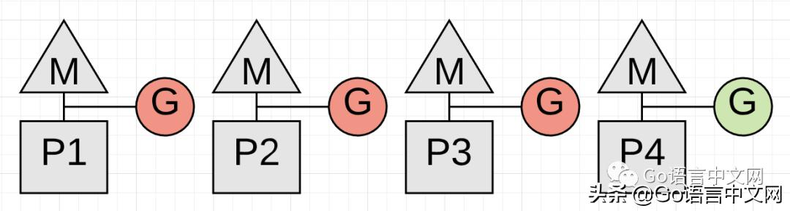
图 2 展示了一个真正的问题。在 P4 上运行的 Goroutine 停下来之前都不会开始回收。然而 P4 的 Goroutine 是不会停止的，因为它正在紧密循环[4] 地进行某些数学运算。

```golang
func add(numbers []int) int {
 var v int
 for _, n := range numbers {
 v += n
 }
 return v
}
```
展示了运行在 P4 上的 Goroutine 正在执行的代码。goroutine 可能以不合理的大量时间运行从而无法停止，这取决于切片的大小。这种代码会拖延回收的启动，更糟糕的是当回收器在等待时，其他的 P 都不能为任何其他的 Goroutine 服务。gorotine 在一个合理的时间范围内进行函数调用显得极其重要。


注意 : 这是语言团队想要在 1.14 通过加入[preemotive](https://github.com/golang/go/issues/24543) 技术到调度中去修复的问题


#### 标记中 - 并发
一旦开启了写障碍，回收器进入标记阶段。回收器做的第一件事是占用 CPU 可用处理能力的 25%。回收器使用 Gorouitne 去做回收工作，也同样需要应用程序的 Goroutine 使用的 P 和 M（译者注：从此处开始作者将 G 划分了两类，一类是应用程序用于自身工作的 Gourinte ，下文称应用 Goroutine，一类是用于 GC 的 Goroutine，这样会更好理解）。这意味着对于我们四个线程的 Go 程序，有一个完整的 P 会专门用来进行回收工作。


图 3 展示了回收器在回收过程中如何为自身占有 P1。现在回收器开始标记阶段了，标记阶段标记堆内存中仍在使用的值。这个工作先检查栈内所有存活的 Gorouitne，去寻找堆内存的根指针。然后回收器必须从那些根指针遍历堆内存图。当标记工作发生在 P1 上，应用程序可以继续在 P2, P3 和 P4 上同步工作。这意味着回收器的影响被最小化到当前 CPU 处理能力的 25%。

我希望这个事就这样完了然而并没有。如果在收集过程中，确认在 P1 上专用于 GC 的 Goroutine 在堆内存达到上限之前无法完成标记工作，该怎么办？如果 3 个 Goroutine 中，其中一个所进行的应用工作导致回收器无法及时完成 ( 标记工作 ) 又怎么办？( 译者注：此处的意思为内存分配过快 )。在这种情况下，新的分配必须放慢速度，特别是从那个 ( 导致标记无法完成的 ) Goroutine。

如果回收器确定它需要减慢分配，它会招募应用 Goroutine 以协助标记工作，这叫做辅助标记。任何应用 Goroutine 花费在辅助标记的时间长度与它添加到堆内存中的数据量成正比。辅助标记的一个好处是它有助于更快地完成回收。
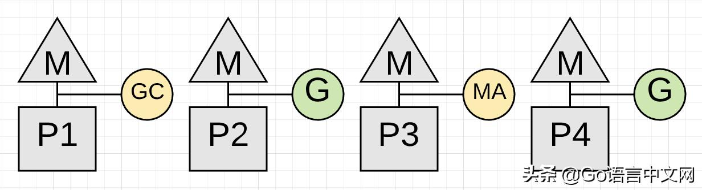
图 4 展示了运行在 P3 上的应用 Goroutine 如何进行辅助标记来帮助回收工作的。希望其他的应用 Goroutine 不用参与进来。分配动作较多的应用可以看到，大部分运行中的 Goroutine 在回收过程中都进行了少量的辅助标记。

回收器的一个目标是消除对辅助标记的需求。如果每次回收都需要大量的辅助标记才能结束，那么回收器很快就会开始下一次的垃圾回收。为了不那么快进行下一次的回收，努力去减少辅助标记的数量是必要的。

#### 标记结束 - STW
一旦标记工作完成，下阶段就是标记结束了。到这个阶段，写屏障会被停止，各样的清洁工作会被执行，然后计算好下一次的回收目标。在标记阶段，发现自身处于紧密循环的 Goroutine 也会延长这个阶段的时长。
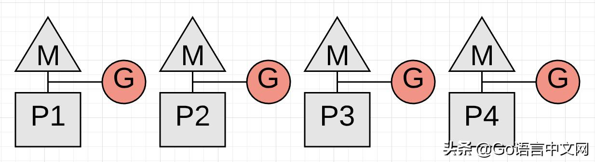
图 5 展示了在标记结束阶段完成时，所有的 Goroutine 如何停止的。这个动作通常平均在 60 到 90 微秒之间。这个阶段可以不需要 STW，但通过使用 STW，代码会更简单，小小的收益抵不上增加的复杂度。

一旦回收完成，每个 P 都能服务于应用 Goroutine，然后应用回到全力运行状态。

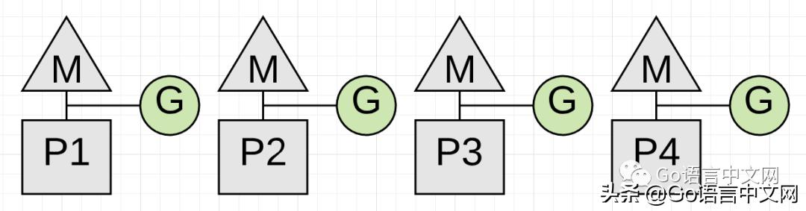
图 6 展示了一旦回收完成，所有可选的 P 如何再次处理应用的工作，应用回到回收开始前的全力运行状态。

#### 并发清除
在回收完成之后有另一个叫清除的动作发生。清除是指回收堆内存中，未标记为使用中的值所关联的内存。该动作会在应用程序 Goroutine 尝试分配新值到堆内存时发生。清除的延迟被算到在堆内存中执行分配的成本中，与垃圾回收相关的任何延迟无关。

下面是我机器上的追踪样本，有 12 条硬件线程可用于执行 Gorouitne。

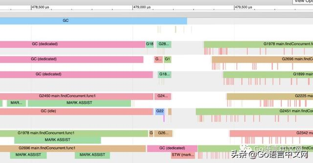
图 7 展示了追踪的部分快照。你可以看到在回收过程中 ( 盯着顶部的蓝色 GC 线 )，12 个 P 中的其中 3 个如何专门用于 GC。你可以看到 Goroutine2450，1978 和 2696 在这段时间进行了数次辅助标记，而不是执行应用的工作。在回收的最后，只有一个 P 用于 GC 并最终执行 STW ( 标记结束 ) 的工作。

在回收完成后，应用程序回到全力运行状态。此外你看到在 Goroutine 下面有一些玫瑰色的线条。
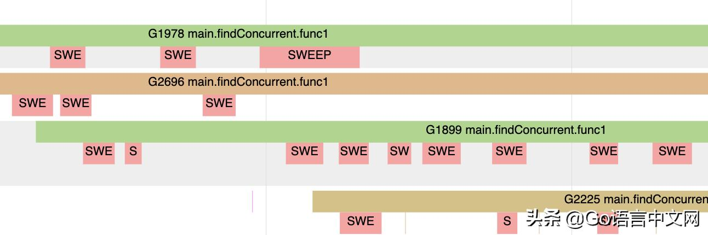

图 8 展示了那些玫瑰色的线条如何代表 Goroutine 不执行应用的工作而进行清除工作的时刻。这些都是 Goroutine 尝试分配新值到堆内存的时刻。

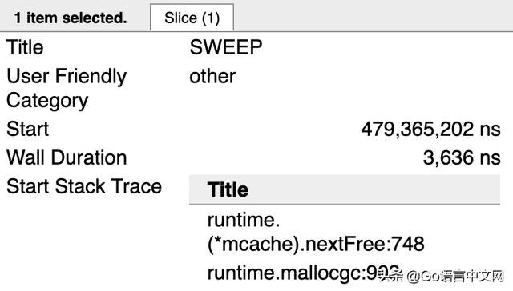

图 9 展示了其中一个进行清除动作的 Gorouitne 最后的栈跟踪情况。runtime.mallocgc 的调用会导致在堆内存分配新值。runtime.(*mcache).nextFree 的调用引起清除动作。一旦堆内存上没有更多的已分配内存需要回收，就不会再看到 nextFree 的调用。

刚刚描述的回收动作仅仅在回收过程开始和进行中才会发生。配置项 GC 百分比在决定何时启动垃圾回收任务中扮演重要角色。

### GC 百分比
运行过程中有一个配置项叫 GC 百分比，默认值设置为 100。这个值代表了在下次回收开始前能分配多大的堆内存。设置 GC 百分比为 100 意味着，根据回收完成后标记为存活的堆内存量，下一次回收必须在堆内存上添加 100 ％ 以上的新分配 ( 内存 ) 才启动。

举个例子，想象某次回收完成后堆内存有 2MB 存活。( 译者注：后半句话应该是分配 2MB 后 GC 才会开始，作者省了。。。)

注意 : 在这篇博文中堆内存的图不代表使用 Go 的时候的真实情况。Go 中的堆内存通常是碎片化和混乱的，而且没有图像所描绘的那么清晰。这些图在更为易于理解的方式上提供可视化堆内存的方法，这种方式对于你将体验的行为是准确的。

图 10 展示了最后的回收完成后，使用中的 2 MB 堆内存。因为 GC 百分比设置为 100%，下一次回收需要在额外分配 2 MB 的堆内存时才开始，或者在超过 2 MB 之前开始。


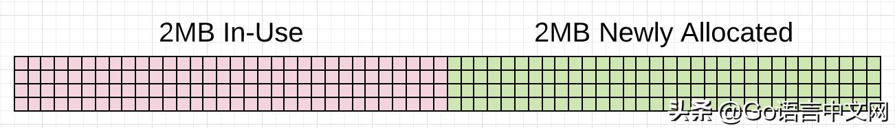
图 11 展示了超过 2MB 堆内存正在使用，这会触发回收。查看该动作所有 ( 细节 ) 的方法是，为每次回收生成 GC 追踪。

### GC 追踪
GC 追踪可以通过在运行任意 Go 应用时包含环境变量 GODEBUG 并指定 gctracec=1 来生成。每次回收发生，运行时会将 GC 追踪信息写到 stderr 中。
```
GODEBUG=gctrace=1 ./app

gc 1405 @6.068s 11%: 0.058+1.2+0.083 ms clock, 0.70+2.5/1.5/0+0.99 ms CPU, 7->11->6 MB, 10 MB Goal, 12 P

gc 1406 @6.070s 11%: 0.051+1.8+0.076 ms clock, 0.61+2.0/2.5/0+0.91 ms CPU, 8->11->6 MB, 13 MB Goal, 12 P

gc 1407 @6.073s 11%: 0.052+1.8+0.20 ms clock, 0.62+1.5/2.2/0+2.4 ms CPU, 8->14->8 MB, 13 MB Goal, 12 P
```
展示了如何使用 GODEBUG 变量来生成 GC 追踪。清单也展示了运行 Go 应用生成的 3 份追踪信息。

以下是通过查看清单中的第一个 GC 追踪线来拆解 GC 追踪中每个值的含义。

```
gc 1405 @6.068s 11%: 0.058+1.2+0.083 ms clock, 0.70+2.5/1.5/0+0.99 ms CPU, 7->11->6 MB, 10 MB Goal, 12 P

// General
gc 1404 : 自程序启动以来，1404 的 GC 运行 ( 译者注：此处应当是笔误，联系上文其实是 1405)
@6.068s : 自程序启动至此总共 6s
11% : 到目前为止，可用 CPU 的 11% 被用于 GC
// Wall-Clock
0.058ms : STW : 标记开始，开启写障碍
1.2ms : 并发 : 标记中
0.083ms : STW : 标记结束 - 关闭写障碍并清除

// CPU Time
0.70ms : STW : 标记开始
2.5ms : 并发 : 辅助标记时间 (GC 按照分配执行 )
1.5ms : 并发 : 标记 - 后台 GC 时间
0ms : 并发 : 标记 - 空闲 GC 时间
0.99ms : STW : 标记结束

// Memory
7MB : 标记开始前使用中的堆内存
11MB : 标记完成后使用中的堆内存
6MB : 标记完成后被标记为存活的堆内存
10MB : 标记完成后使用中的堆内存收集目标

// Threads
12P : 用于运行 Gorouitne 的物理调度器或线程的数量
```
展示了第一条 GC 追踪线的实际数字所代表的含义，按行进行拆解。我后面会谈及这些值中的大部分，但现在只要关注 1405 的 GC 追踪的内存部分。


```
// Memory
7MB : 标记开始前使用中的堆内存
11MB : 标记完成后使用中的堆内存
6MB : 标记完成后被标记为存活的堆内存
10MB : 标记完成后使用中的堆内存收集目标
```
上面的 GC 追踪线想告诉你的是，在标记工作开始前使用中的堆内存大小为 7 MB。当标记工作完成时，使用中的堆内存大小达到了 11 MB。这意味着在回收过程中出现了额外的 4 MB 内存分配。在标记工作完成后被标记为存活的堆内存大小为 6 MB。这意味着在下次回收开始前应用可以增加使用的堆内存到 12 MB ( 存活堆大小 6 MB 的 100%)。

你可以看到回收器与其目标有 1 MB 的偏差，标记工作完成后正在使用的堆内存量为 11 MB 而不是 10 MB。这没关系，因为目标是根据当前正在使用的堆内存量、标记为存活的堆内存量以及在回收运行时将会发生的其他分配的时间计算情况来计算的。在这种情况下，应用程序做了一些需要在标记之后使用更多的堆内存的事情，而不是像预期那样。

如果查看下一个 GC 跟踪线（1406），你会看到事情在 2 ms 内发生了变化。

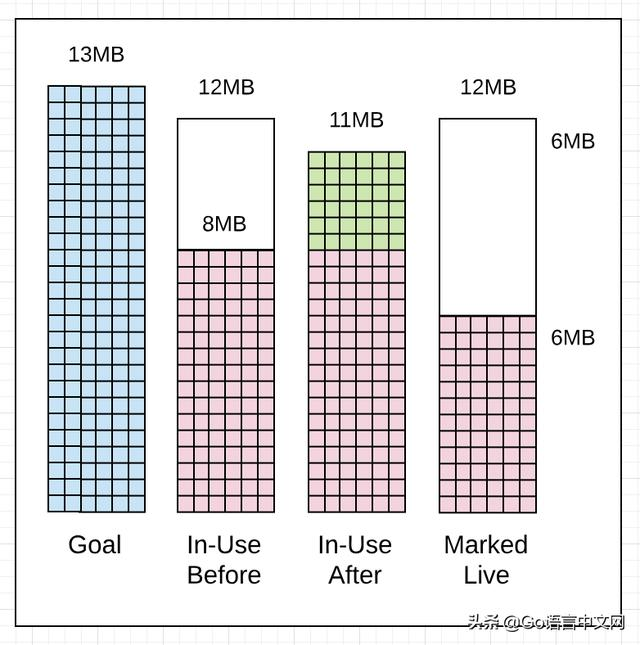

```
gc 1406 @6.070s 11%: 0.051+1.8+0.076 ms clock, 0.61+2.0/2.5/0+0.91 ms CPU, 8->11->6 MB, 13 MB Goal, 12 P

// Memory
8MB : 标记开始前使用中的堆内存
11MB : 标记完成后使用中的堆内存
6MB : 标记开完成后被标记为存活的堆内存
13MB : 标记完成后的使用堆内存收集目标
```
清单 5 展示了这次回收如何在前一次回收 2 ms 之后开始了，即便使用中的堆内存仅仅达到了 8 MB，而所允许的是 12 MB。这需要特别注意，如果回收器认为早点开始回收会好一点，那么就会提前开始。在这种情况下，它提前开始大概是因为应用在进行大量的分配工作，然后回收器想要降低这次回收的辅助标记的延时。

还有两件事要注意。回收器这次在他的目标之内。标记完成后使用中堆内存的大小是 11 MB 而不是 13 MB，少了 2 MB。标记完成后标记为存活的堆内存大小一样为 6 MB。

附注一点，你可以通过增加 gcpacertrace=1 标志从 GC 追踪获取更多细节，这会让回收器打印更多有关并发步调器的内部状态。

```
$ export GODEBUG=gctrace=1,gcpacertrace=1 ./app

样本输出：
gc 5 @0.071s 0%: 0.018+0.46+0.071 ms clock, 0.14+0/0.38/0.14+0.56 ms CPU, 29->29->29 MB, 30 MB Goal, 8 P

pacer: sweep done at heap size 29MB; allocated 0MB of spans; swept 3752 pages at +6.183550e-004 pages/byte

pacer: assist ratio=+1.232155e+000 (scan 1 MB in 70->71 MB) workers=2+0

pacer: H_m_prev=30488736 h_t=+2.334071e-001 H_T=37605024 h_a=+1.409842e+000 H_a=73473040 h_g=+1.000000e+000 H_g=60977472 u_a=+2.500000e-001 u_g=+2.500000e-001 W_a=308200 Goal Δ =+7.665929e-001 actual Δ =+1.176435e+000 u_a/u_g=+1.000000e+000
```
运行 GC 追踪可以告诉你很多关于程序健康状态以及回收器步调的事情。回收器运行的步调在回收过程中起了重要作用。

### 步调
回收器具有确定何时开始收集的步调算法。算法依赖于回收器用于收集有关正在运行的应用的信息以及应用在堆上分配的压力的反馈循环。压力可以被定义为在指定时间范围内应用分配堆内存的速度。正是压力决定了回收器需要运行的速度。

在回收器开始回收之前，它会计算完成回收所需的时间。然后一旦回收运行，将会对正在运行的应用程序上造成延迟，这将让应用程序的工作变慢。每次回收都会增加应用程序的整体延迟。

一种误解是认为降低回收器步调是改善性能的一种方法。这个想法是，如果你能延缓下次回收的开始，那么你也能延缓它所造成的延时。对回收器友好并不是要降慢其步调。

你可以决定改变 GC 百分比的值使其超过 100。这会在下次回收开始前增加分配的堆内存的大小，从而导致回收的步调降低，不要考虑做这种事。


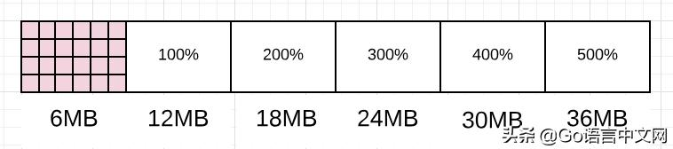
图 14 展示了改变 GC 百分比会如何改变下次回收开始前允许分配的堆内存大小。你可以想象回收器如何因为等待更多的堆内存被使用而变慢。

尝试直接影响回收器的步调对友好对待回收器并无帮助。如果确实希望在每次回收之间或回收期间完成更多的工作，可以减少任意工作添加到堆内存的分配数量或次数。

注意：这个想法也是为了用尽可能小的堆来实现所需的吞吐量。请记住，在云环境中运行时，最小化堆内存等资源的使用非常重要。

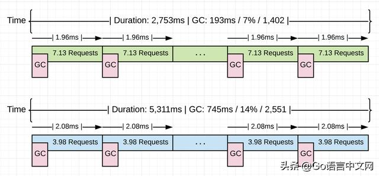
图 15 显示了将在本系列 ( 博文 ) 的下一篇文章中所使用的 Go 应用程序运行的一些统计信息。蓝色版本显示没经过任何优化的应用程序在处理 10 K 请求时的统计信息。绿色版本显示了发现并去掉应用程序 4.48 GB 的非生产性的内存分配后，处理相同的 10 k 请求的统计信息。

看这两个版本的平均收集速度（2.08 ms vs 1.96 ms），它们几乎相同，约为 2.0 ms。这两个版本之间的根本差异是每次回收之间的工作量，从每次回收处理 3.98 增加到 7.13 个请求，以同样的速度完成的工作量增加了 79.1 ％。正如你所看到的，回收并没有随着这些分配的减少而减慢，而是保持不变，（绿色版本的）胜出之处是因为每次回收之间完成了更多工作。

调整回收的步调以延缓其延迟花费并不是你提高应用程序性能的方式。减少回收器运行所需的时间，这反过来就会减少造成的延迟成本。虽然已经对回收器造成的延迟花费进行了解释，但为了清楚起见，让我再总结一下。

### 回收器延时消耗

运行应用中每次回收有两种类型的延时。第一种是窃取（stealing） CPU 的处理能力。窃取 CPU 处理能力的影响是你的应用在回收过程中不能以全力状态运行。因为应用的 Goruinte 正在和回收器的 Goroutine 共享 P，或者正在帮助回收 ( 辅助标记 )。


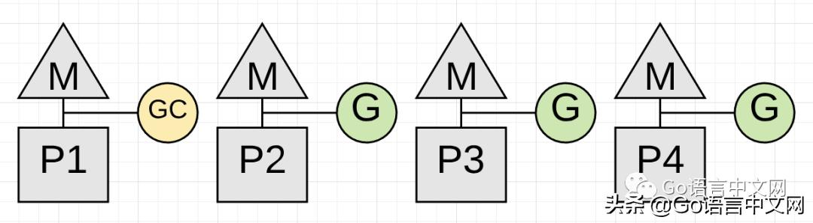
图 16 展示了应用如何仅仅使用 CPU 处理能力的 75% 去工作。这是因为回收器为了回收占用了 P1。

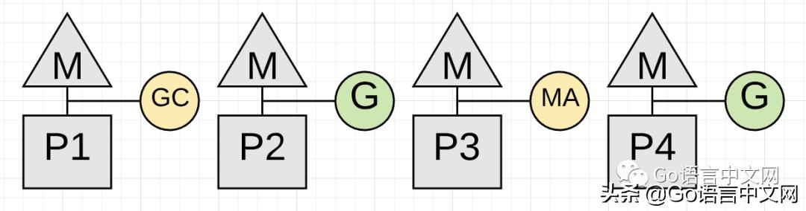

图 17 展示了在这个时刻（通常只有几微秒）应用如何只使用一半的 CPU 处理能力为应用工作。这是因为在 P3 上的 Goroutine 正在进行辅助标记，并且回收器为自己设置了专用的 P1。

注意：标记通常需要 4 个 CPU- 毫秒（CPU-millseconds）处理每 MB 存活的堆 (e.g. 为了评估标记需要运行多少毫秒，用存活的堆大小 MB 然后除以 0.25 乘上 CPU 个数 )。标记实际以 1 MB/ms 运行，但是因为只用了 1/4 的 CPU（译者注：所以是 4 ms 处理 1 MB，也就是开头的 4 个 CPU- 毫秒每 MB）

第二个延时取决于在回收过程中出现的 STW 延迟出现的次数。STW 时间是没有应用程序 Goroutine 执行任意应用程序工作的时间。该应用程序基本上停止了。

图 18 展示了 STW 延时，这个时候所有 Goroutine 都会停止，这会在每次回收发生两次。如果你的应用健康，回收器可以保持大部分回收过程的总 STW 时间在 100 微秒之内。

你现在已经知道回收器的不同时期，内存如何分配，步调器如何工作，以及回收器在你运行应用中主要出现的不同延时。通过这些知识，你如何对回收器友好的问题终于能解决了。

### 对回收器友好
对回收器表示友好就是降低内存压力。请记住，压力定义为应用在指定时间内分配内存的速度。当压力降低时，因回收器主要引发的延迟就会降低。而 GC 延迟会拖慢你的应用。

能够降低 GC 延迟的方式是，从应用中辨别和去掉不需要的内存分配。可以通过以下几种方式帮助回收器。

帮助回收器：

- 尽可能维护最小化的堆
- 找到最佳的一致步调
- 每次回收保持在目标之内
- 最小化每次回收，STW 以及辅助标记的持续时长

以上所列都能帮助降低在你运行中的程序，主要因回收器造成的延迟大小。这会改善应用的吞吐量表现。我们不需要回收器的步调做任何处理，下面是你可以做的其他事情，以帮助做出更好的工程决策，减少堆上的压力。

### 了解应用程序执行的工作负载的性质

了解工作负载意味着确保使用合理数量的 Goroutine 来完成你的工作。CPU 密集型与 IO 密集型的工作负载不同，需要不同的工程决策。

https://studygolang.com/articles/17014

### 了解已定义的数据及其在应用程序中的传递方式
了解数据意味着了解你尝试解决的问题。数据语义一致性是维护数据完整性的关键部分，并且允许你在堆栈上选择堆分配时（通过读取代码）知道这件事。

https://studygolang.com/articles/12487


### 结论
作为 Go 开发者，如果你花时间专注于减少分配，你正在对垃圾回收器表示友好。你不能编写零分配的应用程序，因此重要的是要认识到有效的分配（对应用有助）和无生产力的分配（对应用有害）之间的差异。然后信任垃圾回收器，相信它能保持堆处于健康状态，并使你的应用程序始终如一地运行。

拥有垃圾回收器是一笔很划算的交易，我花费垃圾回收的成本，因而没有内存管理的负担。Go 允许你作为开发人员提高工作效率的同时还可以编写足够快的应用程序。垃圾回收器对实现这一目标起了重要作用。在下一篇文章中，我将向你展示一个示例 Web 应用程序以及如何动手使用工具查看所有这些信息。
## GC 追踪

### 介绍
在第一篇文章中，我花了一些时间描述了垃圾回收器的行为并且展示了它对正在运行的应用造成的延迟。我还分享了如何去生成并且解释 GC 追踪，展示了堆中的内存是如何变化的，并且解释了 GC 的不同阶段以及它们是如何影响延迟成本的。

那篇文章得出的最后结论是，降低堆的压力，就会降低延迟成本从而增加应用的性能。我也提出了另外一个观点，通过找到增加任意两次垃圾回收间隔时间的方法，来降低回收器开始的步调不是一个好的策略。一个稳定的步调，即使比较快，也会有利于保持应用的高性能运行

在本篇文章中，我将会带领你运行一个真实的 Web 应用并且向你展示如何生成 GC 追踪和应用的性能概要（profile）文件。然后我会向你展示如何解释这些工具的输出内容，从而找到一个提升应用性能的方法。

### 运行应用
看一下我在 Go 练习中用到的这个 Web 应用

https://github.com/ardanlabs/gotraining/tree/master/topics/go/profiling/project

图 1 展示了这个 Web 应用的界面，这个应用从不同的新闻提供者那里下载三组 rss 源并且允许用户进行搜索。编译过后，执行该应用
```
$ go build
$ GOGC=off ./project > /dev/null
```
向我们展示了如何启动应用，并通过设置 GOGC 环境变量为 off 来关闭垃圾回收。日志文件被重定向到了 /dev/null 设备。应用运行的过程中，我们可以发送请求到服务器。

```
$ hey -m POST -c 100 -n 10000 "http://localhost:5000/search?term=topic&cnn=on&bbc=on&nyt=on"
```
向我们展示了如何利用 hey 工具通过 100 个连接向服务端发送 10k 的请求。当所有的请求都成功发送到服务器时，就会发生接下来的结果

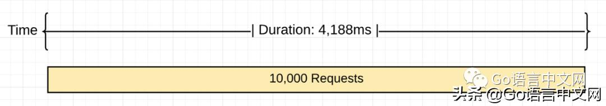

图片 2 形象的展示了在垃圾回收器关闭的情况下处理 10k 数据的过程。处理 10k 的请求共花费了 4188 ms，这样算下来服务器每秒只能处理 2387 个请求。


### 打开垃圾回收器

如果启动这个应用的时候把垃圾回收打开会发生什么呢？
```
$ GODEBUG=gctrace=1 ./project > /dev/null
```
上面展示了如何启动应用并打开 GC 追踪。这里移除了 GOGC 变量并且替换为 GODEBUG。GODEBUG 这样设置了之后，运行时就会在每次垃圾回收发生的时候产生一条 GC 追踪。现在又可以向服务器发送同样的 10k 请求了。一旦所有的请求都发送到服务器后，就会产生一些可以用来分析的 GC 追踪信息和 hey 工具产生的信息。


```
$ GODEBUG=gctrace=1 ./project > /dev/null
gc 3 @3.182s 0%: 0.015+0.59+0.096 ms clock, 0.19+0.10/1.3/3.0+1.1 ms CPU, 4->4->2 MB, 5 MB Goal, 12 P
.
.
.
gc 2553 @8.452s 14%: 0.004+0.33+0.051 ms clock, 0.056+0.12/0.56/0.94+0.61 ms CPU, 4->4->2 MB, 5 MB Goal, 12 P
```
上面展示了运行过程中的第三条和最后一条 GC 追踪信息。我没有展示前两个垃圾回收信息是因为负载发送到服务器的时候这两次垃圾回收已经发生了。最后一次垃圾回收显示了它在处理 10k 请求过程中一共发生了 2551 次垃圾回收（减去了前两次，它们没有计算在内）。

下边是追踪信息的具体内容

```
gc 2553 @8.452s 14%: 0.004+0.33+0.051 ms clock, 0.056+0.12/0.56/0.94+0.61 ms CPU, 4->4->2 MB, 5 MB Goal, 12 P

gc 2553     : The 2553 GC runs since the program started
@8.452s     : Eight seconds since the program started
14%         : Fourteen percent of the available CPU so far has been spent in GC

// wall-clock
0.004ms     : STW        : Write-Barrier - Wait for all Ps to reach a GC safe-point.
0.33ms      : Concurrent : Marking
0.051ms     : STW        : Mark Term     - Write Barrier off and clean up.

// CPU time
0.056ms     : STW        : Write-Barrier
0.12ms      : Concurrent : Mark - Assist Time (GC performed in line with allocation)
0.56ms      : Concurrent : Mark - Background GC time
0.94ms      : Concurrent : Mark - Idle GC time
0.61ms      : STW        : Mark Term

4MB         : Heap memory in-use before the Marking started
4MB         : Heap memory in-use after the Marking finished
2MB         : Heap memory marked as live after the Marking finished
5MB         : Collection Goal for heap memory in-use after Marking finished

// Threads
12P         : Number of logical processors or threads used to run Goroutines.
```
上面展示了最后一次垃圾回收的实际数据。幸亏有了 hey 工具，这些是运行的性能结果。

```
Requests            : 10,000
------------------------------------------------------
Requests/sec        : 1,882 r/s   - Hey
Total Duration      : 5,311ms     - Hey
Percent Time in GC  : 14%         - GC Trace
Total Collections   : 2,551       - GC Trace
------------------------------------------------------
Total GC Duration   : 744.54ms    - (5,311ms * .14)
Average Pace of GC  : ~2.08ms     - (5,311ms / 2,551)
Requests/Collection : ~3.98 r/gc  - (10,000 / 2,511)
```
上面展示了执行结果。下边则更形象的向我们展示了发生了什么

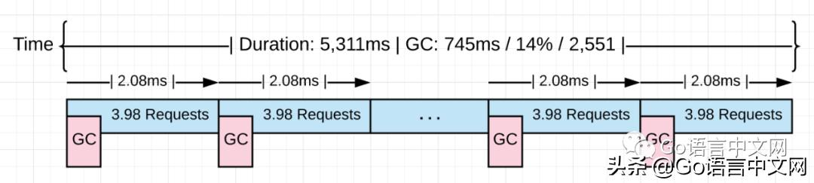
图 3 形象的展示了发生了什么。当垃圾回收打开的时候它必须执行 2.5k 次来处理同样的 10k 请求。平均每 2 ms 开始一次垃圾回收，执行所有的垃圾回收需要增加额外的 1.1 秒的延迟

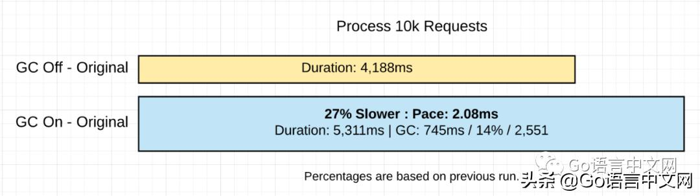

图 4 展示了到现在为止应用两次执行的对比


### 减少分配

获取堆的 profile 并看下有没有可移除的非生产性质的分配将会很有用
```
go tool pprof http://localhost:5000/debug/pprof/allocs
```
上面展示了使用 pprof 工具调用 /debug/pprof/allocs 路径（endpoint）来从运行的应用中拉取内存的性能概要（profile）。
之所以用那个路径是因为在源程序中添加了以下代码

```
import _ "net/http/pprof"

go func() {
    http.ListenAndServe("localhost:5000" , http.DefaultServeMux)
}()
```
上面展示了如何绑定 /debug/pprof/allocs 路径到任何应用中。增加 net/http/pprof包的导入可以绑定路径到默认的服务器路由。然后调用 http.ListenAndServer 方法并传入 http.DefaultServerMux 常量使该路径可用。

profiler 启动后，就可以用 top 命令查看正在分配内存的前 6 个方法

```
(pprof) top 6 -cum
Showing nodes accounting for 0.56GB, 5.84% of 9.56GB total
Dropped 80 nodes (cum <= 0.05GB)
Showing top 6 nodes out of 51
      flat  flat%   sum%        cum   cum%
         0     0%     0%     4.96GB 51.90%  net/http.(*conn).serve
    0.49GB  5.11%  5.11%     4.93GB 51.55%  project/service.handler
         0     0%  5.11%     4.93GB 51.55%  net/http.(*ServeMux).ServeHTTP
         0     0%  5.11%     4.93GB 51.55%  net/http.HandlerFunc.ServeHTTP
         0     0%  5.11%     4.93GB 51.55%  net/http.serverHandler.ServeHTTP
    0.07GB  0.73%  5.84%     4.55GB 47.63%  project/search.rssSearch
```

上面的底部展示了 rssSearch 方法的表现。这个方法到现在共分配了 5.96 GB 中的 4.55 GB。现在是时候使用 list 命令来分析 rssSearch 方法的细节了

```
(pprof) list rssSearch
Total: 9.56GB
ROUTINE ======================== project/search.rssSearch in project/search/rss.go
   71.53MB     4.55GB (flat, cum) 47.63% of Total

         .          .    117:   // Capture the data we need for our results if we find ...
         .          .    118:   for _, item := range d.Channel.Items {
         .     4.48GB    119:           if strings.Contains(strings.ToLower(item.Description), strings.ToLower(term)) {
   48.53MB    48.53MB    120:                   results = append(results, Result{
         .          .    121:                           Engine:  engine,
         .          .    122:                           Title:   item.Title,
         .          .    123:                           Link:    item.Link,
         .          .    124:                           Content: item.Description,
         .          .    125:                   })
```

上面展示了 list 命令的执行结果。指出了 119 行代码分配了大量的内存

```
4.48GB    119:           if strings.Contains(strings.ToLower(item.Description), strings.ToLower(term)) {
```
上面展示了出现问题的那行代码。那个方法到现在一共分配了 4.55 GB，仅改行代码就占了 4.48 GB。接下来，是时候审核一下这行代码来看看有什么可以做的。

```
117 // Capture the data we need for our results if we find the search term.
118 for _, item := range d.Channel.Items {
119     if strings.Contains(strings.ToLower(item.Description), strings.ToLower(term)) {
120         results = append(results, Result{
121             Engine:  engine,
122             Title:   item.Title,
123             Link:    item.Link,
124             Content: item.Description,
125        })
126    }
127 }
```
上面展示了那行代码在一个紧密的循环中。对 strings.ToLower 的调用将会产生分配因为创建新的 strings 需要在堆上分配内存。这些 strings.ToLower 的调用是没有必要的，因为这些调用可以在循环外完成。

修改一下 119 行可以移除掉所有的这些内存分配

```
// Before the code change.
if strings.Contains(strings.ToLower(item.Description), strings.ToLower(term)) {

// After the code change.
if strings.Contains(item.Description, term) {
```

注意：你没看到的其他的改动的代码功能是将源放到缓存里之前让描述变为小写。新闻源每 15 分钟缓存一次。使 term 变为小写的调用是在循环外部

上面 展示了如何移除了对 strings.ToLower 的调用。用新的改动过的代码重新编译该项目，重新对服务器发起 10 请求。

```
$ go build
$ GODEBUG=gctrace=1 ./project > /dev/null
gc 3 @6.156s 0%: 0.011+0.72+0.068 ms clock, 0.13+0.21/1.5/3.2+0.82 ms CPU, 4->4->2 MB, 5 MB Goal, 12 P
.
.
.
gc 1404 @8.808s 7%: 0.005+0.54+0.059 ms clock, 0.060+0.47/0.79/0.25+0.71 ms CPU, 4->5->2 MB, 5 MB Goal, 12 P
```
上面展示了在代码修改之后处理同样的 10k 请求现在是如何使用了 1402 次垃圾回收的。这些是两次执行的所有结果。

```
With Extra Allocations              Without Extra Allocations
======================================================================
Requests            : 10,000        Requests            : 10,000
----------------------------------------------------------------------
Requests/sec        : 1,882 r/s     Requests/sec        : 3,631 r/s
Total Duration      : 5,311ms       Total Duration      : 2,753 ms
Percent Time in GC  : 14%           Percent Time in GC  : 7%
Total Collections   : 2,551         Total Collections   : 1,402
----------------------------------------------------------------------
Total GC Duration   : 744.54ms      Total GC Duration   : 192.71 ms
Average Pace of GC  : ~2.08ms       Average Pace of GC  : ~1.96ms
Requests/Collection : ~3.98 r/gc    Requests/Collection : 7.13 r/gc
```
上面展示了跟最后一次的对比结果。
下边是更形象的表达发生了什么

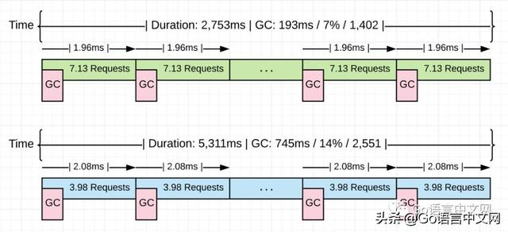

图 5 形象的展示了发生了什么。这次处理相同的 10k 请求回收器少执行了 1149 (1420 vs 2551) 次。这使得整个的 GC 时间百分比从 14% 降到 7%。使应用的运行速度提升了 48%，垃圾回收时间降低了 74%。

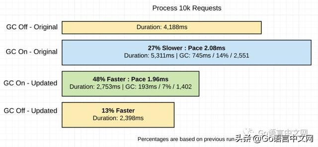
图 6 展示了应用所有不同运行情况的一个对比。为了完整性，我将优化后的代码并关闭垃圾回收的运行情况也包含在内

### 我们学到了什么

正如我在上一篇文章中说的，对垃圾回收器友好就是降低堆上的压力。记住，压力可以定义为应用在确定时间内在堆上分配所有可用内存的速度。当压力降低时，由垃圾回收器所造成的延迟也会降低。拖慢你应用的就是这个延迟。

对回收器友好跟放慢垃圾回收的步调无关，而是跟在垃圾回收的间隔或期间让更多的工作做完有关。你可以通过降低任何一个工作在堆上分配内存的数量和次数来达到目的。

```
With Extra Allocations              Without Extra Allocations
======================================================================
Requests            : 10,000        Requests            : 10,000
----------------------------------------------------------------------
Requests/sec        : 1,882 r/s     Requests/sec        : 3,631 r/s
Total Duration      : 5,311ms       Total Duration      : 2,753 ms
Percent Time in GC  : 14%           Percent Time in GC  : 7%
Total Collections   : 2,551         Total Collections   : 1,402
----------------------------------------------------------------------
Total GC Duration   : 744.54ms      Total GC Duration   : 192.71 ms
Average Pace of GC  : ~2.08ms       Average Pace of GC  : ~1.96ms
Requests/Collection : ~3.98 r/gc    Requests/Collection : 7.13 r/gc
```
上面展示了两个版本的应用在垃圾回收打开的情况下运行的结果。很明显，移除了 4.48 G 的内存分配使得应用运行的更快。有趣的是，每一次的垃圾回收的平均时间几乎一样，差不多 2.0 ms。这两个版本之间最根本的改变是每次垃圾回收间隔期间工作完成的数量。应用从 3.98 r/gc 到 7.13 r/gc。工作完成数量增加了 79.1%。

在任何两次垃圾回收间隔之间让更多的工作做完帮助将所需要的垃圾回收次数从 2551 降到 1402，降低了 45%。应用在整个 GC 时间上从 745 ms 降到了 193 ms，74% 的降低，对于各自的版本在垃圾回收时间上也有一个 14% 到 7% 的降低。当以关闭垃圾回收的方式运行代码优化后的版本时，应用消耗时间从 2753 降到了 2398，性能差距仅有 13%。

### 结论
作为一个 Go 开发者，如果你花时间专注于降低内存分配，你正在尽你所能的对垃圾回收器友好。你不能写一个 0 内存分配的应用，所以认清生产性 ( 有助于应用 ) 和非生产性 ( 对应用有害 ) 的内存分配之间的区别很重要。信任垃圾回收器，并保证堆的合理使用，你的应用就会一直运行完好

有一个垃圾回收器是一个很好的权衡。我会为垃圾回收的成本买单，所以我没有内存管理的负担。Go 是想让你作为一个开发者能够快速写出一个性能足够好的应用。垃圾回收器为实现这一目标起到了很大作用。在下一篇文章中，我将会分享另外一个项目，它将会展示垃圾回收器是如何分析你的 Go 应用并找到最佳回收路径的。
