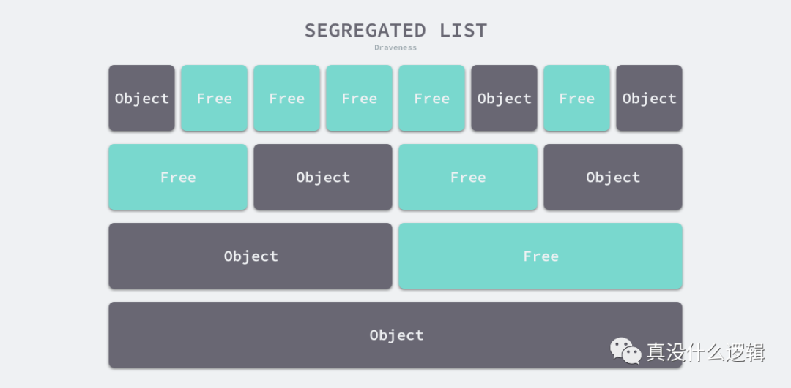
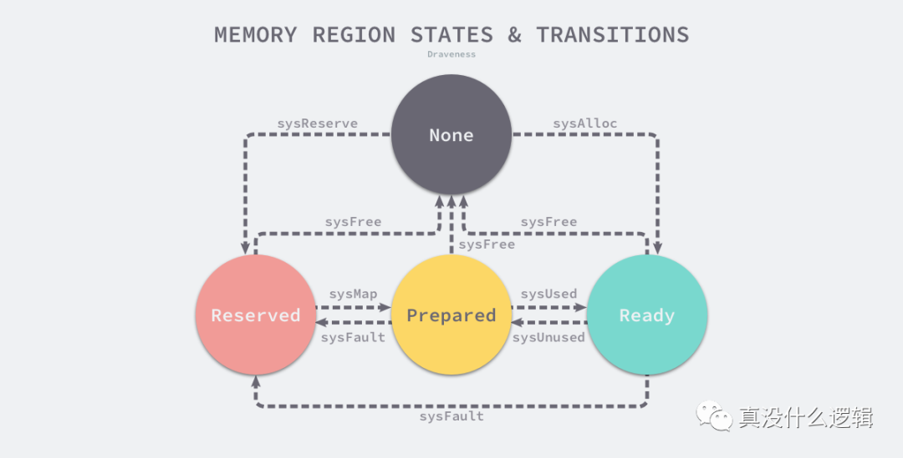
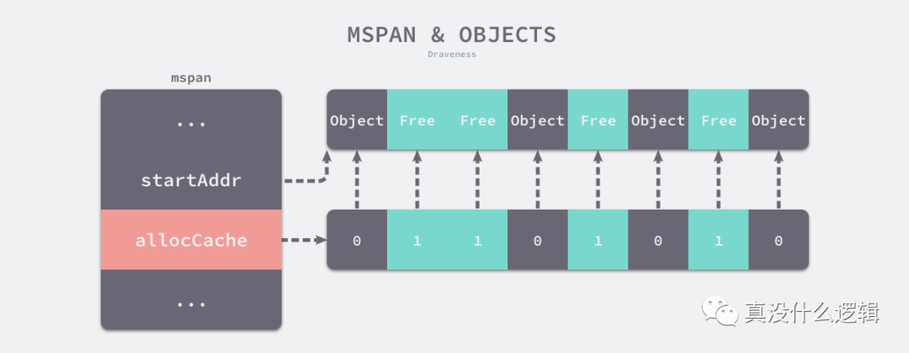
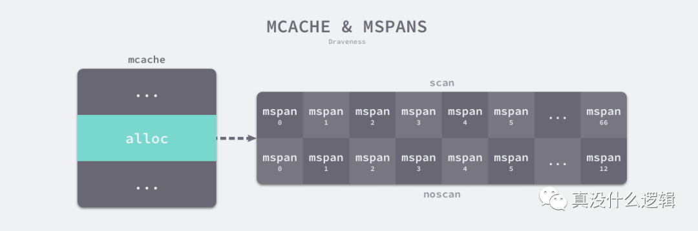
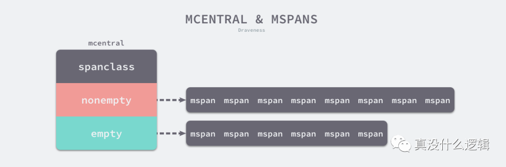
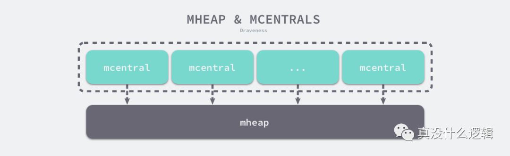

<!--toc-->
[TOC]

程序中的数据和变量都会被分配到程序所在的虚拟内存中，内存空间包含两个重要区域 — 栈区（Stack）和堆区（Heap）。函数调用的参数、返回值以及局部变量大都会被分配到栈上，这部分内存会由编译器进行管理；不同编程语言使用不同的方法管理堆区的内存，C++ 等编程语言会由工程师主动申请和释放内存，Go 以及 Java 等编程语言会由工程师和编译器共同管理，堆中的对象由内存分配器分配并由垃圾收集器回收。

不同的编程语言会选择不同的方式管理内存，本节会介绍 Go 语言内存分配器，详细分析内存分配的过程以及其背后的设计与实现原理。

## 设计原理

内存管理一般包含三个不同的组件，分别是用户程序（Mutator）、分配器（Allocator）和收集器（Collector）[^1]，当用户程序申请内存时，它会通过内存分配器申请新的内存，而分配器会负责从堆中初始化相应的内存区域。

mutator-allocator-collector

**图 7-1 内存管理的组件**

Go 语言的内存分配器实现非常复杂，在分析内存分配器的实现之前，我们需要了解内存分配的设计原理，帮助我们更快掌握内存的分配过程。这里将要详细介内存分配器的分配方法以及 Go 语言内存分配器的分级分配方法、虚拟内存布局和地址空间。

### 分配方法

编程语言的内存分配器一般包含两种分配方法，一种是线性分配器（Sequential Allocator，Bump Allocator），另一种是空闲链表分配器（Free-List Allocator），这两种分配方法有着不同的实现机制和特性，本节会依次介绍它们的分配过程。

#### 线性分配器

线性分配（Bump Allocator）是一种高效的内存分配方法，但是有较大的局限性。当我们在编程语言中使用线性分配器，我们只需要在内存中维护一个指向内存特定位置的指针，当用户程序申请内存时，分配器只需要检查剩余的空闲内存、返回分配的内存区域并修改指针在内存中的位置，即移动下图中的指针：

bump-allocator

**图 7-2 线性分配器**

根据线性分配器的原理，我们可以推测它有较快的执行速度，以及较低的实现复杂度；但是线性分配器无法在内存被释放时重用内存。如下图所示，如果已经分配的内存被回收，线性分配器是无法重新利用红色的这部分内存的：

bump-allocator-reclaim-memory

**图 7-3 线性分配器回收内存**

正是因为线性分配器的这种特性，我们需要合适的垃圾回收算法配合使用。标记压缩（Mark-Compact）、复制回收（Copying GC）和分代回收（Generational GC）等算法可以通过拷贝的方式整理存活对象的碎片，将空闲内存定期合并，这样就能利用线性分配器的效率提升内存分配器的性能了。

因为线性分配器的使用需要配合具有拷贝特性的垃圾回收算法，所以 C 和 C++ 等需要直接对外暴露指针的语言就无法使用该策略，我们会在下一节详细介绍常见垃圾回收算法的设计原理。

#### 空闲链表分配器

空闲链表分配器（Free-List Allocator）可以重用已经被释放的内存，它在内部会维护一个类似链表的数据结构。当用户程序申请内存时，空闲链表分配器会依次遍历空闲的内存块，找到足够大的内存，然后申请新的资源并修改链表：

free-list-allocator

**图 7-4 空闲链表分配器**

因为不同的内存块以链表的方式连接，所以使用这种方式分配内存的分配器可以重新利用回收的资源，但是因为分配内存时需要遍历链表，所以它的时间复杂度就是 。空闲链表分配器可以选择不同的策略在链表中的内存块中进行选择，最常见的就是以下四种方式：

- 首次适应（First-Fit）— 从链表头开始遍历，选择第一个大小大于申请内存的内存块；
- 循环首次适应（Next-Fit）— 从上次遍历的结束位置开始遍历，选择第一个大小大于申请内存的内存块；
- 最优适应（Best-Fit）— 从链表头遍历整个链表，选择最合适的内存块；
- 隔离适应（Segregated-Fit）— 将内存分割成多个链表，每个链表中的内存块大小相同，申请内存时先找到满足条件的链表，再从链表中选择合适的内存块；

上述四种策略的前三种就不过多介绍了，Go 语言使用的内存分配策略与第四种策略有些相似，我们通过下图了解一下该策略的原理：

segregated-list

**图 7-5 隔离适应策略**

如上图所示，该策略会将内存分割成由 4、8、16、32 字节的内存块组成的链表，当我们向内存分配器申请 8 字节的内存时，我们会在上图中的第二个链表找到空闲的内存块并返回。隔离适应的分配策略减少了需要遍历的内存块数量，提高了内存分配的效率。

### 分级分配

线程缓存分配（Thread-Caching Malloc，TCMalloc）是用于分配内存的的机制，它比 glibc 中的 `malloc` 函数还要快很多[^2]。Go 语言的内存分配器就借鉴了 TCMalloc 的设计实现高速的内存分配，它的核心理念是使用多级缓存根据将对象根据大小分类，并按照类别实施不同的分配策略。

#### 对象大小

Go 语言的内存分配器会根据申请分配的内存大小选择不同的处理逻辑，运行时根据对象的大小将对象分成微对象、小对象和大对象三种：

| 类别 | 大小 |
| --- | --- |
| 微对象 | `(0, 16B)` |
| 小对象 | `[16B, 32KB]` |
| 大对象 | `(32KB, +∞)` |

**表 7-1 对象的类别和大小**

因为程序中的绝大多数对象的大小都在 32KB 以下，而申请的内存大小影响 Go 语言运行时分配内存的过程和开销，所以分别处理大对象和小对象有利于提高内存分配器的性能。

#### 多级缓存

内存分配器不仅会区别对待大小不同的对象，还会将内存分成不同的级别分别管理，TCMalloc 和 Go 运行时分配器都会引入线程缓存（Thread Cache）、中心缓存（Central Cache）和页堆（Page Heap）三个组件分级管理内存：

multi-level-cache

**图 7-6 多级缓存内存分配**

线程缓存属于每一个独立的线程，它能够满足线程上绝大多数的内存分配需求，因为不涉及多线程，所以也不需要使用互斥锁来保护内存，这能够减少锁竞争带来的性能损耗。当线程缓存不能满足需求时，就会使用中心缓存作为补充解决小对象的内存分配问题；在遇到 32KB 以上的对象时，内存分配器就会选择页堆直接分配大量的内存。

这种多层级的内存分配设计与计算机操作系统中的多级缓存也有些类似，因为多数的对象都是小对象，我们可以通过线程缓存和中心缓存提供足够的内存空间，发现资源不足时就从上一级组件中获取更多的内存资源。

### 虚拟内存布局

这里会介绍 Go 语言堆区内存地址空间的设计以及演进过程，在 Go 语言 1.10 以前的版本，堆区的内存空间都是连续的；但是在 1.11 版本，Go 团队使用稀疏的堆内存空间替代了连续的内存，解决了连续内存带来的限制以及在特殊场景下可能出现的问题。

#### 线性内存

Go 语言程序的 1.10 版本在启动时会初始化整片虚拟内存区域，如下所示的三个区域 `spans`、`bitmap` 和 `arena` 分别预留了 512MB、16GB 以及 512GB 的内存空间，这些内存并不是真正存在的物理内存，而是虚拟内存：

heap-before-go-1-11

**图 7-7 堆区的线性内存**

- `spans` 区域存储了指向内存管理单元 `runtime.mspan` 的指针，每个内存单元会管理几页的内存空间，每页大小为 8KB；
- `bitmap` 用于标识 `arena` 区域中的那些地址保存了对象，位图中的每个字节都会表示堆区中的 32 字节是否包含空闲；
- `arena` 区域是真正的堆区，运行时会将 8KB 看做一页，这些内存页中存储了所有在堆上初始化的对象；

对于任意一个地址，我们都可以根据 `arena` 的基地址计算该地址所在的页数并通过 `spans` 数组获得管理该片内存的管理单元 `runtime.mspan`，`spans` 数组中多个连续的位置可能对应同一个 `runtime.mspan`。

Go 语言在垃圾回收时会根据指针的地址判断对象是否在堆中，并通过上一段中介绍的过程找到管理该对象的 `runtime.mspan`。这些都建立在**堆区的内存是连续的**这一假设上。这种设计虽然简单并且方便，但是在 C 和 Go 混合使用时会导致程序崩溃：

1. 分配的内存地址会发生冲突，导致堆的初始化和扩容失败[^3]；
2. 没有被预留的大块内存可能会被分配给 C 语言的二进制，导致扩容后的堆不连续[^4]；

线性的堆内存需要预留大块的内存空间，但是申请大块的内存空间而不使用是不切实际的，不预留内存空间却会在特殊场景下造成程序崩溃。虽然连续内存的实现比较简单，但是这些问题我们也没有办法忽略。

#### 稀疏内存

稀疏内存是 Go 语言在 1.11 中提出的方案，使用稀疏的内存布局不仅能移除堆大小的上限[^5]，还能解决 C 和 Go 混合使用时的地址空间冲突问题[^6]。不过因为基于稀疏内存的内存管理失去了内存的连续性这一假设，这也使内存管理变得更加复杂：

heap-after-go-1-11

**图 7-8 二维稀疏内存**

如上图所示，运行时使用二维的 `runtime.heapArena` 数组管理所有的内存，每个单元都会管理 64MB 的内存空间：

```
type heapArena struct {	bitmap [heapArenaBitmapBytes]byte	spans [pagesPerArena]*mspan	pageInUse [pagesPerArena / 8]uint8	pageMarks [pagesPerArena / 8]uint8	zeroedBase uintptr}
```

该结构体中的 `bitmap` 和 `spans` 与线性内存中的 `bitmap` 和 `spans` 区域一一对应，`zeroedBase` 字段指向了该结构体管理的内存的基地址。这种设计将原有的连续大内存切分成稀疏的小内存，而用于管理这些内存的元信息也被切分成了小块。

不同平台和架构的二维数组大小可能完全不同，如果我们的 Go 语言服务在 Linux 的 x86-64 架构上运行，二维数组的一维大小会是 1，而二维大小是 4,194,304，因为每一个指针占用 8 字节的内存空间，所以元信息的总大小为 32MB。由于每个 `runtime.heapArena` 都会管理 64MB 的内存，整个堆区最多可以管理 256TB 的内存，这比之前的 512GB 多好几个数量级。

Go 语言团队在 1.11 版本中通过以下几个提交将线性内存变成稀疏内存，移除了 512GB 的内存上限以及堆区内存连续性的假设：

- runtime: use sparse mappings for the heap
- runtime: fix various contiguous bitmap assumptions
- runtime: make the heap bitmap sparse
- runtime: abstract remaining mheap.spans access
- runtime: make span map sparse
- runtime: eliminate most uses of mheap\_.arena\_\*
- runtime: remove non-reserved heap logic
- runtime: move comment about address space sizes to malloc.go

由于内存的管理变得更加复杂，上述改动对垃圾回收稍有影响，大约会增加 1% 的垃圾回收开销，不过这也是我们为了解决已有问题必须付出的成本[^7]。

### 地址空间

因为所有的内存最终都是要从操作系统中申请的，所以 Go 语言的运行时构建了操作系统的内存管理抽象层，该抽象层将运行时管理的地址空间分成以下的四种状态[^8]：

| 状态 | 解释 |
| --- | --- |
| `None` | 内存没有被保留或者映射，是地址空间的默认状态 |
| `Reserved` | 运行时持有该地址空间，但是访问该内存会导致错误 |
| `Prepared` | 内存被保留，一般没有对应的物理内存
访问该片内存的行为是未定义的
可以快速转换到 `Ready` 状态 |
| `Ready` | 可以被安全访问 |

**表 7-2 地址空间的状态**

每一个不同的操作系统都会包含一组特定的方法，这些方法可以让内存地址空间在不同的状态之间做出转换，我们可以通过下图了解不同状态之间的转换过程：

memory-regions-states-and-transitions

**图 7-9 地址空间的状态转换**

运行时中包含多个操作系统对状态转换方法的实现，所有的实现都包含在以 `mem_` 开头的文件中，本节将介绍 Linux 操作系统对上图中方法的实现：

- `runtime.sysAlloc` 会从操作系统中获取一大块可用的内存空间，可能为几百 KB 或者几 MB；
- `runtime.sysFree` 会在程序发生内存不足（Out-of Memory，OOM）时调用并无条件地返回内存；
- `runtime.sysReserve` 会保留操作系统中的一片内存区域，对这片内存的访问会触发异常；
- `runtime.sysMap` 保证内存区域可以快速转换至准备就绪；
- `runtime.sysUsed` 通知操作系统应用程序需要使用该内存区域，需要保证内存区域可以安全访问；
- `runtime.sysUnused` 通知操作系统虚拟内存对应的物理内存已经不再需要了，它可以重用物理内存；
- `runtime.sysFault` 将内存区域转换成保留状态，主要用于运行时的调试；

运行时使用 Linux 提供的 `mmap`、`munmap` 和 `madvise` 等系统调用实现了操作系统的内存管理抽象层，抹平了不同操作系统的差异，为运行时提供了更加方便的接口，除了 Linux 之外，运行时还实现了 BSD、Darwin、Plan9 以及 Windows 等平台上抽象层。

## 内存管理组件

Go 语言的内存分配器包含内存管理单元、线程缓存、中心缓存和页堆几个重要组件，本节将介绍这几种最重要组件对应的数据结构 `runtime.mspan`、`runtime.mcache`、`runtime.mcentral` 和 `runtime.mheap`，我们会详细介绍它们在内存分配器中的作用以及实现。

go-memory-layout

**图 7-10 Go 程序的内存布局**

所有的 Go 语言程序都会在启动时初始化如上图所示的内存布局，每一个处理器都会被分配一个线程缓存 `runtime.mcache` 用于处理微对象和小对象的分配，它们会持有内存管理单元 `runtime.mspan`。

每个类型的内存管理单元都会管理特定大小的对象，当内存管理单元中不存在空闲对象时，它们会从 `runtime.mheap` 持有的 134 个中心缓存 `runtime.mcentral` 中获取新的内存单元，中心缓存属于全局的堆结构体 `runtime.mheap`，它会从操作系统中申请内存。

在 amd64 的 Linux 操作系统上，`runtime.mheap` 会持有 4,194,304 `runtime.heapArena`，每一个 `runtime.heapArena` 都会管理 64MB 的内存，单个 Go 语言程序的内存上限也就是 256TB。

### 内存管理单元

`runtime.mspan` 是 Go 语言内存管理的基本单元，该结构体中包含 `next` 和 `prev` 两个字段，它们分别指向了前一个和后一个 `runtime.mspan`：

```
type mspan struct {	next *mspan	prev *mspan	...}
```

串联后的上述结构体会构成如下双向链表，运行时会使用 `runtime.mSpanList` 存储双向链表的头结点和尾节点并在线程缓存以及中心缓存中使用。

mspan-and-linked-list

**图 7-11 内存管理单元与双向链表**

因为相邻的管理单元会互相引用，所以我们可以从任意一个结构体访问双向链表中的其他节点。

#### 页和内存

每个 `runtime.mspan` 都管理 `npages` 个大小为 8KB 的页，这里的页不是操作系统中的内存页，它们是操作系统内存页的整数倍，该结构体会使用下面的这些字段来管理内存页的分配和回收：

```
type mspan struct {	startAddr uintptr // 起始地址	npages    uintptr // 页数	freeindex uintptr	allocBits  *gcBits	gcmarkBits *gcBits	allocCache uint64	...}
```

- `startAddr` 和 `npages`  — 确定该结构体管理的多个页所在的内存，每个页的大小都是 8KB；
- `freeindex` — 扫描页中空闲对象的初始索引；
- `allocBits` 和 `gcmarkBits` — 分别用于标记内存的占用和回收情况；
- `allocCache` — `allocBits` 的补码，可以用于快速查找内存中未被使用的内存；

`runtime.mspan` 会以两种不同的视角看待管理的内存，当结构体管理的内存不足时，运行时会以页为单位向堆申请内存：

mspan-and-pages

**图 7-12 内存管理单元与页**

当用户程序或者线程向 `runtime.mspan` 申请内存时，该结构会使用 `allocCache` 字段以对象为单位在管理的内存中快速查找待分配的空间：

mspan-and-objects

**图 7-13 内存管理单元与对象**

如果我们能在内存中找到空闲的内存单元，就会直接返回，当内存中不包含空闲的内存时，上一级的组件 `runtime.mcache` 可能会为该结构体添加更多的内存页以满足为更多对象分配内存的需求。

#### 状态

运行时会使用 `runtime.mSpanStateBox` 结构体存储内存管理单元的状态 `runtime.mSpanState`：

```
type mspan struct {	...	state       mSpanStateBox	...}
```

该状态可能处于 `mSpanDead`、`mSpanInUse`、`mSpanManual` 和 `mSpanFree` 四种情况。当 `runtime.mspan` 在空闲堆中，它会处于 `mSpanFree` 状态；当 `runtime.mspan` 已经被分配时，它会处于 `mSpanInUse`、`mSpanManual` 状态，这些状态会在遵循以下规则发生转换：

- 在垃圾回收的任意阶段，可能从 `mSpanFree` 转换到 `mSpanInUse` 和 `mSpanManual`；
- 在垃圾回收的清除阶段，可能从 `mSpanInUse` 和 `mSpanManual` 转换到 `mSpanFree`；
- 在垃圾回收的标记阶段，不能从 `mSpanInUse` 和 `mSpanManual` 转换到 `mSpanFree`；

设置 `runtime.mspan` 结构体状态的读写操作必须是原子性的避免垃圾回收造成的线程竞争问题。

#### 跨度类

`runtime.spanClass` 是 `runtime.mspan` 结构体的跨度类，它决定了内存管理单元中存储的对象大小和个数：

```
type mspan struct {	...	spanclass   spanClass	...}
```

Go 语言的内存管理模块中一共包含 67 种跨度类，每一个跨度类都会存储特定大小的对象并且包含特定数量的页数以及对象，所有的数据都会被预选计算好并存储在 `runtime.class_to_size` 和 `runtime.class_to_allocnpages` 等变量中：

| class | bytes/obj | bytes/span | objects | tail waste | max waste |
| --- | --- | --- | --- | --- | --- |
| 1 | 8 | 8192 | 1024 | 0 | 87.50% |
| 2 | 16 | 8192 | 512 | 0 | 43.75% |
| 3 | 32 | 8192 | 256 | 0 | 46.88% |
| 4 | 48 | 8192 | 170 | 32 | 31.52% |
| 5 | 64 | 8192 | 128 | 0 | 23.44% |
| 6 | 80 | 8192 | 102 | 32 | 19.07% |
| ... | ... | ... | ... | ... | ... |
| 66 | 32768 | 32768 | 1 | 0 | 12.50% |

**表 7-3 跨度类的数据**

上表展示了对象大小从 8B 到 32KB，总共 66 种跨度类的大小、存储的对象数以及浪费的内存空间，以表中的第四个跨度类为例，跨度类为 4 的 `runtime.mspan` 中对象的大小上限为 48 字节、管理 1 个页、最多可以存储 170 个对象。因为内存需要按照页进行管理，所以在尾部会浪费 32 字节的内存，当页中存储的对象都是 33 字节时，最多会浪费 31.52% 的资源：

mspan-max-waste-memory

**图 7-14 跨度类浪费的内存**

除了上述 66 个跨度类之外，运行时中还包含 ID 为 0 的特殊跨度类，它能够管理大于 32KB 的特殊对象，我们会在后面详细介绍大对象的分配过程，在这里就不展开说明了。

跨度类中除了存储类别的 ID 之外，它还会存储一个 `noscan` 标记位，该标记位表示对象是否包含指针，垃圾回收会对包含指针的 `runtime.mspan` 结构体进行扫描。我们可以通过下面的几个函数和方法了解 ID 和标记位的底层存储方式：

```
func makeSpanClass(sizeclass uint8, noscan bool) spanClass {	return spanClass(sizeclass<<1) | spanClass(bool2int(noscan))}func (sc spanClass) sizeclass() int8 {	return int8(sc >> 1)}func (sc spanClass) noscan() bool {	return sc&1 != 0}
```

`runtime.spanClass` 是一个 `uint8` 类型的整数，它的前 7 位存储着跨度类的 ID，最后一位表示是否包含指针，该类型提供的两个方法能够帮我们快速获取对应的字段。

### 线程缓存

`runtime.mcache` 是 Go 语言中的线程缓存，它会与线程上的处理器一一绑定，主要用来缓存用户程序申请的微小对象。每一个线程缓存都持有 67 \* 2 个 `runtime.mspan`，这些内存管理单元都存储在结构体的 `alloc` 字段中：

mcache-and-mspans

**图 7-15 线程缓存与内存管理单元**

线程缓存在刚刚被初始化时是不包含 `runtime.mspan` 的，只有当用户程序申请内存时才会从上一级组件获取新的 `runtime.mspan` 满足内存分配的需求。

#### 初始化

运行时在初始化处理器时会调用 `runtime.allocmcache` 初始化线程缓存，该函数会在系统栈中使用 `runtime.mheap` 中的线程缓存分配器初始化新的 `runtime.mcache` 结构体：

```
func allocmcache() *mcache {	var c *mcache	systemstack(func() {		lock(&mheap_.lock)		c = (*mcache)(mheap_.cachealloc.alloc())		c.flushGen = mheap_.sweepgen		unlock(&mheap_.lock)	})	for i := range c.alloc {		c.alloc[i] = &emptymspan	}	return c}
```

就像我们在上面提到的，初始化后的 `runtime.mcache` 中的所有 `runtime.mspan` 都是空的占位符 `emptymspan`。

#### 替换

`runtime.mcache.refill` 方法会为线程缓存获取一个指定跨度类的内存管理单元，被替换的单元不能包含空闲的内存空间，而获取的单元中需要至少包含一个空闲对象用于分配内存：

```
func (c *mcache) refill(spc spanClass) {	s := c.alloc[spc]	s = mheap_.central[spc].mcentral.cacheSpan()	c.alloc[spc] = s}
```

如上述代码所示，该函数会从中心缓存中申请新的 `runtime.mspan` 存储到线程缓存中，这也是向线程缓存中插入内存管理单元的唯一方法。

#### 微分配器

线程缓存中还包含几个用于分配微对象的字段，下面的这三个字段组成了微对象分配器，专门为 16 字节以下的对象申请和管理内存：

```
type mcache struct {	tiny             uintptr	tinyoffset       uintptr	local_tinyallocs uintptr}
```

微分配器只会用于分配非指针类型的内存，上述三个字段中 `tiny` 会指向堆中的一篇内存，`tinyOffset` 是下一个空闲内存所在的偏移量，最后的 `local_tinyallocs` 会记录内存分配器中分配的对象个数。

### 中心缓存

`runtime.mcentral` 是内存分配器的中心缓存，与线程缓存不同，访问中心缓存中的内存管理单元需要使用互斥锁：

```
type mcentral struct {	lock      mutex	spanclass spanClass	nonempty  mSpanList	empty     mSpanList	nmalloc uint64}
```

每一个中心缓存都会管理某个跨度类的内存管理单元，它会同时持有两个 `runtime.mSpanList`，分别存储包含空闲对象的列表和不包含空闲对象的链表：

mcentral-and-mspans

**图 7-16 中心缓存和内存管理单元**

该结构体在初始化时，两个链表都不包含任何内存，程序运行时会扩容结构体持有的两个链表，`nmalloc` 字段也记录了该结构体中分配的对象个数。

#### 内存管理单元

线程缓存会通过中心缓存的 `runtime.mcentral.cacheSpan` 方法获取新的内存管理单元，该方法的实现比较复杂，我们可以将其分成以下几个部分：

1. 从有空闲对象的 `runtime.mspan` 链表中查找可以使用的内存管理单元；
2. 从没有空闲对象的 `runtime.mspan` 链表中查找可以使用的内存管理单元；
3. 调用 `runtime.mcentral.grow` 从堆中申请新的内存管理单元；
4. 更新内存管理单元的 `allocCache` 等字段帮助快速分配内存；

首先我们会在中心缓存的非空链表中查找可用的 `runtime.mspan`，根据 `sweepgen` 字段分别进行不同的处理：

1. 当内存单元等待回收时，将其插入 `empty` 链表、调用 `runtime.mspan.sweep` 清理该单元并返回；
2. 当内存单元正在被后台回收时，跳过该内存单元；
3. 当内存单元已经被回收时，将内存单元插入 `empty` 链表并返回；

```
func (c *mcentral) cacheSpan() *mspan {	sg := mheap_.sweepgenretry:	var s *mspan	for s = c.nonempty.first; s != nil; s = s.next {		if s.sweepgen == sg-2 && atomic.Cas(&s.sweepgen, sg-2, sg-1) { // 等待回收			c.nonempty.remove(s)			c.empty.insertBack(s)			s.sweep(true)			goto havespan		}		if s.sweepgen == sg-1 { // 正在回收			continue		}		c.nonempty.remove(s) // 已经回收		c.empty.insertBack(s)		goto havespan	}	...}
```

如果中心缓存没有在 `nonempty` 中找到可用的内存管理单元，就会继续遍历其持有的 `empty` 链表，我们在这里的处理与包含空闲对象的链表几乎完全相同。当找到需要回收的内存单元时，我们也会触发 `runtime.mspan.sweep` 进行清理，如果清理后的内存单元仍然不包含空闲对象，就会重新执行相应的代码：

```
func (c *mcentral) cacheSpan() *mspan {	...	for s = c.empty.first; s != nil; s = s.next {		if s.sweepgen == sg-2 && atomic.Cas(&s.sweepgen, sg-2, sg-1) {			c.empty.remove(s)			s.sweep(true)			freeIndex := s.nextFreeIndex()			if freeIndex != s.nelems {				s.freeindex = freeIndex				goto havespan			}			goto retry // 不包含空闲对象		}		if s.sweepgen == sg-1 {			continue		}		break	}	...}
```

如果 `runtime.mcentral` 在两个链表中都没有找到可用的内存单元，它会调用 `runtime.mcentral.grow` 触发扩容操作从堆中申请新的内存：

```
func (c *mcentral) cacheSpan() *mspan {	...	s = c.grow()	if s == nil {		return nil	}	c.empty.insertBack(s)havespan:	n := int(s.nelems) - int(s.allocCount)	atomic.Xadd64(&c.nmalloc, int64(n))	if gcBlackenEnabled != 0 {		gcController.revise()	}	freeByteBase := s.freeindex &^ (64 - 1)	whichByte := freeByteBase / 8	s.refillAllocCache(whichByte)	s.allocCache >>= s.freeindex % 64	return s}
```

无论通过哪种方法获取到了内存单元，该方法的最后都会对内存单元的 `allocBits` 和 `allocCache` 等字段进行更新，让运行时在分配内存时能够快速找到空闲的对象。

#### 扩容

中心缓存的扩容方法 `runtime.mcentral.grow` 会根据预先计算的 `class_to_allocnpages` 和 `class_to_size` 获取待分配的页数以及跨度类并调用 `runtime.mheap.alloc` 获取新的 `runtime.mspan` 结构：

```
func (c *mcentral) grow() *mspan {	npages := uintptr(class_to_allocnpages[c.spanclass.sizeclass()])	size := uintptr(class_to_size[c.spanclass.sizeclass()])	s := mheap_.alloc(npages, c.spanclass, true)	if s == nil {		return nil	}	n := (npages << _PageShift) >> s.divShift * uintptr(s.divMul) >> s.divShift2	s.limit = s.base() + size*n	heapBitsForAddr(s.base()).initSpan(s)	return s}
```

获取了 `runtime.mspan` 之后，我们会在上述方法中初始化 `limit` 字段并清除该结构在堆上对应的位图。

### 页堆

`runtime.mheap` 是内存分配的核心结构体，Go 语言程序只会存在一个全局的结构，而堆上初始化的所有对象都由该结构体统一管理，该结构体中包含两组非常重要的字段，其中一个是全局的中心缓存列表 `central`，另一个是管理堆区内存区域的 `arenas` 以及相关字段。

页堆中包含一个长度为 134 的 `runtime.mcentral` 数组，其中 67 个为跨度类需要 `scan` 的中心缓存，另外的 67 个是 `noscan` 的中心缓存：

mheap-and-mcentrals

**图 7-17 页堆与中心缓存列表**

我们在设计原理一节中已经介绍过 Go 语言所有的内存空间都由如下所示的二维矩阵 `runtime.heapArena` 管理的，这个二维矩阵管理的内存可以是不连续的：

mheap-and-memories

**图 7-18 页堆管理的内存区域**

在除了 Windows 以外的 64 位操作系统中，每一个 `runtime.heapArena` 都会管理 64MB 的内存空间，如下所示的表格展示了不同平台上 Go 语言程序管理的堆区大小以及 `runtime.heapArena` 占用的内存空间：

| 平台 | 地址位数 | Arena 大小 | 一维大小 | 二维大小 |
| --- | --- | --- | --- | --- |
| \*/64-bit | 48 | 64MB | 1 | 4M (32MB) |
| windows/64-bit | 48 | 4MB | 64 | 1M  (8MB) |
| \*/32-bit | 32 | 4MB | 1 | 1024  (4KB) |
| \*/mips(le) | 31 | 4MB | 1 | 512  (2KB) |

**表 7-3 平台与页堆大小的关系**

本节将介绍页堆的初始化、内存分配以及内存管理单元分配的过程，这些过程能够帮助我们理解全局变量页堆与其他组件的关系以及它管理内存的方式。

#### 初始化

堆区的初始化会使用 `runtime.mheap.init` 方法，我们能看到该方法初始化了非常多的结构体和字段，不过其中初始化的两类变量比较重要：

1. `spanalloc`、`cachealloc` 以及 `arenaHintAlloc` 等 `runtime.fixalloc` 类型的空闲链表分配器；
2. `central` 切片中 `runtime.mcentral` 类型的中心缓存；

```
func (h *mheap) init() {	h.spanalloc.init(unsafe.Sizeof(mspan{}), recordspan, unsafe.Pointer(h), &memstats.mspan_sys)	h.cachealloc.init(unsafe.Sizeof(mcache{}), nil, nil, &memstats.mcache_sys)	h.specialfinalizeralloc.init(unsafe.Sizeof(specialfinalizer{}), nil, nil, &memstats.other_sys)	h.specialprofilealloc.init(unsafe.Sizeof(specialprofile{}), nil, nil, &memstats.other_sys)	h.arenaHintAlloc.init(unsafe.Sizeof(arenaHint{}), nil, nil, &memstats.other_sys)	h.spanalloc.zero = false	for i := range h.central {		h.central[i].mcentral.init(spanClass(i))	}	h.pages.init(&h.lock, &memstats.gc_sys)}
```

堆中初始化的多个空闲链表分配器与我们在设计原理一节中提到的分配器没有太多区别，当我们调用 `runtime.fixalloc.init` 初始化分配器时，需要传入带初始化的结构体大小等信息，这会帮助分配器分割待分配的内存，该分配器提供了以下两个用于分配和释放内存的方法：

1. `runtime.fixalloc.alloc` — 获取下一个空闲的内存空间；
2. `runtime.fixalloc.free` — 释放指针指向的内存空间；

除了这些空闲链表分配器之外，我们还会在该方法中初始化所有的中心缓存，这些中心缓存会维护全局的内存管理单元，各个线程会通过中心缓存获取新的内存单元。

#### 内存管理单元

`runtime.mheap` 是内存分配器中的核心组件，运行时会通过它的 `runtime.mheap.alloc` 方法在系统栈中获取新的 `runtime.mspan`：

```
func (h *mheap) alloc(npages uintptr, spanclass spanClass, needzero bool) *mspan {	var s *mspan	systemstack(func() {		if h.sweepdone == 0 {			h.reclaim(npages)		}		s = h.allocSpan(npages, false, spanclass, &memstats.heap_inuse)	})	...	return s}
```

为了阻止内存的大量占用和堆的增长，我们在分配对应页数的内存前需要先调用 `runtime.mheap.reclaim` 方法回收一部分内存，接下来我们将通过 `runtime.mheap.allocSpan` 分配新的内存管理单元，我们会将该方法的执行过程拆分成两个部分：

1. 从堆上分配新的内存页和内存管理单元 `runtime.mspan`；
2. 初始化内存管理单元并将其加入 `runtime.mheap` 持有内存单元列表；

首先我们需要在堆上申请 `npages` 数量的内存页并初始化 `runtime.mspan`：

```
func (h *mheap) allocSpan(npages uintptr, manual bool, spanclass spanClass, sysStat *uint64) (s *mspan) {	gp := getg()	base, scav := uintptr(0), uintptr(0)	pp := gp.m.p.ptr()	if pp != nil && npages < pageCachePages/4 {		c := &pp.pcache		base, scav = c.alloc(npages)		if base != 0 {			s = h.tryAllocMSpan()			if s != nil && gcBlackenEnabled == 0 && (manual || spanclass.sizeclass() != 0) {				goto HaveSpan			}		}	}	if base == 0 {		base, scav = h.pages.alloc(npages)		if base == 0 {			h.grow(npages)			base, scav = h.pages.alloc(npages)			if base == 0 {				throw("grew heap, but no adequate free space found")			}		}	}	if s == nil {		s = h.allocMSpanLocked()	}	...}
```

上述方法会通过处理器的页缓存 `runtime.pageCache` 或者全局的页分配器 `runtime.pageAlloc` 两种途径从堆中申请内存：

1. 如果申请的内存比较小，获取申请内存的处理器并尝试调用 `runtime.pageCache.alloc` 获取内存区域的基地址和大小；
2. 如果申请的内存比较大或者线程的页缓存中内存不足，会通过 `runtime.pageAlloc.alloc` 在页堆上申请内存；
3. 如果发现页堆上的内存不足，会尝试通过 `runtime.mheap.grow` 进行扩容并重新调用 `runtime.pageAlloc.alloc` 申请内存；

1. 如果申请到内存，意味着扩容成功；
2. 如果没有申请到内存，意味着扩容失败，宿主机可能不存在空闲内存，运行时会直接中止当前程序；

无论通过哪种方式获得内存页，我们都会在该函数中分配新的 `runtime.mspan` 结构体；该方法的剩余部分会通过页数、内存空间以及跨度类等参数初始化它的多个字段：

```
func (h *mheap) alloc(npages uintptr, spanclass spanClass, needzero bool) *mspan {	...HaveSpan:	s.init(base, npages)	...	s.freeindex = 0	s.allocCache = ^uint64(0)	s.gcmarkBits = newMarkBits(s.nelems)	s.allocBits = newAllocBits(s.nelems)	h.setSpans(s.base(), npages, s)	return s}
```

在上述代码中，我们通过调用 `runtime.mspan.init` 方法以及设置参数初始化刚刚分配的 `runtime.mspan` 结构并通过 `runtime.mheaps.setSpans` 方法建立页堆与内存单元的联系。

#### 扩容

`runtime.mheap.grow` 方法会向操作系统申请更多的内存空间，传入的页数经过对齐可以得到期望的内存大小，我们可以将该方法的执行过程分成以下几个部分：

1. 通过传入的页数获取期望分配的内存空间大小以及内存的基地址；
2. 如果 `arena` 区域没有足够的空间，调用 `runtime.mheap.sysAlloc` 从操作系统中申请更多的内存；
3. 扩容 `runtime.mheap` 持有的 `arena` 区域并更新页分配器的元信息；
4. 在某些场景下，调用 `runtime.pageAlloc.scavenge` 回收不再使用的空闲内存页；

在页堆扩容的过程中，`runtime.mheap.sysAlloc` 是页堆用来申请虚拟内存的方法，我们会分几部分介绍该方法的实现。首先，该方法会尝试在预保留的区域申请内存：

```
func (h *mheap) sysAlloc(n uintptr) (v unsafe.Pointer, size uintptr) {	n = alignUp(n, heapArenaBytes)	v = h.arena.alloc(n, heapArenaBytes, &memstats.heap_sys)	if v != nil {		size = n		goto mapped	}	...}
```

上述代码会调用线性分配器的 `runtime.linearAlloc.alloc` 方法在预先保留的内存中申请一块可以使用的空间。如果没有可用的空间，我们会根据页堆的 `arenaHints` 在目标地址上尝试扩容：

```
func (h *mheap) sysAlloc(n uintptr) (v unsafe.Pointer, size uintptr) {	...	for h.arenaHints != nil {		hint := h.arenaHints		p := hint.addr		v = sysReserve(unsafe.Pointer(p), n)		if p == uintptr(v) {			hint.addr = p			size = n			break		}		h.arenaHints = hint.next		h.arenaHintAlloc.free(unsafe.Pointer(hint))	}	...	sysMap(v, size, &memstats.heap_sys)	...}
```

`runtime.sysReserve` 和 `runtime.sysMap` 是上述代码的核心部分，它们会从操作系统中申请内存并将内存转换至 `Prepared` 状态。

```
func (h *mheap) sysAlloc(n uintptr) (v unsafe.Pointer, size uintptr) {	...mapped:	for ri := arenaIndex(uintptr(v)); ri <= arenaIndex(uintptr(v)+size-1); ri++ {		l2 := h.arenas[ri.l1()]		r := (*heapArena)(h.heapArenaAlloc.alloc(unsafe.Sizeof(*r), sys.PtrSize, &memstats.gc_sys))		...		h.allArenas = h.allArenas[:len(h.allArenas)+1]		h.allArenas[len(h.allArenas)-1] = ri		atomic.StorepNoWB(unsafe.Pointer(&l2[ri.l2()]), unsafe.Pointer(r))	}	return}
```

`runtime.mheap.sysAlloc` 方法在最后会初始化一个新的 `runtime.heapArena` 结构体来管理刚刚申请的内存空间，该结构体会被加入页堆的二维矩阵中。

## 内存分配

堆上所有的对象都会通过调用 `runtime.newobject` 函数分配内存，该函数会调用 `runtime.mallocgc` 分配指定大小的内存空间，这也是用户程序向堆上申请内存空间的必经函数：

```
func mallocgc(size uintptr, typ *_type, needzero bool) unsafe.Pointer {	mp := acquirem()	mp.mallocing = 1	c := gomcache()	var x unsafe.Pointer	noscan := typ == nil || typ.ptrdata == 0	if size <= maxSmallSize {		if noscan && size < maxTinySize {			// 微对象分配		} else {			// 小对象分配		}	} else {		// 大对象分配	}	publicationBarrier()	mp.mallocing = 0	releasem(mp)	return x}
```

上述代码使用 `runtime.gomcache` 获取了线程缓存并通过类型判断类型是否为指针类型。我们从这个代码片段可以看出 `runtime.mallocgc` 会根据对象的大小执行不同的分配逻辑，在前面的章节也曾经介绍过运行时根据对象大小将它们分成微对象、小对象和大对象，这里会根据大小选择不同的分配逻辑：

allocator-and-memory-size

**图 7-19 三种对象**

- 微对象 `(0, 16B)` — 先使用微型分配器，再依次尝试线程缓存、中心缓存和堆分配内存；
- 小对象 `[16B, 32KB]` — 依次尝试使用线程缓存、中心缓存和堆分配内存；
- 大对象 `(32KB, +∞)` — 直接在堆上分配内存；

我们会依次介绍运行时分配微对象、小对象和大对象的过程，梳理内存分配的核心执行流程。

### 微对象

Go 语言运行时将小于 16 字节的对象划分为微对象，它会使用线程缓存上的微分配器提高微对象分配的性能，我们主要使用它来分配较小的字符串以及逃逸的临时变量。微分配器可以将多个较小的内存分配请求合入同一个内存块中，只有当内存块中的所有对象都需要被回收时，整片内存才可能被回收。

微分配器管理的对象不可以是指针类型，管理多个对象的内存块大小 `maxTinySize` 是可以调整的，在默认情况下，内存块的大小为 16 字节。`maxTinySize` 的值越大，组合多个对象的可能性就越高，内存浪费也就越严重；`maxTinySize` 越小，内存浪费就会越少，不过无论如何调整，8 的倍数都是一个很好的选择。

tiny-allocator

**图 7-20 微分配器的工作原理**

如上图所示，微分配器已经在 16 字节的内存块中分配了 12 字节的对象，如果下一个待分配的对象小于 4 字节，它就会直接使用上述内存块的剩余部分，减少内存碎片，不过该内存块只有在 3 个对象都被标记为垃圾时才会被回收。

线程缓存 `runtime.mcache` 中的 `tiny` 字段指向了 `maxTinySize` 大小的块，如果当前块中还包含大小合适的空闲内存，运行时会通过基地址和偏移量获取并返回这块内存：

```
func mallocgc(size uintptr, typ *_type, needzero bool) unsafe.Pointer {	...	if size <= maxSmallSize {		if noscan && size < maxTinySize {			off := c.tinyoffset			if off+size <= maxTinySize && c.tiny != 0 {				x = unsafe.Pointer(c.tiny + off)				c.tinyoffset = off + size				c.local_tinyallocs++				releasem(mp)				return x			}			...		}		...	}	...}
```

当内存块中不包含空闲的内存时，下面的这段代码会从先线程缓存找到跨度类对应的内存管理单元 `runtime.mspan`，调用 `runtime.nextFreeFast` 获取空闲的内存；当不存在空闲内存时，我们会调用 `runtime.mcache.nextFree` 从中心缓存或者页堆中获取可分配的内存块：

```
func mallocgc(size uintptr, typ *_type, needzero bool) unsafe.Pointer {	...	if size <= maxSmallSize {		if noscan && size < maxTinySize {			...			span := c.alloc[tinySpanClass]			v := nextFreeFast(span)			if v == 0 {				v, _, _ = c.nextFree(tinySpanClass)			}			x = unsafe.Pointer(v)			(*[2]uint64)(x)[0] = 0			(*[2]uint64)(x)[1] = 0			if size < c.tinyoffset || c.tiny == 0 {				c.tiny = uintptr(x)				c.tinyoffset = size			}			size = maxTinySize		}		...	}	...	return x}
```

获取新的空闲内存块之后，上述代码会清空空闲内存中的数据、更新构成微对象分配器的几个字段 `tiny` 和 `tinyoffset` 并返回新的空闲内存。

### 小对象

小对象是指大小为 16 字节到 32,768 字节的对象以及所有小于 16 字节的指针类型的对象，小对象的分配可以被分成以下的三个步骤：

1. 确定分配对象的大小以及跨度类 `runtime.spanClass`；
2. 从线程缓存、中心缓存或者堆中获取内存管理单元并从内存管理单元找到空闲的内存空间；
3. 调用 `runtime.memclrNoHeapPointers` 清空空闲内存中的所有数据；

确定待分配的对象大小以及跨度类需要使用预先计算好的 `size_to_class8`、`size_to_class128` 以及 `class_to_size` 字典，这些字典能够帮助我们快速获取对应的值并构建 `runtime.spanClass`：

```
func mallocgc(size uintptr, typ *_type, needzero bool) unsafe.Pointer {	...	if size <= maxSmallSize {		...		} else {			var sizeclass uint8			if size <= smallSizeMax-8 {				sizeclass = size_to_class8[(size+smallSizeDiv-1)/smallSizeDiv]			} else {				sizeclass = size_to_class128[(size-smallSizeMax+largeSizeDiv-1)/largeSizeDiv]			}			size = uintptr(class_to_size[sizeclass])			spc := makeSpanClass(sizeclass, noscan)			span := c.alloc[spc]			v := nextFreeFast(span)			if v == 0 {				v, span, _ = c.nextFree(spc)			}			x = unsafe.Pointer(v)			if needzero && span.needzero != 0 {				memclrNoHeapPointers(unsafe.Pointer(v), size)			}		}	} else {		...	}	...	return x}
```

在上述代码片段中，我们会重点分析两个函数和方法的实现原理，它们分别是 `runtime.nextFreeFast` 和 `runtime.mcache.nextFree`，这两个函数会帮助我们获取空闲的内存空间。`runtime.nextFreeFast` 会利用内存管理单元中的 `allocCache` 字段，快速找到该字段中位 1 的位数，我们在上面介绍过 1 表示该位对应的内存空间是空闲的：

```
func nextFreeFast(s *mspan) gclinkptr {	theBit := sys.Ctz64(s.allocCache)	if theBit < 64 {		result := s.freeindex + uintptr(theBit)		if result < s.nelems {			freeidx := result + 1			if freeidx%64 == 0 && freeidx != s.nelems {				return 0			}			s.allocCache >>= uint(theBit + 1)			s.freeindex = freeidx			s.allocCount++			return gclinkptr(result*s.elemsize + s.base())		}	}	return 0}
```

找到了空闲的对象后，我们就可以更新内存管理单元的 `allocCache`、`freeindex` 等字段并返回该片内存了；如果我们没有找到空闲的内存，运行时会通过 `runtime.mcache.nextFree` 找到新的内存管理单元：

```
func (c *mcache) nextFree(spc spanClass) (v gclinkptr, s *mspan, shouldhelpgc bool) {	s = c.alloc[spc]	freeIndex := s.nextFreeIndex()	if freeIndex == s.nelems {		c.refill(spc)		s = c.alloc[spc]		freeIndex = s.nextFreeIndex()	}	v = gclinkptr(freeIndex*s.elemsize + s.base())	s.allocCount++	return}
```

在上述方法中，如果我们在线程缓存中没有找到可用的内存管理单元，会通过前面介绍的 `runtime.mcache.refill` 使用中心缓存中的内存管理单元替换已经不存在可用对象的结构体，该方法会调用新结构体的 `runtime.mspan.nextFreeIndex` 获取空闲的内存并返回。

### 大对象

运行时对于大于 32KB 的大对象会单独处理，我们不会从线程缓存或者中心缓存中获取内存管理单元，而是直接在系统的栈中调用 `runtime.largeAlloc` 函数分配大片的内存：

```
func mallocgc(size uintptr, typ *_type, needzero bool) unsafe.Pointer {	...	if size <= maxSmallSize {		...	} else {		var s *mspan		systemstack(func() {			s = largeAlloc(size, needzero, noscan)		})		s.freeindex = 1		s.allocCount = 1		x = unsafe.Pointer(s.base())		size = s.elemsize	}	publicationBarrier()	mp.mallocing = 0	releasem(mp)	return x}
```

`runtime.largeAlloc` 函数会计算分配该对象所需要的页数，它会按照 8KB 的倍数为对象在堆上申请内存：

```
func largeAlloc(size uintptr, needzero bool, noscan bool) *mspan {	npages := size >> _PageShift	if size&_PageMask != 0 {		npages++	}	...	s := mheap_.alloc(npages, makeSpanClass(0, noscan), needzero)	s.limit = s.base() + size	heapBitsForAddr(s.base()).initSpan(s)	return s}
```

申请内存时会创建一个跨度类为 0 的 `runtime.spanClass` 并调用 `runtime.mheap.alloc` 分配一个管理对应内存的管理单元。

## 小结

内存分配是 Go 语言运行时内存管理的核心逻辑，运行时的内存分配器使用类似 TCMalloc  的分配策略将对象根据大小分类，并设计多层级的组件提高内存分配器的性能。本节不仅介绍了 Go 语言内存分配器的设计与实现原理，同时也介绍了内存分配器的常见设计，帮助我们理解不同编程语言在设计内存分配器时做出的不同选择。

内存分配器虽然非常重要，但是它只解决了如何分配内存的问题，我们在本节中省略了很多与垃圾回收相关的代码，没有分析运行时垃圾回收的实现原理，在下一节中我们将详细分析 Go 语言垃圾回收的设计与实现原理。

## 延伸阅读

- The Go Memory Model
- A visual guide to Go Memory Allocator from scratch (Golang)
- TCMalloc : Thread-Caching Malloc
- Getting to Go: The Journey of Go's Garbage Collecton
- Go: Memory Management and Allocation

[原文](https://mp.weixin.qq.com/s/TO_lmlFbVDgFmns9s_mMzw)