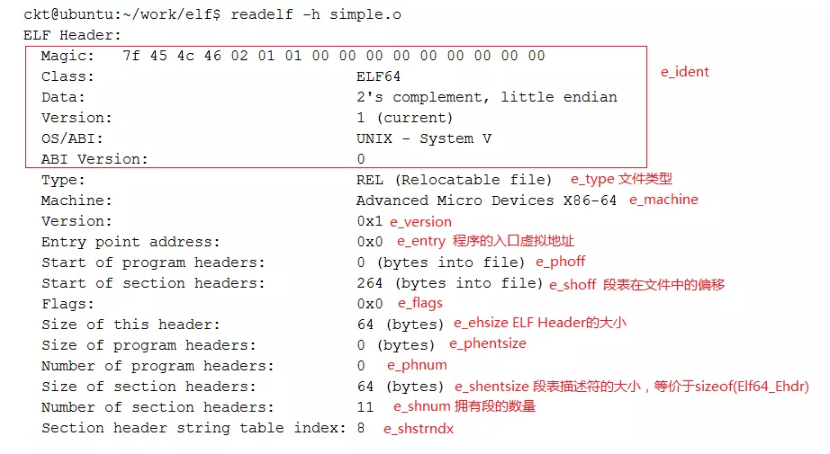
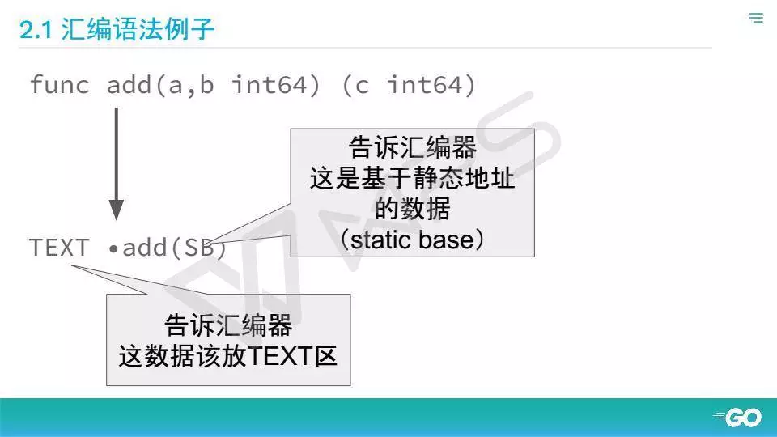
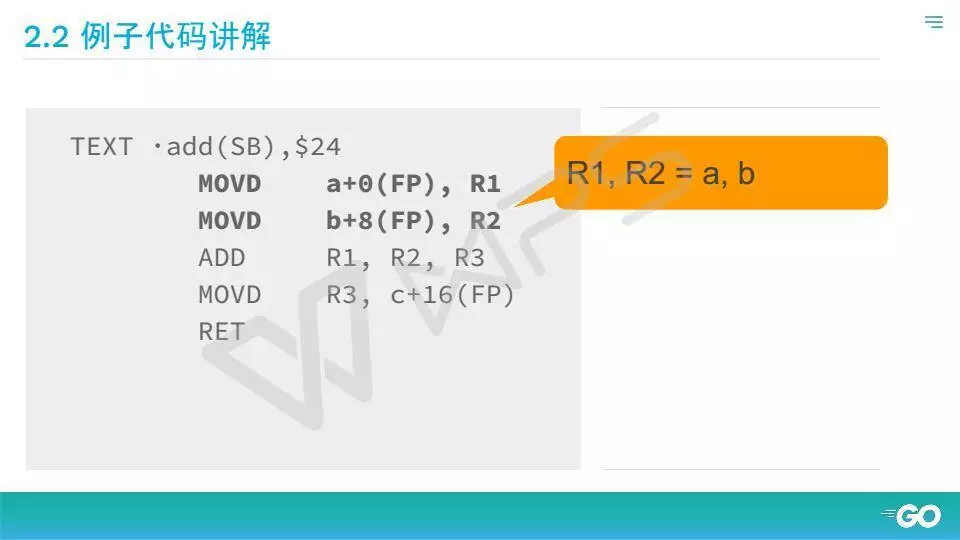
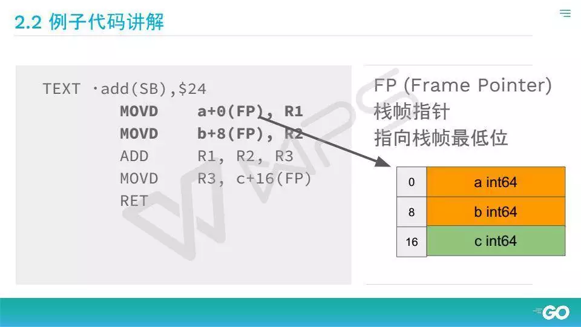
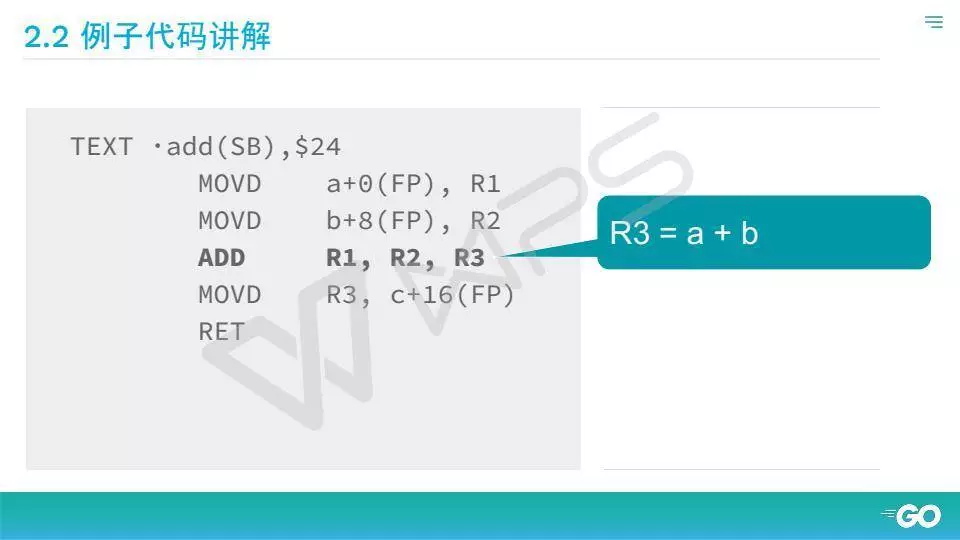
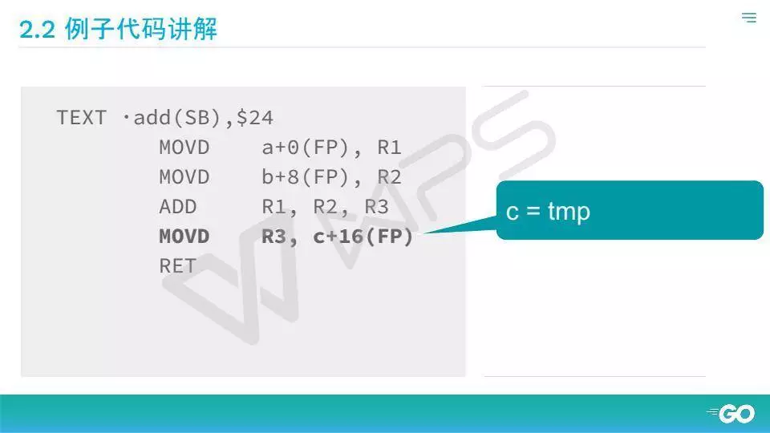
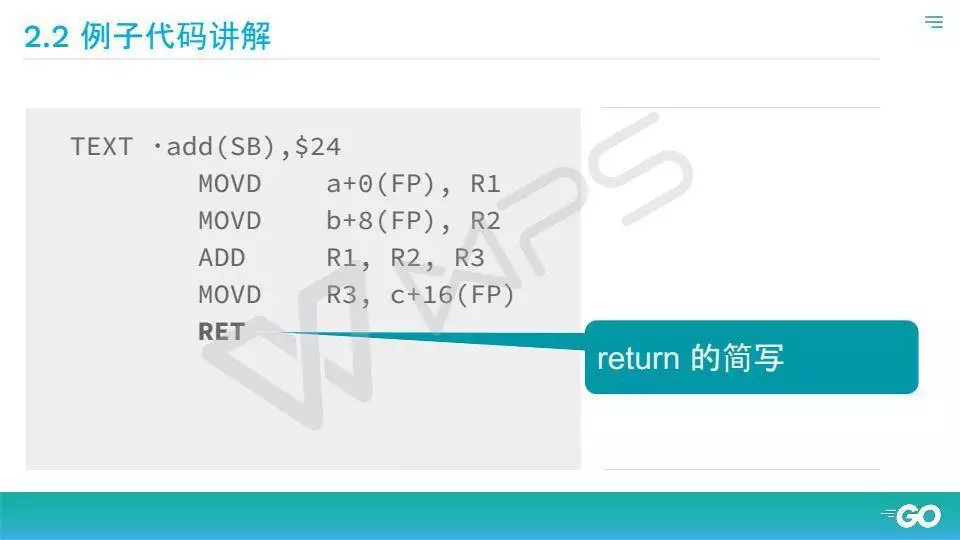

<!-- toc -->
[TOC]
# Go语言内存详解
[一文彻底理解Go语言栈内存/堆内存](https://mp.weixin.qq.com/s/Hjtf-QJ0ThZNeFwtV9pehw)

[一站式Golang内存洗髓经[Go三关典藏版]](https://mp.weixin.qq.com/s/9dZ4BqqiPVi36jieKeqCBw)


限制内存
[runtime/debug.SetMemoryLimit](https://pkg.go.dev/runtime/debug#SetMemoryLimit)
环境变量[GOMEMLIMIT](https://pkg.go.dev/runtime)
## 常用命令
### size
size filename
### readelf
https://man.linuxde.net/readelf
readelf命令，一般用于查看ELF格式的文件信息，常见的文件如在Linux上的可执行文件，动态库(*.so)或者静态库(*.a) 等包含ELF格式的文件。以下命令的使用是基于android编译出来的so文件上面去运行。

选项 -h(elf header)，显示elf文件开始的文件头信息。
选项 -l(program headers),segments 显示程序头（段头）信息(如果有数据的话)。
选项 -S(section headers),sections 显示节头信息(如果有数据的话)。
选项 -g(section groups),显示节组信息(如果有数据的话)。
选项 -t,section-details 显示节的详细信息(-S的)。
选项 -s,symbols 显示符号表段中的项（如果有数据的话）。
选项 -e,headers 显示全部头信息，等价于: -h -l -S 。
选项 -n,notes 显示note段（内核注释）的信息 。
选项 -r,relocs 显示可重定位段的信息。
选项 -u,unwind 显示unwind段信息。当前只支持IA64 ELF的unwind段信息。
选项 -d,dynamic 显示动态段的信息。
选项 -V,version-info 显示版本段的信息。
选项 -A,arch-specific 显示CPU构架信息。
选项 -I,histogram 显示符号的时候，显示bucket list长度的柱状图。
选项 -x,hex-dump=`<number or name>` 以16进制方式显示指定段内内容。number指定段表中段的索引,或字符串指定文件中的段名
选项 -D,use-dynamic 使用动态段中的符号表显示符号，而不是使用符号段 。
选项 -a，all 显示全部信息,等价于 -h -l -S -s -r -d -V -A -I。
选项 -v，version 显示readelf的版本信息。
选项 -H，help 显示readelf所支持的命令行选项。

readelf -a filename
readelf -h filename 来进行对Header的解析


https://www.jianshu.com/p/863b279c941e

### go tool compile
go tool compile -S -m -l cmd.go
go tool compile -S main.go

### go build -gcflags "-m -l"
加-l是为了不让foo函数被内联
我们只需要通过go build -gcflags '- m'命令来观察变量逃逸情况就行了。
```go
package main

import "fmt"

func foo() *int {
	t := 3

	return &t
}

func main() {

	x := foo()

	fmt.Println(*x)

}

```
go build -gcflags "-m -l" cmd.go
```go1.13
# command-line-arguments
.\cmd.go:6:2: moved to heap: t
.\cmd.go:15:13: main ... argument does not escape
.\cmd.go:15:14: *x escapes to heap

```
```go<1.13
# command-line-arguments

src/main.go:7:9: &t escapes to heap

src/main.go:6:7: moved to heap: t

src/main.go:12:14: *x escapes to heap

src/main.go:12:13: main ... argument does not escape
```
foo函数里的变量t逃逸了，和我们预想的一致。让我们不解的是为什么main函数里的x也逃逸了？这是因为有些函数参数为interface类型，比如fmt.Println(a ...interface{})，编译期间很难确定其参数的具体类型，也会发生逃逸。

使用反汇编命令也可以看出变量是否发生逃逸。
go tool compile -S main.go

发现 runtime.newobject(xx)基本上是分配到堆上了.

### objdump
https://man.linuxde.net/objdump
-d 从objfile中反汇编那些特定指令机器码的section。
objdump -x -s -d go.exe | grep .bss

### nm 
https://man.linuxde.net/nm
nm filename
显示二进制目标文件的符号表，包括符号地址、符号类型、符号名等

### 逃逸分析是怎么完成的

Go中逃逸分析最基本的原则是：如果一个函数返回对一个变量的引用，那么它就发生逃逸。

简单来说，编译器会分析代码的特性和代码的生命周期，GO中变量只有在编译器可以证明在函数返回后不会再被引用的，才分配到栈上，其他情况都是分配到堆上。

GO语言没有一个关键字或者函数可以直接让变量被编译器分配到堆上，相反，编译器通过代码分析来决定将变量分配到何处。

对一个变量取地址，可能被分配到堆上。但是如果编译器进行逃逸分析后，如果考察到在函数返回后，此变量不会被引用，那么还是会被分配到栈上。

简单来说，编译器会根据变量是否被外部引用来决定是否逃逸：

1、如果函数外部没有引用，则优先放到栈中；

2、如果函数外部存在引用，则必定放到堆中;

针对第一条，可能放到堆上的情形：定义了一个很大的数组，需要申请的内存过大，超过了栈的存储能力。

通过逃逸分析，可以尽量把那些不需要分配到堆上的变量直接分配到栈上，堆上的变量少了，会减轻分配堆内存的开销，同时减轻gc的压力，提高程序的原型速度。

## 1、内存分区

> 代码经过预处理、编译、汇编、链接4步后生成一个可执行程序。
>
> 在 Windows 下，程序是一个普通的可执行文件，以下列出一个二进制可执行文件的基本情况：


> 通过上图可以得知，在没有运行程序前，也就是说程序没有加载到内存前，可执行程序内部已经分好三段信息，分别为**代码区（text）**、**数据区（data）**和**未初始化数据区（bss）**3 个部分。
>
> 有些人直接把data和bss合起来叫做**静态区**或**全局区**。  

> 
```
# windows 编译exe
E:\研发人员项目文件\kernel4g.com\x\cpcn>size cpcn.exe
   text    data     bss     dec     hex filename
1439505   81844       0 1521349  1736c5 cpcn.exe
# linux 编译linux
E:\研发人员项目文件\kernel4g.com\x\cpcn>size go
   text    data     bss     dec     hex filename
1340655   82152  122840 1545647  1795af go

# windows 编译linux
E:\研发人员项目文件\kernel4g.com\x\cpcn>size cpcn
   text    data     bss     dec     hex filename
1339859   82248  122840 1544947  1792f3 cpcn

# linux 编译linux
[root@etcd-node02 go]# size go
   text	   data	    bss	    dec	    hex	filename
1340655	  82152	 122840	1545647	 1795af	go

# linux 编译windows
[root@etcd-node02 cpcn]# size cpcn.exe
   text	   data	    bss	    dec	    hex	filename
1440863	  81844	      0	1522707	 173c13	cpcn.exe

```
> 结论：windows 的bss才是0

**可以同过StudyPE+ x64.exe(或者LordPE)查看exe文件的bss区(go编译出来的是没有bss区)；也可以objdump -h 查看**

#### 为什么linux的bss不为0
https://stackoverflow.com/questions/51968080/linux-size-command-why-are-bss-and-data-sections-not-zero

In fact, if you are compiling with the libc attached to the binary, there are functions that are added before (and after) the main() function. They are here mostly to load dynamic libraries (even if you do not need it in your case) and unload it properly once main() end.

These functions have global variables that require storage; uninitialized (zero initialized) global variables in the BSS segment and initialized global variables in the DATA segment.

This is why, you will always see BSS and DATA in all the binaries compiled with the libc. If you want to get rid of this, then you should write your own assembly program, like this (asm.s):
```
.globl _start
 _start:
    mov %eax, %ebx

```
And, then compile it without the libc:
```
$> gcc -nostdlib -o asm asm.s
```
You should reduce your footprint to the BSS and DATA segment on this ELF binary.

---

int main(){return 0;} puts data in .text only.
```
$ echo 'int main(){return 0;}' | gcc -xc - -c -o main.o && size main.o
   text    data     bss     dec     hex filename
     67       0       0      67      43 main.o
```
You're probably sizeing a fully linked executable.
```
$ gcc main.o -o main && size main
   text    data     bss     dec     hex filename
   1415     544       8    1967     7af main
```

- o就是在成功编译之后，就进入了链接阶段。链接就是将目标文件、启动代码、库文件链接成可执行文件的过程，这个文件可被加载或拷贝到存储器执行。

### 1、0 程序内存分布

- 构造与其他程序一致
- TEXT=可执行代码
- DATA=堆+全局变量
- frame=函数参数+临时数据
- stack=Go调度器/信号处理

Go 的内存分布要大致了解，因为汇编是直接对内存进行的操作，所以你需要对内存的位置，哪个位置存什么东西有所了解。其实 Go 怎么使用内存和其他程序是差不多的。最下面的TEXT是存放可知性代码，DATA 是堆和全局变量。唯一不一样的地方是 Go 没有完全使用系统栈，而是拆成 frame 栈帧，栈帧保证程序存的参数和临时数据。那原来系统的栈拿去干嘛了？Go 的调度器和信号处理都是在系统栈上，不在栈帧上。


### 1、1 代码区（text）

> 存放 CPU 执行的机器指令。通常代码区是可共享的（即另外的执行程序可以调用它），使其可**共享**的目的是对于频繁被执行的程序，只需要在内存中有一份代码即可。代码区通常是**只读**的，使其只读的原因是防止程序意外地修改了它的指令。另外，代码区还规划了局部变量的相关信息。

#### 例子代码讲解
```go
func add(a, b int64) (c int64){
   c = a + b
   return c
}
```
TEXT区，这是告诉汇编器说你从这里开始找，不要从别的地方找，汇编器说，行，我直接把地址编进去，这个英文SB实际上是告诉汇编器是说这个东西是static base，基于静态地址寻址。



得例子里刚才我们看到三个参数，abc，都是 int64，一个 int64多少字节？8个字节哈，所以这个栈帧长24个字节。注意这里有对齐的问题，其他平台不一定是24，不过为了简单理解，我把24放到这里来。

第一步是move指令

就是把一个数据从一个地方挪到另外一个地方，简单就是把ab两个数据放寄存器R1、R2里面，这里面多一个东西，FP，就是 Frame Pointer，刚才讲到栈帧保存参数和临时存储的数据的地方。

是FP开始寻址，FP指栈帧的最低位。你把a拿出来，从0开始寻，挪到R1里面，把B拿出来，是不是8个字节，然后就把它存到R2里面。

第三步，R3=a+b。

最后把R3里面的数据放回C的参数返回，Return。



在就已经学会汇编语言了。


[Go语言汇编优化－蒙卓](https://blog.csdn.net/RA681t58CJxsgCkJ31/article/details/80681967)
三个汇编优化目标:
- 减少读写 
- 并行操作
- 硬件加速。


### 1、2 全局初始化数据区/静态数据区（data）

> 该区包含了在程序中明确被初始化的全局变量、已经初始化的静态变量（包括全局静态变量和局部静态变量）和常量数据（如字符串常量）。

### 1、3 未初始化数据区（bss）

> 存入的是全局未初始化变量和未初始化静态变量。未初始化数据区的数据在程序开始执行之前被内核初始化为 0 或者空（nil）。

> 程序在加载到内存前，代码区和全局区(data和bss)的大小就是固定的，程序运行期间不能改变。
>
> 然后，运行可执行程序，系统把程序加载到内存，除了根据可执行程序的信息分出代码区（text）、数据区（data）和未初始化数据区（bss）之外，还额外增加了**栈区**、**堆区**。

### 1、4 栈区（stack）

> 栈是一种先进后出的内存结构，由编译器自动分配释放，存放函数的参数值、返回值、局部变量等。
>
> 在程序运行过程中实时加载和释放，因此，局部变量的生存周期为申请到释放该段栈空间。

### 1、5 堆区（heap）

> 堆是一个大容器，它的容量要远远大于栈，但没有栈那样先进后出的顺序。用于动态内存分配。堆在内存中位于BSS区和栈区之间。
>
> 根据语言的不同，如C语言、C++语言，一般由程序员分配和释放，若程序员不释放，程序结束时由操作系统回收。
>
> Go语言、Java、python等都有垃圾回收机制（GC），用来自动释放内存。


## 2、 Go Runtime内存分配  

> Go语言内置运行时（就是Runtime），抛弃了传统的内存分配方式，改为自主管理。这样可以自主地实现更好的内存使用模式，比如内存池、预分配等等。这样，不会每次内存分配都需要进行系统调用。

> Golang运行时的内存分配算法主要源自 Google 为 C 语言开发的**TCMalloc算法**，全称**Thread-Caching Malloc**。
>
> 核心思想就是把内存分为多级管理，从而降低锁的粒度。它将可用的堆内存采用二级分配的方式进行管理。
>
> 每个线程都会自行维护一个独立的内存池，进行内存分配时优先从该内存池中分配，当内存池不足时才会向全局内存池申请，以避免不同线程对全局内存池的频繁竞争。

### 2、1 基本策略

> + 每次从操作系统申请一大块内存，以减少系统调用。
> + 将申请的大块内存按照特定的大小预先的进行切分成小块，构成链表。
> + 为对象分配内存时，只需从大小合适的链表提取一个小块即可。
> + 回收对象内存时，将该小块内存重新归还到原链表，以便复用。
> + 如果闲置内存过多，则尝试归还部分内存给操作系统，降低整体开销。
>
> **注意：**内存分配器只管理内存块，并不关心对象状态，而且不会主动回收，垃圾回收机制在完成清理操作后，触发内存分配器的回收操作

### 2、2 内存管理单元


> 分配器将其管理的内存块分为两种：
>
> + span：由多个连续的页（page [大小：8KB]）组成的大块内存。
> + object：将span按照特定大小切分成多个小块，每一个小块都可以存储对象。
>
> 用途：
>
> span 面向内部管理 
>
> object 面向对象分配
>
> ```go
> //path:Go SDK/src/runtime/malloc.go
> 
> _PageShift      = 13
> _PageSize = 1 << _PageShift		//8KB
> ```
>


> 在基本策略中讲到，Go在程序启动的时候，会先向操作系统申请一块内存，切成小块后自己进行管理。
>
> 申请到的内存块被分配了三个区域，在X64上分别是512MB，16GB，512GB大小。
>
> **注意：**这时还只是一段虚拟的地址空间，并不会真正地分配内存


> + arena区域
>
>   就是所谓的堆区，Go动态分配的内存都是在这个区域，它把内存分割成8KB大小的页，一些页组合起来称为mspan。
>
>   ```go
>   //path:Go SDK/src/runtime/mheap.go
>   
>   type mspan struct {
>   	next           *mspan    	// 双向链表中 指向下一个
>   	prev           *mspan    	// 双向链表中 指向前一个
>   	startAddr      uintptr   	// 起始序号
>   	npages         uintptr   	// 管理的页数
>   	manualFreeList gclinkptr 	// 待分配的 object 链表
>        nelems 		   uintptr 		// 块个数，表示有多少个块可供分配
>        allocCount     uint16		// 已分配块的个数
>   	...
>   }
>   ```
>
> + bitmap区域
>
>   标识arena区域哪些地址保存了对象，并且用4bit标志位表示对象是否包含指针、GC标记信息。
>
> + spans区域
>
>   存放mspan的指针，每个指针对应一页，所以spans区域的大小就是512GB/8KB*8B=512MB。
>
>   除以8KB是计算arena区域的页数，而最后乘以8是计算spans区域所有指针的大小。

### 2、3 内存管理组件

> 内存分配由内存分配器完成。分配器由3种组件构成：
>
> + cache
>
>   每个运行期工作线程都会绑定一个cache，用于无锁 object 的分配
>
> + central
>
>   为所有cache提供切分好的后备span资源
>
> + heap
>
>   管理闲置span，需要时向操作系统申请内存

#### 2、3、1 cache

> cache：每个工作线程都会绑定一个mcache，本地缓存可用的mspan资源。
>
> 这样就可以直接给Go Routine分配，因为不存在多个Go Routine竞争的情况，所以不会消耗锁资源。

> mcache 的结构体定义：
>
> ```go
> //path:Go SDK/src/runtime/mcache.go
> 
> _NumSizeClasses = 67					//67
> 
> numSpanClasses = _NumSizeClasses << 1	//134
> 
> type mcache struct {
> 	alloc [numSpanClasses]*mspan		//以numSpanClasses 为索引管理多个用于分配的 span
> }
> ```
>
> mcache用Span Classes作为索引管理多个用于分配的mspan，它包含所有规格的mspan。
>
> 它是 _NumSizeClasses 的2倍，也就是67*2=134，为什么有一个两倍的关系。
>
> 为了加速之后内存回收的速度，数组里一半的mspan中分配的对象不包含指针，另一半则包含指针。对于无指针对象的mspan在进行垃圾回收的时候无需进一步扫描它是否引用了其他活跃的对象。

#### 2、3、2 central

> central：为所有mcache提供切分好的mspan资源。
>
> 每个central保存一种特定大小的全局mspan列表，包括已分配出去的和未分配出去的。
>
> 每个mcentral对应一种mspan，而mspan的种类导致它分割的object大小不同。
>
> ```go
> //path:Go SDK/src/runtime/mcentral.go
> 
> type mcentral struct {
> 	lock      mutex     	// 互斥锁
> 	sizeclass int32     	// 规格
> 	nonempty  mSpanList 	// 尚有空闲object的mspan链表
> 	empty     mSpanList 	// 没有空闲object的mspan链表，或者是已被mcache取走的msapn链表
> 	nmalloc   uint64    	// 已累计分配的对象个数
> }
> ```

#### 2、3、3 heap

> heap：代表Go程序持有的所有堆空间，Go程序使用一个mheap的全局对象_mheap来管理堆内存。
>
> 当mcentral没有空闲的mspan时，会向mheap申请。而mheap没有资源时，会向操作系统申请新内存。mheap主要用于大对象的内存分配，以及管理未切割的mspan，用于给mcentral切割成小对象。
>
> 同时我们也看到，mheap中含有所有规格的mcentral，所以，当一个mcache从mcentral申请mspan时，只需要在独立的mcentral中使用锁，并不会影响申请其他规格的mspan。
>
> ```go
> //path:Go SDK/src/runtime/mheap.go
> type mheap struct {
> 	lock        mutex
> 	spans       []*mspan // spans: 指向mspans区域，用于映射mspan和page的关系
> 	bitmap      uintptr  // 指向bitmap首地址，bitmap是从高地址向低地址增长的
> 	arena_start uintptr  // 指示arena区首地址
> 	arena_used  uintptr  // 指示arena区已使用地址位置
> 	arena_end   uintptr  // 指示arena区末地址
> 	central [numSpanClasses]struct {
> 		mcentral mcentral
> 		pad      [sys.CacheLineSize-unsafe.Sizeof(mcentral{})%sys.CacheLineSize]byte
> 	}					//每个 central 对应一种 sizeclass
> }
> ```

### 2、4 分配流程

> + 计算待分配对象的规格（size_class）
> + 从cache.alloc数组中找到规格相同的span
> + 从span.manualFreeList链表提取可用object
> + 如果span.manualFreeList为空，从central获取新的span
> + 如果central.nonempty为空，从heap.free/freelarge获取，并切分成object链表
> + 如果heap没有大小合适的span，向操作系统申请新的内存

### 2、5 释放流程

> + 将标记为可回收的object交还给所属的span.freelist
> + 该span被放回central，可以提供cache重新获取
> + 如果span以全部回收object，将其交还给heap，以便重新分切复用
> + 定期扫描heap里闲置的span，释放其占用的内存
>
> 注意：以上流程不包含大对象，它直接从heap分配和释放

### 2、6 总结

> Go语言的内存分配非常复杂，它的一个原则就是能复用的一定要复用。
>
> - Go在程序启动时，会向操作系统申请一大块内存，之后自行管理。
> - Go内存管理的基本单元是mspan，它由若干个页组成，每种mspan可以分配特定大小的object。
> - mcache, mcentral, mheap是Go内存管理的三大组件，层层递进。mcache管理线程在本地缓存的mspan；mcentral管理全局的mspan供所有线程使用；mheap管理Go的所有动态分配内存。
> - 一般小对象通过mspan分配内存；大对象则直接由mheap分配内存。

## 3、Go GC垃圾回收

> Garbage Collection (GC)是一种自动管理内存的方式。支持GC的语言无需手动管理内存，程序后台自动判断对象。是否存活并回收其内存空间，使开发人员从内存管理上解脱出来。
>
> 垃圾回收机制
>
> + 引用计数
> + 标记清除
> + 三色标记
> + 分代收集
>
> 1959年, GC由 John McCarthy发明, 用于简化Lisp中的手动内存管理，到现在很多语言都提供了GC，不过GC的原理和基本算法都没有太大的改变 。
>
> ```c
> //C语言开辟和释放空间
> int* p = (int*)malloc(sizeof(int));
> //如果不释放会造成内存泄露
> free(p);
> ```
>
> ```go
> //Go语言开辟内存空间
> //采用垃圾回收 不要手动释放内存空间
> p := new(int)
> ```

### 3、1 Go GC发展

> Golang早期版本GC可能问题比较多，但每一个版本的发布都伴随着 GC 的改进
>
> + 1.5版本之后, Go的GC已经能满足大部分大部分生产环境使用要求
> + 1.8通过混合写入屏障, 使得STW降到了sub ms。
> 下面列出一些GC方面比较重大的改动  
>
> | 版本  | 发布时间 | GC                       | STW时间 |
> | ----- | -------- | ------------------------ | -------------------------- |
> | v 1.1 | 2013/5   | STW                      | 百ms-几百ms级别            |
> | v 1.3 | 2014/6   | Mark STW, Sweep 并行     | 百ms级别                   |
> | v 1.5 | 2015/8   | 三色标记法, 并发标记清除 | 10ms级别                   |
> | v 1.8 | 2017/2   | hybrid write barrier     | sub ms                     |
>
>  **当前Go GC特征**
>
>  三色标记， 并发标记和清扫，非分代，非紧缩，混合写屏障。
>
> **GC关心什么**
>
> **程序吞吐量:** 回收算法会在多大程度上拖慢程序? 可以通过GC占用的CPU与其他CPU时间的百分比描述 
>
> **GC吞吐量:** 在给定的CPU时间内,  回收器可以回收多少垃圾? 
>
> **堆内存开销:** 回收器最少需要多少额外的内存开销? 
>
> **停顿时间:** 回收器会造成多大的停顿? 
>
> **停顿频率:** 回收器造成的停顿频率是怎样的? 
>
> **停顿分布:** 停顿有时候很长,  有时候很短? 还是选择长一点但保持一致的停顿时间? 
>
> **分配性能:** 新内存的分配是快,  慢还是无法预测? 
>
> **压缩:** 当堆内存里还有小块碎片化的内存可用时, 回收器是否仍然抛出内存不足（OOM）的错误？如果不是, 那么你是否发现程序越来越慢, 并最终死掉, 尽管仍然还有足够的内存可用？ 
>
> **并发:**回收器是如何利用多核机器的？ 
>
> **伸缩:**当堆内存变大时, 回收器该如何工作？ 
>
> **调优:**回收器的默认使用或在进行调优时, 它的配置有多复杂？ 
>
> **预热时间:**回收算法是否会根据已发生的行为进行自我调节？如果是, 需要多长时间？ 
>
> **页释放:**回收算法会把未使用的内存释放回给操作系统吗？如果会, 会在什么时候发生？

### 3、2 三色标记

> + 有黑白灰三个集合，初始时所有对象都是白色 
>+ 从Root对象开始标记, 将所有可达对象标记为灰色 
> +  从灰色对象集合取出对象, 将其引用的对象标记为灰色, 放入灰色集合,  并将自己标记为黑色 
> +  重复第三步, 直到灰色集合为空, 即所有可达对象都被标记 
> + 标记结束后, 不可达的白色对象即为垃圾. 对内存进行迭代清扫，回收白色对象
> + 重置GC状态


#### 3、2、1 写屏障

> 三色标记需要维护不变性条件：
>
> 黑色对象不能引用无法被灰色对象可达的白色对象。
>
> 并发标记时, 如果没有做正确性保障措施，可能会导致漏标记对象，导致实际上可达的对象被清扫掉。
>
> 为了解决这个问题，go使用了写屏障。
>
> 写屏障是在写入指针前执行的一小段代码，用以防止并发标记时指针丢失，这段代码Go是在编译时加入的。
>
> Golang写屏障在mark和mark termination阶段处于开启状态。
>
> ```go
> var obj1 *Object
> var obj2 *Object
> 
> type Object struct {
> 	data interface{}
> }
> 
> func (obj *Object) Demo() {
>     	//初始化
> 	obj1 = nil
> 	obj2 = obj
> 	//gc 垃圾回收开始工作
> 	//扫描对象 obj1 完成后
>     
>     	//代码修改为：对象重新赋值
> 	obj1 = obj
> 	obj2 = nil
> 
> 	//扫描对象 obj2
> 
> }
> ```


> ```shell
> #将Go语言程序显示为汇编语言
> go build -gcflags "-N -l"
> go tool objdump -s 'main.Demo' -S ./Go程序.exe
> ```
>
> 
>
> 

#### 3、2、2 三色状态

> 并没有真正的三个集合来分别装三色对象。
>
> 前面分析内存的时候, 介绍了go的对象是分配在span中, span里还有一个字段是gcmarkBits, mark阶段里面每个bit代表一个slot已被标记.。
>
> 白色对象该bit为0, 灰色或黑色为1. (runtime.markBits) 
>
> 每个p中都有wbBuf和gcw gcWork，以及全局的workbuf标记队列，实现生产者-消费者模型, 在这些队列中的指针为灰色对象，表示已标记，待扫描。
>
> 从队列中出来并把其引用对象入队的为黑色对象, 表示已标记，已扫描(runtime.scanobject)。
>
> 

### 3、3 GC执行流程

> **GC 触发** 
>
> + gcTriggerHeap：
>
>       分配内存时,  当前已分配内存与上一次GC结束时存活对象的内存达到某个比例时就触发GC。
>
> + gcTriggerTime：
>
>       sysmon检测2min内是否运行过GC, 没运行过 则执行GC。
>
> + gcTriggerAlways：
>
>       runtime.GC()强制触发GC。

#### 3、3、1 启动

> 在为对象分配内存后，mallocgc函数会检查垃圾回收触发条件，并按照相关状态启动。
>
> ```go
> //path:Go SDK/src/runtime/malloc.go
> func mallocgc(size uintptr, typ *_type, needzero bool) unsafe.Pointer
>    ```
> 
> 垃圾回收默认是全并发模式运行，GC goroutine 一直循环执行，直到符合触发条件时被唤醒。

#### 3、3、2 标记

> 并发标记分为两个步骤：
>
> + 扫描：遍历相关内存区域，依次按照指针标记找出灰色可达对象，加入队列。
>
> ```go
> //path:Go SDK/src/runtime/mgcmark.go
> //扫描和对比bitmap区域信息找出合法指针，将其目标当作灰色可达对象添加到待处理队列
> 
> func markroot(gcw *gcWork, i uint32)
> func scanblock(b0, n0 uintptr, ptrmask *uint8, gcw *gcWork)
> ```
>
> + 标记：将灰色对象从队列取出，将其引用对象标记为灰色，自身标记为黑色。
>
> ```go
> //path:Go SDK/src/runtime/mgc.go
> func gcBgMarkStartWorkers() 
> ```

#### 3、3、3 清理

> 清理的操作很简单，所有未标记的白色对象不再被引用，可以将其内存回收。
>
> ```go
> //path:Go SDK/src/runtime/mgcsweep.go
> 
> //并发清理本质就是一个死循环，被唤醒后开始执行清理任务，完成内存回收操作后，再次休眠，等待下次执行任务
> var sweep sweepdata
> 
> // 并发清理状态
> type sweepdata struct {
> 	lock    mutex
> 	g       *g
> 	parked  bool
> 	started bool
> 
> 	nbgsweep    uint32
> 	npausesweep uint32
> }
> func bgsweep(c chan int)
> func sweepone() uintptr 
> ```