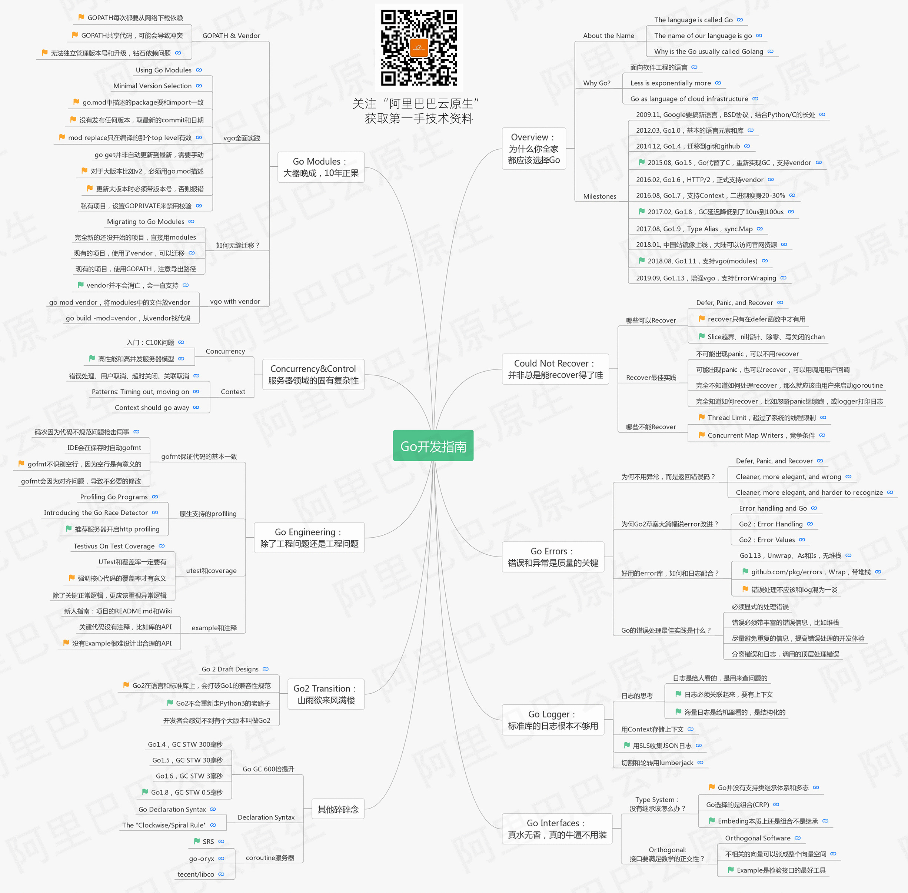

在现有go版本中安装其他版本
https://pkg.go.dev/golang.org/dl
go get golang.org/dl/go1.10.7
go get golang.org/dl/go1.13.6

1. go get github.com/golang/dl/go1.13.9
2. go1.13.9 download 
3. go1.13.6 version

原理：go get github.com/golang/dl 库
每个版本install

会在 go/bin 下安装github.com/golang/dl/go1.13.9 并生成 go1.13.9.exe
go1.13.9 download 下载源码到用户目录下的sdk/go1.13.9 下

运行go1.13.6 version 相当于运行 sdk/go1.13.9/bin/go.exe version

https://go.dev/

https://godoc.org/

[推荐算法、相似度算法、布隆过滤器、均值算法、一致性Hash、数据结构、leetcode练习](https://github.com/hwholiday/algorithm_coding)

[Go 101](https://go101.org/article/101.html)
[Go 101 Github](https://github.com/go101/go101)
[Go 101 中文](https://gfw.go101.org)
[Go 101 中文Github](https://github.com/golang101/golang101)

[《Go语言编程》高清完整版电子书.pdf](../files/go/《Go语言编程》高清完整版电子书.pdf)

[golang参考GO知识图谱](https://www.toutiao.com/a1653862521797643)

[Go内存泄漏？不是那么简单!](https://colobu.com/2019/08/28/go-memory-leak-i-dont-think-so/)

[内存泄漏方案](https://go101.org/article/memory-leaking.html)

[Uber 编程指南](https://github.com/uber-go/guide)

[Go 编程语言规范原文](https://golang.org/ref/spec)

[Go 编程语言规范【译】](https://moego.me/golang_spec.html)

[高频 golang 服务接口超时排查&性能调优](https://mp.weixin.qq.com/s/rDjTqqR0q4VTSQrYFzbR7w)

[Go 的内存对齐和指针运算详解和实践](https://learnku.com/articles/39255)

[内存布局](https://gfw.go101.org/article/memory-layout.html)

[Memory Blocks](https://go101.org/article/memory-block.html)

[Go的内存对齐和指针运算详解和实践](https://www.cnblogs.com/sy270321/p/12205435.html)

[[译]Go：内存管理与内存分配](https://juejin.im/post/5ddcdc5df265da05c33fcad2)

[带你领略Go源码的魅力----Go内存原理详解](https://juejin.im/post/5ddcf31751882572d8212481)

[go内存模型](https://cloud.tencent.com/developer/article/1359184)

[Go内存分配那些事，就这么简单！](https://www.cnblogs.com/shijingxiang/articles/11466957.html)

[Go性能优化之路.pdf](../files/go/Go性能优化之路.pdf)

[编写和优化Go代码](https://github.com/dgryski/go-perfbook/blob/master/performance-zh.md)

[编写可维护的Go程序的建议](https://dave.cheney.net/practical-go/presentations/qcon-china.html)

[Go工具概述](https://www.alexedwards.net/blog/an-overview-of-go-tooling)

[Go 学习、Go 进阶、Go 实用工具类](https://github.com/hwholiday/learning_tools)

[Go性能提升快速指南](https://stephen.sh/posts/quick-go-performance-improvements)

[深入浅出Golang Runtime.ppt](../files/go/gopher-meetup-深入浅出Golang-Runtime-yifhao-full.pptx)

[深入浅出Golang Runtime](https://www.acao.cn/course/program/402.html)

[编译出dll C# 结合 Golang 开发](https://www.cnblogs.com/timeddd/p/11731160.html)

