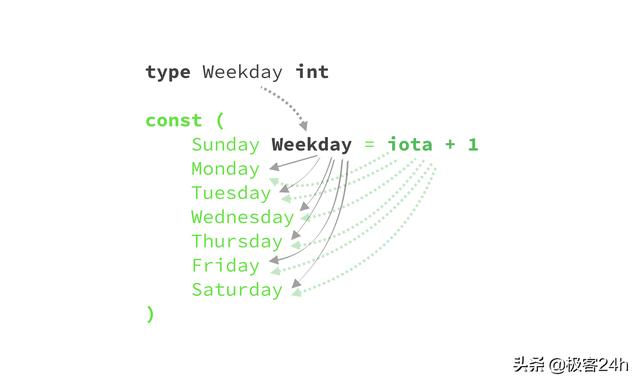
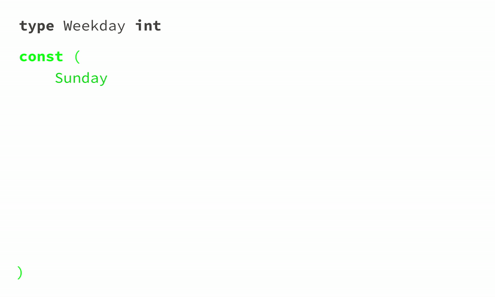

## 如何使用枚举
1. 声明一个新的自定义类型：Weekday
```go
type Weekday int
```

2. 为Weekday 声明相关常量

```go
const (
 Sunday Weekday = 0
 Monday Weekday = 1
 Tuesday Weekday = 2
 Wednesday Weekday = 3
 Thursday Weekday = 4
 Friday Weekday = 5
 Saturday Weekday = 6
)
fmt.Println(Sunday) // prints 0
fmt.Println(Saturday) // prints 6
```

3. 为枚举Weekday 创建共同行为
```go
func (day Weekday) String() string {
 // declare an array of strings
 // ... operator counts how many
 // items in the array (7)
 names := [...]string{
 "Sunday", 
 "Monday", 
 "Tuesday", 
 "Wednesday",
 "Thursday", 
 "Friday", 
 "Saturday"}
 // → `day`: It's one of the
 // values of Weekday constants. 
 // If the constant is Sunday,
 // then day is 0.
 //
 // prevent panicking in case of
 // `day` is out of range of Weekday
 if day < Sunday || day > Saturday {
 return "Unknown"
 }
 // return the name of a Weekday
 // constant from the names array 
 // above.
 return names[day]
}
```

## 如何使用iota

